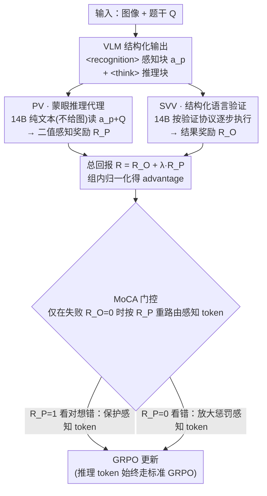

# Bad Seeing or Bad Thinking? Rewarding Perception for Vision-Language Reasoning

**会议**: ICML 2026 Oral  
**arXiv**: [2605.14054](https://arxiv.org/abs/2605.14054)  
**代码**: 待开源（作者承诺 release data/code/models）  
**领域**: 多模态VLM / 视觉语言推理 / 强化学习  
**关键词**: VLM, RL, 模态信用分配, GRPO, Structured Verbal Verification

## 一句话总结
本文把 VLM 的输出强制拆成 `<recognition>` 感知块和 `<think>` 推理块，再用一个"蒙眼"文本推理代理（拿不到图，只看 VLM 写下的感知文字）能不能答对题作为感知奖励 $R_P$，配上结构化语言验证 SVV 作为结果奖励 $R_O$；MoCA 用 $R_P$ 当门控做模态级信用分配，让 7B 模型在 9 个 perception/reasoning/rich-modality benchmark 上同时提升，在多个指标上超过 GPT-4o。

## 研究背景与动机

**领域现状**：先进 VLM 想做"感知-推理协同"，主要走两条路：(a) 像 Qwen-VL 这样在 latent 空间隐式融合视觉 token + 文本 embedding，靠静态文本推理处理；(b) Pixel Reasoner、DeepEyes 这种 agentic "thinking with images" 工作流，用多轮 function-calling 调外部工具主动重新观察图像。

**现有痛点**：(a) 流派受限于静态推理，遇到细节就崩；(b) 流派工程沉重——多轮 RL、异步长尾 episode、外部工具集成——而且经常出现著名的 "seesaw effect"：感知指标涨了推理就掉，反之亦然。投入大、收益小、模态间在内卷。

**核心矛盾**：作者把症结归结到一个被忽略的根问题——**模态信用分配的歧义**。当一个 VLM 答错时，到底是「bad seeing」（视觉证据没看准）还是「bad thinking」（逻辑链出错）？现有训练范式只给 outcome 奖励，把惩罚一股脑均匀洒到整条 trajectory 上，根本无法区分。结果就是模型可能因为推理失败而"unlearn"了原本正确的感知行为，反之亦然。

**本文目标**：(1) 把"感知"从 latent 黑箱里揪出来变成可监督的显式 token；(2) 设计一个不依赖人工标注、不依赖 ground-truth caption 的感知奖励；(3) 给自由形式答案配上低方差、高保真的 outcome verifier；(4) 用模态级的信用分配把"看错"和"想错"的惩罚分开。

**切入角度**：核心观察——**在显式视觉推理里，感知的产物就是逻辑推导所需的"离散前提"**。所以感知是否"充分"不需要 ground truth caption，只需测试"用 VLM 写下的感知文字 + 题干，一个不看图的纯文本 reasoner 能不能答对"。能答对就证明感知 sufficient，否则就是 bad seeing。这一招直接绕开了感知没有 label 的死结。

**核心 idea**：用 **"蒙眼推理代理（Blindfolded Reasoner）+ 结构化语言验证（SVV）+ 模态感知信用分配（MoCA）"** 替换 holistic outcome supervision，把 VLM 训练从端到端模糊监督升级到模块级精准信用分配。

## 方法详解

### 整体框架
训练目标基于 GRPO（Group Relative Policy Optimization）。VLM 在 system prompt 指令下交替输出 `<recognition>...</recognition>`（感知 action $a_p$）和 `<think>...</think>`（推理 action）。对每条 trajectory $\tau$ 同时计算两个奖励：(i) **Perception Verification (PV)**：把 $\{a_p\}$ + 题干 $Q$ 喂给一个强的 text-only reasoner（如 Qwen2.5-Instruct-14B，不给图），看它能不能输出正确答案，得到二值 $R_P\in\{0,1\}$；(ii) **Structured Verbal Verification (SVV)**：让同一个 LLM 按一个通用"验证协议"逐步执行（识别答案类型→抽取内容→重建参考→按类型语义比对），输出 outcome 奖励 $R_O$。总回报 $R(\tau)=R_O(\tau)+\lambda R_P(\tau)$，advantage 用组内归一化得 $A_{\tau,t}=R(\tau)-\frac1k\sum R(\tau_j)$。**MoCA** 在失败 trajectory ($R_O=0$) 上根据 $R_P$ 重路由优势，把"看错"和"想错"的梯度精准送到对应 token。

### 关键设计

**1. Perception Verification via "Blindfolded Reasoner"（PV）：在没有 caption 标注的情况下给感知块一个二值奖励**

感知最大的麻烦是它没有 ground truth——你没法告诉模型"这张图你应该看到什么"。作者的破局点在于一个观察：感知的产物本质上是给下游推理供给的"离散前提"，所以"一个看不到图的代理，光靠 VLM 写下的感知文字能不能把题答对"就是感知是否充分的天然功能指标。具体做法是把 VLM 自己写出的所有感知文本 $\{a_p\}$ 连同原题 $Q$ 一起喂给一个纯文本 reasoner（蒙眼，即 image withheld），代理答对则 $R_P=1$，答错则 $R_P=0$。这个 functional proxy 理论上等价于一个 Information Bottleneck 目标

$$\min_{p(A_p|V)} I(V;A_p)-\beta I(A_p;Y),$$

即奖励"对答案最有信息、对原图最少冗余"的感知表达；为强制 minimalism，还对超过 800 token 的感知块加显式惩罚。它的好处一是完全不需要人工标注，二是对"幻觉式 caption"零容忍——caption 写得再漂亮，只要信息不对、代理答不对，就拿不到奖励。作者用 979 个样本做人工标注，把 PV 与人类多数表决的一致率打到 86.31%、Cohen's κ=0.707，且失败模式偏向"过于保守的 False Negative"（9.19% FN vs 4.49% FP）——这种偏保守的噪声会被下面 MoCA 的 protect 机制缓冲掉，所以安全。

**2. Structured Verbal Verification（SVV）：把"答案对不对"从主观判断改成逐步执行的验证算法**

自由形式答案（数字、集合、表达式、自由文本）很难判对错：刚性 regex 在语义改写上 recall 暴跌，而让 LLM judge 直接回答"这两个答案等价吗"又太主观——在 $T=0.7$ 重复五次下它的一致率只有 78.6%，这种高方差 reward 正好会被 RL 训练拿去 reward hacking。SVV 的做法是不让 judge 做"估计"，而是给它一套通用的语言版验证算法，要求它**逐步执行**：先识别答案类型（数字 / 集合 / 表达式 / 多选 / 自由文本），再抽取内容，重建参考形态，最后按类型做语义比对。把一个主观判断分解成确定性的执行步骤后，随机性大幅下降——一致率升到 92.3%，accuracy 91.9%，F1 92.7%（VP-Challenge-Set，N=273），由此产出低方差的结果奖励 $R_O$。

**3. MoCA：把失败 trajectory 的惩罚精准送到"该背锅"的模块**

前面两个奖励解决了"信号准不准"，MoCA 解决"梯度落在谁身上"。标准 GRPO 在一条失败 trajectory 上会把负 advantage 均匀施加到所有 token，这正是 seesaw 的根源——当模型其实"看对了、只是想错了"时，均匀的负梯度会连带把正确的视觉 grounding 一起 unlearn。MoCA 用 $R_P$ 当门控，只在结果失败（$R_O=0$）时对感知 token $\tau_P$ 做两种重路由：**Case 1（bad thinking）** 是 $R_O=0$ 但 $R_P=1$，即感知对、推理错，此时给感知 token 加一个正向保护项 $A_{\tau,t}+\alpha_{\text{protect}}\cdot|A_{\tau,t}|$，避免毁掉正确感知；**Case 2（bad seeing）** 是 $R_O=0$ 且 $R_P=0$，感知也错，就把感知 token 的惩罚放大成 $A_{\tau,t}-\alpha_{\text{punish}}\cdot|A_{\tau,t}|$。推理 token 始终走标准 GRPO 不变。这个 gate 把 trajectory 级的粗信号降维到 token 段级的精准信号，从机制上消除 seesaw；而且 protect 项天然对 PV oracle 的 False Negative 有缓冲——即使 oracle 把好感知误判成 $R_P=0$，最多是 protect 不触发、少拿一点好处，不会反向把感知能力毁掉。

### 损失函数 / 训练策略
基础是 GRPO with group baseline，advantage 走上述模态感知修改。Qwen2.5-VL-Instruct-7B 是 base；PV reasoner 和 SVV judge 都用 Qwen2.5-Instruct-14B（同一模型双用，节省部署）。训练数据混合：ViRL39K（STEM 推理）+ VisualWebInstruct-Verified（通用视觉指令）+ Pixel Reasoner 数据（感知密集）+ 作者从 arXiv/报纸/infographic 爬取的 rich-modality 数据。

## 实验关键数据

### 主实验
跨 9 个 benchmark（perception-intensive / rich-modality / reasoning-intensive），MoCA-7B 同时全线提升，在多项指标上超 GPT-4o。

| 模型 | V* | HRBench | DUDE | MMLong | MMMU | EMMA | MathVista |
|------|-----|---------|------|--------|------|------|-----------|
| GPT-4o | 45.0 | 65.0 | 52.7 | 42.3 | 51.9 | 32.7 | 63.4 |
| Qwen2.5-VL-Instruct 72B | 81.2 | 73.4 | 44.5 | 24.9 | 67.0 | 38.5 | 74.8 |
| Qwen2.5-VL-Instruct 7B（base） | 71.4 | 69.2 | 41.8 | 21.2 | 54.3 | 21.5 | 68.2 |
| Pixel Reasoner 7B | 84.3 | 72.8 | 44.5 | 22.0 | 50.8 | 19.8 | 65.3 |
| DeepEyes 7B | 88.9 | 73.1 | 35.2 | 17.5 | 45.2 | 18.1 | 64.9 |
| **MoCA 7B** | **86.6** | **74.2** | **45.1** | **33.1** | **54.8** | **31.3** | **73.8** |

亮点：相对 base 在 V* 上 +15.2、HRBench +5.0、DUDE +3.3、MMLong +11.9、EMMA +9.8——9 个 benchmark 全线提升，未触发任何 seesaw。

### 消融实验

| 配置 | V* | HRBench | DUDE | MMMU | MathVista | 说明 |
|------|-----|---------|------|------|-----------|------|
| Full MoCA | 86.6 | 74.2 | 45.1 | 54.8 | 73.8 | 完整模型 |
| Instruction-Only（无 RL） | 68.3 | 66.5 | 37.7 | 49.9 | 65.7 | 仅靠 prompt 强制分解，反而掉点 |
| w/o PV（仅 $R_O$） | 79.7 | 70.1 | 42.5 | 55.3 | 74.4 | 感知任务大跌（V* -6.9, HRBench -4.1） |
| w/o MoCA（$R_O+\lambda R_P$ 朴素叠加） | 83.1 | 72.5 | 43.7 | 54.6 | 74.1 | gate 机制不可省，约 -3 |
| w/o SVV+PV（普通 LLM Judge） | 78.4 | 69.7 | 38.9 | 52.3 | 72.1 | 高方差 reward 引发 hacking |

PV oracle vs 人类 majority（N=979）：accuracy 86.31%，Cohen's κ=0.707（substantial agreement）。SVV 在 VP-Challenge-Set（N=273）上：accuracy 91.9%，F1 92.7%，一致率 92.3%，全面超 Rigid Rule（67/58.7/100）和 LLM Prompting（79.1/82.4/78.6）。

### 关键发现
- **PV 是感知任务收益的主要来源**：去掉 $R_P$ 后只在感知-密集 benchmark 上掉很多（V* -6.9），推理任务几乎不变，说明 PV 的奖励信号"靶子打得准"。
- **MoCA gate 不是锦上添花**：朴素加和 reward 在感知任务上还是会掉约 3 个点，因为失败 trajectory 里推理 token 的负梯度会污染感知 token，gate 机制对消除 seesaw 是必要的。
- **结构化执行 > 主观判断**：SVV vs 普通 LLM Judge 一致率从 78.6→92.3，避免 reward hacking 不稳定。
- **MoCA 让 7B 模型在多个指标上超过 GPT-4o 与 Qwen2.5-VL-72B**：在 DUDE (45.1 vs 44.5) 与 HRBench (74.2 vs 73.4) 上压过 72B 同源大模型，证明范式优势可弥补尺寸劣势。

## 亮点与洞察
- "蒙眼推理代理"把感知监督从无 label 困境一招破解：functional sufficiency 测试不需要标注 caption、不需要外部工具，只需一个文本 LLM，极其廉价又自带 IB 理论支撑。
- 把感知-推理协同从"外部 agentic 工作流"内化为"单次自回归生成内交替"，避开多轮 RL 与异步工程的全部坑，是一种少见的"复杂能力简化实现"。
- MoCA 的 gate 机制本质是把"trajectory 级粗信号"降维到"token 段级精准信号"，这种 decoupled credit assignment 思路可以推广到任何 modular policy 训练（如 code/tool/memory 模块）。

## 局限与展望
- 文本 reasoner 是"近视眼"——某些必须靠空间关系的视觉特征（如完整 maze、复杂几何关系）很难压缩成文本，超出本文 System-2 假设的覆盖范围；论文也承认此为未来方向。
- PV oracle 的 9.19% False Negative 会"冤枉好的感知"，虽然 MoCA protect 缓冲了大部分负面影响，但本质仍是依赖一个非完美 oracle；oracle 规模/能力上限会限制最终上限。
- 800 token 的感知长度上限是经验值，对真正复杂场景（多页文档、多图像）可能过紧；未来需更动态的 sufficiency 度量。
- 训练 + inference 都依赖第二个 14B reasoner，部署成本相对纯 7B VLM 几乎翻倍。

## 相关工作与启发
- **vs Pixel Reasoner / DeepEyes（agentic）**：他们靠外部工具调用做 active perception，需多轮 RL 与工具协议；MoCA 把同样的"看-想"loop 内化为单次自回归生成里的交替块，效率高一个量级。
- **vs VL-Rethinker / R1-VL（RL-based VLM）**：它们用单一 outcome reward + GRPO，受困于 seesaw；MoCA 通过模块奖励 + gate 解决 credit assignment 歧义，多任务全线一致提升。
- **vs RLHF / DPO**：传统 alignment 也是 outcome-only；MoCA 借鉴 process supervision 思想，但通过 functional proxy 解决"过程标签难拿"问题，可平移到代码、agent 等过程标签稀缺场景。

## 评分
- 新颖性: ⭐⭐⭐⭐⭐ "blindfolded reasoner"作为感知充分性的 functional proxy 设计极其巧妙
- 实验充分度: ⭐⭐⭐⭐⭐ 9 个 benchmark、组件消融、人工验证、verifier 对比一应俱全
- 写作质量: ⭐⭐⭐⭐ 问题定义→IB 理论→MoCA gate 的逻辑链非常顺，几张框架图也清晰
- 价值: ⭐⭐⭐⭐⭐ 提供一条"内化 agentic 能力 + 模态级 RL"的通用 recipe，对 VLM 训练范式有重置意义

<!-- RELATED:START -->

## 相关论文

- [\[ICML 2026\] From Seeing to Thinking: Decoupling Perception and Reasoning Improves Post-Training of Vision-Language Models](from_seeing_to_thinking_decoupling_perception_and_reasoning_improves_post-traini.md)
- [\[ICML 2026\] 3ViewSense: Spatial and Mental Perspective Reasoning from Orthographic Views in Vision-Language Models](3viewsense_spatial_and_mental_perspective_reasoning_from_orthographic_views_in_v.md)
- [\[ICML 2026\] Efficient Reasoning with Hidden Thinking](efficient_reasoning_with_hidden_thinking.md)
- [\[ECCV 2024\] Bad Students Make Great Teachers: Active Learning Accelerates Large-Scale Visual Understanding](../../ECCV2024/multimodal_vlm/bad_students_make_great_teachers_active_learning_accelerates_large-scale_visual_.md)
- [\[CVPR 2026\] All Roads Lead to Rome: Incentivizing Divergent Thinking in Vision-Language Models](../../CVPR2026/multimodal_vlm/all_roads_lead_to_rome_incentivizing_divergent_thinking_in_vision-language_model.md)

<!-- RELATED:END -->
