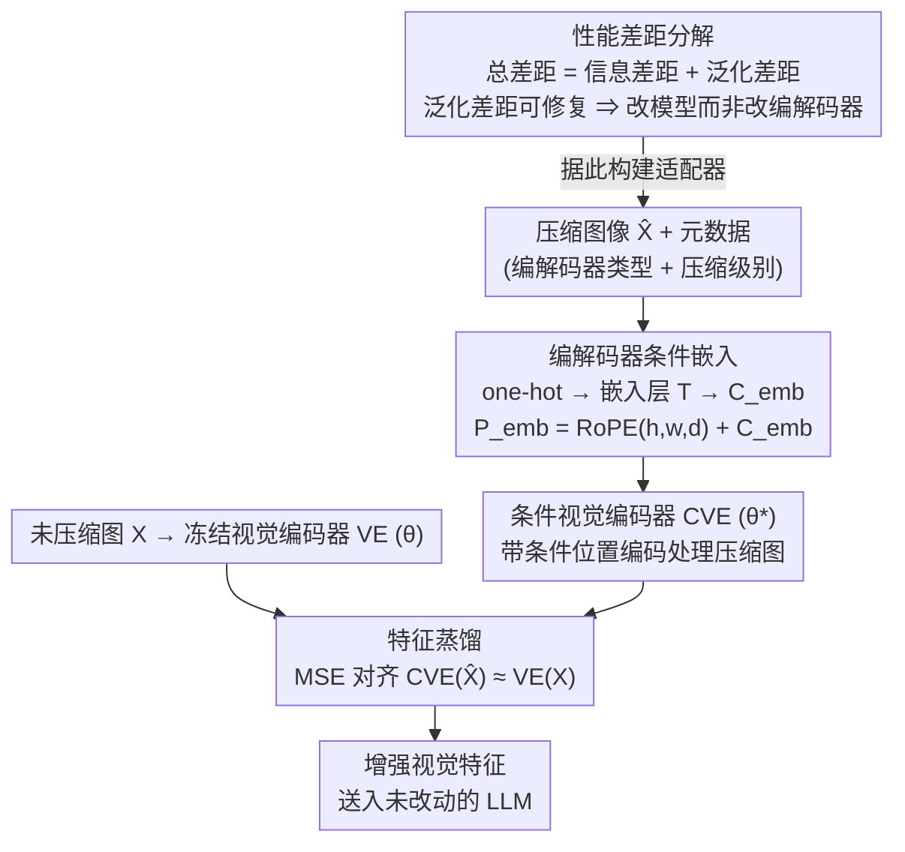

# Benchmarking and Enhancing VLM for Compressed Image Understanding

**会议**: ICML 2026  
**arXiv**: [2512.20901](https://arxiv.org/abs/2512.20901)  
**代码**: https://github.com/bblgbr/CompressVLMBench  
**领域**: 多模态VLM  
**关键词**: 视觉语言模型, 图像压缩, 压缩失真, 泛化差距, 视觉编码器适配器  

## 一句话总结

本文构建了首个评估 VLM 对压缩图像理解能力的大规模 benchmark（11 种编解码器、9 个 VLM、100 万+ 压缩图像），将性能下降分解为不可修复的"信息差距"和可弥补的"泛化差距"，并提出一个轻量级条件视觉编码器适配器，通过编解码器类型和压缩级别的条件嵌入 + 蒸馏训练，在不同编码器和比特率下将 VLM 性能提升 10%–30%。

## 研究背景与动机

**领域现状**：随着多媒体服务和 VLM 应用的爆发式增长，图像在传输和存储过程中不可避免地需要经历压缩。现有的 VLM 评估基准（SEEDBench、MMBench、OCRBench 等）主要使用高质量清晰图像，而现有的图像编码标准（JPEG、VVC、学习型编解码器、生成式编解码器）都是为人眼感知优化的。

**现有痛点**：VLM 在实际部署中接收到的往往是经过压缩的图像，但目前缺乏系统性评估 VLM 对压缩图像理解能力的 benchmark。已有的 Image Coding for Machines (ICM) 方法通常针对特定编解码器和特定视觉任务（如目标检测），泛化能力有限。

**核心矛盾**：VLM 性能下降中，有多少是因为压缩不可逆丢失了信息（无法弥补），有多少是因为 VLM 本身对压缩失真的泛化不足（可以通过适配弥补）？这两个来源的区分对于决定"改编解码器"还是"改模型"至关重要。

**本文目标**：(1) 构建全面的压缩图像 VLM 评估基准；(2) 将性能差距分解为信息差距和泛化差距；(3) 提出一种通用的适配器来缩小泛化差距。

**切入角度**：作者观察到 VLM 在低比特率下性能急剧下降，但通过对压缩图像进行微调可以恢复相当一部分性能，说明相当比例的性能下降来自泛化失败而非信息丢失。

**核心 idea**：通过将编解码器类型和压缩级别作为条件注入 VLM 视觉编码器的位置编码中，用蒸馏损失训练一个统一的条件视觉编码器，让 VLM 在不修改 LLM 的前提下适应多种压缩失真。

## 方法详解

### 整体框架

本文的方法分两步走：先用一个**性能差距分解框架**诊断压缩导致的掉点里有多少可修复，确认泛化差距（而非信息差距）才是大头、能靠改模型补回；再据此设计一个轻量级适配器去补这块泛化差距。适配器的输入是压缩图像 $\hat{X}$ 及其编解码器类型和压缩级别元数据，输出是增强后的视觉特征（与原始未压缩图像的特征对齐）。核心思路是只微调 VLM 的视觉编码器（ViT），把编解码器条件信息融入位置编码，再用蒸馏损失让压缩图像的特征逼近未压缩图像的特征；整个框架不动 LLM，计算开销小、通用性强。

### 关键设计

**1. 性能差距分解框架（Gap Decomposition Framework）：先分清退化是"信息没了"还是"模型不适应"**

压缩导致 VLM 掉点，到底该改编解码器还是改模型？作者先给出一个可量化的诊断工具，作为后续适配器路线的依据：把总性能差距 $\mathcal{L}(X, \theta) - \mathcal{L}(\hat{X}, \theta)$ 拆成信息差距 $\mathcal{L}(X, \theta) - \mathcal{L}(\hat{X}, \theta^*)$ 加泛化差距 $\mathcal{L}(\hat{X}, \theta^*) - \mathcal{L}(\hat{X}, \theta)$，其中 $\theta^*$ 是在压缩图上充分微调后的最优参数。信息差距对应压缩不可逆丢掉的信息，只能靠改进编解码器补；泛化差距对应 VLM 对压缩失真适应不足，可以靠适配器补。由于精确值不可解，作者把"在压缩图上微调到收敛"作为对泛化差距的经验下界估计（相应给出信息差距的上界）。实测 POPE 上 JPEG 的泛化差距高达 29.48（占总差距 36.29 的 81%），说明大头是可修复的——这正是适配器路线成立的依据。

**2. 编解码器条件嵌入（Codec Conditional Embedding）：让编码器知道"这张图是用哪种编解码器、压到多狠"**

不同编解码器和不同比特率造成的失真模式差别很大，如果编码器对此一无所知，学习就会被低比特率样本主导。作者把编解码器类型和压缩级别显式编进位置编码：假设有 $m$ 种编解码器、每种 $n$ 个压缩级别，先 one-hot，再过嵌入层 $T(\cdot)$ 映射到 $d$ 维潜空间得条件嵌入 $C_{\mathrm{emb}}$，然后加到 RoPE 上形成条件位置编码 $P_{\mathrm{emb}} = \mathrm{RoPE}(h, w, d) + C_{\mathrm{emb}}$，于是所有空间位置的视觉 token 都带上了压缩元信息。这一加法融合直接借鉴条件扩散模型里时间/条件嵌入的做法，不动 ViT 结构就实现了条件化，让编码器能按失真类型和压缩程度区别对待。

**3. 蒸馏式视觉编码器训练（Feature Distillation Training）：在特征空间把压缩图拉回未压缩图**

目标是让压缩图的特征逼近原图特征，但如果在任务输出层对齐就会和具体任务绑死。作者改在特征空间对齐：冻结原始视觉编码器 VE 的参数 $\theta$，训练条件视觉编码器 CVE 的参数 $\theta^*$，最小化 MSE 蒸馏损失 $\mathcal{L}_d = \| \mathrm{CVE}(\hat{X}, P_{\mathrm{emb}}, \theta^*) - \mathrm{VE}(X, \theta) \|_2^2$。训练数据是 11 万+ COCO 图，用 JPEG/ELIC/ILLM 三种编解码器在 4 个比特率下压缩，构成 12 维条件空间。在特征层对齐而非输出层对齐，让适配器与下游任务解耦——同一个适配器就能服务 VQA、OCR、Caption 等多种 VLM 任务，也区别于只为单一编解码器微调的 ICM 方法。

## 实验关键数据

### Benchmark 五大发现

| 发现 | 核心结论 |
|------|---------|
| Finding 1 | VLM 在比特率 < 0.1 bpp 时语义理解能力显著下降 |
| Finding 2 | 更强的 VLM 在压缩图像上通常表现更好，但 Janus-pro 抗压缩能力最强 |
| Finding 3 | 生成式编解码器（尤其是扩散模型）在低比特率下语义重建更好，但 OCR 等细粒度任务表现差 |
| Finding 4 | 模型缩放定律对压缩图像不成立：增大模型不一定减少压缩退化 |
| Finding 5 | VLM 任务与人眼感知指标有相关性，但 PSNR 主要与 OCR 相关，DISTS/FID 与粗粒度任务更相关 |

### 适配器性能提升（BD-Metric，QwenVL2.5-3B）

| 编解码器 | POPE | SEEDBench | GQA | MMBench | OCRBench | MME |
|---------|------|-----------|-----|---------|----------|-----|
| JPEG | +12.62 | +12.88 | +11.63 | +14.91 | +52.51 | +285.4 |
| ELIC | +3.42 | +0.69 | +3.88 | +2.45 | +10.51 | +75.97 |
| ILLM | +3.52 | +1.23 | +2.38 | +0.86 | +14.34 | +19.72 |
| StableCodec | +2.87 | +0.63 | +1.34 | +0.09 | +1.30 | +3.18 |

### 泛化到未见编解码器和不同 VLM

| VLM | 未训练编解码器 | POPE | SEEDBench | MME | OCRBench | GQA | MMBench |
|-----|-------------|------|-----------|-----|----------|-----|---------|
| QwenVL2.5-3B | HM | +2.98 | +3.12 | +130.6 | +2.10 | +5.48 | +1.25 |
| QwenVL2.5-3B | MLICpp | +3.32 | +1.22 | +50.0 | +5.73 | +2.01 | +2.52 |
| InternVL3-1B | JPEG | +8.36 | +5.62 | +133.1 | +3.93 | +8.58 | +1.40 |
| InternVL3-1B | ELIC | +2.19 | +1.19 | +25.6 | +6.75 | +4.17 | +0.86 |

### 消融实验（条件设计对比）

| 条件设置 | JPEG-POPE | JPEG-SEEDB | ELIC-POPE | ILLM-POPE |
|---------|-----------|------------|-----------|-----------|
| 无任何条件 | 11.86 | 11.01 | 2.91 | 3.16 |
| 仅压缩级别 | 12.22 | 11.41 | 3.07 | 3.19 |
| 仅编解码器类型 | 12.43 | 12.54 | 3.28 | 3.41 |
| 完整条件（本文） | **12.62** | **12.88** | **3.42** | **3.52** |

## 亮点与洞察

1. **差距分解框架有实用价值**：将性能下降分解为信息差距和泛化差距，为"改编解码器还是改模型"提供了定量决策依据。在 POPE 上 JPEG 的泛化差距高达 29.48（总差距 36.29 的 81%），说明大部分退化可以通过模型适配修复。
2. **条件注入设计巧妙**：将编解码器元数据通过加法融合到 RoPE 位置编码中，灵活借鉴了扩散模型的条件机制，无需修改 ViT 架构即可实现条件化。
3. **强泛化能力**：仅在 3 种编解码器上训练的适配器能泛化到未见过的编解码器（HM、MLICpp、DiffEIC）和不同的 VLM（InternVL3），说明学到的是通用的失真修复表示。

## 局限性 / 可改进方向

1. 当前实验未覆盖最新闭源 VLM（GPT-4V 等），泛化性验证有限。
2. 适配器需要编解码器类型和压缩级别的元数据作为输入，实际部署中可能不总是可用（消融实验显示无条件版本仍有效但高比特率可能退化）。
3. 对扩散式生成编解码器（DiffEIC）的泛化效果不如对传统和学习型编解码器，GAN 和扩散的失真模式差异较大。
4. 训练仅基于 COCO 数据集，在医学、遥感等特定领域的泛化性未验证。

## 相关工作与启发

- **图像编码 for Machines (ICM/VCM/FCM)**：MPEG 标准化方向，本文与 ICM 方法 TransTIC 的对比显示同时修复信息差距和泛化差距可以叠加收益（BD-POPE 从 0.18 提升到 3.02）
- **VLM 鲁棒性研究**：本文揭示了 VLM 缩放定律在压缩失真下不成立的反直觉现象，对模型部署策略有重要启示
- **条件特征对齐**：蒸馏损失 + 条件编码的范式可推广到其他域适应场景（噪声、模糊、对抗攻击等）

## 评分

- 新颖性: ⭐⭐⭐⭐ （首个系统性 benchmark + 差距分解框架是新颖贡献）
- 实验充分度: ⭐⭐⭐⭐⭐ （11 编解码器×9 VLM×7 任务×4 比特率，100 万+ 图像，极其全面）
- 写作质量: ⭐⭐⭐⭐ （结构清晰，五大发现条理分明）
- 价值: ⭐⭐⭐⭐ （对 VLM 实际部署有直接指导意义）

<!-- RELATED:START -->

## 相关论文

- [\[ICLR 2026\] Enhancing Multi-Image Understanding through Delimiter Token Scaling](../../ICLR2026/multimodal_vlm/enhancing_multi-image_understanding_through_delimiter_token_scaling.md)
- [\[CVPR 2026\] GaussianVision: Vision-Language Alignment from Compressed Image Representations using 2D Gaussian Splatting](../../CVPR2026/multimodal_vlm/gaussianvision_vision-language_alignment_from_compressed_image_representations_u.md)
- [\[ICML 2026\] TimeSpot: Benchmarking Geo-Temporal Understanding in Vision-Language Models in Real-World Settings](timespot_benchmarking_geo-temporal_understanding_in_vision-language_models_in_re.md)
- [\[CVPR 2026\] RetFormer: Multimodal Retrieval for Enhancing Image Recognition](../../CVPR2026/multimodal_vlm/retformer_multimodal_retrieval_for_enhancing_image_recognition.md)
- [\[CVPR 2026\] EgoSound: Benchmarking Sound Understanding in Egocentric Videos](../../CVPR2026/multimodal_vlm/egosound_benchmarking_sound_understanding_in_egocentric_videos.md)

<!-- RELATED:END -->
