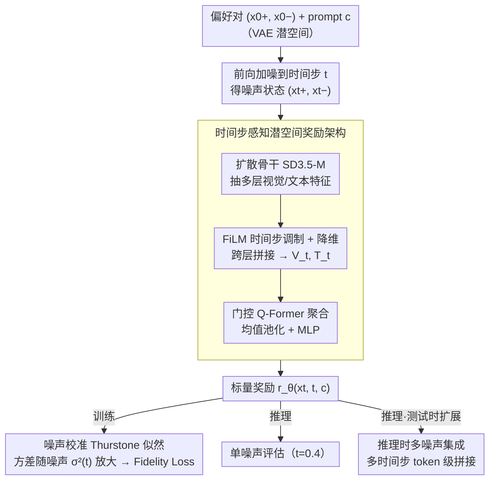

# Beyond VLM-Based Rewards: Diffusion-Native Latent Reward Modeling

**会议**: ICML2026  
**arXiv**: [2602.11146](https://arxiv.org/abs/2602.11146)  
**代码**: https://github.com/HKUST-C4G/diffusion-rm  
**领域**: 图像生成  
**关键词**: 扩散模型奖励建模, 偏好对齐, 噪声校准Thurstone, 潜空间奖励, 测试时噪声集成

## 一句话总结
提出 DiNa-LRM，将偏好学习直接建立在扩散模型的噪声潜空间上，通过噪声校准的 Thurstone 似然和推理时多噪声集成，以远低于 VLM 奖励模型的计算开销实现接近 SOTA 的偏好预测精度。

## 研究背景与动机

**领域现状**：扩散/Flow-Matching 模型的偏好对齐（如 ReFL、DPO、GRPO）依赖奖励模型提供监督信号。当前主流做法是使用 VLM（如 Qwen2VL-7B）作为奖励骨干，在像素空间对生成图像打分。

**现有痛点**：VLM 奖励模型存在两个核心问题。其一，计算和显存成本高昂，在对齐训练中需反复调用奖励评估，开销随之累积。其二，潜空间扩散生成器与像素空间 VLM 奖励之间存在 **域不匹配**（latent-to-pixel mismatch），需要额外的 VAE 解码步骤，并使基于奖励梯度的对齐方法更加复杂。

**核心矛盾**：扩散模型的生成预训练已经学到了丰富的判别性表征（已被证明可迁移到分类、对抗判别等任务），但现有工作并未充分挖掘其作为通用奖励模型的潜力——尤其是在与 VLM 相同的"对干净样本打分"场景下。

**本文目标**：构建一个直接在扩散潜空间中运行的奖励模型，使其 (1) 偏好预测精度接近 VLM 奖励、(2) 对齐训练时显存和计算更友好、(3) 提供推理时可扩展的鲁棒打分机制。

**切入角度**：作者观察到扩散模型在不同噪声水平下提供了同一样本的多个"视角"，如果能在偏好建模中显式引入噪声不确定性校准，就可以同时利用这些互补视角来增强鲁棒性。

**核心 idea**：将 Thurstone 偏好模型从干净样本扩展到扩散噪声状态，用与噪声水平成正比的比较不确定性来校准偏好似然，并在推理时通过多噪声集成实现测试时扩展。

## 方法详解

### 整体框架
输入为带文本 prompt $\bm{c}$ 的偏好对 $(\bm{x}_0^+, \bm{x}_0^-)$（在 VAE 潜空间中），通过前向加噪得到 $(\bm{x}_t^+, \bm{x}_t^-)$。预训练的扩散骨干（SD3.5-Medium）提取多层视觉/文本特征，经 FiLM 时间步调制后送入门控 Q-Former 打分头，输出标量奖励 $r_\theta(\bm{x}_t, t, \bm{c})$。这条「加噪 → 骨干抽特征 → Q-Former 打分」的主干就是**时间步感知潜空间奖励架构**；它产出的标量奖励在训练时喂给**噪声校准 Thurstone 似然** + Fidelity Loss，在推理时则可走单噪声评估、或开启**推理时多噪声集成**做测试时扩展。

### 关键设计

**1. 噪声校准 Thurstone 偏好建模：让奖励模型的输入分布对齐扩散预训练**

扩散骨干预训练时处理的全是带噪状态，而标准偏好建模在干净样本 $\bm{x}_0$ 上学习，这中间有分布偏移。本文把 Thurstone 模型从干净样本扩展到噪声状态：感知质量 $u = r_\theta(\bm{x}_0, \bm{c}) + \eta$ 的比较不确定性不再是常数，而设成噪声水平的函数 $\sigma_u^2(t) = k \cdot \sigma^2(t) + \sigma_u^2$（$k=2$、$\sigma_u=0.1$），于是偏好概率变成

$$\mathbb{P}(\bm{x}_t^+ \succ \bm{x}_t^-) = \Phi\Big(\frac{r_\theta(\bm{x}_t^+, t, \bm{c}) - r_\theta(\bm{x}_t^-, t, \bm{c})}{\sqrt{2\sigma_u^2(t)}}\Big)$$

噪声越大、分母越大、似然越保守，避免高噪声区域产生无信息梯度破坏训练稳定性。这一步不只是对齐输入分布，更让模型在不同噪声级别下学到多样且互补的特征——消融显示这个噪声校准方差是核心贡献（HPDv2 上 78.72→82.13），也正是后面集成能涨分的前提。

**2. 时间步感知潜空间奖励架构：从扩散骨干抽多层特征再聚合成标量**

奖励头要能感知噪声级别、又要支持变长输入以便后续集成。本文从骨干选定层集合 $\mathcal{S}$ 抽出视觉和文本 token 特征，每层都用基于时间步嵌入 $t_{\text{emb}}$ 的 FiLM 调制（让打分头显式知道当前噪声有多大），投影到低维子空间后跨层拼接成统一的视觉序列 $\mathbf{V}_t$ 和文本序列 $\mathbf{T}_t$。然后用 $N_q$ 个可学习 query token 通过门控值交叉注意力（value-gated cross-attention）聚合两条序列，经 FFN、均值池化、MLP 输出标量 $r_\theta = \text{MLP}(\text{Pool}(\tilde{\mathbf{Q}}))$。

选 query-based 架构而非固定结构，是因为它天然吃得下可变长度输入——这一点为下一个设计（多噪声集成时把多个时间步的 token 拼在一起）提供了无缝接口。

**3. 推理时多噪声集成：把扩散的多噪声视角变成测试时扩展旋钮**

扩散模型在不同噪声水平下其实给了同一样本的多个"视角"：低噪声保留细节、高噪声捕获全局语义。本文在推理时把干净样本 $\bm{x}_0$ 在 $K$ 个时间步 $\{t_k\}_{k=1}^K$ 上分别加噪、各自过骨干 + FiLM 适配，再把所有时间步的 token 特征拼成 $\mathbf{V}_{\text{ensemble}} \in \mathbb{R}^{(K \times N_v) \times C}$，用同一个 Q-Former 头一次性打分（默认 $t \in \{0.2, 0.5, 0.7\}$ 覆盖低/中/高噪声）。

关键是这里做的是 **token 级拼接**而非简单的多次打分求平均——让 Q-Former 自己学习跨噪声级别的注意力权重，比固定权重的分数平均更灵活，这也是它能比朴素集成多涨分（HPDv2 集成后 84.31）的原因。这套机制等于给扩散原生奖励提供了一个"花更多算力换更稳分数"的测试时扩展旋钮。

### 训练策略
使用 Fidelity Loss $\mathcal{L}_{\text{fid}} = \mathbb{E}[1 - \sqrt{y\hat{p}_\theta + (1-y)(1-\hat{p}_\theta)}]$ 优化，时间步从 $\mathcal{U}(0,1)$ 均匀采样。在 HPDv3 数据集（~0.8M 偏好对）上训练 1 epoch，8 GPU，AdamW（lr=$5 \times 10^{-5}$），EMA 衰减 0.995。骨干使用 LoRA 微调。

## 实验关键数据

### 主实验

| 模型类别 | 模型 | 骨干 | ImageReward | HPDv2 | HPDv3 | GenAI-Bench | 平均 |
|---------|------|------|-------------|-------|-------|-------------|------|
| CLIP-based | MPS | CLIP | 66.37 | 83.27 | 64.33 | 68.08 | 70.51 |
| VLM-based | HPSv3 | Qwen2VL-7B | 67.03 | **85.36** | **76.03** | **70.95** | **74.84** |
| VLM-based | UnifiedReward | LLaVA-OV-7B | 63.82 | 83.10 | 71.96 | 72.38 | 72.81 |
| Diffusion-based | LRM-SDXL | SDXL | 60.35 | 71.19 | 53.80 | 61.58 | 61.73 |
| Diffusion-based | **DiNa-LRM** | SD3.5-M-2B | 60.34 | 82.13 | 75.04 | 68.43 | 71.49 |
| Diffusion-based | **DiNa-LRM*** | SD3.5-M-2B | 61.75 | 84.31 | 74.86 | 68.98 | **72.48** |

DiNa-LRM 比此前扩散奖励基线 LRM-SDXL 平均精度提升 **+9.76%**，并接近最强 VLM 奖励 HPSv3（72.48 vs 74.84）。

### 消融实验

| 配置 | HPDv2 | HPDv3 | GenAI-Bench | 平均 |
|------|-------|-------|-------------|------|
| Uniform + Noise-Calibrated（完整模型） | 82.13 | 75.04 | 68.43 | 71.49 |
| Uniform + Fixed variance | 78.72 | 75.11 | 68.01 | 70.68 |
| Const $t=0$ + Fixed | 59.20 | 74.37 | 67.55 | 64.93 |
| Uniform + Noise-Calibrated + Ensemble | **84.31** | 74.86 | **68.98** | **72.48** |
| Freeze backbone（无 LoRA） | — | 73.52 | 67.09 | 70.27 |

### 对齐效率分析（ReFL on SD3.5-M, 1024×1024）

| 指标 | HPSv3 (VLM) | DiNa-LRM | 节省 |
|------|-------------|----------|------|
| 峰值显存 | ~40 GB | ~19.4 GB | **51.4%** |
| 奖励计算 TFLOPS | ~8.5 | ~2.5 | **71.1%** |
| 优化阶段 TFLOPS | ~14 | ~7.5 | **46.4%** |

### 关键发现
- **噪声校准方差是核心贡献**：在 HPDv2 上从 78.72→82.13（+3.4%），集成后更从 78.16→84.31（+6.2%），说明噪声感知的不确定性建模让不同时间步学到了更互补的特征
- 最优推理噪声水平在 $t \in [0.3, 0.7]$，过干净（$t=0$）或过嘈杂（$t=0.8$）都会降低精度
- 分布式时间步采样（Uniform/LogitNormal）显著优于固定时间步训练，平均精度从 64.93~68.75 提升至 70.58~71.49
- 在 ReFL 对齐中，DiNa-LRM 的代理分数收敛更快，且持出金标准（PickScore）同步上升，无明显奖励劫持

## 亮点与洞察
- **扩散模型作为通用奖励骨干的可行性**：证明扩散预训练表征不仅可以生成，还能高质量判别偏好，为"一个骨干两个用途"提供了新范式，可将对齐管线全部保持在潜空间中运行
- **噪声校准 Thurstone 的巧妙之处**：通过一个简单的线性关系 $\sigma_u^2(t) = k\sigma^2(t) + \sigma_u^2$ 就将扩散噪声调度与偏好学习的不确定性建模统一起来，优雅且有效
- **token 级集成优于分数级平均**：将多时间步特征拼接后让 Q-Former 统一注意力聚合，而非简单平均多次打分，这个设计可迁移到任何需要多视角融合的判别任务

## 局限与展望
- 奖励在特定骨干的潜空间中学习和评估，跨骨干迁移性有限（SD3.5→FLUX 需要重新训练）
- 潜空间建模可能忽视某些像素级伪影（如纹理失真），长程奖励优化可能出现奖励劫持（虚假目标插入、风格漂移）
- 在 ImageReward 测试集上的精度（~61%）仍明显低于 VLM 方法（~67%），提示某些语义理解能力仍不足
- 未来可探索：(1) 在更强统一骨干上训练提升泛化性，(2) 增加轻量像素空间正则化约束，(3) 生成式或稠密奖励建模

## 相关工作与启发
- **CLIP-based RM**（ImageReward, PickScore, HPSv2）：计算高效但受限于 CLIP 表征能力上界
- **VLM-based RM**（HPSv3, UnifiedReward）：精度最高但计算昂贵且在像素空间运行
- **扩散判别性表征**（DDPMClassifier, DiffAE）：先验工作证明扩散预训练特征可迁移到分类等判别任务
- **并发工作 LRM**（Zhang et al., 2025）：在噪声中间状态上做步级奖励用于轨迹优化，而本文目标是通用偏好对齐场景下的干净样本打分

<!-- RELATED:START -->

## 相关论文

- [\[ICML 2026\] Mitigating Perceptual Judgment Bias in Multimodal LLM-as-a-Judge via Perceptual Perturbation and Reward Modeling](mitigating_perceptual_judgment_bias_in_multimodal_llm-as-a-judge_via_perceptual_.md)
- [\[CVPR 2026\] Monet: Reasoning in Latent Visual Space Beyond Image and Language](../../CVPR2026/multimodal_vlm/monet_reasoning_in_latent_visual_space_beyond_image_and_language.md)
- [\[ICLR 2026\] GLYPH-SR: Can We Achieve Both High-Quality Image Super-Resolution and High-Fidelity Text Recovery via VLM-Guided Latent Diffusion Model?](../../ICLR2026/multimodal_vlm/glyph-sr_can_we_achieve_both_high-quality_image_super-resolution_and_high-fideli.md)
- [\[CVPR 2026\] Beyond Missing Modalities: Hypergraph Guided Diffusion for Uncertainty-Aware Multimodal Emotion Recognition](../../CVPR2026/multimodal_vlm/beyond_missing_modalities_hypergraph_conditioned_diffusion_for_uncertainty-aware.md)
- [\[ICML 2026\] Conditional Diffusion Sampling](conditional_diffusion_sampling.md)

<!-- RELATED:END -->
