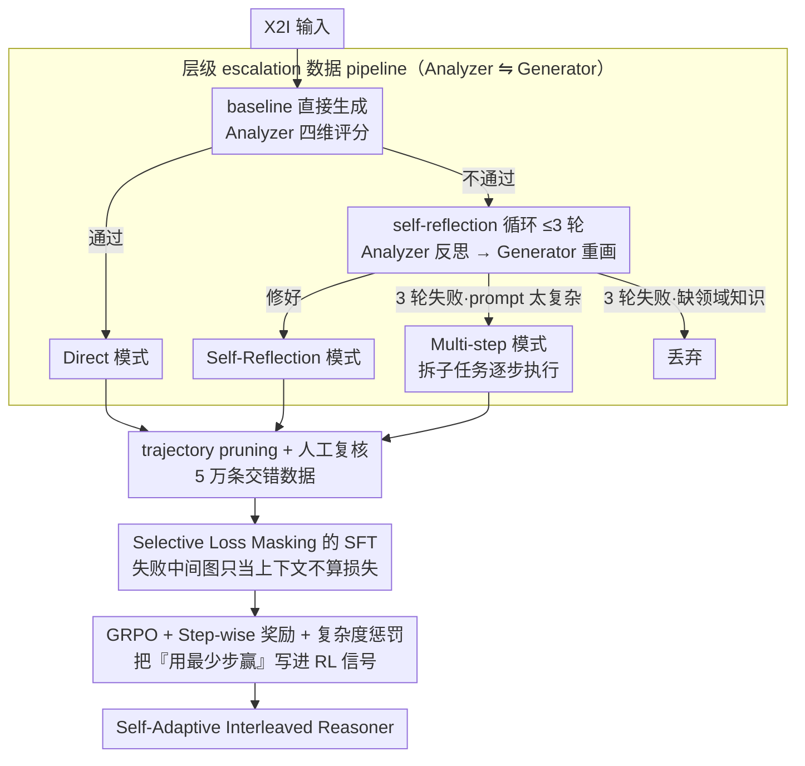

# Breaking Dual Bottlenecks: Evolving Unified Multimodal Models into Self-Adaptive Interleaved Visual Reasoners

**会议**: ICML 2026  
**arXiv**: [2605.14709](https://arxiv.org/abs/2605.14709)  
**代码**: GitHub (有，论文中标注 "released at GitHub" 但未给具体 URL)  
**领域**: 多模态VLM / 统一模型 / 强化学习  
**关键词**: 统一多模态模型, X2I, 交错推理, GRPO, 自适应规划

## 一句话总结
针对统一多模态模型 (unified model) 在 anything-to-image (X2I) 任务上的"理解–生成 gap"（看得懂但生不出），本文提出 Self-Adaptive Interleaved Reasoner：用一个 hierarchical 数据合成 pipeline 在直接生成 / 自我反思 / 多步规划三种模式间分流 5 万条样本，再用 SFT + GRPO 训练并配上 step-wise 推理奖励和 intra-group 复杂度惩罚，让 Emu3.5 在 KRIS-Bench / OmniContext 上超越 GPT-4o、Gemini 2.5 Flash 等闭源模型。

## 研究背景与动机

**领域现状**：统一多模态模型（Emu3.5、BAGEL、OmniGen 等）已经能在同一框架里做理解和生成，并开始引入 CoT 风格的交错推理来攻 X2I（任意条件 → 图）。

**现有痛点**：作者把统一模型在复杂 X2I 上的失败归为"理解–生成 gap"，并分解为两个具体瓶颈：(i) **attention entanglement bottleneck** ——复杂 prompt 直接一次性生成几乎必然失败，必须分步；但现有 Plan-then-Generate 方法做"盲规划"，规划者不知道生成器实际能不能执行，常给出无法落地的计划。(ii) **visual refinement bottleneck** ——一次像素合成必然有瑕疵，需要进一步反思修补；但现有 Generate-then-Reflect 把"错在哪"和"怎么改"混在一段非结构化文本里，对复合错误效率极低，且常常依赖多个模型来回切换，推理成本飙升。

**核心矛盾**：两种策略 (Plan-then-Generate 和 Generate-then-Reflect) 各只解决一个瓶颈，且都是固定流程；指令的复杂度差异很大，统一硬上一种模式要么对简单 prompt 过度推理，要么对复杂 prompt 不够推理。没有任何已有方法能"看着 prompt 复杂度自适应地选模式"。

**本文目标**：训出一个能根据指令复杂度和自身能力自主在「直接生成 / 反思修正 / 多步规划」之间切换的统一模型，并在不依赖外部模型的前提下保持生成效率。

**切入角度**：先用一个层级 escalation 数据 pipeline 把不同复杂度的 prompt 自动归到三种模式，再用 SFT 教模型语法，最后用 RL 教模型策略（什么时候用哪种模式最划算）。

**核心 idea**：把"何时该多想"做成模型自主决策的强化学习目标——用 step-wise 奖励确保推理过程逻辑合理，用 intra-group 复杂度惩罚压制"用更多步数换边际收益"的过度推理。

## 方法详解

### 整体框架
两阶段 pipeline：**(A) 数据构造**——给定原始 X2I 输入，先让 baseline 统一模型直接生成；用 Qwen3-VL-235B (Analyzer) 按"指令/一致性/质量/常识"四维评分；通过则归为 *Direct*；否则进入最多 3 轮 self-reflection 循环（Analyzer 写反思 prompt，Gemini-3-Pro-Image 作为 Generator 重画）；3 轮还不行就让 Analyzer 诊断失败原因，若是"prompt 太复杂"则升级到 *Multi-step* 模式（拆子任务逐步执行 + 中间评估），否则（如缺领域知识）直接丢弃。所有样本经过两名人工标注复核，得到 5 万条高质量交错数据。**(B) 训练**——SFT 适应交错推理语法 + selective loss masking 跳过失败中间图；GRPO 强化策略选择，奖励由 Outcome / Format / Step-wise reasoning 三项加权，再叠加一个 intra-group 复杂度惩罚来鼓励"少步赢"。

### 关键设计

**1. 层级 escalation 数据 pipeline（Analyzer ⇋ Generator）：让训练样本自己示范"按复杂度选模式"**

模型要学会自适应选模式，前提是训练数据里就分门别类地演示了三种模式。作者搭了一条自动升级流水线：用 Qwen3-VL-235B 一人分饰"评审 + 诊断医 + 规划师"，用 Gemini-3-Pro-Image 当生成器。每条 X2I 数据先直接生成、按"指令/一致性/质量/常识"四维打分，通过的归为 *Direct*；不通过就进最多 3 轮 self-reflection（Analyzer 写反思 prompt、Generator 重画），修好了归为 *Self-Reflection*；3 轮还不行就让 Analyzer 诊断病因——若是"prompt 太复杂"就升级到 *Multi-step*（拆子任务逐步执行 + 中间评估），若是"缺领域知识"这类没救的就直接丢。多步成功后还做一次 trajectory pruning，把前面失败的反思裁掉，只留干净的"先直接试一次失败 → 拆子任务 → 子步骤逐图"轨迹。最后两名人工复核，得到 5 万条交错数据。这样简单 prompt 学到的就是直接出图，中等的学到反思纠错，复杂的学到显式拆解。

**2. Selective Loss Masking 的 SFT：失败中间图只当"反思上下文"，不当"模仿目标"**

多步轨迹里夹着大量失败的中间图，如果 SFT 的自回归 NLL 对这些图也算损失，等于在教模型"如何生成低质量图"，会直接反噬生成保真度。作者的对策是让损失只落在被选中的子序列 $\mathcal{O}$ 上：Direct 模式只算 $\{G_1, E_1\}$；Self-Reflection 模式只算到最后一次诊断 $E_{K-1}$、反思 prompt $R_{K-1}$ 和最终成功图 $G_K, E_K$，前面所有失败中间图全部 mask；Multi-step 模式算 $E_1$ 加完整规划序列 $\{S_i, G_i, E_i\}$。失败信息因此只以文本形式进入上下文供模型"反思"，而像素层面的伪影不会被当成生成目标去模仿。

**3. GRPO + Step-wise 推理奖励 + Intra-group 复杂度惩罚：把"用最少步赢"写进 RL 信号**

SFT 教会了语法，但"什么时候该多想"是策略问题，得靠 RL。组合奖励 $\mathcal{R}_{\text{total}}=\alpha_1\mathcal{R}_o+\alpha_2\mathcal{R}_f+\alpha_3\mathcal{R}_s$ 里，$\mathcal{R}_o$ 是四维 outcome 评分的加权平均，$\mathcal{R}_f$ 是结构合法的二值项，$\mathcal{R}_s=\frac{1}{T}\sum_t \text{Analyzer}(\text{text}_t)$ 对每段中间文本（失败分析、反思 prompt、子步骤分解）单独打分，给出稠密的推理奖励。但光加 outcome 奖励会诱导模型"反正多步分更高"，陷入 over-reasoning。最关键的一招是 intra-group complexity penalty：在同一组采样轨迹里挑出"奖励接近最高"（落在 $\epsilon$ 阈值内）的子集，按图片数缩放——奖励里乘进 $N_{\text{img}}^*/N_{\text{img}}^i$，用更少图达到等效效果的轨迹被进一步加分。于是"用最少步赢得同样分数"成了隐式优化目标，简单 prompt 自然留给 Direct、复杂 prompt 才动用 Multi-step。消融里去掉这一项，平均生成图数从 1.56 暴涨到 2.73（+75%）而质量几乎不涨，正说明它在压制过度推理。

### 损失函数 / 训练策略
SFT：标准 AR-NLL 在 $\mathcal{O}$ 子集上 (Eq. 1)。RL：GRPO 策略 + 上述组合奖励 (Eq. 2–5)。骨干 = Emu3.5；RL 数据 5 万条，来自 UnicEdit-10M / X2Edit / AnyEdit / Pick-a-Pic / UltraEdit。

## 实验关键数据

### 主实验

| Benchmark | GPT-4o | Gemini 2.5 Flash | Emu3.5 (vanilla) | Ours |
|---|---|---|---|---|
| KRIS-Bench Overall | 80.09 | 77.29 | 73.75 | **80.18** |
| KRIS Procedural | 78.32 | 75.93 | 71.14 | **85.53** |
| KRIS Factual | 79.80 | 77.03 | 78.59 | **84.24** |
| OmniContext Avg. | 8.80 | 7.84 | 8.82 | **9.35** |
| GenEval | – | – | 0.86 | **0.89** |

### 消融实验

| 配置 | GenEval | KRIS | Omni | Avg. Imgs |
|---|---|---|---|---|
| Direct Only | 0.86 | 75.16 | 8.89 | – |
| w/o Reflection | 0.86 | 75.21 | 9.03 | – |
| w/o Multi-step | 0.87 | 77.24 | 8.95 | – |
| Full Mix (SFT) | 0.88 | 78.24 | 9.15 | – |
| SFT Only (50k) | 0.86 | 79.16 | 9.12 | 2.45 |
| w/o Step-wise Reward | 0.88 | 79.65 | 9.25 | 1.62 |
| w/o Complexity Penalty | 0.89 | 80.25 | 9.38 | 2.73 |
| SFT + RL (Full) | **0.89** | **80.18** | **9.35** | **1.56** |

### 关键发现
- 去 Reflection KRIS 掉 3 点 (78.24 → 75.21)，去 Multi-step Omni 掉 0.2 (9.15 → 8.95)：两种模式分别管"质量修补"和"复杂多主体"，无法互相替代。
- 去掉 intra-group complexity penalty 后平均生成图数从 1.56 暴涨到 2.73 (+75%)，但 Omni 仅微涨到 9.38——证实它确实在抑制 over-reasoning。
- SFT→SFT+RL 平均图数从 2.45 降到 1.56，质量同时上升，说明 RL 真的在学"用更少步赢"。
- 在 OmniContext 的 Multiple / Scene 这种多主体复杂场景上提升最大（9.56 / 9.44 vs Emu3.5 的 8.65 / 8.78），印证规划模式针对的就是"attention entanglement"。

## 亮点与洞察
- 把"何时该多想"提升为可优化的策略，并用 intra-group complexity penalty 把效率塞进 RL 信号里——这是当前 reasoning-in-generation 方向少见的"既要质量又要效率"的显式建模。
- 数据 pipeline 用 Analyzer ⇋ Generator 双 LLM 自动 escalation，把"按复杂度分流"做成了自动化流水线，不依赖固定的"先 plan 后生成"或"先生成后 reflect"模板，可直接复用到其他需要自适应推理深度的多模态任务。
- Selective loss masking 是一个被低估的小 trick：在涉及"中间失败产物"的多步任务里，是否把失败步纳入 NLL 直接决定了最终模型会不会被失败样例污染。

## 局限与展望
- 强依赖 Qwen3-VL-235B 和 Gemini-3-Pro-Image 这两个闭源大模型来构造数据和算 step-wise reward，复现难度和成本都很高，且会把 Analyzer 的偏见传染给训练目标。
- 论文给出的是 X2I 编辑/合成任务，是否能扩到视频、3D 等更长 horizon 的生成任务尚未验证。
- "失败 → 反思 → 重画"的循环最多 3 轮就升级到 multi-step，硬阈值可能会错过本来 4-5 轮反思就能修好的中等复杂样例；可以考虑用学到的 confidence 替代固定迭代上限。

## 相关工作与启发
- **vs Plan-then-Generate (Uni-CoT / Echo-4o)**：他们做静态文本规划再执行，本文同时做反思和规划，并由 RL 选择模式；OmniContext 上 +1.1–1.5 分。
- **vs Generate-then-Reflect (VACoT)**：他们做迭代反思无显式规划，本文显式分离"分析"和"改进"，并加入多步规划应对复杂 prompt。
- **vs Emu3.5 (骨干)**：同样统一模型，骨干只有 0.86 / 73.75 / 8.82；交错推理 + RL 把 KRIS 提到 80.18、Omni 到 9.35，证明"自适应策略"是统一模型的下一个增益维度。

## 评分
- 新颖性: ⭐⭐⭐⭐ 首次把"自适应选模式"做成 RL 显式优化目标，complexity penalty 设计巧妙；但单看各组件 (Plan-then-Generate / Generate-then-Reflect / GRPO) 都不是新东西。
- 实验充分度: ⭐⭐⭐⭐ 覆盖 GenEval / KRIS-Bench / OmniContext 三大 benchmark，消融分别拆数据模式和 RL 组件，且报告平均生成图数体现效率。
- 写作质量: ⭐⭐⭐⭐ 故事 (gap → 两个瓶颈 → 自适应方案) 清晰，Fig. 1 / Fig. 2 / Fig. 3 三个示意图分别讲对比、数据、RL，结构干净。
- 价值: ⭐⭐⭐⭐⭐ 在 KRIS-Bench 上让开源 Emu3.5 反超 GPT-4o，给统一模型社区指出了"用 RL 学策略"这条切实有效的路线。

<!-- RELATED:START -->

## 相关论文

- [\[ICML 2026\] DIVA: Harnessing the Representation Divergence in Unified Multimodal Models for Mutual Reinforcement](diva_harnessing_the_representation_divergence_in_unified_multimodal_models_for_m.md)
- [\[CVPR 2026\] EvoLMM: Self-Evolving Large Multimodal Models with Continuous Rewards](../../CVPR2026/multimodal_vlm/evolmm_self_evolving_lmm_continuous_rewards.md)
- [\[ICCV 2025\] Iris: Breaking GUI Complexity with Adaptive Focus and Self-Refining](../../ICCV2025/multimodal_vlm/iris_breaking_gui_complexity_with_adaptive_focus_and_self-refining.md)
- [\[ICLR 2026\] Self-Evolving Vision-Language Models for Image Quality Assessment via Voting and Ranking](../../ICLR2026/multimodal_vlm/self-evolving_vision-language_models_for_image_quality_assessment_via_voting_and.md)
- [\[ICML 2026\] Self-Prophetic Decoding to Unlock Visual Search in LVLMs](self-prophetic_decoding_to_unlock_visual_search_in_lvlms.md)

<!-- RELATED:END -->
