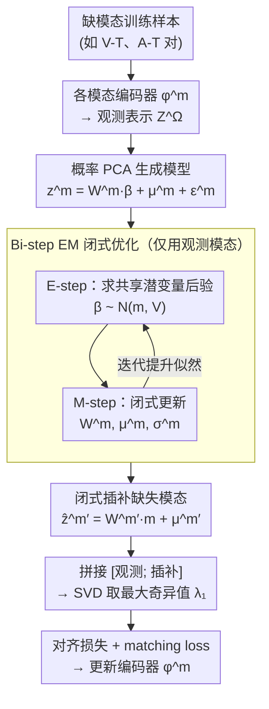

# Calibrated Multimodal Representation Learning with Missing Modalities

**会议**: ICML 2026  
**arXiv**: [2511.12034](https://arxiv.org/abs/2511.12034)  
**代码**: https://github.com/Xiaohao-Liu/CalMRL (有)  
**领域**: 多模态VLM / 表示学习 / 缺失模态  
**关键词**: 多模态对齐, 缺失模态, anchor shift, 概率 PCA, EM 算法

## 一句话总结
针对"想用 V-T、A-T 等部分模态数据训练统一多模态对齐"这种现实场景，本文用奇异值扰动给出"缺失模态会导致 anchor shift"的理论上下界，并提出 CalMRL：用概率 PCA 风格的生成模型对缺失模态在表示层做闭式 EM 插补，再把观测 + 插补一起喂给 GRAM/PMRL 的 SVD 对齐目标，在 VAST 之上把跨模态平均 Recall@1 从 44.8 推到 54.2 (+9.4)。

## 研究背景与动机

**领域现状**：从 CLIP 起步的多模态对齐，最近发展到 ImageBind / LanguageBind / VAST / GRAM / TRIANGLE / PMRL 这一系——后者用"GRAM 矩阵的最大奇异值"或类似几何工具让所有模态同时对齐到一个虚拟 anchor，比 pair-wise 对齐获得更强的多模态协同。

**现有痛点**：所有这些"同时对齐"方法都假设训练样本里**所有模态都齐全**。然而现实中绝大多数公开数据集只有 2 个模态：ImageNet 只有视觉+文本，Audioset 只有音频+文本，VAST 才有 4 模态但也只有 150K 样本。要利用更多 V-T、A-T 这种"残缺数据"，就只能像 ImageBind 那样固定一个 anchor (vision 或 text)，把所有别的模态绑过去——这又会把对齐效果上限定死在 anchor 模态的能力。

**核心矛盾**：在所有模态都齐全的时候，对齐 anchor 是模态空间里的一个"虚拟中心"；缺一个模态，观测模态只能对到一个**局部 anchor**，它与全模态 anchor 之间产生不可避免的偏移——作者称为 **anchor shift**。这本质是一个"采样不均的几何中心偏差"。

**本文目标**：在有缺失模态的训练数据上，找一种**计算便宜、有理论保证、可证收敛**的方式给缺失模态补一个合理的表示，让 anchor shift 收得越小越好。

**切入角度**：人在感知世界时即使没看见也能基于先验大致联想——这启发作者用"利用观测模态 + 模态间内在联系"的生成模型来对缺失模态做表示级插补，而不是去做像素级或 token 级的复杂合成。

**核心 idea**：把缺失模态在表示空间的概率分布建模成共享潜变量 $\beta$ + 模态专属噪声的概率 PCA 形式 → 用两步迭代 (E-step 闭式后验、M-step 闭式参数) 优化 → 推断时用 $\widehat{\mathbf z}^{m'}=\mathbf W^{m'}\mathbf m+\boldsymbol\mu^{m'}$ 闭式补全 → 把补全表示和观测表示拼起来送进 PMRL 的 SVD 对齐目标。

## 方法详解

### 整体框架
两层结构：**(1) 生成模型** 对每个模态 $m$ 假设 $\mathbf{z}^m=\mathbf{W}^m\bm{\beta}+\bm{\mu}^m+\bm{\epsilon}^m$ ($\bm{\beta}\sim\mathcal{N}(\mathbf{0},\mathbf{I})$，$\bm{\epsilon}^m\sim\mathcal{N}(\mathbf{0},(\sigma^m)^2\mathbf{I})$)，所有模态共享潜变量 $\bm{\beta}$，参数 $\widehat{\bm\theta}=\{\mathbf{W}^m, \bm{\mu}^m, \sigma^m\}_{m\in\mathcal{M}}$；**(2) 表示学习** ：观测模态由各自编码器 $\phi^m_{\bm\theta}$ 编码，缺失模态用 (1) 闭式补全 $\widehat{\mathbf{z}}^{m'}=\mathbf{W}^{m'}\mathbf{m}+\bm{\mu}^{m'}$，然后把 $[\mathbf{Z}^\Omega;\widehat{\mathbf{Z}}^{\mathcal{M}/\Omega}]$ 拼起来送 SVD 取最大奇异值 $\lambda_1$ 作为对齐目标 (PMRL 风格)。整套方法的支撑是 Theorem 1 对 anchor shift 的理论刻画——它说明为什么非补缺不可，是下面三个设计里第一个（理论）设计的内容，本身不是数据流上的一步，故不画进框架图。

### 关键设计

**1. Anchor Shift 的理论刻画（Theorem 1）：给"缺模态对齐有多坏"一个可计算的上下界**

要论证"为什么非补缺不可"，得先把"缺模态有害"从工程直觉抬到数学事实。作者用 SVD 扰动理论做到这点：令 $\mathbf{u}_1, \mathbf{u}_1^\Omega$ 分别是完整模态矩阵 $\mathbf{Z}$ 和观测子矩阵 $\mathbf{Z}^\Omega$ 的最大左奇异向量，定义 $\eta=\sqrt{\sum_{m\in\bar\Omega}\langle\mathbf{u}_1^\Omega,\mathbf{z}^m\rangle^2}$，则 anchor shift $\|\mathbf{\Delta}\|=\|\mathbf{u}_1-\mathbf{u}_1^\Omega\|$ 被同时夹在下界 $\sqrt{2(1-(\sigma_1^\Omega+\eta^2)/\sigma_1)}$ 和上界 $\sqrt{2}\|\mathbf{Z}^{\bar\Omega}\|_2/(\sigma_1-\sigma_2)$ 之间。更关键的是 Corollary 3 给出"插补后 shift 一定变小"的充分条件：只要每个 imputation 误差 $\|\widehat{\mathbf{z}}^{m'}-\mathbf{z}^{m'}\|_2\le\varepsilon$ 且 $\varepsilon<(\sigma_1-\sigma_2)/\sqrt{|\bar\Omega|}\cdot\sqrt{1-(\sigma_1^\Omega+\eta^2)/\sigma_1}$ 即可。这条阈值给整个方法背了书——"插补只要不太烂就一定有用"不再是赌博，而是有明确边界的保证。

**2. 概率 PCA 风格的共享潜变量生成模型：用最简单的高斯模型在表示层补缺**

补缺最直接的想法是训一个扩散或流模型去合成缺失模态，但那要重训一个大模型、成本高得离谱。作者只想在表示层补缺，于是选了最朴素也最可分析的形式：对每个模态假设 $\mathbf{z}^m=\mathbf{W}^m\bm{\beta}+\bm{\mu}^m+\bm{\epsilon}^m$（$\bm{\beta}\sim\mathcal{N}(\mathbf{0},\mathbf{I})$，$\bm{\epsilon}^m\sim\mathcal{N}(\mathbf{0},(\sigma^m)^2\mathbf{I})$），所有模态共享潜变量 $\bm{\beta}$ 装"模态间共性"、$\bm{\mu}^m$ 装"模态独有偏置"，并加独立性假设 $\mathbf{x}^m\perp\mathbf{x}^{m'}|\bm{\beta}$。模型容量只有 $\{\mathbf{W}^m, \bm{\mu}^m, \sigma^m\}$，相对编码器几乎为零，能和 encoder 一起训。正因为它够简单，既写得出闭式 E/M-step，又写得出闭式插补公式 $\widehat{\mathbf{z}}^{m'}=\mathbf{W}^{m'}\mathbf{m}+\bm{\mu}^{m'}$——任意一个模态缺了，都能从其他模态的后验里恢复出来。

**3. Bi-step（EM）闭式优化 + 仅用观测模态更新：在参数耦合下仍能逐步闭式求解**

共享潜变量 $\bm{\beta}$ 把所有模态的参数耦在一起，朴素概率 PCA 处理不了，作者用变分下界 + EM 风格双步优化绕开。**E-step** 固定 $\widehat{\bm\theta}$ 求后验 $p(\bm{\beta}\mid\mathbf{z},\widehat{\bm\theta})=\mathcal{N}(\mathbf{m},\mathbf{V})$，其中 $\mathbf{V}=[\mathbf{I}+\sum_{m\in\Omega}(\sigma^m)^{-2}\mathbf{W}^{m\top}\mathbf{W}^m]^{-1}$、$\mathbf{m}=\mathbf{V}\sum_{m\in\Omega}(\sigma^m)^{-2}\mathbf{W}^{m\top}(\mathbf{z}^m-\bm{\mu}^m)$，求和**只遍历观测模态**——这恰好契合"训练数据本来就缺模态"的现实约束；**M-step** 给定后验闭式更新 $\bm{\mu}^m, \mathbf{W}^m, (\sigma^m)^2$。Corollary 4 用 EM 单调性证明 $L(\widehat{\bm{\theta}}^{(t+1)})\ge L(\widehat{\bm{\theta}}^{(t)})$，整套迭代收敛。每步都有闭式解，意味着补缺这件事几乎不带来额外训练开销。

### 损失函数 / 训练策略
最终对编码器的损失 (Eq. 9)：$\mathcal{L}_{\text{rep}}=-\frac{1}{N}\sum_i[\text{exp}(\lambda_1/\tau)/\sum_j\text{exp}(\lambda_j/\tau)+\text{instance-uniformity}] +\alpha\cdot \text{BCE matching loss}$，第一项最大化 GRAM 矩阵的最大奇异值实现"全对齐"，第二项是 $\mathbf{u}_1$ 的 instance-level 正则，$\alpha=0.1$ matching loss 仅在观测模态上算。骨干 = VAST (vision+caption+audio+subtitle 4 模态)；训练流程：先 VAST-150K 全模态 warm-up，再在 MSR-VTT (V-T) 和 AudioCaps (A-T) 这两个**缺模态**数据集上继续训练。

## 实验关键数据

### 主实验 (Table 1, Recall@1, ↑ 表示在缺模态数据上续训)

| Method | MSR-VTT (T→V/V→T) | AudioCaps (T→A/A→T) | Avg. |
|---|---|---|---|
| VAST (baseline) | 50.5 / 49.0 | 33.7 / 32.2 | 44.8 |
| GRAM↑ | 59.7 / 57.2 | 49.1 / 51.7 | 52.9 |
| TRIANGLE↑ | 57.6 / 58.4 | 48.3 / 51.7 | 51.6 |
| PMRL↑ | 60.1 / 59.2 | 50.4 / 52.0 | 53.8 |
| **CalMRL↑** | **61.1 / 61.1** | **50.1 / 51.0** | **54.2 (+9.4)** |

(分类任务 Table 2: CalMRL 平均 45.19，比 PMRL 44.04、ImageBind 42.08 都更好。)

### 消融实验 (基于 MSR-VTT V-T 续训设置, 简化)

| 配置 | 关键指标 | 说明 |
|---|---|---|
| 仅观测模态对齐 (PMRL↑) | 平均 53.8 / shift 大 | 不补缺，作 baseline |
| CalMRL 补缺 (Full) | **平均 54.2 / shift 小** | 完整方法 |
| 仅 $S_{\text{param}}$ 或仅 $S_{\text{task}}$ 缺失 | – | （论文 Table 3, 单数据集场景：CalMRL 在 V-T 续训 +5.9–10.6 Recall@1）|
| 随机噪声补缺 (Random) | MSE 显著高 | 验证 imputation 不是随便补都有用 |
| 完整模态 (oracle) | 5↑ | 给出"ideal" 上限作参考 |

Figure 4 直接画了 anchor shift $\|\mathbf{\Delta}\|$ 的对比 (w/o calibration vs. w/ calibration)：CalMRL 把 shift 大幅压低，且 Figure 5 显示 CalMRL ≈ Full 模态训练的 ideal 上限。

### 关键发现
- 在 V-T 续训和 A-T 续训两种"只补一类模态"的设置下，CalMRL 都明显优于 PMRL/GRAM/TRIANGLE，说明插补给 SVD 对齐的增益是真实的、不是数据增加带来的副作用。
- 图 3 (MSE between real and imputed)：插补表示和真表示的 MSE 显著低于"随机"baseline，验证生成模型确实学到了模态间映射。
- 图 4：anchor shift 在校准后明显收窄；图 5 显示 calibrated 性能接近 full-modality "ideal"，证实理论 Corollary 3 的成立。

## 亮点与洞察
- 第一次把"为什么缺模态对齐会出问题"用 SVD 扰动理论 (Davis–Kahan 风格) 写清楚——anchor shift 的上下界给后续工作一个可以直接借用的分析框架。
- 用概率 PCA 这种"老物件"做插补，看似朴素，却恰好命中"只想在表示层补缺、不想训练大生成模型"的需求；闭式 E/M-step 让训练几乎零额外开销。
- "用 observed 算后验、用后验补 missing"这种 EM 思路可以直接迁移到任何"对齐 anchor 被采样偏差污染"的场景，如不平衡 contrastive learning、多任务表征学习。

## 局限与展望
- 模型假设 $\bm{\beta}$、$\bm{\epsilon}^m$ 都是高斯，对高维语义表示而言是相当强的简化；如果模态间真实关系高度非线性，插补质量可能受限。
- 后验 $\mathbf{m}, \mathbf{V}$ 的求解需要在所有观测模态上求和 $(\sigma^m)^{-2}\mathbf{W}^{m\top}\mathbf{W}^m$，当模态数 $k$ 很大或 $d$ 很高时 $\mathbf{V}^{-1}$ 求逆开销不可忽视。
- 实验只覆盖 V/T/A/Subtitle 4 模态，对 IMU、点云、3D 等异质模态是否同样适用未验证。
- imputation 误差边界 $\varepsilon$ 是基于平均 MSE 给的，对个别"异常 prompt"插补失败导致的对齐崩坏没有 explicit 保护。

## 相关工作与启发
- **vs ImageBind / LanguageBind**：他们固定一个 anchor 模态 (vision/text) 并冻结其编码器，受 anchor 模态能力上限制约；CalMRL 不固定 anchor，用插补把缺模态补齐再做全对齐。
- **vs PMRL / GRAM**：同样做"SVD 最大奇异值"对齐，但前者必须要求所有模态齐全；CalMRL 把它扩展到缺模态场景且在 V-T 续训 +0.4–2 Recall@1。
- **vs CCA 类传统多视图方法**：CCA 也用 SVD 但 pair-wise，CalMRL 直接做全模态联合 + 缺失补全，理论上覆盖任意 $|\Omega|<k$。

## 评分
- 新颖性: ⭐⭐⭐⭐ Anchor shift 的奇异值扰动分析是新视角；用概率 PCA 做表示级插补简单但很对症。
- 实验充分度: ⭐⭐⭐⭐ 覆盖 6 个检索数据集 + 4 个分类数据集，且单/双模态续训设置都做了；不过更多模态 (e.g., 加 IMU) 的拓展性没验证。
- 写作质量: ⭐⭐⭐⭐⭐ 从 anchor shift 直觉 → 定理 → EM → 收敛证明，逻辑链条完整，Figure 1 一张图就把核心问题讲清楚。
- 价值: ⭐⭐⭐⭐ 让大量"只有两模态"的现成数据集能被同时对齐方法所用，潜在能撬动 ImageNet/AudioCaps 等海量公开数据，扩展统一多模态预训练的数据规模。

<!-- RELATED:START -->

## 相关论文

- [\[AAAI 2026\] MCMoE: Completing Missing Modalities with Mixture of Experts for Incomplete Multimodal Action Quality Assessment](../../AAAI2026/multimodal_vlm/mcmoe_completing_missing_modalities_with_mixture_of_experts_for_incomplete_multi.md)
- [\[ICML 2026\] AOEPT: Breaking the Implicit Modality-Reduction Bottleneck in Modality-Missing Prompt Tuning](aoept_breaking_the_implicit_modality-reduction_bottleneck_in_modality-missing_pr.md)
- [\[ICCV 2025\] Synergistic Prompting for Robust Visual Recognition with Missing Modalities](../../ICCV2025/multimodal_vlm/synergistic_prompting_for_robust_visual_recognition_with_missing_modalities.md)
- [\[ICML 2026\] DIVA: Harnessing the Representation Divergence in Unified Multimodal Models for Mutual Reinforcement](diva_harnessing_the_representation_divergence_in_unified_multimodal_models_for_m.md)
- [\[CVPR 2026\] BALM: A Model-Agnostic Framework for Balanced Multimodal Learning under Imbalanced Missing Rates](../../CVPR2026/multimodal_vlm/balm_a_model-agnostic_framework_for_balanced_multimodal_learning_under_imbalance.md)

<!-- RELATED:END -->
