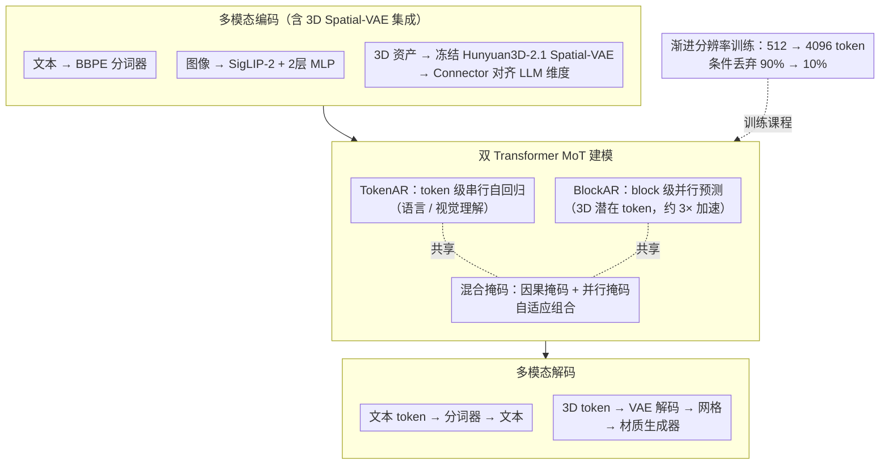

# CG-MLLM: Captioning and Generating 3D Content via Multi-modal Large Language Models

**会议**: ICML 2026  
**arXiv**: [2601.21798](https://arxiv.org/abs/2601.21798)  
**代码**: 待确认  
**领域**: 多模态VLM / 3D视觉  
**关键词**: 3D生成, 多模态大语言模型, Mixture-of-Transformer, 空间智能, 3D理解  

## 一句话总结
CG-MLLM 提出了一种基于 Mixture-of-Transformer 的多模态大语言模型，通过 TokenAR（逐token自回归）和 BlockAR（块级并行）双 Transformer 架构，结合预训练 VLM 骨干与 3D VAE 潜空间，首次实现在单一 MLLM 框架内端到端进行高分辨率 3D 内容生成与 3D 字幕理解，在 MLLM 类 3D 生成方法中达到 SOTA。

## 研究背景与动机

**领域现状**：大语言模型已在文本、图像、视频等模态取得突破性进展，众多 MLLM 在 2D 视觉-语言理解与生成任务上表现优异。然而，3D 内容生成领域进展缓慢，与 2D 多模态生成之间存在明显差距。

**现有痛点**：当前 MLLM 用于 3D 生成主要有两条路线：(1) 以文本/离散 token 形式生成网格，但 token 预算限制了网格的复杂度和分辨率；(2) 使用低分辨率体素 VAE 或乐高结构生成粗糙 3D 代理形状，仍需额外 3D 扩散模型才能获得精细几何。两者均无法在 LLM 阶段端到端生成高分辨率 3D 对象。

**核心矛盾**：3D 几何本质上形成长程、高度相互依赖的序列，纯 token 级自回归建模会导致严重的效率问题；而现有 MoT 方法将 Transformer 按任务（理解 vs 生成）绑定，不够灵活。

**本文目标**：构建一个统一的语言-图像-3D 多模态大语言模型，在单一模型内同时实现精确的空间理解和高保真空间内容生成。

**切入角度**：作者观察到 token 级串行建模与 block 级并行建模可以解耦到不同的 Transformer 分支，按生成模式（serial vs parallel）而非按任务绑定，从而灵活接入不同预训练编码器。

**核心 idea**：用双 Transformer 的 MoT 架构（TokenAR + BlockAR）整合预训练 Qwen3-VL 骨干与 Hunyuan3D-2.1 VAE 潜空间，在 MLLM 内原生实现高分辨率 3D 生成。

## 方法详解

### 整体框架
CG-MLLM 采用 decoder-only 架构，由三个阶段组成：(1) **多模态编码**——文本使用 BBPE 分词器、图像通过 SigLIP-2 编码器 + 2层 MLP 压缩、3D 资产通过冻结的 Hunyuan3D-2.1 Spatial-VAE 编码为潜在表示；(2) **MoT 建模**——TokenAR Transformer 处理 token 级序列建模，BlockAR Transformer 处理 block 级并行建模，二者共享注意力机制；(3) **多模态解码**——文本 token 通过分词器解码，3D token 通过 VAE 解码器还原为网格，再经材质生成器增强视觉质量。整个 pipeline 在「渐进分辨率训练」课程下从 512 token 的粗结构逐步训练到 4096 token 的精细几何。

### 关键设计

**1. 双 Transformer MoT 架构（TokenAR + BlockAR）：按生成模式而非任务来拆分支**

3D 几何本质是长程、高度相互依赖的序列，纯 token 级串行自回归既慢又难建模；而现有 MoT 把 Transformer 按任务（理解 vs 生成）绑定，换编码器就得改架构、不够灵活。这里两个分支都从预训练 Qwen3-VL 权重初始化：TokenAR 保留原始 token 级自回归能力做语言/视觉理解，BlockAR 对 3D 潜在 token 做 block 级并行预测、各 block 内共享位置索引以保持点特征的排列不变性。注意力层用混合掩码——因果掩码管顺序 token、并行掩码管同一 block 内 token——二者自适应组合。按"串行/并行"这个生成模式绑定的好处是：可以灵活接入任意预训练编码器，且 block 级并行在 4096 token 分辨率下带来约 3 倍加速。

**2. 3D Spatial-VAE 集成与位置编码策略：复用成熟几何先验并保持点云无序性**

从零训练 3D 编码器成本高，这里直接复用 Hunyuan3D-2.1 的 Spatial-VAE（下采样因子 20、潜在维度 64）：从物体表面提取点云编码为潜在表示，经 Connector 层与 LLM 隐藏维度对齐，VAE 全程冻结以保留其几何先验。位置编码上有个刻意设计——对 3D token 省略 block 内位置嵌入、只赋 block 级位置索引，因为点云特征本身是无序的，强行加 token 内位置反而会破坏排列不变性；而 block 级索引仍维护了全局空间结构。这样既对齐了 VLM 的语义空间，又不让位置信息污染点特征的无序性。

**3. 渐进分辨率训练策略：从 512 token 粗结构逐步细化到 4096**

直接训 4096 个 3D token 对 LLM 序列长度和显存压力过大、训练不稳。这里分两阶段：第一阶段（对齐阶段）丢弃 90% 条件输入，以 512 token 分辨率训练无条件生成与初始理解能力，让模型先掌握粗粒度结构；第二阶段（渐进分辨率阶段）把分辨率从 512 逐步提到 4096，同时把丢弃概率从 90% 降到 10%，配合学习率从 $1 \times 10^{-4}$ 调到 $5 \times 10^{-5}$。先粗后细的课程让模型在稳定掌握整体结构后再雕琢几何细节，避开了高分辨率直训的不稳定。

### 训练策略
采用 Classifier-Free Guidance (CFG)，推理时 CFG scale 设为 7.5，采样 50 步。时间步采用 logit-normal 采样器。训练在 16 块 NVIDIA H20 GPU 上进行，最大序列长度从 36,864 增至 51,200。

## 实验关键数据

### 主实验：3D 生成质量对比

| 方法 | 类型 | p-FID↓ | p-KID↓ | CLIP-IQA+↑ | MUSIQ↑ | CLIP↑ | User Study↑ |
|------|------|--------|--------|------------|--------|-------|------------|
| Michelangelo | Non-MLLM | 17.96 | 0.56 | 0.45 | 71.42 | 84.08 | 2.60 |
| CraftsMan | Non-MLLM | 14.09 | 0.40 | 0.45 | 71.09 | 84.86 | 3.15 |
| TRELLIS | Non-MLLM | 7.36 | 0.12 | 0.44 | 66.97 | 84.13 | 3.28 |
| SAR3D | MLLM | 30.07 | 1.00 | 0.42 | 66.01 | 82.86 | 2.93 |
| ShapeLLM-Omni | MLLM | 13.11 | 0.29 | 0.37 | 55.71 | 84.18 | 2.30 |
| **CG-MLLM（本文）** | MLLM | **12.55** | **0.27** | **0.45** | **71.65** | **84.47** | **3.32** |

CG-MLLM 在 MLLM 类方法中全面领先，p-FID 比 SAR3D 降低 58%，p-KID 降低 73%。

### 消融实验

| HY2.1-VAE | MoT | LLM 骨干 | #Tokens | p-FID↓ | p-KID↓ |
|-----------|-----|----------|---------|--------|--------|
| ✗ | ✗ | Qwen2.5-0.5B | 512 | 53.66 | 1.76 |
| ✓ | ✗ | Qwen2.5-0.5B | 512 | 44.91 | 1.42 |
| ✓ | ✓ | Qwen2.5-0.5B | 512 | 30.60 | 0.77 |
| ✓ | ✓ | Qwen3VL-2B | 512 | 15.61 | 0.43 |
| ✓ | ✓ | Qwen2.5-0.5B | 4096 | 16.57 | 0.53 |
| ✓ | ✓ | Qwen3VL-2B | 4096 | **12.55** | **0.27** |

HY2.1-VAE、MoT 架构、更大 token 预算、更强 VLM 骨干均带来一致的增益，符合 scaling law 趋势。

### 3D 字幕理解对比

| 模型 | 输入 | BLEU-1↑ | ROUGE-L↑ | METEOR↑ |
|------|------|---------|----------|---------|
| 3D-LLM | 3D 潜在 | 16.91 | 19.48 | 19.73 |
| ShapeLLM-Omni-7B | 3D 潜在 | 18.51 | 21.37 | 19.89 |
| Qwen3-VL-2B | 图像 | 3.13 | 7.21 | 11.92 |
| **CG-MLLM-2B（本文）** | **图像** | **13.51** | **19.13** | **14.28** |

在仅使用图像输入的条件下，CG-MLLM 的字幕能力大幅超越同规模 Qwen3-VL（BLEU-1 提升 4.3 倍），证明 3D 生成训练可以反哺感知能力。

## 亮点与洞察
- **生成反哺理解**：联合 3D 生成训练不仅赋予模型生成能力，还显著提升了基于 2D 图像的 3D 结构推理能力，验证了"学会生成有助于理解"的假说
- **按模式绑定 vs 按任务绑定**：将 Transformer 按生成模式（串行/并行）而非任务（理解/生成）绑定是一个简洁但关键的设计选择，保持了架构的可扩展性
- **AdaLN 在 MLLM 中的失效**：作者发现 AdaLN 在共享因果-并行注意力机制中引入额外缩放因子会破坏训练稳定性，这对后续 MLLM+扩散的工作有参考价值

## 局限性 / 可改进方向
- 整体质量仍未超越顶尖非 MLLM 方法（如 TRELLIS），缩小该差距是开放性问题
- 3D 字幕数据集质量有限（通常 < 20 词），限制了 3D 理解能力
- Hunyuan3D-2.1 VAE 的水密化预处理会损失数据精度，token 数仅 4K（高质量方法可达 40K+）
- 输入歧义或语义混淆时可能产生幻觉（如输入羊生成兔子）

## 相关工作与启发
- **SAR3D / ShapeLLM-Omni**：先前 MLLM 3D 生成方法，分别用 token 和体素 VAE，CG-MLLM 在所有指标上超越
- **TRELLIS**：非 MLLM 的 3D 生成 SOTA，p-FID 7.36 仍低于 CG-MLLM，说明纯 LLM 范式在 3D 精度上仍有差距
- **Mixture-of-Transformers**：MoT 思想被重新诠释为模式绑定而非任务绑定

## 评分
- 新颖性: ★★★★☆ — 双 Transformer 按生成模式绑定的设计新颖，3D MLLM 探索有价值
- 实验充分度: ★★★★☆ — 消融全面（5 组），但与非 MLLM SOTA 仍有差距
- 写作质量: ★★★☆☆ — 方法描述清晰但部分段落冗长
- 价值: ★★★★☆ — 首个端到端高分辨率 3D 生成 MLLM，开辟了新方向

<!-- RELATED:START -->

## 相关论文

- [\[ICML 2026\] Vision-aligned Latent Reasoning for Multi-modal Large Language Model](vision-aligned_latent_reasoning_for_multi-modal_large_language_model.md)
- [\[ICCV 2025\] Large Multi-modal Models Can Interpret Features in Large Multi-modal Models](../../ICCV2025/multimodal_vlm/large_multi-modal_models_can_interpret_features_in_large_multi-modal_models.md)
- [\[ACL 2026\] Leave My Images Alone: Preventing Multi-Modal Large Language Models from Analyzing Unauthorized Images](../../ACL2026/multimodal_vlm/leave_my_images_alone_preventing_multi-modal_large_language_models_from_analyzin.md)
- [\[ICML 2026\] Self-Captioning Multimodal Interaction Tuning: Amplifying Exploitable Redundancies for Robust Vision Language Models](self-captioning_multimodal_interaction_tuning_amplifying_exploitable_redundancie.md)
- [\[AAAI 2026\] Large Language Models Meet Extreme Multi-label Classification: Scaling and Multi-modal Framework](../../AAAI2026/multimodal_vlm/large_language_models_meet_extreme_multi-label_classification_scaling_and_multi-.md)

<!-- RELATED:END -->
