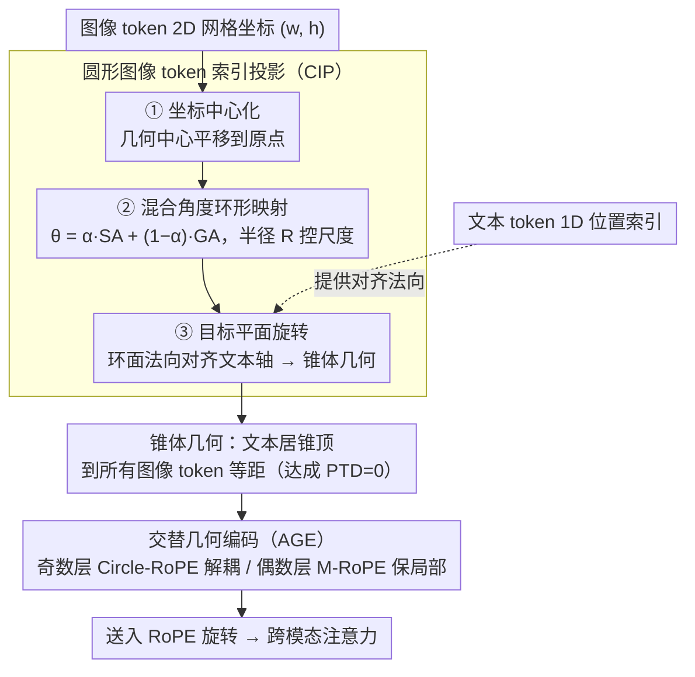

# Circle-RoPE: Cone-like Decoupled Rotary Positional Embedding for Vision-Language Models

**会议**: ICML 2026  
**arXiv**: [2505.16416](https://arxiv.org/abs/2505.16416)  
**代码**: https://github.com/lose4578/CircleRoPE  
**领域**: 多模态VLM  
**关键词**: 位置编码, RoPE, 视觉语言模型, 跨模态解耦, 空间推理  

## 一句话总结
提出 Circle-RoPE，将图像 token 的 2D 坐标映射到与文本位置轴正交的环面上，形成锥体几何结构，使每个文本 token 到所有图像 token 的 RoPE 距离相等（PTD=0），消除跨模态伪位置偏置，同时通过逐层交替编码（AGE）保留图像内部空间结构。

## 研究背景与动机

**领域现状**：RoPE（旋转位置编码）在大语言模型中广泛使用，扩展到视觉语言模型（VLM）时，主流做法包括三种：(1) 将图像 token 展平为 1D 序列与文本拼接后直接用 1D RoPE（LLaVA / InternLM-VL 等）；(2) 给所有图像 token 分配相同位置索引（mPLUG-Owl3）；(3) 保留 2D 空间索引再与文本拼接（Qwen2-VL 的 M-RoPE）。

**现有痛点**：上述方法都在共享索引空间中嵌入图像和文本 token，导致跨模态相对位置由拼接顺序而非语义关联决定。例如在 VQA 中，"high on the clock tower" 应对齐塔顶图像区域，但由于索引排列，距离最近的反而是无关 patch，产生语义错位和多 token 距离不一致两类问题。

**核心矛盾**：方案 (1)(3) 保留了图像空间信息但引入了跨模态耦合偏置；方案 (2) 消除了偏置但丢失了图像内部空间结构。没有方案能同时做到跨模态解耦与保留图像空间关系。

**本文目标**：设计一种位置编码，使每个文本 token 到所有图像 token 等距（消除跨模态偏置），同时保持图像 token 之间的相对空间结构。

**切入角度**：从几何第一原理出发——如果把文本 token 看作"观察者"，图像 token 构成 2D 平面，那么观察者应该站在平面的法线方向上而非共面位置，这样才能避免"透视畸变"。

**核心 idea**：将图像 token 坐标映射到一个与文本位置轴正交的环面上，形成类似直圆锥的几何结构，使文本 token 位于锥顶到所有环面点等距，从而在 RoPE 索引空间中实现 PTD=0。

## 方法详解

### 整体框架
Circle-RoPE 在 M-RoPE 的基础上，对图像 token 的 $(w, h)$ 索引在送入 RoPE 旋转之前进行几何变换。输入是图像 token 的 2D 网格坐标和文本 token 的 1D 位置索引，输出是变换后的 3D 坐标（用于图像）和原始 1D 索引（用于文本）。先用 PTD 指标量出"跨模态位置耦合有多严重"并定下"PTD=0"的优化目标，再由两大模块落地：CIP（圆形图像 token 索引投影）把图像索引投到与文本轴正交的锥体上达成 PTD=0，AGE（交替几何编码）则让奇偶层在 Circle-RoPE 与 M-RoPE 之间交替、兼顾跨模态解耦与图像内部局部性。

### 关键设计

**1. Per-Token Distance（PTD）度量与理论保证：先把"跨模态解耦"变成一个能优化的数**

现有位置编码方案缺一个量化"跨模态位置耦合有多严重"的指标，没指标就无从对症下药。作者定义 PTD：对每个文本 token $t$，先算它到所有图像 token 的 RoPE 索引平均距离 $\bar{D}_t = \frac{1}{N_{\text{image}}}\sum_{i \in I} d(t, i)$，再求所有距离对这个均值的平均绝对偏差 $\text{PTD} = \frac{1}{N_{\text{image}} N_{\text{text}}} \sum_{t \in T} \sum_{i \in I} |d(t,i) - \bar{D}_t|$。PTD=0 意味着每个文本 token 到所有图像 token 等距，RoPE 引入的注意力偏置对所有图像 token 一视同仁、不会凭位置偏心；作者还证明 RoPE 注意力 logit 的偏置量被 PTD 上界控住。量出来 Hard embedding 的 PTD=2.22、Spatial embedding=0.64、Unordered=0 但丢了空间信息——于是优化目标很清楚：在保住图像空间结构的前提下把 PTD 压到 0。

**2. 圆形图像 Token 索引投影（CIP）：把图像 token 摆到与文本轴正交的环面上**

直接展平或共享索引都没法同时满足"跨模态解耦"和"图像空间保持"。CIP 的几何直觉是——把文本 token 当成站在画布法线方向上的"观察者"，画布上任意一点到法线上的观察者天然等距，于是 PTD 自然为 0。具体分三步：**坐标中心化**先把所有图像坐标平移到几何中心在原点；**混合角度环形映射**把中心化坐标投到 2D 环面，角度由空间极角 SA 和网格索引角 GA 加权 $\theta^{\text{mix}}_{ij} = \alpha \cdot \theta^{\text{SA}}_{ij} + (1-\alpha) \cdot \theta^{\text{GA}}_{ij}$，半径 $R$ 控尺度——SA 保空间结构但相近射线方向的 token 角度会坍缩，GA 用均匀分配角度补回分辨力，$\alpha=0.5$ 各取一半；**目标平面旋转**把 2D 环面升到 3D 后旋转，使环面法向量与文本位置方向 $V_{\text{text}}$ 对齐，整体就成了一个锥体——文本在锥顶，图像 token 在锥底环上，到锥顶恰好等距。最优参数 $\alpha=0.5$、$R=10$。

**3. 交替几何编码（AGE）：奇偶层各管一种几何先验**

纯 Circle-RoPE 虽然解耦了跨模态位置，却放松了图像内部的 2D 局部性先验，对图表阅读、细粒度布局这类任务不利；M-RoPE 反过来有类似卷积的局部感应偏置，适合图像内部注意力。AGE 不强求一种几何包打天下，而是定义层级调度 $s(\ell) \in \{\text{Circle-RoPE}, \text{M-RoPE}\}$，奇数层用 Circle-RoPE 做无偏跨模态对齐，偶数层用 M-RoPE 做网格式局部空间感知。这种交替本身起到几何正则化的作用，避免模型过拟合到单一几何视角，让解耦层专注语义定位、空间层专注视觉特征提取。

## 实验关键数据

### 主实验

基于 Qwen2.5-VL-3B 做 SFT（MAmmoTH-VL-Sub 1M 数据），仅替换位置编码模块：

| 数据集 | Qwen2.5-VL (SFT) | Circle-RoPE | 提升 |
|--------|:-:|:-:|:-:|
| MMMU (val) | 51.56 | **52.11** | +0.55 |
| MMMU-Pro | 28.01 | **28.44** | +0.43 |
| MathVista (mini) | 62.40 | **63.40** | +1.00 |
| AI2D | 79.22 | **81.80** | +2.58 |
| RealWorldQA | 66.10 | **66.54** | +0.44 |
| 平均 | 57.46 | **58.46** | +1.00 |

在 TAM benchmark 上 Func-IoU 提升 +3.45（71.19→74.64），验证了跨模态解耦效果。

### 消融实验

| 配置 | MMMU | MMMU-Pro | MathVista | 平均 |
|------|:-:|:-:|:-:|:-:|
| Baseline (M-RoPE) | 50.22 | 27.92 | 62.40 | 46.85 |
| CIP α=0, R=auto | 52.38 | 28.12 | 61.70 | 47.40 |
| CIP α=0.5, R=10 (最优) | 52.11 | 28.44 | 63.40 | 47.98 |
| CIP α=0.5, R=auto | 50.04 | 26.64 | 62.20 | 46.29 |
| Unordered (PTD=0) | 48.55 | 25.50 | 59.50 | — |
| Circle-RoPE (PTD=0) | 51.11 | 27.94 | 62.40 | — |

### 关键发现
- **PTD=0 不等于好**：Unordered embedding 也满足 PTD=0，但因丢失图像空间结构反而大幅下降（平均 54.67 vs M-RoPE 56.76），证明保留图像内部几何是必要条件
- **AGE 优于单一编码**：全部用 Circle-RoPE（策略1）平均 58.33，仅上层/下层分别 58.42/58.44，AGE 交替达 58.46，说明两种几何先验互补
- **跨架构泛化**：在 LLaVA-0.5B 上直接复用 Qwen2.5-VL 的超参（α=0.5, R=10），无需调参即超越 1D-RoPE 和 M-RoPE
- **固定半径优于自适应半径**：R=10 固定值 >> R=auto，自适应半径反而损害性能，可能因为不同分辨率图像产生的 R 值差异过大

## 亮点与洞察
- **几何第一原理驱动设计**：从"观察者-画布正交"的直觉出发推导出锥体几何，PTD 度量提供了形式化验证框架，理论与工程紧密结合。这种从几何不变性出发设计位置编码的思路可迁移到音频-文本、3D-文本等其他跨模态场景
- **混合角度映射的精巧权衡**：SA 保空间结构但有角度坍缩风险，GA 保区分度但丢空间语义，50/50 混合兼得两者优势。这种"两个互补信号加权混合"的范式在特征工程中普遍适用
- **AGE 作为几何正则化器**：不强迫一种几何服务所有需求，而是让不同层自然分工，思路类似 MoE 中不同专家处理不同模式

## 局限与展望
- 实验仅在 3B 和 0.5B 规模验证，7B+ 模型上的效果未知；大规模预训练（而非仅 SFT）中 Circle-RoPE 的收益可能不同
- 主实验提升幅度相对有限（平均 +1.0），在部分 benchmark 如 RealWorldQA 上提升仅 +0.44
- 视频理解场景（多帧时序+空间）的适配未涉及，M-RoPE 原本支持时间维度索引，Circle-RoPE 如何扩展到 3D+时序值得探索
- α 和 R 的选择依赖消融实验，缺少自适应学习机制

## 相关工作与启发
- M-RoPE (Qwen2-VL) 保留 2D 空间索引但跨模态耦合——Circle-RoPE 在其基础上通过正交投影解耦
- mPLUG-Owl3 用共享索引实现 PTD=0 但丢空间——本文证明"PTD=0 + 空间保持"缺一不可
- 启发：位置编码设计应区分"模态内"和"模态间"两种需求，用不同几何先验分别服务而非一刀切

<!-- RELATED:START -->

## 相关论文

- [\[CVPR 2026\] SoPE: Spherical Coordinate-Based Positional Embedding for 3D LVLMs](../../CVPR2026/multimodal_vlm/sope_spherical_positional_encoding_3d_lvlm.md)
- [\[ICLR 2026\] PPE: Positional Preservation Embedding for Token Compression in Multimodal Large Language Models](../../ICLR2026/multimodal_vlm/ppe_positional_preservation_embedding_for_token_compression_in_multimodal_large_.md)
- [\[ICML 2026\] Active Exploring like a Pigeon: Reinforcing Spatial Reasoning via Agentic Vision-Language Models](active_exploring_like_a_pigeon_reinforcing_spatial_reasoning_via_agentic_vision-.md)
- [\[CVPR 2026\] MODIX: Training-Free Multimodal Information-Driven Positional Index Scaling for VLMs](../../CVPR2026/multimodal_vlm/modix_positional_index_scaling.md)
- [\[ICML 2026\] Vision Language Models 无法推理物理变换](vision_language_models_cannot_reason_about_physical_transformation.md)

<!-- RELATED:END -->
