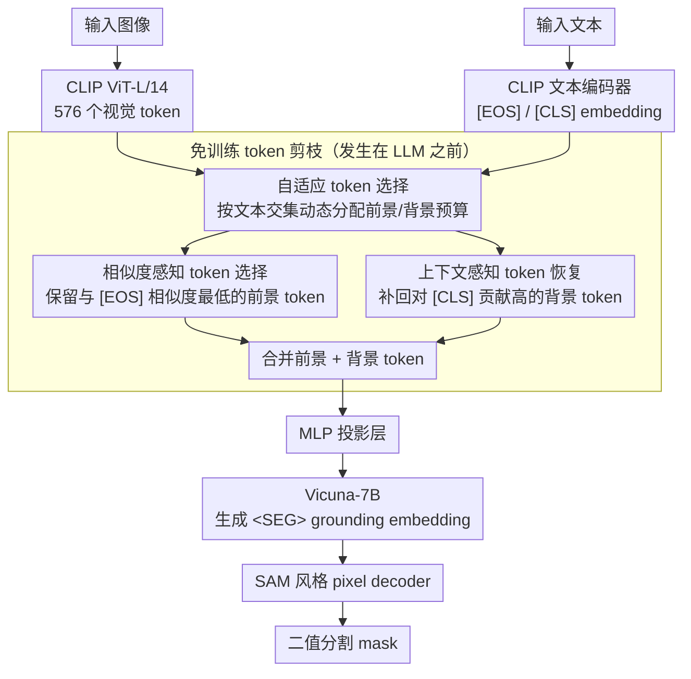

# CLIP Tricks You: Training-free Token Pruning for Efficient Pixel Grounding in Large Vision-Language Models

**会议**: ICML2026  
**arXiv**: [2605.13178](https://arxiv.org/abs/2605.13178)  
**代码**: https://github.com/sejong-rcv/LiteLVLM  
**领域**: 多模态VLM  
**关键词**: 视觉token剪枝, CLIP相似度反转, 像素级定位, 免训练推理加速, 大视觉语言模型  

## 一句话总结

发现 CLIP 中指代区域的视觉 token 与 [EOS] 文本 token 呈反直觉的低相似度现象（similarity reversal），据此提出 LiteLVLM——一种免训练的文本引导视觉 token 剪枝方法，在裁剪 66.7% token 后仍保留 90.3% 原始像素定位性能，同时实现 22% 推理加速和 2.3× 显存节省。

## 研究背景与动机

**领域现状**：大视觉语言模型（LVLM）的推理开销主要来自视觉 token——LLaVA 产生 576 个视觉 token，而文本 token 通常不超过 100 个；高分辨率版本（LLaVA-NeXT）更达 2880 个。因此视觉 token 剪枝是提升推理效率的关键手段。

**现有痛点**：现有剪枝方法（LLaVA-PruMerge、VisionZip、FastV）主要依赖文本无关（text-agnostic）的全局重要性度量，在图像理解任务上有效，但在像素级定位（pixel grounding）任务中表现不佳。原因在于定位任务中 token 的重要性高度依赖输入文本（如"player"与"ball"需要保留截然不同的空间区域），全局度量无法捕捉这种文本条件差异。

**核心矛盾**：唯一利用文本信息的方法 TRIM 按 CLIP 视觉-文本高相似度保留 token，但作者发现 CLIP 存在**相似度反转**——指代区域的视觉 token 与 [EOS] 文本 token 的相似度反而最低。TRIM 因此保留了与指代对象无关的 token，导致比随机剪枝还差 10-20%。

**本文目标**：设计一种文本引导、免训练的 token 剪枝策略，在像素级定位任务中大幅减少视觉 token 的同时维持分割精度。

**切入角度**：作者深入分析 CLIP 的 [EOS] token attention 分布，发现 **text attention sink** 现象——[EOS] token 的注意力 68% 集中在无语义的 [SOS] token 上，对真正承载语义的指代词（[RES] token）仅分配 14%。这使得 [EOS] embedding 缺乏丰富语义，进而导致与指代区域视觉 token 的相似度异常偏低。

**核心 idea**：反转 CLIP 的视觉-文本相似度排序——保留低相似度 token（覆盖指代区域）+ 恢复高 [CLS] 贡献度 token（提供背景上下文），实现前景-背景的清晰分离。

## 方法详解

### 整体框架

LiteLVLM 构建在 GLaMM 架构之上：输入图像经 CLIP ViT-L/14 编码为 576 个视觉 token，输入文本经 CLIP text encoder 提取 [EOS] embedding。LiteLVLM 在视觉 token 进入 LLM 之前执行剪枝，剪枝核心由三个设计协同——自适应 token 选择先按文本交集动态分配前景/背景预算，相似度感知 token 选择保留与 [EOS] 相似度最低的前景 token，上下文感知 token 恢复补回对 [CLS] 贡献高的背景 token；两类 token 合并后经 MLP 投影层送入 Vicuna-7B 生成 \<SEG\> grounding embedding，最终由 SAM 风格的 pixel decoder 输出二值分割 mask。由于剪枝发生在 LLM 之前，与 FlashAttention 等高效注意力机制完全兼容。

### 关键设计

**1. 相似度感知 token 选择（Similarity-aware Token Selection）：反着选，保留与 [EOS] 相似度最低的 token**

直觉上"高相似度 = 重要"，TRIM 就是按 CLIP 视觉-文本高相似度保留 token，结果比随机剪枝还差 10–20%。根源是 CLIP 对比学习只对齐 [CLS] 和 [EOS] 两个全局 token，指代区域的 token 因接收到的梯度信号弱，反而与 [EOS] 相似度最低（similarity reversal）。这里把排序反过来：计算每个视觉 token $E_j^v$ 与 [EOS] embedding $E_i^{\mathcal{T}}$ 的点积相似度 $s_{i,j} = E_i^{\mathcal{T}} \cdot E_j^{v\top}$，选相似度**最低**的 $k$ 个。这些 token 与全局语义弱对齐，却恰恰保留了丰富的局部指代信息——把 CLIP 的"缺陷"反手变成精确定位前景的工具。

**2. 上下文感知 token 恢复（Context-aware Token Recovery）：补回背景 token 帮边界判定**

只留前景 token 缺背景参照，分割边界会模糊。对第一步未保留的 token 集合 $S$，计算每个 token 对 [CLS] 的上下文贡献分 $s_i' = \| \frac{\exp(Q^{\mathcal{I}} K_i^\top / \sqrt{d})}{\sum_{j \in S} \exp(Q^{\mathcal{I}} K_j^\top / \sqrt{d})} \cdot V_i \|_2$，选得分最高的恢复。这个分数同时考虑注意力权重和 Value 向量的信息量（L2 范数），挑出真正承载全局语义和空间参考的背景 token，使 pixel decoder 能清晰区分前景与背景。消融里"仅上下文恢复"比随机还差、"仅低相似度选择"略好于随机、两者合起来最好，说明前景与背景 token 是互补的。

**3. 自适应 token 选择（Adaptive Token Selection）：按文本交集动态分配前景/背景比例**

固定比例（如 75%/25%）在不同场景下表现不一致。给定预算 $\mathcal{B}$ 和 $N$ 条输入文本，先为每条文本独立选出 $\mathcal{B}$ 个低相似度候选集 $\mathcal{S}_i$，取交集 $\mathcal{S} = \bigcap_{i=1}^{N} \mathcal{S}_i$ 作为相似度感知 token（$N=1$ 时经验性设为预算的 50%），剩余预算 $\mathcal{B} - |\mathcal{S}|$ 用上下文恢复填充。交集大小随文本输入自然变化——多条文本共同关注的区域更可信、留得更多——于是前景/背景比例按内容动态调，平均性能比最佳固定比例高 2.0%。

## 实验关键数据

### 主实验：Referring Expression Segmentation（保留 192/576 token，↓66.7%）

| 方法 | RefCOCO-val | RefCOCO-testA | RefCOCO+-val | RefCOCOg-val | Avg. | Rel. |
|------|------------|---------------|-------------|-------------|------|------|
| GLaMM（上界） | 79.5 | 83.2 | 72.6 | 74.2 | 75.5 | 100% |
| TRIM | 55.5 | 58.5 | 40.6 | 45.2 | 47.3 | 62.6% |
| FastV | 69.5 | 73.9 | 57.9 | 61.5 | 62.6 | 82.9% |
| LLaVA-PruMerge | 68.8 | 74.6 | 58.2 | 61.2 | 63.1 | 83.5% |
| VisionZip | 71.1 | 76.4 | 59.7 | 64.7 | 65.5 | 86.7% |
| VisPruner | 72.4 | 75.5 | 61.5 | 65.4 | 66.0 | 87.4% |
| **LiteLVLM** | **74.4** | **78.7** | **64.1** | **66.0** | **68.1** | **90.3%** |

### 消融实验（RefCOCO-val，不同 token 预算）

| 配置 | 29 token | 58 token | 144 token | 288 token | Avg. | 说明 |
|------|----------|----------|-----------|-----------|------|------|
| 随机剪枝 | 57.2 | 62.7 | 68.2 | 72.0 | 65.0 | 无策略基线 |
| 仅上下文恢复 | 54.5 | 59.9 | 67.4 | 71.6 | 63.3 | 比随机还差 |
| 高相似度选择（↑） | 48.1 | 49.4 | 53.8 | 59.5 | 52.7 | 严重退化 |
| 低相似度选择（↓） | 59.8 | 63.6 | 68.4 | 72.8 | 66.1 | 验证反转有效 |
| **LiteLVLM（↓ + 恢复）** | **62.5** | **65.2** | **72.9** | **75.2** | **68.9** | 两者互补 |

### 效率分析（192 token / 64 token）

| 方法 | FLOPs (TB) | Prefill (ms) | CUDA Time (ms) | 显存 (GB) |
|------|-----------|-------------|----------------|----------|
| GLaMM（上界） | 4.66 | 166.25 | 340.89 | 0.81 |
| FastV（192） | 2.65 | 162.88 | 340.25 | 0.81 |
| VisPruner（192） | 2.17 | 75.65 | 276.09 | 0.37 |
| **LiteLVLM（192）** | **2.11** | **74.88** | **265.83** | **0.35** |
| **LiteLVLM（64）** | **1.27** | **54.02** | **237.35** | **0.21** |

### 关键发现

- TRIM（按高相似度选择）在所有预算下都是最差方法，证实了 CLIP 相似度反转现象的普遍性
- 自适应 token 选择比最佳固定比例（50/50）高 2.0%（70.9% vs 68.9%），说明动态分配对不同文本输入至关重要
- 视频定位（Ref-DAVIS-17 / Refer-YouTube-VOS）场景下，保留 196/576 token 仅损失 0.5% 性能，比 VisPruner 高 4.9-6.7%
- LiteLVLM 在 LLM 前剪枝，使 prefilling 时间从 166ms 降至 75ms，且兼容 FlashAttention；FastV 在 LLM 内剪枝则无法受益

## 亮点与洞察

- **CLIP 相似度反转的发现本身极具洞察力**：对比学习仅对齐 [CLS]/[EOS] 全局 token，局部 token 因梯度信号弱而与全局表征反相关。这一发现不仅解释了 TRIM 的失败，也为理解 CLIP 内部表征提供了新视角
- **Text attention sink 现象**：[EOS] 将 68% 注意力倾注于无语义的 [SOS] 位置 token，这与 LLM 中的 attention sink 现象异曲同工，暗示了位置偏置对 Transformer 特殊 token 的普遍影响
- **"逆向思维"的方法论**：当直觉（高相似度 = 重要）失败时，反转排序即可将 CLIP 的"缺陷"转化为精确的定位工具。这种思路可迁移到其他依赖 CLIP 做空间选择的任务（如 open-vocabulary detection 中的区域选择）

## 局限与展望

- 方法强依赖 CLIP 作为视觉编码器的 LVLM 架构；对使用 SigLIP 或其他非对比学习编码器的模型，相似度反转现象是否成立需要验证
- 当前仅在 GLaMM/VideoGLaMM 上验证，未测试 LISA、PixelLM 等其他 grounding 架构的泛化性
- 自适应策略中 $N=1$ 时的 50% 经验比例缺乏理论依据，更精细的预算分配策略可能进一步提升性能
- 仅面向推理阶段的效率优化，未探索训练阶段的 token 剪枝潜力

## 相关工作与启发

- **LLaVA-PruMerge (ICCV25)**：基于 [CLS] token 相似度的文本无关剪枝，在图像理解有效但定位任务失败
- **TRIM (COLING25)**：唯一利用文本信息的方法，但错误地按高相似度选择，成为反面教材
- **VisPruner (ICCV25)**：当前 SOTA token 剪枝方法，LiteLVLM 在所有设置下超越 2.9-10.2%
- **FastV (ECCV24)**：在 LLM 内部基于 attention 剪枝，无法与 FlashAttention 兼容

<!-- RELATED:START -->

## 相关论文

- [\[ACL 2026\] HiPrune: Hierarchical Attention for Efficient Token Pruning in Vision-Language Models](../../ACL2026/multimodal_vlm/hiprune_hierarchical_attention_for_efficient_token_pruning_in_vision-language_mo.md)
- [\[ICCV 2025\] METEOR: Multi-Encoder Collaborative Token Pruning for Efficient Vision Language Models](../../ICCV2025/multimodal_vlm/meteor_multi-encoder_collaborative_token_pruning_for_efficient_vision_language_m.md)
- [\[ECCV 2024\] IVTP: Instruction-Guided Visual Token Pruning for Large Vision-Language Models](../../ECCV2024/multimodal_vlm/ivtp_instruction-guided_visual_token_pruning_for_large_vision-language_models.md)
- [\[CVPR 2026\] VLM-Pruner: Buffering for Spatial Sparsity in an Efficient VLM Centrifugal Token Pruning Paradigm](../../CVPR2026/multimodal_vlm/vlm-pruner_buffering_for_spatial_sparsity_in_an_efficient_vlm_centrifugal_token_.md)
- [\[CVPR 2026\] CLIP-Free, Label-Free, Unsupervised Concept Bottleneck Models](../../CVPR2026/multimodal_vlm/clip-free_label_free_unsupervised_concept_bottleneck_models.md)

<!-- RELATED:END -->
