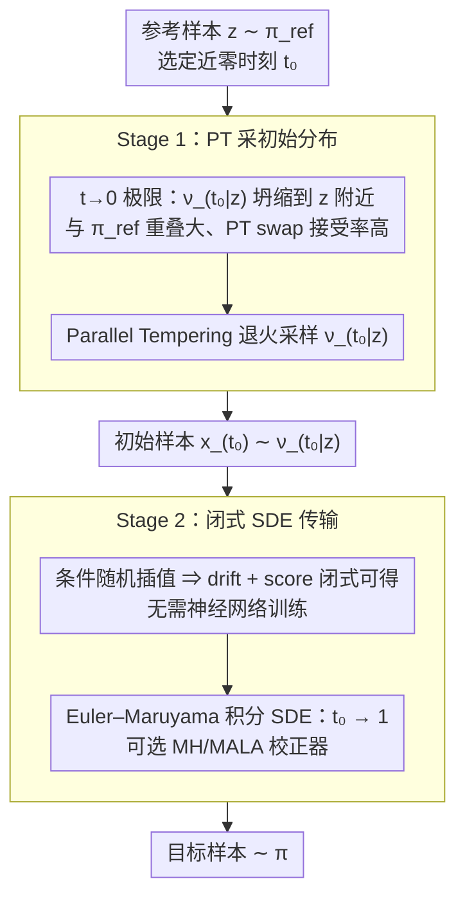

# Conditional Diffusion Sampling

**会议**: ICML 2026  
**arXiv**: [2605.04013](https://arxiv.org/abs/2605.04013)  
**代码**: https://github.com/Franblueee/conditional_diffusion_sampling  
**领域**: 采样算法 / 扩散模型；MCMC；贝叶斯推断  
**关键词**: Parallel Tempering、Conditional Interpolants、closed-form SDE、多模态采样、训练自由

## 一句话总结
本文提出 Conditional Diffusion Sampling（CDS）：通过推导一类条件随机插值（conditional interpolants），得到一个对未归一化目标分布的**精确闭式 SDE**（不需要神经网络拟合），再用 Parallel Tempering 高效采样这个 SDE 的初始分布——把 PT 的全局探索能力和扩散过程的局部细化能力拼起来，在 8 个目标分布、4 类任务上以更少的密度评估次数同时击败传统 MCMC、训练自由 MCMC 和神经采样器。

## 研究背景与动机

**领域现状**：从未归一化的多模态分布 $\pi(x)\propto \tilde\pi(x)$ 中独立采样是 ML 与自然科学的基础问题。主流方法分两类——(i) 退火型 MCMC（如 Parallel Tempering, AIS, SMC），通过构造从参考 $\pi_{\text{ref}}$ 到目标 $\pi$ 的中间分布序列在多链间传输信息；(ii) 扩散/插值型生成模型（neural samplers, stochastic interpolants），用神经网络拟合 score 或 drift。

**现有痛点**：(i) PT 这类退火方法当 $\pi_{\text{ref}}$ 与 $\pi$ 重叠很小时需要极多中间分布才能稳定，密度评估次数（在分子动力学等场景里是瓶颈）会爆炸；(ii) Neural samplers 必须用大量目标密度评估来训练神经网络拟合 drift / score，训练成本本身就吃掉了"采样省下的成本"，且对新目标分布需要重新训练；(iii) 已有的"无训练扩散采样"如 DiGS、RDMC 要么依赖 Metropolis-within-Gibbs（高维退化），要么依赖嵌套 MCMC（每次迭代多次密度评估）。

**核心矛盾**：扩散采样的 score 函数对于一般未归一化分布是**不可解析的**，所以必须要么训练神经网络拟合（→ 神经采样器的成本困境），要么用嵌套 MCMC 近似（→ DiGS/RDMC 的开销困境）。

**本文目标**：(i) 设计一类插值过程，让其 SDE 的 drift 和 score 都有闭式表达，从而完全避免神经网络训练；(ii) 控制好该 SDE 的初始化代价，使整套方法在固定密度评估预算下显著优于 SOTA。

**切入角度**：standard stochastic interpolants（Albergo et al. 2025）研究的是 marginal 分布的 drift，无法解析；但如果**固定一个参考点 $z\sim\pi_{\text{ref}}$ 然后考虑条件分布** $\nu_{t\mid z}$，由于 $\nu_{t\mid z}$ 是 $\nu$ 通过一个 diffeomorphic 映射 $F_{t\mid z}$ 的 pushforward，其密度可以**用变量替换公式从目标 $\pi$ 解析写出来**——score 自然也变成闭式！

**核心 idea**：把"采样 $\pi$"分解为两阶段——(1) 在小时刻 $t_0$ 处，$\nu_{t_0\mid z}$ 高度集中在 $z$ 附近、与 $\pi_{\text{ref}}$ 重叠极大，用 PT 极快采样；(2) 用闭式 SDE 把这些样本沿 $t_0\to 1$ 传输到目标 $\pi$。

## 方法详解

### 整体框架
两阶段管线（Alg. 1）：

- **Stage 1（PT 采初始分布）**：选定一个近零的 $t_0>0$，从参考 $z\sim\pi_{\text{ref}}$ 出发，用 Parallel Tempering 采样条件分布 $\nu_{t_0\mid z}$。由于当 $t_0\to 0$ 时 $\nu_{t_0\mid z}\to \delta_z$，与 $\pi_{\text{ref}}$ 几乎完全重叠，PT 的 swap acceptance 极高、混合极快。
- **Stage 2（闭式 SDE 传输）**：用 Euler–Maruyama 积分一个闭式 SDE，把样本从 $\nu_{t_0\mid z}$ 沿时间 $t_0\to 1$ 传输到目标 $\nu$。SDE 的 drift 和 score 全部解析可得，过程中可选插入 MH 校正器进一步降低离散化误差。

整套方法**完全无神经网络训练**，仅靠目标密度 $\tilde\pi$ 的评估和 score $\nabla\log\tilde\pi$ 即可运行。

### 关键设计

**1. Conditional Interpolants：把 score 从"必须训练"还原成"目标分布的解析变换"**

扩散采样最根本的痛点是 score 函数对一般未归一化分布不可解析，逼得人要么训神经网络拟合、要么嵌套 MCMC 近似。标准 stochastic interpolant 定义 $x_t = F_t(z, x)$（$z\sim\nu_{\text{ref}}, x\sim\nu$），研究的是 $x_t$ 的 marginal 分布——而 marginal score 正是不可解析的那一个。本文换个视角：**固定参考点 $z$**，令 $F_{t\mid z}(\cdot) = F_t(z,\cdot)$ 是一个 diffeomorphism，那么条件分布 $\nu_{t\mid z}$ 就是目标 $\nu$ 经 $F_{t\mid z}$ 的 pushforward，由变量替换公式直接写出

$$\pi_{t\mid z}(x) = |\det \mathrm{J}F_{t\mid z}(F^{-1}_{t\mid z}(x))|^{-1}\,\pi(F^{-1}_{t\mid z}(x)).$$

只要目标 $\pi$ 可评估，条件密度和条件 score $\nabla\log\pi_{t\mid z}$ 就全都闭式可得。再定义条件速度场 $u_{t\mid z}(x) = \partial_t F_{t\mid z}(F^{-1}_{t\mid z}(x))$，配上 Fokker-Planck 就推出一条保持 $\pi_{t\mid z}$ 不变的精确 SDE：$dx_t = (u_{t\mid z}(x_t) + \frac{\sigma_t^2}{2}\nabla\log\pi_{t\mid z}(x_t))dt + \sigma_t dW_t$。一句话，conditional 视角用"维度变换 + 原密度解析评估"换掉了神经训练。

**2. $t\to 0$ 极限：让初始化代价单调消失，破掉"采初始分布"的 catch-22**

闭式 SDE 在 $t=0$ 处有奇点（$F_{t\mid z}$ 不可逆、drift 发散），所以必须从某个 $t_0>0$ 启动；但这就冒出一个新任务——得先把 $t_0$ 处的初始分布 $\nu_{t_0\mid z}$ 采出来，听起来又回到原点。作者证明这个新任务其实比原任务容易得多：当 $t\to 0$ 时 $W_1(\delta_z, \nu_{t\mid z})\to 0$（Eq. 10），条件分布坍缩到参考点 $z$ 上。借 Lipschitz 性质可进一步证明，只要转换后 Markov 核的 Lipschitz 常数 $L_t\le 1$，采 $\nu_{t\mid z}$ 的误差就严格低于直接采 $\nu$，而线性、三角等常用插值都满足 $L_t\to 0$。于是 $t_0$ 越小，PT 从 $\pi_{\text{ref}}$ 跳到 $\nu_{t_0\mid z}$ 越容易——这正是 CDS"免费午餐"论点的支点。

**3. PT 与 SDE 的角色分工：全局探索交给 PT，局部精修交给 SDE**

两阶段不是随便拼的，而是把两类方法各自的优势条件互补起来。Stage 1 用 Parallel Tempering 从 $\pi_{\text{ref}}$ 退火到 $\nu_{t_0\mid z}$，因为 $t_0$ 很小、中间 ladder 短、swap acceptance 高、密度评估省——PT 被安排在"距离最短的那一段"。Stage 2 用 Euler–Maruyama 积分闭式 SDE 把这些"已经差不多对"的样本沿 $t_0\to 1$ 推到目标，SDE 负责全程的连续 score-correction。这里有两个非平凡之处：初始化必须真的从 $\nu_{t_0\mid z}$ 采样而非简单令 $x_{t_0}=z$（Appx H 证明单点初始化会严重退化，扩散撑不出足够支撑）；而且直接用反插值映射 $F^{-1}_{t_0\mid z}$ 把样本映到 $\nu$ 也比 SDE 路径差（Fig. 5），因为 SDE 的连续校正能在传输途中自动修掉初始化误差。PT 强在多模态全局探索但对 $\pi_{\text{ref}}\leftrightarrow\nu$ 距离敏感，SDE 强在局部精修但需要 score——CDS 刚好对两者扬长避短。

### 损失函数 / 训练策略
**无训练**。Stage 1 的 PT 使用 non-reversible variant；SDE 使用 Euler–Maruyama 离散化，可选 MH corrector；超参为 PT 步数 $K$、积分步数 $N$、噪声 schedule $\sigma_t$、初始时刻 $t_0$（最优值见 Fig. 4）。

## 实验关键数据

### 主实验

| 方法 | Mean HVR（聚合 8 个任务，越大越好） |
|------|------------------------------------|
| **CDS（本文）** | **0.9976 ± 0.0015** |
| NRPT（SOTA non-reversible PT） | 0.9827 ± 0.0083 |
| OASMC（Optimized Annealed SMC） | 0.9287 ± 0.0277 |
| HMC | 0.6263 ± 0.1261 |
| DiGS（Diffusive Gibbs） | 0.5464 ± 0.1550 |
| MALA | 0.5241 ± 0.1494 |

任务覆盖 Gaussian Mixture（2D 和 16D，含 non-uniform 版）、Lennard-Jones（LJ-13 和 LJ-55，化学势能）、Alanine Dipeptide（66D 分子动力学）、Bayesian Neural Network（550D 后验推断）。

### 消融实验

| 配置 | 主要现象 | 说明 |
|------|---------|------|
| $t_0=1.0\to 0.0$（Fig. 4） | RT 单调上升、误差下降；过小后退化 | 验证 $t_0$ 的最优区间存在 |
| SDE transport vs 反插值 $F^{-1}_{t_0\mid z}$（Fig. 5） | SDE 全场胜出，仅 GM-2 小预算下反插值微胜 | SDE 的 score correction 能修复初始化误差 |
| 初始化用 $x_{t_0}=z$ vs 采 $\nu_{t_0\mid z}$（Appx H） | 单点初始化严重退化 | 噪声不足以扩散出支撑 |
| ALDP 200k budget（Fig. 2） | 仅 CDS 与 NRPT 复现两模态正确比例 | 多模态多模态保真度的硬指标 |

### 关键发现
- **CDS 在 BNN（550D）上断崖式领先**：高维多模态后验是传统 PT 与 DiGS 的短板，CDS 在此场景 HVR 大幅超过所有 baseline，体现条件 SDE 在高维下的优势。
- **LJ 任务上局部采样器（MALA/HMC）反而最好**：LJ 势能局部结构主导、模式分离弱，CDS 与 NRPT 持平，体现"方法-任务匹配"原则——CDS 不是 universally 更好。
- **$t_0$ 存在最优值**：太大则 $\nu_{t_0\mid z}$ 与目标 $\nu$ 差距大、PT 退化；太小则 $\nu_{t_0\mid z}$ 过度集中、replicas 重叠不足导致 PT swap 失败。这个 trade-off 是 CDS 的核心实践超参。
- **线性插值在 LJ/ALDP 上有几何劣势**：会把粒子距离推到零附近，造成高能区数值不稳定；这暗示未来工作可以设计任务感知的几何 interpolant。
- **DiGS 在 GM-2 与 CDS 持平但维度上升后退化**：因为 DiGS 的 Metropolis-within-Gibbs 在高维下变差，而 CDS 没有这个 dimensionality penalty。

## 亮点与洞察
- **"条件视角"是个被低估的金钥匙**：标准 stochastic interpolants 因为 marginal score 不可解析而被神经化；本文换一个视角看 conditional score 立刻闭式——这种"用 conditioning 把不可解析变成可解析"的技巧可以推广到很多生成建模问题。
- **t→0 不是问题而是礼物**：常规扩散的 $t=0$ 奇点被视为麻烦；本文反过来用 $t_0\to 0$ 时初始分布坍缩到 Dirac 的性质，让 Stage 1 几乎免费——把缺陷变特色的设计美学。
- **PT 与扩散互补而非竞争**：以往把它们当作两条路；CDS 证明它们是"全局 vs 局部"的天然配对，给采样领域提供了一个新的合成范式。
- **完全无训练 + 高维表现优秀**：相比 neural samplers 必须为每个新目标重新训练，CDS 真正 zero-shot，对新分子/新后验直接可用，工程上意义巨大。

## 局限与展望
- **依赖插值映射的选择**：作者承认线性插值在带奇点的势能（LJ、ALDP）中可能驱动轨迹经过高能区造成数值不稳定，未来需要任务感知的非线性 interpolant（如根据 $\pi$ 的几何自适应）。
- **$t_0$ 的实际选择缺乏自动化**：虽然 Appx C 给了一些启发式，但实际仍需 grid search，对新任务会增加调参成本。
- **PT swap 在极小 $t_0$ 下仍可能失效**：条件分布过度集中后 replicas 互不重叠，仍会 collapse；CDS 没有提供根本的 fix，只能依赖 $t_0$ 的工程取值。
- **未与 Adjoint Sampling 等大规模 neural sampler 在同等预算下对比**：作者把 neural samplers 归为"amortized regime"排除在外，但对工业用户来说"先训一次后无限便宜"未必比 CDS 差。
- **缺乏理论收敛保证的端到端 bound**：单独证了 transport cost 消失和 Lipschitz 性质，但两阶段拼起来的总误差 bound 没给。

## 相关工作与启发
- **vs Parallel Tempering (NRPT)**：NRPT 是当前金标准；CDS 在距离最短的一段用 PT，其他段用 SDE，本质上"用 PT 解决 PT 自己的痛点"。
- **vs Neural samplers（NETS, Adjoint Sampling）**：neural 类必须先训练后采样，CDS 无训练；但 neural 在分布共享时可摊销训练成本，CDS 每次都从头跑。
- **vs DiGS / RDMC**：都属"非神经扩散采样"，但 DiGS 的 marginal score 用 Gibbs 拟合（高维退化），RDMC 用嵌套 MCMC（每步多次密度评估）；CDS 用 conditional 把 marginal 替换为 closed-form。
- **vs Stochastic Interpolants (Albergo 2025)**：本文是其 conditional 化身——把"为了 train"的 framework 改为"为了 zero-shot 采样"的 framework，这是该理论在采样侧的首次系统应用。
- **启发**：conditional reformulation 这个技巧可能也适用于 normalizing flow 训练、score matching 加速、conditional sampling under constraints 等。

## 评分
- 新颖性: ⭐⭐⭐⭐⭐ "条件插值 → 闭式 SDE"是真正的理论突破，把扩散采样从"必须训练"翻转到"完全无训练"，且 framework 整体设计精巧。
- 实验充分度: ⭐⭐⭐⭐ 覆盖 4 类任务 8 个分布、5 个强 baseline、详尽消融；但未在更高维度的科学应用（如蛋白质构象采样）上验证，与最新 neural samplers 在 amortized 视角下的公平比较也省略了。
- 写作质量: ⭐⭐⭐⭐ 理论推导严谨，两阶段结构清晰；但符号密度高，对没有插值理论背景的读者门槛较陡。
- 价值: ⭐⭐⭐⭐ 对计算化学、贝叶斯推断等需"按目标即采、无法预训练"的场景价值很高；对 ML 社区也提供了一个 conditional-as-closed-form 的可推广思路。

<!-- RELATED:START -->

## 相关论文

- [\[ICML 2026\] Text-Conditional JEPA for Learning Semantically Rich Visual Representations](text-conditional_jepa_for_learning_semantically_rich_visual_representations.md)
- [\[ICML 2026\] Dimension-Free Multimodal Sampling via Preconditioned Annealed Langevin Dynamics](dimension-free_multimodal_sampling_via_preconditioned_annealed_langevin_dynamics.md)
- [\[CVPR 2026\] Thinking Diffusion: Penalize and Guide Visual-Grounded Reasoning in Diffusion Multimodal Language Models](../../CVPR2026/multimodal_vlm/thinking_diffusion_penalize_and_guide_visual-grounded_reasoning_in_diffusion_mul.md)
- [\[ICML 2026\] Beyond VLM-Based Rewards: Diffusion-Native Latent Reward Modeling](beyond_vlm-based_rewards_diffusion-native_latent_reward_modeling.md)
- [\[AAAI 2026\] Conditional Information Bottleneck for Multimodal Fusion: Overcoming Shortcut Learning in Sarcasm Detection](../../AAAI2026/multimodal_vlm/conditional_information_bottleneck_for_multimodal_fusion_overcoming_shortcut_lea.md)

<!-- RELATED:END -->
