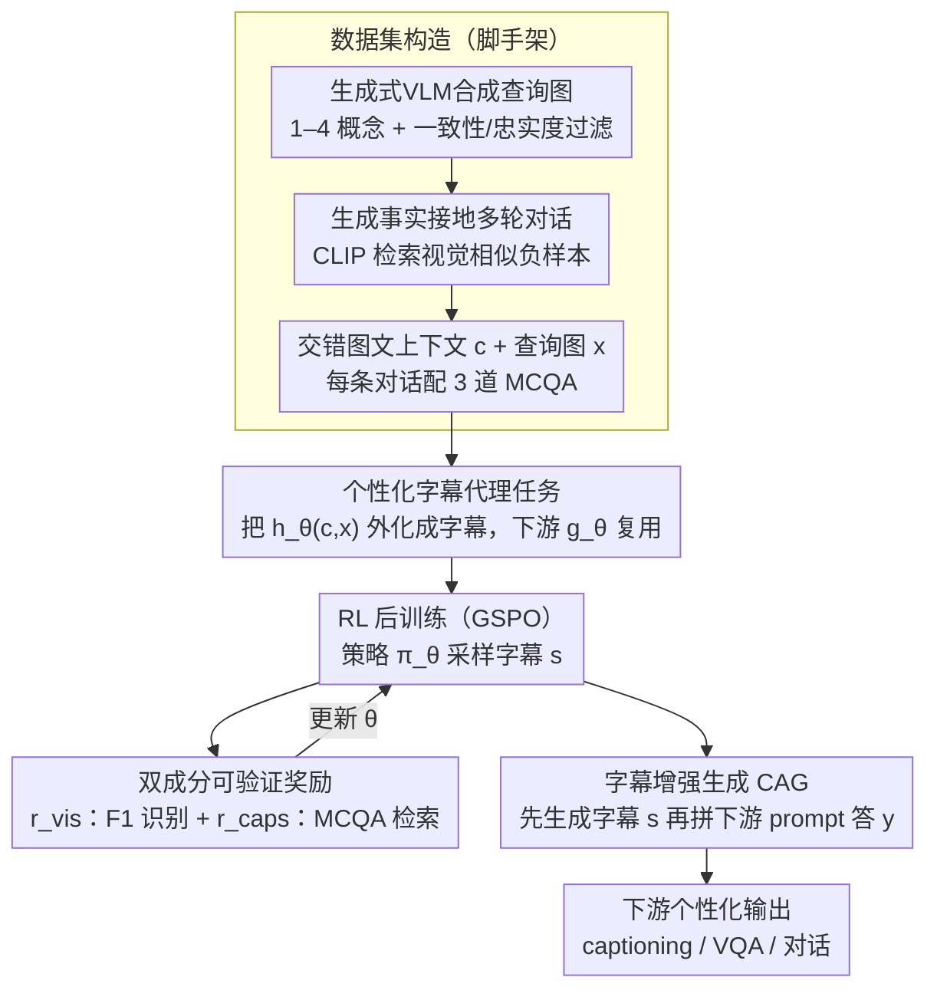

# Contextualized Visual Personalization in Vision-Language Models

**会议**: ICML2026  
**arXiv**: [2602.03454](https://arxiv.org/abs/2602.03454)  
**代码**: https://oyt9306.github.io/covip.github.io/ (项目主页)  
**领域**: 多模态VLM  
**关键词**: 视觉个性化, 个性化字幕生成, 强化学习后训练, 上下文记忆, 多模态对话

## 一句话总结
CoViP 把"基于用户历史经验做视觉个性化"这一开放任务，统一收敛到"个性化图像字幕"这个共享底层过程，通过可验证奖励的 RL 后训练 + 推理时的字幕增强生成（CAG），让 VLM 在交错图文上下文里真正"看图说人话"，并配套设计了能排除文本捷径的 MCQA 诊断基准。

## 研究背景与动机

**领域现状**：当前 VLM（LLaVA、Qwen-VL、InternVL 等）擅长描述图像，也能做基础的对话和 VQA，但"个性化"还停留在很浅的层面——给一张照片，它会说"一个穿黑西装的男人"，而不会知道这其实是用户上一轮对话里提到的"哥哥"。

**现有痛点**：已有的 VLM 个性化工作（MyVLM、Yo'LLaVA、TAME、RAP、RePIC 等）有三类局限：(1) 只支持简单属性或单一身份的个性化，无法处理"过去交互/episodic 记忆"这种富经验上下文；(2) 评估指标停留在"名字召回率"，VLM 完全可以靠在 context 里搜文本捷径来作弊；(3) 多采用 SFT 或外挂记忆库，难以泛化到任意下游任务，每个新场景都要单独再训。

**核心矛盾**：真实场景里的个性化是开放、长尾的——用户可能问任何与 episodic 历史相关的问题，输出空间巨大；纯任务定制式后训练不可能穷尽所有 prompt 形式，但完全不训又达不到"上下文里挑视觉概念 → 关联到用户历史 → 在回答里复用"的能力。

**本文目标**：(1) 形式化定义"上下文化视觉个性化"这一新范式；(2) 找到一个可学习的、能泛化到下游任意任务的"共享底层过程"；(3) 给出一个能挡住文本捷径的诊断评估协议。

**切入角度**：作者观察到，无论下游任务是 captioning、VQA 还是对话，VLM 都必须先"在用户上下文背景下解读当前图像"，这一步可以从下游任务里解耦出来。把 VLM 的内部计算形式化为 $z=h_\theta(c,x)$（contextual visual encoder）和 $y=g_\theta(z,p)$（task-specific generator）两段，发现 $h_\theta$ 与"个性化图像字幕"在目标上同构——字幕本身就把 $z$ 显式外化成自然语言。

**核心 idea**：把"个性化图像字幕"作为代理任务来训 $h_\theta$，用 RL + 可验证奖励让模型同时学会"细粒度识别 in-context 概念"和"准确检索对应文本经验"；推理时把模型自己生成的字幕作为额外条件再喂回去（Caption-Augmented Generation, CAG），间接放大下游各任务的个性化质量。

## 方法详解

### 整体框架
给定查询图 $x$、用户提示 $p$ 和交错图文上下文 $c$，VLM $f_\theta$ 输出回答 $y=f_\theta(c,x,p)$。CoViP 把内部计算拆成 $z=h_\theta(c,x),\,y=g_\theta(z,p)$，整体流水线分四块：

1. **个性化字幕基准构造**：用图像生成 VLM (Gemini-class) 在 Unsplash 等开源图库基础上合成包含 1–4 个概念的查询图，做指令一致性与视觉忠实度过滤；为每张正样本生成多轮、严格事实接地的"用户–模型"对话；用 CLIP-L/14 检索视觉相似负样本配对话，构成交错正负样本上下文。
2. **CapEval-QAs 评估协议**：每条对话由 LLM 生成 3 个事实 MCQA $(q_{ik},a_{ik})\sim\mathcal{G}(d_i)$；评测时只给 judge 模型 $\mathcal{J}$ 字幕 $s$ 与问题 $q_{ik}$。正概念题要答对（$\text{Acc}^+$，衡量"准确捕获相关信息"），负概念题要选择"无法确定"（$\text{Acc}^-$，衡量"不胡编无关内容"）。
3. **RL 后训练**：以 GSPO 算法最大化期望可验证奖励 $\mathbb{E}_{(x,c)\sim\mathcal{D}_{\text{tr}}}\mathbb{E}_{s\sim\pi_\theta(\cdot\mid x,c,p_s)}[r(s,x,c)]$，奖励 $r=r_{\text{vis}}+r_{\text{caps}}$ 同时驱动识别和检索。
4. **CAG 推理**：先让模型按 captioning prompt $p_s$ 生成字幕 $s\sim\pi_\theta(\cdot\mid x,c,p_s)$，再把 $s$ 拼到下游 prompt $p_d$ 后面，做最终回答 $y\sim\pi_\theta(\cdot\mid x,c,p_d,s)$。

### 关键设计

**1. 个性化字幕作为代理任务：把开放长尾的下游任务收敛到一个可监督、可奖励、可泛化的统一目标**

真实个性化任务是开放、长尾的——用户能问任何与 episodic 历史相关的问题，输出空间巨大，没法为每个下游任务单独做 SFT 或定制奖励。CoViP 的破局点是那条分解 $z=h_\theta(c,x),\,y=g_\theta(z,p)$：无论下游是 captioning、VQA 还是对话，模型都得先在用户上下文背景下解读当前图像（即 $h_\theta$），这一步可以从下游任务里抽出来单独训。而个性化字幕恰好和 $h_\theta$ 在目标上同构——字幕本身就是把 $z$ 显式外化成自然语言，中间不插 thinking/reasoning 这类冗余环节。于是训一个会写个性化字幕的模型，就等于训出了一个高质量的 $h_\theta$，下游任意 $g_\theta$ 都能复用。这正是 CoViP 区别于 RAP/RePIC 等前作的根本架构选择：把「个性化能力」做成一个下游可复用的共享原语，而非每个新场景都重训。

**2. 双成分可验证奖励：F1 管「识别」、MCQA 管「检索」，两端都用硬指标堵作弊**

之前的个性化 RL 要么直接拿 BLEU/CIDEr（鼓励模型抄上下文文本捷径），要么拿「名字召回」（太粗），都不可靠。CoViP 把奖励拆成正交的两块，让 RL 同时反馈「识别对了几个概念」和「字幕里检索到了多少有用历史」。识别奖励用 set-level F1：$r_{\text{vis}}(x,c)=\text{F1}(\hat{H},H)=\frac{2|\hat{H}\cap H|}{|\hat{H}|+|H|}$，对「哪些 in-context 概念出现在查询图里」的预测打分，多报涨 FP、漏报涨 FN、部分对给部分分，在任意 $|H|$ 下都平滑可解释。检索奖励 $r_{\text{caps}}(s,c)$ 复用评估协议里的 MCQA，用 $\sigma^+(s;QA^+)-\sigma^-(s;QA^-)$ 度量字幕对正/负问题的回答行为，并在字幕退化（$R(s)>0$，如重复/空输出）时直接判 $-1$，负样本部分再用系数 $\alpha$ 调权。两者相加 $r=r_{\text{vis}}+r_{\text{caps}}$ 套进 GSPO 优化。因为 F1 和 MCQA 都是可重复、对抗作弊的硬指标，模型几乎没法靠堆长字幕、塞关键词来 hack 奖励。

**3. 字幕增强生成（CAG）：推理时把 RL 练好的字幕能力当草稿复用到任意下游任务**

字幕能力被 RL 优化得很好之后，怎么不重训就迁到 VQA、对话等下游？CoViP 的答案是把字幕当「内部草稿」显式化。原本下游是一步 $y\sim\pi_\theta(\cdot\mid x,c,p_d)$，CAG 改成两步：先按 captioning prompt 生成字幕 $s\sim\pi_\theta(\cdot\mid x,c,p_s)$，再把 $s$ 拼到下游 prompt 后面回答 $y\sim\pi_\theta(\cdot\mid x,c,p_d,s)$。两次前向用的是同一个 $\pi_\theta$，不引入任何新模块。实验里观察到 RL 后字幕携带的个性化细节比直接答下游题更稠密，CAG 等于让 $g_\theta$ 不必从零再做一遍 $h_\theta$ 的工作——思路接近 chain-of-thought 但更轻，只生成一个字幕草稿、不强求完整 reasoning trace，代价仅是多一次字幕前向，对延迟敏感的产品场景更友好。

### 损失函数 / 训练策略
策略 $\pi_\theta(s\mid x,c,p_s)$ 用 GSPO (Group Sequence Policy Optimization) 最大化 $\mathbb{E}[r(s,x,c)]$；训练集 2.8K、测试集 1.3K 个性化字幕样本；评测里 judge 模型 $\mathcal{J}$ 是固定的外部 LLM，与策略模型解耦；reward 在策略侧只调度，judge 侧不更新，保证 RL 信号稳定。

## 实验关键数据

### 主实验

CapEval-QAs 在 1–4 个概念下的 $\text{Acc}^+$/$\text{Acc}^-$（部分摘录）：

| 模型 | 1-Concept $\text{Acc}^+$ / $\text{Acc}^-$ | 4-Concepts $\text{Acc}^+$ / $\text{Acc}^-$ | 备注 |
|---|---|---|---|
| GPT-4o | 34.2 / 98.2 | 15.3 / 99.2 | 闭源，$\text{Acc}^-$ 高但 $\text{Acc}^+$ 偏低 |
| GPT-5 | 48.3 / 97.3 | 26.1 / 98.7 | 闭源最强基线 |
| 基线开源 VLM | 偏低 | 大幅偏低 | 多概念时崩 |
| **CoViP (Ours)** | **显著超越基线** | **显著超越基线** | 在所有 concept 数量上 $\text{Acc}^+$ 都有大涨，$\Delta$ 为正 |

闭源模型在 $\text{Acc}^-$（避免胡编）上确实强，但 $\text{Acc}^+$（说出该说的）偏低，说明它们倾向于保守输出；CoViP 通过 RL 同时拉起两端。

### 消融实验
| 配置 | 现象 | 说明 |
|---|---|---|
| Full CoViP（$r_{\text{vis}}+r_{\text{caps}}$ + CAG） | 最佳 | 字幕代理 + 双奖励 + CAG 三件套联动 |
| w/o $r_{\text{vis}}$（去识别 F1 奖励） | $\text{Acc}^+$ 掉 | 不再细粒度区分多概念，混淆正负样本 |
| w/o $r_{\text{caps}}$（去 MCQA 奖励） | $\text{Acc}^-$ 掉 | 字幕开始夹带 context 里无关的内容 |
| w/o degeneration filter $R(s)$ | 输出退化 | 出现重复 / 空字幕等失败模式 |
| w/o CAG（推理直答下游） | 各下游任务掉分 | 失去"字幕作为内部草稿"的红利 |

### 关键发现
- **闭源 VLM 在 $\text{Acc}^-$ 上接近天花板（98–99），但 $\text{Acc}^+$ 在多概念时显著下降**：说明它们靠"少说话"保住负样本，但牺牲了真正的个性化召回；这种行为模式恰好是 CoViP 双奖励要纠正的。
- **CAG 不是免费午餐但代价低**：多一次字幕前向，换来下游所有任务的统一提升，从工程角度比"为每个下游任务单训" 划算。
- **可验证奖励避免了 reward hacking**：F1 + MCQA 都是硬指标，模型几乎没法靠生成更长字幕、堆积关键词刷分；degeneration filter 进一步堵住"用退化输出钻空子"。
- **诊断任务覆盖 reactive → proactive**：从"被动回答 user 关于过去经验的问题"到"主动提及相关历史"，CoViP 在两端都比 baseline 稳定，说明 $h_\theta$ 学到的是通用上下文建模能力，而不是某一种 prompt 模板。

## 亮点与洞察
- 把开放任务空间投影回单一可学习的代理任务（captioning），是非常优雅的解耦：训一个 $h_\theta$ 就能复用到 $g_\theta$ 的所有变种，避免每加一个下游任务就要重训。
- F1-based set-level VR 在多概念场景下比"逐对象 0/1 reward"或简单 ROUGE 都要密集得多，给 RL 提供了平滑的梯度，可以迁移到任何"输出是一组离散标签"的多模态 RL 任务。
- MCQA-based VR 这个套路把"评估协议"和"奖励信号"绑在一起：评估能挡住捷径，奖励就直接用同一套指标，避免了"训用 A 测用 B"的目标不一致问题，可迁移到 RAG/记忆增强对话等任意需要"忠实复用上下文"的场景。
- CAG 在工程上是一次"模型自己当自己 retriever"的实践，思路接近 chain-of-thought 但更轻——只生成一个字幕作为草稿、不强求 reasoning trace，对推理成本敏感的产品场景友好。
- 数据构造里"用 CLIP 检索视觉相似的负样本"是非常重要的细节：保证 context 里既有干扰又不至于过于离谱，是 $\text{Acc}^-$ 这条评估能立住的根本。

## 局限与展望
- 基准本身的 2.8K/1.3K 规模相对当代多模态数据集偏小，且基于图像生成 VLM 合成数据，存在域分布偏移；未来工作需要在真实用户长期日志上验证。
- $r_{\text{caps}}$ 强依赖外部 judge 模型，judge 漂移会直接污染奖励信号；目前文中固定 judge，但部署到不断升级的产品里时 reward stability 是问题。
- $h_\theta/g_\theta$ 的分解是一种功能假设，并没有结构上的约束保证；如果 VLM 内部不严格按这种顺序计算，"训 captioning 就提升所有 $g_\theta$"的迁移可能弱化。
- CAG 引入额外推理延迟，对 latency 敏感场景需要做字幕缓存或异步生成；并且如果字幕本身错了，错误信号会被放大传到下游。
- 评估范围仍以静态 context + 单查询为主，缺乏对"用户经验随时间演化、上下文需淘汰"等真实长期个性化场景的覆盖。

## 相关工作与启发
- **vs MyVLM / Yo'LLaVA**：早期方法只支持单概念的零样本个性化，靠外部数据库 + 模板，本质是 retrieval；CoViP 把 personalization 推到长上下文 + 多概念 + RL 后训练，从"我能记住一个名字"升级到"我能理解一段经验"。
- **vs RAP（SFT 版本）**：RAP 用监督学习训多概念字幕，CoViP 改用 RL，用 set-level F1 给细粒度反馈，并把 CAG 加到推理侧，下游任务零额外训练就能受益。
- **vs RePIC**：两者都是 RL + captioning，但 RePIC 只在 captioning 上评估"name recall"，CoViP 提出 CapEval-QAs，把"字幕里有没有正确内容、有没有错误内容"两件事都打分，并且把训练扩展到 3+ 类下游任务上验证泛化。
- **vs TAME**：TAME 用外部 VLM + 记忆控制器，CoViP 走"单模型 + 字幕代理 + RL"的纯学习路线，部署更简单，且不需要额外的 memory orchestration 组件。

## 评分
- 新颖性: ⭐⭐⭐⭐ "把所有下游个性化任务收敛到 captioning 这一个 proxy" 是认知上的突破；F1 + MCQA 双奖励的组合在多模态 RL 里也是少见的工整设计。
- 实验充分度: ⭐⭐⭐⭐ CapEval-QAs 主表 + 多下游诊断 + 多种 baseline 都齐了，但缺少真实长期用户数据集上的复现实验。
- 写作质量: ⭐⭐⭐⭐ 问题动机、方法分解、评估协议三层论证清晰，公式与算法过渡顺畅；部分实验细节散在附录里需要主动拼。
- 价值: ⭐⭐⭐⭐ 上下文化个性化是部署级 VLM 的必经之路，CoViP 提供的"代理任务 + 可验证奖励 + 推理时草稿"框架对工业落地直接可用，预计会成为同方向的标准对照。

<!-- RELATED:START -->

## 相关论文

- [\[CVPR 2026\] Ego: Embedding-Guided Personalization of Vision-Language Models](../../CVPR2026/multimodal_vlm/ego_embedding-guided_personalization_of_vision-language_models.md)
- [\[ICML 2026\] Jailbreaking Vision-Language Models Through the Visual Modality](jailbreaking_vision-language_models_through_the_visual_modality.md)
- [\[CVPR 2026\] Same or Not? Enhancing Visual Perception in Vision-Language Models](../../CVPR2026/multimodal_vlm/same_or_not_enhancing_visual_perception_in_vision-language_models.md)
- [\[CVPR 2025\] RAP: Retrieval-Augmented Personalization for Multimodal Large Language Models](../../CVPR2025/multimodal_vlm/rap_retrieval-augmented_personalization_for_multimodal_large_language_models.md)
- [\[ICML 2026\] On the Adversarial Robustness of Large Vision-Language Models under Visual Token Compression](on_the_adversarial_robustness_of_large_vision-language_models_under_visual_token.md)

<!-- RELATED:END -->
