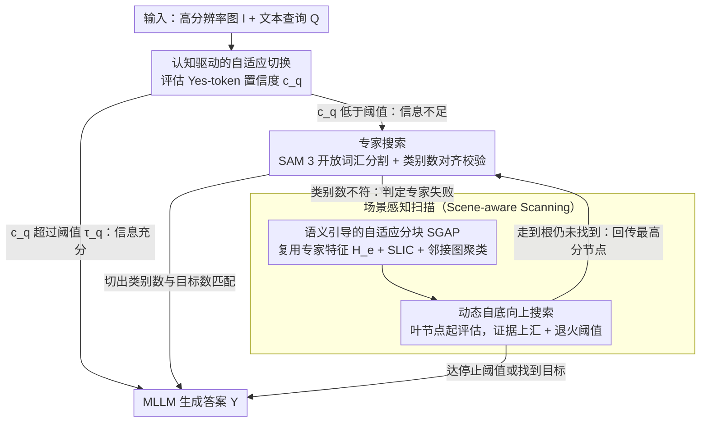

# CVSearch: Empowering Multimodal LLMs with Cognitive Visual Search for High-Resolution Image Perception

**会议**: ICML2026  
**arXiv**: [2605.23655](https://arxiv.org/abs/2605.23655)  
**代码**: https://github.com/ICML26-CVSearch (论文声明已开源)  
**领域**: 多模态VLM  
**关键词**: 高分辨率感知, 视觉搜索, 训练自由框架, 语义自适应分块, 自底向上搜索

## 一句话总结
CVSearch 提出一个无需训练的"评估-再搜索"认知框架：先用视觉专家（SAM 3）做快速定位，专家失败时再触发语义引导的自适应分块 + 自底向上搜索作为兜底，在 V*Bench、HR-Bench 等高分辨率基准上同时拿到精度与效率的 SOTA。

## 研究背景与动机

**领域现状**：当前多模态大模型（MLLM）大多以固定低分辨率（如 $336\times336$）处理图像，对真实场景中的高分辨率图（数千像素长边）需要先做激进的下采样，再走视觉编码器 + 投影 + 语言模型那一套流程。

**现有痛点**：围绕高分辨率感知，已经分化出三条路线，但都不令人满意。Cropping 路线（LLaVA-NeXT 等）按固定网格切图，物体跨网格被切开，出现"语义锯齿"；高分辨率编码器路线（LLaVA-HR 等）改架构注入高频特征，但对不同宽高比适应差；视觉搜索路线进一步分为两派：专家辅助型（SEAL、DyFo、V2-SAM）速度快，但完全依赖外部检测器的 proposal 质量，对小目标、抽象目标容易出现"盲点"；扫描型（ZoomEye、RAP、DC²）按树形网格穷举覆盖，鲁棒但浪费算力在背景上，并且仍然存在网格切碎物体的问题。

**核心矛盾**：效率与鲁棒性二元对立——专家辅助快但脆，扫描穷举稳但贵；并且两类方法都"语义无感"，把整张图当作均匀网格处理。

**本文目标**：把两条路线拼成一个统一框架，让模型像人一样先"扫一眼"再决定怎么深看；并且在不得不深看的时候，按语义结构而不是规则网格去切。

**切入角度**：作者借鉴认知科学里的双通路视觉搜索理论——非选择性通路提取全局 gist，选择性通路按注意力模板逐个对象做串行检查；并且强调 scene structure 是注意力部署的主要引导因子。把这套搬到 MLLM 里，就成了"先评估能不能直接答 → 不行就找专家 → 专家也不行就语义扫描"的级联。

**核心 idea**：用 MLLM 自己的"Yes/No" 置信度作为信息充分性信号，把视觉专家失败当作切换到语义扫描的触发器，而不是终点；扫描阶段用专家提取的特征做语义聚类分块，再自底向上传递证据，避免 top-down 搜索的错误传播。

## 方法详解

### 整体框架
输入为高分辨率图像 $\bm{I}\in\mathbb{R}^{H\times W\times 3}$ 与文本查询 $\bm{Q}$，输出为 MLLM 生成的回答 $Y$，整体走 **Assess-then-Search** 三段式流水线：

1. **Assess**：把 $(\bm{I},\bm{Q})$ 喂进 MLLM，用"能否仅凭当前视觉信息回答"的 Yes-token 概率 $c_q(\bm{I})$ 量化信息充分性。若 $c_q(\bm{I})>\tau_q$，直接生成答案，整个搜索流程被旁路。
2. **Expert Search**：当 $c_q$ 不足时，把 $\bm{Q}$ 经 MLLM 内置的 in-context 抽取（fallback 到 SpaCy）拆成目标物体集合 $\bm{O}=\{o_1,\dots,o_m\}$，用 SAM 3 做开放词汇分割得到 bounding box 集合 $\bm{B}_e$ 和密集视觉特征 $\bm{H}_e$。若 SAM 3 切出的目标类别数恰好匹配 $|\bm{O}|$，就按 $\bm{B}_e$ 裁图回答；否则进入第三阶段。
3. **Scene-aware Scanning**：复用 $\bm{H}_e$（节省一次重算），用 SLIC + 受邻接图约束的凝聚聚类做语义自适应分块，递归构造深度 $D$ 的图像树 $\bm{T}$，再从最深层叶节点出发自底向上探索，超过停止阈值则终止；如果走到根都没找到，把根层最高优先级节点反馈给视觉专家做下一轮迭代搜索。

### 关键设计

**1. 认知驱动的自适应切换：把"专家失败"翻译成"切换到扫描"而不是"放弃"**

旧框架的通病是要么硬走专家、要么硬走扫描，遇到小目标或抽象查询就直接崩，而且对所有图一律走完整搜索、白白浪费算力。CVSearch 让 MLLM 自己当裁判，在三档之间动态调度：信息充分性沿用 ZoomEye 的形式 $c_q(\bm{I})=\mathcal{M}(\text{"Yes"}\mid p_q(\bm{Q}),\bm{I})$，把模型对"Yes"这个 token 的归一化概率当成内部置信度，超过切换阈值 $\tau_q=0.9$ 就直接答、整个搜索被旁路。关键巧思在于把"专家失败"的判定从"没框出来"改成"SAM 3 切出的类别数没对齐 $|\bm{O}|$"——这是一个更可靠的信号，并且它触发的不是终止而是切换到语义扫描。搜索终止则用自适应下降阈值 $\tau_{curr}$（从 $\tau_q$ 缓慢退火到最小 $\hat{\tau}_q=0.5$），对易样本保持高确定性、对难样本允许接受不那么自信的预测。这样昂贵的扫描只在真正需要时才被点燃，主路径几乎零额外开销。

**2. 语义引导的自适应分块（SGAP）：按语义连通区域切图，不再把物体切碎**

固定网格切图会制造"语义锯齿"——一个物体被网格线切开后，后续推理拿到的是不完整 token，VL 模型很难自动拼回来；而且它对背景区域一视同仁，白白耗算力。SGAP 直接复用专家已经吐出的特征 $\bm{H}_e$（省一次重算），在它的特征空间上跑 SLIC 得到 $N$ 个原子超像素并构建空间邻接图 $G$，再用受 $G$ 约束的凝聚聚类把原子合并成 $k$ 个空间连通的语义簇，每簇的外接矩形就是一个 patch。簇数 $k$ 的选择是关键，在 $[k_\min,k_\max]=[4,8]$ 内最小化

$$\mathcal{L}(k)=\mathcal{L}_o(\bm{B}_k)-\mathcal{L}_s(\bm{H}_a,\bm{l}_k),$$

其中 $\mathcal{L}_o$ 惩罚 patch 之间的空间重叠、$\mathcal{L}_s$ 是衡量聚类紧致度的 silhouette 分数。每个 patch 还会算一个 Visual Complexity $c_v(\bm{I}_{d,t})=\max(0,\,1-\tfrac{1}{|\bm{R}|}\sum_{i\in\bm{R}}\mathrm{cosim}(\bm{h}_i,\bar{\bm{h}}))$，用平均余弦距离衡量特征发散程度，$c_v<\tau_v=0.4$ 的背景型节点直接被剪枝。让分块策略和后续视觉理解共享同一套表征，等于既保住完整物体，又把计算预算集中到高熵区域。

**3. 动态自底向上搜索：让小目标率先在最清晰的局部视图里被检验**

自顶向下搜索一开始就在低分辨率的全局视图上挑节点，对小目标本来就难判别，一旦错选分支后面整条路径全废。CVSearch 反过来，从语义树 $\bm{T}$ 最深层的叶节点起评估，把证据自下而上汇聚到父节点。每个节点的访问优先级取 $c_x=\alpha\cdot c_v+\beta\cdot c_o+\gamma\cdot c_x^*$，其中 $c_v$ 是上一条的视觉复杂度，$c_o$ 是 MLLM 对"图中是否存在 $o_i$"的 Yes 置信度，$c_x^*$ 是子节点优先级的最大值（叶节点取 0），超参 $(\alpha,\beta,\gamma)=(0.2,0.4,0.4)$。多目标查询沿用 ZoomEye 的解耦策略，为每个 $o_i$ 构造独立子查询；停止准则用退火阈值 $\tau_{curr}$ 配合最小阈值 $\hat{\tau}_q$ 兜底。最妙的是闭环设计：若最深层走完仍没停就向上一层移动，整棵树走完仍找不到，就把第一层最高分节点回传给视觉专家做新一轮 Expert Search——"找不到"被翻译成"重新触发专家"，于是失败变成一个可恢复的迭代状态而非死局。

### 损失函数 / 训练策略
全流程**训练自由 (training-free)**，没有反向传播——所有"分数"都是 MLLM 前向得到的 token 概率或几何/聚类启发式。主要超参：$\tau_q=0.9$、$\tau_v=0.4$、$\hat{\tau}_q=0.5$、$(k_\min,k_\max)=(4,8)$、单目标树深 $D=2$、多目标 $D=3$、$(\alpha,\beta,\gamma)=(0.2,0.4,0.4)$。视觉专家为 SAM 3，基线 MLLM 包括 Qwen2.5-VL-7B、LLaVA-OV-7B、InternVL2.5-8B；训练在 4×A6000 上做，但严格说只是配置而非"训练"。

## 实验关键数据

### 主实验
评估基准覆盖高分辨率专项（V*Bench、HR-Bench 4K/8K）、通用真实场景（MME-RealWorld-Lite、TreeBench）以及无人机超小目标专项（FineRS-4K），平均分辨率约 $2000\times1500$。

| 基线 MLLM | V*Bench | HR-Bench 4K | HR-Bench 8K | 提升来源 |
|---|---|---|---|---|
| LLaVA-OV-7B | 75.4 → **91.6** | 63.0 → **75.6** | 59.8 → **74.8** | +CVSearch |
| Qwen2.5-VL-7B | 71.2 → **90.1** | 68.8 → **76.6** | 65.3 → **75.6** | +CVSearch |
| InternVL2.5-8B | 69.1 → **89.0** | 66.0 → **77.0** | 57.4 → **77.6** | +CVSearch |
| GPT-4o（闭源参考） | 66.0 | 59.0 | 55.5 | — |
| Qwen2.5-VL-32B | 85.9 | 74.8 | 71.6 | 仅作对照 |

接在 7B 级开源模型后面就反超 32B 模型与 GPT-4o，证明该框架的瓶颈不在参数量而在"看哪里"。

### 消融实验
| 配置 | V* / HR-4K / HR-8K（示意） | 说明 |
|---|---|---|
| Full CVSearch | 90.1 / 76.6 / 75.6 | LLaVA-OV-7B 之外的标杆 Qwen2.5-VL-7B 完整版 |
| w/o Expert Search（只剩扫描） | 显著下降 | 失去快速通路，简单样本被迫深搜 |
| w/o Scene-aware Scanning | 显著下降 | 失去专家失败后的兜底，小目标盲点回归 |
| w/o SGAP（回退固定网格） | 中等下降 | 出现语义锯齿与背景空跑 |
| w/o Bottom-Up（改 top-down） | 中等下降 | 小目标错误路径无法回收 |

### 关键发现
- **专家与扫描互为兜底**：哪一支单独存在都打不过组合，证明效率-鲁棒性的取舍可以通过级联而不是改架构来化解。
- **SGAP 的收益主要来自小目标**：固定网格切碎跨网格物体后，后续推理拿到的是不完整 token，VL 模型很难自动拼回来。
- **自底向上 + 退火阈值是迭代闭环的关键**：当退火停止条件触发时，未找到的难样本会被反馈到专家做第二轮，形成"搜索-评估-再搜索"循环，对小/抽象目标提升最明显。
- **训练自由是结构性优势**：不需要修改基线 MLLM 权重，意味着 LLaVA-OV、Qwen2.5-VL、InternVL2.5 都能即插即用，部署面更宽。

## 亮点与洞察
- 用 MLLM 自身的 Yes-token 置信度做调度器，既复用模型已有能力，又规避了额外训练裁判模型的成本，思想可迁移到任何需要"什么时候停"的搜索流程。
- "专家失败 → 触发扫描"这一步把检测器的局限性翻译成框架内部的有用信号，本质上是把单点失败重塑成多阶段决策中的合理状态。
- SGAP 的设计揭示一个被忽视的事实：分块策略其实和后续 VLM 表征共享同一空间，与其重新引入新的分块特征，不如复用专家已经吐出来的 $\bm{H}_e$，这条思路可以迁移到任意"先分块再 VLM"的 pipeline。
- 自底向上搜索 + 退火阈值这种"先严后宽"的调度，是从经典启发式搜索拿过来的，但和 MLLM 的不确定性表达结合后非常自然，可推广到 RAG / 智能体类的多步检索任务。

## 局限与展望
- 整条流水线对 SAM 3 的能力曲线敏感：如果专家本身在某个域漂得很厉害（如医学、遥感），认知切换的"快速路径"会大幅退化，扫描代价被迫上升。
- 信息充分性 $c_q$ 来自 MLLM 的 Yes-token 概率，已有研究表明这种内部信号在分布外样本上经常自信过高，可能让"直接答"路径吞掉本应进入搜索的样本。
- 自适应聚类的搜索区间 $[k_\min,k_\max]=[4,8]$ 与树深 $D\in\{2,3\}$ 都是人工设定，对极端宽高比或多目标密集场景的最优值还需要调；可探索基于场景复杂度自动选 $k$ 和 $D$。
- 训练自由的双刃剑：精度天花板很大程度上由基线 MLLM 的细粒度感知决定，单靠搜索策略再优化也有边界，未来工作可能要把这套 cognitive workflow 反过来当作蒸馏信号去微调基线模型。

## 相关工作与启发
- **vs SEAL / DyFo（专家辅助型）**：本文保留了它们的"快速专家定位"思路，但用 SAM 3 + 类别数对齐校验替代单纯的 box 阈值，并把失败状态接到扫描分支，避免出现"专家失败 = 模型失明"的硬停。
- **vs ZoomEye / RAP / DC²（扫描型）**：同样走树形搜索，但 SGAP 改掉了固定网格、Visual Complexity 剪掉了背景节点、自底向上替换了 top-down 遍历，三条改动直接攻打扫描型的"贵 + 碎 + 错传"三大病。
- **vs LLaVA-HR / 高分辨率编码器**：避开了改架构的工程成本，证明在不动权重的前提下仅靠搜索策略，就能让 7B 模型逼近 32B 闭源；对算力受限场景特别友好。

## 评分
- 新颖性: ⭐⭐⭐⭐ 把认知科学的双通路搜索翻成"专家失败触发语义扫描"的级联，并不是某个组件颠覆，而是把视觉搜索领域两条路线接通了，工程美学很高。
- 实验充分度: ⭐⭐⭐⭐ 三种基线 MLLM + 五个基准 + 与专家/扫描类方法的横向对比基本齐全，但若再加入分布外/医学影像/小语种 OCR 等场景会更有说服力。
- 写作质量: ⭐⭐⭐⭐ 结构清晰，公式与认知科学动机的衔接到位，部分超参 ablation 的细节藏在附录里需读者主动去拼。
- 价值: ⭐⭐⭐⭐ 训练自由 + 即插即用 + 大幅 SOTA，工业落地友好，是高分辨率 VLM 一年内难绕开的基线。

<!-- RELATED:START -->

## 相关论文

- [\[ICML 2026\] Self-Prophetic Decoding to Unlock Visual Search in LVLMs](self-prophetic_decoding_to_unlock_visual_search_in_lvlms.md)
- [\[ICCV 2025\] HRScene: How Far Are VLMs from Effective High-Resolution Image Understanding?](../../ICCV2025/multimodal_vlm/hrscene_how_far_are_vlms_from_effective_high-resolution_image_understanding.md)
- [\[ACL 2025\] VisuoThink: Empowering LVLM Reasoning with Multimodal Tree Search](../../ACL2025/multimodal_vlm/visuothink_empowering_lvlm_reasoning_with_multimodal_tree_search.md)
- [\[ICLR 2026\] GLYPH-SR: Can We Achieve Both High-Quality Image Super-Resolution and High-Fidelity Text Recovery via VLM-Guided Latent Diffusion Model?](../../ICLR2026/multimodal_vlm/glyph-sr_can_we_achieve_both_high-quality_image_super-resolution_and_high-fideli.md)
- [\[ICCV 2025\] FALCON: Resolving Visual Redundancy and Fragmentation in High-resolution Multimodal Large Language Models via Visual Registers](../../ICCV2025/multimodal_vlm/falcon_resolving_visual_redundancy_and_fragmentation_in_high.md)

<!-- RELATED:END -->
