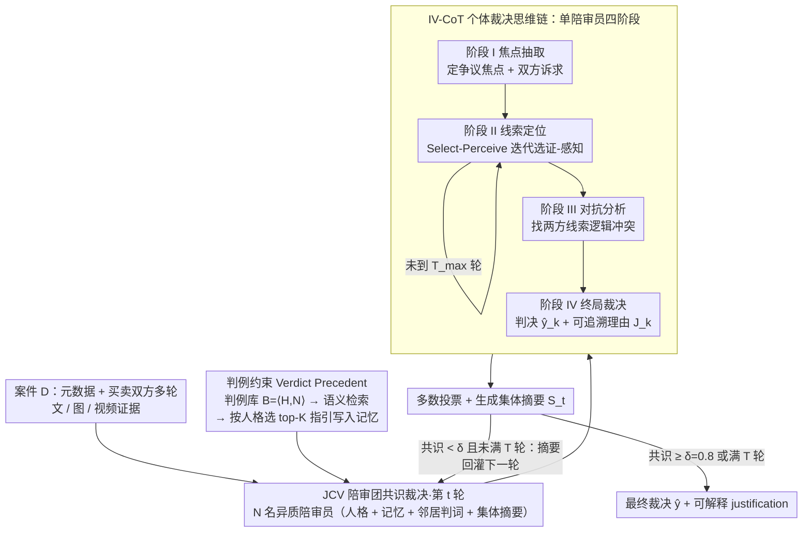

# CyberJurors: A Multi-Agent Simulation Task for E-Commerce Disputes Verdict

**会议**: ICML 2026  
**arXiv**: [2605.28369](https://arxiv.org/abs/2605.28369)  
**代码**: https://github.com/YanhuiS/CyberJurors  
**领域**: 多智能体 / 法律与电商 AI / 多模态推理  
**关键词**: 电商纠纷裁决, 众包陪审团, 多智能体仿真, IV-CoT, 判例约束  

## 一句话总结
作者把电商平台"众包陪审团"的真实裁决任务形式化为 EDV (E-commerce Dispute Verdicts)，构建首个含 17 名陪审员投票真值的多模态基准 VerdictBench（6000 案、文/图/视频/多轮），并提出 CyberJurors——用四阶段的 Individual Verdict Chain-of-Thought (IV-CoT) 做单陪审员细粒度证据定位，用 Jury Consensus Verdict (JCV) 借鉴 Stare Decisis 引入历史判例做集体共识；在 VerdictBench 上 Acc 较最强 LLM/MLLM/法庭仿真器分别 +9.48%/+9.38%/+6.19%。

## 研究背景与动机
**领域现状**：电商平台为高效处理海量交易纠纷，引入"众包陪审团"机制——买卖双方多轮提交多模态证据（聊天记录、图像、视频），17 名志愿陪审员裁定胜负。该机制规模化的瓶颈在于招募 17 名陪审员往往要数天。最近多智能体系统（ChatEval、AgentCourt 等）在法律判决任务上展示了潜力。

**现有痛点**：把法律领域的 multi-agent 法庭仿真直接迁移到电商纠纷裁决并不可行，原因有二：

**核心矛盾**：(1) 电商纠纷的证据是**冗余、多轮、跨模态**的（提问/反驳/澄清交替进行），关键线索往往埋在大量证据中——现有方法局限于纯文本推理，即便用 MLLM 也是被动一次性输入，无法从冗余证据里捕捉细粒度视觉线索（如视频中 2% 电量的闪烁指示灯）；这导致一个反直觉现象：MLLM 在 EDV 上反而不如纯文本 LLM。(2) 与正式法庭依赖刚性法律条文不同，电商裁决依赖**灵活的、平台特定的交易惯例**，缺乏明确指引，使现有模型暴露生成模型固有偏见，损害公平性与可解释性。

**本文目标**：(a) 提出可被严肃评测的 EDV 任务并给出多模态基准；(b) 设计一个同时解决"细粒度证据定位"和"集体共识 + 公平裁决"的多智能体系统。

**切入角度**：作者借鉴普通法的 "Stare Decisis" 原则——历史判例可以为当前裁决提供规范参考；并把传统的一次性 MLLM 推理改成"选证-感知"的迭代主动证据采样过程。

**核心 idea**：用 IV-CoT 把单陪审员推理拆成"焦点抽取 → 主动选证-感知 → 对抗分析 → 终局裁决"四阶段，用 JCV 在多轮投票中注入判例约束，让 17-juror 仿真既准确又对齐真实投票分布。

## 方法详解

### 整体框架
**数据集 VerdictBench**：6000 案，五大类目（家电/服饰/食品/数码/其它），保留交易元数据 + 多轮多模态证据 + 17 陪审员投票真值。每案平均 14 张图、0.9 段视频；卖家胜率 62.6%（更熟悉履约规则），按类别×难度（17 票边距）3:1:2 分层划分 train/val/test。

**模型 CyberJurors**：建模为有向社交网络 $\boldsymbol{G}=\langle\boldsymbol{A},\boldsymbol{E}\rangle$，$\boldsymbol{A}=\{a_1,...,a_N\}$ 是 $N$ 名异质陪审员，$e_{k,j}\in\boldsymbol{E}$ 表示 $a_k$ 关注 $a_j$。给定案件 $\boldsymbol{D}=\{d,\bm{e}_1^b,\bm{e}_1^s,...\}$（$d$ 为元数据，$\bm{e}_i^b=\{\bm{T}_i^b,\bm{I}_i^b,\bm{V}_i^b\}$ 为买家第 $i$ 轮文/图/视频证据，卖方对称），JCV 模拟 $T$ 轮讨论：每轮所有陪审员先拿到上一轮 Collective Verdict Summary 与 Verdict Precedent Base，再用 IV-CoT 各自产生判决 $\hat y_{k,t}$ 与理由 $J_{k,t}$；最后多数投票得最终裁决，summary 作为可解释 justification。整体是「集体层 JCV 多轮仿真」外层套「个体层 IV-CoT 四阶段推理」内层、再由判例约束在两层之间注入规范的嵌套结构：

### 关键设计

**1. Individual Verdict Chain-of-Thought（IV-CoT）：把单陪审员推理拆成四阶段，核心是"选证-感知"主动迭代**

MLLM 在超长上下文里"被动一次性感知"会把关键视觉线索（如视频里 2% 电量的闪烁指示灯）淹没在十几张图、近一段视频的冗余证据中。IV-CoT 把单陪审员的推理拆成四步，让它主动去捞线索。阶段 I 焦点抽取 $\boldsymbol{O}_{\text{I}}:\{F,F^b,F^s\}=\mathcal{F}_{\text{extract}}(d,\bm{T}^b,\bm{T}^s)$ 先定争议焦点和双方诉求；阶段 II 线索定位是最关键的创新，把一次性多模态理解换成 "Select-Perceive" 迭代——每轮先 $\bm{e}^b_{*,t}=\mathcal{F}_{\text{select}}(\boldsymbol{O}_{\text{I}},\bm{T}^b-\bm{T}^b_{select})$ 挑出最可能含关键线索的一段证据，再 $\{K_t^b,A_t^b\}=\mathcal{F}_{\text{perceive}}(\boldsymbol{O}_{\text{I}},\bm{e}^b_{*,t},\boldsymbol{O}_{t-1}^b)$ 只在这一段上做细粒度感知，循环到 $T_{max}$ 轮，买卖双方各自独立迭代以免证据互扰；阶段 III 对抗分析 $\{\Delta,\Delta^b,\Delta^s\}=\mathcal{F}_{\text{analyze}}(\boldsymbol{O}_{\text{I}},\boldsymbol{O}_{\text{II}})$ 找出两方线索的逻辑冲突；阶段 IV 终局裁决 $\{\hat y_k,J_k\}=\mathcal{F}_{\text{judge}}(\cdot)$ 给出判决和可追溯理由。这样把上下文压在每轮一段证据上，既绕开窗口瓶颈，又把"焦点→证据"的因果链显式记进 $\boldsymbol{O}_{\text{II}}$。消融显示 Select-Perceive 迭代比单步选证多带来 3.28% Acc，是 IV-CoT 内部贡献最大的设计。

**2. Jury Consensus Verdict（JCV）：用 $T$ 轮异质陪审员社交仿真把单模型偏见摊平**

单个 LLM 在缺乏成文法约束时会复读训练数据里的偏见（如系统性偏向卖家）。JCV 把裁决建模成有向社交网络 $\boldsymbol{G}$ 上的多轮讨论：每个陪审员 $a_k=\{\boldsymbol{P}_k,\boldsymbol{M}_k\}$ 由人格 $\boldsymbol{P}_k$ 加记忆 $\boldsymbol{M}_k$ 组成，第 $t$ 轮的决策同时依赖案件、人格、记忆、邻居上一轮判词 $\boldsymbol{R}_{k,t}=\{J_{j,t-1}\mid e_{k,j}\in\boldsymbol{E}\}$ 和全局集体摘要 $\boldsymbol{S}_t=\mathcal{F}_{\text{sum}}(d,\bigcup_j J_{j,t-1})$，即 $\hat y_{k,t},J_{k,t}=\mathcal{F}_{\text{judge}}(\boldsymbol{D},\boldsymbol{P}_k,\boldsymbol{M}_k,\boldsymbol{R}_{k,t},\boldsymbol{S}_t)$，最后多数投票 $\hat y=\mathbb{I}(\hat y^s>\hat y^b)$。让 $N$ 个异质陪审员沿网络局部交换意见、再用全局 summary 做宏观引导，既保留独立推理又能逼外围陪审员重审极端立场，决策更稳。

**3. Verdict Precedent：把普通法的 Stare Decisis 注入 agent 记忆**

电商裁决没有刚性法条，只有灵活的平台惯例，模型缺指引就容易暴露偏见。作者借 Stare Decisis 原则用历史判例补这个空白：构造 Precedent Base $\boldsymbol{B}=\langle\boldsymbol{H},\boldsymbol{N}\rangle$（$\boldsymbol{H}$ 是历史判例，$\boldsymbol{N}$ 是从中蒸馏的显式裁决指引），新案件先语义检索 $\boldsymbol{H}_{\text{guide}},\boldsymbol{N}_{\text{guide}}=\mathcal{F}_{\text{retrieve}}(\boldsymbol{D},\boldsymbol{B})$ 找最相关判例，再按 $\boldsymbol{M}_k=\{\text{Rank}(\Phi(\boldsymbol{P}_k,\boldsymbol{N}_j))\le K\}$ 给每个陪审员挑 top-$K$ 条与其人格最匹配的指引写进记忆。判例在这里不只替代"法条"，还做了个性化——不同人格分到不同 norm 子集，既模拟现实陪审团成员关注点的天然差异，又保证整体围绕同一批判例展开，兼顾公平与可解释。

### 一个完整示例：一桩"手机充不进电"的纠纷怎么跑完一轮

以一桩数码类纠纷为例：买家称手机充不进电、附 14 张聊天截图和一段开箱视频，卖家反驳称是买家操作问题。①IV-CoT 阶段 I 抽出焦点"设备是否出厂即故障"；②阶段 II 的 Select-Perceive 不会一口气读完所有证据，而是先选出那段开箱视频做细粒度感知，捕捉到画面里电量指示灯停在 2% 闪烁这条关键线索，再回头选聊天记录补证；③阶段 III 把"卖家称已测试通过"与"视频显示无法充电"的冲突摆出来；④阶段 IV 该陪审员判买家胜并写明理由。与此同时另外 16 名异质人格陪审员各自跑一遍 IV-CoT，JCV 把上一轮判词和判例指引喂给每人做第 2、3 轮讨论，集体共识超过 $\delta=0.8$ 就提前停，最终多数投票出裁决，集体摘要充当可解释 justification。整条链里"主动选证"是把长冗余多模态证据压成局部 perception 的关键。

### 损失函数 / 训练策略
全推理框架，使用 Gemini-2.5-Flash-Lite-Nothinking 做底座；$T_{max}=3$（IV-CoT 选证-感知最大轮数）、$T=3$（JCV 讨论轮数）、$K=3$（每陪审员保留 top-3 判例指引）、early-stop 阈值 $\delta=0.8$（集体共识超过即停止）、视频按 30 帧均匀采样。$\boldsymbol{G}$ 初始化沿用既有社交模拟工作。

## 实验关键数据

### 主实验
在 VerdictBench 测试集上对比 5 类基线（闭源/开源 LLM、闭源/开源 MLLM、法庭仿真器）：

| 类别 | 方法 | Acc ↑ | Weig. F1 ↑ | Macro F1 ↑ | MAE ↓ | RMSE ↓ | Token ↓ |
|------|------|-------|-----------|-----------|-------|-------|---------|
| Closed LLM | GPT-5.2-Chat | 0.6344 | 0.6309 | 0.6340 | - | - | 158k |
| Closed LLM | DeepSeek-V3 | 0.6080 | 0.6042 | 0.6075 | - | - | 114k |
| Open LLM | Dolphin3.0-R1-24B | 0.4929 | 0.4568 | 0.4790 | - | - | 145k |
| Closed MLLM | Gemini-3-Pro | 0.6354 | 0.6378 | 0.6351 | - | - | 4.37M |
| Closed MLLM | Claude-Opus-4.5 | 0.5910 | 0.5901 | 0.5910 | - | - | 2.70M |
| Closed MLLM | GPT-5.2 | 0.4833 | 0.4907 | 0.4798 | - | - | 1.63M |
| Open MLLM | Qwen3-VL-235B | 0.4843 | 0.4748 | 0.4825 | - | - | 2.99M |
| Court Sim | ChatEval | 0.6589 | 0.6645 | 0.6525 | - | - | 0.92M |
| Court Sim | AgentCourt | 0.6673 | 0.6644 | 0.6383 | - | - | 75.28M |
| **Ours** | **CyberJurors** | **0.7292** | **0.7258** | **0.7037** | **4.7312** | **6.3724** | 62.33M |

CyberJurors 相对第二名 (AgentCourt) Acc 提升 6.19%、Weig. F1 提升 0.0613；只有它能给出与 17 票真实分布对齐的 MAE/RMSE。一个反直觉发现：MLLM 平均 Acc 52.98% < 纯文本 LLM 平均 55.78%，印证 MLLM "被动一次性感知"在长上下文下定位关键视觉线索的能力不足。

### 消融实验
在验证集上对 CyberJurors 各模块逐步开启：

| 配置 | Acc ↑ | Weig. F1 ↑ | Macro F1 ↑ | 备注 |
|------|-------|-----------|-----------|------|
| Baseline | 0.5416 | 0.5433 | 0.5385 | 纯 Gemini-2.5-Flash-Lite 直接判 |
| + Rules | 0.5876 | 0.5887 | 0.5875 | 加裁决规则 prompt：+4.60% |
| + SR-CoT | 0.6406 | 0.6416 | 0.6810 | 四阶段但 Stage II 一步选证：+5.30% |
| + IV-CoT | 0.6734 | 0.6788 | 0.6757 | 加 Select-Perceive 迭代：+3.28% |
| + Jury | 0.7018 | 0.7043 | 0.6868 | 加多陪审员仿真：+2.84% |
| + Precedent | **0.7252** | 0.7196 | 0.6980 | 加判例约束：+2.34% |

### 关键发现
- "Select-Perceive" 迭代相比单步选证多带来 3.28% Acc，是 IV-CoT 内部贡献最大的设计；说明在冗余多模态证据下，**主动多轮采样**胜过一次性灌入。
- 加 Jury 仿真 +2.84%、再加判例 +2.34%，二者收益相当——既证明"集体共识"自身有效，又证明把规范约束写进个体 memory 仍能进一步提升。
- Token 消耗 62.33M 显著高于单 LLM（百 k 级），但低于 AgentCourt（75M）；CyberJurors 用更少 token 换更高准确率，可视为对法庭仿真的一次"裁剪式"重设计。

## 亮点与洞察
- **任务定义的现实价值**：EDV 直接对接电商平台真实运营场景，"17 票真值"既给出标签也给出难度（票差），让基准天然带难度分布——可同时评估准确率和与真实社会共识的分布对齐度。
- **"被动 MLLM 不如主动 LLM"的反直觉证据**：长上下文 + 多模态证据冗余的设定下，简单堆砌 MLLM 反而拖后腿；这条经验对所有"多轮多模态 agent"任务都是重要警示——视觉编码必须配合主动检索/迭代 perception 才能发挥价值。
- **Stare Decisis 作为 multi-agent 的规范源**：把法学原则作为 memory 注入而非硬约束，让"判例 → 个性化指引"成为一种新颖的对齐机制，迁移到内容审核、合规审计等"无成文法规"的多 agent 任务都很自然。

## 局限与展望
- 单 backbone（Gemini-2.5-Flash-Lite）：换不同模型时 JCV 内部异质性是否同样有效尚未验证。
- VerdictBench 卖家胜率 62.6%、买家 37.4% 的不平衡可能让 CyberJurors 仍然继承"对卖家有利"的偏置——论文未给出按胜负方向拆开的公平性指标。
- 判例库的检索质量直接影响 $\boldsymbol{M}_k$；当遇到稀有类目或冷启动时，缺乏判例如何回退仍未讨论。
- 视频被压到 30 帧均采，对于事件性证据（如开箱视频）可能漏掉关键帧；可考虑事件感知采样作为后续。

## 相关工作与启发
- **vs ChatEval / AgentCourt**：他们做的是"通用辩论 / 法律法庭仿真"，输入以文本判决书为主；本工作把场景换到电商多模态多轮，并引入主动证据采样和判例个性化，让 court-simulator 范式真正能跑通"长冗余多模态证据"。
- **vs 纯 MLLM 端到端推理**：直接喂 14 图 + 0.9 视频给 MLLM 反而比 LLM 还差；CyberJurors 的 Select-Perceive 给出了把"长输入"分解成"目标驱动的局部 perception"的工程模板，可推广到其他长多模态文档理解任务。
- **vs Chain-of-Thought**：标准 CoT 是单线推理，IV-CoT 把"选证-感知"显式独立成 Stage II 形成证据-逻辑双层链；当任务里"证据选择"本身就是难点时，这种解耦比单纯加 reasoning token 更有效。

## 评分
- 新颖性: ⭐⭐⭐⭐ 把电商众包陪审团形式化为 EDV、首个 17 票真值多模态裁决基准、把判例做成 agent memory 都是新东西。
- 实验充分度: ⭐⭐⭐⭐ 5 类共 14 个 baseline、5 步消融、token 比较；缺多 backbone 与公平性细分。
- 写作质量: ⭐⭐⭐⭐ 任务动机讲得很清楚，IV-CoT 的四阶段与 JCV 的形式化都给到了公式与符号定义。
- 价值: ⭐⭐⭐⭐⭐ 既给了高质量基准也给了一个可直接落地为商用辅助系统的方法，对学术与工业都很实用。

<!-- RELATED:START -->

## 相关论文

- [\[ACL 2026\] AFMRL: Attribute-Enhanced Fine-Grained Multi-Modal Representation Learning in E-commerce](../../ACL2026/multimodal_vlm/afmrl_attribute-enhanced_fine-grained_multi-modal_representation_learning_in_e-c.md)
- [\[CVPR 2026\] VS-Bench: Evaluating VLMs for Strategic Abilities in Multi-Agent Environments](../../CVPR2026/multimodal_vlm/vs_bench_evaluating_vlms_for_strategic_abilities_in_multi_agent_environments.md)
- [\[ACL 2026\] From Heads to Neurons: Causal Attribution and Steering in Multi-Task Vision-Language Models](../../ACL2026/multimodal_vlm/from_heads_to_neurons_causal_attribution_and_steering_in_multi-task_vision-langu.md)
- [\[ACL 2026\] MONETA: Multimodal Industry Classification through Geographic Information with Multi Agent Systems](../../ACL2026/multimodal_vlm/moneta_multimodal_industry_classification_through_geographic_information_with_mu.md)
- [\[AAAI 2026\] Concept-RuleNet: Grounded Multi-Agent Neurosymbolic Reasoning in Vision Language Models](../../AAAI2026/multimodal_vlm/concept-rulenet_grounded_multi-agent_neurosymbolic_reasoning.md)

<!-- RELATED:END -->
