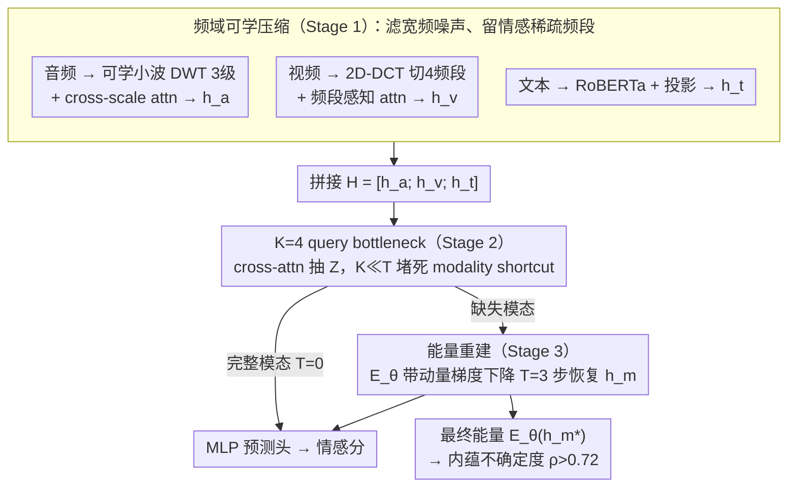

# DCER: Robust Multimodal Fusion via Dual-Stage Compression and Energy-Based Reconstruction

**会议**: ICML 2026  
**arXiv**: [2602.04904](https://arxiv.org/abs/2602.04904)  
**代码**: 即将在 GitHub 开源（论文承诺）  
**领域**: 多模态融合 / 多模态情感分析  
**关键词**: 双阶段压缩, 频域变换, bottleneck token, 能量模型, 缺失模态

## 一句话总结
DCER 把"模态内频域压缩 + 跨模态 bottleneck token"作为统一的鲁棒融合管道，并用一个学习的能量函数对缺失模态做梯度下降式重建，同时把最终能量值当作内蕴的不确定度，在 MOSI/MOSEI/SIMS 上同时刷新 SOTA。

## 研究背景与动机

**领域现状**：多模态情感分析（MSA）目前主流是 cross-modal attention（MulT）、tensor fusion、MAG-BERT 这类"先各自编码、再 concat / 交叉注意"的方案，并在完整模态下分数很高。

**现有痛点**：(a) 这些方案给了模型自由学"每个模态独立的旁路通道"——某一模态缺席时整个预测会塌掉；(b) raw audio/video 中绝大多数维度是噪声，没有显式压缩机制时模型很难抓住情感真正所在的频段；(c) 现有 missing-modality 评估用零填充，模型可以把"零"当作隐藏 token 利用，会**高估**鲁棒性 15–51%（作者实测）。

**核心矛盾**：在"高完整数据表现"和"模态缺失时鲁棒"之间——前者鼓励学到独立 modality pathway，后者要求强迫所有模态共享一个 bottleneck。

**本文目标**：(1) 同时解决噪声鲁棒 + 缺失鲁棒；(2) 提供 intrinsic uncertainty；(3) 给出更严格的评估协议（noise-masking 而非 zero-masking）。

**切入角度**：信息瓶颈原理 + 频域先验。情感信号在频域是稀疏的（音频对应韵律低频段，视频对应面部低空间频），噪声相反是宽频均匀分布——频域变换天然做有损压缩。再叠一个"少量可学 query token 作为跨模态固定容量瓶颈"，强迫所有模态信息挤进去，禁止 modality shortcut。

**核心 idea**：把"压缩"作为一切的统一语言——模态内（频域）+ 跨模态（query bottleneck）+ 缺失重建（能量函数）一气贯穿，最终能量值再"白送"不确定度。

## 方法详解

### 整体框架
管道分三阶段：**Stage 1（模态内频域压缩）**：audio 用可学小波（DWT, 3 level）做多尺度时频压缩，video 用 2D DCT 切 4 个频段做带感知注意力，text 用 RoBERTa + 投影（文本已经是离散符号化的压缩）。**Stage 2（跨模态 bottleneck）**：把三模态拼成 $H=[h_a;h_v;h_t]$，$K=4$ 个可学 query $Q$ 通过 cross-attn 抽出 $Z=\mathrm{softmax}(QH^\top/\sqrt D)H \in \mathbb R^{K\times D}$，因 $K\ll T_a+T_v+T_t$ 形成强容量约束。**Stage 3（能量重建）**：模态缺失时由能量函数 $E_\theta(h_m;Z)$ 出发做 $T=3$ 步带动量梯度下降恢复 $h_m^*$，最终能量 $E_\theta(h_m^*)$ 充当不确定度。最后接 MLP 预测头出情感分。

### 关键设计

**1. 频域可学压缩（Stage 1）：在融合之前先把宽频噪声滤掉、留住情感所在的稀疏频段**

raw audio/video 里绝大多数维度是噪声，固定的 BatchNorm/LayerNorm 没法"按频段过滤"，模型很难抓住情感真正落在哪个频段。作者的切入点是频域先验——情感信号在频域稀疏（音频对应韵律低频、视频对应面部低空间频），噪声则宽频均匀，于是频域变换天然就是一道有损压缩。具体上 audio 用 Daubechies-4 初始化的可学小波做 3 级 DWT，得到多尺度系数 $\{c_L,d_L,\ldots,d_1\}$ 再用 cross-scale attention 融合成 $h_a$；video 走 2D-DCT 切 4 个频段、频段边界也可学，再做 frequency-aware attention 得 $h_v$；text 已是离散符号化的天然压缩，直接 RoBERTa + 投影。让分解参数可学的好处是既保住小波/DCT 的正交稀疏先验，又能 task-adaptive 地挑频段——消融里去掉频域压缩，完整模态 MAE 涨 3.7%，极端缺失下涨 12.3%。

**2. K=4 query token 作为跨模态固定容量 bottleneck（Stage 2）：堵死 modality shortcut**

"高完整数据表现"会诱导模型偷偷学每个模态独立的旁路通道 $\hat y = f_a(h_a)+f_v(h_v)+f_t(h_t)$，结果某模态一缺，预测就塌。DCER 的对策是受 Perceiver 启发架一个固定容量的瓶颈：把三模态拼成 $H=[h_a;h_v;h_t]$，让 $K=4$ 个可学 query 通过 cross-attn 抽出 $Z=\mathrm{softmax}(QH^\top/\sqrt D)H \in \mathbb R^{K\times D}$，因为 $K\ll T_a+T_v+T_t$ 形成强容量约束，预测只能基于 $Z$，独立通道求和的捷径被物理堵死。中间走 6 层 fusion transformer（每层 bottleneck←modalities cross-attn、bottleneck self-attn、FFN + 残差），$K=4$ 是压缩与表达力的甜点（$K=2$ 信息丢失、$K=8$ 接近无瓶颈）。这个 modality-agnostic 的聚合点还有个副作用——即便缺一个模态，仍有 $K$ 个 token 能继续参与下游推理。

**3. 能量函数 + 梯度重建 + 自带不确定度（Stage 3）：把"重建"变成几步下山，顺带白送一个置信度**

传统 VAE/GAN 在高维重建不稳定，IB 显式优化又难训。DCER 改用能量函数 $E_\theta(h_m;Z)=f_\theta(h_m - \mathrm{CrossAttn}(h_m, Z)) + \lambda_E g_\theta(h_m)$（$f_\theta,g_\theta$ 是学习的 MLP），缺模态时从 $\mu_\theta(Z,h_\mathrm{obs})+\epsilon$ 初始化后做 $T=3$ 步带动量梯度下降 $h_m^{(t)}\leftarrow h_m^{(t-1)} - (\rho v^{(t-1)}+\eta\nabla E_\theta)$，把缺失模态拉进学到的低能量盆地；完整模态时 $T=0$，缺失时 $T=3$ 才显著起效。这么做不仅简单稳定，还白捡一个不确定度——最终能量值 $E_\theta(h_m^*)$ 与预测误差的相关系数 $\rho>0.72$，下游可直接拿它当风险敏感预测的拒识阈值，省掉 MC dropout 或 ensemble。

### 损失函数 / 训练策略
总损失 $\mathcal L = \mathcal L_\mathrm{pred} + \alpha\mathcal L_\mathrm{recon} + \beta\mathcal L_\mathrm{energy} + \gamma\mathcal L_\mathrm{joint}$，其中 $\alpha=0.1,\beta=0.01,\gamma=0.05$；$\mathcal L_\mathrm{joint}=\|Z_\mathrm{full}-Z_\mathrm{recon}\|^2$ 保证用真实模态算出的 bottleneck 与用重建模态算出的 bottleneck 一致。优化器 AdamW lr=1e-5，batch 32，40 epoch，5 seed 平均。

## 实验关键数据

### 主实验

| 数据集 | 指标 | DCER | 次优 | 提升 |
|---|---|---|---|---|
| CMU-MOSI | MAE↓ | **0.669** | 0.710 (MMA) | -5.8% |
| CMU-MOSI | Corr↑ | **0.823** | 0.796 (EMT) | +3.4% |
| CMU-MOSI | Acc-7↑ | **51.6%** | 48.1% (MSAmba) | +7.3% |
| CMU-MOSEI | MAE↓ | **0.498** | 0.514 (MSAmba) | -3.1% |
| CMU-MOSEI | Acc-7↑ | **55.0%** | 53.6% (EMT) | +2.6% |
| CMU-MOSEI | F1↑ | **84.9** | 83.9 (MSAmba) | +1.2% |
| CH-SIMS | Acc-5↑ | **55.5%** | 45.2% (MTFN) | +22.8% |
| CH-SIMS | F1↑ | **81.7** | 79.7 (MMA) | +2.5% |

### 消融实验

| 配置 | MOSI MAE↓ | MOSI Acc-7↑ |
|---|---|---|
| Full DCER ($K=4$, freq on, $T=3$ for missing) | 0.669 | 51.6 |
| w/o 频域压缩（线性投影代替小波/DCT） | 0.694 | -3.7%（完整）/ -12.3%（极端缺失） |
| $K=2$ token | 信息丢失明显 | 下降 |
| $K=8$ token | 接近无瓶颈，过拟合 | 下降 |
| $T=0$（无能量迭代） | 缺失场景显著下降 | $T=3$ 是 sweet spot |
| zero-mask 评估 vs noise-mask | 前者高估 15–51% | 说明协议本身有问题 |

### 关键发现
- 鲁棒性呈 **U 型**：完整模态时多模态融合最强，重度缺失（>50%）时也最强——中间段几乎与单模态打平，原因是丢一两个模态时还存在 modality shortcut 可以"骗"模型，强缺失反而逼出真正学到的跨模态压缩表示。
- 能量值与预测误差相关系数 $\rho>0.72$，等于免费提供了不确定度——下游可直接用 $E_\theta$ 作风险敏感预测的拒识阈值。
- Acc-5 在 CH-SIMS 上 +22.8% 是惊人的细粒度增益，说明跨模态 bottleneck 把"模糊情感"的判别力拉满。

## 亮点与洞察
- 把"压缩"提升为统一语言：模态内（频域）+ 跨模态（query bottleneck）+ 缺失重建（能量函数）三个看似无关的模块都被解释为同一个"capacity-limited channel"原则——这种贯穿性是少见的好叙事。
- 能量值天然当 uncertainty——免去额外做 MC dropout 或 ensemble 的复杂度，且 $\rho>0.72$ 已经足够工程使用。
- 揭示并修正 zero-mask 评估漏洞：先前 SOTA 表里 missing-rate 性能可能有 15–51% 来自模型把零当作"我知道这里没东西"的隐藏信号；提倡 noise-mask 评估对整个社区都有价值。

## 局限与展望
- 频域选择是手工先验（audio→小波、video→DCT、text→RoBERTa）：换一个模态如 IMU / 生理信号时还得人工挑变换，缺乏自动化机制。
- 能量函数本身较简单（两个 MLP），未与 EBM 主流的 SGLD / 对比散度训练对齐，缺失模态偏多模时可能落入局部最小值。
- 只在 sentiment analysis 上验证，没碰需要多步推理或 long-context 的多模态任务（如 VideoQA）；bottleneck 容量在长序列下是否仍 $K=4$ 最优值得验证。
- "$\rho>0.72$ 相关性"还不是 calibrated uncertainty，未与 conformal prediction / Platt scaling 比较。

## 相关工作与启发
- **vs MulT (Tsai et al. 2019)**: MulT 直接 cross-modal attention，无压缩；DCER 在 cross-attn 前后都加 bottleneck，模态缺失时不塌。
- **vs Perceiver (Jaegle et al. 2021)**: 同样用 learnable query 作 bottleneck，但 Perceiver 没有模态内频域压缩、也没 missing modality 处理。DCER 把这两个补完了。
- **vs EMT (Sun et al. 2023)**: EMT 做 dual-level feature reconstruction 应对缺失，靠 deterministic decoder；DCER 用能量梯度下降，并能输出 uncertainty。
- **vs VAE/GAN-based 缺失模态重建**: 后者高维不稳定；EBM 通过"只学能量、不学显式生成器"绕开了这条难路，并且能量值即不确定度。

## 评分
- 新颖性: ⭐⭐⭐⭐ 频域+bottleneck 都不新，但把 EBM 嫁接到多模态缺失场景并兼做 uncertainty，是少见的组合。
- 实验充分度: ⭐⭐⭐⭐ 三大数据集 + 8 个基线 + 系统消融 + 缺失协议讨论，但未做更复杂的 VideoQA。
- 写作质量: ⭐⭐⭐⭐ Figure 1 把整套故事讲得非常清楚；公式数量合理。
- 价值: ⭐⭐⭐⭐ 对工业级多模态系统有直接落地价值——既给 SOTA 又给 free uncertainty，且揭穿 zero-mask 评估漏洞推动评估改革。

<!-- RELATED:START -->

## 相关论文

- [\[CVPR 2026\] DUET-VLM: Dual Stage Unified Efficient Token Reduction for VLM Training and Inference](../../CVPR2026/multimodal_vlm/duet-vlm_dual_stage_unified_efficient_token_reduction_for_vlm_training_and_infer.md)
- [\[ICML 2026\] Breaking Dual Bottlenecks: Evolving Unified Multimodal Models into Self-Adaptive Interleaved Visual Reasoners](breaking_dual_bottlenecks_evolving_unified_multimodal_models_into_self-adaptive_.md)
- [\[CVPR 2026\] Unbiased Dynamic Multimodal Fusion](../../CVPR2026/multimodal_vlm/unbiased_dynamic_multimodal_fusion.md)
- [\[ICML 2026\] Self-Captioning Multimodal Interaction Tuning: Amplifying Exploitable Redundancies for Robust Vision Language Models](self-captioning_multimodal_interaction_tuning_amplifying_exploitable_redundancie.md)
- [\[CVPR 2026\] EagleNet: Energy-Aware Fine-Grained Relationship Learning Network for Text-Video Retrieval](../../CVPR2026/multimodal_vlm/eaglenet_energy-aware_fine-grained_relationship_learning_network_for_text-video_.md)

<!-- RELATED:END -->
