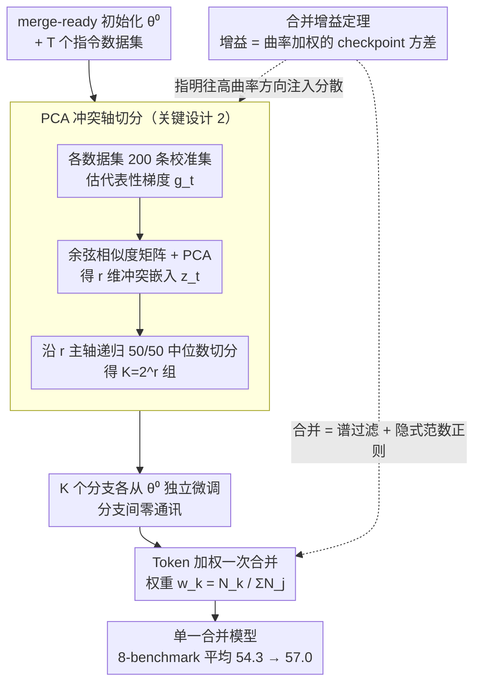

# Decentralized Instruction Tuning: Conflict-Aware Splitting and Weight Merging

**会议**: ICML2026  
**arXiv**: [2606.01717](https://arxiv.org/abs/2606.01717)  
**代码**: https://github.com/naver-ai/merit  
**领域**: 多模态VLM / 模型合并 / 分布式训练  
**关键词**: 指令微调, 权重合并, 梯度冲突, PCA 切分, 多模态对齐  

## 一句话总结
作者从"merge-ready 平坦盆地"出发给权重合并写了一套局部二次理论：合并增益等于曲率加权的 checkpoint 方差，PCA 沿梯度冲突主方向切分能最大化这个增益，并据此提出 MERIT 流水线——按数据集梯度冲突做 PCA 切分、各分支零通讯独立微调、最后一次 token 加权平均，在 Qwen2.5-VL-3B + 136 个 Vision-FLAN 任务上把 8-benchmark 平均从 54.3 提到 57.0。

## 研究背景与动机

**领域现状**：现代 (M)LLM 的能力主要靠大规模 instruction tuning 注入，Vision-FLAN、TÜLU、FLAN 这类数据集动辄上百个任务、上百万样本。主流做法是把所有任务混在一起、在紧耦合 GPU 集群上跑 centralized joint training。

**现有痛点**：这种 "joint" 范式同时被两个瓶颈卡住——（1）**优化侧**：异构任务在共享参数上互相打架，梯度冲突导致 negative transfer 和"僵硬"的动力学，被迫调小学习率；经典 multi-task 修正（GradNorm / PCGrad / CAGrad）在百任务级别 + 几十亿参数下根本跑不起来；（2）**系统侧**：joint 训练依赖 all-reduce 等频繁同步，要求所有 GPU 在同一个高带宽集群里，地理分布式 / 异构卡池 / 云抢占实例都用不了。

**核心矛盾**：两者其实强耦合——数据越异构越需要细粒度同步去对冲冲突，可同步本身又是系统瓶颈；同步一旦缺失，就只能退回到粗暴的"按比例混料"，冲突毫无缓解。

**本文目标**：能否把"混合训练"问题从在线（梯度对齐）变成离线（参数空间求平均）？即把任务先按冲突切开、各自独立训练、最后一次 merge，既消解冲突又不需要同步。

**切入角度**：作者注意到 model soup / Model Stock 这类工作早就指出：只要 fine-tune 起点在同一个平坦盆地里，独立训练的多个 checkpoint 一次性平均往往超过任何单一 checkpoint。这种 "merge-ready" 性质在 post-training 中非常常见（从 instruction-tuned MLLM 继续 SFT 几乎一定满足）。如果能从理论上说清楚"什么样的切分能让 merge 收益最大"，就能把它从经验技巧升级成一套调度算法。

**核心 idea**：在 merge-ready 初始化的局部二次近似下，证明 weight averaging 的增益 $\mathcal{G}_{\mathrm{var}}=\tfrac{1}{2}\sum_\ell \lambda_\ell \mathrm{Var}_w(u_\ell^\top \delta_i)$ 是**曲率加权的 checkpoint 方差**——把分散注入高曲率方向就赚得最多；进一步证明沿数据集梯度做 PCA、按 top-$r$ 主轴切成 $K=2^r$ 组是最大化这一增益的近似最优分配，再加 token 加权一次性合并。

## 方法详解

### 整体框架

MERIT 把 instruction tuning 从"集中式"重塑为"分布式 + 一次合并"，整条 pipeline 在 merge-ready 初始化 $\theta^{(0)}$ 上有 5 步：（1）对 $T$ 个数据集，各在 200 条小校准集上算一个代表性梯度 $g_t$；（2）构造余弦相似度矩阵 $C_{ij}=\langle\tilde g_i,\tilde g_j\rangle$ 并做 PCA，得到每个数据集的 $r$-维冲突嵌入 $z_t$；（3）沿 $r$ 个 PCA 主轴递归做 sample-balanced 的 50/50 中位数切分，得到 $K=2^r$ 组；（4）每组从 $\theta^{(0)}$ 独立微调，**分支间完全零通讯**，可以分散到地理隔离的 GPU 池或 spot 实例；（5）一次性按 token 预算 $w_k=N_k/\sum N_j$ 加权平均成 $\bar\theta$。整套流程把"训练时同步成本"换成了"训练前一次小规模梯度估计 + 训练后一次参数平均"，而贯穿其中的合并增益定理则负责回答"为什么这么切、这么合最优"。

### 关键设计

**1. 平坦盆地中的合并增益定理：把"weight averaging 能多赚多少"写成一个闭式公式**

以前对 model soup 的解释多是"flat minima"经验论，谁也说不清该把分散注入到哪些方向上。这篇论文先把它做成可计算的定理：在共享初始化 $\theta^{(0)}$ 处对 loss 做二次近似 $L(\theta)\approx L(\theta^\star)+\tfrac{1}{2}(\theta-\theta^\star)^\top H(\theta-\theta^\star)$（$H\succeq 0$ 为局部 Hessian），设 $K$ 个 checkpoint 的位移为 $\delta_i=\theta_i-\theta^\star$、权重 $w_i\ge 0$ 加和为 1，则合并增益

$$\mathcal{G}_{\mathrm{var}}:=\sum_i w_i L(\theta_i)-L(\bar\theta_w)=\tfrac{1}{2}\sum_\ell \lambda_\ell \mathrm{Var}_w(u_\ell^\top \delta_i)\ge 0,$$

其中 $\lambda_\ell, u_\ell$ 是 $H$ 的特征对。这个式子说了两件关键的事：合并永远不会更差（增益非负），而且增益主要来自"投影到高曲率方向上的 checkpoint 方差"。于是算法目标一下子明确了——要把分散主动注入到高曲率方向上，这直接推出了下面 PCA 切分的最优性。

**2. PCA 沿数据集梯度冲突轴做切分：把"哪些数据集该分开训"变成一次离线的 $\arg\max\mathcal{G}_{\mathrm{var}}$**

随机切分、K-means 都不直接最大化合并增益，而 PCGrad 那类 per-step 梯度对齐又要在训练循环里同步、跟"零通讯"的目标互斥。MERIT 的做法是在 $\theta^{(0)}$ 处对每个数据集梯度做一阶近似 $\delta_k\approx -\eta\bar g_k$，两组情形下增益化简为 $\mathcal{G}_{\mathrm{var}}=\tfrac{\eta^2}{8}(\bar g_1-\bar g_2)^\top H(\bar g_1-\bar g_2)$；又因为 $g_t=-H\Delta_t$，增益实际由 $H^3$-加权的数据集相互作用主导，所以 PCA 找到的方向恰好是"高曲率 + 高分歧"的方向。实现上用归一化梯度的 cosine PCA（尺度无关、对梯度模长不敏感）取 top-$r$ 嵌入 $z_t\in\mathbb{R}^r$，再沿每个轴用 sample-balanced 中位数递归 50/50 切，得到 $K=2^r$ 个样本量均衡的组。命题 3.2 在 $T=4,d=2$ 的解析例子里证明它是所有 balanced partition 中的最优解，通用情形在 spectral concentration 条件下期望意义上严格优于随机切分、且优势随谱间隙 $\lambda_1/\lambda_2$ 增大。最妙的是这一步是离线的、成本只有 $O(T^2)$，估一次反复复用，新增 $m$ 个数据集只要 $O(Tm)$ 增量。

**3. Token 加权一次合并 + 隐式范数正则：把 K 个分支合成单一模型，还顺带送一份泛化正则**

切完、各自独立训完后，MERIT 用 $\bar\theta=\sum_{k=1}^K w_k \theta_k$ 一次性合并，权重 $w_k=N_k/\sum_j N_j$ 按每组的 token 预算分配，整体与 joint training 完全等预算（$\sum_k N_k=\sum_t n_t$）。这一步还自带两层好处。其一是隐式正则：由范数凸性 $\|\bar\theta_w-\theta^{(0)}\|^2\le\sum_i w_i\|\theta_i-\theta^{(0)}\|^2$，合并模型必然比任何单分支更靠近初始化，等价于一个 PAC-Bayes 意义上的距离正则——这正解释了那个反直觉现象：分支的训练 loss 平均明显更高，合并后泛化反而更好。其二是 spectral filtering：在 PCA 主方向上 $U^\top(\bar\theta_w-\theta^\star)\approx 0$，把高曲率方向上的位移误差直接清零，于是有效条件数从 $\kappa=\lambda_{\max}/\lambda_{\min}$ 降到 $\kappa_{\mathrm{eff}}\approx\lambda_{\perp,\max}/\lambda_{\min}$，反过来允许各分支用 joint baseline 根本撑不住的更大学习率。

### 损失函数 / 训练策略

每组分支共享同一个 backbone、同一套可训参数、同样的 LR schedule、同样的 token 预算 $n_t$；唯一差异是看到的数据子集。$\theta^{(0)}$ 在多模态实验里是已经 instruction-tune 过的 Qwen2.5-VL；text-only 实验里就用预训练 LLM。Merge-ready 性质用 4 个诊断验证：（a）所有分支间 6 条 + 分支到合并 4 条线性插值路径的 loss barrier 都为 0；（b）合并模型到 $\theta^{(0)}$ 的距离始终是 joint 的 2.4–2.9 倍小；（c）合并模型训练 loss 更高（+0.49 到 +1.27）但 held-out 更好（典型 implicit regularization 特征）；（d）各向同性高斯扰动下合并模型损失增长更小。

## 实验关键数据

### 主实验

Qwen2.5-VL-3B + Vision-FLAN（136 任务）控制实验，8 个 benchmark 平均：

| 方法 | SeedBench | MMBench | LLaVA-W | MMVet | TextVQA | AI2D | MathVista | MMMU | Avg. |
|------|-----------|---------|---------|-------|---------|------|-----------|------|------|
| Base 3B | 66.8 | 79.7 | 53.2 | 34.0 | 61.2 | 63.8 | 29.6 | 41.2 | 53.7 |
| Joint training (1 ep) | 69.2 | 80.5 | 41.9 | 36.4 | 68.0 | 62.6 | 34.2 | 41.9 | 54.3 |
| Joint training (2 ep) | 70.0 | 81.4 | 42.8 | 37.6 | 63.4 | 62.5 | 36.5 | 43.0 | 54.7 |
| Random (4 groups) | 70.4 | 81.0 | 40.6 | 34.7 | 70.4 | 63.1 | 34.0 | 40.8 | 54.4 |
| Uniform soup (4 runs) | 70.2 | 81.1 | 41.8 | 36.3 | 68.4 | 63.4 | 35.9 | 42.2 | 54.9 |
| MERIT-1D (K=2) | 71.0 | 80.0 | 43.1 | 35.0 | 72.4 | 62.1 | 36.5 | 41.4 | 55.2 |
| MERIT-2D (K=4) | 70.8 | 78.4 | 47.4 | 36.6 | 74.1 | 61.5 | 36.0 | 40.7 | 55.7 |
| **MERIT-3D (K=8)** | 70.5 | 80.1 | **52.0** | **37.7** | **75.2** | 62.5 | 35.4 | 42.7 | **57.0** |

MERIT 维度越高（K 越多）平均越好，从 joint 的 54.3 拉到 57.0（+2.7），特别在 LLaVA-W（+10.1）、TextVQA（+7.2）、MMVet（+1.3）这些开放对话 / 文本密集任务上提升明显，证实"分组消解冲突"的确把 joint 中的负迁移按住了。

### 消融实验

Qwen2.5-VL-3B / MERIT-2D / K=4 分支的 merge-readiness 诊断：

| Epoch | Joint 位移 | Merged 位移 | 比值 | Joint train loss | Merged train loss | Gap |
|-------|-----------|-------------|------|------------------|--------------------|-----|
| 0.5 | 13.73 | 5.65 | 2.43× | 0.709 | 1.198 | +0.489 |
| 1.0 | 19.73 | 7.50 | 2.63× | 0.560 | 1.172 | +0.611 |
| 2.0 | 28.15 | 10.11 | 2.78× | 0.370 | 1.167 | +0.797 |
| 6.0 | 34.61 | 11.87 | 2.92× | 0.064 | 1.330 | +1.266 |

### 关键发现

- **Conflict-aware 严格优于 random**：在 K=2 的对照里，conflict-induced split 平均 54.9 vs random split 54.6 vs joint 54.3，PCA 主轴确实抓到了"该分开训"的方向。
- **Uniform soup 也有提升但远不如 MERIT**：纯靠多 seed 平均 (Uniform soup 2) 拿到 55.4，但 MERIT-3D 在等预算下 57.0，证明"切分本身"比"多次重训"更值钱。
- **范数与泛化的反向关系**：合并模型训练 loss 永远更高、但泛化更好，且距 $\theta^{(0)}$ 始终更近，与文中 PAC-Bayes 解释吻合。
- **Scale 到 1.6M 样本 / 176 source / 7B**：MERIT-2D 在 0.7M+1.6M 设置上把 Joint FFT 的 54.9 提到 55.4，在 3.6M 强 base 上 60.9 → 同级或更优，且 3 seed 一致；text-only FLAN 上同 recipe 也成立。
- **预处理成本可忽略**：每数据集 200 条校准 + 每 5 个参数采样一个梯度分量（保留 20%），与全梯度 baseline 的 Pearson/Spearman 相关性均 > 0.98。

## 亮点与洞察

- **把 model soup 从"经验技巧"升级成"算法目标"**：以前的合并工作多是"算完再说"，本文则反过来——先用 PCA 主轴指挥怎么切分，再去训练，本质是"为合并而设计训练"，这思路可以迁移到 LoRA merge、continual learning 的回放 buffer 切分等场景。
- **零通讯的可工程化价值**：5 个分支可以挂在 5 个完全独立的云区域、不同 GPU 代际、甚至 spot 实例上跑；只要 $\theta^{(0)}$ checkpoint 在出发时分发好，整个 SFT 过程不需要任何 inter-node 通讯，这对中小团队 / 学术界用零散卡资源做大规模 instruction tuning 是非常实际的解锁。
- **PCA 切分作为 dataset-level 可解释工具**：$z_t\in\mathbb{R}^r$ 嵌入给出了每个数据集在"冲突空间"中的坐标，对数据集策展（"这两个任务是否在打架"）天然友好，比手动按 task type 分类更有理论依据。

## 局限与展望

- 全部理论建立在"merge-ready 平坦盆地"假设上，作者用 4 个诊断证实 Qwen2.5-VL 满足，但对 from-scratch 预训练或基座切换显然不成立——MERIT 是 post-training 专用方法，不能用于预训练阶段的数据混合。
- $K=2^r$ 的几何结构有点死板：实际场景里冲突结构未必是二叉的，可能存在"3 个互相对抗的数据集"这种 simplex 结构，递归二分会把它们分到同一组。
- Cosine PCA 与 raw-gradient PCA 的等价性依赖 "gradient-norm concentration" 假设，对那些梯度模长极不均衡的稀有任务（比如 OCR 长尾）可能给出偏差；作者用 t-SNE 实验经验性验证了对齐，但缺乏失败案例分析。
- 实验主要在 Vision-FLAN + Qwen 系列上，对 LLaMA / Gemma / 自研 MLLM 的可迁移性留作 future work；token-weighted 合并对 LoRA / adapter / 部分参数微调的版本也未做对照。

## 相关工作与启发

- **vs Model Soup / Model Stock (Wortsman et al. 2022, Jang et al. 2024)**：他们合并"同数据集不同 seed"的 checkpoint，主要降 run-to-run variance；MERIT 合并"不同数据子集"训练的 checkpoint，由 conflict-aware split 主动制造可受益的分散。
- **vs PCGrad / GradNorm / CAGrad**：传统 multi-task gradient surgery 在线对齐 per-task 梯度，对百任务 + 十亿参规模不现实；MERIT 把冲突处理 *搬到训练前一次完成*，工程成本骤降。
- **vs FedAvg / Local SGD / one-shot FL**：联邦学习里数据切分由隐私 / 所有权决定，无法选择；MERIT 假设数据集中可见，把"如何切分"当成可优化变量，正是它超过 FL 的关键自由度。
- **vs 数据混合比例调参 (Longpre et al. 2023, Laurençon et al. 2024)**：mixture ratio 仍在 joint loss 框架内手调比例；MERIT 把"切开训"作为补充原语，与 ratio 调参可以叠加使用。

## 评分
- 新颖性: ⭐⭐⭐⭐⭐ 把权重合并增益写成曲率加权方差并推出 PCA 切分最优，是 model merging 理论的明确一步；零通讯 SFT 范式在系统侧也很新。
- 实验充分度: ⭐⭐⭐⭐⭐ 涵盖 3B / 7B、Vision-FLAN / 1.6M 自研 mixture、多 seed、text-only 验证，4 维 merge-readiness 诊断也很扎实。
- 写作质量: ⭐⭐⭐⭐⭐ 理论与算法一一对应，每个定理都有对应的实证验证，附录给出完整证明与额外消融。
- 价值: ⭐⭐⭐⭐⭐ 对中小团队 / 异构卡池 / 多源数据指令微调是可立即落地的方案，远超过单纯学术改良的意义。

<!-- RELATED:START -->

## 相关论文

- [\[ICML 2026\] WeatherSyn: An Instruction Tuning MLLM For Weather Forecasting Report Generation](weathersyn_an_instruction_tuning_mllm_for_weather_forecasting_report_generation.md)
- [\[ICML 2026\] SAME: Stabilized Mixture-of-Experts for Multimodal Continual Instruction Tuning](same_stabilized_mixture-of-experts_for_multimodal_continual_instruction_tuning.md)
- [\[NeurIPS 2025\] Visual Instruction Bottleneck Tuning](../../NeurIPS2025/multimodal_vlm/visual_instruction_bottleneck_tuning.md)
- [\[ICCV 2025\] MetaMorph: Multimodal Understanding and Generation via Instruction Tuning](../../ICCV2025/multimodal_vlm/metamorph_multimodal_understanding_and_generation_via_instruction_tuning.md)
- [\[ICLR 2026\] Breaking the Limits of Open-Weight CLIP: An Optimization Framework for Self-supervised Fine-tuning of CLIP](../../ICLR2026/multimodal_vlm/breaking_the_limits_of_open-weight_clip_an_optimization_framework_for_self-super.md)

<!-- RELATED:END -->
