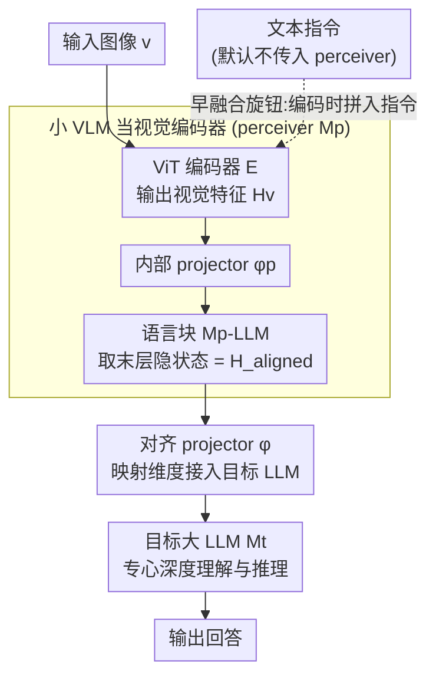

# Deep Pre-Alignment for VLMs

**会议**: ICML 2026  
**arXiv**: [2605.15300](https://arxiv.org/abs/2605.15300)  
**代码**: 待确认（论文中标注 "DPA Code and Model" 将公开）  
**领域**: 多模态VLM  
**关键词**: 视觉编码器、模态对齐、感知模型、灾难性遗忘、VLM 架构

## 一句话总结
作者把标准 VLM 里"ViT + 轻量 projector"的视觉编码模块整体替换为一个小 VLM（perceiver），让模态对齐这件耗深度的脏活在 upstream 的小 VLM 内部就完成，使下游大 LLM 不必在浅层浪费深度去做模态对齐——4B 模型在 8 个多模态基准上提升 +1.9 点、32B 上提升 +3.0 点，并把语言能力遗忘减少 32.9%，且推理吞吐只下降 2–6%。

## 研究背景与动机

**领域现状**：当前主流 VLM（LLaVA、Qwen-VL、InternVL、MiniCPM-o 等）几乎都遵循同一个范式——一个预训练好的 ViT（如 CLIP）经过一个 linear 或 MLP projector 把视觉特征塞进大 LLM 的输入嵌入空间，靠 LLM 自己处理跨模态对齐。

**现有痛点**：近期 representation 分析（Huang et al. 2025 的 MIR 指标、Nikankin et al. 2025 的 neuron circuit 分析）一致指出，ViT 输出的视觉特征在 LLM 的浅层依然与文本空间存在显著模态差异；LLM 的前几层被迫挪用大量参数去做"浅层模态对齐"，挤占了本该用于深度理解与复杂推理的容量。这种"挤占"还触发了 VLM 通病——文本能力的灾难性遗忘（4B baseline 在 MATH-500 上从 84.8 暴跌到 36.4）。

**核心矛盾**：浅层是 LLM 最宝贵的"通用语义入口"层，让它兼职做模态对齐，本质上是用浪费深度换取架构简洁。要解决这个问题，要么改训练目标（数据混比）只能"治标"，要么改架构在视觉特征进 LLM 之前就完成深度对齐。

**本文目标**：在不动训练目标、不动 LLM 主干的前提下，给视觉编码器加"深度"——让对齐的脏活在视觉侧就处理掉，下游 LLM 只接近文本空间的视觉特征。

**切入角度**：作者注意到，一个完整的小 VLM 本身就在大规模图文数据上学过"如何把视觉 token 推向文本空间"——它内部的语言块（language blocks）就是天然的"对齐深度"。只要把这个小 VLM 整体当成大 LLM 的视觉编码器，对齐就变成了 perceiver 的内部行为。

**核心 idea**：用小 VLM（如 Qwen3-0.6B-based perceiver）整体替换 ViT 编码器，把"模态对齐 vs 深度推理"两件事用架构层级解耦——upstream 小 VLM 负责对齐，downstream 大 LLM 专心推理。

## 方法详解

### 整体框架
DPA 架构由三部分串联：感知小 VLM $M_p$（包含一个 ViT $\mathcal{E}$、内部 projector $\phi_p$、内部 LLM 块 $M_p^{\text{LLM}}$）、对齐 projector $\phi$、目标大 LLM $M_t$。标准 VLM 的数据流是 $v \xrightarrow{\mathcal{E}} \mathbf{H}_v \xrightarrow{\phi} \mathbf{H}_v' \to M_t$，DPA 改为 $v \xrightarrow{\mathcal{E}} \mathbf{H}_v \xrightarrow{\phi_p} \mathbf{H}_v' \xrightarrow{M_p^{\text{LLM}}, \phi} \mathbf{H}_{\text{aligned}} \to M_t$。视觉 token 多走一段 perceiver 内部的语言块再进 $M_t$，最终送给大 LLM 的特征已经处于"文本空间近邻"状态。

### 关键设计

**1. 用小 VLM 整体当视觉编码器：让对齐这件耗深度的脏活在 perceiver 内部就做完**

痛点在于：CLIP ViT 输出的视觉特征到了大 LLM 浅层还是和文本空间有明显模态差，逼着 LLM 拿前几层兼职做对齐。DPA 的对策是把那一段"对齐深度"外包给一个完整的小 VLM。具体取 perceiver $M_p$（论文用 Qwen3-0.6B 加同款 ViT 训出来的小 VLM）最后一层语言块的隐状态作为 $\mathbf{H}_{\text{aligned}}$——这层隐状态已经被预训练语言块的 causal attention 反复加工过，几何上落在与文本嵌入兼容的空间里，再用一个 projector $\phi$ 把 $M_p^{\text{LLM}}$ 的维度（0.6B 是 1024）映射到目标 LLM（4B 是 2048、32B 是 5120）就能无缝接入。它之所以比 ViT 强，关键不在视觉能力而在"语言块结构"：CLIP ViT 学的是图文相似的浅层对齐，而语言块经过大规模 causal LM 预训练，输出几何天然和目标 LLM 同构。消融能佐证这点——只留 ViT 去掉语言块只涨 +0.7，完整 perceiver 涨 +3.4，语言块才是对齐的"工作母机"。

**2. 插拔式两阶段训练：不动训练目标，只换编码器，证明收益全来自架构**

为了把"性能提升来自架构而非训练 trick"这件事坐实，作者刻意不引入任何辅助 loss 或特殊策略，完全复用 LLaVA 经典流程。Stage 1 用 558K 图文 caption 对只训 $\phi$，把 perceiver 输出维度对齐到目标 LLM；Stage 2 用 1M 高质量视觉指令数据端到端微调整个 DPA（perceiver + projector + 目标 LLM），32B 用 LoRA 训 3 个 epoch 控制算力。Stage 2 里 perceiver 保持可训练——若把它冻住，性能从 53.0 掉到 52.1，但仍稳压 baseline。这种"只替换视觉编码器、其余原封不动"的设计让 DPA 能直接叠加在任何现有 VLM pipeline 上，是个干净的模块化升级路径。

**3. 指令无关默认 vs 早融合旋钮：在通用性和单轮峰值之间留一个开关**

perceiver 要不要在编码时看到文本指令，是个真实的取舍。默认配置让 perceiver 只吃图像、输出与指令无关的视觉特征，保证多轮对话和意图切换时表示稳定；可选的"w/ instruction context"变体则在 perceiver 编码阶段就把指令拼进去，相当于一个早融合的语义过滤器，让它提前按 query 滤掉无关视觉信息。消融显示早融合能把整体平均分从 53.0 拉到 55.2、文本分从 52.6 跳到 59.0，但代价是视觉表示被绑定到单轮 query，多轮场景会失效，所以默认仍走指令无关。这个 ablation 顺带解释了 DPA 为何能缓解文本遗忘——perceiver 充当了干扰视觉特征的过滤器，让目标 LLM 受到的语言能力扰动变小。

### 损失函数 / 训练策略
完全沿用 LLaVA-NeXT 两阶段配方：Stage 1 学习率 1e-3、batch 512、2 epoch；Stage 2 学习率 1e-5、batch 256、2 epoch；32B 用 LoRA + 3 epoch。所有阶段都是标准 language modeling loss，没有引入对比学习或对齐辅助 loss。

## 实验关键数据

### 主实验
DPA 在 4B / 32B 两个规模、Qwen3 / LLaMA-3.2 两个 LLM 家族上一致击败对照 baseline（LLaVA-NeXT 复刻版）。下表汇总三档配置在 11 个基准上的平均得分（Multi. Avg 是 8 个多模态基准均值、All Avg 是 11 个总均值）：

| 配置 | General | Reasoning | Perception | Text | Multi. Avg | All Avg |
|---|---|---|---|---|---|---|
| LLaVA-NeXT-LLaMA-3.2-3B | 40.8 | 27.4 | 60.5 | 21.0 | 40.7 | 35.3 |
| DPA-LLaMA-3.2-3B | 44.8 | 29.8 | 64.3 | 25.1 | 44.1 | 38.9 |
| Δ | +4.0 | +2.4 | +3.8 | +4.1 | +3.4 | +3.6 |
| LLaVA-NeXT-Qwen3-4B | 51.1 | 40.1 | 68.3 | 45.1 | 51.2 | 49.6 |
| DPA-Qwen3-4B | 52.5 | 41.0 | 72.4 | 52.6 | 53.1 | 53.0 |
| Δ | +1.4 | +0.9 | +4.1 | +7.5 | +1.9 | +3.4 |
| LLaVA-NeXT-Qwen3-32B | 57.6 | 48.3 | 73.4 | 53.1 | 58.1 | 56.7 |
| DPA-Qwen3-32B | 60.9 | 50.1 | 77.9 | 58.1 | 61.1 | 60.3 |
| Δ | +3.3 | +1.8 | +4.5 | +5.0 | +3.0 | +3.6 |

跨规模观察：多模态平均增益从 4B 的 +1.9 扩大到 32B 的 +3.0，呈正向扩展性；文本任务上 4B 的 MATH-500 单项就从 36.4 拉到 54.2（+17.8 点），文本能力遗忘相对减少 32.9%（4B）/ 21.6%（32B）。

### 消融实验
4B Qwen3 配置下不同 perceiver 设计的对比，揭示"语言块"和"语言预训练"是必要条件：

| 配置 | General | Reasoning | Perception | Text | Avg |
|---|---|---|---|---|---|
| LLaVA-NeXT-Qwen3-4B (baseline) | 51.1 | 40.1 | 68.3 | 45.1 | 49.6 |
| w/ large MLP（同参数量大 MLP 代替 perceiver）| 26.2 | 29.7 | 29.2 | 49.8 | 34.1 |
| DPA-Qwen3-4B | 52.5 | 41.0 | 72.4 | 52.6 | 53.0 |
| w/o perceiver LM blocks（只留 ViT）| 51.7 | 40.3 | 69.5 | 46.1 | 50.3 |
| w/o perceiver LM pre-training（语言块随机初始化）| 30.4 | 32.6 | 32.2 | 57.5 | 38.7 |
| w/ instruction context（早融合）| 53.8 | 41.8 | 71.8 | 59.0 | 55.2 |
| w/ perceiver frozen（Stage 2 冻结 perceiver）| 51.7 | 39.9 | 67.4 | 54.4 | 52.1 |
| w/ untrained perceiver（perceiver 完全未训过）| 53.1 | 40.2 | 69.5 | 55.1 | 53.1 |

### 关键发现
- **架构本身就是核心收益**：未经训练的 perceiver（projector 与 $\phi$ 都随机初始化）仍能比 baseline 高 +3.5 点，说明 DPA 的增益主要来自"加深+语言块结构"，而非把强 perceiver 的能力 transfer 过来。Perceiver 单独评测分数从 10.8 涨到 33.0 的过程中，最终 DPA 模型平均分仅在 3.4–4.5 之间小幅波动，Pearson 相关性几乎为零。
- **语言块的预训练权重必不可少**：把语言块换成随机初始化，整体分从 53.0 暴跌到 38.7；同等参数量的"大 MLP"更是只能拿到 34.1。说明"是 LLM 结构 + 是语言预训练权重"两个条件缺一不可。
- **DPA 缓解文本灾难性遗忘**：4B 配置文本平均分从 45.1 涨到 52.6（+7.5），其中 MATH-500 单项 +17.8 点；32B 同样有 +5.0 点提升。作者通过 MIR 指标证明 DPA 的视觉特征与文本空间几何更接近，目标 LLM 各层 modality gap 持续小于 baseline，"破坏性适应"被实质性减弱。
- **几乎没有推理代价**：32B 配置吞吐保持 baseline 的 98%（57.8 → 56.4 tokens/s），训练 FLOPs 仅增加 2%，因为 perceiver 只在 pre-fill 阶段贡献成本，generation 阶段不参与。
- **早融合是性能-通用性的可选旋钮**：把指令传给 perceiver 能再拉 2.2 点（53.0 → 55.2），但作者论证这会绑定视觉特征到单轮 query、损伤多轮对话能力，所以默认配置仍指令无关。

## 亮点与洞察
- **"用一个小 VLM 当视觉编码器"看似朴素却抓住要害**：这个想法其实在直觉上人人都想过，但本文真正做了系统消融——证明小 VLM 之所以好用，是因为它内部含有预训练过的语言块结构，而不是因为它本身视觉能力强（未训 perceiver 一样能拿 +3.5）。这把模块边界从"高语义视觉对齐"重新切到"用语言结构做对齐"，是个干净的认知更新。
- **可量化的几何同构（Geometric Isomorphism）证据**：作者用层间相似度矩阵展示 DPA 视觉空间出现与文本空间一致的"块对角"子空间结构，而 baseline 视觉空间是模糊的。这种结构层面的相似比单纯距离更说明问题，可以作为后续度量"对齐质量"的新指标。
- **架构 vs 数据的关系厘清**：先前缓解 VLM 文本遗忘几乎都靠"调多模态数据 vs 文本数据混比"，本文用纯架构改造解决相同问题，且明确说与数据策略正交。这给后续工作一个清晰的方向——架构层面还有大量优化空间没被探索。
- **可迁移设计 trick**：把"轻量 projector"扩展为"带语言块的 perceiver"这个套路可以推广到其他模态（音频、视频）——只要存在 modality gap，就可以引入一个 modality-internal 的 LM 块做 pre-alignment。

## 局限与展望
- **训练成本翻倍仍存在**：虽然推理只增 2%，但 4B 训练 FLOPs 增加 14%（1.27 → 1.45 × $10^{18}$），perceiver 越大成本越高；论文未深入分析"最小可用 perceiver 规模"的临界点。
- **早融合配置带来的多轮失效缺乏定量验证**：作者称早融合会损害多轮对话能力，但未提供多轮 benchmark（如 Multi-turn VQA、对话基准）的具体数据来支撑这个论断。
- **MIR 几何分析对模型解释力有限**：MIR 要求两个空间维度一致，所以分析都是在 perceiver 与 Qwen3-0.6B 之间做的，没有直接展示 perceiver 与 32B 大 LLM 之间的空间关系。
- **未与"调数据混比"基线正面对比**：DPA 声称与数据策略正交，但缺少"DPA + 优化数据混比"和"baseline + 优化数据混比"的联合实验，无法量化两者叠加是否还有协同增益。
- **任务覆盖偏 understanding 与 reasoning**：未涉及 grounding、segmentation、VLM agent 等任务，密集预测场景下 DPA 是否还有同样收益不清楚。

## 相关工作与启发
- **vs 调数据混比（DeepSeek-VL / InternVL）**：他们靠动态调整 text vs multimodal 数据权重缓解遗忘，本文从架构层根本性减少 LLM 的"破坏性适应"，且二者正交可叠加。
- **vs 多 encoder 融合（Cambrian / Eagle）**：那些工作并联 DINO + SAM + CLIP 等多个 ViT 追求更全面的视觉表示，本文反其道——只用一个 perceiver 但加深其对齐深度；理念相反但都指向"视觉编码器需要演化"。
- **vs LLaVA / Qwen-VL 系列**：DPA 把 LLaVA 范式的 projector 从"1 层 MLP"升级为"小 VLM"，是同一家族里架构维度的延伸，工程上完全兼容现有 pipeline。
- **vs 训练时引入对齐辅助 loss**：MaskCLIP / SEA 等给 ViT 加辅助监督，本文不动训练目标完全靠架构，避免了 loss 设计的繁琐与潜在冲突，更易复用。

## 评分
- 新颖性: ⭐⭐⭐⭐ "用小 VLM 当视觉编码器"想法不算原创，但通过系统消融把"语言块结构 + 语言预训练权重才是关键"这件事讲清楚，且与几何同构分析配套，整体洞察是新的。
- 实验充分度: ⭐⭐⭐⭐⭐ 覆盖 4B / 32B 两个规模、Qwen3 / LLaMA 两个家族、11 个基准；perceiver 规模、是否冻结、是否早融合、是否预训练等关键变量都有消融；MIR 几何分析提供机理证据。
- 写作质量: ⭐⭐⭐⭐ 结构清晰，5 个 RQ 把分析串成一条完整线；图表自洽；但部分公式排版混乱，部分图表（如几何同构）需要更细致的解读说明。
- 价值: ⭐⭐⭐⭐⭐ 给出了"VLM 视觉编码器还有结构性升级空间"的明确证据，对工业界 plug-in 升级老 VLM、对学界探索"语言块作为对齐模块"都有直接借鉴价值。

<!-- RELATED:START -->

## 相关论文

- [\[ICML 2026\] Gated Relational Alignment via Confidence-based Distillation for Efficient VLMs](gated_relational_alignment_via_confidence-based_distillation_for_efficient_vlms.md)
- [\[CVPR 2025\] Post-pre-training for Modality Alignment in Vision-Language Foundation Models](../../CVPR2025/multimodal_vlm/post-pre-training_for_modality_alignment_in_vision-language_foundation_models.md)
- [\[ICML 2026\] Injecting Distributional Awareness into MLLMs via Reinforcement Learning for Deep Imbalanced Regression](injecting_distributional_awareness_into_mllms_via_reinforcement_learning_for_dee.md)
- [\[ICML 2026\] V-LynX: Token Interface Alignment for VideoX LLMs](v-lynx_token_interface_alignment_for_videox_llms.md)
- [\[ICML 2026\] Density-Aware Translation of Spurious Correlations in Zero-Shot VLMs](density-aware_translation_of_spurious_correlations_in_zero-shot_vlms.md)

<!-- RELATED:END -->
