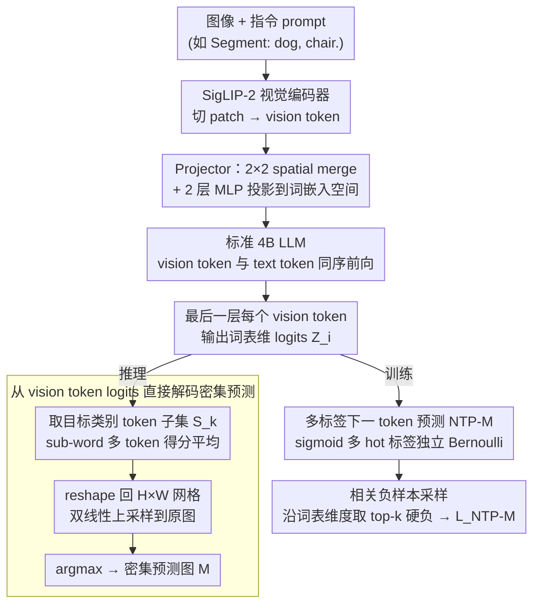

# DenseMLLM: Standard Multimodal LLMs for Dense Prediction

**会议**: ICML 2026  
**arXiv**: [2602.14134](https://arxiv.org/abs/2602.14134)  
**代码**: https://github.com/Eli-YiLi/DenseMLLM (有)  
**领域**: 多模态VLM  
**关键词**: 密集预测、多模态LLM、视觉token监督、多标签NTP、统一架构

## 一句话总结
作者把语义分割、深度估计、指代分割这些密集预测任务直接塞进一个 4B 标准 MLLM（ViT + Projector + LLM），不加任何任务专用 decoder，靠对视觉 token 引入"多标签下一 token 预测"（NTP-M）监督，在 ADE20K 取得 54.2 mIoU、DDAD 取得 87.6 δ1、RefCOCO val 取得 80.7 cIoU，同时通用 VL 指标与 Qwen3-VL-4B 持平。

## 研究背景与动机

**领域现状**：当前主流 MLLM 用"ViT + Projector + LLM"三件套统一处理 VQA、OCR、grounding 等任务，但一旦遇到需要像素级输出的密集预测（语义分割、深度估计、指代分割），几乎所有方案都得给 LLM 外挂一个任务专属 decoder——GLaMM/UniPixel 接 SAM mask decoder，UFO 引入 mask retrieval embedding，VisionLLM 接 Deformable-DETR head。

**现有痛点**：这些 add-on 设计把架构拆得七零八落，每加一个新任务就得加一个新模块，违背了 MLLM "用一个 next-token 接口统一所有任务"的初衷；少数尝试纯文本输出的方法（DepthLM 逐点采样、VisionLLM 输出 polygon 坐标）要么推理代价巨大，要么精度堪忧。

**核心矛盾**：标准 MLLM 的训练目标只对 text token 算 NTP loss，vision token 仅靠全局图文对齐间接监督，导致 vision token 在最后一层不携带细粒度像素语义；要在不加 decoder 的情况下做密集预测，就必须直接监督 vision token 的输出概率。

**本文目标**：让一个完全标准的 MLLM（不改架构、不加 head、不要 retrieval）能从 vision token 的 logits 上直接 argmax 出像素级分割图与深度图。

**切入角度**：作者观察到——vision token 与 text token 有一个本质差异：一个 vision token 对应一块图像 patch，里面可能同时含"狗 / 椅子 / 背景 / 深度 bin 20 / 深度 bin 50"等多个语义标签；而 text token 永远只对应一个 vocabulary id。所以单标签 softmax NTP 天然不适合 vision token。

**核心 idea**：把 NTP 从"单标签 softmax"扩展为"多标签 sigmoid（Bernoulli 独立分布）+ 相关负样本采样"，让标准 LLM 的 vision token logits 同时承担分类与定位职责，推理时只需在目标类别词表上做 argmax。

## 方法详解

### 整体框架
DenseMLLM 由三个完全标准的组件组成：SigLIP-2（siglip2-so400m-patch16-naflex）做 vision encoder、$2\times 2$ spatial-merge + 两层 MLP 做 projector、4B 参数的标准 transformer LLM。输入端把图像切 patch 编码成 vision token 序列，prompt（如 "Segment: dog, chair."）经 tokenizer 后与 vision token 一起送进 LLM。LLM 的最后一层会对每个 vision token 输出一个 vocabulary 维度的 logits 向量 $Z_i \in \mathbb{R}^{|V|}$。这个 logits 同时承担两条支路：推理时直接在目标类别词表上做 argmax 解码出密集预测图（彻底跳过任何 mask decoder），训练时则用 NTP-M 多标签监督把细粒度像素语义压进 vision token 的 logits 里。

### 关键设计

**1. 从 vision token logits 直接解码密集预测：把最后一层的视觉 logits 当成一张分类图**

标准 MLLM 做密集预测都要外挂 decoder，但作者认为 vision token 经过 LLM 多层 transformer 加工后，本就融合了全局语境和指令信息、已经在语义空间里了，只缺一个把它「露出来」的接口。于是干脆跳过 mask decoder：对语义分割，先让模型用 NTP 文本输出图中存在的类别集合 $\{k\}$，再到每个 vision token 的 logits $Z_i\in\mathbb{R}^{|V|}$ 上抽这些类别对应的 token id 子集 $S_k$，把 sub-word 多 token 得分按 $\hat Z_k=\frac{1}{|S_k|}\sum_{v\in S_k}Z_v$ 平均，将 $\hat Z$ reshape 回 $H\times W$ patch 网格、双线性上采样到原图分辨率得到预测图 $M=A(I(R(\hat Z)))$。深度估计则把深度范围离散到 1–1000 个 bin、每个 bin 是一个 `<custom k>` 词表 id，走同样的 argmax 流程。好处是一次前向就能拿到全图密集深度——4B 模型在 DDAD 上单次推理就有 87.6 δ1，而 DepthLM 要对每个采样点单独推理一次。

**2. 多标签下一 token 预测 NTP-M：让一个 vision token 能同时给多个目标贡献监督**

直接监督 vision token 之前得先处理一个本质差异：一个 vision token 对应一块 patch，里面可能同时含「狗 / 椅子 / 背景 / 深度 bin 20 / 深度 bin 50」多个语义，而 text token 永远只对应一个 vocabulary id——单标签 softmax 的互斥假设和 vision token 天然打架。NTP-M 把 softmax 换成多标签 sigmoid：构造多 hot 向量 $y_{i,v}\in\{0,1\}$，凡是与第 $i$ 个 vision token 空间位置相关的对象类别、深度 bin、前景背景标签全置 1，用独立 Bernoulli 联合概率建模 $p(Y|X_v,X_{\text{instruct}})=\prod_{i,v}\sigma(Z_{i,v})^{y_{i,v}}(1-\sigma(Z_{i,v}))^{1-y_{i,v}}$，不同任务的 prompt 通过 $X_{\text{instruct}}$ 控制激活哪一段词表。sigmoid 让多语义共存，又与 text token 上原有的 NTP 框架完全兼容，无需新增损失分支。

**3. 相关负样本采样：沿词表维度挑硬负，解决大词表带来的正负极度失衡**

MLLM 词表有数十万词条，每个 vision token 的正样本只有寥寥几个、负样本铺天盖地，直接 BCE 会被海量无关负样本把梯度稀释。传统 OHEM 在空间维度挑硬例，但这里失衡是在 vocabulary 维度，所以要沿词表维度挑「相关负」：对每个 vision token，正样本集 $P_i=\{v\mid y_{i,v}=1\}$、负候选集 $C_i=\{v\mid y_{i,v}=0\}$，按预测概率 $p_{i,v}=\sigma(Z_{i,v})$ 取 top-$k$ 高分负样本组成 $N_i^{\text{relev}}$，最终损失正负独立平均：

$$L_{\text{NTP-M}}=\sum_i\Big[-\frac{1}{|P_i|}\sum_{v\in P_i}\log p_{i,v}-\frac{1}{k}\sum_{v\in N_i^{\text{relev}}}\log(1-p_{i,v})\Big]$$

这一步是整套方法 work 的关键——消融里从纯 BCE → 独立均值 → 相关负采样，ADE20K mIoU 一路从 16.7 → 32.7 → 51.2，单这一项就拿走全部增益的约 70%。

### 损失函数 / 训练策略
四阶段训练：Stage I 多模态基础预训练（语言 + 视觉混训，词表上加 vision codebook 监督）；Stage II 退火阶段，专门针对密集预测任务做高质量微调，同时混入 VQA/OCR 保通用性；Stage III 把 context window 从 16K 扩到 32K 做 SFT；Stage IV 用 DAPO 风格的 RL，针对分割引入 class-label IoU 奖励，去掉 KL penalty 并用 FP16 保证收敛。

## 实验关键数据

### 主实验
DenseMLLM-4B 用一套标准架构同时打三大密集预测任务，对比含任务专属 decoder 的方法仍然有竞争力：

| 数据集 / 任务 | 指标 | DenseMLLM-4B | 之前代表 SOTA | 备注 |
|---|---|---|---|---|
| ADE20K 语义分割 | mIoU | 54.2 | VisionLLM-v2 52.3（带 Deform-DETR） | 无 decoder |
| Cityscapes 语义分割 | mIoU | 70.4 | X-Decoder 81.7（专家模型） | 通用模型 |
| NYUv2 深度 | δ1 | 90.4 | DepthLM 86.8（逐点多次推理） | 一次推理 |
| DDAD 深度 | δ1 | 87.6 | DepthLM 74.7 | 一次推理 |
| RefCOCO val | cIoU | 80.7 | UniPixel 80.5（带 SAM decoder）/ UFO 80.0（retrieval） | 无 decoder |
| RefCOCO+ val | cIoU | 76.2 | UniPixel 74.3 | 无 decoder |

通用 VL 能力上，DenseMLLM-4B 在 MMB / MMStar / MME / AI2D / OCRBench 等 15 个基准上与 Qwen3-VL-4B、InternVL-3.5-4B 持平甚至略优（MMStar 71.1 vs 69.8、MME 2384 vs 2309），证明加入密集预测并未牺牲通用能力。

### 消融实验
ADE20K mIoU 上逐项加组件，可以清晰看出 NTP-M 与相关负采样是最大功臣：

| 配置 | BCE | Indiv. Mean | Rel. Sampling | Data Scale | RL | ADE20K mIoU |
|---|---|---|---|---|---|---|
| Base (BCE) | ✓ |  |  |  |  | 16.7 |
| + 独立平均 | ✓ | ✓ |  |  |  | 32.7 |
| + 相关负采样 | ✓ | ✓ | ✓ |  |  | 51.2 |
| + 数据扩量 | ✓ | ✓ | ✓ | ✓ |  | 52.3 |
| + RL（Stage IV）| ✓ | ✓ | ✓ | ✓ | ✓ | 54.2 |
| + 单数据集 fine-tune | ✓ | ✓ | ✓ | ✓ | ✓ | 55.2 |

### 关键发现
- 真正决定密集预测能不能 work 的是"独立正负平均 + 相关负采样"组合：从纯 BCE 的 16.7 直接拉到 51.2，足足提升 34.5 个点；后续数据扩量和 RL 各只带来 1.1–1.9 点的边际收益。
- 没有任何任务专属 decoder 的标准 MLLM，靠 vision token 的 logits 也能稳压含 SAM decoder 的 UniPixel（RefCOCO val 80.7 vs 80.5），说明 vision token 本身已经具备了足够的细粒度信息，关键是给它对的监督信号。
- 深度估计只需要一次前向就能拿到全图密集深度，相比 DepthLM 需要 N 次逐点推理在 DDAD 上反而高出 12.9 个 δ1 点，说明 token-level 多标签监督比 prompt-level 逐点回归更高效。

## 亮点与洞察
- **把 NTP 从 1D 文本扩展到 2D 视觉**：作者点破了一个被忽视的事实——vision token 与 text token 在语义结构上根本不同，前者天然多标签；这一观察直接催生 NTP-M，让标准 MLLM 第一次能完全摆脱 task-specific decoder 做密集预测。这个 insight 可以迁移到任何 token-grid 输出的任务，例如视频时空 token、3D voxel token。
- **vocabulary 维度的相关负采样**：传统 OHEM 在空间维度上挑硬例，但 MLLM 词表是稀疏多 hot，沿词表维度挑相关负把训练效率提升一个数量级（16.7 → 51.2 mIoU），这个 trick 对所有"大词表 + 多标签"场景（如多标签检索、tag classification with LLM 词表）都直接可用。
- **训练接口完全等同 NTP**：NTP-M 只是把 softmax 换成 sigmoid + 选择性平均，所有 LLM 训练框架可以零改动接入；后续 RL 阶段用 class-label IoU 当奖励也无缝衔接 DAPO，整套 pipeline 工程友好度极高。

## 局限与展望
- 论文未充分讨论实例分割与全景分割——RefCOCO 是单实例指代，多实例同类（如"分割所有人"）在文中没有定量评估，多标签 NTP-M 在"同类不同实例"上如何区分仍是开问题。
- 深度估计依赖词表里的 `<custom 0>`–`<custom 999>` 离散 bin，分辨率受限于词表大小；连续回归（如 metric depth 直接出实数）需要再设计新接口。
- 训练分四阶段且 RL 用 FP16 + 去 KL，复现成本高；论文未给出去掉 RL 后纯 SFT 与现有 SOTA 的全面对比（只在 ADE20K 上看到 -1.9 点）。
- 词表扩大后相关负 top-$k$ 中的 $k$ 如何选、不同任务是否要差异化（分割 vs 深度）值得深入消融，论文只给了一个固定配置。

## 相关工作与启发
- **vs GLaMM / UniPixel**：它们给 LLM 外挂 SAM 系 mask decoder 做指代分割，本文在 RefCOCO 上不用任何 decoder 就持平甚至略胜，证明"加外挂"并非必需。
- **vs UFO**：UFO 用 mask retrieval embedding 走另一条非 decoder 路线，但仍需引入额外的检索过程；本文走的是更彻底的"vision token 直接当像素图"路线，架构更简洁。
- **vs DepthLM**：DepthLM 通过 prompt 逐点询问深度，需要 N 次推理；本文一次前向出全图密集深度，δ1 在 DDAD 上反而高 12.9 点，说明 token-grid 监督优于 prompt 逐点采样。
- **vs VisionLLM**：VisionLLM 让 LLM 输出 polygon 坐标做分割，受坐标精度限制（RefCOCO 仅 74.5 cIoU）；本文用 vision token logits 给出像素级输出，精度上限更高。

## 评分
- 新颖性: ⭐⭐⭐⭐⭐ 第一次把 NTP 真正扩展到视觉 token 的多标签场景，并用相关负采样让它实际 work，是密集预测 + MLLM 路线上一个干净的统一接口。
- 实验充分度: ⭐⭐⭐⭐ 覆盖 3 大密集任务 + 15 个通用 VL 基准，消融清晰；但实例分割、全景分割等场景缺位，模型规模只在 4B 上验证。
- 写作质量: ⭐⭐⭐⭐ 动机—观察—方法—消融逻辑链条完整，图 1 的 PCA 可视化和 multi-label 直方图非常直观；公式表述略显冗长。
- 价值: ⭐⭐⭐⭐⭐ 给出了"标准 MLLM 不加 decoder 也能做密集预测"的可行性证明，对统一多模态架构方向有重要推进意义。

<!-- RELATED:START -->

## 相关论文

- [\[CVPR 2026\] Efficient Document Parsing via Parallel Token Prediction](../../CVPR2026/multimodal_vlm/efficient_document_parsing_via_parallel_token_prediction.md)
- [\[CVPR 2026\] Reconstructing CLIP for Open-Vocabulary Dense Perception](../../CVPR2026/multimodal_vlm/reconstructing_clip_for_open-vocabulary_dense_perception.md)
- [\[CVPR 2026\] MVP: Multiple View Prediction Improves GUI Grounding](../../CVPR2026/multimodal_vlm/mvp_multiple_view_prediction_improves_gui_grounding.md)
- [\[ICML 2026\] Seeing is Understanding: Unlocking Causal Attention into Modality-Mutual Attention for Multimodal LLMs](seeing_is_understanding_unlocking_causal_attention_into_modality-mutual_attentio.md)
- [\[CVPR 2026\] VGent: Visual Grounding via Modular Design for Disentangling Reasoning and Prediction](../../CVPR2026/multimodal_vlm/vgent_visual_grounding_via_modular_design_for_disentangling_reasoning_and_predic.md)

<!-- RELATED:END -->
