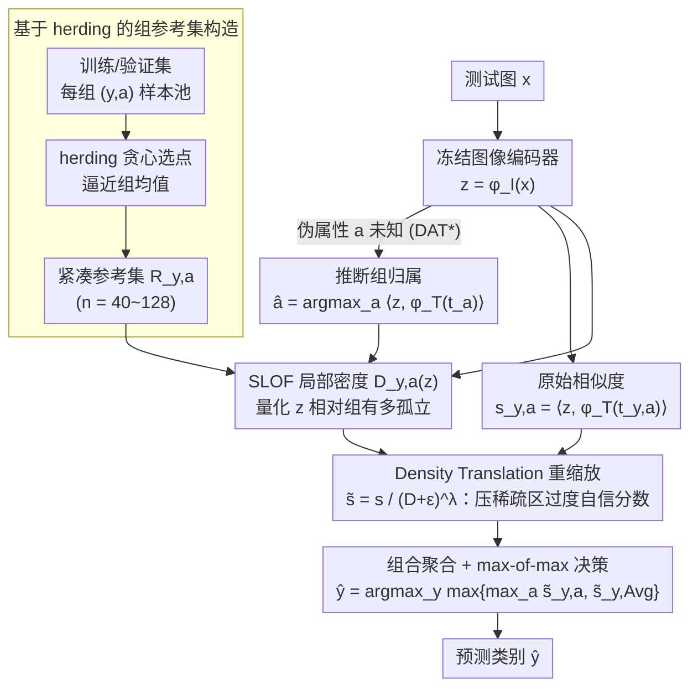

# Density-Aware Translation of Spurious Correlations in Zero-Shot VLMs

**会议**: ICML 2026  
**arXiv**: [2606.01710](https://arxiv.org/abs/2606.01710)  
**代码**: https://github.com/AfsanehEB/DAT  
**领域**: 多模态VLM  
**关键词**: 零样本分类, 伪相关, CLIP 各向异性, 局部密度, 组鲁棒性  

## 一句话总结
作者发现 CLIP 嵌入在球壳上呈各向异性椭球分布、伪相关样本扎堆在均值附近，于是提出 DAT：用每个 (类别, 伪属性) 组的参考集估一个局部密度 $D_{y,a}(z)$，再用 $\tilde s_{y,a}(x)=s_{y,a}(x)/(D_{y,a}(z)+\varepsilon)^{\lambda}$ 把原始 cosine 相似度按"样本是否处在该组核心"重缩放，从而在不微调、不改文本端、不需测试时伪属性标签的前提下显著提升 worst-group 准确率。

## 研究背景与动机

**领域现状**：CLIP/ALIGN 等 VLM 的零样本分类已经成为多模态基线，但它们对伪相关（spurious correlations，预测靠的是常见但语义无关的上下文线索）非常敏感。一个经典例子：Waterbirds 数据集里"水鸟+水背景"是常见组合，模型容易把"水"当作"水鸟"的判据，遇到"水鸟+陆背景"就出错。已有缓解手段分三类：(i) 微调/适配器（要标签，破坏零样本性质）、(ii) 文本端编辑提示或投影（依赖领域专家或 LLM，跨模态对齐易漂移）、(iii) 多模态嵌入调整（如 TIE 把图像嵌入沿文本方向平移，但需训练数据校准 scale）。

**现有痛点**：现有方法要么牺牲零样本（i），要么靠提示工程/LLM 推断不稳定（ii），要么需要数据集相关的标定（iii）。更重要的是，它们都没有正面回应"为什么 CLIP 会被伪相关骗"的几何根源。

**核心矛盾**：CLIP 嵌入并不是各向同性地分布在单位球上。Levi & Gilboa (2025) 等工作显示：频繁出现的概念会向 modality mean 靠拢、conformity 更高，而稀有但语义关键的概念被推到稀疏的外围。这意味着用纯 cosine 相似度打分时，一个"对了类但稀有"的样本可能比"错了类但常见"的样本得分还低——分数本身就被几何 bias 污染了。

**本文目标**：(i) 在完全零样本（冻结编码器、不调参、测试时不要求伪属性标签）的约束下，给相似度打分加一个能感知"局部几何密度"的修正；(ii) 给出理论说明为什么这样做和 Bayes 最优规则是对齐的。

**切入角度**：与其改模型或改文本，不如改"打分函数本身"。如果嵌入空间是椭球壳状的，相似度就应该按"该样本在所属组里有多典型"来调整——典型样本的分数留住，稀疏远点的分数被压。

**核心 idea**：用一小份每组参考集估局部密度，把每组的 cosine 相似度除以 $(D_{y,a}(z)+\varepsilon)^\lambda$，相当于在 logit 空间减去 $\lambda \log D$，恰好把 Kent 各向异性分布的对数似然里被 cosine 漏掉的二次项补回来。

## 方法详解

### 整体框架
DAT 的 pipeline 完全建立在冻结的 VLM 之上：先用训练/验证集为每个 $(y,a)$ 组构造一个紧凑的参考集 $R_{y,a}$；推理时对测试图 $z=\phi_I(x)$ 计算它在每个组参考集中的局部密度 $D_{y,a}(z)$，将原 cosine 相似度按密度重缩放，再聚合得到最终预测。当伪属性 $a$ 不可得时，DAT$^*$ 先用 $\hat a=\arg\max_a \langle \phi_I(x), \phi_T(t_a)\rangle$ 推断 $\hat a$，整条管线不变。

### 关键设计

**1. 基于 herding 的组参考集构造：为每组选出代表中心几何的 exemplar**

要估"某测试样本相对它所属组有多稀疏"，先得有一个能代表该组核心的局部邻域。DAT 对每个 $(y,a)$ 组从其样本池 $\{x_{y,a}^{(h)}\}_{h=1}^{N_{y,a}}$ 里用 iCaRL 风格的 deterministic feature-space herding（Rebuffi et al., 2017）贪心选点——每次选一个嵌入向量，使已选集合的均值不断逼近组均值——得到紧凑参考集 $R_{y,a}=\{z_{y,a}^{(h)}\}_{h=1}^{n}$，规模都很小（Waterbirds $n=56$、CelebA $n=128$、COVID-19 $n=40$、FMoW $n=50$）。

为什么用 herding 而不是随机采样：既有研究表明频繁/伪相关样本本身就靠近组均值（Levi & Gilboa, 2025），所以向均值逼近的 herding 天然会把这些"常见模式"抓进参考集，正好给后续密度估计提供一个"常见模式聚集区"的基准；而且整个参考集只用作非参数几何估计、不动一个模型参数，零样本性质完整保留。

**2. SLOF 局部密度与 Density Translation 重缩放：把稀疏区的过度自信分数压下去**

纯 cosine 打分有个致命盲区——一个"配错文本但常见"的伪相关样本，和一个"配对文本但稀有"的样本，得分可能差不多，甚至前者更高。DAT 先用 simplified LOF（SLOF, Schubert et al., 2014）把"测试样本 $z$ 相对该组有多孤立"量化成标量：

$$D_{y,a}(z)=\frac{1}{k}\sum_{z_o\in \text{NN}_k(z)} \frac{k\text{-dist}(z)}{k\text{-dist}(z_o)}$$

$D$ 越大越孤立。然后把原始组相似度按密度重缩放：$\tilde s_{y,a}(x)=s_{y,a}(x)/(D_{y,a}(z)+\varepsilon)^\lambda$，$\lambda>0$ 控制修正强度（$k$ 取 10、FMoW 取 30；$\lambda$ 在 Waterbirds/COVID-19/FMoW 取 10、CelebA 取 1）。

这一步起效的关键在于：伪相关样本通常落在自身组的密集区、却在错配组的稀疏外围，所以除以 $D$ 之后，错配方向的得分被显著压低、正确方向的得分被相对抬升。论文用 Waterbirds 的 Tangent-space Mahalanobis Distance 把这一几何现象可视化了出来。

**3. 组合聚合 + Kent 分布下的理论对齐：证明这不只是经验 trick**

把组得分整合成类别预测时，DAT 还定义了 class-marginal $\tilde s_{y,\text{Avg}}(x)=\frac{1}{M+1}(\sum_a \tilde s_{y,a}(x)+s_y(x))$，最终用 max-of-max 决策 $\hat y=\arg\max_y \max\{\max_a \tilde s_{y,a}(x), \tilde s_{y,\text{Avg}}(x)\}$，兼顾"有伪属性时按组打分"和"伪属性未知时回退到平均"。

理论侧回答了"cosine 到底漏了什么"。用 Kent（Fisher-Bingham）分布建模组密度，其对数密度

$$\log p(z)=\kappa\gamma_1^\top z + \beta[(\gamma_2^\top z)^2-(\gamma_3^\top z)^2]-\log c_d(\kappa,\beta)$$

里 cosine 只对应到线性轴向项 $\kappa\gamma_1^\top z$，根本看不见二次各向异性项 $\beta[\cdot]$。而 $\tilde s = s/D^\lambda$ 在 logit 域等于减 $\lambda\log D$，把 $-\log D$ 当对数密度代理（Assumption 3.2）后，DAT 的 margin 可写成 $m_{y,a}(z)=\tau w_{y,a}^\top z + \alpha\lambda \log p_{y,a}(z)+r_{y,a}(z)$（余项 $|r|\le B_0$），即"logit + 缩放对数似然 + 有界余项"，在等先验下其 $\arg\max$ 与 Bayes 最优 ranking 对齐。这就把一个看似 ad-hoc 的密度修正，提升到"在椭球嵌入下逼近 Bayes 最优"的层次。

### 损失函数 / 训练策略
全程零样本，没有任何训练步骤，也不改 VLM 参数。仅需的"参数"是每组参考集大小 $n$、邻域大小 $k$、缩放 $\lambda$，且都按数据集一次性设定即可。

## 实验关键数据

### 主实验
四个伪相关基准（Waterbirds、CelebA、COVID-19、FMoW）× 多个 VLM（CLIP ViT-B/32、ViT-L/14、ResNet-50、ALIGN、AltCLIP、BiomedCLIP）。指标：worst-group 准确率 WG、平均准确率 Avg、Gap = Avg − WG。下表是 Waterbirds 上的对比节选。

| Backbone | 方法 | WG↑ | Avg↑ | Gap↓ |
|----------|------|-----|------|------|
| ViT-B/32 | Zero-shot (ZS) | 41.37 | 68.48 | 27.11 |
| ViT-B/32 | Orth-Cali | 54.99 | 69.19 | 14.20 |
| ViT-B/32 | TIE | 71.35 | 79.82 | 8.47 |
| ViT-B/32 | **DAT** | **75.08** | **80.36** | **5.28** |
| ViT-L/14 | ZS | 31.93 | 83.72 | 51.79 |
| ViT-L/14 | TIE | 78.82 | 84.12 | 5.30 |
| ViT-L/14 | **DAT** | **83.33** | **89.57** | **6.42** |
| ResNet-50 | ZS | 35.36 | 80.64 | 45.28 |
| ResNet-50 | TIE | 52.96 | 83.62 | 30.66 |
| ResNet-50 | **DAT** | **75.08** | 83.83 | **8.75** |

CelebA 上 DAT 在 ViT-L/14 取 WG=84.94（TIE 84.60）、ResNet-50 上 WG=80.79（比 TIE 75.32 高 5.47）。

### 消融实验
论文以 DAT* 和 DAT 的对比、以及关键超参 $\lambda$、$k$、参考集来源（train vs valid）做了系统消融，整理如下：

| 配置 | 关键现象 | 解读 |
|------|---------|------|
| DAT*（无伪属性标签） | Waterbirds ViT-L/14 上 WG=79.75，仍超 TIE | 用 $\hat a=\arg\max_a\langle\phi_I,\phi_T(t_a)\rangle$ 推断的组归属足够好 |
| $\lambda$ 太小（≈0） | 退化到 ZS，伪相关回归 | 必须真正引入密度修正才有效 |
| $\lambda$ 过大 | 在稀疏类上反而压过头 | $\lambda$ 控制 bias-variance，需按数据集调 |
| 不同密度估计器（SLOF/LOF/kNN） | SLOF 最稳 | 论文默认 SLOF，因实现简单且鲁棒 |
| CelebA 用 validation 构参考集 | 比 train 更好 | train 自身分布偏斜更大 |

### 关键发现
- DAT 在所有数据集 × 所有 backbone 上对 worst-group 都是稳定提升，最显著的是 ResNet-50 这种本身嵌入更"扁"的 backbone（Waterbirds 上 WG +39.72 相对 ZS）。
- Avg 和 WG 同时提升是少见的——很多 debiasing 方法是"为 WG 牺牲 Avg"，DAT 通过几何重缩放避免了这种权衡。
- DAT 比 TIE 高效：不需要训练数据校准平移 scale，参考集 50–128 个样本就够。

## 亮点与洞察
- **诊断 → 修正闭环**：先用 Tangent-space Mahalanobis Distance 把"伪相关导致几何错配"可视化出来，再用 SLOF 做对称的修正信号；分析和方法严格对应，不是"先做实验再补理由"。
- **把 cosine 升级为对数似然代理**：$\tilde s = s/D^\lambda$ 在 logit 域是减 $\lambda\log D$，结合 Kent 模型证明这正好补回 cosine 漏掉的各向异性项——为"几何意识的相似度修正"提供了通用模板，可以迁移到任何嵌入空间各向异性的场景（如句向量、推荐 embedding）。
- **零样本约束严格**：测试时不要求伪属性标签、不要求 LLM、不动模型参数，对实际部署友好；参考集只用作几何估计而非梯度更新，符合"frozen embedding"评测语义。

## 局限与展望
- DAT 需要每个组有一份小但代表性强的参考集；如果某组样本极度稀缺（long-tail 真实世界），herding 会退化甚至无法成立。
- $\lambda$ 和 $k$ 仍然是数据集级超参，论文按数据集分别调，并未给出"零先验"的自动设定策略；对于 unseen domain 仍需要小规模 sweep。
- 理论结果建立在 Kent 分布假设和 log-SLOF fidelity 上，对一般 VLM 嵌入是否恰好如此并未做大规模验证；如果嵌入分布严重偏离 Kent，Bayes 对齐保证就只是局部成立。

## 相关工作与启发
- **vs TIE / TIE\*（Lu et al., 2025）**：TIE 把图像嵌入沿文本方向平移以削弱伪相关，本文则不动嵌入只改打分，并给出 Bayes 对齐解释；DAT 在 Waterbirds、CelebA 大多数 backbone 上均优于 TIE，尤其在 ResNet-50 上差距大。
- **vs Orth-Cali / Ideal Words / Perception CLIP**：这些方法都在文本端做投影或提示扩展，依赖语言端 prior；DAT 反过来在图像端做几何修正，和文本端方法正交。
- **vs ROBOSHOT**：ROBOSHOT 借 LLM 抽伪相关方向再线性投影，受 LLM 抽取质量制约；DAT 不依赖 LLM，对部署稳定性更好。
- **vs Zhang & Ré (2022) 等微调路线**：微调能更强但破坏零样本，DAT 适合"模型权重不可改"的部署场景（API 调用、医疗合规）。

## 评分
- 新颖性: ⭐⭐⭐⭐ "用局部密度修正 cosine 打分"思路简洁，配合 Kent 分布的理论对齐有突出贡献
- 实验充分度: ⭐⭐⭐⭐ 四数据集 × 6 个 VLM 变体，覆盖自然图像/人脸/医疗/遥感
- 写作质量: ⭐⭐⭐⭐ 从几何 motivation 到理论再到实验衔接紧凑，记号一致
- 价值: ⭐⭐⭐⭐ 零样本/无需训练/部署友好，社区可立刻在任意 frozen VLM 上套用

<!-- RELATED:START -->

## 相关论文

- [\[ICML 2025\] The Devil Is in the Details: Tackling Unimodal Spurious Correlations for Generalizable Multimodal Reward Models](../../ICML2025/multimodal_vlm/the_devil_is_in_the_details_tackling_unimodal_spurious_correlations_for_generali.md)
- [\[CVPR 2025\] Locality-Aware Zero-Shot Human-Object Interaction Detection](../../CVPR2025/multimodal_vlm/locality-aware_zero-shot_human-object_interaction_detection.md)
- [\[CVPR 2026\] SOTA: Self-adaptive Optimal Transport for Zero-Shot Classification with Multiple Foundation Models](../../CVPR2026/multimodal_vlm/sota_self-adaptive_optimal_transport_for_zero-shot_classification_with_multiple_.md)
- [\[AAAI 2026\] Plug-and-Play Clarifier: A Zero-Shot Multimodal Framework for Egocentric Intent Disambiguation](../../AAAI2026/multimodal_vlm/plug-and-play_clarifier_a_zero-shot_multimodal_framework_for_egocentric_intent_d.md)
- [\[CVPR 2026\] FlowComposer: Composable Flows for Compositional Zero-Shot Learning](../../CVPR2026/multimodal_vlm/flowcomposer_composable_flows_for_compositional_zeroshot_learning.md)

<!-- RELATED:END -->
