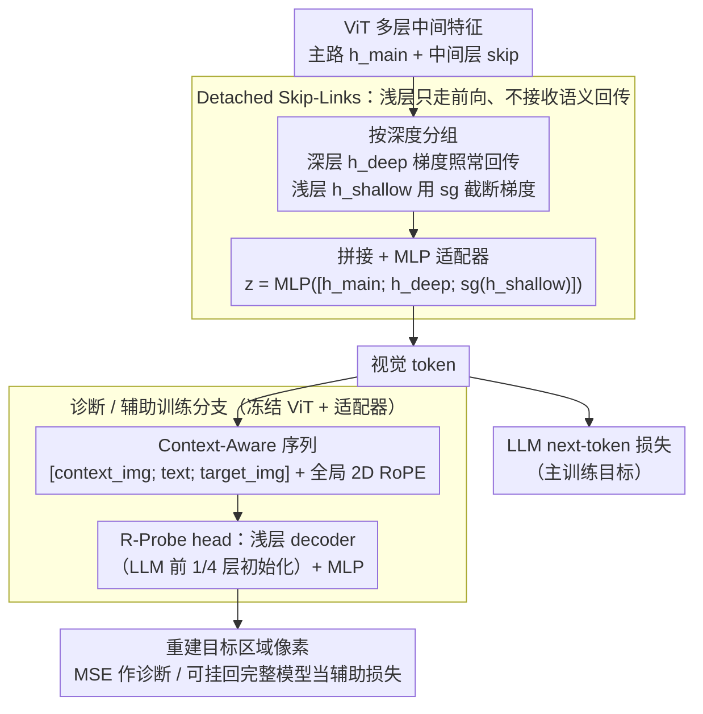

# Detached Skip-Links and $R$-Probe: Decoupling Feature Aggregation from Gradient Propagation for MLLM OCR

**会议**: ICML 2026  
**arXiv**: [2603.20020](https://arxiv.org/abs/2603.20020)  
**代码**: 无  
**领域**: 多模态VLM  
**关键词**: MLLM OCR, 多层特征融合, 停止梯度, 重建探针, 训练稳定性  

## 一句话总结
针对 MLLM 的 OCR 场景，作者在多层 ViT→LLM 融合架构中给浅层 skip 分支加 stop-gradient（Detached Skip-Links），同时提出用"LLM 自身前 1/4 层"初始化的重建探针 $R$-Probe 来诊断视觉 token 是否真的把细粒度信息送到了语言模型那一侧。

## 研究背景与动机

**领域现状**：当前 MLLM 在高层语义对话上表现强，但 OCR、密集文字识别、小目标 grounding 等"低层感知"任务上还差得明显。已有工作通常把 ViT（尤其是 CLIP 类对比学习训出来的 ViT）视作瓶颈，并提出两条路：要么加重建损失等辅助监督（Fini 等、Tschannen 等），要么走多层融合，把浅层带几何/像素信息的特征也喂给 LLM（DenseConnector、DeepStack、ML 等）。

**现有痛点**：多层融合"前向"上很合理——浅层特征确实包含 OCR 想要的笔画级细节——但作者发现这种 naive 融合在"反向"上有隐患：来自 LLM next-token 损失的语义梯度会沿着 skip 分支直接打到浅层 ViT block，把原本编码低层结构的注意力图打"散"。这会带来训练不稳、收敛慢、甚至破坏预训练好的空间先验。

**核心矛盾**：浅层特征在"前向传播"中是有价值的（能补全深层丢掉的局部细节），但在"反向梯度"上和深层 LLM 的语义目标是冲突的——它们的最优化方向并不一致。强行让浅层跟着语义损失一起更新，等于在用错误的优化器去训练原本只擅长低层模式的层。

**本文目标**：(i) 在保留多层融合好处的前提下消除梯度干扰；(ii) 给出一个能直接判断"视觉 token 是否真的把细节送到了 LLM"的诊断工具，而不是只看下游 benchmark。

**切入角度**：把"特征聚合"和"梯度传播"看成两件可以解耦的事——前者通过 concat 走前向，后者通过 stop-gradient 单独控制。

**核心 idea**：用 $\text{sg}(\cdot)$（stop-gradient）切断浅层 skip 分支的梯度，让浅层只贡献前向特征不接收回传；再用 LLM 前几层初始化的轻量解码器来重建图像像素，作为"信息是否抵达 LLM"的诊断信号。

## 方法详解

### 整体框架
方法整体是一个 ViT→Adapter→LLM 的标准多模态结构，但在 ViT 端做了两件事：(1) 在多层特征送入 adapter 前，把"浅层 skip 组"过一次 stop-gradient；(2) 在诊断/可选辅助训练阶段，挂一个用 LLM 前 1/4 层初始化的 Transformer decoder + MLP，把 adapter 后的视觉 token 反解回像素。训练分两阶段：adapter 预训练（冻结 ViT 和 LLM 只动 adapter）→ FFT/SFT（全模型微调）。

### 关键设计

**1. Detached Skip-Links：浅层只贡献前向特征，不接收语义回传**

多层融合在前向上很对——浅层特征确实带着 OCR 想要的笔画级细节；但反向上 LLM next-token 损失的语义梯度会沿 skip 分支直接打到浅层 ViT block，把原本编码低层结构的注意力图打散，导致训练不稳、空间先验被破坏。作者的对策是把"特征聚合"和"梯度传播"拆开：选定一组中间 block 后按深度分成 $\mathbf{h}_{\text{shallow}}$（如 block 6、12）和 $\mathbf{h}_{\text{deep}}$（如 block 18、23），adapter 输入写成 $\mathbf{z}=\text{MLP}([\mathbf{h}_{\text{main}};\mathbf{h}_{\text{deep}};\text{sg}(\mathbf{h}_{\text{shallow}})])$，浅层那一组前向照常拼接、反向被 $\text{sg}(\cdot)$ 截断。理论上把 full estimator 的梯度二阶矩写成 $\mathbb{E}[\|\mathbf{g}_{\text{full}}\|^2]=\|\mathbf{m}+\mathbf{s}\|^2+\text{tr}(\Sigma_m+\Sigma_s+\Sigma_{ms}+\Sigma_{ms}^\top)$，并证明早期训练阶段 skip 路径满足方差主导（$\text{tr}(\Sigma_s)\ge c\cdot\text{tr}(\Sigma_m)$，$c\gg 1$）、与 main 路径近乎正交（$\cos(\mathbf{g}^{\text{main}},\mathbf{g}^{\text{skip}})\approx 0$）且均值贡献微弱——所以切掉 skip 梯度反而提高有效信噪比 $\eta(\mathbf{g})=\|\mathbb{E}[\mathbf{g}]\|^2/\mathbb{E}[\|\mathbf{g}\|^2]$。可视化第 4 个 block 的 [CLS] 注意力也印证：全梯度回传会把结构化注意力打散，detach 后能保住预训练的空间一致性。整套机制不引入任何可学习参数，纯训练侧改动。

**2. $R$-Probe：用 LLM 前几层初始化的重建探针，量"视觉 token 到底有没有把细节送到 LLM"**

传统 benchmark 把"视觉编码失败"和"语言端推理失败"混在一起报数，看不出问题出在接口哪一侧。$R$-Probe 冻结 ViT 和 adapter，挂一个浅层 Transformer decoder + MLP 把 adapter 后的视觉 token 重建回像素——关键在这个 decoder 用目标 LLM（如 LLaMA-3.1-8B）的前 1/4 层权重初始化，既限制容量，又保证它和 LLM "看世界的方式" 一致。重建得好，就说明视觉 token 既有信息、又落在 LLM 容易消费的子空间里。它检查的是 pixel-level 可恢复性而非 linear probe 那种抽象可分性，相当于让"评估者"和"消费者"共享同一套 inductive bias。实验也证明它对特征质量敏感（detached 配置从 2158 步缩到 1689 步就达到 MSE<0.75），且重建误差排序和下游 OCR 排名基本一致，可当作不跑完整 SFT 就能比较视觉表征的便宜诊断。

**3. Context-Aware 重建序列与可选辅助损失：让 probe 模拟真实 OCR 推理，而非无条件自编码**

纯无条件重建相当于训一个 autoencoder，会把"视觉信息能不能被 LLM 用"这个关键问题糊掉。作者改成条件重建——看一张大图加一段提示，去重建里面带文字的那一小块：把图像切成 $448\times 448$ tile，ViT $14\times 14$ patch 经 $2\times 2$ pooling 压成一个视觉 token，输入序列构造为 $\mathcal{S}=[\mathbf{E}_{\text{context\_img}},\mathbf{E}_{\text{text}},\mathbf{E}_{\text{target\_img}}]$，重排前先施加全局 2D RoPE 保留空间关系；同一个重建头也能挂回完整模型当辅助损失，给 OCR 额外注入"视觉忠实度"约束。强制 probe 同时利用文本提示和上下文像素，恰好对齐 OCR 推理时"看上下文 → 解码目标区域"的过程。模态消融显示给文字描述能把重建 MSE 从 1.980 降到 1.103，说明 probe 捕捉的确实是跨模态对齐而不只是图像统计。

### 损失函数 / 训练策略
两阶段训练：adapter pre-training（5M 多模态样本，冻 ViT+LLM）→ FFT+SFT（2M 任务样本，全模型微调）。骨干默认 LLaMA-3.1-8B + 300M–400M ViT。Detached Skip-Links 只是改前向中拼接位置加一个 $\text{sg}(\cdot)$，没有任何额外参数和超参；$R$-Probe 作为辅助损失时只多了一个浅层解码器。

## 实验关键数据

### 主实验
22 个 benchmark 分四组（STEM、General、Alignment、OCR）；下表是用 Perception Encoder 的同初始化、同数据、同设置下与三种代表性多层融合方法的类别均分对比。

| 设置 | STEM | General | Align. | OCR | Overall |
|------|------|---------|--------|-----|---------|
| PE baseline（无多层融合） | 63.0 | 53.2 | 72.6 | 65.2 | 61.1 |
| DenseConnector (DC) | 63.2 | 54.0 | 72.5 | 66.7 | 62.0 |
| DC + detach | 64.2 | 54.4 | 72.8 | 67.6 | 62.6 |
| ML | 63.5 | 54.1 | 72.6 | 66.9 | 62.1 |
| ML + detach | 63.1 | 54.0 | 73.2 | 68.1 | 62.5 |
| DeepStack | 63.8 | 54.5 | 73.2 | 67.6 | 62.6 |
| **本文（PE-best）** | **64.1** | **54.6** | **73.6** | **68.3** | **63.0** |

跨四个 ViT backbone（Perception Encoder、InternViT-300M、AimV2-L、SigLip2-So400M）一致提升，OCR 通常涨 +1.8 到 +3.1 分。

### 消融实验
两个核心超参：采样 stride $S$（多稠密地取中间层）和被 detach 的层数 $D$（从最浅向上）。

| 配置 | 现象 | 解读 |
|------|------|------|
| 小 stride（$S=3,4$） | 显著优于稀疏融合（$S=12$） | 多层融合确实有用，密一点更好 |
| 只 detach 最浅几层 | 在各 $S$ 下都稳健提升 | 浅层是"被语义梯度毒害"的主要来源 |
| Detach 较深层 | 反而不稳，出现退化 | 深层和 LLM 目标本就对齐，不该切 |
| 用 $R$-Probe 作辅助损失 | OCR 显著提升、抽象推理略掉 | OCR 数据偏置引入了分布迁移 |

### 关键发现
- 在 InternViT-300M 上 OCR 涨 +1.9、Align 涨 +7.4，总体 +2.5，说明方法对原本"对齐能力较弱"的 ViT 收益最大。
- 早期训练阶段（前约 1.3k 步）skip 分支梯度的方差 $\text{tr}(\Sigma_s)$ 显著大于 main 分支，且 $\cos(\mathbf{g}^{\text{main}},\mathbf{g}^{\text{skip}})$ 接近 0——这是 detach 在理论上和经验上都成立的关键。
- $R$-Probe 的重建步数排序和下游 OCR 排名一致，可以当成"不跑完整 SFT 也能比较视觉表征"的便宜诊断。

## 亮点与洞察
- **把"前向特征"和"反向梯度"明确解耦**：$\text{sg}(\cdot)$ 本身是老 trick，但在多模态多层融合这个场景下被给出明确的 SNR 理论解释和经验验证，可迁移到任何"浅层 + 深层联合训练"的架构（如视频时序融合、多 backbone 拼接）。
- **用 LLM 前几层做 probe 解码器**：相当于让"评估者"和"消费者"共享同一个 inductive bias，避免了独立 autoencoder 评估出来的指标和实际 LLM 体验脱钩。这个思路也能搬到 audio-LLM、video-LLM 的表征评测上。
- **几乎零成本**：核心改动是一个 `.detach()`，工程上对现有 MLLM 训练 pipeline 是 drop-in 的，论文也明确说和 DenseConnector、ML、DeepStack 等架构正交。

## 局限与展望
- 理论结果（Proposition 4.3）只覆盖"早期训练阶段"，没有给出 detach 在收敛后期是否仍优的形式化保证；如果训得很久，浅层可能反而需要一点点语义梯度去做长程适配。
- $R$-Probe 作辅助损失时会偏向 OCR 风格数据，让 STEM/General 略降，论文承认这是数据分布问题，但没有给出无副作用的调度策略（如分阶段权重、分任务采样）。
- 实验都用同一类 LLM（LLaMA-3.1-8B 量级）和文档型数据；在更小或更大 LLM 上、以及非文档场景（如视频 OCR、scene text in the wild）上的可迁移性还有待验证。

## 相关工作与启发
- **vs DenseConnector / DeepStack / ML**：这些方法做的是"哪几层融、怎么融"的架构设计，本文的 detach 是正交的训练侧改进；论文也展示把 detach 直接套在它们上面都能再涨一点。
- **vs Perception Tokens / Morph-Tokens / SeTok**：这些工作通过引入新 token 或重建目标显式保留细节，模型本身要改；$R$-Probe 只是 probe，不动模型，更轻量。
- **vs H-detach (Arpit et al., 2018)**：思想同源——选择性切断梯度以稳定训练；本文把这种思路从 LSTM 推广到了 ViT-LLM 的跨模态融合，并补上了 SNR 视角的理论解释。

## 评分
- 新颖性: ⭐⭐⭐⭐ stop-gradient 不新，但用在 MLLM 多层融合并配合 SNR 分析+像素重建诊断是新颖组合
- 实验充分度: ⭐⭐⭐⭐ 22 benchmark、4 个 ViT backbone、5M+2M 数据规模，证据链完整
- 写作质量: ⭐⭐⭐⭐ 动机—理论—诊断—消融—对比五段式清晰，公式标注规范
- 价值: ⭐⭐⭐⭐ 工程改动极小、和现有方法正交、诊断工具可独立使用，社区采纳门槛低

<!-- RELATED:START -->

## 相关论文

- [\[ACL 2025\] Improving MLLM's Document Image Machine Translation via Synchronously Self-reviewing Its OCR Proficiency](../../ACL2025/multimodal_vlm/improving_mllms_document_image_machine_translation_via_synchronously_self-review.md)
- [\[ICML 2026\] RESTORE: 通过矫正失真改进视觉 Token 缩减以提升 MLLM 推理效率](improving_visual_token_reduction_via_rectifying_distortions_for_efficient_multim.md)
- [\[ICML 2026\] From Seeing to Thinking: Decoupling Perception and Reasoning Improves Post-Training of Vision-Language Models](from_seeing_to_thinking_decoupling_perception_and_reasoning_improves_post-traini.md)
- [\[CVPR 2026\] Reading or Reasoning? Format Decoupled Reinforcement Learning for Document OCR](../../CVPR2026/multimodal_vlm/reading_or_reasoning_format_decoupled_reinforcement_learning_for_document_ocr.md)
- [\[CVPR 2025\] Multimodal OCR: Parse Anything from Documents](../../CVPR2025/multimodal_vlm/multimodal_ocr_parse_anything_from_documents.md)

<!-- RELATED:END -->
