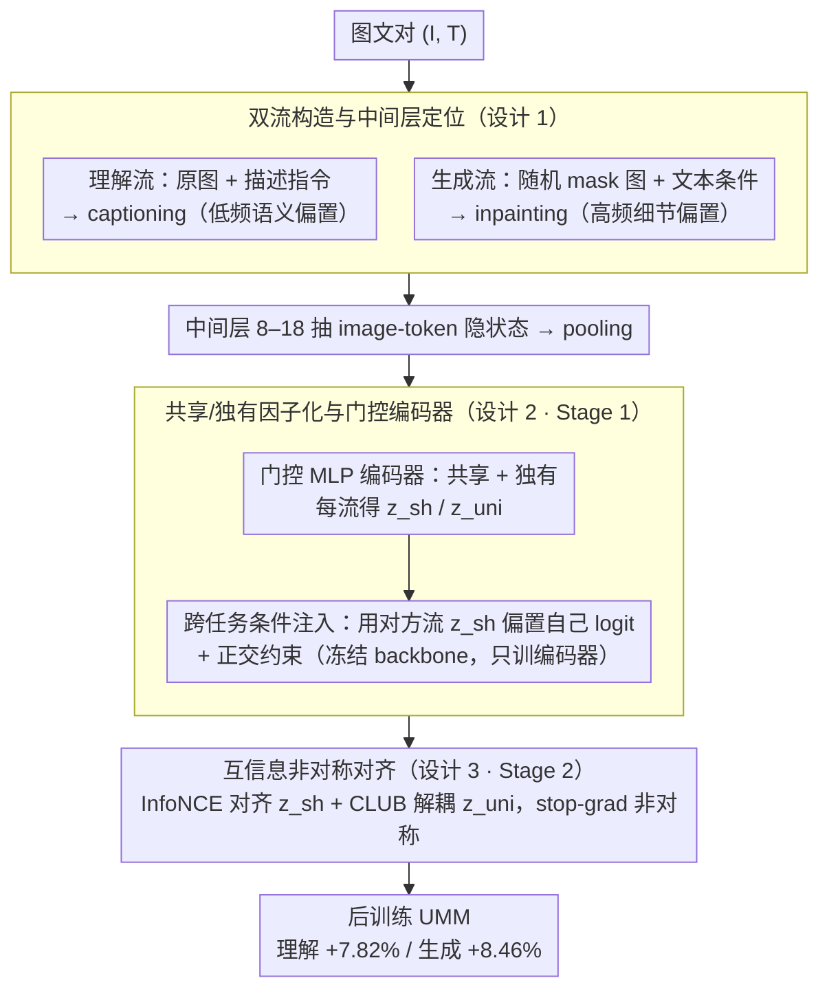

# DIVA: Harnessing the Representation Divergence in Unified Multimodal Models for Mutual Reinforcement

**会议**: ICML 2026  
**arXiv**: [2605.25328](https://arxiv.org/abs/2605.25328)  
**代码**: https://github.com/Jayyy-H/DIVA  
**领域**: 多模态VLM / 统一多模态模型 / 表示学习  
**关键词**: 统一多模态模型、表示分歧、互信息、共享/独有分解、后训练

## 一句话总结
DIVA 发现统一多模态模型 (UMM) 在中间层会自发把"理解"与"生成"两条信息流解耦，于是显式地把表示因子化为共享与独有两部分，用对比/CLUB 互信息约束实现"共享对齐 + 独有解耦"，在 Show-o/Liquid/Nexus-Gen 上同时提升理解 +7.82% 与生成 +8.46%，无需改架构。

## 研究背景与动机

**领域现状**：统一多模态模型 (UMM, e.g. Janus-Pro、Show-o、Liquid、Nexus-Gen) 用单一 transformer 同时承担"图像理解"和"图像生成"两类任务，看起来一举两得，但实际报告里几乎都承认两个目标互相拖后腿。为了缓解冲突，主流补丁是"分家"——分开 visual encoder（如 BLIP3-o）、分开 transformer 主干（Bagel 用 MoT）、甚至 AR + Diffusion 混搭。

**现有痛点**：所有"分家"路线都背叛了 UMM 的核心承诺——只有共享主干才能让理解与生成之间发生真正的 beneficial transfer。一旦解耦了 encoder 或 backbone，两边变成两个串联模型，互相帮助的通道就关上了。但维持共享主干又会被两类任务的归纳偏置撕扯：理解需要语义不变、低频、丢弃细节；生成需要保真、高频、保留细节。

**核心矛盾**：两个目标的归纳偏置在数学上不等价，硬塞进同一组参数会陷入"妥协式表示"——既不够语义抽象也不够像素精细。作者通过梯度/几何/频谱三重分析发现一个被忽视的事实：UMM 中间层**自发**把两条信息流推到不同子空间（梯度冲突在浅层和深层最强，中间层最弱；effective rank 在中间层激增；理解流是低频偏置，生成流保高频），而深层又因同一物理锚点重新对齐。

**本文目标**：把这个自发的"中间层分歧、深层重合"现象从无意识副产品变成显式可控的因子化结构，从而把冲突转成相互增益。

**切入角度**：既然中间层本来就分了家、深层又共享语义锚点，那不如显式定义两个分量——共享分量负责跨任务转移、独有分量负责保留任务专属偏置——并用互信息工具直接对齐共享、解耦独有。

**核心 idea**：把视觉表示因子化为"共享 + 独有"，最大化两条流共享分量的互信息下界、最小化独有分量的互信息上界（CLUB），让冲突变成可控的双向增益。

## 方法详解

### 整体框架
DIVA 是后训练框架，不动 backbone 架构。流程：（1）对同一图文对 $(I, T)$ 构造两条信息流——理解流用 caption 指令喂原图，生成流用随机 mask + 文本条件做 inpainting；（2）从中间层 $\mathcal{I}_{mid}=\{l \mid l_{start}\leq l \leq l_{end}\}$ 抽出 image-token 隐状态并 pool，过共享编码器 ($E_{sh}^i$) 和独有编码器 ($E_{uni}^i$) 分别得到共享/独有分量；（3）两阶段后训练：Stage 1 冻结 backbone 只训编码器（跨任务条件注入 + 正交约束），Stage 2 冻结编码器、解冻 backbone，用非对称 InfoNCE 对齐共享 + CLUB 解耦独有打磨主干。

### 关键设计

**1. 双流构造与中间层定位：从同一锚点造出两条偏置鲜明的信息流**

要把"共享 vs 独有"分解出来，得先有两条共享物理锚点、但归纳偏置显著不同的流。DIVA 从同一对图文 $(I, T)$ 出发造两条流：理解流取原图 + 模板 prompt $t_{prompt}$（如"Please describe this image in detail"），用 captioning loss $\mathcal{L}_{\text{Und}} = \mathcal{L}(f_\theta(\text{concat}(t_{question}, h_v)), t_{answer})$ 驱动，天然引出低频语义流；生成流取 mask 比例 $r \in [0.2, 0.6]$ 的破坏图 $I_{mask} = I \odot (1-M)$ 加原文 $T$ 作条件，用 inpainting loss $\mathcal{L}_{\text{Gen}}$ 驱动，引出高频细节流。两条流对每层 $\ell$ 都 pool 出 image-token 隐状态 $h_i^{(\ell)} = \text{Pool}(H_i^{img,\ell}) \in \mathbb{R}^d$。

中间层范围（论文设 8–18）不是拍脑袋定的，而是按观察到的 effective-rank 峰值定位的——梯度冲突在浅层和深层最强、中间层最弱，effective rank 在中间层激增，正说明这里就是两条流自发分家的地方。共享锚点保证"共享因子"有意义，偏置差异保证存在可分解的结构，二者缺一不可。

**2. 共享/独有因子化与门控编码器：把表示显式拆成两块并锁住分解结构**

有了双流，DIVA 把每层表示显式拆成共享分量 $z_{sh}^{\ell,i}$ 和独有分量 $z_{uni}^{\ell,i}$，对应互信息分解 $I(X_1, X_2; Y) = \Pi_{sh} + \Pi_{uni}^i + \Pi_{uni}^j + \epsilon_{noise}$。对每条流 $i \in \{U, G\}$ 各配两个 3 层 Gated MLP，用元素级软门 $g_{(\cdot)}^{(i)}(\ell) = \sigma(W_{(\cdot)}^i h_i^{(\ell)})$ 调制：$z_{sh}^{\ell,i} = g_{sh}^{(i)}(\ell) \odot \phi_{sh}(h_i^{(\ell)})$、$z_{uni}^{\ell,i} = g_{uni}^{(i)}(\ell) \odot \phi_{uni}(h_i^{(\ell)})$。

Stage 1 冻结 backbone，把因子化输出当 logit bias **跨任务**注入——理解流的 logit 用的是生成流的共享分量：$\tilde{s}_U = s_U + A_U z_{sh}^{\ell,G} + B_U z_{uni}^{\ell,U}$，$\tilde{s}_G = s_G + A_G z_{sh}^{\ell,U} + B_G z_{uni}^{\ell,G}$，再用原生任务 loss 训 encoder。这个 cross-task conditioning 是精髓：它逼着 shared encoder 学到的分量必须"对另一条流也有用"，否则 logit injection 根本降不了 loss，从而避免共享因子退化成某条流的私货。另加正交约束 $\mathcal{L}_\perp = \sum_i \|(\mathbf{z}_{sh}^i)^\top \mathbf{z}_{uni}^i\|_F^2$ 防止 unique encoder 偷偷编码共享语义。这套设计让分解结构在 Stage 1 就稳住，免得 Stage 2 解冻 backbone 时灾难性漂移。

**3. 互信息驱动的非对称对齐（Stage 2）：把冲突真正转成双向增益**

Stage 2 解冻 backbone，正式用互信息工具一边对齐共享、一边解耦独有。共享分量用 InfoNCE 最大化下界 $I_{sha}(X_i^s; X_j^s) = \mathbb{E}[\log \frac{\exp f(x_i, x_j^+)}{\sum_k \exp f(x_i, x_j^-)}]$，让"该共享的尽量靠近"；独有分量用 CLUB 最小化上界 $I_{uni}(X_i^u; X_j^u)$，强制"该独有的尽量远离"，杜绝共享空间漏吸任务私有信息、或独有空间冗余编码共享语义。

理解和生成两个 loss 尺度差异很大，直接联合优化容易被一边主导，所以用 stop-gradient 做非对称对齐：$\mathcal{L}_{U \to G} = -\log \frac{\exp(\text{sim}(z_{sh}^U, \text{sg}[z_{sh}^G])/\tau)}{\sum_j \exp(\text{sim}(z_{sh}^U, \text{sg}[z_{sh}^{G,j}])/\tau)}$，加上对称的 $\mathcal{L}_{G \to U}$——某一边 loss 突然变大也不会把另一边的表示带跑。总损失把五项合一：$\mathcal{L}_{total} = \mathcal{L}_{U \to G} + \mathcal{L}_{G \to U} + \mathcal{L}_{uni} + \mathcal{L}_{Und} + \mathcal{L}_{Gen}$。消融里去掉 CLUB（$I_{uni}$）掉点最多，说明"严格解耦独有"比"对齐共享"还关键——前者防信息泄漏，后者只是加速 transfer。

### 损失函数 / 训练策略
两阶段后训练：Stage 1 用 native task loss + $\mathcal{L}_\perp$ 训共享/独有 encoder（backbone 冻结，先 warmup shared-only 再加 unique residual）；Stage 2 解冻 backbone，用 $\mathcal{L}_{total}$ 五项联合优化。训练数据 200K 图文对（CapsFusion-120M + Infinity-MM 各 60K + JourneyDB 70K + MidjourneyV6 70K，用 Qwen2.5-VL-32B 精修 caption），目标主干是 Show-o (1.5B)、Nexus-Gen (7B)、Liquid (7B)。

## 实验关键数据

### 主实验
在三个代表性 UMM 上做后训练，对比 8 个理解/生成 benchmark：

| 主干 | 设置 | MMMU | POPE | MMVet | GenEval | DPG-Bench | WISE |
|------|------|------|------|-------|---------|-----------|------|
| Show-o (1.5B) | Base | 26.3 | 73.1 | 32.5 | 0.57 | 69.81 | 0.29 |
| Show-o (1.5B) | +DIVA | **32.4 (+6.1)** | **79.1 (+6.0)** | **33.8** | **0.64 (+0.07)** | **76.03 (+6.22)** | **0.34** |
| Nexus-Gen (7B) | Base | 43.5 | 83.6 | 45.2 | 0.77 | 81.30 | 0.39 |
| Nexus-Gen (7B) | +DIVA | **49.4 (+5.9)** | **87.4 (+3.8)** | **46.6** | **0.83 (+0.06)** | **87.87 (+6.57)** | **0.45** |
| Liquid (7B) | Base | 30.2 | 77.4 | 36.9 | 0.70 | 80.63 | 0.41 |
| Liquid (7B) | +DIVA | **34.0 (+3.8)** | **84.5 (+7.1)** | **37.8** | **0.81 (+0.11)** | **83.47 (+2.84)** | **0.44** |

理解平均 +7.82%，生成平均 +8.46%，三个主干**同向提升**——这才是"互相增益"的可信证据。

### 消融实验
| 配置 | MMMU | POPE | GenEval | DPG-Bench |
|------|------|------|---------|-----------|
| Base | 26.3 | 73.1 | 0.69 | 69.81 |
| Base + 普通 SFT | 26.8 | 74.5 | 0.67 | 70.75 |
| Base + DIVA | **32.4** | **79.1** | **0.75** | **76.03** |
| DIVA w/o $I_{uni}$ (无 CLUB) | 28.3 | 75.8 | 0.70 | 71.58 |
| DIVA w/o sg[·] | 31.7 | 78.2 | 0.73 | 74.92 |
| Mid-Layer (9–17) | 31.5 | 78.4 | 0.72 | 73.36 |
| Mid-Layer (8–18) | **32.4** | **79.1** | **0.75** | **76.03** |
| Linear+LN encoder | 29.4 | 75.9 | 0.71 | 72.37 |

### 关键发现
- 单纯 SFT 在同样 200K 数据上几乎不涨甚至掉点（GenEval 0.69 → 0.67），证明 DIVA 的提升不是"多刷数据"的副作用，而是结构化因子分解真的有用。
- 去掉 CLUB 项 ($I_{uni}$) 掉点最多（MMMU -4.1），说明"严格解耦独有分量"比"对齐共享分量"还关键——前者防止信息泄漏，后者只是加速 transfer。
- 中间层范围对结果敏感但不脆弱：8–18 最优，扩到 7–19 几乎不变，缩到 9–17 掉 1 个点，说明 effective-rank 的几何观测确实指向一个稳定的工作区。
- Gated MLP encoder 比 Linear+LN 强 3 个点（MMMU 32.4 vs 29.4），软门机制对层级特征筛选很关键。

## 亮点与洞察
- 把"UMM 互相伤害"重新解读为"中间层已经自发解耦只是没被显式利用"，这个翻案级洞察是论文最值钱的部分——梯度冲突倒抛物线 + effective rank 中部峰值的实证是真正硬的证据。
- 共享/独有因子化 + InfoNCE/CLUB 组合是互信息分解的"教科书做法"，但敢于把它套到多模态后训练并配 stop-gradient 非对称化解决 task scale 异质性，工程落地值得借鉴。
- Cross-task conditioning（用对方流的 shared 因子去 bias 自己的 logit）是 Stage 1 的关键，强制共享因子有"跨任务可用性"约束，避免它退化成 task-specific feature 的副本。
- 该范式可直接迁移到其它"多任务争抢同一 backbone"场景——视频理解 + 生成、3D 重建 + 渲染、语音识别 + TTS 等都能套同样的双流 + 因子化框架。

## 局限与展望
- 200K 后训练数据量在 UMM 后训练里偏小，scale 到 1M+ 时共享/独有结构是否还稳定未验证。
- 中间层范围 (8–18) 是人工按 18 层主干设的；更深的模型（如 32 层 Llama-style）该怎么选论文没给系统化方法。
- 三个 backbone 都属于 AR 派，对 AR + Diffusion 混合（BLIP3-o）或 MoT (Bagel) 是否有效未实验。
- CLUB 上界估计在高维下方差大、训练不稳，论文用 asymmetric stop-gradient 缓解但没给收敛性分析。

## 相关工作与启发
- **vs Bagel / BLIP3-o (架构分家派)**：他们靠 MoT 或独立 visual encoder 物理隔离两类任务，DIVA 反向证明"在共享主干内做表示分解" 足以拿到甚至超过分家方案的效果（Show-o +DIVA 1.5B 的 GenEval 0.64 已经追平 Janus-Pro 7B 的 0.80 的 80%），且参数效率高得多。
- **vs Show-o / Liquid / Nexus-Gen baseline**：DIVA 是 plug-in 后训练，不动架构，三个主干都涨，证明它捕捉的是 UMM 的**普遍**结构性问题而非某个特定模型的 bug。
- **vs 通用 MoE / LoRA 分支**：MoE 用路由器在 token 级分流，DIVA 用 encoder 在表示级分流；前者改架构、增加推理成本，后者只在 mid-layer 加轻量 MLP，推理时甚至可以丢掉 encoder 直接用 fine-tuned backbone。

## 评分
- 新颖性: ⭐⭐⭐⭐⭐ "UMM 中间层自发解耦" 的实证 + "显式因子化对齐共享解耦独有" 的处方在统一多模态领域首次成体系给出。
- 实验充分度: ⭐⭐⭐⭐ 三个 backbone × 8 个 benchmark 横向对比扎实，消融覆盖 5 个维度；但缺 scaling law 与混合架构验证。
- 写作质量: ⭐⭐⭐⭐ 观察-动机-方法-实验的逻辑链清晰；公式与符号偶尔有冗余（如 $W_{sh}^i, W_{uni}^i$ 维度未显式定义）。
- 价值: ⭐⭐⭐⭐⭐ 给"统一多模态如何后训练" 提供了第一个可证明有效的轻量级方案，对工业部署的 UMM 极具参考价值。

<!-- RELATED:START -->

## 相关论文

- [\[ICML 2026\] Breaking Dual Bottlenecks: Evolving Unified Multimodal Models into Self-Adaptive Interleaved Visual Reasoners](breaking_dual_bottlenecks_evolving_unified_multimodal_models_into_self-adaptive_.md)
- [\[ICML 2026\] Seeing is Understanding: Unlocking Causal Attention into Modality-Mutual Attention for Multimodal LLMs](seeing_is_understanding_unlocking_causal_attention_into_modality-mutual_attentio.md)
- [\[NeurIPS 2025\] Unified Reinforcement and Imitation Learning for Vision-Language Models](../../NeurIPS2025/multimodal_vlm/unified_reinforcement_and_imitation_learning_for_vision-language_models.md)
- [\[ICML 2026\] Calibrated Multimodal Representation Learning with Missing Modalities](calibrated_multimodal_representation_learning_with_missing_modalities.md)
- [\[ICLR 2026\] Modal Aphasia: Can Unified Multimodal Models Describe Images From Memory?](../../ICLR2026/multimodal_vlm/modal_aphasia_can_unified_multimodal_models_describe_images_from_memory.md)

<!-- RELATED:END -->
