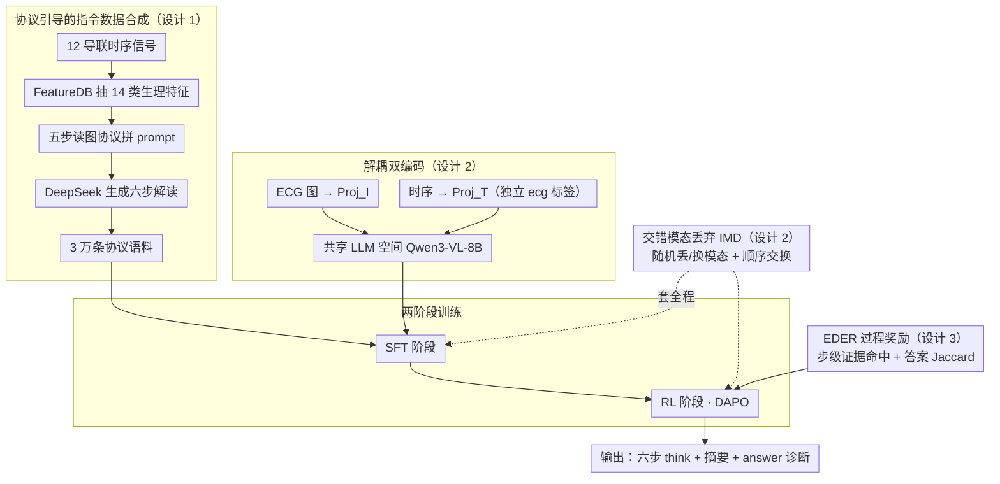

# ECG-R1: Protocol-Guided and Modality-Agnostic MLLM for Reliable ECG Interpretation

**会议**: ICML 2026  
**arXiv**: [2602.04279](https://arxiv.org/abs/2602.04279)  
**代码**: 论文声明开源 (Code is available at here)  
**领域**: 医学图像 / 多模态VLM / 强化学习  
**关键词**: ECG 解读、医学 MLLM、协议引导、模态丢弃、过程奖励 RL

## 一句话总结
ECG-R1 是首个面向心电图解读的"推理型"医学多模态大模型，通过**协议引导的指令数据合成 + 信号/图像解耦编码 + 交错模态丢弃训练 + 基于诊断证据的过程奖励 RL** 四件套，把心电诊断准确率从此前 SOTA GEM 的 74.7 提升到 80.3，并在任一模态缺失时保持跨模态一致性。

## 研究背景与动机

**领域现状**：当前主流做法把心电解读交给两类模型——通用/医学 MLLM（GPT-5.1、MedGemma 等）通常只看 ECG 图像；少数 ECG 专用 MLLM（PULSE、GEM）开始把 12 导联时序信号也接进来做 omni-perception。两条路径都走 "VLM + 微调" 路线，方法学上沿用一般多模态训练的范式。

**现有痛点**：作者在 ECG-Grounding 测试集上做了系统评测，发现两件令人不安的事——其一，即使是 GPT-5.1 这样的旗舰模型，诊断准确率也只有 31.5，且产出大量看起来结构完整、用词专业、实际却临床错误的"幻觉式"解读；其二，GEM 这类 omni 模型一旦在测试时缺失一种模态（只剩信号或只剩图像），性能显著掉点，且同一份 ECG 在两种模态下给出的解读互相矛盾，BLEU-4 仅 0.33。

**核心矛盾**：现有训练语料本身就不可靠——ECG-Grounding 这类数据集是"拿 LLM 从诊断标签反向 prompt 出解读"，LLM 的回答依赖预训练先验而非真实的心电诊断规则，于是数据集里就埋了大量临床错误，模型 SFT 之后只是把错误的因果链学得更熟练。同时，omni 架构把时序 token 塞进 `<image>` 占位符并复用同一个 image-language projector，结构上就假设两模态必须同现，单模态推断既不自然又有容量瓶颈。

**本文目标**：把上述三件事分别解决——（1）造出真正遵循临床协议的解读语料；（2）让模型在任一模态缺失时都稳定且自洽；（3）让推理过程本身被奖励而不仅仅是最终答案。

**切入角度**：心电学有现成的诊断协议（专著 *ECG from Basics to Essentials* 的第 23 章把读图流程拆成五步），完全可以用这套显式规则去"约束 LLM 生成训练数据"，把医生的先验知识硬编码进数据合成 prompt；同时图像和时序本质上是同一波形的两种渲染，理论上跨模态分歧 $\Delta_{\text{view}}$ 应该极小，这给"强制模态交换不变"提供了天然合法性。

**核心 idea**：用协议把医学规则注入到数据、用 IMD 把鲁棒与一致性写进训练目标、用 EDER 把过程证据写进 RL 奖励，三层都对齐到"可验证的临床证据"上。

## 方法详解

### 整体框架
ECG-R1 的输入是三元组 $(x^{\text{text}}, x^I, x^T)$——文本指令、ECG 渲染图、12 导联时序信号；输出是结构化解读 $y$，由 `<think>` 块（六步协议推理）、简短摘要、`<answer>` 块（最终诊断）三段组成。整条 pipeline 分四个模块：FeatureDB 抽特征 → 协议引导生成训练语料 → 解耦双编码器把图像/时序映到共享 LLM 空间 → 两阶段训练（SFT + RL），全程套用 Interleaved Modality Dropout (IMD)。LLM 主干用 Qwen3-VL-8B，时序编码器用 ECG-CoCa。

### 关键设计

**1. 协议引导的指令数据合成：从源头压住训练语料里的临床幻觉**

ECG-Grounding 这类语料的病根在于让 LLM 拿着诊断标签裸 prompt 自由发挥，结果把预训练先验里的错误因果链当成"心电规则"写进了数据。ECG-R1 改成两步约束生成：先用确定性、不可训的 FeatureDB 从 12 导联时序里抽出 14 类生理特征（心率、RR、P/QRS/T 振幅与时长、PR/QT/QTc、ST 描述符等），记 $\boldsymbol{x}^{fs} = \mathrm{FeatureDB}(\boldsymbol{x}^T)$；再用专著第 23 章的五步读图协议（Rate&Rhythm → Conduction&Axis → Hypertrophy → Ischemia → Electrolytes&QT，并强制鉴别排除）拼成 prompt $\boldsymbol{x}^p = \mathrm{ProtocolGuider}(\boldsymbol{x}^{fs}, x^{\text{protocol}})$，喂给 DeepSeek-V3.1-Terminus 强迫它按固定 schema 输出六步 `<think>` + 摘要 + `<answer>`，从 MIMIC-IV-ECG 造出 3 万条 SFT 主语料。

这一步的关键是把医生写诊断时遵循的量化阈值和差分排除规则**显式注入生成约束**：LLM 不再凭印象编一段听起来专业的解读，而是被协议逼着逐项核对特征、做鉴别。副产物是它能挖出原始报告里漏标的异常。

**2. 解耦双编码 + 交错模态丢弃（IMD）：让任一模态缺失时都鲁棒且自洽**

GEM 这类 omni 模型把时序 token 硬塞进 `<image>` 占位符、复用同一个 image-language projector，结构上就假设两模态必须同现——测试时只剩信号或只剩图像就显著掉点，而且同一份 ECG 在两种模态下给出的解读互相矛盾。ECG-R1 先在架构上解耦：引入显式 `<ecg>` 标签置于 `<image>` 之前，时序与图像各走独立 projector，$z^T = \mathrm{Proj}_T(\mathrm{Encoder}_T(x^T))$、$z^I = \mathrm{Proj}_I(\mathrm{Encoder}_I(x^I))$，彻底解开"时序必须借 image 占位符"的耦合。

训练时则把"模态缺失"和"顺序交换"摊进目标：按分布 $q$ 采样变换 $\tau \in \mathcal{T}_{\text{test}}=\{\tau_I, \tau_T, \tau_{IT}, \tau_{TI}\}$（丢图、丢信号、两种拼接顺序），最小化混合风险 $R_q(\theta)=\mathbb{E}_{\tau\sim q}[R_\tau(\theta)]$。作者证明在覆盖性假设 $q(\tau)\geq\alpha$ 下有 $R_{\max}(\theta) \leq \alpha^{-1} R_q(\theta)$，并把跨模态分歧 $\mathcal{F}(\theta)$ 控制在 $\Delta_{\text{view}}+\sqrt{\varepsilon_{\tau_I}/2}+\sqrt{\varepsilon_{\tau_T}/2}$ 量级。由于 ECG 两模态本是同一波形的两种渲染，$\Delta_{\text{view}}\approx 0$，所以只要最小化 $R_q$，鲁棒性和一致性就同时落地。和现有 omni 只在"两模态都在 + 固定顺序"下做 ERM 相比，IMD 把所有目标测试环境都纳入训练目标，又不需要额外的对齐损失或缺失模态生成器。

**3. EDER：用诊断证据当过程奖励，压住"答对但理由是编的"**

DeepSeek-R1 那套通用推理 RL 只看 format + 最终答案，中间推理仍能随意编造；但 ECG 诊断要求每一步都拿得出证据。EDER 先用 DeepSeek-V3.1-Terminus 从每条 RL 样本（共 3,948 条）的参考 trace 里抽出每步的关键证据短语 $\mathcal{E}_k(y)$（每步至多 3 个、每个 ≤6 词），再定义步级奖励 $r^{(k)}_{\text{step}}=|\mathrm{match}(\mathcal{E}_k(y), \tilde{y}^{(k)})|/|\mathcal{E}_k(y)|$ 衡量第 $k$ 步命中了多少该提的证据，过程奖励是各步平均 $R_{\text{EDER}}=\frac{1}{K}\sum_k r^{(k)}_{\text{step}}$。

答案侧用集合级 Jaccard $R_{\text{accuracy}} = |\mathcal{S}(\hat{a}) \cap \mathcal{S}(a^\star)| / |\mathcal{S}(\hat{a}) \cup \mathcal{S}(a^\star)|$（按分号切分多标签），总奖励 $R_{\text{total}} = R_{\text{format}} + R_{\text{accuracy}} + \lambda R_{\text{EDER}}$，用 DAPO 优化（$\epsilon_{\text{low}}=0.2, \epsilon_{\text{high}}=0.3$，per-response advantage 共享给所有 token）。这样"step k 必须提到的关键发现"被直接当成训练信号，从根上压住推理步的幻觉——而且证据抽取靠 LLM + 字符串匹配实现，避开了训练一个 PRM 的高成本。

### 损失函数 / 训练策略
两阶段：SFT 阶段用 $\mathcal{D}_{\text{SFT}}$（协议语料 + ECGInstruct 并集）做一个 epoch 的 teacher-forcing $\min_\theta \mathbb{E}_{(x,y)\sim\mathcal{D}_{\text{SFT}}}[-\log\pi_\theta(y|x)]$，并启用 IMD；RL 阶段在 $|\mathcal{D}_{\text{RL}}|=3{,}948$ 子集上跑 DAPO，目标 $J(\theta)=\mathbb{E}[\frac{1}{N}\sum_{i,t}\min(r_{i,t}, \tilde{r}_{i,t}) \hat{A}_i]$，依旧带 IMD。

## 实验关键数据

### 主实验
基础测试在 ECG-Grounding test set（2,381 例）上，用 DeepSeek-V3.1-Terminus 按七项 rubric 打分；外加 100 例由四位执业心电医师按可靠性 + 实用性双维度盲评。

| 模型类别 | 模型 | Diagnosis Acc | Analysis Completeness | Lead Evidence Validity | Clinical Diagnostic Fidelity |
|--------|------|--------------|----------------------|------------------------|-----------------------------|
| 闭源旗舰 | GPT-5.1-Instant | 31.48 | 3.03 | 1.92 | 43.46 |
| 医学 MLLM | MedGemma-27B | 25.23 | 3.20 | 0.81 | 39.22 |
| ECG 专用 | PULSE | 66.13 | 1.90 | 0.19 | 40.53 |
| ECG 专用 | GEM (前 SOTA) | 74.70 | 4.25 | 4.41 | 62.90 |
| 本文 | ECG-R1 (SFT) | 79.33 | 6.36 | 5.53 | 83.51 |
| 本文 | ECG-R1 (RL) | **80.29** | **6.51** | **5.81** | **84.20** |

诊断准确率比 GEM 提升 5.6 个绝对点（74.7 → 80.3），临床诊断保真度提升 21 个点（62.9 → 84.2），且 RL 进一步加 1 分左右。

### 跨模态一致性
| 指标 | BLEU-4 | ROUGE-L | SBERT |
|------|--------|---------|-------|
| GEM | 0.33 | 0.43 | 0.92 |
| ECG-R1 | **0.69** | **0.73** | **0.97** |

BLEU-4 翻倍多，证明同一份 ECG 在仅给信号 vs 仅给图像时模型说的话高度一致。

### 关键发现
- IMD 的覆盖性假设直接换来 worst-case 风险的 $\alpha^{-1}$ 倍上界，工程意义是：丢哪一种模态都不至于崩盘，这是临床部署的硬刚需。
- SFT → RL 的增量虽小（1 个点左右），但 EDER 真正解决的是"诊断对了但理由是编的"这种隐性失败模式，对医学合规至关重要，靠 Diagnosis Acc 这一个指标其实低估了 RL 的价值。
- 与 GPT-5.1 的差距（80.3 vs 31.5）说明专门的协议语料对小模型的杠杆远超盲目堆参数。

## 亮点与洞察
- "把领域规则编进数据合成 prompt" 是本文最可迁移的范式：任何有 standard-of-care 文档的医学子领域（影像分级、病理报告）都可以照搬这套五步协议化 + LLM 生成的流水线。
- IMD 的理论分析特别干净：把"模态缺失"和"顺序交换"统一抽象成 4 个 deterministic transformation，在 ECG 这种"两个 view 都是同一物理对象的渲染" 的场景里 $\Delta_{\text{view}}\approx 0$ 直接落地，比传统 modality-dropout 多了一个可证明的一致性保证。
- 过程奖励 $R_{\text{EDER}}$ 用 LLM 抽证据短语 + 字符串匹配实现，避开了"过程奖励需要训练 PRM" 的高成本路线，是医学 RL 一个轻量但精准的 design choice。

## 局限与展望
- FeatureDB 是确定性外部工具，决定了 grounding 上限——任何 FeatureDB 抽不出的异常（如罕见波形）都无法被协议覆盖。
- 30K 协议语料完全由 DeepSeek-V3.1-Terminus 生成，仍是 LLM-as-author 范式，只是"协议化"压住了 free-form 幻觉；如果协议本身有疏漏（如专著未提的新诊断标准），错误会被系统性放大。
- 跨模态一致性的强保证依赖 $\Delta_{\text{view}}$ 可忽略这一 ECG 特性，迁移到 RGB+depth、语音+文本等真正异质多模态场景时该假设不成立。
- RL 子集仅 3,948 条且用固定种子 shuffle，DAPO 的覆盖率与策略多样性受限。

## 相关工作与启发
- **vs GEM (Lan et al., 2025)**：GEM 把时序硬塞进 `<image>` 占位符复用 image projector，本文用 `<ecg>` 显式标签 + 独立 projector 解耦；更关键的是 GEM 训练时无 IMD，单模态推断直接崩。
- **vs ECG-Grounding (Lan et al., 2025) 数据**：同样用 LLM 生成解读，但 ECG-Grounding 让 LLM 依赖预训练先验自由发挥，本文用专著五步协议把生成约束在临床规则内。
- **vs DeepSeek-R1 / R1-VL (Zhang et al., 2025)**：R1 类只奖励 format + 答案，EDER 借鉴 R1-VL 引入步级奖励但把信号从通用 visual reasoning 换成了诊断证据短语命中率，是 R1 范式在医学 RL 上的精准适配。

## 评分
- 新颖性: ⭐⭐⭐⭐ 协议引导数据 + IMD + EDER 三件套都不是空前创新，但组合在 ECG 域内是首次，且 IMD 给出理论保证。
- 实验充分度: ⭐⭐⭐⭐⭐ 七项 rubric + 跨模态一致性 + 心电医师盲评三层验证，覆盖了主流闭源/开源/医学/ECG 四类基线。
- 写作质量: ⭐⭐⭐⭐ 方法分块清晰，定理与定义对应工整；缺点是部分公式排版有冗余符号。
- 价值: ⭐⭐⭐⭐⭐ 直击医学 MLLM 部署的两大死穴——幻觉与模态缺失，且范式可迁移到其他基于协议的医学场景。

<!-- RELATED:START -->

## 相关论文

- [\[AAAI 2026\] anyECG-chat: A Generalist ECG-MLLM for Flexible ECG Input and Multi-Task Understanding](../../AAAI2026/multimodal_vlm/anyecg-chat_a_generalist_ecg-mllm_for_flexible_ecg_input_and.md)
- [\[NeurIPS 2025\] GEM: Empowering MLLM for Grounded ECG Understanding with Time Series and Images](../../NeurIPS2025/multimodal_vlm/gem_empowering_mllm_for_grounded_ecg_understanding_with_time_series_and_images.md)
- [\[ICML 2026\] AOEPT: Breaking the Implicit Modality-Reduction Bottleneck in Modality-Missing Prompt Tuning](aoept_breaking_the_implicit_modality-reduction_bottleneck_in_modality-missing_pr.md)
- [\[ICML 2026\] Less Precise Can Be More Reliable: A Systematic Evaluation of Quantization's Impact on VLMs Beyond Accuracy](less_precise_can_be_more_reliable_a_systematic_evaluation_of_quantizations_impac.md)
- [\[ICML 2026\] RESTORE: 通过矫正失真改进视觉 Token 缩减以提升 MLLM 推理效率](improving_visual_token_reduction_via_rectifying_distortions_for_efficient_multim.md)

<!-- RELATED:END -->
