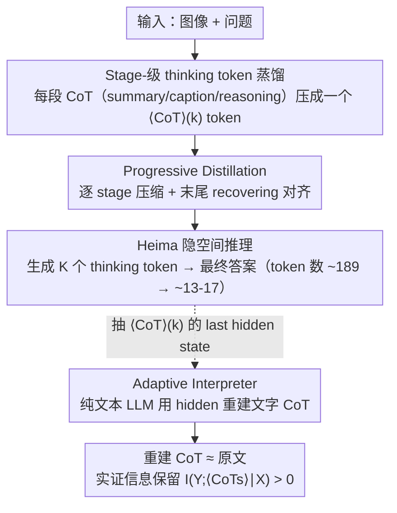

# Efficient Reasoning with Hidden Thinking

**会议**: ICML 2026  
**arXiv**: [2501.19201](https://arxiv.org/abs/2501.19201)  
**代码**: https://github.com/shawnricecake/Heima  
**领域**: 多模态 VLM / 高效推理 / 隐空间推理 / CoT 压缩  
**关键词**: Heima、thinking tokens、progressive distillation、information-theoretic bound、interpreter

## 一句话总结
Heima 把多模态 LLM 的冗长 CoT 每个阶段（summary / caption / reasoning）蒸馏成**一个特殊 thinking token**，让模型在隐空间里"想"，token 数从 100-200 量级降到 13-16 个的同时 zero-shot 准确率反而比 LLaVA-CoT 更稳；配套训练一个 LLM "interpreter"用 thinking token 的 hidden state 重建出文字推理链，从而验证压缩损失的信息论上界。

## 研究背景与动机

**领域现状**：MLLM 用 CoT 做复杂多模态推理已成主流（LLaVA-CoT 等），但每条 CoT 要生成数百 token，推理延迟高、API 成本爆。Coconut (Hao et al., 2024) 在 GPT-2 上做过 CoT 压缩，但只在文本 + 小模型上验证。

**现有痛点**：(1) MLLM 的 CoT 比纯文本更长（要描述图像 + 推理），延迟问题更严重；(2) 已有的 latent reasoning 方法 (Cheng & Van Durme) 把整个 CoT 压成一段连续 embedding，在数学题上准确率掉得厉害——说明"无脑压缩"会丢关键信息；(3) 缺乏理论框架告诉我们到底压缩多少 token 既能省成本又不丢推理能力。

**核心矛盾**：CoT 越短推理越快，但每砍掉一段 CoT 都可能减少 $I(Y;\text{CoTs}|X)$（CoT 携带的目标相关互信息）。要量化这个 trade-off 并保证压缩后仍然 $I(Y;\langle CoTs\rangle|X)>0$，必须有正式的信息论刻画 + 实证手段验证信息没丢光。

**本文目标**：(i) 给 MLLM 设计一个 latent CoT 压缩框架；(ii) 用信息论形式化"压缩-准确率"trade-off；(iii) 设计可重建 textual CoT 的 interpreter，实证压缩损失。

**切入角度**：LLaVA-CoT 的 CoT 是按 stage 组织的（summary / caption / reasoning），每个 stage 是一个语义独立单元，正好可以蒸馏成**一个 stage-token**。一个 token 的 hidden state 容量虽然有限但 768-4096 维已经足够装下"一段推理的语义指纹"。

**核心 idea**：每个 CoT stage 蒸馏成一个 special token `<CoT>(k)`，模型直接在 embedding 空间生成这几个 token 就出最终答案；再用单独的 LLM interpreter 反推每个 token 的 hidden 重建出对应的文字 CoT，作为信息保留度的实证证明。

## 方法详解

### 整体框架
两类模型：
- **Heima** (基于 LLaVA-CoT-11B / LLaVA-Next-Vicuna-7B)：做隐空间推理，输入 (image, question)，输出 $K_i$ 个 thinking tokens + 最终答案。
- **Interpreters** (基于 Llama-3.1-8B / Vicuna-7B，pure LLM 无视觉)：每个 CoT stage 一个，输入 (explanatory prompt, 文本 question, thinking token 的 hidden state)，输出原始 CoT 文本。

推理时只用 Heima，token 数从 ∑|CoT(k)|（~100-200）降到 $K_i$（3-4）。Interpreters 只在做"信息论实证分析"时用。

### 关键设计

**1. Stage-级 thinking token 蒸馏 + 信息论保证：把每段 CoT 压成一个特殊 token，并量化压了多少信息**

LLaVA-CoT 的 CoT 本就按 stage（summary / caption / reasoning）组织，每个 stage 是一个语义独立单元，正好可以各压成一个 special token。做法是把原始数据集 $D=\{(X,\text{CoTs},Y)\}$ 改写成 $D_H=\{(X,\langle CoTs\rangle,Y)\}$，其中 $\langle CoTs\rangle:=\{\langle CoT\rangle_{(k)}\}_{k=1}^{K_i}$ 把每个 stage 替换成一个 vocabulary 里新增的 token，蒸馏目标 $\mathcal{L}(\theta)=-\mathbb{E}_{(X,Y,\langle CoTs\rangle)\sim D_H}\log P_\theta(\langle CoTs\rangle,Y|X)$ 直接 fine-tune 让模型预测 thinking token 序列加答案。关键是作者把"压缩到底丢不丢推理能力"形式化成信息论问题：由于 $\langle CoTs\rangle=f(X,\text{CoTs})$ 构成 Markov 链 $Y-(X,\text{CoTs})-\langle CoTs\rangle$，Theorem 3.1 给出 $0\leq I(Y;\langle CoTs\rangle|X)\leq I(Y;\text{CoTs}|X)$，而 information gap $I(Y;\text{CoTs}|X)-I(Y;\langle CoTs\rangle|X)=I(Y;\text{CoTs}|X,\langle CoTs\rangle)\geq 0$ 恰好量化了"压缩损失"的大小——只要 $I(Y;\langle CoTs\rangle|X)>0$，推理能力就被保留。这让"thinking token 够不够"从经验问题变成可用 interpreter 实测的具体量。所有样本的第 $k$ 阶段共享同一个 token（不是 per-sample 一个），保证 vocabulary 不爆炸。

**2. Progressive Distillation：一次只压一个 stage，避免优化坍塌**

如果一上来就把所有 CoT stage 全压成 token，每个 token 同时承担太多压缩任务，loss landscape 难优化。这里改成 curriculum：分 $M=\max\{K_i\}+1$ 个阶段，第 $s$ 阶段的训练数据 $D_P=\{(X,\{\langle CoT\rangle_{(k)}\}_{k=1}^s,\{CoT_{(k)}\}_{k=s+1}^{K_i},Y)\}$——前 $s$ 个 stage 已压成 thinking token、后面的还是原文，逐 stage 推进直到全部压完。每次模型只需学会内化一种新的压缩，逐步把推理模式"吃进"hidden state。最后再加一个 recovering stage，只用 thinking token 全程训练，解决"各 stage 单独压好了但拼起来不顺"的转换对齐问题。消融显示去掉 progressive 掉 1.7%、去掉 recovering 再掉 1.4%，两者都必要。

**3. Adaptive Interpreter：用 hidden state 反推文字 CoT，把"信息没丢光"测出来**

理论给了 information gap 的上下界，但实际差多少必须实证。每个 stage $k$ 配一个用 Llama-3.1-8B 初始化的纯文本 interpreter $\mathcal{I}_{\theta_k}$，训练数据 $D_I$ 含解释 prompt、文本问题（无图像）、thinking token、token 的 last hidden state $H_{\langle CoT\rangle_{(k)}}$、原始 CoT 文本。最关键的操作是：interpreter 输入端把 thinking token 的 word embedding **替换成** Heima 输出的 last hidden state——因为推理信息编码在 hidden 而非 token id 里——然后用标准 next-token loss $\max_{\theta_k}\mathbb{E}\log P_{\theta_k}(CoT_{(k)}|X_e,X_q,H_{\langle CoT\rangle_{(k)}})$ 训它重建原文。重建出来的文本越接近原始 CoT，就说明 $I(Y;\text{CoTs}|X,\langle CoTs\rangle)$ 越小、信息保留越完整。这套架构反过来也证明 Heima 是真在隐空间推理而非简单 overfit——信息能从 hidden 解码回连贯文本：论文给的 BMW logo 例子里，interpreter 从 hidden 重建出"sleek modern sports car with black exterior"和"cross with a circle"，完美对应原始 CoT。

### 损失函数 / 训练策略
- Heima：LoRA fine-tune LLaVA-CoT-11B（rank=16, alpha=32），冻 image encoder，更新所有 attention + MLP + 输出投影。Progressive distillation 分 $M$ 个阶段，每个阶段一个 epoch。
- Interpreter：同样 LoRA 配置，next-token prediction loss，从冻结的 Heima 抽 hidden state。
- 全部用 torchtune + 8×H100。

## 实验关键数据

### 主实验

LLaVA-CoT-11B 系列 6 个零样本基准（括号内为生成 token 数）：

| Model | MMStar | MMBench | MMVet | MathVista | AI2D | Hallusion | Avg | Tokens |
|-------|--------|---------|-------|-----------|------|-----------|-----|--------|
| Llama-3.2-11B-Vision | 48.1 | 58.2 | 50.2 | 50.3 | 68.5 | 37.2 | 52.1 | ~119 |
| LLaVA-CoT | 54.0 | 70.7 | 49.8 | 50.9 | 77.6 | 63.8 | 61.1 | ~189 |
| Heima w/o progressive | 49.7 | 72.5 | 39.0 | 39.3 | 75.9 | 61.3 | 56.3 | ~23 |
| Heima w/o recover | 49.8 | 71.6 | 42.8 | 39.8 | 77.3 | 58.5 | 56.6 | ~24 |
| **Heima (full)** | 49.9 | **72.8** | 43.3 | 43.6 | 77.5 | 60.6 | 58.0 | **~24** |

Heima 平均 token 13-17（CoT 类基准上比 LLaVA-CoT 少 **10-15× tokens**）；MMBench / AI2D 上甚至比 LLaVA-CoT 更准。

### 消融实验

| 配置 | 平均 Acc | 备注 |
|------|---------|------|
| Heima w/o progressive | 56.3 | 一次性压缩所有 stage，掉 1.7 |
| Heima w/o recover | 56.6 | 没有最后的 recovering stage，掉 1.4 |
| Heima (full) | 58.0 | 完整方法 |

Interpreter 重建质量（4300 样本）：用 BLEU-4 / METEOR / ROUGE / BERTScore + GPT-4o 相似度评估，论文称重建文本"closely align with original CoTs"，验证 information gap 可控。

### 关键发现
- **MathVista 上 Heima 43.6 < LLaVA-CoT 50.9** 但 token 少 16×，说明数学推理仍然依赖完整 CoT，is the bottleneck case；MMBench / AI2D 上反而 Heima 更准，可能是去掉了 CoT 噪声。
- **Progressive distillation 至关重要**：去掉损失 1.7%；recovering stage 再加 1.4%——说明 curriculum + 后期对齐都是必要的。
- **Token 数从 ~189 → ~13-17 是 14× 压缩**，但平均准确率只掉 3% (61.1→58.0)，性价比极高。
- **Interpreter 能从 hidden 重建出几乎完整的 caption + reasoning**（如 BMW 例子），验证了 hidden state 不是 black box，而是真正承载推理信息。
- **没有 progressive 时 MMVet 暴跌到 39.0**（vs full 43.3）说明一次性压缩在长 CoT 任务上不可行。

## 亮点与洞察
- **首次把 latent CoT 压缩 + 严格信息论分析 + 可解释 interpreter 三者同时做到了 MLLM 规模**。Coconut 只在 GPT-2 + 数学；Heima 在 11B MLLM + 6 个多模态基准。
- **Information-theoretic Theorem 3.1 是 latent reasoning 领域少见的形式化结果**：把 "压缩可以但要保证 I(Y;⟨CoTs⟩|X)>0" 这个直觉量化，提供了未来设计 latent 推理框架的基线。
- **Interpreter 同时是诊断工具和可解释性工具**：训完 interpreter 既能客观评估 hidden 信息量，又能给端用户看 "模型在 hidden 里到底想了什么"，对 alignment / safety 都有价值。
- **Stage-shared token 设计平衡了表达力和词表开销**：所有样本共享 $\langle CoT\rangle_{(k)}$，避免 vocabulary 爆炸又保持 stage 语义。
- **Progressive distillation 的训练范式可迁移到任何"压缩多段语义单元"的任务**，如长上下文摘要、对话历史压缩、多步代码生成。

## 局限与展望
- **数学推理上掉点明显**（MathVista 50.9→43.6），说明 13-17 个 hidden token 装不下完整算术 chain；说明 latent reasoning 在精确符号操作上仍有瓶颈。
- **每个 stage 一个 token 的粒度是手工设计**，没探究"自适应 stage 数 / 自适应 token 数"。
- **依赖 LLaVA-CoT 数据集的 stage 划分**，对其他没有 stage 标注的 CoT 数据需要先做 stage 分割。
- **Interpreter 训练成本翻倍**：每个 stage 一个 interpreter，多 stage 任务接近线性增长。
- **未在更大模型（34B+）或 GPT-4V 上验证**，scale law 不清楚。
- **没对比 Coconut on MLLM 的扩展版**——Coconut 用连续 thinking embedding，Heima 用 token-level；这两者哪个更适合 MLLM 是开放问题。
- **改进方向**：(i) 让 thinking token 数量可变（用一个 token 表示"还要想几步"）；(ii) 多 token per stage 提升数学推理能力；(iii) 在 RLHF 阶段也用 latent CoT 做 reward shaping。

## 相关工作与启发
- **vs Coconut (Hao et al., 2024)**：Coconut 在 GPT-2 + 单任务文本数学；Heima 在 11B MLLM + 6 个多模态基准 + 信息论框架，scale 和广度都大一个数量级。
- **vs Cheng & Van Durme 2024**：把 CoT 压成 continuous embedding，但数学准确率大幅退化；Heima 用 token-level discrete representation 配合 progressive distillation，避免了那种 catastrophic degradation。
- **vs Speculative decoding / Medusa**：autoregressive 上的并行加速，跟 latent reasoning 是不同维度的优化，可以叠加使用。
- **vs LISA / VLM-Latent (Lai et al., Pi et al.)**：在 LLM hidden 里塞视觉信息做下游任务（segmentation / detection）；Heima 反过来用 hidden 塞推理过程，证明 hidden 不仅可载视觉也可载逻辑。
- **vs RLHF efficient reasoning**：RLHF 通过 reward 学短 CoT，本质上还是 textual；Heima 直接换 representation，是更根本的优化。

## 评分
- 新颖性: ⭐⭐⭐⭐⭐ 第一个 MLLM 上的 stage-token latent CoT，加上严格信息论刻画 + interpreter 闭环验证
- 实验充分度: ⭐⭐⭐⭐ 6 个 zero-shot benchmark + 两个 model family + 完整 ablation；但缺少 latency wall-clock 数据和 RLHF 对比
- 写作质量: ⭐⭐⭐⭐⭐ 信息论部分简洁严谨，BMW logo 的 motivating example 极生动
- 价值: ⭐⭐⭐⭐⭐ MLLM 推理成本是部署主要瓶颈，14× token 压缩 + 3% 平均掉点是产业可用级别的优化；代码开源

<!-- RELATED:START -->

## 相关论文

- [\[ICML 2026\] From Seeing to Thinking: Decoupling Perception and Reasoning Improves Post-Training of Vision-Language Models](from_seeing_to_thinking_decoupling_perception_and_reasoning_improves_post-traini.md)
- [\[ICML 2026\] Bad Seeing or Bad Thinking? Rewarding Perception for Vision-Language Reasoning](bad_seeing_or_bad_thinking_rewarding_perception_for_vision-language_reasoning.md)
- [\[AAAI 2026\] AStar: Boosting Multimodal Reasoning with Automated Structured Thinking](../../AAAI2026/multimodal_vlm/astar_boosting_multimodal_reasoning_with_automated_structure.md)
- [\[ICLR 2026\] SophiaVL-R1: Reinforcing MLLMs Reasoning with Thinking Reward](../../ICLR2026/multimodal_vlm/sophiavl-r1_reinforcing_mllms_reasoning_with_thinking_reward.md)
- [\[CVPR 2026\] Thinking with Programming Vision: Towards a Unified View for Thinking with Images](../../CVPR2026/multimodal_vlm/thinking_with_programming_vision_towards_a_unified_view_for_thinking_with_images.md)

<!-- RELATED:END -->
