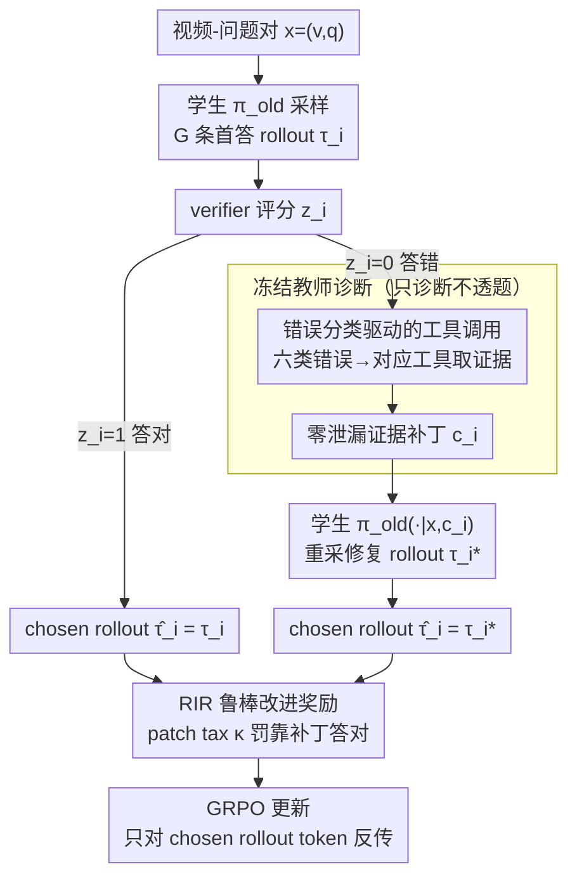

# Find, Fix, Reason: Context Repair for Video Reasoning

**会议**: ICML 2026  
**arXiv**: [2604.16243](https://arxiv.org/abs/2604.16243)  
**代码**: 有 (FFR, 匿名链接)  
**领域**: 多模态VLM / 视频推理 / 强化学习  
**关键词**: 视频推理, GRPO, 工具集成教师, 上下文修复, 时空依赖

## 一句话总结
本文针对视频推理中"on-policy RL 在能力天花板停滞、off-policy 蒸馏又会熵塌缩"的两难，引入一个冻结的、工具集成的大教师模型在学生 rollout 失败时插入最小化的"证据补丁" (key-frame 区间、错误类型)，让学生在同一问题上重新作答，并把修复后的轨迹通过 chosen-rollout 机制纳入 GRPO 优化。

## 研究背景与动机

**领域现状**：基于 GRPO 的视频推理 LMM (Video-R1、VideoRFT、VideoChat-R1) 普遍走纯 on-policy RLVR 路线，奖励是验证答案正确性的 0/1 二元信号。这种范式在文本数学推理上成功了，但视频里时空依赖复杂、推理模板少，self-exploration 容易触到模型自身的能力上限就开始原地震荡。

**现有痛点**：三条已有"破壁"路线都有死穴：(a) hybrid policy (LUFFY、Replay) 把强教师轨迹塞进 buffer，缓解熵塌缩但仍是 wholesale imitation，且需要精心调正则；(b) 工具集成 reasoner (Pixel-Reasoner、Video-Thinker) 让小模型自己多轮调用工具检索证据，但能力上限被小模型的工具调用准确度卡住，常陷入 "self-doubt" 循环；(c) SFT teacher 蒸馏简单但会让学生失去 on-policy 探索能力。

**核心矛盾**：学生模型的能力上限 vs 教师指导带来的分布漂移之间的 trade-off——你给学生看的越多，它就越变成教师的复制品；你给得太少又突破不了自己的天花板。问题本质是 *granularity of intervention*：是应该改 reward？改 trajectory？改 observation？

**本文目标**：找一种"观察层级 (observation-level)"的干预，既不改任务、不改奖励、不改策略，只改学生看到的"证据"，从而保留 on-policy 性质又能向因果方向引导探索。

**切入角度**：作者观察到大模型 (GLM-4.5V) 在 instruction following 和工具使用上比 7B 学生强很多，能可靠地诊断"学生这次错在哪个时空依赖"，并通过简单工具 (frame range、object region) 快速定位证据。

**核心 idea**：让冻结的工具集成大教师扮演"诊断师"，对学生的失败 rollout 输出最小化证据补丁 $c_i$ (e.g. "重新看第 13-17 帧、注意被举起的物体颜色")，但**不直接告诉答案**；学生在原问题 + 补丁条件下再答一次，把修复后的 trajectory 作为 chosen rollout 纳入 GRPO 更新。

## 方法详解

### 整体框架
每个 video-question pair $x=(v,q)$ 走两阶段：① 学生用 $\pi_{\theta_{old}}$ 采样 $G$ 条 first-pass rollout $\{\tau_i\}$ 并经 verifier 评分；② 对失败的 $\tau_i$ ($z_i=0$)，冻结教师 $\mathcal{T}$ 输出错误类型 $e_i\in\{$temporal, spatial, attribute, counting, dynamics, logic$\}$ 和证据补丁 $c_i$，学生用 $\pi_{\theta_{old}}(\cdot|x,c_i)$ 重采得修复 rollout $\tau_i^*$；正确的 $\tau_i$ 直接保留。最终用 "chosen rollout" $\hat\tau_i$ ($z_i=1$ 用 $\tau_i$，否则用 $\tau_i^*$) 计算 token-level importance ratio 做 GRPO 更新。

### 关键设计

**1. 错误分类驱动的工具调用：不同根因配不同粒度的修复信号**

观察层干预要起作用，教师首先得知道"学生该重新看哪里"，而不同错误根因要看的东西完全不一样——修复信号给得太笼统（只给文字）或太同质（只给视觉框）都会丢信息。FFR 让教师先把失败 rollout 的错误归到六类（temporal / spatial / attribute / counting / dynamics / logic），再按类调对应工具：temporal 输出帧区间，spatial 输出区域坐标，attribute 输出物体特征描述，依此类推；这些 textual error class + 可选 visual context（frame indices、region masks）被组装成补丁 $c_i$ 注入学生 prompt。错误分类的作用就是把抽象的"你这次错了"具象成"该看哪里"。消融印证了两类信号互补且都关键：去掉 visual context 后 Video-Holmes 掉 10.0 个点，去掉 GT reference 掉 7.6 个点。

**2. 零泄漏的教师证据补丁（Teacher Negative Constraint Strategy）：让教师诊断错误但绝不透题**

观察层干预成立的另一个前提是教师"指路但不送答案"——一旦教师直接说出答案或终态，学生就退化成 wholesale imitation，on-policy 性质荡然无存。难点在于视频任务里"软泄漏"无处不在，传统 metric 很难穷举所有边缘情况，所以作者干脆利用教师自身的 ICL 能力，用精心设计的 negative prompt + format constraint 把"诊断"和"答案"在生成层面分离。教师收到 $\mathcal{S}_i=(x,y,\tau_i)$（含 GT）或 $(x,\tau_i)$（无 GT），只允许输出错误类型 $e_i$ 和证据补丁 $c_i$：在 counting 任务里它不能说"frame 15 里恰好 3 个人"，只能说"请在 [13,17] 帧区间内重新计数"；temporal 任务里只给帧区间和事件描述、禁止暗示先后关系。这样学生**被迫重新去观察**而不是套答案。作者人工验证 200 次交互，把泄漏率从无约束的 39.5% 压到 0%。

**3. Chosen Rollout 与鲁棒改进奖励 RIR：把"修复后的轨迹"安全地塞回 on-policy GRPO**

修复 rollout 是在"原问题 + 补丁"这个变了的 observation 下采样的，直接当 off-policy 样本做重要性采样会很不稳。FFR 的做法是把它等价成"同一策略在不同 observation 下的 on-policy 样本"：先定义 chosen rollout $\hat\tau_i$（$z_i=1$ 即首答正确就用 $\tau_i$，否则用修复后的 $\tau_i^*$），再给每条样本算标量分数

$$\tilde R_i=z_i\big(R(\tau_i)+R_{fmt}(\tau_i)\big)+(1-z_i)\big(R(\tau_i^*)+R_{fmt}(\tau_i^*)-\kappa\big),$$

其中 $\kappa\ge 0$ 是 patch tax，专门惩罚"靠教师补丁才答对"的样本。在 $G$ 条样本内做群组归一化得 $A_i=(\tilde R_i-\text{mean})/\text{std}$，再用 token-level ratio $r_{i,t}(\theta)$ 在 PPO clip 框架下更新，且只对 chosen rollout 的 token 反传。patch tax 把"模仿教师 vs 独立探索"的张力收成一个可调标量：$\kappa=0.3$ 最优——太小学生过度依赖教师，太大教师指导被抵消。

### 损失函数 / 训练策略
GRPO 目标 $\mathcal{J}_{FFR}(\theta)=\tfrac{1}{\sum|\hat\tau_i|}\sum_i\sum_{t\in\hat\tau_i}\text{CLIP}(r_{i,t}(\theta),A_i,\epsilon)-\beta D_{KL}[\pi_\theta\|\pi_{ref}]$，只对 chosen rollout 的 token 计算 loss。训练数据 4000 样本，8 rollouts/sample，1 epoch，lr=5e-6，8×A100，教师默认 GLM-4.5V。

## 实验关键数据

### 主实验
在 4 个视频推理 (MMVU/VSI-Bench/VideoMMMU/Video-Holmes) + 4 个通用视频理解 (LongVideoBench/LVBench/MVBench/TempCompass) 基准上对比 7B 学生。

| 基线/方法 | MMVU | VSI-Bench | Video-Holmes | LVBench |
|--------|------|------|------|------|
| GPT-4o | 75.4 | 34.0 | 42.0 | 48.9 |
| GLM-4.5V (教师) | 68.7 | - | - | 53.8 |
| Video-R1 | 63.8 | 35.8 | 36.5 | 35.3 |
| **+ FFR** | **68.5** | **38.9** | **52.3** | **38.1** |
| 相对提升 | +11.75% | +22.33% | +51.16% | +24.10% |
| VideoRFT | 68.5 | 36.8 | 40.0 | 33.9 |
| **+ FFR** | **70.1** | **38.6** | **48.0** | **37.8** |

最惊人的是 Video-Holmes (因果叙事推理) 上 7B 学生反超 GPT-4o 10 个点。

### 消融实验

| 配置 | MMVU | Video-Holmes |
|------|---------|------|
| vanilla GRPO | 60.3 | 45.6 |
| SFT + T-GRPO (Video-R1) | 63.8 | 36.5 |
| FFR (no visual context) | 64.4 | 42.3 |
| FFR (no GT reference) | 63.7 | 44.7 |
| FFR Full | **68.5** | **52.3** |
| SFT-Teacher 32B | 63.9 | 43.3 |
| SFT-Teacher 235B | 67.4 | 47.1 |
| FFR (teacher=32B) | **67.9** | **47.8** |
| FFR (teacher=235B) | **68.2** | **51.6** |

### 关键发现
- FFR + 32B 教师 (51.2 平均) 已经超过 SFT + 235B 教师 (50.7)，说明"靶向干预"比"全量蒸馏"数据效率高得多。
- 干预比率从训练早期 26.3% 降到后期 13.7%，准确率却从 77.5% 升到 80.2%——学生确实把教师的诊断能力内化了，不是依赖性的"作弊"。
- 错误分布：misconception 41.2% > spatial 32% > temporal 26.8%；学生主要错在"理解问题问什么"而不是"看不到图像"，正好对应 FFR 的干预策略。

## 亮点与洞察
- **"observation-level intervention" 这个粒度是真正的创新点**：之前的工作要么改 reward (改下游)、要么改 trajectory (改输出)、要么改 policy (改参数)，FFR 只改学生看到的东西——这是最轻量但最有针对性的干预。
- **教师"诊断 ≠ 答题"的反直觉发现**：教师不需要回答正确，只需要诊断学生错在哪。这意味着可以用 "diagnostic-only" 蒸馏方式让小学生超过教师，文章里 Qwen3-VL-8B + FFR 在 Video-Holmes 上反超 32B 教师 6 个点就是证据。
- **patch tax $\kappa$ 这个细节**：用一个标量惩罚 "用了补丁才答对" 的样本，逼学生在 advantage 排序里把"独立答对"排到"靠教师答对"之前，巧妙地把模仿与探索的张力转化为一个可调超参。

## 局限与展望
- 教师每条失败 rollout 都要调用一次 (含图像理解 + 工具调用)，训练时计算开销大；论文用 GLM-4.5V 是基于 Pareto 最优的成本-精度权衡，但仍比纯 RLVR 贵几倍。
- 没有讨论教师本身有偏差时会怎样——比如教师在某类问题上系统错诊断，学生会被一路带偏；只靠 prompt 工程做泄漏防控，没数学保证。
- 实验只覆盖 Qwen2.5-VL 系列和 Qwen3-VL，对 InternVL、Llava 等其他架构的迁移性未验证。
- "intervention ratio 下降"被解读为"能力内化"，但也可能是 reward 漂移或者数据分布漂移；没有 trajectory probing 实验严格区分。

## 相关工作与启发
- **vs LUFFY/Replay (hybrid policy)**: 它们直接把 off-policy 教师轨迹混进 buffer，需要精细的混合正则；FFR 只在 observation 层介入，保持 on-policy 性质，在所有 8 个 benchmark 上都领先。
- **vs Pixel-Reasoner/Video-Thinker (tool-use reasoner)**: 它们让学生自己多轮调工具，但小模型工具调用不稳定常 self-doubt；FFR 把"工具使用"完全外包给大教师，学生只负责"看证据并推理"，分工更合理。
- **vs SFT-Teacher**: SFT 是 wholesale imitation；FFR 只在失败时介入，且只提供"看哪里"而非"答什么"——同等教师下 FFR 远胜 SFT，这一比较非常关键。
- **启发**：观察层干预可以推广到任何"小模型在某些问题上能力不足、大模型擅长定位证据"的场景，例如医学图像诊断、代码 debug、agent 任务规划。

## 评分
- 新颖性: ⭐⭐⭐⭐⭐ "observation-level intervention" 这个粒度选择很新颖，配合 zero-leakage prompt design 与 chosen rollout，构成一个完整的新范式。
- 实验充分度: ⭐⭐⭐⭐⭐ 8 benchmark × 2 base model × 多种 teacher × 跨规模/跨架构的 ablation + 干预动态分析 + 错误分布分析，非常全面。
- 写作质量: ⭐⭐⭐⭐ Figure 1 把四种 paradigm 对比讲得很清晰，case study (Figure 3) 有教学价值；公式部分稍嫌密集。
- 价值: ⭐⭐⭐⭐⭐ 7B 学生超 GPT-4o 这个结果实用性很强，且方法可以无缝插入任何 GRPO 训练 pipeline。

<!-- RELATED:START -->

## 相关论文

- [\[CVPR 2026\] Select Less, Reason More: Prioritizing Evidence Purity for Video Reasoning](../../CVPR2026/multimodal_vlm/select_less_reason_more_prioritizing_evidence_purity_for_video_reasoning.md)
- [\[CVPR 2026\] CoVR-R: Reason-Aware Composed Video Retrieval](../../CVPR2026/multimodal_vlm/covr-rreason-aware_composed_video_retrieval.md)
- [\[NeurIPS 2025\] Video-R1: Reinforcing Video Reasoning in MLLMs](../../NeurIPS2025/multimodal_vlm/video-r1_reinforcing_video_reasoning_in_mllms.md)
- [\[CVPR 2026\] OneThinker: All-in-one Reasoning Model for Image and Video](../../CVPR2026/multimodal_vlm/onethinker_all-in-one_reasoning_model_for_image_and_video.md)
- [\[CVPR 2026\] Think Visually, Reason Textually: Vision-Language Synergy in Abstract Reasoning](../../CVPR2026/multimodal_vlm/think_visually_reason_textually_vision-language_synergy_in_abstract_reasoning.md)

<!-- RELATED:END -->
