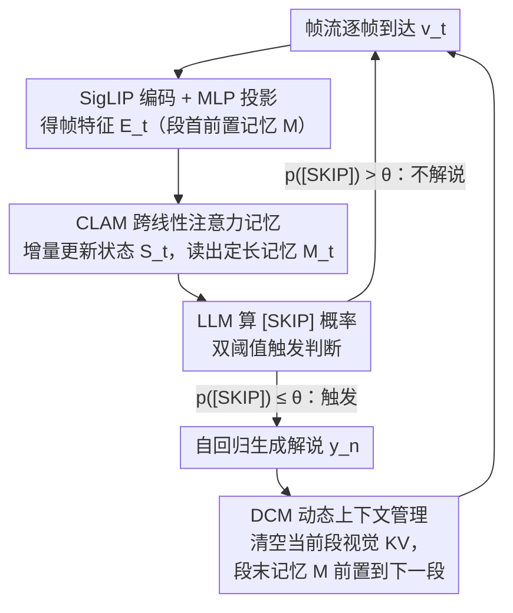

# FlowNar: Scalable Streaming Narration for Long-Form Videos

**会议**: ICML 2026  
**arXiv**: [2606.00620](https://arxiv.org/abs/2606.00620)  
**代码**: https://github.com/zeyun-zhong/FlowNar (有)  
**领域**: 视频理解 / 多模态VLM / 流式视频  
**关键词**: 流式视频解说, KV 缓存裁剪, 线性注意力, 长视频理解, 自条件评测

## 一句话总结
FlowNar 通过"段末清空视觉 KV 缓存 + 用门控线性注意力把历史视觉信息压成定长记忆 token"的组合，让流式视频解说模型在显存与计算上保持常数级开销，可处理 $10\times$ 更长的视频并取得 $3\times$ 吞吐，同时引入自条件评测协议揭示了基线方法在真实部署下被严重高估的现象。

## 研究背景与动机

**领域现状**：在线视频解说（streaming narration）需要 LMM 持续接收帧流、自主判断何时输出一句解说并生成内容。代表性工作 Videollm-online、Videollm-mod 已能做帧对齐解说。

**现有痛点**：这些方法把所有历史视觉帧的 KV 持续塞进 LLM 上下文，显存和算量都随视频长度至少线性增长——在 24GB GPU 上很快 OOM，FPS 随时间显著下降；同时已有评测都在 *teacher-forcing* 模式下用 GT 解说作为历史，掩盖了真实部署中"自己上一句错就一直错下去"的误差累积。

**核心矛盾**：长上下文带来的两难——保留全部视觉历史能提供信息，但导致复杂度爆炸且把噪声/错误历史也一起放大；裁掉历史能省显存，但远期视觉信息丢失，叙事不连贯。

**本文目标**：(1) 让流式解说的显存与每步计算复杂度对视频长度 $T$ 保持常数；(2) 同时保留远期视觉摘要避免性能塌陷；(3) 提供贴近部署的评测协议。

**切入角度**：观察到段间真正需要的不是"全部原始 KV"，而是"足以让下一段叙事连贯的视觉摘要"——可以在每段叙事生成后激进裁掉详细 KV，只把一个固定大小的记忆 token 块沿时间向前传。

**核心 idea**：用"动态上下文管理 (DCM) + 跨线性注意力记忆 (CLAM)"组合，把视觉历史的复杂度从 $O(T)$ 压到 $O(1)$，并用自条件协议把评估"真实化"。

## 方法详解

### 整体框架
输入是连续帧流 $\mathbf{V}=\{\mathbf{v}_t\}_{t=1}^{T}$，输出是带时间戳的解说序列 $\Psi=\{(t_n, y_n)\}_{n=1}^{N}$。流水线在每一帧 $t$ 都做：(1) SigLIP 编码 + MLP 投到语言空间得 $\mathbf{E}_t$；(2) CLAM 用当前帧的 token 增量更新一个 $D\times D$ 的循环状态 $\mathbf{S}_t$，再用 $M$ 个可学习查询从 $\mathbf{S}_t$ 读出定长记忆 $\mathbf{M}_t \in \mathbb{R}^{M\times D}$；(3) LLM 在视觉缓存 $\mathcal{C}_t^{\text{vid}}$、上一段解说缓存 $\mathcal{C}_{n-1}^{\text{nar}}$ 上算 `[SKIP]` 概率决定是否触发解说；(4) 触发时自回归生成 $y_n$，然后把当前段的详细视觉 KV 全部清空，把段末记忆 $\mathbf{M}_{t_n}$ 前置到下一段开头作为远期摘要。FlowNar-C 变体再额外只保留最近 $k$ 句解说的文本 KV，做到全维度常数复杂度。

### 关键设计

**1. 动态上下文管理 DCM + 双阈值触发：每段说完就清空视觉 KV，免得错误滚雪球**

自条件部署里，长上下文不只吃显存，更糟的是会把"上一句说错了"的错误反复送回 LLM 滚成雪球。DCM 的做法很激进：每生成一句解说就显式清空当前段的视觉 KV $\mathcal{C}_t^{\text{vid}} \leftarrow \emptyset$，连段首前置的 $\mathbf{M}_{t_{n-1}}$ 也丢掉，强迫模型只靠新算出的 $\mathbf{M}_{t_n}$ 当历史。节奏控制用两套阈值：默认按主阈值 $\theta$ 判 $p(\text{[SKIP]} \mid \mathbf{E}_t, \mathcal{C}_{t-1}^{\text{vid}}, \mathcal{C}_{n-1}^{\text{nar}}) \le \theta$ 是否触发，刚触发后短时间内切到更低的 $\theta_{\text{low}}=0.5$ 压低再次触发概率，避免爆发式连发。消融里"保留全部历史"反而最差（CIDEr 28.04 vs CLAM 35.64），印证激进裁剪在自条件下比留全历史更稳。

**2. CLAM 跨线性注意力记忆：用门控线性注意力把视觉历史压成定长记忆 token**

朴素 KV 缓存随帧数线性膨胀，但段间真正需要的不是全部原始 KV，而是一份"够让下一段叙事连贯"的视觉摘要。CLAM 维护一个 $D\times D$ 的循环状态 $\mathbf{S}_t$，对帧内每个 token $\mathbf{x}_{t,j}$ 算 key/value 和门控矩阵 $\mathbf{G}_{t,j}\in(0,1)$，按 $\mathbf{S}_{t,j} = \mathbf{G}_{t,j} \odot \mathbf{S}_{t,j-1} + \mathbf{k}_{t,j}^\top \mathbf{v}_{t,j}$ 递推；再用 $M$ 个可学习查询 $\mathbf{Z}$ 经线性投影成 $\mathbf{Q}$，读出定长记忆 $\mathbf{M}_t = \mathbf{Q}\mathbf{S}_t$。线性注意力的循环视角天然兼具"常数显存、常数每步算量、训练可并行"，又把"压缩"（帧内逐 token 递推）和"读取"（固定查询）解耦，避开了 MovieChat 式相似度合并或简单滑窗丢长程信息的毛病。消融里 CLAM 也远胜 last-$k$、K-Means、token merging、TokenMLP、RetNet 等替代记忆方案。

**3. 自条件评测协议 + 先对齐后评分：把被 teacher-forcing 掩盖的错误传播暴露出来**

以往评测都在 teacher-forcing 下用 GT 解说当历史，屏蔽了真实部署里"自己上一句错就一直错"的误差累积，把勉强能用的模型说得很厉害。自条件协议要求每句 $y_n$ 只能基于模型自己之前生成的 $\{y_j^{\text{pred}}\}$，不喂 GT。由于预测段和 GT 段在数量、边界上对不齐，先用 IoU $\tau=0.5$ 做段级匹配算 Precision/Recall/F1 衡量时间对齐，再用广义 IoU 给每个 GT 段检索最佳匹配预测段、在配对上算 CIDEr/METEOR/ROUGE-L 衡量解说质量。这套"先对齐后评分"既保住了时间维度的评测能力，又把真实部署的错误累积摆上台面——在 teacher-forcing 协议下 FlowNar 与基线差距明显收窄，反向坐实了此前 SOTA 数字部分来自"作弊式 GT 历史"。

### 损失函数 / 训练策略
端到端最小化标准的下一 token 交叉熵，同时对解说 token $y_n$ 与 `[SKIP]` 触发 token 联合监督。训练时用一种段级 attention mask（除标准 causal mask 外，额外把当前段对"远期段的原始帧 token"和"远期段的记忆 token"的注意力全部屏蔽），强迫模型只能依赖"前一段末的 $\mathbf{M}_{t_{n-1}}$ + 当前段帧 + 已生成解说"，与推理时段末清缓存的行为保持一致。为弥合训练（连续多段同序列）与推理（段末清缓存）的位置编码差异，推理时用一个独立的位置计数器模拟训练式 position id。代价：4×H100 上训 FlowNar-1B 用 67 GPU-hour，约为 Videollm-online 的 1.9×（一次性开销）。

## 实验关键数据

### 主实验
在 Ego4D / EgoExo4D / EpicKitchens100 三个长片段自我中心数据集上，自条件协议下与 Videollm-online、Videollm-mod 对比（Llama-3-1B 为底座）：

| 数据集 | 方法 | F1↑ | CIDEr↑ | Cache (M)↓ |
|--------|------|-----|--------|-----------|
| Ego4D | Videollm-online | 16.29 | 28.04 | 737.6 |
| Ego4D | FlowNar-C | 17.90 | 34.48 | **20.2** |
| Ego4D | **FlowNar** | **24.85** | **35.64** | 59.2 |
| EgoExo4D | Videollm-online | 31.77 | 69.88 | 878.5 |
| EgoExo4D | **FlowNar** | **32.99** | **75.33** | 125.9 |
| EK100 | Videollm-online | 12.98 | 29.00 | 1096.0 |
| EK100 | FlowNar-C | 25.20 | 37.28 | **22.7** |
| EK100 | **FlowNar** | **29.12** | **46.63** | 65.3 |

FlowNar-C 在 EK100 把 cache 从 1096M 压到 22.7M（约 $48\times$ 降），同时 CIDEr 反而从 29.00 升到 37.28。

### 消融实验
Ego4D 自条件下的视觉历史策略消融：

| 历史视觉策略 | DCM | CIDEr↑ | METEOR↑ | ROUGE↑ |
|------|-----|--------|---------|--------|
| 无历史帧 | ✓ | 30.40 | 11.36 | 30.54 |
| 仅最近帧 | ✓ | 30.16 | 11.42 | 30.59 |
| 保留全部帧 | ✗ | 28.04 | 11.33 | 29.86 |
| **CLAM** | ✓ | **35.64** | **12.14** | **31.64** |

### 关键发现
- **保留全部历史反而最差**（CIDEr 28.04）——印证自条件下"长上下文 = 长错误链"的判断；DCM 是必需而非可选。
- **CLAM 远胜 last-$k$、K-Means、MovieChat 式 token 合并、TokenMLP、重构 RetNet** 等替代记忆方案（Table 5），说明把"压缩为定长 token 块"的目标用门控线性注意力实现，比基于相似度合并或定窗都更适合流式解说。
- 双阈值触发把 F1 从静态的 16.78 拉到 24.85（Table 4），说明节奏控制和上下文管理同等重要。
- 在 teacher-forcing 协议（Table 2）下 FlowNar 与基线差距明显收窄，反向证明此前 SOTA 数字部分来自"作弊式 GT 历史"。

## 亮点与洞察
- **"少即是多"在长视频里被实证**：自条件下激进裁剪反而比保留全历史更准，因为错误传播的代价高于丢失信息的代价——这与 NLP 长上下文里"垃圾上下文反而拖累生成"的观察呼应，是流式生成里很可迁移的设计原则。
- **线性注意力的循环视角天然契合流式压缩任务**：把 $\mathbf{S}_t$ 解读为"内容寻址的关联记忆"、用可学习查询读出定长摘要，等于把 Transformer-RNN 改装成"压缩器 + 读出器"，避免了 token merging 类方法依赖相似度启发式的脆弱性。这套结构可以迁移到流式音频解说、实时驾驶场景理解、AR 场景叙事等任何需要常数显存的连续生成任务。
- **评测协议本身是核心贡献之一**：把 teacher-forcing 换成自条件 + 先对齐后评分，让"长视频解说"赛道的真实 SOTA 重新洗牌，是方法论级别的修正。

## 局限与展望
- 训练成本约为 Videollm-online 的 $1.9\times$，主要来自段级 mask 下未优化的注意力 kernel 与额外的记忆 token，作者承认这是工程瓶颈。
- 记忆容量论证基于"$D\times D$ 状态可存 $O(D)$ 个键值对"的理论结果，对于超长（小时级以上）视频是否仍够用，论文仅在三类自我中心数据集上验证，泛化到电影/监控等场景需要进一步实验。
- 触发器的 $\theta_{\text{low}}$、刷新周期等超参依赖每个数据集的段平均时长，迁移到不同节奏的视频源时需要重新校准。
- 当前评测都是英文解说，多语言流式生成下的错误传播模式可能不同。

## 相关工作与启发
- **vs Videollm-online**：同样做帧对齐解说，但本文显式裁剪视觉 KV 并加线性注意力摘要，把视觉上下文复杂度从 $O(T)$ 降到 $O(1)$，自条件 F1 在 Ego4D 上从 16.29 升到 24.85。
- **vs Videollm-mod**：Videollm-mod 用 routing 降中间视觉算量但缓存仍线性增长，本文在 cache 和 narration 质量上同时占优，且 routing 在自条件下被证明对错误历史更脆弱。
- **vs MovieChat / 在线 K-Means 聚合**：那些方法靠相似度合并 token，依赖手工启发式且仍然让记忆随时间增长；CLAM 用可学习门控做参数化压缩，定长且端到端可训。
- **vs 流式问答类工作（StreamForest 等）**：那条线接受外部 query 触发回答，本文是自主决定何时开口解说，任务设定不同但记忆管理思路可互相借鉴。

## 评分
- 新颖性: ⭐⭐⭐⭐ 把 DCM + 线性注意力压缩 + 自条件评测三件套打包成完整方案，单点都有先例但组合在流式解说上很有效。
- 实验充分度: ⭐⭐⭐⭐⭐ 三个长视频数据集、两个评测协议、视觉/文本记忆的多维消融、训练 vs 推理位置编码对齐都做了。
- 写作质量: ⭐⭐⭐⭐ 算法伪代码、动机叙事、图示都清晰，公式排版偶有 LaTeX 渲染脏字符但不影响理解。
- 价值: ⭐⭐⭐⭐⭐ 直接解决长视频流式解说的工程瓶颈，且自条件评测协议会重塑整个赛道的衡量标准。

<!-- RELATED:START -->

## 相关论文

- [\[CVPR 2026\] MSJoE: Jointly Evolving MLLM and Sampler for Efficient Long-Form Video Understanding](../../CVPR2026/multimodal_vlm/msjoe_jointly_evolving_mllm_and_sampler_for_efficient_long-form_video_understand.md)
- [\[CVPR 2026\] REVISOR: Beyond Textual Reflection, Towards Multimodal Introspective Reasoning in Long-Form Video Understanding](../../CVPR2026/multimodal_vlm/revisor_beyond_textual_reflection_towards_multimodal_introspective_reasoning_in_.md)
- [\[CVPR 2026\] Thinking With Videos: Multimodal Tool-Augmented Reinforcement Learning for Long Video Reasoning](../../CVPR2026/multimodal_vlm/thinking_with_videos_multimodal_tool-augmented_reinforcement_learning_for_long_v.md)
- [\[CVPR 2026\] VinQA: Visual Elements Interleaved Long-form Answer Generation for Real-World Multimodal Document QA](../../CVPR2026/multimodal_vlm/vinqa_visual_elements_interleaved_long-form_answer_generation_for_real-world_mul.md)
- [\[CVPR 2026\] AXG-Reasoner: Error Detection and Explanation in Long Task Videos with Vision-Language Models](../../CVPR2026/multimodal_vlm/axg-reasoner_error_detection_and_explanation_in_long_task_videos_with_vision-lan.md)

<!-- RELATED:END -->
