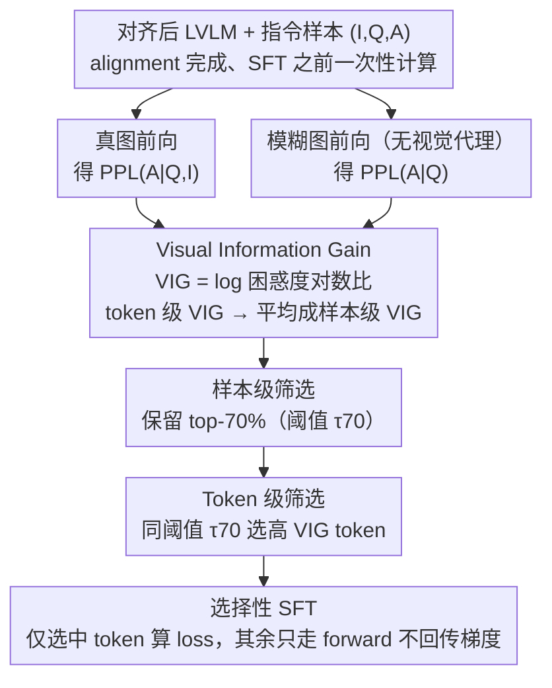

# Focusing Where Vision Matters: Selective Training for Large Vision Language Models via Visual Information Gain

**会议**: ICML 2026  
**arXiv**: [2602.17186](https://arxiv.org/abs/2602.17186)  
**代码**: 待确认  
**领域**: 多模态VLM  
**关键词**: 视觉信息增益、选择性训练、语言偏差、token 级损失掩码、数据高效指令微调

## 一句话总结
本文提出 **Visual Information Gain (VIG)**——一个基于"有图 vs 无图（用模糊图代替）"困惑度对数比的视觉依赖度指标，从样本和 token 两个粒度量化"这条数据/这个 token 到底用没用到图"，并据此做选择性指令微调：只在高 VIG 的样本和 token 上算 loss，让 LLaVA-1.5-13B 仅用 21% 的有效 token 就全面超过 vanilla 训练，并显著缓解语言偏差与幻觉。

## 研究背景与动机

**领域现状**：LVLM（LLaVA、ShareGPT4V、Qwen-VL 等）通过把视觉编码器、adapter、LLM 三件套联合调出来解决 VQA / captioning / 多模态推理；主流训练做法是把所有 instruction-tuning 数据等权重喂进去做 next-token SFT。

**现有痛点**：模型频繁出现"语言偏差"——即便看图，输出仍主要由文本先验主导，表现为视觉忽视（visual ignorance）和幻觉（描述不存在的物体）。已有缓解方案有三大类：(1) 推理时 contrastive decoding 比对有图/无图输出；(2) 改注意力机制强行加重图像 token 的权重；(3) 数据侧用更强模型生成更高质量指令数据。但它们都**没有量化"每个样本/每个 token 究竟从图里获得了多少信息"**。

**核心矛盾**：在一份典型 LVLM 指令微调数据里，既有"看图才能答"的样本（如颜色、空间关系），也有"光凭常识就能答"的样本；token 层面更甚——visually grounded 的实词（white、sitting、lying）和纯句法词（a、the、of）被同一 cross-entropy 同等对待。这种"无差别监督"等于让模型主动学会走"语言捷径"，因为预测句法词比预测视觉相关词容易得多。

**本文目标**：(1) 设计一个能在样本和 token 双粒度量化"视觉信息贡献"的指标；(2) 用它做选择性训练，丢掉低 VIG 样本、屏蔽低 VIG token；(3) 在更少监督下同时提升视觉理解和减少幻觉。

**切入角度**：信息论视角——如果图对预测真有帮助，那么"给图"应当降低模型对答案的不确定度（困惑度）；反之，如果给图前后困惑度不变（甚至变高），说明这条数据/这个 token 根本没用到图。

**核心 idea**：定义 $\mathrm{VIG} = \log\frac{\mathrm{PPL}(A|Q)}{\mathrm{PPL}(A|Q,I)}$，并把"无视觉"近似为"输入一张模糊图"，再用同一阈值 $\tau_p$ 同时在样本级和 token 级做选择。

## 方法详解

### 整体框架
方法分两步：**(1) 计算 VIG**——对每条多模态指令样本 $(I,Q,A)$ 用 pre-training 后的对齐 LVLM 跑两遍前向，一遍用真图、一遍用模糊图（模糊图作为"无视觉"代理），分别得到答案的 perplexity，取对数比即 sample-level $\mathrm{VIG}_i$；同时把它分解到 token 级 $\mathrm{VIG}_{i,t}$。**(2) 选择性微调**——按 $\mathrm{VIG}_i$ 排序保留 top-$p\%$ 样本（默认 $p=70$，阈值 $\tau_{70}$），在保留样本内部进一步只对满足 $\mathrm{VIG}_{i,t}\geq\tau_{70}$ 的 token 算 loss；其他 token 仍参与 forward 但不贡献梯度。

### 关键设计

**1. Visual Information Gain：用「有图减无图」的困惑度对数比量化视觉依赖度**

要做选择性训练，先得有把尺子量「这条数据/这个 token 到底用没用到图」。VIG 的出发点是信息论直觉——图若真有用，给图就该降低模型对答案的不确定度（困惑度）；给图前后困惑度不变甚至变高，就说明根本没用到图。于是定义 $\mathrm{VIG}=\log(\mathrm{PPL}(A|Q)/\mathrm{PPL}(A|Q,I))=\mathcal{L}(A|Q)-\mathcal{L}(A|Q,I)$，即去图条件下的交叉熵减带图条件下的交叉熵；在 one-hot 监督下可进一步化简为 $\mathrm{VIG}=D_{\text{KL}}(p_{A|Q}\|q_Q)-D_{\text{KL}}(p_{A|I,Q}\|q_{I,Q})$，即视觉输入对预测分布偏差的修正量。之所以选 PPL 的对数比而不是直接用 KL，是因为它能天然分解到 token 级 $\mathrm{VIG}_{i,t}=-\log q_\theta(a_t|a_{<t},Q)+\log q_\theta(a_t|a_{<t},Q,z_v)$、再平均回样本级 $\mathrm{VIG}_i=\frac{1}{T_i}\sum_t\mathrm{VIG}_{i,t}$，不需要额外定义什么「token 级 KL」。

**2. 样本级 + Token 级双粒度选择：共用一个阈值 $\tau_p$，把梯度预算花在真正要看图的位置**

一份指令数据里既有「看图才能答」的样本、也有「凭常识就能答」的样本；token 层面更甚——视觉实词（white、sitting、lying）和纯句法词（a、the、of）被同一个 cross-entropy 同等对待，等于变相鼓励模型走预测句法词的语言捷径。VIG 把数据切成「该学的、该看的」子集：先按 sample-level $\mathrm{VIG}_i$ 降序取 top-$p\%$ 得 $\mathcal{S}_p=\{i\mid\mathrm{VIG}_i\geq\tau_p\}$，再在每条保留样本内部用**同一阈值** $\tau_p$ 挑 token $\mathcal{T}_i^+=\{t\mid\mathrm{VIG}_{i,t}\geq\tau_p\}$，只对这些 token 算 loss，没选中的 token 仍传入模型保 context 完整、只是把梯度 mask 掉。刻意共用一个 $\tau_p$ 是为了不引新超参；默认 $p=70$ 是 ablation 出来的甜区——太低（$p=30$）数据太少欠拟合，太高（$p=90$）又退回 vanilla。这个嵌套筛选在几何上等价于「在 (sample, token) 二维网格里抠出右上角的高 VIG 子区域」，刚好对上实证：white/lying/sitting 这类视觉实词的 loss diff 普遍在 3–6，而 of/the/a 接近 0 甚至为负。

**3. 模糊图作「无视觉」代理 + 在 alignment 后算 VIG：让度量本身可信且一次算全程复用**

VIG 需要一个「没有视觉输入」的条件分布 $q_Q$，但 LVLM 架构强制要喂视觉、不能直接传 None。本文的取巧是把输入图 $I$ 换成它的高斯模糊版本喂进同一个 LVLM 得到 $\mathrm{PPL}(A|Q)$——用模糊图而非全黑图或零向量，是为了保留视觉编码器正常的 forward pipeline，避免分布外输入把 perplexity 异常拉爆，同时只剥离视觉信号、文本侧 token 流原封不动。计算时机也有讲究：统一选在 pre-training（adapter alignment）结束之后、instruction tuning 之前——此时视觉特征空间已初步对齐到语言空间，但模型还没在指令数据上过拟合，因此 VIG 既能反映「图是否有用」又不被下游任务噪声污染，相当于一个「先验筛选器」而非「事后诊断器」，一次算好、全程复用。

### 损失函数 / 训练策略
LLaVA-1.5 7B/13B 与 ShareGPT4V 7B 用 558K（或 1.2M）image-caption 对做 alignment，再在 ~665K 指令数据上做 SFT；Open-Qwen2VL 2B 在 1M MAmmoTH-VL 子集上微调。所有实验固定 $p=70$，仅对多模态样本算 VIG，纯文本样本原样保留；其余超参与各 vanilla baseline 一致，只是 loss mask 不同。

## 实验关键数据

### 主实验
四个 LVLM × 两类 benchmark（视觉理解 + 幻觉），节选两个最具代表性的对比：

| 模型 | # Active Tokens | LLaVA-W ↑ | MMVet ↑ | CV-Bench ↑ | POPE F1 ↑ | CHAIR $C_S$ ↓ | MMHal Hall. ↓ |
|------|-----------------|-----------|---------|------------|-----------|---------------|----------------|
| LLaVA-1.5 7B (vanilla) | 58.61M (100%) | 59.02 | 28.62 | 59.18 | 87.08 | 52.93 | 71.25 |
| LLaVA-1.5 7B + VIG | 38.45M (-34%) | **61.22** | **32.71** | **62.48** | **87.47** | **47.00** | **62.78** |
| LLaVA-1.5 13B (vanilla) | 58.61M (100%) | 72.01 | 36.19 | 60.16 | 87.05 | 51.96 | 67.09 |
| LLaVA-1.5 13B + VIG | 12.14M (**-79%**) | **73.45** | **36.87** | **62.89** | **87.53** | **48.19** | **63.11** |

13B 上仅用 **21%** 的有效 token 就在 8/8 报告 metric 上全面超过 vanilla；7B 上更是把 MMVet 提了 4.1 个点、CHAIR $C_S$ 幻觉率从 52.93 降到 47.00。

### 消融实验

| 配置 | 含义 | 关键观察 |
|------|------|---------|
| Full data, full token (vanilla) | 不选样本不选 token | baseline |
| Top-70% sample, full token | 只样本级筛选 | 提升大部分指标，但幻觉缓解有限 |
| Full data, token mask | 只 token 级筛选 | 视觉理解略升，token 浪费多 |
| Top-70% sample + token mask（默认） | 双粒度，共享 $\tau_{70}$ | 同时拿到数据效率 + 幻觉缓解最大收益 |
| 阈值 $p$=30/50/70/90 | 选择比例敏感性 | $p=70$ 为最佳折中，过低欠拟合，过高退化为 vanilla |

### 关键发现
- **token 级筛选才是幻觉抑制的真正源头**：单做样本筛选主要让训练更高效但幻觉指标改善有限；token mask 把 "the/of/a" 这类纯句法 token（loss diff 接近 0）从 loss 中扣掉，强迫梯度集中到"white/lying/sitting"这类视觉关键词，模型才学会"该看图时真去看"。
- **VIG 与 benchmark 模态依赖度强一致**：COCO/CV-Bench/POPE 的 VIG 分布偏正，对应视觉重的任务；GQA/SQA 偏负，对应文本重的任务——这意味着 VIG 也能当作 benchmark 的"视觉依赖度温度计"。
- **VIG 对图像内容敏感**：固定 Q-A，变图——完全对的图 VIG=0.923，部分对（属性错）VIG=0.409，矛盾图 VIG=-0.520。这说明 VIG 不仅区分"视觉相关/不相关"，还能区分"视觉对/错"。
- **规模越大，节省越多**：13B 上 active token 从 58.61M 降到 12.14M（-79%）仍全面更好；说明大模型对"高质量稀疏监督"更敏感，VIG 类方法在 scaling 上有正反馈。

## 亮点与洞察
- **用模糊图做"反事实视觉输入"是一个极轻量的好把戏**：它绕开了"LVLM 不接受 None 视觉输入"的工程难题，又保留了视觉 pipeline 的正常前向，使得 VIG 这种"有图减无图"的对比度量可以在任何现成 LVLM 上即插即用，不改架构、不改 loss 形式。
- **共享阈值 $\tau_p$ 既省超参又自带几何对齐**：样本级和 token 级共用同一个阈值，意味着"被保留的样本里只有真正高视觉密度的 token 进 loss"，这种"嵌套筛选"几何上等价于"在 (sample, token) 二维网格里抠出右上角高 VIG 子区域"，简单而优雅。
- **VIG 作为通用"视觉重要性"分数有多种衍生用法**：除了 selective training，还可以用来对 benchmark 做模态依赖度归一化、对 hallucination 数据做主动挖掘、对多模态 RLHF 做 reward shaping；它本质上是一种"模态归因"指标，比 attention map 更直接、比 contrastive decoding 更便宜。

## 局限与展望
- VIG 的"无视觉"代理强依赖模糊图的具体配置（核大小、blur 强度），论文未系统比较不同 blur 设置；如果模糊后仍残留低频颜色/形状线索，会低估真实 VIG。
- VIG 是在 alignment 后、SFT 前一次性计算的静态分数，没有跟随训练动态更新——后期模型已经学到的能力可能让原本高 VIG 的样本失去价值，这部分潜力未被挖掘。
- 阈值 $p=70$ 对所有模型固定，未做模型尺寸/数据规模自适应；2B 与 13B 共用同一比例显然次优。
- 当前实验局限在 LLaVA 系 + ShareGPT4V + Open-Qwen2VL 的 SFT 阶段，未在 RLHF/DPO/RLVR 上验证 VIG 作为 reward shaping 的潜力；也未在视频、3D、语音等其他模态上做迁移。

## 相关工作与启发
- **vs Contrastive Decoding (Leng et al. 2024)**：那类方法在推理时比对"有图 vs 无图"输出，每次推理都要跑两遍；本文把同一思想搬到训练时只算一次，把比较结果固化为 VIG 分数指导数据选择，推理零开销。
- **vs Selective Modeling for LLM (Lin et al. 2024)**：LLM 端的 selective training 用 reference loss 做 token 选择；本文把"reference"换成"无视觉对照"，把方法迁移到多模态领域并增加样本级维度，成为针对 LVLM 的天然扩展。
- **vs 数据质量过滤（如 LLaVA-OneVision 的高质量数据策略）**：那类方法靠更强模型重新生成数据，成本高、易引入新偏差；VIG 只需要一次模型自身前向，零成本且模型无关，可与高质量数据策略叠加使用。

## 评分
- 新颖性: ⭐⭐⭐⭐ 把"perplexity 差"作为视觉信息量度，并落到 token 级选择，思路简单但首次完整建立。
- 实验充分度: ⭐⭐⭐⭐ 四个 LVLM × 8 个 benchmark + 视觉理解和幻觉双轴 + 消融阈值；但缺少 RLHF 场景验证。
- 写作质量: ⭐⭐⭐⭐⭐ 公式推导（PPL→KL→token 分解）干净利落，可视化（图 1/2/3/4 + 表 2）非常有说服力。
- 价值: ⭐⭐⭐⭐ 给所有 LVLM 训练 pipeline 提供一个"零架构改动、即插即用"的数据效率工具，13B 上 4–5× 加速 + 提点是真金白银。

<!-- RELATED:START -->

## 相关论文

- [\[ICML 2026\] VEENA: Interpreting and Enhancing Emotional Circuits in Large Vision-Language Models via Cross-Modal Information Flow](interpreting_and_enhancing_emotional_circuits_in_large_vision-language_models_vi.md)
- [\[ICML 2026\] On the Adversarial Robustness of Large Vision-Language Models under Visual Token Compression](on_the_adversarial_robustness_of_large_vision-language_models_under_visual_token.md)
- [\[ICML 2026\] Large Vision-Language Models Get Lost in Attention](large_vision-language_models_get_lost_in_attention.md)
- [\[ICML 2026\] Jailbreaking Vision-Language Models Through the Visual Modality](jailbreaking_vision-language_models_through_the_visual_modality.md)
- [\[ICML 2026\] From Seeing to Thinking: Decoupling Perception and Reasoning Improves Post-Training of Vision-Language Models](from_seeing_to_thinking_decoupling_perception_and_reasoning_improves_post-traini.md)

<!-- RELATED:END -->
