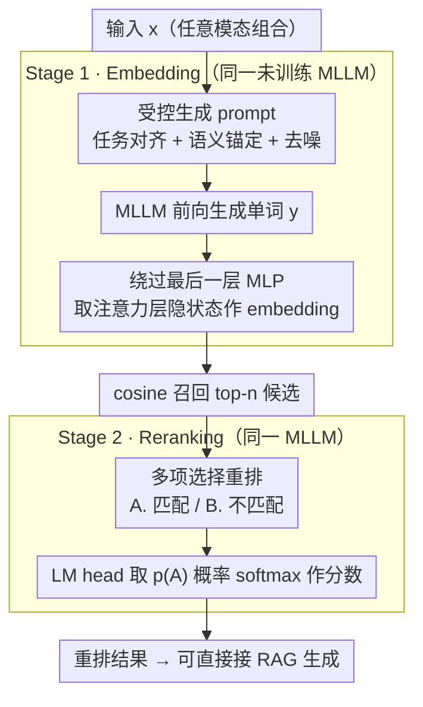

# FreeRet: MLLMs as Training-Free Retrievers

**会议**: ICML 2026  
**arXiv**: [2509.24621](https://arxiv.org/abs/2509.24621)  
**代码**: 无  
**领域**: 多模态 VLM / 多模态检索  
**关键词**: 训练-free 检索、MLLM embedding、词汇化压力、LLM framing effect、两阶段检索

## 一句话总结
FreeRet 提出一个完全不训练的两阶段多模态检索框架：第一阶段绕过 MLLM 最后一层 MLP 并配合受控生成 prompt 抽取语义忠实的 embedding 做候选检索，第二阶段把 reranking 改成多项选择题来规避 LLM 的 framing 偏置；在 MMEB 上比训练了千万级配对数据的检索模型还要强。

## 研究背景与动机
**领域现状**：CLIP 类双塔在多模态检索里是主流，但面对长查询、组合语义、交错模态时明显吃力。最近一批工作把 MLLM 当通用编码器，再用对比学习/RL/数据扩量做后训练。

**现有痛点**：训练路线两个死穴——一是每换一个 backbone 或模态组合都要花费大量配对数据重新对比微调，二是泛化脆弱（在 MMEB 上 SOTA 的模型转到 MIEB 经常掉点很严重）。已有 training-free 方法（E5-V、PromptEOL）则只关心 embedding，没有 reranking，性能远不如训练版。

**核心矛盾**：MLLM 本身已经具备很强的多模态语义和推理能力，但它的最后一层 MLP 是为「下一个 token 预测」而生的——这层「lexicalization pressure」把语义向量硬拽到词表方向，反而毁掉了 retrieval 需要的细粒度语义。reranking 这边则有另一个隐形偏置：选择「Yes/No」「True/False」「Right/Wrong」哪一对标签会让相同含义的判断出现 5–8% 的精度差。

**本文目标**：不动任何权重，用同一个 MLLM 同时承担 embed + rerank；并且把上述两个偏置具体说清并给出对应的缓解方案。

**切入角度**：把 MLLM 当生成器看待——既然它的中间层比最后一层更接近语义，那就跳过最后一层 MLP；既然 reranking 的二选一存在词汇偏置，那就把它写成 MCQ 让模型按「选 A/B」的方式选答案。

**核心 idea**：embedding 阶段用「中间层隐状态 + 任务/语义/去噪三类控制 prompt」生成；reranking 阶段把判别改成多项选择，从 LM head 上读取选项 A 的概率作为分数。

## 方法详解

### 整体框架
FreeRet 把检索拆成两阶段，全部由同一个未训练 MLLM 承担。**Stage 1 Embedding**：输入 $x$（任意模态组合）后，拼接一段控制 prompt，让模型生成单词 $y$；不取最后一层 MLP 输出，而是改取最后一层 attention 后、最后一层 MLP 前的隐状态 $h_L^{\text{Attn}}(y)$ 作为 embedding $e(x)$，候选库用 cosine 召回 top-$n$。**Stage 2 Reranking**：把 query 与每个候选包成一段 MCQ prompt（「A. 匹配 / B. 不匹配」），从 LM head 取 $p(\text{`A'})$ 然后 softmax 作为相关性分数。整个 pipeline 没有任何额外参数、不依赖辅助模型，也可以无缝放入 RAG 流程实现「单模型完成 retrieve + rerank + generate」。

### 关键设计

**1. 绕过最后一层 MLP 缓解词汇化压力（§3.2）：把 embedding 抽取点前移一层**

MLLM 的最后一层 MLP 是为 next-token 预测服务的，它会把语义向量硬拽向词表方向（lexicalization pressure），恰好毁掉 retrieval 需要的细粒度语义。作者用 Qwen2.5-VL（3B/7B/32B）做 probing 把这件事坐实：定义 $\alpha_\ell^{\text{Attn}}=\cos(h^{\text{MLP}}_{\ell-1},h^{\text{Attn}}_{\ell})$、$\beta_\ell^{\text{MLP}}=\cos(h^{\text{MLP}}_{\ell},\mathbf{w}_{y^*})$ 等指标，发现 $\alpha$ 在最后一个 MLP 之后骤降到 <0.3、$\beta$ 同处跃升到约 0.5，250 对同义词的层间余弦也在这一层从 ~94% 掉到 ~87%——说明 lexicalization 几乎全集中在最后一层 MLP。于是直接取 attention 之后、MLP 之前的隐状态 $h_L^{\text{Attn}}$ 作为 embedding，这层一跳就在 3B / 7B 上分别带来 5.33% / 5.71% 的稳定增益，是后续所有改进的地基。

**2. 受控生成 prompt 注入三类先验（§3.3）：让"总结成一个词"语义聚焦**

E5-V 那种"Summary above content in one word"的自由概括经常吐出"Self""Searching"这类语义漂移词或纯功能词，把 embedding 空间稀释掉。这里改成带三类约束的受控生成，依次叠加：（i）Task alignment——"You are required to assess if &lt;A&gt; is related to &lt;B&gt;"，用任务先验让 query 与 target 的总结词系统性对齐、天然更容易 cosine 接近；（ii）Semantic grounding——"Capture the semantics of &lt;X&gt;"；（iii）Noise suppression——"Do not use function words, prepositions, or symbols"。Tab. 3b 显示三步在 3B 上分别加 4.29、1.49、2.47 个百分点，7B 上分别加 5.07、0.9、2.17，而整个改动只动 prompt、不碰任何权重。

**3. 多项选择重排化解 LLM framing effect（§3.4）：用 MCQ 抹掉标签词本身的偏置**

reranking 看似只是问一个二值问题，但"问法"本身就是混杂变量：作者发现"Right/Wrong""Yes/No""True/False"逻辑等价，但在同一基准上精度差最多 5%，且 context-free 下输出 logits 明显偏斜、偏斜越大下游精度越低（即 Zhao 等 2021 所述的 LLM bias，作者称 LLM framing effect）。缓解办法是把 reranking 写成 MCQ——"A. 匹配，B. 不匹配"，从 LM head 取 $p(\text{`A'})$ 做 softmax 当相关性分数。MCQ 既中和了标签的语义/感情色彩偏置，又利用了 LLM 预训练数据里大量"A/B 题型"的分布，比直接 yes/no 高 8.4%，同样无需任何训练。

### 损失函数 / 训练策略
完全无需训练。所有改动只涉及（i）抽取位置、（ii）prompt 模板、（iii）reranking 输出格式。也不存在新参数，因而具备「换 MLLM 即插即用」的模型无关特性，包括 Qwen2-VL、Qwen2.5-VL、Qwen2.5-Omni、InternVL3、LLaVA-OV 系列等。

## 实验关键数据

### 主实验（MMEB，36 数据集平均 Precision@1）

| 方法 | Backbone | 训练数据 (M) | 平均 |
|------|----------|--------------|------|
| MMRet（embed-only） | LLaVA-1.6-7B | 26.2 | 44.0 |
| GME（embed-only） | Qwen2-VL-7B | 8.0 | 56.0 |
| LamRA-Ret | Qwen2.5-VL-7B | 1.4 | 52.4 |
| E5-V（train-free 复现） | Qwen2.5-VL-7B | – | 39.8 |
| **FreeRet-embed** | Qwen2.5-VL-7B | – | **53.7** |
| MM-Embed (top-10 rerank) | LLaVA-Next-7B | 1.1+0 | 54.9 |
| LamRA (top-10 rerank) | Qwen2.5-VL-7B | 1.4+1.1 | 55.0 |
| **FreeRet (top-10)** | Qwen2.5-VL-7B | – | **67.8** |
| **FreeRet (top-50)** | Qwen2.5-VL-7B | – | **70.7** |

### MMEB-V2 视频子集（none 训过视频检索）

| 方法 | Backbone | 训练数据 (M) | Video Cls | Video Ret |
|------|----------|--------------|-----------|-----------|
| VLM2Vec-V2 | Qwen2-VL-2B | 1.7 | 39.3 | 28.8 |
| GME | Qwen2-VL-7B | 8.0 | 37.4 | 28.4 |
| **FreeRet-embed** | Qwen2-VL-2B | – | 47.7 | 31.7 |
| **FreeRet** | Qwen2-VL-7B | – | **63.2** | **39.3** |

### 消融实验（Tab. 3）

| 设置 | 3B | 7B | 说明 |
|------|----|----|------|
| 取 $h^{\text{MLP}}_L$（baseline） | 45.34 | 47.97 | E5-V 同款抽取 |
| 取 $h^{\text{Attn}}_L$（FreeRet） | 50.67 | 53.68 | 仅跳一层 MLP |
| 取 $h^{\text{MLP}}_{L-2}$ | 50.64 | 48.78 | 跳两层 transformer 反而掉 |
| Yes/No reranking | 58.39 | 65.28 | framing 偏置基线 |
| True/False | 60.06 | 66.71 | 偏置稍轻 |
| **MCQ reranking** | **60.31** | **70.72** | 消除 framing effect |

### 关键发现
- 最后一层 MLP 是性能瓶颈，但再多跳一两层会把保留语义的中间层也牺牲掉，所以「精确跳一层」最稳。模型层数越浅这一效应越明显。
- prompt 的三种控制中「semantic grounding」单项收益最高（~5pt），说明 MLLM 默认会输出泛化但跟原始输入语义偏离的总结词，这是 embedding 的最大噪声源。
- 「Yes/No vs MCQ」差 8% 几乎全部来自标签本身的预训练分布偏置，与逻辑无关——这是个被严重低估的细节，对所有用 LLM 做 judge 或 rerank 的工作都有警示意义。
- 视频任务上 FreeRet-2B 都能干掉用 1.7M 视频对训练的 VLM2Vec-V2，说明「未训练 MLLM」其实已经把跨模态信息编码得相当好，关键是怎么把它读出来。

## 亮点与洞察
- 把「embedding 阶段抽哪里 + 怎么 prompt」「reranking 怎么写题」这两件事讲透并量化收益，是一份系统性的 training-free 检索说明书；很多 RAG 工作的隐性步骤被显式化。
- 用 cosine 与 LM-head 投影同时刻画「词汇化压力」是非常清晰的 mechanistic 分析，可作为 LLM 表征研究的通用工具。
- 把「LLM framing effect」迁移到所有 LLM-as-judge 类研究有直接价值：reranker、自动评测、reward model 都可以参考 MCQ 化的设计来去偏。
- 由于完全不动权重，FreeRet 天然保留了 MLLM 的对话/指令跟随/推理能力，可以把检索、重排和生成全部塞到同一个模型里运行，对极简 RAG 实现非常友好。

## 局限与展望
- 第二阶段对每个 query–候选都要跑一次 MLLM 前向，候选越多越慢；论文用 top-5/10/50 限制候选数，但在大规模真实检索场景中延迟可能仍是瓶颈。
- 全部依赖「未训练的 MLLM 本身就足够强」的假设；对小模型或专门垂直领域（医学、代码），这种 free-lunch 不一定成立，论文未给小模型上的下限分析。
- MCQ 模板和 prompt 控制都是手工设计的，未在「prompt 自动搜索」「per-task prompt tuning」维度上做系统化研究；其稳定性依赖 prompt 质量，对 prompt sensitivity 的探究还不充分。

## 相关工作与启发
- **vs E5-V**：E5-V 直接取最后一层 hidden 做 embedding，没考虑 lexicalization；FreeRet 跳层 + 控制 prompt 让相同 backbone 在 MMEB 上提高 13.9pt。
- **vs 训练版 MM-Embed / LamRA / GME**：那些方法需要 1M~26M 多模态对训练；FreeRet 不训也能打到甚至超过它们，揭示了 training-free 路径被严重低估。
- **vs PromptEOL / MetaEOL / Echo-Embedding**：这些 text-only training-free 方法只涉及 embedding；FreeRet 把它们的精神扩展到多模态并补上 reranking 这一关键阶段，思路上是一种系统化继承。
- **vs Zhao et al. (2021) framing bias**：FreeRet 把 LLM 校准研究的成果直接搬进检索场景，用 MCQ 形式来「形式化去偏」，给后续 LLM-as-judge 工作提供了一个轻量解决方案。

## 评分
- 新颖性: ⭐⭐⭐⭐ 系统化的 training-free 多模态检索，并把 lexicalization 与 framing effect 两个新机理点讲清。
- 实验充分度: ⭐⭐⭐⭐ 覆盖 MMEB 36 数据集 + MMEB-V2 视频，并跨多家 MLLM 家族；缺少效率/延迟对比。
- 写作质量: ⭐⭐⭐⭐ 概念清晰，三步法叙事干净，probing 与 ablation 配合到位。
- 价值: ⭐⭐⭐⭐ 对 RAG、多模态检索社区有直接落地价值，并对 LLM judge 类研究有方法论启发。

<!-- RELATED:START -->

## 相关论文

- [\[ICCV 2025\] Training-Free Personalization via Retrieval and Reasoning on Fingerprints](../../ICCV2025/multimodal_vlm/training-free_personalization_via_retrieval_and_reasoning_on_fingerprints.md)
- [\[ICML 2026\] Med-Scout: Curing MLLMs' Geometric Blindness in Medical Perception via Geometry-Aware RL Post-Training](med-scout_curing_mllms_geometric_blindness_in_medical_perception_via_geometry-aw.md)
- [\[CVPR 2026\] PAS: A Training-Free Stabilizer for Temporal Encoding in Video LLMs](../../CVPR2026/multimodal_vlm/pas_a_training-free_stabilizer_for_temporal_encoding_in_video_llms.md)
- [\[NeurIPS 2025\] Training-free Online Video Step Grounding](../../NeurIPS2025/multimodal_vlm/training-free_online_video_step_grounding.md)
- [\[AAAI 2026\] Filter, Correlate, Compress: Training-Free Token Reduction for MLLM Acceleration](../../AAAI2026/multimodal_vlm/filter_correlate_compress_training-free_token_reduction_for_.md)

<!-- RELATED:END -->
