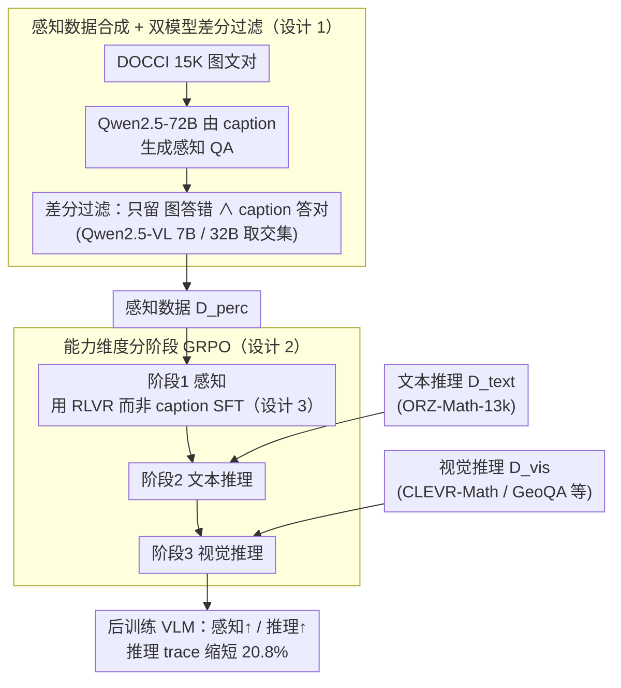

# From Seeing to Thinking: Decoupling Perception and Reasoning Improves Post-Training of Vision-Language Models

**会议**: ICML 2026  
**arXiv**: [2605.20177](https://arxiv.org/abs/2605.20177)  
**代码**: https://ucsc-vlaa.github.io/VLM-CapCurriculum/ (项目主页)  
**领域**: 多模态VLM  
**关键词**: 视觉感知、分阶段后训练、能力维度课程、RLVR、视觉数学推理

## 一句话总结
本文指出当前 VLM 后训练过度强调"长链推理"而忽视感知瓶颈，把后训练显式拆成"视觉感知 → 文本推理 → 视觉推理"三个独立阶段，并用 RLVR（而非 caption SFT）单独打磨感知，使 Qwen3-VL-8B 在视觉数学和感知 benchmark 上分别相对基线提升约 +5.9% 和 +1.2%，同时把推理 trace 缩短 20.8%。

## 研究背景与动机

**领域现状**：DeepSeek-R1 之后，VLM 后训练的主流套路是"加长链 CoT + RLVR"，把视觉问答、几何、图表理解、视觉数学等任务全部混在一个 stage 里联合优化（例如 LLaVA-CoT、VLAA-Thinker 的 Mixed Reward），希望模型靠"想更久"来提升准确率。

**现有痛点**：作者用 Claude-Haiku-4.5 对 Qwen3-VL-8B 在三个视觉数学数据集上的错例做归因分析，发现 **86.9% 的错答源自第一步看图错误**，而非后续推理失误。一旦感知出错，再长的链式思考也只会顺着错误前提"自圆其说"，甚至反复回看图片仍然给出同一个错误读数。

**核心矛盾**：merged training（把感知数据和推理数据混在一起喂）默认所有能力都可以被同一份 reward 一起优化，但视觉感知是一个比"推理"更底层的能力，它需要专门的目标和数据；如果先猛练推理，模型会形成"长链 + 自我说服"的行为模式，但视觉特征并没有被拉对齐，反而出现 reasoning-only 训练后 MMStar 掉点 1.6% 的"感知税"现象。

**本文目标**：(1) 证明感知必须用专门数据单独训练；(2) 找到合适的阶段顺序；(3) 比较 caption-SFT 和 RLVR 哪一种更适合学感知；(4) 把"按能力维度分阶段"和传统"按难度递增的课程学习"统一进同一个框架。

**切入角度**：把后训练视为对三种能力的依次塑形——视觉感知、文本推理、视觉推理。如果感知是后续推理的"脚手架"，那么它应当被先稳固下来，再做视觉推理；反之，先学推理会污染后续感知的学习信号。

**核心 idea**：用一条"能力维度的课程"（capability-dimension curriculum）$\mathcal{D}_{\text{perc}} \rightarrow \mathcal{D}_{\text{text}} \rightarrow \mathcal{D}_{\text{vis}}$ 来组织后训练，并且在感知 stage 用 RLVR 而非 caption SFT。

## 方法详解

### 整体框架
方法分为两大块：**(1) 感知数据合成**——把 DOCCI 的 15K 图文对反向生成"看图才能答"的 QA，并用两次"图 vs caption"对比过滤出真正考感知的样本；**(2) 分阶段 GRPO 训练**——把三类数据按 $\mathcal{D}_{\text{perc}} \rightarrow \mathcal{D}_{\text{text}} \rightarrow \mathcal{D}_{\text{vis}}$ 的顺序依次跑相同 epoch，每个 stage 用同一套 GRPO 超参，视觉编码器全程开启。输出是一个在视觉数学和感知 benchmark 同时变强、且推理 trace 更短的 VLM。

### 关键设计

**1. 感知数据合成 + 双模型差分过滤：造出"必须看图才能答"的 QA，堵住语言先验偷答**

要单独训感知，先得有一批信号纯净、不能靠语言猜的感知题。作者先用 Qwen2.5-72B 在 DOCCI 的 fine-grained caption 上生成 perception-focused 问答对 $(Q,A)=f_{\text{gen}}(C)$，然后对每个候选样本同时跑两条路径——只给图的 $\hat{A}_{\text{img}}=f_\theta(I,Q)$ 和只给 caption 的 $\hat{A}_{\text{cap}}=f_\theta(C,Q)$，只保留满足 $\mathbb{I}[\hat{A}_{\text{img}}\neq A]\land\mathbb{I}[\hat{A}_{\text{cap}}=A]$ 的样本，最后再用 Qwen2.5-VL-7B 和 32B 两个 base 各过滤一遍取交集。这套"逆向工程"很巧妙：如果样本能凭 caption 答出，那它考的其实是语言而非视觉；只有"caption 能答、图自己答不出"的样本才真正暴露了感知缺陷，正好对应作者发现的 86.9% 错例类型——不需要人工标哪些题"考感知"，而是让模型自己把感知盲点暴露出来。

**2. 能力维度的分阶段 GRPO：让模型先建立"看清"的能力，再叠加"推理"**

merged training 默认所有能力能被同一份 reward 一起优化，但视觉感知比推理更底层、需要专门目标，先猛练推理只会让模型形成"长链 + 自我说服"而视觉特征没对齐。作者用同一套 GRPO 损失

$$\mathcal{J}_{\text{GRPO}}(\theta)=\mathbb{E}_{x,y}\Big[\tfrac{1}{G}\sum_i \min(\rho_i A_i, \text{clip}(\rho_i,1-\epsilon,1+\epsilon)A_i)\Big] - \beta\, \text{KL}(\pi_\theta\|\pi_{\text{ref}}),$$

按 $\mathcal{D}_{\text{perc}} \rightarrow \mathcal{D}_{\text{text}} \rightarrow \mathcal{D}_{\text{vis}}$ 的顺序依次训练。奖励 $R(x,y_i)=r_{\text{acc}}+r_{\text{format}}$ 在所有 stage 一致，group 内标准化得优势 $A_i=(R-\mu_R)/(\sigma_R+\epsilon)$；三阶段 step 数按相同 epoch 折算为 90 / 375 / 465，与 merged baseline 总步数 930 严格对齐保证对比公平；视觉编码器在每个 stage 都开着训练，避免感知 stage 修好的视觉表征在后续被冻结而漂移。它的关键贡献是把"能力维度课程"明确为一个**正交于传统难度课程**的新维度——传统课程按 easy→hard 排数据，本方法按 perception→reasoning 排能力，且 4.5 节验证两者可叠加，组合后比 merged 高 +4.43%。

**3. 感知阶段用 RLVR 而非 caption-based SFT：别让低质字幕污染感知信号**

传统做法是把图片对应的整段 caption 当 target 做 next-token SFT，但 caption 质量往往低于预训练语料，会在 token 级强行注入 off-policy 监督、反噬已有能力。作者注意到感知 QA 的答案天然是短答案（颜色、空间关系、属性），可以直接用 exact match 当 $r_{\text{acc}}$、与 GRPO 的 on-policy 采样无缝衔接，让模型始终停在自己策略附近、把感知当成奖励驱动的微调。对照实验印证了这个选择的重要性：把感知 stage 的 RL 换成 SFT 后，Qwen2.5-VL-7B 在 WeMath 上掉 8.1%、Qwen3-VL-8B 掉 1.6%——SFT 会反噬，RLVR 则在提升感知的同时不破坏推理。

### 损失函数 / 训练策略
GRPO group size $G=5$，max response length 2048，三阶段 step 数严格按相同 epoch 设为 90 / 375 / 465，merged baseline 930 步；merged 时按惯例冻结视觉编码器，staged 时全程打开。所有实验跑在 8×H200，框架用 EasyR1，judge 模型为 Claude-Haiku-4.5。

## 实验关键数据

### 主实验

以 Qwen3-VL-8B 为骨干，与同体量 reasoning-VLM 对比（Acc %，挑代表性 benchmark）：

| 模型 | MathVista | WeMath | RWQA | MMStar | Overall AVG |
|------|-----------|--------|------|--------|-------------|
| Qwen3-VL-8B (Base) | 72.40 | 50.86 | 70.85 | 70.00 | 62.19 |
| OneThinker-8B | 75.10 | 54.57 | 71.50 | 70.20 | 64.87 |
| **Qwen3-VL-8B (Staged, 本文)** | **75.90** | **56.10** | **74.51** | **73.07** | **65.77** |

相对 base：WeMath +5.24、RWQA +3.66、MMStar +3.07；相对最强 baseline OneThinker：WeMath +1.53、RWQA +3.01、MMStar +2.87、Overall +0.90。

### 消融实验：训练范式 + 阶段顺序

| 配置 (Qwen3-VL-8B) | Vis Math AVG | Perception AVG | Overall | 备注 |
|--------------------|--------------|----------------|---------|------|
| Base | 45.17 | 79.21 | 62.19 | 未做后训练 |
| Merged（一锅炖） | 49.64 | 79.71 | 64.67 | 标准 baseline |
| Staged 1→2→3（感知→文本→视觉推理） | **51.10** | **80.44** | **65.77** | 默认 |
| Stage order 3→2→1（推理→文本→感知，倒序）| 37.70 (7B) | 74.17 (7B) | 55.93 (7B) | 7B 数据：相对正序掉 4.6 个点 |
| 感知 stage 换成 caption SFT | -1.6 on WeMath | — | — | 8B；7B 上掉 8.1% |

### 关键发现
- **感知错误是真正瓶颈**：错例归因显示 Qwen3-VL-8B 错答中 86.9% 因感知失误。直接做 reasoning-only 后训练会触发"感知税"——Qwen2.5-VL-7B 上 MMStar 掉 1.6%，加入感知数据后 RWQA 反升 3.0%。
- **阶段顺序至关重要**：把感知放到最后（3→2→1）会让 Qwen2.5-VL-7B 视觉数学平均从 42.3% 退到 37.7%，比 merged baseline 还低，说明"先学推理再学感知"会让感知 stage 的低噪声梯度被前期形成的长链行为覆盖。
- **更短推理 ≠ 更弱推理**：staged 模型在 stage 3 的平均回复长度比 merged 短 20.8%（445 vs 562 tokens），但视觉数学准确率反而高 1.46 个点，且 Claude judge 检出的感知错误数从 805 降到 781——说明"先看清"能让链式思考自然变短。
- **课程维度可叠加**：能力维度课程（staged）与难度课程（按难易排序）正交，组合后相对 merged baseline +4.43%，单独使用任一维度都不如组合。

## 亮点与洞察
- **把"长链 CoT 万能论"打回原形**：用一个简单错例归因实验（86.9% 是看图错）把当前 VLM 后训练社区对"reasoning 越长越好"的隐含假设戳穿；这是一种"先诊断再开方"的研究范式，可迁移到任何"模型变大却没变强"的场景。
- **双模型差分过滤生成感知数据**：用"图答不出 ∧ caption 答得出"这一对比式条件做数据筛选，是一种非常巧妙的"逆向工程"——不需要人工标注哪些样本"考感知"，而是让模型自己暴露感知盲点；这套思路可以直接迁移到音频、视频、3D 等任一缺乏 perception-only benchmark 的模态。
- **能力维度课程是新的设计自由度**：传统 curriculum 只有"难度"一个维度，本文把"能力"作为正交维度纳入，并实验证明可叠加；这给后续 multi-stage post-training（如 RLHF + DPO + RLVR 的能力解耦）打开了一个统一视角。

## 局限与展望
- 三个 stage 各跑相同 epoch、相同 step 比例不一定是最优解，作者没有探索 stage 内自适应停止或动态权重分配。
- 感知数据完全基于 DOCCI 的真实自然图像 caption，对图表、表格、密集 OCR 这类感知场景的覆盖有限，相应 benchmark（如 DocVQA）的增益相对小。
- 仅在 Qwen 系（7B/8B/32B）和 InternVL 系（3-8B / 3.5-8B）上验证，未覆盖 70B+ 规模或非 Transformer-Decoder VLM 架构；scaling law 是否一致仍待验证。
- judge 模型（Claude-Haiku-4.5）的感知-错误标注准确率为 82.5%（40 例人工抽查），错误归因数字 86.9% 存在系统偏差，可能高估"感知瓶颈"的占比。

## 相关工作与启发
- **vs OneThinker / WeThink / GThinker（reasoning-only RL 系列）**：它们都假设感知是"预训练副产品"，只对推理做 RLVR；本文用感知数据 + 阶段化把它们的差距追平甚至反超，证明"显式建模感知"比"加大推理 RL 数据"更高效。
- **vs Curr-ReFT / PC-GRPO（难度课程系列）**：传统课程按 easy→hard 排数据，本文按能力 perception→reasoning 排，并显式说明两者正交可叠加；这意味着传统 curriculum 系列方法可以无缝套到本方法之上获得额外增益。
- **vs VisOnlyQA / NoReGeo（感知 benchmark 系列）**：那些工作只是"诊断"出感知是瓶颈，本文则给出"如何训练"的处方，把诊断结果落到具体的数据合成 + 训练协议上。

## 评分
- 新颖性: ⭐⭐⭐⭐ 把"能力维度课程"明确为正交于难度课程的新维度，思路清晰且可叠加。
- 实验充分度: ⭐⭐⭐⭐⭐ 跨两个 backbone × 8 个 benchmark + 阶段顺序 + SFT/RL 对照 + Claude judge 错例归因 + InternVL 跨架构验证。
- 写作质量: ⭐⭐⭐⭐ 故事线（86.9% 感知错 → 必须解耦 → 阶段顺序 → RLVR 优于 SFT）非常顺，图表配合到位。
- 价值: ⭐⭐⭐⭐ 对当前 VLM 后训练 pipeline 是一个低成本、高回报的修正，能直接落地到任何开源 VLM。

<!-- RELATED:START -->

## 相关论文

- [\[ICML 2026\] Bad Seeing or Bad Thinking? Rewarding Perception for Vision-Language Reasoning](bad_seeing_or_bad_thinking_rewarding_perception_for_vision-language_reasoning.md)
- [\[ICML 2026\] Med-Scout: Curing MLLMs' Geometric Blindness in Medical Perception via Geometry-Aware RL Post-Training](med-scout_curing_mllms_geometric_blindness_in_medical_perception_via_geometry-aw.md)
- [\[ICML 2026\] Efficient Reasoning with Hidden Thinking](efficient_reasoning_with_hidden_thinking.md)
- [\[ICML 2026\] Focusing Where Vision Matters: Selective Training for Large Vision Language Models via Visual Information Gain](focusing_where_vision_matters_selective_training_for_large_vision_language_model.md)
- [\[ICML 2026\] Learn to Think: Improving Multimodal Reasoning through Vision-Aware Self-Improvement Training](learn_to_think_improving_multimodal_reasoning_through_vision-aware_self-improvem.md)

<!-- RELATED:END -->
