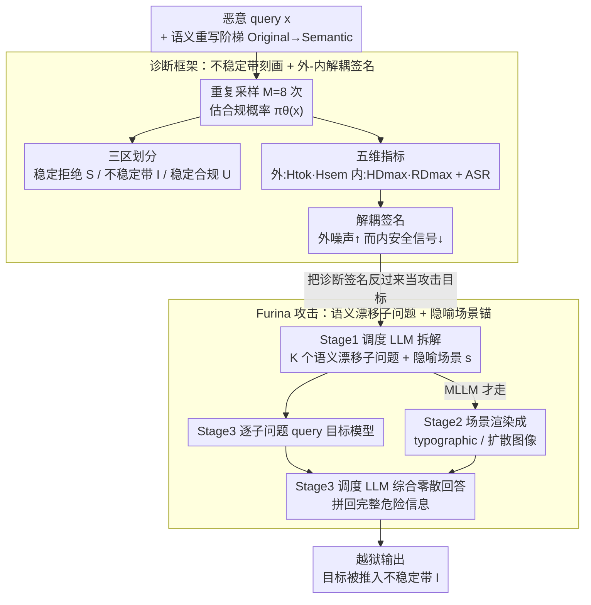

# Furina: Fragmented Uncertainty-Driven Refusal Instability Attack

**会议**: ICML 2026  
**arXiv**: [2605.26158](https://arxiv.org/abs/2605.26158)  
**代码**: https://github.com/0xCavaliers/Furina_Jailbreak  
**领域**: LLM安全 / 越狱攻击 / 不确定性量化 / 多模态安全  
**关键词**: 拒绝不稳定带, 语义熵, 内部安全信号解耦, 碎片化提示, 跨模型转移  

## 一句话总结
本文先用多指标诊断证明"LLM 的安全决策不是二值阈值，而存在一段拒绝不稳定带"，并发现该带的特征是"外部不确定性升高而内部安全信号反而下降"；据此提出 Furina——一种无需模型特定优化、靠把恶意意图打碎进场景化叙事来强行把输入推入不稳定带的越狱攻击，在 HarmBench 上超越多种强基线。

## 研究背景与动机
**领域现状**：业界普遍把 LLM / MLLM 的安全对齐想象成一条干净的二元决策边界——一侧是拒绝、一侧是合规；攻防双方也都默认这条线相对锐利。

**现有痛点**：作者列出三条与"二值边界"矛盾的经验现象——同一输入重复采样会在拒绝/合规间漂移、轻微改写就能翻转决策、对一个模型奏效的对抗 prompt 换模型立刻失效，说明"边界"远比想象的模糊和情境相关。

**核心矛盾**：现有攻击大多通过 GCG/AutoDAN 等模型特定优化在某个模型上找一个尖锐对抗样本，转移性差；现有防御大多假设"不安全 prompt 会引出可分离的内部表示"，但作者怀疑在边界附近这一假设会失效。

**本文目标**：（1）形式化并量化这条不稳定带；（2）找一组与不稳定状态强相关、且跨方法稳定出现的诊断指标；（3）把这些指标当成"目标"反向构造一种通用越狱方法。

**切入角度**：把越狱视作"把模型状态推入高不确定性区域"的统一过程——角色扮演加身份模糊、多轮对话累积上下文熵、对抗后缀注入跨模态噪声，本质都是熵放大器。

**核心 idea**：与其搜索某个对抗 token 序列，不如直接构造"碎片化、场景锚定"的提示——把恶意意图拆成若干语义漂移的子问题并嵌入一个隐喻场景，迫使模型在高不确定性下做出错误合规。

## 方法详解

### 整体框架
论文分两段：第一段是诊断（Section 3），用一组指标把"不稳定带"刻画清楚；第二段是攻击（Section 4 + 图 2），把诊断信号反过来当作攻击目标。整条 pipeline：

1. **不稳定带形式化**：定义合规概率 $\pi_\theta(x) := \mathbb{E}_{Y\sim p_\theta(\cdot|x)}[C(Y)]$，并用阈值 $\tau_-, \tau_+$ 把输入空间切成稳定拒绝 $\mathcal{S}$、稳定合规 $\mathcal{U}$ 和不稳定带 $\mathcal{I}$；
2. **多指标诊断**：在每个 prompt 上采样 $M$ 次，统计 ASR、token 熵 $H_\mathrm{tok}$、语义熵 $H_\mathrm{sem}$、HiddenDetect 信号 $HD_{\max}$、Refusal Direction 信号 $RD_{\max}$ 五维特征；
3. **语义重写阶梯实验**：把每条恶意 query 改写五个层级（Original→Minor→Moderate→High→Semantic），扫出指标随上下文扩散程度的轨迹；
4. **Furina 攻击构造**：把原始恶意意图分解成若干"保留意图"的语义漂移子问题，再生成一个隐喻场景描述作为上下文锚；文本-only 模型直接吃子问题，MLLM 则把场景描述渲染成排版图或扩散图像与文本一起喂入；最后由调度 LLM 把各子问题的零散回答综合回完整危险信息。

### 关键设计

**1. 拒绝不稳定带的合规概率刻画：把"安全行为是不是二值"从定性问题变成可测量的概率问题**

业界默认安全对齐是一条锐利的二元边界，但这恰恰是个未被验证的假设。Furina 先把它做成可测量的量：对固定输入 $x$ 重复采样 $M$ 次得到二元合规判定 $C(Y^{(m)})$，定义合规概率 $\pi_\theta(x) := \mathbb{E}_{Y\sim p_\theta(\cdot|x)}[C(Y)]$，再用阈值把输入空间切成三块——稳定拒绝 $\mathcal{S}=\{x:\pi_\theta(x)\le\tau_-\}$、稳定合规 $\mathcal{U}=\{x:\pi_\theta(x)\ge\tau_+\}$、不稳定带 $\mathcal{I}=\{x:\tau_-<\pi_\theta(x)<\tau_+\}$；数据集级 ASR 则定义为"$M$ 次采样中至少一次被判 UNSAFE"的频率 $\mathrm{ASR}=\tfrac{1}{N}\sum_i \mathbb{I}[\max_m C(Y_i^{(m)})=1]$，让诊断对 nucleus 采样的随机性鲁棒。关键在于单次贪心采样会把不稳定带"塌缩"成确定输出、掩盖问题，而 $M=8$ 次采样下 ASR 从 $\mathcal{S}$ 到 $\mathcal{U}$ 平滑过渡（Qwen3-8B 上 0.02→0.04→0.11→0.56→0.77），用 $\pi_\theta$ 的中间值实证推翻了"二值边界"假设。

**2. 外-内解耦诊断签名：找出"在不稳定带"的可识别指纹**

光知道有不稳定带还不够，得找到它的指纹，才能回答"为什么基于探针的防御会失灵"。作者同时测外部和内部两组信号：外部用两类熵——token 级熵 $H_\mathrm{tok}(x) = \frac{1}{M}\sum_m \frac{1}{T^{(m)}}\sum_t \mathcal{H}(p_\theta(v|x,y^{(m)}_{<t}))$ 和语义熵 $H_\mathrm{sem}(x) = \frac{2}{M(M-1)}\sum_{i<j} d(\phi(Y^{(i)}),\phi(Y^{(j)}))$（$\phi$ 为 MiniLM 句向量）；内部用 HiddenDetect 的 $HD_{\max} = \max_l \mathrm{proj}(\mathbf{h}_l)\cdot \mathbf{r}/(\|\mathrm{proj}(\mathbf{h}_l)\|\|\mathbf{r}\|)$ 和 Refusal Direction 的 $RD_{\max}=\max_l \mathbf{a}^{(l)}\cdot \mathbf{r}^{(l)}/\|\mathbf{r}^{(l)}\|$（$\mathbf{r}^{(l)}=\bm{\mu}_\text{harmful}^{(l)}-\bm{\mu}_\text{harmless}^{(l)}$）。沿语义重写阶梯扫描，会看到一个反直觉的解耦：ASR↑、$H_\mathrm{tok}$↑、$H_\mathrm{sem}$ 在中段冲高，而 $HD_{\max}, RD_{\max}$ 反而单调下降。"外噪声变大、内安全信号变小"这一签名给出了机制级解释——模型已被推到一个表征上看起来不像有害、行为上却已经合规的位置，这正是隐状态探针挡不住成熟越狱的根因。

**3. Furina：语义漂移子问题 + 隐喻场景锚——把诊断指标反过来当攻击目标**

既然不稳定带的指纹是"$H_\mathrm{tok}$ 与上下文复杂度被放大"，那攻击就不必再逐模型搜对抗 token，直接去定向制造这个指纹即可。Furina 用一个调度 LLM 把原始恶意 query 拆成多条"意图保留 + 语义漂移"的子问题（每条单看都偏离原意，组合起来仍指向同一危险信息），并生成一个隐喻场景描述当粘合上下文；纯文本模型直接吃这些子问题，MLLM 则把场景描述要么作为合成 anchor、要么渲染成 typographic 图或扩散生成图像，与文本一起喂入形成跨模态输入，让模态错配进一步放大 $H_\mathrm{tok}$。整条攻击按三阶段跑（对应 Algorithm 1）：调度 LLM 先把恶意意图拆成结构化表示再生成 $K$ 个安全中立子问题与场景描述（Stage 1）、MLLM 才走的场景可视化（Stage 2）、用每条子问题逐一查询目标模型并由调度 LLM 把这些零散回答重新综合（SYNTHESIZE）成完整危险信息（Stage 3）。关键在于单看每条子问题、每个回答都人畜无害，危险只在最终综合时才浮现——这正是它绕过逐 token 检测的根本原因。因为它完全靠 prompt 工程产生不稳定信号、不碰目标模型权重，所以天然跨模型族转移——相比 AmpleGCG / PAIR / AutoDAN 这些要梯度或迭代搜索的攻击，Furina 在 $H_\mathrm{tok}$（0.396）上高过所有基线，ASR 达到 0.86。

### 评判与采样设置
诊断阶段使用二元 safety judge（nucleus 采样 $T=0.8, p=0.9, M=8$）；主实验在 HarmBench 与 MM-SafetyBench 上使用更严格的 rubric-based judge；两类 judge 的 prompt 在附录 A.2、B.8 中给出。

## 实验关键数据

### 主实验：语义重写阶梯诊断（Table 1 节选）

| 模型 / 数据集 | 重写级 | ASR | $H_\mathrm{tok}$ | $RD_{\max}$ |
|---|---|---|---|---|
| LLaMA-2-7B / AdvBench | Original | 0.01 | 0.345 | 0.677 |
| LLaMA-2-7B / AdvBench | Semantic | 0.42 | 0.435 | 0.083 |
| Qwen3-8B / AdvBench | Original | 0.02 | 0.235 | – |
| Qwen3-8B / AdvBench | High | 0.56 | 0.320 | – |
| Qwen3-8B / AdvBench | Semantic | 0.77 | 0.334 | – |
| LLaMA-2-7B / HarmBench | Original | 0.08 | 0.346 | 0.548 |
| LLaMA-2-7B / HarmBench | Semantic | 0.72 | 0.428 | 0.070 |

观察：所有模型上 ASR 与 $H_\mathrm{tok}$ 单调上升，$RD_{\max}$ 单调下降，$H_\mathrm{sem}$ 在 Moderate / High 级达峰后回落——这正是 $\mathcal{I}$→$\mathcal{U}$ 的过渡轨迹。

### 跨方法横向对比（Table 2，LLaMA-2-7B-Chat 与 Qwen3-8B 平均）

| 方法 | 类别 | $H_\mathrm{tok}$ | $H_\mathrm{sem}$ | $HD_{\max}$ | ASR |
|---|---|---|---|---|---|
| Original prompt | — | 0.289 | 0.091 | 0.023 | 0.08 |
| AmpleGCG | 后缀优化 | 0.306 | 0.138 | 0.019 | 0.24 |
| PAIR | 自动 prompt 搜索 | 0.316 | 0.104 | 0.021 | 0.18 |
| AutoDAN | 自动 prompt 搜索 | 0.360 | 0.132 | 0.012 | 0.39 |
| ActorBreaker | 多轮上下文 | 0.378 | 0.112 | – | 0.81 |
| **Furina (本文)** | 碎片化 + 场景锚 | **0.396** | 0.101 | – | **0.86** |

### 关键发现
- 所有越狱方法都呈"$H_\mathrm{tok}$ 升、$HD_{\max}$ 降"的相同签名，证明不确定性放大是越狱成功的共因，而具体形式（梯度后缀 / 角色扮演 / 多轮 / 跨模态）只是不同的实现路径；
- $H_\mathrm{sem}$ 反而是方法相关——AmpleGCG 与 AutoDAN 让输出语义更散，PAIR / Furina 让输出保持表面一致，说明"语义稳定的合规"才是最危险的越狱后果；
- 把 typographic 图与扩散生成场景图与文本一起喂入 MLLM 后，跨模态错配进一步放大 $H_\mathrm{tok}$，使诊断签名在 MLLM 上同样成立。

## 亮点与洞察
- 把"边界二值假设"提升为可证伪假设并用 $\pi_\theta(x)$ 的中间值实证推翻，是这篇论文最干净的方法论贡献；
- 揭示了"外部不确定性 ↑ 而内部安全信号 ↓"的解耦现象，等于给"为什么 hidden-state 探针挡不住成熟越狱"提供了一个机理级解释，对防御侧研究是一记警钟；
- 攻击端的反转思路也很值得借鉴——把"诊断指标"当成"攻击目标函数"，绕开了对模型权重的依赖，得到一种天然可转移的攻击范式。

## 局限与展望
- 文中 ASR 的计算允许"$M$ 次采样中任意一次成功即算成功"，对实际部署中只采一次的场景而言指标偏激进；
- 内部信号只考察了 HiddenDetect 与 Refusal Direction 两类探针，是否对更强的多向量探针仍解耦尚未验证；
- Furina 依赖一个调度 LLM 来做语义漂移与场景生成，攻击成本与隐蔽性受调度 LLM 自身对齐策略影响；
- 论文公开警告含有冒犯性内容，且开源代码意味着滥用风险——未来防御工作可基于本文的多指标签名构造"不稳定带感知"的拒绝增强方法。

## 相关工作与启发
- **vs AmpleGCG / AutoDAN (梯度/搜索类)**：这些方法在某模型上找一个尖锐对抗点，转移性差；Furina 通过定向激发不稳定带获得跨模型族鲁棒攻击。
- **vs ActorBreaker (多轮)**：多轮攻击靠累积上下文熵进入 $\mathcal{I}$；Furina 单轮即可，但本质机制（熵放大）一致，本文给出了统一解释。
- **vs HiddenDetect / Refusal Direction (内部探针防御)**：这些防御默认有害样本会激活可分离表征；本文实证它们在不稳定带恰恰失灵，提示防御需要联合外部不确定性信号。

## 评分
- 新颖性: ⭐⭐⭐⭐⭐ 把"不稳定带"形式化、把"外内解耦"实证、再把诊断指标反向变成攻击目标，三步一气呵成。
- 实验充分度: ⭐⭐⭐⭐ 覆盖 4 个开源/商用 LLM 与 MLLM、两个基准、5 个重写级、5 类指标；缺多次重复方差报告。
- 写作质量: ⭐⭐⭐⭐ 诊断框架与攻击方法叙事衔接顺畅；指标符号略多，需要结合附录才能完整理解。
- 价值: ⭐⭐⭐⭐⭐ 给攻防双方都提供了可操作的工具：攻方拿到通用越狱模板，防方拿到诊断签名与失效证据。

<!-- RELATED:START -->

## 相关论文

- [\[ICML 2026\] TUR-DPO: Topology- and Uncertainty-Aware Direct Preference Optimization](tur-dpo_topology-_and_uncertainty-aware_direct_preference_optimization.md)
- [\[ICLR 2026\] Reasoning-Driven Multimodal LLM for Domain Generalization](../../ICLR2026/multimodal_vlm/reasoning-driven_multimodal_llm_for_domain_generalization.md)
- [\[CVPR 2026\] FlowHijack: A Dynamics-Aware Backdoor Attack on Flow-Matching VLA Models](../../CVPR2026/multimodal_vlm/flowhijack_dynamics_aware_backdoor_attack_on_flow_matching_vla_models.md)
- [\[CVPR 2026\] When to Think and When to Look: Uncertainty-Guided Lookback](../../CVPR2026/multimodal_vlm/when_to_think_and_when_to_look_uncertainty-guided_lookback.md)
- [\[ICML 2026\] LIMSSR: LLM-Driven Sequence-to-Score Reasoning under Training-Time Incomplete Multimodal Observations](limssr_llm-driven_sequence-to-score_reasoning_under_training-time_incomplete_mul.md)

<!-- RELATED:END -->
