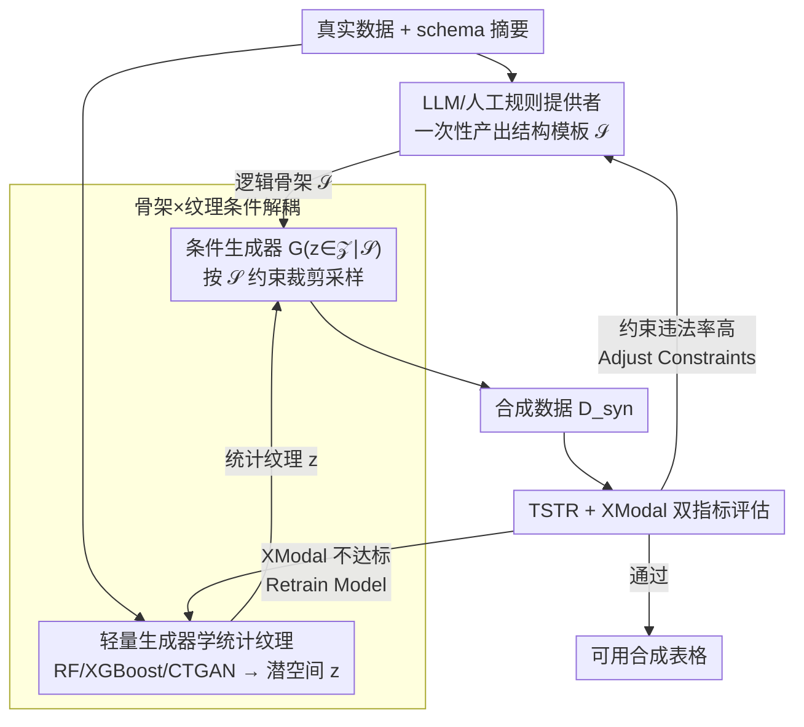

# Hierarchical Synthetic Tabular Data Generation: A Hybrid Top-Down and Bottom-Up Framework

**会议**: ICML 2026  
**arXiv**: [2605.28198](https://arxiv.org/abs/2605.28198)  
**代码**: 无  
**领域**: 合成表格数据生成 / 多模态金融数据 / 弱多模态对齐 / 可控生成  
**关键词**: 表格合成、Top-Down/Bottom-Up、规则约束、LLM 作为规则生成器、XGBoost 条件生成

## 一句话总结
本文提出 H-TDBU 框架：用 LLM 或人工写的规则在 top-down 路径生成"逻辑骨架" $\mathcal{S}$，再用 RandomForest/XGBoost/CTGAN 等轻量 bottom-up 生成器学习"统计纹理" $z$，最后通过条件生成器 $G(z\in\mathcal{Z}\mid\mathcal{S})$ 把两者拼起来并用 TSTR + XModal 反馈循环迭代修正，在弱多模态金融基准上 TSTR AUROC 优于纯神经网络 baseline 同时保持跨模态一致性。

## 研究背景与动机

**领域现状**：合成表格数据是缓解数据稀缺、隐私限制和多源异构问题的主流方案，目前两条路线并存——一是 CTGAN/TVAE/TabDDPM/STaSy 这类纯生成模型，直接学真实数据分布再采样；二是 GReaT/REaLTabFormer/TabuLa 这类把表格行序列化成字符串、让 LLM 做 in-context 表格生成。

**现有痛点**：纯生成模型在数据量小的金融、医疗场景容易过拟合并 mode collapse，特别是欺诈检测这种长尾事件几乎被抹平；LLM 路线则因为 autoregressive token 解码无法显式强制结构一致性和功能依赖，常常产出"看似合理但逻辑违法"的样本，而且对数值-类别异构交互和长距特征依赖建模偏弱。最近还有研究指出递归用合成数据训练会让模型分布坍缩（Shumailov et al. 2024 Nature）。

**核心矛盾**：合成表格数据本质同时需要两种能力——**逻辑可控性**（满足业务规则、跨模态对齐、覆盖罕见事件）和**统计真实性**（边际分布、特征相关、与真实数据无法区分）。把这两件事压进同一个端到端生成模型，往往两边都做不到极致：要么靠 LLM 推理保证逻辑但 LLM 调用成本高、依赖推理质量（如 Davidson et al. 2026），要么靠生成模型保证统计但牺牲可控性。

**本文目标**：（1）把"逻辑结构"和"统计纹理"在框架层面解耦；（2）让 LLM 只负责生成结构规则、不参与逐行采样，把昂贵的 LLM 调用降到最少；（3）在弱多模态（表格 + 文本情感）金融基准上验证可控性与下游效用能同时被保住。

**切入角度**：作者注意到 LLM 真正擅长的不是"批量生成 12,000 行表格"，而是"读完数据 schema 后写出一份关于字段间对齐规则的 JSON"。因此可以把 LLM 当成 *rule provider* 而不是 *data provider*，把 per-row 的繁重生成扔给便宜的 tree-based 模型。

**核心 idea**：用"hybrid top-down/bottom-up"框架把 LLM/人工规则 $\mathcal{S}$ 和轻量生成器学到的潜空间 $z$ 在条件生成器 $G(z\mid\mathcal{S})$ 里和解，并通过 TSTR + XModal 双指标反馈环路自动判断是该重训 bottom-up 模型还是该调整 top-down 约束。

## 方法详解

### 整体框架

H-TDBU 由三段流水线组成。**输入**是真实数据 $\mathcal{D}_{\text{real}}$ 以及一份关于数据 schema 的人工说明或 LLM prompt；**输出**是 $\mathcal{D}_{\text{syn}}$ — 一份既满足业务规则又在统计上接近真实分布的合成表格（可附带文本等其它模态）。

中间流程：

1. **Top-Down 路径** — 人工或 LLM 阅读数据摘要后产出结构模板 $\mathcal{S}$，本质是一份描述"因子 $f_i$ → 可采样属性"的 JSON。例如在弱多模态金融基准里，$\mathcal{S}$ 规定"`target=1` 必须配正面财经文本，`target=0` 配中性或负面文本"。这一步只给逻辑骨架，不管真实感。
2. **Bottom-Up 路径** — 从 $\mathcal{D}_{\text{real}}$ 抽样后让 ensemble（RandomForest/XGBoost）或生成模型（CTGAN/TVAE/Gaussian copula）拟合潜空间 $\mathcal{Z}$，把列与列之间的复杂相关结构记下来。这一步只管"看起来像真的"，不管业务规则。
3. **Synthesis & Reconciliation** — 把骨架 $\mathcal{S}$ 和潜噪声 $z\in\mathcal{Z}$ 一起喂给条件生成器 $X_{\text{Syn}}:=G(z\in\mathcal{Z}\mid\mathcal{S})$，生成的每一行都受 $\mathcal{S}$ 约束。生成后用 TSTR 评下游效用、用 XModal 评跨模态对齐，若 XModal 不达标触发 *Retrain Model* 重新训 bottom-up；若约束违法率高则触发 *Adjust Constraints* 回到 top-down 修规则。

### 关键设计

**1. 把 LLM 从"逐行生成器"降级为"一次性规则提供者"**

LLM 整行生成表格的方案痛点很明确——调用昂贵、又对推理质量极度敏感。本文的观察是：LLM 真正擅长的不是批量吐 12,000 行数据，而是读完 schema 后写一份关于字段对齐的 JSON。于是它把 LLM 的角色压到只产出结构模板 $\mathcal{S}$，后续所有行交给便宜的 tree-based 模型。具体做法是把 Bank Marketing 的 target 分布和 FinancialPhraseBank 的情感标签分布压成一段紧凑摘要喂给 Gemini 3.1 Pro，让它直接吐 rule-provider JSON，把 `target=1` 严格映射到正面文本、`target=0` 映射到中性或负面文本；与之对照的人工 JSON 更宽松，允许 `target=1` 同时配正面或中性文本。整套框架的 bottom-up 模块和评估流水线对两种规则完全相同、只换 $\mathcal{S}$，于是 LLM 的贡献和生成器的贡献被干净地分开。这么一压缩，每次实验只需一两次 LLM 调用，生成成本从 $O(N_{\text{rows}})$ 降到 $O(1)$。

**2. top-down 骨架 + bottom-up 纹理的条件解耦**

逻辑可控和统计真实这两个目标压进同一个端到端模型往往两头不讨好，本文用一个条件生成器 $G(z\in\mathcal{Z}\mid\mathcal{S})$ 把它们拆成两块独立可优化的模块。先用真实数据训 bottom-up 生成器学到无约束的潜表示 $z$（比如 XGBoost 条件采样：固定若干 conditioning columns 后递归预测剩余列），把列与列之间的复杂相关结构记下来；再以 $\mathcal{S}$ 作为硬/软约束在采样阶段裁剪 $z$，让输出 $X_{\text{Syn}}$ 既保留 $z$ 学到的列间相关性、又服从 $\mathcal{S}$ 的对齐规则。这种"先无约束建模分布、后约束采样"的顺序，避开了把规则直接编进 GAN/Diffusion 损失里带来的优化困难。解耦的好处很实际——可以复用现成的轻量表格生成器而不必为每套规则重训神经网络，也能换规则不换模型（实验里 manual rule 和 Gemini rule 共用同一套 XGBoost），可控性实验因此变得干净。

**3. TSTR + XModal 双指标反馈环路：分清失败是"模型学不到"还是"规则写错了"**

传统合成数据只看 TSTR，分不清两类失败。本文加一个跨模态指标把它们拆开：TSTR 由一个 logistic regression 在 $\mathcal{D}_{\text{syn}}$ 上训、在真实测试集上评，给出 Acc/F1/AUROC；XModal 则度量真实与合成数据在"表格 target × 文本情感"联合分布上的差异（用 TVD 等）。当 XModal 高但 TSTR 还行，说明 bottom-up 没学到跨模态联合分布，触发 *Retrain Model* 重训生成器；当 TSTR 很差或约束违法率高，说明 $\mathcal{S}$ 本身定得不合理，回到 top-down 走 *Adjust Constraints* 改规则。靠这对指标，作者能在 manual 与 Gemini 两个 benchmark 之间看到清晰的解耦——更严的规则让所有生成器的 TSTR 一起上升（决策边界更清楚），同时 XModal 朝不同方向变化，证明两条路径确实独立可调。

### 损失函数 / 训练策略

bottom-up 端没有统一损失函数，而是按生成器类型各用其原生训练方案：RandomForest 用 30 棵树、上限 5,000 训练样本、最多 12 个 conditioning columns；XGBoost 用 80 棵 estimator、最大深度 6、上限 8,000 训练样本、最多 12 个 conditioning columns；CTGAN/TVAE 用 SDV 默认 + 50 epochs。每种配置生成 12,000 行合成数据，关键实验在 seeds 42/123/2024 上跑三次。top-down 端不需要训练，只需要写 / 生成 JSON 规则。

## 实验关键数据

### 主实验

弱多模态金融基准（Bank Marketing 表格 + FinancialPhraseBank 文本情感），所有方法生成 12,000 行：

| 数据集 | 方法 | TSTR Acc ↑ | F1 ↑ | AUROC ↑ | XModal ↓ |
|--------|------|-----------|------|---------|----------|
| Manual | Independent | 0.8830 | 0.0000 | 0.4905 | 0.1094 |
| Manual | Gaussian copula | 0.8949 | 0.2034 | 0.7738 | **0.0485** |
| Manual | **RandomForest** | **0.9281** | **0.6122** | 0.9188 | 0.0555 |
| Manual | XGBoost | 0.9139 | 0.5621 | **0.9190** | 0.1127 |
| Manual | CTGAN | 0.8992 | 0.2694 | 0.8358 | 0.0646 |
| Manual | TVAE | 0.8622 | 0.5581 | 0.8827 | 0.0533 |
| Gemini | Independent | 0.8830 | 0.0000 | 0.5359 | 0.3320 |
| Gemini | Gaussian copula | 0.9423 | 0.6749 | 0.9968 | 0.1605 |
| Gemini | **RandomForest** | **0.9971** | **0.9878** | **0.9998** | 0.1437 |
| Gemini | XGBoost | 0.9746 | 0.9003 | 0.9948 | 0.3234 |
| Gemini | CTGAN | 0.9574 | 0.7863 | 0.9903 | 0.1225 |
| Gemini | TVAE | 0.9881 | 0.9476 | 0.9885 | **0.0193** |

核心读法：换上 Gemini 生成的更严格规则后，**所有**生成器的 TSTR 都上一个台阶（RandomForest AUROC 从 0.9188 → 0.9998），这正是 top-down 路径在起作用——规则把决策边界画得更清楚了，bottom-up 学起来就轻松。

### 消融实验

XGBoost ablation（变训练行数与 conditioning columns 数）：

| Benchmark | 最优配置 | Acc ↑ | F1 ↑ | AUROC ↑ | 说明 |
|-----------|----------|-------|------|---------|------|
| Manual | 12 cols | 0.9139 | 0.5621 | 0.9190 | 规则宽松，需要更多列才能补全上下文 |
| Gemini | 4 cols | 0.9925 | 0.9690 | 0.9999 | 规则严格，少量条件列就足够分离 |

### 关键发现

- **规则越严，生成器越省事**：Gemini 规则把 `target=1` 锁死在正面文本上，所有方法的 TSTR 都跳到 0.99 量级；说明 top-down 端给的可分性直接决定 bottom-up 的难度。
- **下游效用和跨模态保真度不是同一回事**：Manual 上 RandomForest 拿 0.9188 AUROC 但 XModal 高于 Gaussian copula；Gemini 上 TVAE 的 XModal 低到 0.0193 但 AUROC 反被 RandomForest 反超。作者据此论证需要双指标共同评估。
- **轻量 tree-based 方法竞争力强**：在两个 benchmark 上 RandomForest 都打到或超过 CTGAN/TVAE，但训练耗时不到神经基线的一个零头，验证了"LLM 写规则 + 便宜模型生数据"路线的成本优势。
- **conditioning columns 数依规则复杂度自适应**：Manual 偏好 12 列、Gemini 偏好 4 列，与"严规则把信息推到约束端、松规则把信息推到统计端"的直觉吻合。

## 亮点与洞察

- **把 LLM 从"per-row generator"降级到"one-shot rule provider"**，单次实验只需一次 LLM 调用就拿到 12,000 行受控合成数据，把多阶段 LLM 推理方案的成本拉低数个数量级，同时保留 LLM 的语义先验。
- **干净的可控性实验设计**：固定 bottom-up 与评估流水线、只换 JSON 规则，得到一对 manual/Gemini benchmark，能首次清晰量化"规则提供者"对生成质量的因果贡献，这种"消融 LLM 角色"的实验思路可迁移到其它 LLM-as-X 的工作里。
- **TSTR + XModal 双指标解耦失败模式**：把"模型学不到"和"规则没写对"两类问题映射到 *Retrain Model* / *Adjust Constraints* 两种修复动作，把过去 ad-hoc 的合成数据调试变成结构化的反馈循环。

## 局限与展望

- 反馈循环（XModal 阈值、Retrain/Adjust 触发条件）在论文里被画成图但缺乏自动化算法描述，目前更像工程蓝图而非可复现协议；阈值、迭代次数、收敛性都没给出。
- 评估基准偏弱：弱多模态实验只用了 Bank Marketing + FinancialPhraseBank，文本端是粗粒度的情感标签而非真实金融报告，跨模态对齐难度低于真实业务场景；金融实务中常见的时间序列、客户画像、多表关系都没覆盖。
- "可控性"主要体现为 `target ↔ sentiment` 这种简单二元对齐，没测试更复杂的多约束、多功能依赖（如"年龄 → 收入上界 → 信用额度"这种链式约束），框架在硬约束违反率上也没报告数字。
- LLM 规则的稳健性未深入：只在 Gemini 3.1 Pro 上跑了一次，没分析不同 LLM、不同 prompt、不同 schema 摘要粒度下规则质量的方差，而这是该路线落地最关键的不确定性。
- 没有与 Davidson et al. (2026)、Umesh et al. (2026) 这两个被作为动机引用的 "reasoning-driven" 同期工作做 head-to-head 对比，可控性 vs 成本的权衡只能从描述上推断。
- 改进方向：把 reconciliation loop 写成显式约束满足 / 拒绝采样算法、加入硬约束违反率作为第三指标、扩展到 schema 更复杂的医疗 / 表关系数据、研究 prompt 模板自动优化以减少 LLM 规则方差。

## 相关工作与启发

- **vs CTGAN / TVAE / TabDDPM / STaSy**：纯生成模型直接学 $p(\text{table})$ 并采样，本文则把分布建模拆成 $p(\text{table}\mid\mathcal{S})$ 与 $p(\mathcal{S})$ 两段，分别用便宜模型和 LLM 处理。本文优势是显式可控性、低数据可用；劣势是依赖人工 / LLM 给出的规则质量，在没有规则的纯探索性合成场景里反而冗余。
- **vs GReaT / REaLTabFormer / TabuLa**：这些方法让 LLM 整行生成数据，本文只让 LLM 写一份元规则、把行级生成交给 tree-based 模型。本文优势是成本低 & 逻辑约束可显式表达；劣势是不依赖 LLM 自身的丰富语义先验。
- **vs Davidson et al. 2026 / Umesh et al. 2026 (reasoning-driven synthesis)**：同期工作主要靠 LLM 多步推理保证一致性，本文则把推理结果固化为 JSON 后用便宜模型大规模采样。本文优势是把昂贵推理摊销到一次性规则生成；劣势是失去 LLM 在生成过程中动态调整的灵活度。
- **vs Shumailov et al. 2024 (Nature, model collapse)**：那篇 Nature 论证递归用合成数据训练会让分布坍缩，本文的 top-down 路径正是缓解这一问题的可行方案——通过规则把罕见事件强制留在数据集里，而不是让模型在递归训练中把它们抹掉。

## 评分
- 新颖性: ⭐⭐⭐ 概念上"LLM 写规则 + 便宜模型生数据"的解耦颇有启发，但单独看各组件（CTGAN/RF/XGBoost/JSON 规则）都是已有工具，缝合方式偏工程。
- 实验充分度: ⭐⭐ 只在 2 个弱多模态 benchmark + 2 个 tabular-only 数据集上验证，缺少与同期 reasoning-driven 方法的对比，硬约束违反率、LLM 鲁棒性、反馈循环收敛性都没报告。
- 写作质量: ⭐⭐⭐ 思路讲得清楚、图表干净，但方法部分细节（reconciliation 触发阈值、$G(z\mid\mathcal{S})$ 的具体实现）较抽象。
- 价值: ⭐⭐⭐⭐ 给"LLM 在表格合成里到底该扮演什么角色"提供了一个简洁可用的答案，把成本控制思路推广到其它 LLM-augmented pipeline 都有借鉴价值。

<!-- RELATED:START -->

## 相关论文

- [\[ICML 2026\] Left-Right Symmetry Breaking in CLIP-style Vision-Language Models Trained on Synthetic Spatial-Relation Data](left-right_symmetry_breaking_in_clip-style_vision-language_models_trained_on_syn.md)
- [\[ACL 2025\] Scaling Text-Rich Image Understanding via Code-Guided Synthetic Multimodal Data Generation](../../ACL2025/multimodal_vlm/code_guided_text_rich_image.md)
- [\[ICML 2026\] Certified Robustness under Heterogeneous Perturbations via Hybrid Randomized Smoothing](certified_robustness_under_heterogeneous_perturbations_via_hybrid_randomized_smo.md)
- [\[ACL 2026\] SlideAgent: Hierarchical Agentic Framework for Multi-Page Visual Document Understanding](../../ACL2026/multimodal_vlm/slideagent_hierarchical_agentic_framework_for_multi-page_visual_document_underst.md)
- [\[AAAI 2026\] FT-NCFM: An Influence-Aware Data Distillation Framework for Efficient VLA Models](../../AAAI2026/multimodal_vlm/ft-ncfm_an_influence-aware_data_distillation_framework_for_efficient_vla_models.md)

<!-- RELATED:END -->
