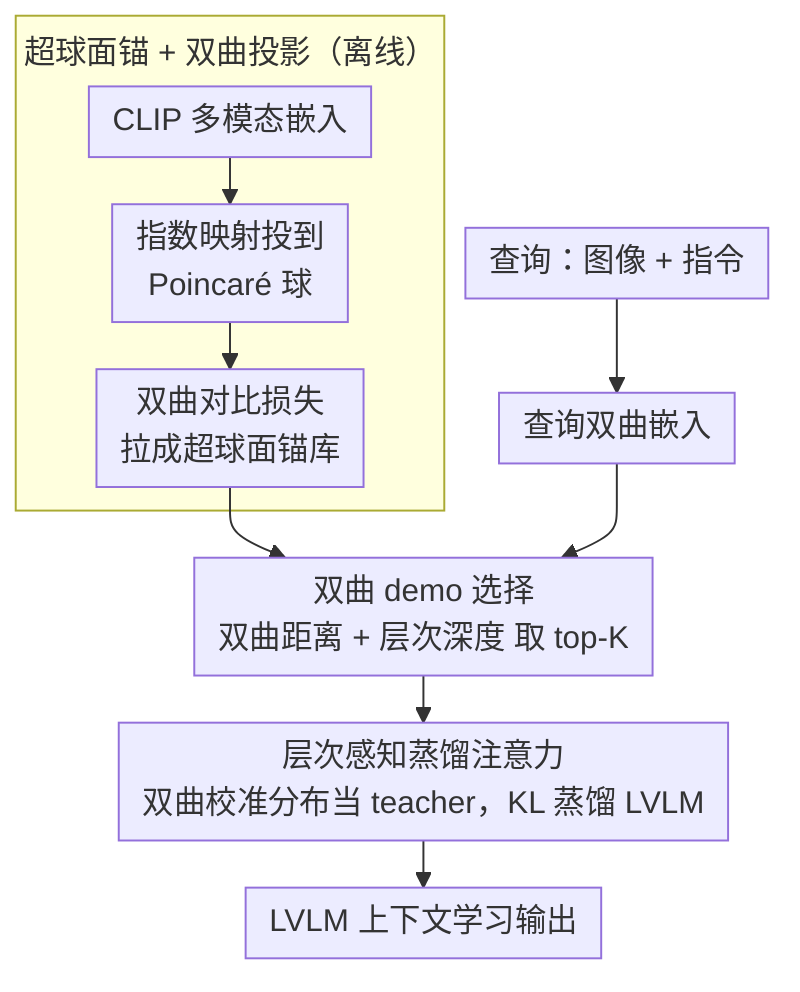

# Hyper-ICL: Attention Calibration with Hyperbolic Anchor Distillation for Multimodal ICL

**会议**: ICML 2026  
**arXiv**: [2605.29103](https://arxiv.org/abs/2605.29103)  
**代码**: 待确认  
**领域**: 多模态 / 视觉语言模型 / 上下文学习  
**关键词**: 多模态 ICL, 双曲嵌入, 注意力校准, 跨模态层次结构

## 一句话总结
Hyper-ICL 通过将 **CLIP 嵌入提升到双曲空间**形成结构化"超球面锚"，结合**层次感知蒸馏注意力**为多模态 LVLM 上下文学习提供结构先验——在 VQA / Captioning / Caption Editing 等任务上稳定超越传统 demo 选择策略。

## 研究背景与动机

**领域现状**：多模态 ICL 要求模型从少量 demo 学习并应用到新查询，但 LVLM 在选择和组合多模态 demo 时面临**注意力错配**与**结构盲点**两大挑战。

**现有痛点**：（1）现有方法基于欧几里得相似度选择 demo，忽略图像-文本-类别之间的**层次结构**；（2）LVLM 注意力难以正确聚焦 demo 中最相关信息，特别是模态信息不一致时；（3）传统的高维欧几里得空间难以捕捉异构语义层次。

**核心矛盾**：多模态语义天然具有层次结构（图像 → 局部区域 → 语义概念 → 类别标签），但欧几里得空间存在指数级体积爆炸，难以高效表示这种层次。

**本文目标**：为多模态 ICL 注入结构化先验，引导注意力聚焦层次相关 demo。

**切入角度**：双曲几何空间在**双曲嵌入半径 vs 节点深度**间天然平衡，体积随半径指数增长——非常适合层次表示。

**核心 idea**：将 CLIP 多模态嵌入映射到双曲空间形成"超球面锚"，作为蒸馏目标引导 LVLM 注意力——保留预训练 CLIP 的强语义同时增强层次理解。

## 方法详解

### 整体框架
分离线、在线两个阶段。**离线**先把 CLIP 多模态嵌入投到双曲空间、用对比损失拉成一个「超球面锚库」，给整套流程提供层次结构先验。**在线**给定查询时：算出查询的双曲嵌入 → 在锚库里按「双曲距离 + 层次深度」做 demo 选择 → 用双曲层次距离校准 LVLM 注意力并以蒸馏方式软注入，最终输出上下文学习结果。

### 关键设计

**1. 超球面锚 + 双曲投影：把 CLIP 嵌入搬到双曲空间，让层次结构显式可表达**

CLIP 的欧几里得嵌入把图像、局部区域、语义概念、类别标签这些异质语义都压在一个共享球面上，层次关系被抹平；而多模态语义本就是层次的，欧几里得空间又有指数级体积爆炸，表层次很吃力。双曲空间正好相反——体积随半径指数增长，天然能放下层次：根概念落在中心、叶节点落到边界。于是先用指数映射 $\exp_o(x)=\tanh(c\|x\|)\frac{x}{c\|x\|}$ 把 CLIP 嵌入 $x$ 投到曲率为 $c$ 的 Poincaré 球 $\mathbb{B}^d_c$，再用双曲度量下的对比损失把语义相关的 demo 拉成一个超球面流形：

$$\mathcal{L}_{\text{anchor}}=\sum_i\log\frac{\exp(-d_{\mathbb{B}}(x_i,x_i^+)/\tau)}{\sum_j\exp(-d_{\mathbb{B}}(x_i,x_j)/\tau)},\quad d_{\mathbb{B}}(u,v)=\frac{2}{\sqrt{c}}\text{arctanh}(\sqrt{c}\|-u\oplus v\|)$$

这样得到的「超球面锚」既保留了 CLIP 的强语义，又把层次深度编码进了半径，给后续 demo 选择和注意力校准都提供结构先验。

**2. 双曲 demo 选择：同时看语义距离和层次深度，避免选到太泛或太偏的样例**

有了锚库，在线第一步是为查询挑 demo。传统选 demo 只按余弦相似度排，等于只考虑语义距离，常会挑到「过于通用」或「过于特殊」的 demo。本文把查询也投到双曲空间得 $\hat{x}_q$，然后按 $\text{score}=-d_{\mathbb{B}}(x_i,\hat{x}_q)+\mu\cdot\text{depth}_{\mathbb{B}}(x_i)$ 排序取 top-K：前一项是双曲距离（语义要近），后一项是层次深度（鼓励选择信息量合适的层级）。把深度显式纳入打分，正是双曲表示带来的额外信号——这也是 Hyper-ICL 在 demo 数量从 K=4 加到 K=8 时仍能稳定增长、而传统方法收益急剧递减的原因。

**3. 层次感知蒸馏注意力：用双曲锚软引导 LVLM 注意力，而不是硬改权重**

选好 demo 还不够，得让 LVLM 的注意力真正偏向层次相关的 demo。做法是在标准注意力里加一项双曲校准：$\alpha_{i,j}^*=\text{softmax}(QK^T/\sqrt{d}+\lambda\mathcal{H}(x_i,x_j))$，其中 $\mathcal{H}(\cdot,\cdot)$ 是双曲层次距离的反函数——层次越近的 demo 得到的加成越大。但直接拿这个校准注意力去覆盖 LVLM 原注意力风险很大，容易破坏预训练知识，所以本文走蒸馏：把校准后的分布当 teacher，用 $\mathcal{L}_{\text{distill}}=\text{KL}(\alpha_{\text{teacher}}\|\alpha_{\text{student}})$ 让 LVLM 自己慢慢内化层次先验。软目标蒸馏而非硬约束，等于在「注入层次结构」和「保住 CLIP/LVLM 预训练能力」之间取一个平衡。

## 实验关键数据

### 主实验

| 任务 | 模型 | Random | TopK-CLIP | RICES | **Hyper-ICL** | 相比 RICES 提升 |
|------|------|--------|---------|-------|----------|---------------|
| VQA v2 | IDEFICS-9B | 28.4 | 31.2 | 33.7 | **37.9** | **+4.2** |
| OK-VQA | IDEFICS-9B | 19.8 | 22.3 | 24.1 | **28.5** | **+4.4** |
| COCO Caption | IDEFICS-9B | 67.5 | 71.8 | 74.2 | **78.6** | **+4.4** |
| Caption Editing | IDEFICS-9B | 31.2 | 35.7 | 38.4 | **42.1** | **+3.7** |
| Image-Text Match | Otter-9B | 52.3 | 56.8 | 59.4 | **64.7** | **+5.3** |
| Visual Reasoning | Otter-9B | 42.8 | 46.3 | 48.9 | **54.2** | **+5.3** |

### 消融实验

| 配置 | VQA v2 | COCO Caption | 说明 |
|------|--------|-------------|------|
| 仅双曲锚（无注意力校准） | 35.1 | 76.2 | 锚的贡献 |
| 仅注意力校准（欧几里得锚） | 33.8 | 75.5 | 注意力机制贡献 |
| 注意力校准 + 双曲锚 | **37.9** | **78.6** | 完整 Hyper-ICL |
| 双曲度量 ↔ 欧几里得度量 | 33.7 | 74.2 | 度量退化对比 |
| Demo 数量 K=2 → K=4 → K=8 | 35.2 / 37.9 / 38.4 | 76.8 / 78.6 / 79.2 | K=8 最优但收益递减 |

### 不同曲率敏感性

| 曲率 c | VQA v2 ACC | COCO BLEU-4 |
|-------|-----------|-------------|
| 0.5 | 35.6 | 76.4 |
| **1.0** | **37.9** | **78.6** |
| 2.0 | 36.4 | 77.2 |

$c = 1.0$ 为最优；曲率过低退化为欧几里得，过高数值不稳定。

### 关键发现
- 双曲锚与注意力校准产生协同效应——单独使用各得 +2-3 分，组合获 +4-5 分。
- 双曲度量的层次表达优势在层次任务（reasoning, image-text match）更显著。
- 对 demo 数量更鲁棒——传统方法 K = 4 → 8 时收益急剧递减，Hyper-ICL 保持稳定增长。

## 亮点与洞察
- **双曲几何在多模态 ICL 的首次应用**：突破欧几里得空间表达力限制，引入新几何工具。
- **蒸馏机制的优雅平衡**：通过软目标蒸馏而非硬约束修改，既注入层次先验又保留 LVLM 预训练知识。
- **完整闭环设计**：从锚构造、demo 选择到注意力校准形成统一双曲框架，相互强化。

## 局限与展望
- 双曲计算的数值稳定性：高曲率或近边界点导致梯度爆炸/消失需谨慎处理。
- 锚库的规模与覆盖度：基于 CLIP 嵌入构造，对 CLIP 训练分布外的概念可能层次错配。
- 推理开销：每次 ICL 需额外的双曲度量计算（虽然轻量但有累积开销）。
- 改进：探索更稳定的双曲优化算法；扩展到视频、音频等其他模态；研究在更大 LVLM（如 LLaVA-1.6, GPT-4V）上的适用性。

## 相关工作与启发
- **vs RICES**：RICES 基于 CLIP 相似度选择 demo；Hyper-ICL 引入双曲层次结构同时改进选择和注意力机制。
- **vs Poincaré Embedding**：经典 Poincaré 嵌入针对树结构语料库；本工作扩展到 LVLM 上下文学习这种动态场景。
- **vs Attention Calibration（NLP 中）**：先前工作仅在文本注意力；本工作首次扩展到多模态场景。

## 评分
- 新颖性: ⭐⭐⭐⭐⭐  双曲几何应用于多模态 ICL 的首次尝试，跨学科创新明显。
- 实验充分度: ⭐⭐⭐⭐  覆盖 6 个任务 + 2 个 LVLM + 详细消融。
- 写作质量: ⭐⭐⭐⭐  数学公式清晰，但部分双曲几何概念需读者背景。
- 价值: ⭐⭐⭐⭐⭐  在多模态 ICL 这一前沿领域提供新范式，多任务一致性提升说明潜力大。

<!-- RELATED:START -->

## 相关论文

- [\[ICML 2026\] Explaining Is Harder than Predicting Alone: Evaluating Concept-Based Explanations of MLLMs as ICL Visual Classifiers](explaining_is_harder_than_predicting_alone_evaluating_concept-based_explanations.md)
- [\[ICML 2026\] Seeing is Understanding: Unlocking Causal Attention into Modality-Mutual Attention for Multimodal LLMs](seeing_is_understanding_unlocking_causal_attention_into_modality-mutual_attentio.md)
- [\[ICML 2026\] Smoothing Slot Attention Iterations and Recurrences](smoothing_slot_attention_iterations_and_recurrences.md)
- [\[ICML 2026\] Gated Relational Alignment via Confidence-based Distillation for Efficient VLMs](gated_relational_alignment_via_confidence-based_distillation_for_efficient_vlms.md)
- [\[ICML 2026\] Large Vision-Language Models Get Lost in Attention](large_vision-language_models_get_lost_in_attention.md)

<!-- RELATED:END -->
