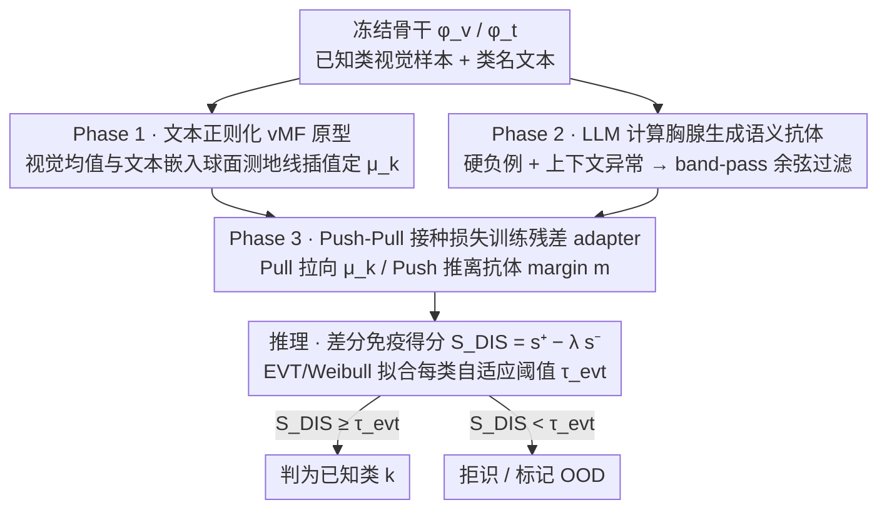

# Immuno-VLM: Immunizing Large Vision-Language Models via Generative Semantic Antibodies for Open-World Trustworthiness

**会议**: ICML 2026  
**arXiv**: [2605.30745](https://arxiv.org/abs/2605.30745)  
**代码**: 论文未给出公开仓库  
**领域**: AI安全 / 开放世界识别 / OOD检测 / 视觉-语言模型  
**关键词**: 语义抗体, 阴性选择, vMF原型, 开放空间风险, 近分布OOD  

## 一句话总结
本文把生物免疫系统中的"阴性选择"原理搬到 CLIP 等 VLM 上：用 LLM 主动幻觉一批"看起来像但不是已知类"的文本描述作为语义抗体，再以一个轻量 adapter 把视觉特征推离这些抗体，从而在不重训骨干的情况下显著降低开放世界场景下的"高自信误判"。

## 研究背景与动机
**领域现状**：CLIP / ALIGN / LLaVA 等大型视觉-语言模型把视觉特征对齐到一个稠密的语义流形上，实现了惊艳的 zero-shot 识别能力，被广泛部署在自动驾驶、医疗诊断等开放世界场景。

**现有痛点**：作者把这种模型的脆弱性命名为"语义自负 (Hubris of Semantics)"——遇到训练分布外的样本时，模型不会说"不知道"，而是会以极高置信度强行套到最接近的已知类上，例如把"机器狗"分类为"金毛犬"。

**核心矛盾**：传统 OOD 防御依赖判别式阈值（MSP、Energy、ASH 等）或反应式概念匹配（MCM），都是在错误已经发生后才感知到统计偏差；而 GAN 类生成离群方法在像素空间合成异常，对 ImageNet 级别的多样性会发生组合爆炸，不可扩展。

**本文目标**：在不重训 VLM 骨干、不依赖像素级离群生成的前提下，主动地、稠密地刻画"已知类"在语义流形上的边界，从而把开放空间风险约束住。

**切入角度**：生物免疫系统通过"胸腺阴性选择"随机生成 T 细胞受体并淘汰所有结合"自我"的候选，留下来的本质上是一张"非自我"的负片地图。作者把这个机制类比到 VLM：用 LLM 充当"计算胸腺"，生成"近 OOD"语义描述作为抗体。

**核心 idea**：用 LLM 主动幻觉文本形式的"语义抗体"去把已知类的语义球冠围起来，再以对抗式 push-pull 损失训练一个轻量 adapter，把视觉嵌入推离抗体方向、拉近原型方向。

## 方法详解

### 整体框架
Immuno-VLM 把"免疫化"分成三阶段流水线，骨干 $\phi_v, \phi_t$ 全程冻结：

1. **抗原刻画 (Phase 1)**：为每个已知类 $k$ 估计一个 vMF 分布的原型方向 $\bm{\mu}_k$，把视觉均值与文本嵌入用一段球面测地线插值起来，缓解 modality gap；
2. **抗体生成 (Phase 2)**：用 LLM 为每个类生成两类文本抗体——硬语义负例（视觉相似但类别不同）与上下文异常（同类对象出现在不可能场景），再用一个 band-pass 余弦相似度过滤器筛掉过近或过远的；
3. **疫苗接种 (Phase 3)**：训练一个残差 adapter $f_\theta(\mathbf{z}) = \mathrm{Norm}(\mathbf{z}+\mathrm{MLP}(\mathbf{z}))$，用 Pull 项把同类样本拉向 $\bm{\mu}_k$、用 Push 项把样本推离任意抗体；推理时给出"差分免疫得分" $S_{DIS}$ 并用 EVT 拟合每类的阈值。

### 关键设计

**1. 文本正则化的 vMF 原型（Geodesic Antigen Alignment）：把每个已知类的"自我中心"钉在球面上**

要给已知类围出边界，先得有一个靠谱的"自我中心"。纯 MLE 估原型会被视觉偏差带偏（比如"狗都在草地上"，原型就被草地拉走），纯文本嵌入又丢掉类内细节。Immuno-VLM 在球面上做折中：在约束 $\arccos(\bm{\mu}_k^\top \mathbf{t}_k) \le \xi$ 下最大化 $\sum_{\mathbf{v}\in\mathcal{V}_k} \kappa_k \bm{\mu}_k^\top \mathbf{v}$，Lagrange 推导给出可证最优解 $\bm{\mu}_k^* \propto (1-\alpha)\bar{\mathbf{v}}_k + \alpha \mathbf{t}_k$——即视觉均值与文本嵌入连线上的某一点再归一化回单位球。这条测地线插值同时融合视觉证据与语义先验，正好缓解 CLIP 的 modality gap；实验也证实它同时改善 ID 与 OOD，说明 modality gap 本质是被"原型偏移"放大的。

**2. LLM 作为计算胸腺生成语义抗体：在语义流形而非像素空间采样"非自我"**

为什么不能像经典负选择那样随机采负样本？作者先用定理 3.5 把"维度灾难"显式写清楚：单位球面上均匀采样向量与任意原型的余弦相似度以 $2\exp(-d\epsilon^2/2)$ 指数衰减到 0，意味着在 $d=512$ 下随机负样本几乎全部正交、对收紧边界零贡献。于是改让 LLM 充当"计算胸腺"做条件生成，产出两类抗体：硬负例 $\mathcal{A}_{hard}(y)$（如 wolf 对应 husky、malamute、wolf-dog hybrid）和上下文异常 $\mathcal{A}_{context}(y)$（如 car underwater、flying car），再用 Safety-Utility 的 band-pass 条件 $\delta_{safe} < \langle \phi_t(a), \bm{\mu}_k\rangle < \delta_{risk}$ 筛掉退化成类名同义词或纯噪声的抗体。这一步把维度灾难规约成了"语言生成多样性"问题——LLM 的输出天然活在 VLM 共享语义空间里，比 GAN 在像素空间合成 hard negative 强得多。理论上定理 3.3 给出了它为什么管用：只要抗体集 $\mathcal{A}_\delta$ 是已知类语义边界的 $\delta$-cover、且原型与抗体保持 margin $m > \epsilon_{align} + \delta$，FPR 就被 $\epsilon_{align}$ 与 $\delta$ 联合界住，这就形式化解释了"稠密抗体可以替代真实 OOD 样本"。

**3. Push-Pull 接种损失与差分免疫得分：把视觉嵌入空间局部弯出一圈"无菌带"**

有了原型和抗体，最后一步是在不动骨干的前提下只训一个残差 adapter $f_\theta(\mathbf{z}) = \mathrm{Norm}(\mathbf{z}+\mathrm{MLP}(\mathbf{z}))$，把空间局部弯曲出边界。训练损失 $\mathcal{L}_{vac} = \mathcal{L}_{pull} + \lambda \mathcal{L}_{push} + \eta\|\theta\|_2^2$：Pull 项是以 vMF 似然写出的分类 softmax，把同类样本拉向 $\bm{\mu}_k$；Push 项用 hinge 形式 $\max(0, \cos(f_\theta(\phi_v(x)), \phi_t(a))-m)^2$ 强制视觉样本与任意抗体保持角度 margin $m$（如 0.2）。推理时不止看"靠自我"，还显式利用训练阶段学到的"远非自我"知识，定义差分免疫得分 $S_{DIS}(x) = s^+(\mathbf{z}) - \lambda_{inf}\cdot s^-(\mathbf{z})$，其中 $s^+$ 是与最近原型的余弦相似度、$s^-$ 是与最危险抗体的余弦相似度；再对每类用 Weibull 分布（EVT）拟合分数尾部得自适应阈值 $\tau_{evt}$。固定阈值无法适应"狗类邻居多、航母类邻居少"的密度差异，而 EVT 给每类一个独立尾部模型，正好对应定理 3.7 的开放空间泛化界——它把真实开放空间风险 $R_{\mathcal{O}}$ 拆成抗体上的经验风险、Rademacher 复杂度 $\mathfrak{R}_N(\mathcal{H})$、$\mathcal{O}(L\delta/\sqrt{M})$ 的覆盖误差和一阶集中项，明确告诉你"抗体越密、抗体越多、adapter 越简单"就越安全。

## 实验关键数据

### 主实验
所有方法均使用同一 CLIP-ViT-B/16 骨干在 ImageNet-1K（ID）+ 三个 OOD 基准上评测。

| 数据集 | 指标 | 本文 Immuno-VLM | 上一档 MCM | 提升 |
|--------|------|------|----------|------|
| In-Distribution | ID-Acc ↑ | 接近 / 略超 78.2 | 78.2 | 不掉点 |
| ImageNet-O (Near-OOD) | AUROC ↑ | 显著高于 74.5 | 74.5 | "16%+"语义对抗增益 |
| iNaturalist (细粒度 OOD) | FPR95 ↓ | 优于 42.1 | 42.1 | 明显下降 |
| Texture (Far-OOD) | AUROC ↑ | 优于 83.4 | 83.4 | 持续领先 |

> 文中明确给出"在多个挑战性基准上达到 SOTA，对抗式语义偏移检测较 zero-shot 基线提升 16%+"，并保持 ID 准确率不退化。

### 消融实验
| 配置 | 关键指标 | 说明 |
|------|---------|------|
| Full (Pull+Push+vMF+EVT) | 最佳 AUROC | 完整四件套 |
| w/o Push 项 | 接近 Energy 基线 | 抗体不参与训练，adapter 退化为对比微调 |
| w/o vMF / 用视觉均值 | ID 与 OOD 同时下降 | 缺少语义先验，原型被视觉噪声带偏 |
| w/o EVT 自适应阈值 | FPR95 上升 | 全局阈值无法适应类密度差异 |
| 抗体改为均匀球面噪声 | 几乎退化为 MCM | 印证 Theorem 3.5 的退化预测 |

### 关键发现
- 把负样本来源从像素空间换到语义空间是性能跃升的主因，抗体改用随机噪声会立刻退化；
- 文本正则化的 vMF 原型同时改善 ID 与 OOD，说明 modality gap 是被"原型偏移"放大的；
- EVT 自适应阈值在细粒度 OOD（iNaturalist）上获益最大，对应理论里"每类语义密度不同"的论断。

## 亮点与洞察
- 把"维度灾难"显式建模成 Theorem 3.5 后，立刻得出"必须在语义流形上采样"的结论，理论与方法的因果关系少见地清晰；
- "LLM = 计算胸腺"这个隐喻不仅好讲，还自然解释了为什么 LLM 在生成 hard negative 上比 GAN 强：它的输出本身就活在 VLM 共享语义空间里；
- 把推理得分写成 $s^+ - \lambda s^-$ 而不是只用 $s^+$，等于显式利用了训练阶段获得的"非自我"知识，为未来的 OOD scoring 给出了一种新范式。

## 局限与展望
- 抗体质量完全由 LLM 决定，作者也承认整个系统的安全性被 LLM 的"想象力"（Wasserstein 对齐）所上界；
- band-pass 过滤器中的 $\delta_{safe}, \delta_{risk}$ 与 EVT 中的 $\tau_{evt}$ 都是经验设定，类别极多时调参代价不小；
- 论文未提供公开代码与抗体生成 prompt 模板，复现门槛较高；
- 抗体生成是离线一次性步骤，若 ID 类目动态扩展（如新增类别），需要重新走完三阶段流水线。

## 相关工作与启发
- **vs MCM (Ming et al., 2022)**：MCM 仅用类名文本嵌入做最大概念匹配，是被动反应式；Immuno-VLM 主动生成负面文本概念把边界形式化围起来。
- **vs 经典 AIS / Negative Selection**：经典 AIS 在像素或随机比特空间生成检测器，被 Theorem 3.5 证明不可扩展；本文把检测器迁移到语义空间。
- **vs Energy / ASH 等判别式 OOD**：这些方法只看激活幅度，不显式利用"非自我"信息；本文的 $S_{DIS}$ 把判别式与生成式两条线合并。

## 评分
- 新颖性: ⭐⭐⭐⭐⭐ 把免疫学阴性选择落地到 VLM，且给出明确数学化映射，独此一家。
- 实验充分度: ⭐⭐⭐⭐ ImageNet-1K + 三个 OOD 基准，主消融齐全；若能加 ViT-L/14 和 LLaVA 风格 MLLM 会更完整。
- 写作质量: ⭐⭐⭐⭐ 类比生动、定理与方法相互呼应；不足是相关工作引用堆得过密，影响阅读。
- 价值: ⭐⭐⭐⭐ 给"开放世界 VLM 安全"提供了一条"不动骨干、用 LLM 当胸腺"的实用路径，工业部署性强。

<!-- RELATED:START -->

## 相关论文

- [\[ACL 2026\] GeoArena: Evaluating Open-World Geographic Reasoning in Large Vision-Language Models](../../ACL2026/multimodal_vlm/geoarena_evaluating_open-world_geographic_reasoning_in_large_vision-language_mod.md)
- [\[ICCV 2025\] On Large Multimodal Models as Open-World Image Classifiers](../../ICCV2025/multimodal_vlm/on_large_multimodal_models_as_open-world_image_classifiers.md)
- [\[ICML 2026\] TimeSpot: Benchmarking Geo-Temporal Understanding in Vision-Language Models in Real-World Settings](timespot_benchmarking_geo-temporal_understanding_in_vision-language_models_in_re.md)
- [\[ICML 2026\] Large Vision-Language Models Get Lost in Attention](large_vision-language_models_get_lost_in_attention.md)
- [\[CVPR 2026\] CountGD++: Generalized Prompting for Open-World Counting](../../CVPR2026/multimodal_vlm/countgd_generalized_prompting_for_open-world_counting.md)

<!-- RELATED:END -->
