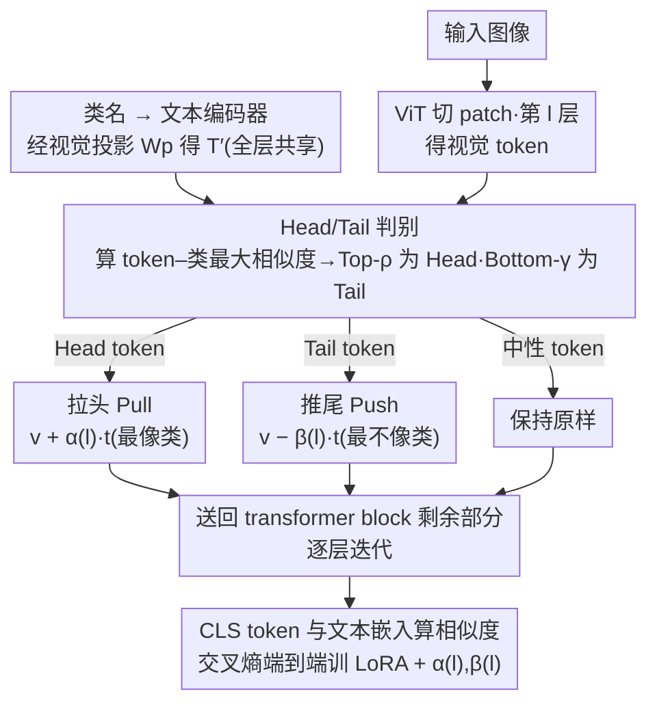

# ATHA: 通过打破尾部对齐改进 CLIP 在源数据无关跨域小样本上的适配

**会议**: ICML 2026  
**arXiv**: [2605.29776](https://arxiv.org/abs/2605.29776)  
**代码**: https://github.com/shuaiyi308/ATHA  
**领域**: 多模态VLM / 跨域小样本  
**关键词**: CLIP 微调, 跨域小样本学习, 视觉-文本对齐, Tail Token, 源数据无关适配  

## 一句话总结
ATHA 提出在 CLIP 跨域小样本微调中"对齐头部 token、推开尾部 token"的非对称对齐范式——把语义稀薄的 patch 主动从文本嵌入推开,反而能减轻过拟合并把 1-shot 平均精度从 55.92% 推到 58.35%。

## 研究背景与动机

**领域现状**:CLIP 等视觉-语言模型(VLM)靠对比预训练学到了语义对齐的图文表示,在零样本任务上很强。把它适配到下游任务时,主流做法是**进一步强化所有 patch token 与对应文本嵌入的对齐**——SPARC、PACL、Contrastive Localized Pre-Training 等无一不在做密集对齐。在跨域小样本学习(CDFSL)及其更严苛的源数据无关变体(SF-CDFSL,微调时不能访问源域数据)上,主流路线同样默认"对齐越强、性能越好"。

**现有痛点**:作者发现一个**反直觉现象**:在跨域小样本微调中,刻意把语义相似度最低的那批 patch(称为 tail tokens)从对应文本嵌入主动推开,在四个标准 CDFSL benchmark(ISIC、EuroSAT、CropDiseases、ChestX)上都能一致提点。这与"全 token 对齐"的主流范式直接矛盾——按主流逻辑,任何打破对齐的操作都该掉点。

**核心矛盾**:在大域差 + 训练数据极稀(每类 1 或 5 shot)的双重约束下,模型其实**没有能力从图像中提取出足够语义**让 tail token 真正学会对齐。强行对齐 tail token 的结果不是"学得更好",而是"死记住"训练样本的 token,即过拟合到几张支持集图片的具体像素分布。论文用 CKA 域相似度验证:标准微调会让源-目标域的特征相似度异常下降(典型的过拟合信号),而推开 tail token 反而把这个相似度拉回来。

**本文目标**:(1) 给"推开 tail token"找一个原理性解释,(2) 把这个观察工程化成可端到端训练的模块,既能强化语义充足 patch 的对齐,又能压制语义稀薄 patch 的过拟合;(3) 在 SF-CDFSL 标准 benchmark 上拿到 SOTA。

**切入角度**:既然 tail token 的根本问题是"语义不足时强行对齐反而记噪声",而 head token 的对齐仍然能传递有用的迁移信号,那就把"对齐"这件事**按 token 语义相关度分层处理**:把判别性强的 patch 拉向最像的类文本(pull),把判别性弱的 patch 推开最不像的类文本(push),其余 token 保持不动。

**核心 idea**:用 token 的"最大类相似度"作为代理,在 ViT 每一层动态识别 Head/Tail token,然后用每层可学习的强度参数 $\alpha^{(l)}, \beta^{(l)}$ 做"拉头推尾"的非对称对齐。

## 方法详解

### 整体框架
基础模型为 CLIP-ViT/B-16,采用 LoRA 低秩适配——backbone 冻结,只训 LoRA 矩阵和一组层级可学习对齐强度。给定输入图 $\mathbf{x}$ 与 $N$ 个目标类名,文本编码器给出文本嵌入 $\mathbf{T}\in\mathbb{R}^{N\times D_t}$,再用 CLIP 自带的视觉投影矩阵 $\mathbf{W}_p$ 把它们投影到视觉 token 空间 $\mathbf{T}'=\text{LayerNorm}(\mathbf{T})\mathbf{W}_p^\top\in\mathbb{R}^{N\times D}$(全层共享)。视觉路径上,图被切成 $L$ 个 patch,经 ViT 第 $l$ 层得到 $\mathbf{V}^{(l)}\in\mathbb{R}^{B\times(L+1)\times D}$。ATHA 在指定的 transformer block 内,先算每个 patch token 对所有类文本的余弦相似度,挑出 Head/Tail token 做非对称改动,再送回 transformer block 的剩余部分。最后用 [CLS] token 与文本嵌入做余弦相似度,标准交叉熵损失驱动 LoRA + $\{\alpha^{(l)},\beta^{(l)}\}$ 一起端到端训练。

### 关键设计

1. **基于最大相似度的 Head/Tail 判别(Discriminative Token Selection)**:

    - 功能:在 ViT 每一层动态把 $L$ 个 patch token 分成 head/tail/中性三类,作为后续非对称处理的依据。
    - 核心思路:在层 $l$ 算 token-类相似度 $s_{b,i,j}^{(l)}=\frac{{\mathbf{v}_{b,i}^{(l)}}^\top \mathbf{t}'_j}{\|\mathbf{v}_{b,i}^{(l)}\|\|\mathbf{t}'_j\|}$,对每个 token 取其对所有类的最大相似度 $s_{b,i}^{\max,(l)}=\max_j s_{b,i,j}^{(l)}$ 作为该 token 的**可迁移性代理**。按此值排序,Top-$k_{\text{head}}$ 为 Head Tokens($k_{\text{head}}=\lfloor L\cdot\rho\rfloor$),Bottom-$r_{\text{tail}}$ 为 Tail Tokens($r_{\text{tail}}=\lfloor L\cdot\gamma\rfloor$),其余保持原样。论文取 $\rho=\gamma=0.1$。
    - 设计动机:作者用相似度分布图证明,预训练 CLIP 在源域上呈现明显的双峰结构(少量 head + 大量 tail),而直接迁移到目标域后这个结构被抹平。"最大类相似度"是一个**便宜且层级可变**的可迁移性度量,它不依赖任何额外学习信号,使每层都能根据当前特征分布重新判别。

2. **拉头(Pull Head)非对称对齐(Asymmetric Head Alignment)**:

    - 功能:对每个 Head token 主动拉向其最像的类文本嵌入,强化已具备语义的 patch 的对齐。
    - 核心思路:对 Head token $i\in\mathcal{I}_{\text{head}}^{(l)}$ 找其 $j^+=\arg\max_j s_{b,i,j}^{(l)}$,然后 $\tilde{\mathbf{v}}_{b,i}^{(l)}=\mathbf{v}_{b,i}^{(l)}+\alpha^{(l)}\cdot \mathbf{t}'_{j^+}$。$\alpha^{(l)}$ 是该层可学习的拉力强度,初始化策略为只让某一选定层(论文中 $l=8$)的 $\alpha^{(8)}=0.8$,其余层 $\alpha^{(l)}=0$,让模型先学会"在哪一层强化",再放开调整其它层。
    - 设计动机:Head token 已经接近某个类文本,这种对齐方向有真实的语义支持,主动加一份文本嵌入做平移相当于在视觉特征空间里"沿正确语义方向走一步",可以减少最终分类时的歧义。可学习的 $\alpha^{(l)}$ 允许模型按层调节——浅层不该太激进,深层可以更显式地对齐。

3. **推尾(Push Tail)非对称对齐(Asymmetric Tail Alignment)**:

    - 功能:对每个 Tail token 主动推开其最不像的类文本嵌入,显式打破"无意义的对齐",防止把噪声 patch 记忆成训练样本特征。
    - 核心思路:对 Tail token $i\in\mathcal{I}_{\text{tail}}^{(l)}$ 找其 $j^-=\arg\min_j s_{b,i,j}^{(l)}$,然后 $\tilde{\mathbf{v}}_{b,i}^{(l)}=\mathbf{v}_{b,i}^{(l)}-\beta^{(l)}\cdot \mathbf{t}'_{j^-}$。可由内积证明 $\mathbf{v}'\cdot \mathbf{t}=\mathbf{v}\cdot\mathbf{t}-\beta\|\mathbf{t}\|^2 < \mathbf{v}\cdot \mathbf{t}$,即视觉-文本相似度被有效下压。$\beta^{(l)}$ 初始化为所有层 $0.01$ 的小值,给训练初期一个温和的推开起点。
    - 设计动机:这是 ATHA 最反直觉也最关键的部分。作者用 CKA 域相似度实验证明,标准微调会让特征过度吸收训练样本的具体信息(异常低 CKA),而"推开 tail"能把 CKA 拉回——说明 tail 对齐的本质是**记忆而非泛化**,显式推开等于关掉了那条记忆通道。把 push 做成可学习的 $\beta^{(l)}$ 而不是固定常数,让模型在不同层自动选最合适的推开力度。

### 损失函数 / 训练策略
- **损失**:仍是标准的图文交叉熵 $\mathcal{L}_{\text{cross}}=-\frac{1}{N}\sum_i \log \frac{\exp(\text{sim}(\mathbf{f}_i,\mathbf{t}_i)/\tau)}{\sum_j \exp(\text{sim}(\mathbf{f}_i,\mathbf{t}_j)/\tau)}$,$\mathbf{f}_i$ 是 [CLS] token 的最终视觉嵌入。
- **可训练参数**:LoRA 低秩矩阵 + 每层一对 $(\alpha^{(l)},\beta^{(l)})$,backbone 全冻结。
- **优化器与超参**:AdamW,100 epoch,数据增强为随机裁剪 + 水平翻转;遵循 5-way 1/5-shot 的 episodic 协议,1-shot 跑 800 episode、5-shot 跑 400 episode 求平均。
- **关键超参**:$\rho=\gamma=0.1$(头/尾各取 10% token);$\alpha^{(8)}=0.8$ 单层启动,$\beta^{(l)}=0.01$ 全层启动。

## 实验关键数据

### 主实验
在 4 个跨域小样本 benchmark(ISIC2018 医学皮肤、EuroSAT 遥感、CropDiseases 农作物病害、ChestX 胸片)上做 5-way 1-shot / 5-way 5-shot 测试:

| 方法 | Backbone | Shot | ISIC | EuroSAT | CropDiseases | ChestX | Ave. |
|------|----------|------|------|---------|--------------|--------|------|
| StepSTP (TPAMI-25) | ViT/CLIP | 1 | 32.97 | 70.01 | 84.84 | 22.84 | 52.68 |
| CLIP-LoRA (CVPRW-24) | ViT/CLIP | 1 | 35.23 | 81.41 | 85.32 | 21.73 | 55.92 |
| ReCIT (ICML-25, DINO) | ViT/DINO | 1 | 38.48 | 75.23 | 85.92 | 23.84 | 55.87 |
| REAP (ICML-25, DINO) | ViT/DINO | 1 | 38.67 | 75.97 | 85.33 | 24.17 | 56.04 |
| **CLIP-LoRA + ATHA(本文)** | ViT/CLIP | 1 | **38.86** | **82.56** | **87.99** | **24.00** | **58.35** |
| StyleAdv-FT (CVPR-23) | ViT/DINO | 5 | 51.23 | 90.12 | 95.99 | 26.97 | 66.08 |
| FLoR (CVPR-24) | ViT/DINO | 5 | 53.06 | 90.75 | 96.47 | 27.02 | 66.83 |

1-shot 上 ATHA 把基线 CLIP-LoRA 从 55.92% 推到 58.35%(+2.43 点),同时在 4 个数据集上均超过此前所有 ViT/CLIP 与 ViT/DINO 路线的最强方法,在 EuroSAT 上比强基线 CLIP-LoRA 高 1.15 点、CropDiseases 上高 2.67 点。

### 消融实验
论文在主表外用一组分布/CKA 分析变体验证三件事:

| 配置 | 现象 | 结论 |
|------|------|------|
| 预训练 CLIP(目标域直推) | 相似度分布扁平、判别性弱 | 域差让 head/tail 双峰结构消失 |
| 标准微调 | 整条曲线整体上移、CKA 域相似度显著下降 | 全 token 对齐导致过拟合,把噪声也拉向文本 |
| 仅做 Push-away-tail | tail 部分回落、head 部分继续上移、CKA 回升 | 推开 tail 既抑制 tail 又不损伤 head 对齐 |
| 完整 ATHA(Pull + Push) | head 进一步上移、tail 进一步抑制 | 拉推协同,带来主表 +2.43 点的端到端增益 |

### 关键发现
- **Push 是主要增益来源**:仅做 Push-away-tail 就能拿到大部分性能提升,Pull-head 是锦上添花。这与"打破有害对齐 > 强化已有对齐"的中心论断一致。
- **CKA 域相似度是有效的过拟合指标**:标准微调下 CKA 异常下降,Push 能把它拉回,这给"tail 对齐 = 记忆"的解释提供了可量化证据。
- **层级初始化关键**:$\alpha$ 只在第 8 层(全 12 层 ViT 的中段)启动,$\beta$ 全层小启动——这种"先学在哪强化、再学怎么推开"的渐进式初始化是稳定训练的关键。
- **超参对 $\rho,\gamma$ 不敏感**:10% 比例在四个数据集上都稳健,说明 head/tail 的边界不需要精细调。

## 亮点与洞察
- **挑战了 VLM 适配的核心信仰**:整个跨模态对齐文献都默认"对齐越完整越好",ATHA 给出第一份系统证据说明在小样本 + 大域差下"主动反对齐"才是正解,扭转了细粒度对齐方法的设计前提。
- **不是 loss-based 而是 representation-based 的对齐操控**:通过直接加减文本嵌入操控 patch 表示,绕开了 contrastive loss 的间接性,推开/拉近的强度与方向都更可控且可层级化。
- **CKA 域相似度作为"过拟合体温计"**:这套度量可迁移到任何 source-free 适配场景,用来诊断是否陷入"记忆训练样本"的陷阱。
- **可学习的非对称对齐强度 $(\alpha,\beta)$**:思想可推广到任何需要"按可迁移性差异化处理 token"的场景——比如指令微调里区分"该背诵的"vs"该泛化的"prompt token。

## 局限与展望
- **head/tail 比例固定**:虽然 $\rho=\gamma=0.1$ 鲁棒,但不同域(医学 vs 遥感 vs 自然图)patch 的语义稠密度差异很大,自适应比例可能进一步涨点。
- **仅在 LoRA 设置下验证**:其它 PEFT 方案(prefix、adapter)与全量微调是否能同样受益,论文没有覆盖。
- **依赖类名做语义代理**:在零样本类名缺失或类名极其抽象的场景(如细粒度品种代码),"最大类相似度"判别可能失真。
- **没解释"为什么推开最不像的类文本"是最优选**:理论上推开任意类文本都会降低 tail 对齐,作者选最不像的类是经验最佳,但缺乏严格的最优性分析。
- **只在 4 个相对常见的 CDFSL benchmark 上验证**:更困难的多模态域(如医学多模态)的迁移效果未知。

## 相关工作与启发
- **vs CLIP-LoRA(CVPRW-24)**: 同样冻结 backbone + LoRA,但只做标准对齐;ATHA 在其上叠加非对称对齐,直接拿走 +2.43 点。说明"加什么模块"比"训什么参数"更关键。
- **vs SPARC / PACL(密集对齐)**: 它们追求"每个 patch 都对齐",代表了主流细粒度对齐路线;ATHA 直接打反:"不是每个 patch 都该被对齐"。两条路在小样本大域差下的优劣立竿见影。
- **vs ReCIT / REAP(ICML-25, DINO 路线)**: 用 DINO 而非 CLIP,平均得分约 56%;ATHA 在 CLIP 上反超到 58.35%,验证 CLIP 的图文对齐先验更适合配合"对齐操控"型方法。
- **vs IM-DCL(TIP-24, RN10)**: 同样是 source-free,但走的是 contrastive learning 思路;ATHA 用 representation-level 操控避免了对比损失的负样本设计成本,工程上更直接。
- **vs StepSTP(TPAMI-25, ViT/CLIP)**: 同 backbone 路线,但 ATHA 平均高 5.67 点;StepSTP 仍在做全 token 对齐,直接体现了"打破尾部对齐"思想的价值。

## 评分
- 新颖性: ⭐⭐⭐⭐⭐ 反直觉发现 + 系统化解释 + 工程化方案三位一体,真正动摇了一个固有信仰。
- 实验充分度: ⭐⭐⭐⭐ 4 benchmark × 2 shot 设置 + CKA/相似度分布分析很扎实;但消融粒度可以再细,backbone 单一。
- 写作质量: ⭐⭐⭐⭐ 现象→分析→方法的叙事很清晰,Fig.1/2/3 三连图把核心论点讲得很直观。
- 价值: ⭐⭐⭐⭐⭐ 对所有 CLIP 适配 + 小样本/低资源场景都直接可用,且观察本身可能推动整个 VLM 适配文献重新审视"对齐崇拜"。

<!-- RELATED:START -->

## 相关论文

- [\[ICLR 2026\] Breaking the Limits of Open-Weight CLIP: An Optimization Framework for Self-supervised Fine-tuning of CLIP](../../ICLR2026/multimodal_vlm/breaking_the_limits_of_open-weight_clip_an_optimization_framework_for_self-super.md)
- [\[CVPR 2026\] Reconstructing CLIP for Open-Vocabulary Dense Perception](../../CVPR2026/multimodal_vlm/reconstructing_clip_for_open-vocabulary_dense_perception.md)
- [\[CVPR 2026\] Reevaluating the Intra-Modal Misalignment Hypothesis in CLIP](../../CVPR2026/multimodal_vlm/reevaluating_the_intra-modal_misalignment_hypothesis_in_clip.md)
- [\[ICML 2026\] Left-Right Symmetry Breaking in CLIP-style Vision-Language Models Trained on Synthetic Spatial-Relation Data](left-right_symmetry_breaking_in_clip-style_vision-language_models_trained_on_syn.md)
- [\[CVPR 2026\] CLIP-like Model as a Foundational Density Ratio Estimator](../../CVPR2026/multimodal_vlm/clip-like_model_as_a_foundational_density_ratio_estimator.md)

<!-- RELATED:END -->
