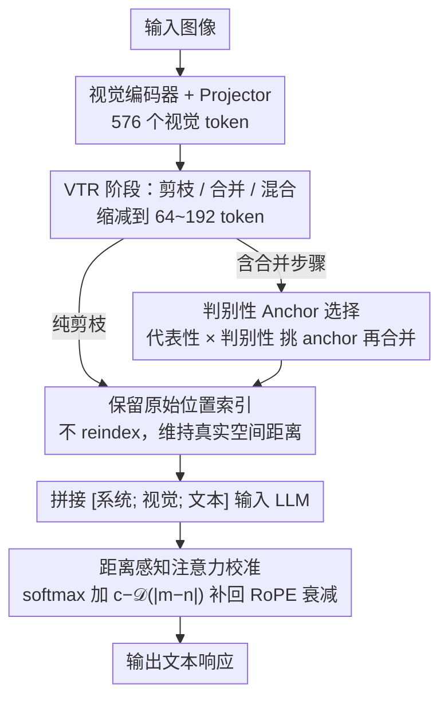

# RESTORE: 通过矫正失真改进视觉 Token 缩减以提升 MLLM 推理效率

**会议**: ICML 2026  
**arXiv**: [2606.01711](https://arxiv.org/abs/2606.01711)  
**代码**: https://cvlab.yonsei.ac.kr/projects/RESTORE (项目主页)  
**领域**: 多模态VLM / LLM效率  
**关键词**: 视觉 Token 缩减, MLLM 加速, RoPE 注意力校准, Anchor Token 选择, LLaVA  

## 一句话总结
RESTORE 把现有视觉 Token 缩减(VTR)中被忽略的"位置失真"和"注意力衰减"两个问题摆到台面上,通过给 RoPE 衰减加一个距离感知的反向补偿项,再用兼顾代表性与判别性的 anchor 选择策略改进 token 合并,使得 LLaVA-1.5-7B 在 64 token(约 11% 保留率)下仍能逼近全 token 性能。

## 研究背景与动机

**领域现状**:多模态大模型(MLLM,如 LLaVA、Qwen2.5-VL)把视觉 patch 编码成几百到几千个视觉 token,与文本 token 拼起来一起喂给 LLM。由于自注意力是 $O(N^2)$,这些视觉 token 是首要的算力/显存瓶颈。视觉 Token 缩减(Visual Token Reduction, VTR)路线由此兴起,主要分两派:一派靠剪枝(FastV、SparseVLM、HoloV)保留高注意力 token,丢弃其余;另一派靠合并(ToMe、PruMerge、VisionZip)把相似 token 聚合到代表性 anchor。

**现有痛点**:作者发现两类失真长期被忽略。其一是**位置失真**——缩减序列后,目前要么把保留 token 重新编号成连续位置(reindex 派),要么沿用原序列里的位置索引(retain 派)。前者破坏了视觉 token 与文本 token 之间真实的空间距离,后者则因为 RoPE 的长程衰减给远距离 token 严重打压。其二是**注意力衰减**——softmax 归一化使被剪掉那部分 token 原本占据的概率质量重新分配,文本 token 因为彼此距离近本就有更大 logits,合并/剪枝后视觉 token 整体注意力比例显著低于全序列基线,模型被迫"少看图、多猜文",导致幻觉与视觉 grounding 弱化。

**核心矛盾**:reindex 牺牲空间真实性换注意力总量,retain 保住空间真实性却失去注意力总量。两条路都没法同时兼顾"位置语义对齐"和"注意力分布对齐"。

**本文目标**:在不改动 LLM 权重、不增加显著推理开销的前提下,(1) 让缩减后的视觉序列保留原始位置索引以维持空间关系,(2) 同时把视觉 token 的总注意力比例拉回到全序列水准;(3) 在 token 合并时选出更具代表性的 anchor 以减少特征平均带来的细节丢失。

**切入角度**:既然 RoPE 的长程衰减函数 $\mathcal{D}(|m-n|)=\frac{2}{d_h}\sum_{j=1}^{d_h/2}\cos(|m-n|\theta_j)$ 是可解析推导出来的,那就直接构造一个**距离反向递增**的补偿项 $c-\mathcal{D}(|m-n|)$,把 RoPE 偷走的注意力以解析方式补回去。Anchor 选择则借鉴 density peak clustering 的思想,既要"是邻居们的中心",又要"互相之间足够远"。

**核心 idea**:用"距离感知的 softmax 校准"修正位置/注意力失真,用"代表性 × 判别性"双指标选 anchor,做成一个可插拔的 VTR 通用增强模块。

## 方法详解

### 整体框架
RESTORE 是一个挂在标准 MLLM(以 LLaVA-1.5 为代表)上的**通用 VTR 增强器**,不动 visual encoder,也不动 LLM,只改两个地方:LLM 内部计算 attention 的 softmax 公式,以及 token 合并阶段的 anchor 挑选逻辑。

整体流程:输入图像 → 视觉编码器输出 $\mathbf{X}_{\text{vis}}\in\mathbb{R}^{N_{\text{vis}}\times d}$($N_{\text{vis}}{=}576$) → VTR 阶段(任何剪枝/合并/混合方法都可)输出 $\hat{\mathbf{X}}_{\text{vis}}\in\mathbb{R}^{n_{\text{vis}}\times d}$($n_{\text{vis}}\in\{64,128,192\}$) → 保留 token 沿用全序列里的**原始位置索引** → LLM 在每个 attention 层使用**校准后**的 softmax → 输出文本响应。如果底层 VTR 包含合并步骤(如 VisionZip),合并时还会用 RESTORE 的判别性 anchor 选择策略替换原方法的 anchor 采样。也正因为只动 softmax 和 anchor 挑选这两处、不碰各 VTR 方法"挑哪些 token"的核心逻辑,RESTORE 成为一个能挂在 FastV、SparseVLM、ToMe、VisionZip、DivPrune、VisPruner、HoloV 等任意主干上的零训练通用增强器。

### 关键设计

**1. 距离感知注意力校准:保留原始位置索引,再把 RoPE 偷走的注意力解析地补回来**

这一步是图中 LLM 阶段(节点 G)的核心,也是 RESTORE 最主要的增益来源。痛点在于:缩减序列后,reindex 派把保留 token 重新编号成连续位置,破坏了视觉 token 与文本 token 间真实的空间距离;retain 派沿用原始索引保住了空间关系,却因为 RoPE 的长程衰减把远距离视觉 token 的注意力 logit 压低,再经 softmax 归一化,概率质量被重分配给距离更近、logit 更大的文本 token,视觉 token 的总注意力比例整体跌破全序列基线,模型于是"少看图、多猜文",引发幻觉与 grounding 弱化。RESTORE 选择保留原始位置索引(守住空间真实性),再在每层 attention 的 softmax logit 上加一个解析校准项,把被衰减偷走的注意力补回来。

具体做法是先把 RoPE 的长程衰减从注意力 logit 中解析隔离出来,得到只随相对距离变化的衰减函数 $\mathcal{D}(|m-n|)=\frac{2}{d_h}\sum_{j=1}^{d_h/2}\cos(|m-n|\theta_j)$。校准后的注意力为 $\hat{A}_{m,n}=\frac{\exp(z_{m,n}+\log s_n(c-\mathcal{D}(|m-n|)))}{\sum_{i}\exp(z_{m,i}+\log s_i(c-\mathcal{D}(|m-i|)))}$,其中 $z_{m,n}$ 是原始 logit,$s_n$ 是第 $n$ 个 token 合并的原始 token 数,$c$ 是保证补偿量非负的常数。这里 $\log s_n$ 沿用 ToMe 的"合并 token 按比例放大"做法,而 $(c-\mathcal{D})$ 是 RESTORE 的新增项——距离越远 $\mathcal{D}$ 越小、补偿量 $(c-\mathcal{D})$ 越大,恰好反向对冲 RoPE 对远距离视觉 token 的打压。

为什么单靠 ToMe 的 $\log s_n$ 不够?因为它只考虑"合并了多少 token",在纯视觉任务里足够,但 MLLM 里文本 token 彼此距离近、logit 天然大,$\log s_n$ 救不回被 softmax 抢走的视觉注意力。RESTORE 把"位置距离"这一因素单独拎出来反向补偿,于是同时守住了 retain 派想要的真实空间关系和 reindex 派想要的注意力总量。论文进一步把校准项推广到 M-RoPE(Qwen2.5-VL 用的多模态 RoPE),因此 1D 与多维空间编码都适用。消融实验中,这一项几乎拉满了所有 VTR 主干的性能差距,其中 POPE(幻觉评测)涨幅最明显,与"视觉 grounding 被恢复"的解释一致。

**2. 判别性 Anchor Token 选择:让合并用的 anchor 既像邻域中心、又互不冗余**

这一步对应图中合并分支(节点 D),只在底层 VTR 含合并步骤时生效。痛点在于:token 合并要把一簇相似 token 聚到代表性 anchor 上,但 PruMerge 挑高注意力 token、VisionZip 用均匀采样,都不保证 anchor 与被它合并的 token 真的相似——anchor 不像"邻域中心",平均下来反而把细节抹糊;反过来,若同时选了几个互相高度相关的 anchor,又会让有限的 token 预算浪费在重复区域上。

RESTORE 借鉴 density peak clustering,用一次预计算的成对相关矩阵 $\mathbf{C}=\mathbf{X}_{\text{vis}}\mathbf{X}_{\text{vis}}^T/\|\mathbf{X}_{\text{vis}}\|^2$ 同时刻画两个指标。**代表性** $\mathcal{R}_i=\sum_j \mathbf{C}_{ij}$ 是该 token 对其他所有视觉 token 的相关度之和,值越大越像聚类中心。**判别性** $1-\max_j \hat{\mathbf{C}}_{ij}$ 则衡量独特性:先用二值掩码 $\mathbf{M}_{ij}=\mathbb{I}(\mathcal{R}_j>\mathcal{R}_i)$ 只保留"比自己更中心"的对手,得到屏蔽后的相关矩阵 $\hat{\mathbf{C}}$,再取它与最强对手的最大相似度——若某 token 没被任何更强对手高度覆盖,这个最大值就小、$1-\max$ 就大,说明它捕捉了别处没有的独特特征。最终 anchor 集合 $\mathcal{A}=\operatorname{Top-K}(\mathcal{R}_i\odot(1-\max_j\hat{\mathbf{C}}_{ij}))$ 取两个指标乘积最大的 Top-K,其余 token 各自并入与之相关度最高的 anchor。

这样代表性保证 anchor 是邻域中心、减少平均带来的模糊,判别性则避免选出一堆彼此冗余的 anchor。关键是两个指标都从同一个相关矩阵 $\mathbf{C}$ 复用而来,不引入任何额外计算开销。在 VisionZip 这类含合并的主干上,它能在校准之上再带来约 +0.3~0.5% 的提升。

### 损失函数 / 训练策略
RESTORE 是**纯推理期模块**,不引入任何可训练参数,也不需要重训 LLM 或 visual encoder。校准项 $c$ 是固定常数,长程衰减 $\mathcal{D}$ 完全由 RoPE 频率参数 $\theta_j$ 解析给出;anchor 选择只依赖特征相关矩阵,在 visual encoder 前向时一次性算完。因此插到任何已训好的 MLLM 上都是零训练成本。

## 实验关键数据

### 主实验
基础模型为 LLaVA-1.5-7B,在 GQA、MMB、MME、POPE、SQA$^{\text{IMG}}$、VQA$^{\text{V2}}$、VQA$^{\text{Text}}$、SEED 共 8 个 benchmark 上评测,以"相对全 token 平均得分百分比"作为综合指标。下表选取 192 token(保留 33.3%)挡的代表性对比:

| 方法 | 类型 | 平均得分 | GQA | MME | POPE | VQA$^{\text{V2}}$ |
|------|------|---------|-----|-----|------|-------------------|
| LLaVA-1.5-7B(全 576 token) | baseline | 100.0% | 61.9 | 1862 | 85.9 | 78.5 |
| FastV | text-aware | 96.0% | 57.1 | 1821 | 75.8 | 74.7 |
| SparseVLM | text-aware | 98.1% | 59.5 | 1782 | 85.4 | 77.0 |
| VisionZip | hybrid | 96.8% | 59.2 | 1749 | 85.2 | 77.2 |
| **VisionZip + RESTORE** | hybrid | **98.0%** | **60.6** | **1782** | **86.6** | 77.0 |
| DivPrune | text-agnostic | 96.9% | 58.9 | 1723 | 86.5 | 76.1 |
| **DivPrune + RESTORE** | text-agnostic | **98.7%** | **60.9** | **1813** | 86.6 | **77.4** |
| HoloV | text-agnostic | 96.5% | 58.6 | 1779 | 85.0 | 76.0 |
| **HoloV + RESTORE** | text-agnostic | **98.8%** | **61.0** | **1793** | **86.6** | **77.6** |

在更激进的 128 token(22.2%)挡,FastV 已经掉到 91.8%、PDrop 崩到 84.5%,而挂上 RESTORE 的 text-agnostic 主干仍能稳定在 95%+ 区间;论文进一步在 64 token(11.1%)挡展示 RESTORE 把多个 VTR 主干推近"近全 token"性能。

### 消融实验
| 配置 | 平均得分(192 token) | 说明 |
|------|---------------------|------|
| HoloV(baseline) | 96.5% | 仅剪枝,reindex 位置 |
| + 保留原始位置索引 | 略降 | 失去注意力总量,验证 retain 派痛点 |
| + 距离感知校准($c-\mathcal{D}$) | 98.4% | 把注意力总量拉回基线,主要增益来源 |
| + 判别性 anchor(用于含合并的 VTR) | +0.3~0.5% | 在 VisionZip 等合并方法上的额外增益 |
| **完整 RESTORE** | **98.8%** | 校准 + anchor 选择共同生效 |

### 关键发现
- **校准项是主要贡献者**:把保留原始位置索引带来的注意力总量损失通过 $c-\mathcal{D}$ 反向补回去,几乎拉满了所有 VTR 主干的性能差距,POPE(幻觉评测)涨幅尤为明显,与"视觉 grounding 被恢复"的解释一致。
- **方法对 VTR 主干无偏好**:无论是 text-aware(SparseVLM)、text-agnostic(HoloV、DivPrune、VisPruner) 还是混合(VisionZip),RESTORE 都能稳定带来 1.5–2.3 个点的平均增益,说明问题确实出在 VTR 范式而非某个具体方法。
- **越激进的缩减,RESTORE 越关键**:192 token 挡平均增益约 1.5 点,128 token 挡升至 2+ 点,64 token 挡差距进一步拉大——视觉注意力衰减问题在 token 数越少时越严重。
- **M-RoPE 上同样有效**:在 Qwen2.5-VL 使用的多模态 RoPE 下校准项可解析地推广,实验上验证了一致的增益。

## 亮点与洞察
- **把 RoPE 的解析性"反向用"**:不是把 RoPE 当黑盒,而是把它的长程衰减函数 $\mathcal{D}$ 整个拿出来当反向补偿信号,代价只是几行 cos 求和,推理开销几乎为零;这种"解析地修正模型 prior"的思路可迁移到任何带相对位置编码的高效推理场景。
- **首次把 VTR 的失真问题拆成"位置失真 + 注意力失真"两个独立维度**,并通过图 2 给出可视化证据,论证 reindex 派和 retain 派都不对,推动这个子领域跳出"挑 token 策略"的内卷竞争。
- **"代表性 × 判别性"复用了一次预算外的矩阵**,把 density peak clustering 引入 token 合并很自然,几乎没增加开销又解决了"anchor 不像中心"的老问题——这个 anchor 选择思路适用于任何需要从一组特征里挑代表元的场景(如 prototype learning、聚类初始化)。
- **零训练插件式部署**:不需要重训 MLLM,直接挂在已部署的 LLaVA/Qwen2.5-VL 上即可。对工业部署友好。

## 局限与展望
- **依赖底层 VTR 仍要做 token 选择**:RESTORE 不替代 VTR,而是改进 VTR。若底层方法把关键 token 误剪(如 FastV 在 128 token 挡崩塌到 91.8%),校准也救不回来——校准只能修注意力分布,救不了信息缺失。
- **校准常数 $c$ 是固定的**:虽然论文给出了它的选择原则,但对不同分辨率/不同 token 数挡的最佳 $c$ 可能不同,缺乏自适应机制。
- **anchor 选择基于纯视觉相似度**:没有引入文本/任务感知,对于 text-aware VTR 而言可能错过"文本相关但视觉不显著"的 patch。可以考虑把文本-视觉互信息引入 $\mathcal{R}$ 的定义。
- **生成式任务上未充分验证**:8 个 benchmark 偏判别/问答类,长文本生成下的视觉 grounding 是否同样恢复,需要更多评测。

## 相关工作与启发
- **vs FastV / SparseVLM(text-aware 剪枝)**: 他们靠跨模态 attention 挑 token,但仍要在 LLM 前几层做完整 attention 才能决定剪谁,推理成本高;且没考虑剪掉后位置/注意力失真。RESTORE 不参与"挑谁",但通过修注意力分布让所有 text-aware 方法都涨点。
- **vs ToMe / VisionZip(token 合并)**: ToMe 的 $\log s_n$ 在纯视觉任务里足够,但 MLLM 里文本干扰让它失效,RESTORE 用 $(c-\mathcal{D})$ 补齐这一环;VisionZip 的均匀采样 anchor 被 RESTORE 的代表性+判别性策略替代,合并质量更高。
- **vs DivPrune(基于多样性的剪枝)**: DivPrune 强调被保留 token 之间互相远离以保多样性,RESTORE 的判别性度量动机相似但目标不同——前者剪枝时挑互相远的,后者合并时挑既近邻居又互相远的。两者实际可叠加,实验也证明 DivPrune + RESTORE 是 192 token 挡最强组合之一。
- **vs HoloV(动态预算分配)**: HoloV 解决"哪里多留 token"问题,RESTORE 解决"留下的 token 注意力对不对"问题,两者正交且可叠加,叠加后达到 192 token 挡的 98.8% 最佳成绩。

## 评分
- 新颖性: ⭐⭐⭐⭐ 第一次把 VTR 的注意力/位置失真摆上桌并给出解析解,anchor 选择则是已有思想的精巧迁移。
- 实验充分度: ⭐⭐⭐⭐⭐ 8 benchmark × 3 缩减比 × 5+ 主干 VTR × M-RoPE 推广,验证非常彻底。
- 写作质量: ⭐⭐⭐⭐ 图 1/图 2 把问题讲得很清楚,公式推导紧凑;部分章节稍密集需要反复读。
- 价值: ⭐⭐⭐⭐⭐ 零训练插件、普适增益、工业可部署,是 MLLM 推理加速领域的"通用工具"。

<!-- RELATED:START -->

## 相关论文

- [\[CVPR 2026\] Rethinking MLLM Itself as a Segmenter with a Single Segmentation Token](../../CVPR2026/multimodal_vlm/rethinking_mllm_itself_as_a_segmenter_with_a_single_segmentation_token.md)
- [\[AAAI 2026\] Filter, Correlate, Compress: Training-Free Token Reduction for MLLM Acceleration](../../AAAI2026/multimodal_vlm/filter_correlate_compress_training-free_token_reduction_for_.md)
- [\[ICML 2026\] V-LynX: Token Interface Alignment for VideoX LLMs](v-lynx_token_interface_alignment_for_videox_llms.md)
- [\[ICML 2026\] WeatherSyn: An Instruction Tuning MLLM For Weather Forecasting Report Generation](weathersyn_an_instruction_tuning_mllm_for_weather_forecasting_report_generation.md)
- [\[ICML 2026\] ECG-R1: Protocol-Guided and Modality-Agnostic MLLM for Reliable ECG Interpretation](ecg-r1_protocol-guided_and_modality-agnostic_mllm_for_reliable_ecg_interpretatio.md)

<!-- RELATED:END -->
