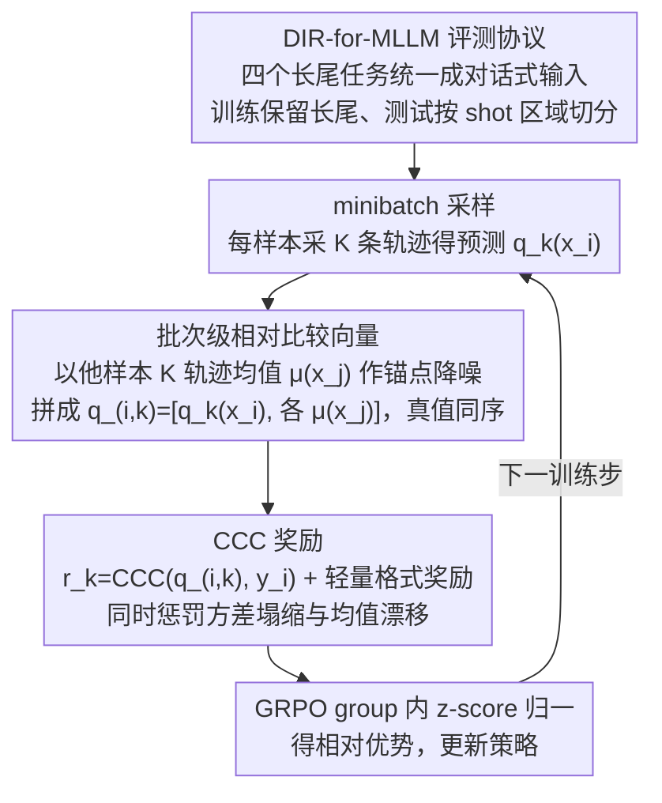

# Injecting Distributional Awareness into MLLMs via Reinforcement Learning for Deep Imbalanced Regression

**会议**: ICML 2026  
**arXiv**: [2605.01402](https://arxiv.org/abs/2605.01402)  
**代码**: 论文称会接收后释放（暂无）  
**领域**: 多模态VLM / 强化学习 / 深度不平衡回归  
**关键词**: MLLM 回归, 长尾分布, GRPO, 一致相关系数, 批次级奖励

## 一句话总结
本文把 MLLM 的连续值回归在长尾分布下的"回归到均值"问题转化为分布感知的 RL 问题，在 GRPO 框架内用 Concordance Correlation Coefficient (CCC) 作为批次级奖励——既看相关性、又看方差、又看均值——从而显式惩罚预测分布塌缩；在 4 个长尾回归任务、Qwen2.5-VL-3B/7B 上稳压 SFT、SoftLabel、各种 point-wise RL，特别是 medium/few-shot 区域 MAE 大幅下降。

## 研究背景与动机

**领域现状**：MLLM 越来越多被用来"回归连续值"（年龄、评分、骨龄等），但目前主流套路是 token-level SFT（把数字按 token 拆开做交叉熵）或 GRPO + 点对点回归奖励（MAE、Reward Reward 等）。

**现有痛点**：(i) Token-level SFT 把回归当离散分类，对"5 岁预测成 6 岁"和"5 岁预测成 50 岁"可能产生同样的 token loss，完全不感知数值距离；(ii) 长尾监督下，多数样本集中在头部，SFT 让模型预测向均值塌缩（Fig 1 直观可见）；(iii) 现有针对回归的方法要么改架构（Rex-Omni 加坐标 token、GEODE 加回归头）破坏 MLLM 统一生成框架，要么靠 CoT reasoning 推理慢，要么 SoftLabel 把硬 one-hot 平滑——但都还是"逐 token 局部信号"；(iv) RL 方法（Visual-RFT、VLM-R1、Perception-R1）的 reward 仍是 per-sample MAE，独立评估每个样本，对长尾结构无能为力。

**核心矛盾**：长尾回归需要"跨样本相对关系"才能保持全局分布结构，而 SFT 和 per-sample RL reward 都只看单点误差，根本传不出"你不能把所有样本都预测成中位数"这件事。

**本文目标**：(i) 不改架构、不上 CoT，纯 post-training 解决 MLLM 长尾回归塌缩；(ii) 让监督信号能感知"预测分布 vs 真值分布"的一致性；(iii) 显式惩罚 mean collapse 和方差塌缩。

**切入角度**：作者发现 RL 的优势在于"可以在解码后的数值上算任意奖励"，于是与其奖励"单点接近真值"，不如奖励"一批预测的分布接近一批真值的分布"——把"数值"问题先升级成"分布"问题。

**核心 idea**：把 minibatch 内每个采样预测和其他样本的平均预测拼成一个向量，与对应的真值向量算 CCC，用 CCC 作为奖励——CCC 同时奖励相关性、惩罚方差塌缩、惩罚均值漂移，三件事一起做。

## 方法详解

### 整体框架
GRPO 框架不变：对每个输入 $x_i$ 采样 $K$ 条生成轨迹得到数值预测 $\{q_k(x_i)\}_{k=1}^K$，并取均值 $\mu(x_i) = \frac{1}{K}\sum_k q_k(x_i)$ 作稳定锚点。评估第 $k$ 条轨迹时，把它与 minibatch 内其他样本的均值预测拼成 $\mathbf{q}_{i,k} = [q_k(x_i), \{\mu(x_j)\}_{j\neq i}]$，对应真值向量 $\mathbf{y}_i = [y_i, \{y_j\}_{j\neq i}]$；奖励 $r_k(x_i) = \text{CCC}(\mathbf{q}_{i,k}, \mathbf{y}_i)$；再加一个轻量格式校验奖励确保解码可解析。最后按标准 GRPO 在 group 内归一化得相对优势更新策略。整条管线唯一动过的就是 reward——把它从「逐点接近真值」换成「分布接近真值」，其余优化器、采样、架构全部沿用。

### 关键设计

**1. 批次级相对比较向量：把每个预测放进「群体」里评价，引入跨样本关系**

传统 GRPO 的 reward 是 $r_k=\text{MAE}(q_k, y_i)$，永远只盯单点——只要每个样本各自「贴近自己的真值」就给奖励，可这恰恰鼓励模型把所有样本都往高密度区域塌缩。要打破这点，就得让 reward 看到「群体分布形状」。具体做法是：对 minibatch $\{x_1,\ldots,x_B\}$ 每个样本采 $K$ 条轨迹，评估某条预测 $q_k(x_i)$ 时不再孤立地看它和 $y_i$ 的距离，而是把它和「其他 $B-1$ 个样本的均值预测」拼成一个长度 $B$ 的向量 $\mathbf{q}_{i,k}=[q_k(x_i),\{\mu(x_j)\}_{j\neq i}]$，真值侧按同样下标顺序拼成 $\mathbf{y}_i=[y_i,\{y_j\}_{j\neq i}]$，再把这两个向量送去算分。用其他样本的均值 $\mu(x_j)$ 当锚点、而不是随手抓一条采样，是为了压低交叉样本随机性带来的奖励噪声。这样一来，「你不能把所有人都预测成同一个值」这条信号就被嵌进了 reward 向量、进而传进梯度。

**2. CCC 奖励：一个标量同时管相关、方差、均值三件事**

把比较向量送进谁来打分？本文选了一致相关系数（Concordance Correlation Coefficient）：

$$\text{CCC}(\mathbf{q}, \mathbf{y}) = \frac{2\,\text{Cov}(\mathbf{q}, \mathbf{y})}{\text{Var}(\mathbf{q}) + \text{Var}(\mathbf{y}) + (\mu_{\mathbf{q}} - \mu_{\mathbf{y}})^2}$$

它的几何结构刚好对准长尾塌缩的两大病灶。分子是协方差，奖励排序一致；分母里 $\text{Var}(\mathbf{q})$ 一旦太小（预测全挤成一个值）就会把整体分数压下去，$(\mu_{\mathbf{q}}-\mu_{\mathbf{y}})^2$ 一旦太大（系统性偏向 head 中心）也会被惩罚。换句话说，「方差塌缩」和「均值漂移」这两个长尾回归最典型的失败模式，被 CCC 分母的两项各打一棒。相比之下，纯 Pearson 只奖相关、不管尺度和均值，纯 ranking 只管顺序、不管具体数值，都治不住塌缩；在样本稀疏的 few-shot 区域，CCC 也比 Pearson 更不容易给出「看着相关、实则压缩」的伪好结果。

**3. DIR-for-MLLM 评测协议：先把长尾回归的公平 benchmark 搭起来**

经典的深度不平衡回归（DIR）方法全都长在 CNN + 回归头上，没有 token-decoder 这种生成式设定，方法之间各用各的 split，根本没法横向比。所以本文先把评测地基打平：把 AgeDB-DIR、IMDB-WIKI-DIR、作者新构的 IMDB-Movie-DIR（电影海报评分）、BoneAge-DIR 四个长尾任务统一改写成 dialogue 格式的 MLLM 输入，训练集保留自然长尾分布、测试集按 shot 区域切分（many >100、medium 20–100、few <20）以平衡评估，合计 129k+ 样本，并用 MAE 加 GM（几何均值，对各区域均匀性更敏感）作指标。有了这套统一协议，后面 CCC-GRPO 和各种 baseline 的比较才站得住，否则都是无源之水。

### 损失函数 / 训练策略
完全沿用 GRPO 优化器，不改算法本身，只换 reward；reward = CCC + 轻量格式奖励；group 内 z-score 归一得相对 advantage；backbone 用 Qwen2.5-VL-3B 和 7B；测试集 shot-aware 评估保证 head/tail 对比公平。

## 实验关键数据

### 主实验

| 数据集 | 方法 (Qwen2.5-VL-3B) | All MAE | Many MAE | Medium MAE | Few MAE |
|--------|----------------------|---------|----------|------------|---------|
| AgeDB-DIR | SFT | 6.37 | 5.78 | 7.67 | 8.36 |
| AgeDB-DIR | Regression Reward (Tan 2025) | 5.85 | 5.48 | 6.52 | 7.58 |
| AgeDB-DIR | DISCO MAE Reward | 5.95 | 5.64 | 6.73 | 6.75 |
| AgeDB-DIR | **CCC-GRPO (Ours)** | **5.52** | 5.42 | **5.62** | **6.40** |
| IMDB-Movie-DIR | SFT | 7.44 | 4.87 | 11.21 | 21.51 |
| IMDB-Movie-DIR | Regression Reward | 7.42 | 5.06 | 10.51 | 21.14 |
| IMDB-Movie-DIR | **CCC-GRPO** | **6.89** | 5.60 | **8.12** | **16.35** |

7B 上同样最佳：AgeDB All MAE 5.33 vs SFT 5.82；Movie All MAE 5.95 vs SFT 6.42。

### 消融实验

| 设置 | 关键现象 | 说明 |
|------|---------|------|
| SFT（point-wise CE） | 预测向 head 塌缩（Fig 1） | 长尾塌缩基线 |
| GRPO + MAE reward | 仍 per-sample，无跨样本结构 | 在 medium / few 区改善有限 |
| GRPO + DISCO MAE (Zhou 2025) | 频次加权 reward | medium / few 略好但仍点对点 |
| **GRPO + CCC reward (Ours)** | 显式惩罚 collapse + 漂移 | medium / few 大幅下降 |
| BoneAge-DIR（多峰分布） | CCC-GRPO 仍优 | 相对 SFT 整体 MAE 提升 23.55%（Table 12） |

### 关键发现
- **medium / few-shot 收益最大**：Movie 上 few-shot MAE 从 SFT 的 21.51 降到 16.35（−24%），AgeDB few-shot 从 8.36 降到 6.40（−23%），印证 CCC 主要修复"长尾压缩"。
- **不牺牲 head**：many-shot MAE 与 SFT/Reg Reward 基本持平甚至略升（如 Movie 上 4.87→5.60），但带来 medium/few 的大幅收益，是有意义的 trade-off。
- **GM 改善尤为可观**：AgeDB many GM 5.78→5.42 等，说明误差分布更均匀而非被几个大错主导。
- **BoneAge 多峰分布场景**：训练标签是多峰（不是单纯长尾），CCC-GRPO 仍能整体提升 23.55%，说明 reward 不依赖"单峰长尾"假设，而是泛化地奖励"分布形状一致"。
- **VisualQuality 反例**：CoT-based 方法 VisualQuality 在 Movie 等任务上 MAE 高达 24.43，说明对感知回归不合适——这反衬出 post-training 选 reward 比上 reasoning 更对症。

## 亮点与洞察
- **"reward 形状决定预测形状"**：本文最大启发是 GRPO 的 reward 可以塑造预测的整体分布——把 reward 从"逐点相似"换成"分布相似"，模型自然学会保留方差和尺度，不需要任何架构或损失级 hack。
- **CCC 是个被低估的指标**：在医学/心理测量长用，但 RL reward 里几乎没人用；它"相关 + 方差 + 均值"三合一的几何属性正好把长尾塌缩两大病灶一并按住，迁移到 RM / preference learning 也值得试。
- **群体内"他人均值锚点"思路**：把 $\mu(x_j)$ 当其他样本的代表降噪，类似 Polyak 平均，是个简单但有效的减低 reward variance 的技巧。
- **建立 DIR-for-MLLM benchmark**：把分类时代成熟的 DIR 协议平移到生成式 MLLM 上，会促进后续大量工作。

## 局限与展望
- CCC reward 要求 minibatch 内有足够多样性才有意义，对小 batch（<8）或类内方差极小的场景效果可能退化，没做 batch size 敏感性。
- 只在 4 个 2D 视觉回归任务测试，对多变量回归（如 bbox 4 维、3D 姿态）是否需要扩展成多变量 CCC 未涉。
- 形式化目标里 CCC 是非可导信号，靠 GRPO 的 policy gradient 估计；当 $K$ 比较小时方差仍较大，论文没分析 $K$ 的最佳取值。
- 没和最新的 DAPO、RLOO 等 GRPO 变体对照，无法判断 reward 改进与 optimizer 改进是否互补。
- 论文没正式发布代码（"after acceptance"），复现需要等。

## 相关工作与启发
- **vs 经典 DIR (Yang 2021, RankSim, VIR)**：经典方法用回归头 + label/feature smoothing，无法用于 token-decoder MLLM；本文等价于把"分布平滑"的思想搬到 reward 层。
- **vs SoftLabel (Wang 2025b)**：SoftLabel 在 token loss 层平滑监督，仍是局部 token 信号；CCC 在序列级 reward 操作，跨样本，量级更高。
- **vs DISCO MAE Reward (Zhou 2025)**：DISCO 按 domain/difficulty 缩放 reward 仍是 per-sample；CCC 干脆把"样本间关系"当 reward 的一阶项。
- **vs Reasoning-based VisualQuality (Wu 2025)**：CoT 推理对感知回归基本不奏效，本文说明"reward 选对"比"上 reasoning"更重要。
- **vs Rex-Omni / GEODE**：他们改 vocab 或加 head 重训，重；本文不动架构，post-training 即可。

## 评分
- 新颖性: ⭐⭐⭐⭐ 把 CCC 引入 RL reward 并显式针对长尾回归的"分布塌缩"，是相对清新的组合。
- 实验充分度: ⭐⭐⭐⭐ 4 个数据集 × 2 个 backbone × 多类 baseline + shot-aware 协议 + 排序误差曲线，密度算可以；少了 batch size、K 数等关键消融。
- 写作质量: ⭐⭐⭐⭐ Fig 2 三栏对比把 SFT / GRPO / CCC-GRPO 差别讲得极清晰，Fig 5 用 MAE gain 直接展示长尾区域收益。
- 价值: ⭐⭐⭐⭐ 给"MLLM 做精细数值预测"提供了一个不改架构、即插即用的方案，对工业落地（年龄、骨龄、评分预测）很实用。

<!-- RELATED:START -->

## 相关论文

- [\[ICML 2026\] iVGR: Internalizing Visually Grounded Reasoning for MLLMs with Reinforcement Learning](ivgr_internalizing_visually_grounded_reasoning_for_mllms_with_reinforcement_lear.md)
- [\[ICML 2026\] Deep Pre-Alignment for VLMs](deep_pre-alignment_for_vlms.md)
- [\[CVPR 2026\] TempR1: Improving Temporal Understanding of MLLMs via Temporal-Aware Multi-Task Reinforcement Learning](../../CVPR2026/multimodal_vlm/tempr1_improving_temporal_understanding_of_mllms_via_temporal-aware_multi-task_r.md)
- [\[CVPR 2026\] Visual Reasoning through Tool-supervised Reinforcement Learning](../../CVPR2026/multimodal_vlm/visual_reasoning_through_tool-supervised_reinforcement_learning.md)
- [\[ICML 2026\] Multimodal Continual Learning with MLLMs from Multi-scenario Perspectives](multimodal_continual_learning_with_mllms_from_multi-scenario_perspectives.md)

<!-- RELATED:END -->
