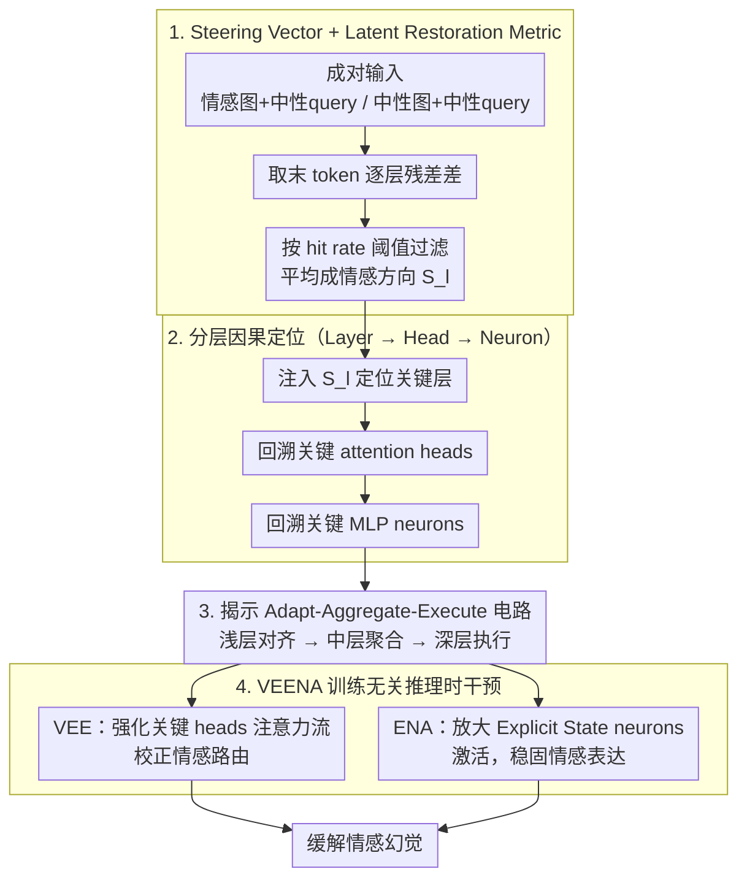

# VEENA: Interpreting and Enhancing Emotional Circuits in Large Vision-Language Models via Cross-Modal Information Flow

**会议**: ICML 2026  
**arXiv**: [2605.21980](https://arxiv.org/abs/2605.21980)  
**代码**: 待确认  
**领域**: 多模态VLM / 机制可解释性 / 情感理解  
**关键词**: 情感电路, steering vector, 因果干预, 注意力头定位, 训练无关推理时干预

## 一句话总结
VEENA 用 steering-vector 因果归因框架定位 LVLM 的情感电路——发现其遵循"Adapt（浅层模态对齐）→Aggregate（中层 emotion-specific heads 聚合）→Execute（深层 emotion-general heads + neurons 生成）"三段式机制，进而用"视觉情感增强 + 情感神经元放大"做训练无关推理时干预，显著缓解情感幻觉。

## 研究背景与动机

**领域现状**：LVLM 从静态感知模型走向"共情 agent"，但 emotional hallucination 严重（描述哭脸为开心）；与 object hallucination 不同，情感失对齐违反社会规范、伦理边界。现有方法走 visual instruction tuning + RLHF 等黑盒数据驱动路线，没保证内部对齐。

**现有痛点**：LVLM 情感电路完全 unexplored——LLM 上的机制可解释性已能定位情感处理组件（Tak 2025、Lee 2025），但 LVLM 的方法学不能直接搬：（1）**缺反事实**：LLM 用词汇替换（happy ↔ sad），LVLM 怎么"只改情感不改叙事"？（2）**离散度量失效**：情感是 diffusive 的（长文本整体情绪 tone），Next-Token-Prediction logit 抓不到。

**核心矛盾**：要做 LVLM 情感的因果分析，需要（a）controllable 视觉反事实 + （b）连续的潜空间度量，而非 LLM-style 词替换 + logit difference。

**本文目标**：（1）建立 LVLM 情感电路因果分析的方法论；（2）定位关键层 / 头 / 神经元；（3）基于发现做训练无关的推理时干预缓解情感幻觉。

**切入角度**：（1）用 steering vector 替代 logit difference——通过 paired emotional vs neutral 输入对从隐藏态提取情感方向 $S_l$，把"情感"变成可干预的连续向量；（2）用 hit rate（命中标准化情感轮的 token 比例）替代 NTP 准确率作 latent restoration metric；（3）coarse-to-fine 分层定位——先找关键层，再回溯 heads / neurons。

**核心 idea**：steering vector 探针 + latent restoration metric + 分层因果归因 → 揭示"Adapt-Aggregate-Execute"机制 → 设计 VEENA（VEE 强化注意力流 + ENA 放大语义激活）做推理时干预。

## 方法详解

### 整体框架

VEENA 分两阶段，先把情感电路解析出来，再据此做推理时干预。Stage I 从成对的情感/中性输入里提取每一层的情感方向向量 $S_l$（按 hit rate 阈值过滤掉无效样本）；Stage II 拿 $S_l$ 当探针，coarse-to-fine 地逐级定位——先找关键层（注入 $S_l$ 看 hit rate 怎么变），再回溯关键 attention heads（backward activation patching），最后落到关键 MLP neurons，勾勒出 LVLM 情感处理的"Adapt→Aggregate→Execute"三段式电路。有了这张电路图，VEENA 再用两个训练无关的推理时手术——VEE 强化关键 attention heads 的情感注意力流，ENA 放大 Explicit State Neurons 的语义激活——直接缓解情感幻觉。

### 关键设计

**1. Steering Vector + Latent Restoration Metric：让 LVLM 的情感因果分析在连续潜空间可行**

LLM 上做情感机制分析靠的是词汇替换（happy ↔ sad）反事实 + logit difference，但这套搬不到 LVLM：一是 LVLM 的情感是 diffusive 的——它弥散在整段叙述的语气里，Next-Token-Prediction 的单 token logit 根本抓不到；二是视觉反事实很难"只改情感不改叙事"。VEENA 改用 steering vector 当探针：构造成对输入 $X^+ = \text{Concat}(I_{emo}, T_{neu})$（情感图 + 中性 query）和 $X^- = \text{Concat}(I_{neu}, T_{neu})$（中性图 + 同一中性 query），取最后 token 在每层的 residual 差 $s_{i,l} = h^+_{i,l,N} - h^-_{i,l,N}$，再按 hit rate $\mathcal{H}(X_i^+, y_i) > \tau$（命中标准化情感词的 token 比例）过滤出有效样本，平均成全局方向 $S_l = \tfrac{1}{|\mathcal{U}|}\sum_{i \in \mathcal{U}} s_{i,l}$。

这一步的价值在于把"情感"变成一个可加可减的连续向量：注入 $+\alpha S_l$ 就能测它对输出的因果效应，评估用 hit rate 也比脆弱的 logit difference 鲁棒得多，从而为后面所有因果干预提供了统一的"探针 + 度量"。

**2. 分层因果定位（Layer → Head → Neuron）：从粗到细勾出情感电路**

直接在几千个 head 或上万个 neuron 里大海捞针，信噪比太差。VEENA 用 coarse-to-fine 三级搜索：先定位关键层——把 $S_l$ 注入中性样本 $\tilde h^-_{j,l,t} = h^-_{j,l,t} + \alpha S_l$，看 hit rate 的相对变化 $\mathcal{C}$ 在哪些层最大；再在关键层内找关键 heads——用 emotional intention $\mathcal{I}(A_c) = \text{sim}(A_c, S_l)$ 衡量每个 head 的注意力与情感方向的对齐度，并配合 backward activation patching 验证因果；最后回溯到 MLP neurons，看哪些神经元的激活与 $S_l$ 高度对齐。

层层收窄的好处是每一级的结果都能独立解释、互相印证，既高效又避免了在 head/neuron 粒度上直接搜索带来的噪声。

**3. Adapt-Aggregate-Execute 机制 + 功能解耦：情感"识别"与"表达"分居两层**

分层定位最终拼出一条清晰的三段式回路：浅层（Adapt）做视觉特征的模态对齐；中层（Aggregate）里 Contextual Trigger Neurons 先编码情境线索，emotion-specific heads 再把信号聚合到 Query token（相当于一个视觉摘要器），且不同情感会点亮不同的 heads；深层（Execute）则由 Query token 激活 Explicit State Neurons（编码情感本身）、再驱动 emotion-general heads 生成叙述。

最关键的发现是中层与深层的功能解耦（functional decoupling）——中层 heads 对情感类别敏感（emotion-specific，负责"是什么情感"的路由），深层 heads 不挑情感、只管表达强度（emotion-general，负责"怎么表达"）。识别与执行分居两层、机制各异，这一发现既揭示了 LVLM 区别于 LLM 的情感处理结构，也为下面"分两路精准干预"提供了直接依据。

**4. VEENA 推理时干预：VEE 校正路由 + ENA 稳固表达**

既然识别（中层路由）和执行（深层表达）分居两层、机制不同，VEENA 就分两路、训练无关地各做一件事，直接打在已 SFT 完的模型上。VEE（Visual Emotion Enhancement）按"流向感知"的方式放大关键 heads 的注意力：prefill 阶段（$t=0$）在关键中层 $l_{emo}$ 及以下放大 $V\to Q$ 注意力，把视觉情感线索聚合进 Query token；decoding 阶段（$t>0$）在深层放大 $V\to L$ 注意力，让每个生成 token 都锚在细粒度视觉细节上——两处都给注意力分数乘一个增强系数 $\beta>1$。ENA（Emotional Neuron Augmentation）补上语义侧：对定位到的 top-$K$ Explicit State Neurons 的激活乘一个激励系数 $\gamma>1$，放大 MLP 里存的情感语义知识。

VEE 管"信息怎么流"、ENA 管"语义有多强"，恰好对应被解耦的中层路由与深层表达两个环节；两者都即插即用、不更新任何参数，从而精准缓解情感幻觉。

### 损失函数 / 训练策略

VEENA 是纯推理时干预，不更新任何参数、不需要训练数据；只在前向时对选定 heads 的注意力分数乘增强系数 $\beta$、对选定 neurons 的激活乘激励系数 $\gamma$。

## 实验关键数据

### MER-UniBench 主结果（hit rate $\mathcal{H}$）

| 方法 | LLaVA-1.5-7B | LLaVA-1.6-13B | Qwen2-VL-7B |
|------|------|------|------|
| Baseline | 38.2 | 42.7 | 45.6 |
| + 训练数据扩充 | 41.5 | 44.8 | 47.2 |
| + RLHF | 43.7 | 46.1 | 48.5 |
| **+ VEENA (训练无关)** | **48.9** | **51.6** | **53.4** |

VEENA 训练无关却超 RLHF 等需训练方法 4-5 个点，证明 mechanistic intervention 比黑盒优化更精准。

### 三段式机制定量证据

| 层范围 | 注入 $S_l$ 后 hit rate 变化 $\mathcal{C}$ | 解释 |
|------|--------------------|------|
| 1-8 (Shallow) | +3% | 模态适配，影响小 |
| 9-20 (Middle) | **+24%** | 情感聚合主战场 |
| 21-32 (Deep) | **+19%** | 情感执行，narrative 生成 |

中层和深层都关键且效果不同——验证 functional decoupling。

### emotion-specific vs emotion-general heads

| Head 类别 | 平均特异性（选择性激活）| 干预效果 |
|--------|----------|--------|
| Middle layer emotion-specific | 0.78 | 调节特定情感（如 fear vs joy）|
| Deep layer emotion-general | 0.21 | 调节 narrative 强度，不挑情感 |

清晰二分——中层 heads 对情感类别敏感，深层 heads 不挑情感只管表达强度。

### 关键发现
- **中层 emotion-specific aggregation + 深层 emotion-general execution 解耦**：路由（who's the emotion）与执行（how to express）在不同层用不同机制，这是 LVLM 区别于 LLM 的关键
- **训练无关 SOTA**：VEENA 无需任何训练数据或参数更新，超 RLHF 类方法
- **因果保真度**：干预实验印证发现的电路确实是真正的情感处理路径（而非偶然相关）
- **跨架构泛化**：LLaVA、Qwen2-VL 上结果一致，机制有普适性

## 亮点与洞察
- **首次系统揭示 LVLM 情感电路**：填补 LVLM mechanistic interpretability 的情感空白；以往工作只看 object hallucination 和模态对齐
- **steering vector + hit rate 是 descriptive reasoning 的因果方法论模板**：可推广到任何"输出是 diffusive 长文本"的 LVLM 行为分析（如风格、立场、抽象推理）
- **Adapt-Aggregate-Execute 三段式与认知科学的对应**：让人想起 Marr 三层（计算-表示-硬件）和 Working Memory（编码-存储-提取），LVLM 似乎自发涌现出类似的功能分层
- **训练无关干预的工程价值**：VEENA 不动权重不要数据，可直接部署到已 SFT 完的模型上——这种"事后 surgical patch"路线对 production LVLM 极有价值

## 局限性 / 可改进方向
- 反事实构造依赖 paired emotional/neutral 图，构造成本高且可能 cover 不全情感谱
- 干预系数 $\alpha$ 是手工调，自适应（如按当前 emotion confidence）会更好
- 仅在 MER-UniBench 上评估，跨基准（特别是细粒度情感如 nuance / mixed emotion）泛化未充分测
- VEE + ENA 各做一件事，能否在更高级表达任务（如反讽、共情对话）上保有效未知
- "emotion-specific" 中层 heads 数量随 emotion 类别增长，是否能 scale 到细粒度情感（数十类）不确定

## 相关工作与启发
- **vs LLM 情感机制（Tak 2025、Lee 2025）**：那些用词汇替换 + logit diff，只对短输出；本文扩展到 LVLM 的 diffusive 输出
- **vs LVLM 可解释性（Jiang 2025、Neo 2025）**：那些关注 object hallucination；本文专攻 emotional hallucination
- **vs RLHF/DPO 缓解 hallucination**：那些黑盒优化；VEENA 是 surgical mechanistic intervention，可控性更强
- **启发**：把"识别 → 表达"功能解耦的 framing 推广到 LVLM 其他能力（reasoning、persona、creativity）；"中层 specific + 深层 general"模式是否普适也是 open question

## 评分
- 新颖性: ⭐⭐⭐⭐⭐ 首个 LVLM 情感电路的系统机制解析，方法学（steering + latent restoration）独到
- 实验充分度: ⭐⭐⭐⭐⭐ 多模型 × MER-UniBench 全基准 + 分层 ablation + head-level 因果验证
- 写作质量: ⭐⭐⭐⭐⭐ Figure 1/2 直观解释三段式机制，理论 + 实验闭环
- 价值: ⭐⭐⭐⭐ 训练无关干预对 LVLM 部署有直接工程价值；方法论可推广到其他 diffusive 行为分析

<!-- RELATED:START -->

## 相关论文

- [\[CVPR 2025\] Cross-modal Information Flow in Multimodal Large Language Models](../../CVPR2025/multimodal_vlm/cross-modal_information_flow_in_multimodal_large_language_models.md)
- [\[ICML 2026\] Focusing Where Vision Matters: Selective Training for Large Vision Language Models via Visual Information Gain](focusing_where_vision_matters_selective_training_for_large_vision_language_model.md)
- [\[ICML 2026\] Vision-aligned Latent Reasoning for Multi-modal Large Language Model](vision-aligned_latent_reasoning_for_multi-modal_large_language_model.md)
- [\[ICML 2026\] CG-MLLM: Captioning and Generating 3D Content via Multi-modal Large Language Models](cg-mllm_captioning_and_generating_3d_content_via_multi-modal_large_language_mode.md)
- [\[CVPR 2026\] Aligning What Vision-Language Models See and Perceive with Adaptive Information Flow](../../CVPR2026/multimodal_vlm/aif_adaptive_information_flow_vlm.md)

<!-- RELATED:END -->
