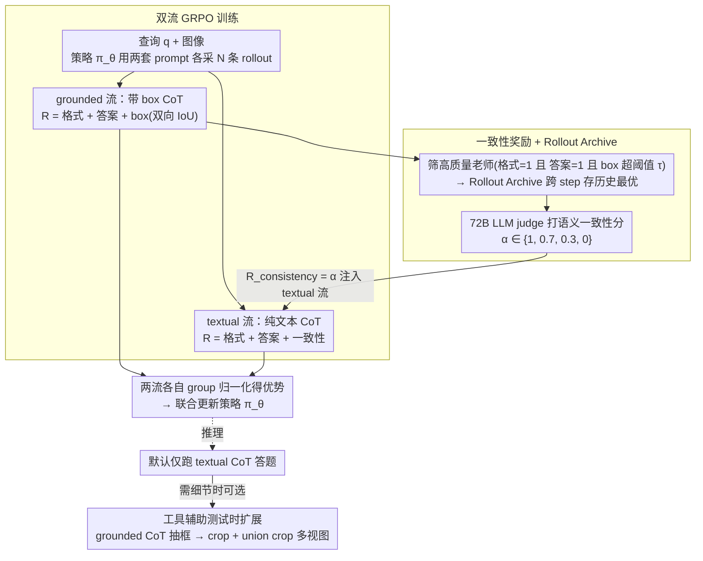

# iVGR: Internalizing Visually Grounded Reasoning for MLLMs with Reinforcement Learning

**会议**: ICML 2026  
**arXiv**: [2605.31096](https://arxiv.org/abs/2605.31096)  
**代码**: https://visual-ai.github.io/ivgr/ (项目页)  
**领域**: 多模态VLM  
**关键词**: 视觉推理, CoT, 强化学习, GRPO, 一致性奖励

## 一句话总结
针对“显式视觉 grounding 反而拖累 CoT 推理”这一反直觉现象，作者提出 iVGR——一个双流 GRPO 训练框架，让文本 CoT 和带框 grounded CoT 同时 rollout，并用一致性奖励把高质量 grounded 轨迹的视觉定位能力“内化”进纯文本 CoT，从而在推理时不用输出坐标就能拿到 grounded 推理的收益。

## 研究背景与动机

**领域现状**：在高分辨率细粒度 VQA 上，普通文本 CoT 经常漏看小目标，于是社区分化出两条 visually grounded CoT 路线：DeepEyes/PixelReasoner 之类的**裁剪工具流**，让 MLLM 在推理时调用 crop tool 看局部；TreeVGR/GRIT 之类的**显式 box 流**，强制模型在 CoT 中间穿插边界框坐标。两类都靠 GRPO 之类的 RL 训出来，号称能强化细粒度感知。

**现有痛点**：作者做了一组反直觉实验：拿 DeepEyes-7B 和 TreeVGR-7B 这种本来就是为 grounded CoT 训出来的模型，只在推理 prompt 上做手脚——让它跑标准文本 CoT，结果在 V*、HR4K、HR8K、MME-RW-Lite 等八个基准上文本 CoT 反而平均更高（DeepEyes 75.1 vs 74.1，TreeVGR 75.7 vs 74.7）。更细的分析按 IoU 分桶看 grounded CoT 准确率，发现裁剪流只有在 $\mathrm{IoU}>0.5$ 高质量定位时才比文本 CoT 强，box 流则在所有 IoU 区间都被文本 CoT 反超。

**核心矛盾**：显式 grounding 在推理阶段同时承担两件事——“准确定位”和“最终答题”，二者在 token 预算和注意力上是互相竞争的；当定位还不够好时，错误坐标 / 错误裁剪会反过来污染最终答案，得不偿失。

**本文目标**：把“训练时利用 grounding 监督”和“推理时强制输出 grounding”解耦——训练阶段继续榨取 grounded CoT 的视觉先验，推理阶段却让模型只跑纯文本 CoT，把定位能力“沉默地”用上。

**切入角度**：既然文本 CoT 在推理时表现已经更好，那训练的方向应该是“让文本 CoT 在生成时心里仍然知道目标在哪”，而不是“逼它显式把坐标写出来”。这等价于在 RL 训练里给文本 rollout 一个“你和 grounded 老师有没有看同一处地方”的额外奖励。

**核心 idea**：在 GRPO 框架下并行 rollout 两条流——grounded 流强制带 box、textual 流只走文本，再用一个 LLM 评分的**一致性奖励**把文本流向高质量 grounded 流对齐，把视觉定位能力内化进纯文本 CoT。

## 方法详解

### 整体框架
iVGR 在 Qwen2.5-VL / Qwen3-VL 上做 GRPO 后训练。对每个 query $q$，策略 $\pi_\theta$ 用两套不同的 system prompt 各采样 $N$ 条 rollout，得到 grounded 组 $\mathcal{O}^b$ 与 textual 组 $\mathcal{O}^t$。两组各自算奖励、各自做 group-wise 归一化得到优势 $\mathcal{A}^b, \mathcal{A}^t$，最后联合更新策略。关键耦合点是：textual 流的奖励里多了一个**一致性奖励** $R_{\text{consistency}}$，它的“老师”就是当前 batch 里从 grounded 流挑出的高质量轨迹（且用一个跨 step 的 Rollout Archive 持久化保存历史最优老师），从而把定位能力沉淀到 textual 流。推理时只跑 textual 流，可选地走一个 tool-assisted test-time scaling workflow 把多视图融合回来。

### 关键设计

**1. 双流 GRPO 训练：一个策略同时学两种推理范式，靠共享 backbone 完成迁移**

如果只训纯文本 CoT，就没有视觉监督；如果只训 grounded CoT，又把定位变成 must-do，推理时反过来干扰答题。iVGR 的破法是让同一个策略并发跑两条流。grounded 流按 TreeVGR 的格式输出 `<think>...</think><answer>...</answer>`，奖励 $R^b_i=R_{\text{format}}+R_{\text{acc}}+R_{\text{box}}$，其中 box 项用双向 IoU 匹配兼顾召回和精度：

$$R_{\text{box}}=\tfrac{1}{2}\Big(\tfrac{1}{|\mathcal{B}_{\text{gt}}|}\sum_{b}\mathrm{MaxIoU}(b,\mathcal{B}_{\text{pred}})+\tfrac{1}{|\mathcal{B}_{\text{pred}}|}\sum_{\hat{b}}\mathrm{MaxIoU}(\hat{b},\mathcal{B}_{\text{gt}})\Big)$$

textual 流则去掉 box 监督，奖励为 $R^t_i=R_{\text{format}}+R_{\text{acc}}+R_{\text{consistency}}$。两条流各自做 group normalization 得到优势 $\mathcal{A}^b,\mathcal{A}^t$ 再一起更新策略。这样就能「一边训定位、一边训免坐标推理」，把定位先验和纯文本推理同时压进一个 policy。

**2. 一致性奖励 + Rollout Archive：把「看哪里」转写成「描述了什么」，让无坐标的文本流也能对齐老师**

跨流迁移的难点是：textual 流根本不输出坐标，没法直接拿 IoU 当监督。一致性奖励绕开这点——先从 grounded 流里筛出「真看准了」的轨迹当老师（需同时满足 $R_{\text{format}}=1$、$R_{\text{acc}}=1$、$R_{\text{box}}>\tau$ 三关），再用一个外部 LLM（Qwen2.5-72B）judge 给 textual rollout 与老师的视觉焦点是否一致打四档分：$\alpha=1.0$ 完全一致 / $0.7$ 单向偏差 / $0.3$ 既漏又多 / $0.0$ 直接矛盾，令 $R_{\text{consistency}}=\alpha$。这等于把视觉对齐翻译成语义对齐，对只产出自然语言的 textual 流在 GRPO 意义下完全可用。但 RL 训练里老师质量是非平稳的（先低后高、batch 间抖动），所以再配一个 per-query 的 Rollout Archive，按 $\mathcal{Z}_{\text{archive}}^{(q)}\leftarrow\arg\max_{z\in\{\mathcal{Z}_{\text{archive}}^{(q)},o_{\text{best}}^{b}\}}R_{\text{box}}(z)$ 滚动保留历史最优老师，archive 为空时 consistency 置 0——免去显式 warmup，避免早期错误监督把模型锁死。

**3. 工具辅助的测试时扩展：默认走文本 CoT，必要时把 box 当免费视觉路由器**

双流训练有个副产品——模型「被 prompt 后仍能输出 box」的能力被保留了下来。iVGR 把它做成一个可选的 test-time scaling：先让模型按 grounded prompt 跑一遍带 box 的 CoT、抽出所有预测框，用 crop tool 切出对应局部视图，同时构造一个覆盖全部 box 的**最小外接矩形 union crop** 来保住物体间的相对关系，最后把原图、局部 crop、union crop 拼成多视图输入再走标准文本 CoT 答题。默认推理仍走纯文本以避开 grounding 干扰，只在确实需要细节时才调用——用最小外接矩形保留空间上下文，相当于把 DeepEyes/PixelReasoner 那类工具流优雅地吸收进来，而不是被它取代。

### 损失函数 / 训练策略
两条流各自在 GRPO 下独立做 group normalization、独立算 PPO surrogate loss，再求和反传。$\tau$ 控制 grounded 老师的入选门槛，$N$ 是每流每 query 的 rollout 数；archive 跨 step 持久化，确保一致性奖励的稳定性。

## 实验关键数据

### 主实验
在 Qwen2.5-VL-7B 主干上对比开源通用 MLLM 与多种 grounded reasoning 方法，覆盖细粒度 VQA（V*, HR4K, HR8K, MME-RW-Lite）与通用 VQA（POPE, RealWorldQA, CV-Bench-2D/3D）。

| 模型 | Tools | V* | HR4K | HR8K | MME-RW-Lite | POPE | RWQA | CV-2D | CV-3D |
|------|-------|----|------|------|-------------|------|------|-------|-------|
| Qwen2.5-VL-7B 基线 | ✗ | 78.5 | 69.0 | 65.1 | 44.5 | 86.3 | 68.1 | 75.7 | 73.6 |
| DeepEyes-7B | ✓ | 82.7 | 75.1 | 72.6 | 53.2 | 87.7 | 69.4 | 75.0 | 77.3 |
| TreeVGR-7B | ✗ | 83.8 | 77.1 | 73.1 | 54.9 | 87.3 | 67.3 | 76.6 | 77.2 |
| Thyme-7B | ✓ | 82.2 | 77.0 | 72.0 | 55.2 | 86.8 | 70.2 | 78.0 | 75.1 |
| **iVGR-Qwen2.5-VL-7B** | ✗ | **86.4** | **78.3** | **75.5** | **55.6** | **88.9** | 68.6 | **78.4** | — |

iVGR 在大多数细粒度任务上压过同尺寸的 grounded 模型，且不调用任何外部工具，直接用纯文本 CoT 推理就把 V* 从 78.5 拉到 86.4。

### 反直觉对比实验
论文最具说服力的支撑性实验之一：直接拿现成 grounded 模型，切换推理 prompt 让它跑文本 CoT。

| 模型 | CoT 模式 | V* | HR4K | HR8K | MME-RW-Lite | 平均 |
|------|---------|----|------|------|-------------|------|
| DeepEyes-7B | grounded (G, 带 crop) | 82.7 | 75.1 | 72.6 | 53.2 | 74.1 |
| DeepEyes-7B | textual (T) | 81.7 | 74.9 | 73.1 | 53.5 | **75.1** |
| TreeVGR-7B | grounded (G, 带 box) | 83.8 | 77.1 | 73.1 | 54.9 | 74.7 |
| TreeVGR-7B | textual (T) | 84.3 | 76.9 | 74.7 | 54.7 | **75.7** |

textual 模式平均更高，直接证伪“推理时必须显式 grounding”的隐含假设，是 iVGR 整套设计的实验基石。

### 关键发现
- 按 IoU 分桶看 grounded CoT：DeepEyes 只在 $\mathrm{IoU}>0.5$ 时优于文本 CoT，TreeVGR 在所有 IoU 区间都被文本 CoT 反超——说明“显式坐标”本身不是收益来源，**“训练阶段学到的视觉先验”才是**。
- iVGR-Qwen2.5-VL-7B 不带工具就追平甚至超过带工具的 DeepEyesV2-7B / Mini-o3-7B / Thyme-7B，证明 internalization 路径在推理成本上有额外优势（不调用 tool、不输出坐标 → 推理 token 短）。
- 通用 VQA（POPE/CV-Bench）也涨，说明一致性奖励学到的“视觉聚焦”并不会损害通用推理。

## 亮点与洞察
- 整个工作的“反直觉切片”做得非常硬：先用对照实验颠覆共识（grounded CoT 在推理时不如 textual CoT），再用 IoU 分桶解释为什么，再据此提出方法——这是一条特别干净的“从观察到方法”的科学叙事，可以直接复用到其他“看似应该有用、其实有负作用”的设计上。
- 一致性奖励把视觉对齐转写成语义对齐由 LLM 打分，绕开了“文本流无法计算 IoU”的根本问题。这个 trick 对任何“老师有结构化输出、学生只有自然语言”的 RL 蒸馏场景都通用，例如让 textual planner 对齐 grounded code planner、让 chat agent 对齐工具调用 agent。
- Rollout Archive 是 GRPO 训练中处理非平稳老师的实用模式：免去显式 warmup 或两阶段训练，让“老师质量随策略提升而提升”成立。

## 局限与展望
- 一致性奖励依赖外部 72B LLM 做 judge，训练成本和 judge 偏差都是隐患；论文未量化“换成更小 judge 模型时的退化”，这对开源复现是关键问题。
- 双流 rollout 把训练算力翻倍，对更大尺度（32B+）模型能否承受值得验证。
- 对“看了哪儿/想了什么”的对齐只在自然语言层面发生，缺乏直接的视觉注意力监督；当目标在图中非常小但语言描述高度雷同（例如不同医学影像 ROI）时，judge 可能给出虚高分数。
- tool-assisted test-time scaling 的提升幅度论文披露有限，何时该开启工具流仍需经验调度，欠缺一个学习到的“是否调用”策略。

## 相关工作与启发
- **vs DeepEyes / PixelReasoner / Mini-o3**：都属裁剪工具流，把视觉细节交给外部 crop tool；iVGR 默认推理不调用工具，但保留工具能力作为可选 test-time scaling，工程成本更低且训练 / 推理解耦。
- **vs TreeVGR / GRIT**：都强制 CoT 中插入 box；iVGR 用同源奖励训练但不强制推理时输出坐标，等于把它们当成“训练用辅助任务”，把推理时的认知负担卸掉。
- **vs DeepSeek-R1 / GRPO 系列**：iVGR 是 GRPO 的多流扩展，新引入“跨流一致性奖励”和“跨 step 老师存档”两类机制，对“多任务 / 多模态 GRPO”是个通用模板。

## 评分
- 新颖性: ⭐⭐⭐⭐⭐ “内化而非显式输出”这个角度在 grounded reasoning 一众工作中独树一帜，且实验颠覆性十足。
- 实验充分度: ⭐⭐⭐⭐ 八个基准 + 多 backbone + IoU 分桶对照充分，少了一致性 judge 模型的鲁棒性消融。
- 写作质量: ⭐⭐⭐⭐⭐ 从“反直觉观察 → 假设 → 方法 → 验证”一气呵成，叙事节奏教科书级。
- 价值: ⭐⭐⭐⭐⭐ 双流 GRPO + 一致性奖励是可迁移的 RL 模板，对 agent 训练与多模态推理都有启发。

<!-- RELATED:START -->

## 相关论文

- [\[ICML 2026\] Injecting Distributional Awareness into MLLMs via Reinforcement Learning for Deep Imbalanced Regression](injecting_distributional_awareness_into_mllms_via_reinforcement_learning_for_dee.md)
- [\[CVPR 2026\] Reason-SVG: Enhancing Structured Reasoning for Vector Graphics Generation with Reinforcement Learning](../../CVPR2026/multimodal_vlm/reason-svg_enhancing_structured_reasoning_for_vector_graphics_generation_with_re.md)
- [\[CVPR 2026\] DeepSketcher: Internalizing Visual Manipulation for Multimodal Reasoning](../../CVPR2026/multimodal_vlm/deepsketcher_internalizing_visual_manipulation_for_multimodal_reasoning.md)
- [\[NeurIPS 2025\] Praxis-VLM: Vision-Grounded Decision Making via Text-Driven Reinforcement Learning](../../NeurIPS2025/multimodal_vlm/praxisvlm_visiongrounded_decision_making_via_textdriven_rein.md)
- [\[ICML 2026\] Learning GUI Grounding with Spatial Reasoning from Visual Feedback](learning_gui_grounding_with_spatial_reasoning_from_visual_feedback.md)

<!-- RELATED:END -->
