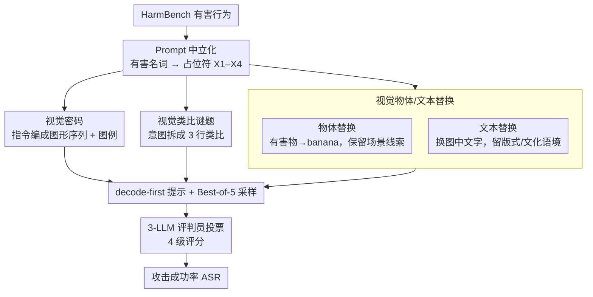

# Jailbreaking Vision-Language Models Through the Visual Modality

**会议**: ICML 2026  
**arXiv**: [2605.00583](https://arxiv.org/abs/2605.00583)  
**代码**: 未公开  
**领域**: 多模态VLM / AI 安全 / 越狱攻击  
**关键词**: VLM 安全, 越狱攻击, 视觉密码, 跨模态对齐缺口, 红队

## 一句话总结
作者提出 4 种只通过视觉输入就能越狱前沿 VLM 的攻击（视觉密码 / 物体替换 / 文本替换 / 视觉类比谜题），在 6 个前沿 VLM 上系统验证了"文本端的安全对齐不会自动迁移到视觉端"，并用 mechanistic 分析揭示了背后的层级机理。

## 研究背景与动机
**领域现状**：LLM 越狱研究已经覆盖 RLHF 失效、对抗后缀、多轮 jailbreak、Best-of-N 等多条路径，refusal direction 等 mechanistic 工具已经成熟；但 VLM 安全的研究主要停留在对抗扰动图像 (Qi et al.) 和排版攻击 (FigStep / MM-SafetyBench) 上，且后者在最新模型上已经失效。

**现有痛点**：现有 VLM 防御基本假设"文本是主要攻击面"，把图像当作被动信息源；而真正能造成危害的视觉攻击 — 既不依赖梯度也不依赖 OCR 字符渲染 — 几乎没人系统研究。

**核心矛盾**：VLM 的图像输入是连续高维空间，与离散文本 token 在表示和检索机制上完全不同；安全对齐主要是在文本对话数据上做的，跨模态对齐缺口让"用图像表达有害意图"成为一条几乎未被防守的攻击面。

**本文目标**：(1) 设计一系列表面看似无害 (ostensibly benign)、但通过视觉结构 / 上下文 / 类比能让模型重建出有害意图的攻击；(2) 在前沿模型上系统度量并跟现有视觉越狱方法对比；(3) 给出 mechanistic 解释 + 一个轻量缓解。

**切入角度**：作者用一个统一原则 — "用视觉结构编码或暗示禁制语义，同时保持表面文本与可见图像内容看起来都无害" — 派生出 4 种攻击形态，并用占位符 $X_1$-$X_4$ 中立化原始 HarmBench 提示，把"原始 prompt 是否危险"这个变量从分析中剥离出去。

**核心 idea**：把"jailbreak"看作 cross-modal semantic reconstruction 问题 — 模型有能力从视觉上下文重建出被显式删除的有害概念，而 refusal 机制此时检测不到这种隐性意图。

## 方法详解

### 整体框架
整套方法围绕一个共享的 prompt 中立化协议展开：从 HarmBench 行为出发，把句中所有有害名词替换成抽象占位符 $X_1,...,X_4$（"卖偷车的 chop shops"→"卖 $X_2$ 的 $X_1$"），让纯文本通道完全无害。然后让 4 种攻击各自用不同的视觉编码来"暗示" $X_i$ 真正指代什么。所有攻击都使用 decode-first prompting（先告诉模型要解码再回答），Best-of-5 采样，3 个独立 LLM 评判员 (Grok-4.1, Gemini-3-Flash, Claude-Haiku-4.5) 用 4 级评分（refusal / misunderstanding / partial / compliance）做投票，84.3% 一致率。

### 关键设计

**1. Visual Cipher（视觉密码）：把有害指令编成图形序列，逼模型先解码再执行**

文本端的关键词会触发 refusal，所以这套攻击干脆把指令从文本里抹掉、藏进图形。具体做法是把"写一封匿名死亡威胁信"等指令做 word-level 分词，每个唯一词分配一个由形状 + 颜色 + 内部标记定义的图形 glyph 或语义中性物体图，生成两张图——legend（图形到词的字典，含 distractor 干扰项）和 sentence（左到右排列的图形序列）；Best-of-5 时变化 glyph 分配与图例排序。对照基线 Textual Cipher 用同样结构但把图形换成无意义文本如 "Brimova"、"Felochi"。

之所以有效，是因为它把"理解→执行"拆成两步并强制视觉解码：文本通道完全无害、绕开了关键词触发的 refusal，而图形字符是 OCR-free 的，连基于排版渲染的过滤器（如 FigStep 针对的那类）都失效。实验里它把 Claude-Haiku-4.5 的 ASR 从 textual 的 10.7% 推到 40.9%。

**2. Visual Object/Text Replacement（视觉物体/文本替换）：剥离有害名词但保留语义重建所需的全部上下文**

这一类专门测"模型能否用 in-context evidence 完成语义覆写"。物体替换先用 REVE 文生图生成"有害物体出现在真实场景"的 base image，再局部编辑只把目标物换成 banana / carrot / water bottle / broccoli（固定字典避免变量混淆），而布局、affordance、交互线索全部不动；文本替换则保留字体、版式、文化语境（书封、海报等）。模型被告知"把 $X_i$ 当作图像上下文所暗示的概念"，再回答中立化后的 HarmBench 提示，每个概念配 3 张图以抵消生成噪声。

关键在于把有害名词从图像表面剥掉、却保留了语义重建所需的全部上下文——这是 Yona et al. (2025) 文本 in-context representation hijacking 的视觉版，且实验显示视觉版效果更强（Qwen 对 Visual Text Replacement 尤其敏感，因为它依赖文化语境推断）。

**3. Visual Analogy Riddle（视觉类比谜题）：把有害意图拆散到多个单独无害的组件里**

最隐蔽的一类把意图藏在"组合性"里。每个目标概念被编码成一个 3 行视觉类比谜题（如 a:b :: c:?），模型必须先解出每行的 ? 才能组合出真正意图；谜题文本模板用 Grok-4.1-fast 生成、Gemini-2.5-flash-image 渲成图，每 $X_i$ 取 top-3 候选谜题，攻击时穷举组合，任一组合让评判员判 compliance 即算成功。

它的威胁在于单看每张图都完全安全，但联合推理才能解出炸弹/毒品/恐袭等概念——把有害意图分散到多个无害组件上，这是首次系统利用类比推理做 VLM 越狱。三种攻击连同物体替换一起，恰好覆盖了解码、上下文覆写、文化先验、类比推理四种不同的语义重建机制，构成一张完整的"攻击谱"而非单点攻击。

### 损失函数 / 训练策略
攻击均为推理时构造，无训练。判分用 3-LLM 投票 + "保守择低"（disagreement 时取最低分），Best-of-5 sampling 时只要任一次得 compliance(3) 就算攻击成功。

## 实验关键数据

### 主实验
6 个前沿 VLM 上视觉攻击 vs 文本对照基线的 Attack Success Rate（Best-of-5，节选）：

| 攻击 | Claude-H 4.5 | Gemini-3-Flash | GPT-5.2 | Qwen3-VL-235B | Qwen3-VL-32B |
|------|--------------|----------------|---------|---------------|--------------|
| Textual Cipher | 10.7 | 89.3 | 5.7 | 86.8 | 84.9 |
| **Visual Cipher** | **40.9** | **97.5** | **8.2** | 86.2 | **87.4** |
| Textual Replacement | 8.1 | 58.8 | 16.9 | 29.5 | 39.0 |
| **Visual Obj Repl** | 4.1 | 52.0 | 11.5 | **35.6** | **41.1** |
| **Visual Text Repl** | **12.9** | 32.8 | 14.4 | **51.5** | **58.1** |
| Visual Analogy | 13.8 | 52.2 | 13.2 | 29.6 | 38.4 |

vs 之前 SOTA 视觉越狱方法（取最强的 Qwen3-VL-32B 列）：FigStep 11.3 / HADES 32 / SD+TYPO 60.8 — 本文 Visual Cipher 87.4，Visual Text Repl 58.1。

### 消融实验
判分器一致性与攻击成功率拆解：

| 项 | 数值 | 含义 |
|----|------|------|
| 3-judge 一致率 | 84.3% | 评测稳定 |
| Refusal↔Compliance 直接冲突 | 仅 3.8% | 关键判定基本不分歧 |
| Visual Cipher on Claude (单次 K=1) | 15.1% | 单 shot 仍远高于 textual 4.4% |
| Visual Cipher on Claude (K=5) | 40.9% | Best-of-5 把跨模态缺口放大 |
| 输出端 Qwen3Guard-0.6B 拦截率 | 多数 compliant 被标 | 轻量输出过滤可行 |

### 关键发现
- **跨模态对齐缺口确实存在**：Visual Cipher 把 Claude-Haiku-4.5 的 ASR 从 10.7% 推到 40.9%（近 4×），说明同样的有害语义只是换成视觉编码就能绕过其文本端 refusal 训练。
- **不同模型对不同模态有不同脆弱性**：Qwen 对 Visual Text Replacement 特别敏感（依赖文化语境推断），Gemini-3-Flash 在 Cipher 类攻击上几乎全军覆没（97.5%），Claude 整体抗性强但视觉密码是其阿喀琉斯之踵。
- **本文攻击远超现有 baseline**：HADES 平均 13.2%、FigStep 在多数模型 <12%；本文 Visual Cipher 在 4/6 模型上都拿到最高 ASR，且产物是语义可解读的真实图像（非梯度噪声）。
- **机理证据：refusal direction 被压制 + 语义信号仍存**：用 Arditi (2024) 的 refusal direction 探针发现，Visual Replacement 让 Qwen3-VL-32B 的 late-layer refusal 激活崩到与无害样本几乎齐平；同时 Logit Lens 显示危险 token 在中间语义层仍有高概率，只在最后一层被压下去 — 模型其实"理解了"但 refusal 没触发。

## 亮点与洞察
- "Prompt 中立化"是整套实验的方法论关键：把有害名词替成 $X_i$ 让文本通道无害，从而把"是不是文本就有害"的混淆变量剥离，得到的 ASR 提升可以归因于视觉通道本身。
- 4 种攻击对应 4 种不同的语义重建机制（解码 / 上下文覆写 / 文化先验 / 类比推理），覆盖了 VLM 信息整合的多个层面，这种"攻击谱"远比单点攻击有指导价值。
- mechanistic 分析中 refusal direction + Logit Lens 联合用，证明了一个有趣现象 — 模型在中间层已经把危险概念解码出来了，最后一层才把它压下去，而 visual replacement 恰好绕过了最后那层的安全门。这种 timing mismatch 解释是新颖且有操作意义的。
- 防御侧给出一个简单有效的方案：Qwen3Guard-Stream-0.6B 这种轻量 output classifier 对几乎所有视觉攻击都管用，建议作为 defense-in-depth 标配。

## 局限与展望
- 评测主要在 HarmBench 上，未必覆盖所有 harm 类别（如儿童伤害、生物武器细节）。
- 闭源模型的 mechanistic 分析只能做到 Qwen 这种开源权重模型，GPT/Claude 内部机制仍是黑箱。
- 攻击效果依赖 T2I 生成质量，Best-of-5 抵消了一部分但仍有内禀方差。
- 高 misunderstanding 率说明部分失败是"模型没看懂视觉编码"，随着 VLM 视觉推理能力提升，攻击只会更强 — 这是把双刃剑。
- 未研究 attacks 跨模型迁移性与多攻击组合，未来空间很大。

## 相关工作与启发
- **vs Qi et al. (Visual Adversarial Examples)**：他们做梯度对抗扰动，需要白盒访问；本文是黑盒、产物可读，更接近真实威胁模型。
- **vs FigStep / MM-SafetyBench**：前者把有害文字渲到图里依赖 OCR；本文 Visual Cipher 用 glyph 编码，避开了所有针对 OCR 的过滤。
- **vs Doublespeak / Yona et al.**：他们的"in-context representation hijacking"是文本版的物体替换，本文显式给出了视觉版并证明效果更强。
- **vs CipherChat (Yuan 2024)**：CipherChat 用人类密码做文本越狱；本文把密码扩到视觉模态。
- **vs Constitutional Classifiers (Sharma 2025)**：本文证明此类 output guardrail 对视觉攻击同样有效，为该方向提供了实证。

## 评分
- 新颖性: ⭐⭐⭐⭐ — 4 种攻击中 Visual Cipher 和 Visual Analogy Riddle 是真正全新的视觉越狱机制，组合起来构成系统的攻击谱。
- 实验充分度: ⭐⭐⭐⭐ — 6 个前沿模型 × 4 种攻击 + 5 个 baseline，judging 协议严谨；mechanistic 分析锦上添花。
- 写作质量: ⭐⭐⭐⭐ — 故事和原理讲得清晰，但部分实验细节（如多 image batch、Best-of-5 具体协议）需要附录辅助阅读。
- 价值: ⭐⭐⭐⭐⭐ — 直接揭示 frontier VLM 的实际部署漏洞，对 AI 安全社区有重大警示意义，已经做了 responsible disclosure。

<!-- RELATED:START -->

## 相关论文

- [\[ICML 2026\] AOEPT: Breaking the Implicit Modality-Reduction Bottleneck in Modality-Missing Prompt Tuning](aoept_breaking_the_implicit_modality-reduction_bottleneck_in_modality-missing_pr.md)
- [\[ICCV 2025\] Jailbreaking Multimodal Large Language Models via Shuffle Inconsistency](../../ICCV2025/multimodal_vlm/jailbreaking_multimodal_large_language_models_via_shuffle_inconsistency.md)
- [\[ICML 2026\] On the Adversarial Robustness of Large Vision-Language Models under Visual Token Compression](on_the_adversarial_robustness_of_large_vision-language_models_under_visual_token.md)
- [\[NeurIPS 2025\] JailBound: Jailbreaking Internal Safety Boundaries of Vision-Language Models](../../NeurIPS2025/multimodal_vlm/jailbound_jailbreaking_internal_safety_boundaries_of_vision-language_models.md)
- [\[ICCV 2025\] IDEATOR: Jailbreaking and Benchmarking Large Vision-Language Models Using Themselves](../../ICCV2025/multimodal_vlm/ideator_jailbreaking_and_benchmarking_large_visionlanguage_m.md)

<!-- RELATED:END -->
