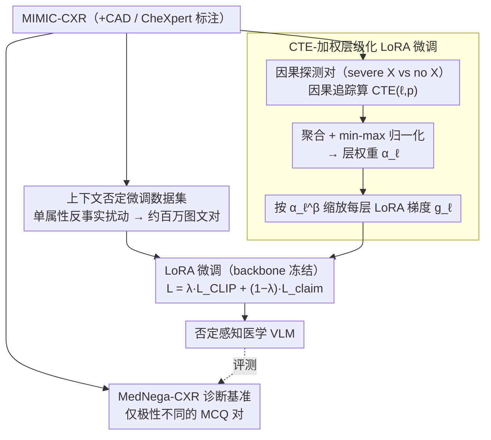

# Layer-Specific Fine-Tuning for Improved Negation Handling in Medical Vision-Language Models

**会议**: ICML 2026  
**arXiv**: [2602.12498](https://arxiv.org/abs/2602.12498)  
**代码**: https://github.com/healthylaife/NAST  
**领域**: 多模态 VLM / 医学影像 / 可解释性引导训练  
**关键词**: 医学 CLIP、否定理解、因果追踪、层级化微调、LoRA

## 一句话总结
NAST 用因果追踪 (causal tracing) 算出 CLIP 文本编码器各层对否定理解的因果贡献度 (CTE)，再以这些 CTE 做层级化梯度缩放微调 LoRA，让医学 VLM 在区分"有 / 没有某症状"时的语义敏感度大幅提升，并把肯定-否定准确率差距从 21.6% 缩到 4.2%。

## 研究背景与动机
**领域现状**：MedCLIP、BioMedCLIP、BioViL-T 等医学 VLM 在影像-报告对齐、零样本诊断上效果显著，已被尝试用于自动报告生成、检索、决策支持。

**现有痛点**：放射报告里**否定**无处不在——"无气胸"、"未见胸腔积液"、"右下叶无实变"。否定不只是"无某物"，常作用于属性（"无大量积液"、"非右下叶实变"）。但医学 VLM 在对比预训练阶段以肯定描述为主，对否定的处理像盲点：本文用受控的"肯定 vs 否定语义等价句"（如"心脏正常大小" vs "无心脏增大"）发现所有主流医学 VLM 都系统性偏好肯定句，否定理解显著更差。

**核心矛盾**：单纯加否定样本微调（NegCLIP、ConCLIP、NegBench 这条路线）只能小幅缓解，因为否定信号并不均匀分布在模型各层——很可能集中在文本编码器的某几层，对它们均匀调参既效率低又会污染其他能力。

**本文目标**：(i) 提供一个**polarity-controlled** 的诊断基准，把"否定理解差"和"adjective 理解差"区分开；(ii) 提供一个把"否定知识"以**属性级**（存在/位置/严重程度）注入医学 VLM 的微调数据集；(iii) 用因果可解释性工具找出"哪些层在做否定"，并据此做选择性微调，保住非否定能力的同时改善否定能力。

**切入角度**：把 mechanistic interpretability 工具 (causal tracing, Meng et al.) 从 LLM 迁移到 CLIP 文本编码器，把"哪一层、哪一 token 对 否定敏感"变成可计算的 CTE 分数，再把它直接喂给优化器做层级梯度缩放。

**核心 idea**：用因果追踪算 CTE → 归一化为层权重 $\alpha_\ell$ → 在 LoRA 微调时按 $\alpha_\ell^\beta$ 缩放每层梯度，把训练资源集中到真正负责否定的几层上。

## 方法详解

### 整体框架
NAST 由三块组成：(i) MedNega-CXR 诊断基准——基于 MIMIC-CXR 用 LLM 生成肯定-否定 MCQ 对，由两位放射科医生审过；(ii) 上下文否定微调数据集——基于 CAD 标注把每条结构化事实 $(\text{condition}, \text{existence}, \text{location}, \text{severity})$ 做"只改一个属性"的反事实扰动，得到约百万图文对；(iii) CTE-加权层级化 LoRA 微调——先用 causal tracing 算文本编码器每层每位置的 CTE，归一化为层权重 $\alpha_\ell$，再以 $\alpha_\ell^\beta$ 缩放每层 LoRA 梯度做微调，目标是 contrastive loss + claim-ranking loss 的加权和。下图按"数据准备 → 因果定位 → 层级化微调"展开整条 pipeline，三个贡献模块（基准、数据集、CTE-加权微调）对应下面三个关键设计。

### 关键设计

**1. MedNega-CXR 诊断基准：用"只差极性"的描述对，把否定理解从其他能力里隔离出来**

要诊断"否定理解差"，第一难点是别把它和"adjective 理解差""视觉感知差"混在一起。MedNega-CXR 的做法是构造语义等价、只差极性的对照对——比如"no cardiomegaly"对"normal heart size"，两句指的是同一个临床事实，唯一区别是一个用否定、一个用肯定。具体三步：从 MIMIC-CXR/CheXpert 里挑同时有 ≥2 个阳性和 ≥3 个阴性的研究，先和放射科医生一起为每个阴性 condition 找到肯定等价描述并排出 hard negative 标签，再让一个 LLM 生成显式否定的 MCQ，最后让另一个 LLM 把否定短语换成肯定等价物、保持句子结构不变，得到 6,965 对仅极性不同的 MCQ。这个基准之所以能立住，靠的是医学领域一个独特便利：临床里"无肺炎"可以用"肺泡充气良好"等价表达，而通用领域的"无车"根本找不到单一肯定等价。正因如此，对比对里变化的只有极性，评测考的才真是否定理解。

**2. 基于 CAD 标注的属性级否定微调数据集：把否定从"有没有"扩展到位置和严重程度**

光评测还不够，微调监督也得覆盖临床里真实的否定形式。现有否定数据集（CC-Neg、NegBench）主要做物体存在性否定，但放射报告里的否定常常作用在属性上——"无大量积液"否定的是程度，"非右下叶实变"否定的是位置。本文对每条结构化事实 $(\text{condition}, \text{existence}, \text{location}, \text{severity})$ 只改一个属性做反事实扰动（present↔absent、left↔right、small↔large 等），再用 radiology-style 模板转成自然语句，造出约百万对图文。监督有两种格式：一种是 claim-based contrast set，一个正确 claim 配多个 hard negative；另一种是单条否定 caption，用于辅助对比训练。靠结构化标注加受控扰动，规模和针对性都补齐了现有数据集缺的属性级否定。

**3. CTE-加权层级化 LoRA 微调：先用因果追踪找出"哪几层在做否定"，再让那几层多更新**

这是 NAST 的核心机制，针对的是前面那个矛盾——否定信号并非均匀分布在文本编码器各层，对它们一视同仁地调参既低效又会污染其他能力。作者把 mechanistic interpretability 里的 causal tracing 迁过来量化每层贡献：对一组（正确 caption, foil caption）等长配对，先跑一遍 foil 记下隐状态，再在正确 caption 的前向里，把第 $\ell$ 层第 $p$ 个 token 的隐状态替换成 foil 的对应值，得到被干预后的得分 $S^{\ell,p}$，因果贡献度定义为

$$\mathrm{CTE}(\ell, p) = \frac{S^{\text{corr}} - S^{\ell,p}}{S^{\text{corr}} - S^{\text{foil}}}$$

也就是"替换这一处隐状态后，模型从正确判断滑向 foil 判断的比例"。结果显示否定信号集中在 layer 1-4、layer 2 是峰值。把每层的 token 级 CTE 聚合得到 $\mathrm{CTE}_\ell$、再 min-max 归一化为 $\alpha_\ell \in [0,1]$ 后，LoRA 微调时按 $\tilde{g}_\ell = \alpha_\ell^\beta \cdot g_\ell$ 缩放每层梯度，$\beta$ 控制集中度。这里有个工程考量：CTE 是被当作梯度乘子而不是直接当各层学习率，是为了保留一个全局学习率、避免训练不稳定。把更新资源集中到真正负责否定的几层上，既省算力，又不稀释这些层对否定信号的学习、还少动其他层保住了原有对齐能力。

### 损失函数 / 训练策略
$\mathcal{L}_{\text{CLIP}}$ 是标准 CLIP 对称对比损失（应用在含显式否定的单 caption batch 上）；$\mathcal{L}_{\text{claim}} = \frac{1}{M}\sum_i \log \frac{\exp(\ell_{i, c_i})}{\sum_j \exp(\ell_{i, j})}$ 是 claim-ranking 损失（让正确 claim 比 hard negative 相似度更高）。优化器是 AdamW，固定学习率，单卡 RTX 4070 训练。$\lambda$ 和 $\beta$ 是关键超参。

## 实验关键数据

### 主实验
上下文否定任务（Table 1，单位 %）：

| 模型 | R@1↑ | R@5↑ | Claim Acc.↑ |
|------|------|------|-------------|
| CLIP | 23.5 | 34.7 | 24.6 |
| NegCLIP | 36.2 | 52.4 | 41.3 |
| ConCLIP | 39.7 | 55.8 | 44.9 |
| NegBench | 43.1 | 59.2 | 48.7 |
| **NAST (Ours)** | **49.5** | **65.7** | **55.6** |

否定专攻基线一代比一代强，但 NAST 在 claim 准确率上比最强基线再涨 6.9 个点。

### 消融实验
肯定-否定差距 (Table 3，越小越好) + 更新分布 (Table 4)：

| 模型 | Affirm – Negation Gap (Claim Acc., %) |
|------|--------------------------------------|
| CLIP | 21.6 |
| NegCLIP | 12.8 |
| ConCLIP | 10.7 |
| NegBench | 10.2 |
| **NAST** | **4.2** |

| 方法 | Top-3 层占总更新 | Top-5 层占总更新 |
|------|------|------|
| Uniform FT | 28.4% | 41.7% |
| **NAST (CTE-weighted)** | **52.6%** | **69.3%** |

CTE 加权确实把更新集中到了 top 否定敏感层，对应 claim 准确率上的 gain。

### 关键发现
- 否定处理**层级局部化**：CTE 集中在 layer 1-4，layer 2 峰值；这与"早期层处理 syntactic 函数词、深层处理语义"的 LLM 文献一致。
- NAST 的提升**主要来自否定准确率上升**而非肯定准确率下降——肯定句性能反而轻微提升（Table 2），说明 CTE 引导没有破坏一般对齐能力。
- 这种"少数层负责少数功能"的发现暗示通用的全层 LoRA 微调存在浪费，可解释性引导的稀疏微调可以做 parameter-efficient adaptation 的下一代方案。

## 亮点与洞察
- "用 causal tracing 算分 → 把分喂给 optimizer 当层权重"是把 mechanistic interpretability 从**诊断**推进到**处方**的范本——后续 medical/general VLM 都可以照搬这套范式。
- MedNega-CXR 把"肯定等价"这件医学语境独有的便利用足了：通用领域很难造出干净的极性对照，医学领域反而能给可解释性研究提供独一无二的实验台。
- 不动 backbone，只在 LoRA 上加权重，已经够把 gap 从 21.6 缩到 4.2；说明医学 VLM 对否定的处理能力其实只差临门一脚（少数关键层），不需要从头重训。

## 局限与展望
- CTE 是基于一个"severe edema vs no edema"的人工对比集算的，对其他临床场景（罕见疾病、模糊表达）的迁移性未验证。
- 因果追踪 + LoRA 都只在文本编码器侧做，未触及视觉编码器和跨模态投影；如果视觉端也有 polarity-sensitive bias，本文方案覆盖不到。
- 评测局限在 MIMIC-CXR 风格的报告与 CheXpert ontology，对 CT、MRI、病理图像等其他模态以及非英语临床文本，需要重新算 CTE 并验证。

## 相关工作与启发
- **vs NegCLIP / ConCLIP / NegBench**：他们都靠"加否定样本 + 对比 loss"，本文加上"layer-targeted optimization"再上一层。
- **vs Causal Tracing for LLM (Meng et al.)**：把 ROME-style 因果追踪从 LLM 知识定位迁移到 CLIP 文本编码器的否定处理，并第一次把追踪结果做成 optimizer 的输入。
- **vs Layer-wise Adaptive LR (LARS, LAMB)**：那些方法按 gradient norm 自动调每层 LR，本文按因果贡献度调，是"语义感知"的版本。

## 评分
- 新颖性: ⭐⭐⭐⭐ 第一次把 causal tracing 转成层级化训练规则，方法路径清晰。
- 实验充分度: ⭐⭐⭐⭐ 多基线 + 多任务 + 更新分布消融，覆盖到位。
- 写作质量: ⭐⭐⭐⭐ 问题诊断-数据-方法-评测节奏紧凑。
- 价值: ⭐⭐⭐⭐ 医学安全场景的否定理解是真实痛点，CTE 加权可被广泛复用。

<!-- RELATED:START -->

## 相关论文

- [\[CVPR 2025\] Vision-Language Models Do Not Understand Negation](../../CVPR2025/multimodal_vlm/vision-language_models_do_not_understand_negation.md)
- [\[ACL 2025\] NegVQA: Can Vision Language Models Understand Negation?](../../ACL2025/multimodal_vlm/negvqa_can_vision_language_models_understand_negation.md)
- [\[AAAI 2026\] Difference Vector Equalization for Robust Fine-tuning of Vision-Language Models](../../AAAI2026/multimodal_vlm/difference_vector_equalization_for_robust_fine-tuning_of_vis.md)
- [\[CVPR 2026\] TRivia: Self-supervised Fine-tuning of Vision-Language Models for Table Recognition](../../CVPR2026/multimodal_vlm/trivia_self-supervised_fine-tuning_of_vision-language_models_for_table_recogniti.md)
- [\[ACL 2026\] Topology-Aware Layer Pruning for Large Vision-Language Models](../../ACL2026/multimodal_vlm/topology-aware_layer_pruning_for_large_vision-language_models.md)

<!-- RELATED:END -->
