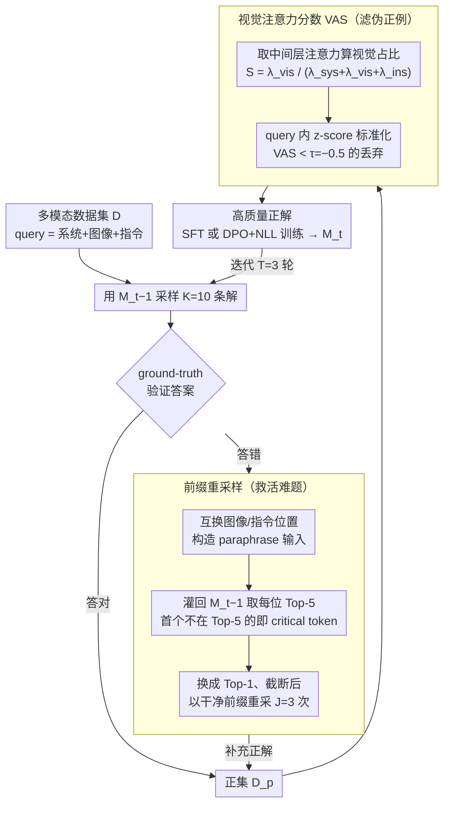

# Learn to Think: Improving Multimodal Reasoning through Vision-Aware Self-Improvement Training

**会议**: ICML 2026  
**arXiv**: [2605.11931](https://arxiv.org/abs/2605.11931)  
**代码**: 未提及  
**领域**: 多模态VLM / LLM推理 / 自我改进  
**关键词**: 多模态推理, 自我提升训练, 视觉注意力, prefix resampling, DPO

## 一句话总结
VISTA 把多模态大模型的自我改进训练改造成"难题靠 prefix 重采样补样本、伪正例靠视觉注意力分数 (VAS) 过滤"的两段式 pipeline，在 Qwen2.5-VL-3B 上把数学/医学多模态推理平均提升 +13.66%。

## 研究背景与动机
**领域现状**：当前主流通过对 MLLM 做带显式 CoT 的后训练来提升多模态推理；标注 CoT 太贵，所以 STaR / ReSTEM / R3V 等"自我改进"范式让模型自己采样答案、用 ground-truth 验证后再训自己。

**现有痛点**：作者用 Qwen2.5-VL-3B 在 SLAKE / VQA-Rad / Geometry3K 上做实证分析发现两个被忽视的问题。其一是**数据不平衡**：简单题随便就能采出大量正确解，难题（如 Geometry3K）超过 40% 的 query 在 10 次采样中一个对的都没有，但偏偏难题对训练最关键。其二是**语言先验偏置**：模型即使最终答案对，中间推理也可能描述图中根本没有的物体，注意力分布显示视觉 token 虽然占上下文最大比例，但各层得到的注意力分数都低于 20%。

**核心矛盾**：现有自我改进方法**只用"答案对不对"作为质量信号**，这个信号在数量上（难题正样本太少）和质量上（无法区分真正基于图像推理 vs 蒙对）都不够。

**本文目标**：(1) 对难题如何补足正确解？(2) 如何识别并过滤那些"答案对但推理是幻觉"的伪正例？

**切入角度**：作者引用 Ji et al. 2025 等观察——失败解的错误往往发生在推理后段，**前缀通常是对的**；同时利用模型自己的注意力分布作为视觉关注度的内部信号，无需额外模型也无需第二次前向（对比 He et al. 2025 需要去图重跑一次）。

**核心 idea**：用 "prefix resampling" 复活失败解的好前缀来补难题样本；用 "Vision-aware Attention Score (VAS)" 用一次前向计算视觉/系统/指令三段注意力占比，过滤掉视觉注意力低的伪正例。

## 方法详解

### 整体框架
VISTA 嵌在标准三步迭代里（采样 → 验证 → 训练），主要改造采样与验证两步。给定第 $t-1$ 轮模型 $\mathcal{M}_{t-1}$ 与多模态数据集 $\mathcal{D}$，每个 query $x_i = \{x_i^{\text{sys}}, x_i^{\text{vis}}, x_i^{\text{ins}}\}$ 先按常规采 $K=10$ 条解；用 ground-truth 区分出正集 $\mathcal{D}_t^p$ 与负集 $\mathcal{D}_t^n$。然后：(1) 对 $\mathcal{D}_t^n$ 用前缀重采样二次采样 $J=3$ 次扩充 $\mathcal{D}_t^p$；(2) 对 $\mathcal{D}_t^p$ 计算每条解的 VAS，低于阈值 $\tau=-0.5$ 的丢弃；(3) 余下的高质量正解用于 SFT 或 DPO+NLL 优化得到 $\mathcal{M}_t$，迭代 $T=3$ 轮。所以这两步——**前缀重采样**管「难题正解太少」、**VAS 过滤**管「答对但没看图的伪正例」——分别从数量和质量两端补强自我改进的数据。

### 关键设计

**1. Prefix Resampling（前缀重采样）：把失败解里"还没出错的前缀"回收来救活难题**

难题的麻烦在于 40%+ 的 query 采 10 次一个对的都没有，直接丢掉这些失败解就等于放弃了对训练最关键的样本。作者抓住一个观察——失败解的错误往往发生在推理后段、前缀通常是对的，于是想办法定位"开始出错"的 critical token、截断后从那里重采。具体做法不依赖 ground-truth 也不引外部模型：对每条失败解 $r_i^{k_n}$，把 query 里图像与指令位置互换构造一个 paraphrase 输入"$x_i^{\text{sys}} + x_i^{\text{ins}} + x_i^{\text{vis}} + r_i^{k_n}$"，灌回 $\mathcal{M}_{t-1}$ 拿每个位置的 Top-5 预测，第一个不在 $\text{Top}_5(o_{n-1})$ 里的原 token 就是 critical token——用新的 Top-1 替换、截掉后续，再以这段干净前缀拼回原 query 重采 $J=3$ 次。这等价于用模型自身的自校准能力找到"它自己不确定的地方"，把负样本里的好前缀也回收利用，比单纯加大难题采样次数高效得多。

**2. Vision-aware Attention Score（VAS）：用一次前向的注意力分布揪出"答案对但没看图"的伪正例**

自我改进的另一个盲点是只用"答案对不对"当质量信号，可模型即便答对，中间推理也可能描述图里根本没有的物体——这种语言先验导致的幻觉伪正例同样有害。VAS 直接用模型自己的注意力图当幻觉检测器：取 $\mathcal{M}_{t-1}$ 中间层（被发现最负责视觉处理）的注意力输出 $\mathbf{A}_i^k$，把输出 token 对系统/视觉/指令三段输入的注意力求和得 $\lambda^k_{\text{sys}}, \lambda^k_{\text{vis}}, \lambda^k_{\text{ins}}$，归一化为视觉占比 $S_i^k = \lambda^k_{\text{vis}} / (\lambda^k_{\text{sys}} + \lambda^k_{\text{vis}} + \lambda^k_{\text{ins}})$，再做 query 内部的 z-score 标准化 $\text{VAS}_i^k = (S_i^k - \text{mean}(S_i)) / \text{std}(S_i)$，低于阈值 $\tau=-0.5$ 的解判为视觉关注不足、直接过滤。相比"去掉图再前向一次、对比注意力变化"那种两次前向的方案，VAS 只用一次前向、零额外开销；用 z-score 而非绝对阈值，能适配不同样本整体注意力水平的差异。

> 注：VISTA 本身只贡献上面两个策略（论文原文亦明确「two simple-yet-effective approaches」）；它们处理出的高质量正解再无缝接进标准的 SFT / 偏好学习后训练，训练细节见下。

### 损失函数 / 训练策略
过滤后的高质量正解可无缝接两种后训练范式，便于和一众基线公平对比：SFT 直接对 $\mathcal{D}_t^p$ 做 NLL 优化 $\mathcal{L}_{\text{SFT}} = -\mathbb{E}[\log \mathcal{M}_\theta(r,\hat y \mid x)/(|r|+|\hat y|)]$；偏好学习则把每个正例与随机选的一个负例配对，用增强损失 $\mathcal{L}_{\text{DPO+NLL}} = \mathcal{L}_{\text{DPO}} + \alpha \cdot \mathcal{L}_{\text{NLL}}(r^{k_p}, \hat y^{k_p})$（$\alpha=0.5, \beta=0.1$），保留 NLL 项是为了防止 DPO 训练崩塌、维持生成质量。迭代 $T=3$ 轮；每轮采样 $K=10$，前缀重采样 $J=3$，温度 1.0，最大输出 2048；每轮从 base 模型重新微调以防 overfitting。在 8×A800 80GB 上跑 3 个 epoch，推理用 greedy decoding。

## 实验关键数据

### 主实验

| 模型 / 方法 | SLAKE | VQA-Rad | Geo3K | Overall (Δ vs SFT-Seed) |
|---|---|---|---|---|
| Qwen2.5-VL-3B + SFT-Seed | 67.04 | 64.14 | 25.46 | 52.21 |
| Qwen2.5-VL-3B + ReSTEM (iter 3) | 81.69 | 73.71 | 32.28 | 62.56 (+10.35) |
| Qwen2.5-VL-3B + R3V (iter 3) | 81.41 | 69.32 | 32.78 | 61.17 (+8.96) |
| **Qwen2.5-VL-3B + VISTA-SFT (iter 3)** | **84.23** | **76.10** | **37.27** | **65.87 (+13.66)** |
| Qwen2.5-VL-7B + SFT-Seed | 79.15 | 70.52 | 36.94 | 62.20 |
| **Qwen2.5-VL-7B + VISTA-SFT (iter 3)** | **87.89** | **77.29** | **41.43** | **68.87 (+6.67)** |

跨 MLLM 一致提升：在 Qwen3-VL-2B、InternVL3-2B/8B 上单轮训练就能稳定打过 STaR / STaR+ 等基线，证明方法不依赖某个特定 backbone。

### 消融实验

| 配置 | 在 3B 上 Overall | 说明 |
|---|---|---|
| Full VISTA-SFT (iter 1) | 62.41 | 同时启用 prefix resampling 和 VAS |
| 仅 prefix resampling | 介于 SFT-Seed 与 Full 之间 | 解决数据不平衡 |
| 仅 VAS 过滤 | 介于 SFT-Seed 与 Full 之间 | 解决幻觉伪正例 |
| 把 VAS 阈值 $\tau$ 上下移 | 性能呈钟形 | 阈值过高会过滤掉太多样本 |

### 关键发现
- 单独看难题集 Geo3K：3B 模型从 25.46 涨到 37.27（绝对 +11.81），说明 prefix resampling 真的把"采不到正解"的难题救活了。
- VAS 选层分析（附录 C.2）显示用中间层得到的过滤最有效，跟 Jiang et al. 2025 关于"中间层最负责视觉处理"的发现一致。
- OOD 泛化：在没见过的 ScienceQA 与 ChartQA 上同样涨点，说明 VISTA 学到的不是数据集特征，而是更可靠的视觉推理习惯。

## 亮点与洞察
- "把负样本当资源而不是噪声"：传统 self-improvement 直接丢掉所有错解，但 prefix resampling 指出**错解的前缀往往是正确且高价值的**，这个 lens 翻转可以迁移到几乎任何 sample-then-filter 的训练范式。
- 用一次前向的内部注意力 z-score 当幻觉检测器，是一种极简但有效的"模型自省"方法；不需要额外判别器，也不需要 token-level 对齐数据。
- "答案对 ≠ 推理对" 这一观察被用注意力分数量化以后变成可操作的过滤信号，未来可启发对 reward model 的"过程级"扩展。

## 局限与展望
- VAS 的有效性依赖"模型自身注意力分布是可靠的视觉关注指标"这一假设，对于经过严重指令调优、注意力分布被 collapsed 的模型不一定成立。
- 中间层选择是经验性的（取 backbone 的中间一层），换 backbone 时要重新校准；缺乏自动选层机制。
- 阈值 $\tau$ 是全局固定的；不同难度、不同任务可能需要自适应阈值。
- 实验主要在医学+数学几何上，对常识图像 / 视频 / 文档等更复杂视觉模态的迁移仍待验证。

## 相关工作与启发
- **vs STaR / ReSTEM**：他们丢掉所有失败解，VISTA 回收前缀；他们只看答案对错，VISTA 还看视觉注意力。
- **vs Ding et al. 2025（ground-truth 引导推理）**：那种方法用答案泄露指导推理，本质属于 hint-augmented；VISTA 完全靠模型自身预测一致性。
- **vs He et al. 2025（去图重跑量化语言先验）**：那种方法需要两次前向；VAS 单次前向得到等价信号，更省算力。
- **vs R3V**：R3V 也通过多次迭代提升，但样本量是 VISTA 的 ~2 倍却效果更差，说明"样本质量 > 样本数量"。

## 评分
- 新颖性: ⭐⭐⭐⭐ 两个技术点都不是横空出世，但组合在一起对症下药很漂亮
- 实验充分度: ⭐⭐⭐⭐ 跨 5 个 MLLM、5 个 benchmark、SFT + DPO 双范式，消融和层选择都做了
- 写作质量: ⭐⭐⭐⭐ 动机分析（§2.1）有图有数据，方法叙述清晰，公式标记一致
- 价值: ⭐⭐⭐⭐ self-improvement 范式正在火，"用注意力做幻觉过滤"和"前缀回收"两个 trick 都很容易被复用

<!-- RELATED:START -->

## 相关论文

- [\[ICLR 2026\] Through the Lens of Contrast: Self-Improving Visual Reasoning in VLMs](../../ICLR2026/multimodal_vlm/through_the_lens_of_contrast_self-improving_visual_reasoning_in_vlms.md)
- [\[ICLR 2026\] Vision-Zero: Scalable VLM Self-Improvement via Strategic Gamified Self-Play](../../ICLR2026/multimodal_vlm/vision-zero_scalable_vlm_self-improvement_via_strategic_gamified_self-play.md)
- [\[ICLR 2026\] VTool-R1: VLMs Learn to Think with Images via Reinforcement Learning on Multimodal Tool Use](../../ICLR2026/multimodal_vlm/vtool-r1_vlms_learn_to_think_with_images_via_reinforcement_learning_on_multimoda.md)
- [\[ACL 2026\] iReasoner: Trajectory-Aware Intrinsic Reasoning Supervision for Self-Evolving Large Multimodal Models](../../ACL2026/multimodal_vlm/ireasoner_trajectory-aware_intrinsic_reasoning_supervision_for_self-evolving_lar.md)
- [\[ICML 2026\] From Seeing to Thinking: Decoupling Perception and Reasoning Improves Post-Training of Vision-Language Models](from_seeing_to_thinking_decoupling_perception_and_reasoning_improves_post-traini.md)

<!-- RELATED:END -->
