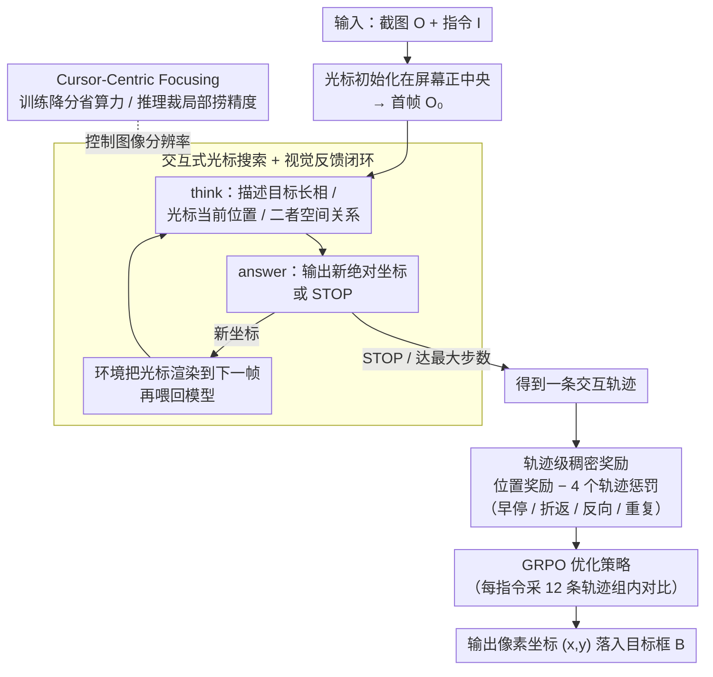

# Learning GUI Grounding with Spatial Reasoning from Visual Feedback

**会议**: ICML 2026  
**arXiv**: [2509.21552](https://arxiv.org/abs/2509.21552)  
**代码**: 无  
**领域**: LLM Agent / GUI Grounding / 多模态VLM / 强化学习  
**关键词**: GUI grounding, 虚拟光标, 视觉反馈, GRPO, 空间推理

## 一句话总结
把 GUI grounding 从「一次性预测坐标」改写成「在屏幕上挪鼠标找目标」的交互式搜索，用一个带轨迹惩罚的稠密奖励 + GRPO 训练 VLM，让模型从渲染出来的光标得到视觉反馈来对齐数字坐标与屏幕位置，仅用 8K 样本就在 ScreenSpot-Pro 上把 GTA1 的 50.1% 提到 58.1%。

## 研究背景与动机

**领域现状**：GUI agent 通常被拆成规划器 + grounding 两段，后者负责把"点击登录按钮"这样的指令映射成屏幕上的像素坐标 $(x,y)$。当前主流 grounding 模型（SeeClick、UGround、OS-Atlas、UI-TARS、GUI-Actor 以及一批 RL 方法 GUI-R1、SE-GUI、GUI-G2、GTA1）都把它视为**单步坐标回归**：给一张截图，直接吐出一对数字。

**现有痛点**：VLM 在高分辨率、复杂布局的截图上预测精确数字坐标依旧很差，ScreenSpot-Pro 上 7B 量级的 SOTA 也只到 50% 左右。作者把根源归结为 **spatial semantic alignment** 问题——模型要把自己对某个视觉元素的语义理解，通过隐式映射写成一组离散的坐标 token，但训练时它只看见自己输出的数字，**永远看不到这个数字真正落在屏幕的哪里**。

**核心矛盾**：训练信号只覆盖"输出"，不覆盖"落点"。没有视觉反馈闭环，模型的数字预测与屏幕像素的对齐天然脆弱，分布外 / 高分辨率场景立刻崩。

**本文目标**：让模型在训练时就能看到"我刚才那一击落在了哪里"，从而把坐标-像素的对齐学得更稳，并让推理时也能像人一样多看几眼再确认。

**切入角度**：人在屏幕上找东西不是一击命中，而是把鼠标挪过去、看一眼对没对上、不对再挪。作者把这个过程显式建模成一个交互环境——每一步把当前预测渲染成一个**虚拟光标**画到截图上，模型基于"目标长什么样 + 光标现在在哪 + 二者空间关系"决定下一步挪到哪、或者输出 STOP。

**核心 idea**：把 GUI grounding 由"一步回归 $(x,y)$"重写为"多步搜索 + 渲染光标做视觉反馈 + 轨迹级 RL"，用 GRPO 优化这条策略，再叠一个 cursor-centric focusing 让高分屏可用。

## 方法详解

### 整体框架
输入：截图 $O$（$W\times H$）+ 自然语言指令 $I$，输出：像素坐标 $(x,y)$ 落入目标框 $B$。

Gui-Cursor 把这件事拆成一个最多 $T$ 步的交互 episode：

1. 初始化：$t=0$ 时把光标画在屏幕正中央 $(x_0,y_0)$ 得到 $O_0$。
2. 多步交互：每一步模型基于历史 $(I, O_0, A_0, O_1, \ldots, A_{t-1}, O_t)$ 生成 $A_t = \langle\text{think}\rangle\ldots\langle/\text{think}\rangle\langle\text{answer}\rangle\ldots\langle/\text{answer}\rangle$。`<think>` 里显式描述目标长相、光标当前位置、二者空间关系；`<answer>` 要么是新的绝对坐标 $(x_t,y_t)$，要么是 `STOP`。
3. 渲染反馈：若给了新坐标，环境就在下一帧 $O_{t+1}$ 把光标移到那里再喂回模型；若给了 STOP 或达到最大步数，episode 结束，最后一个光标位置作为最终预测。

训练用 GRPO，base model 用 Qwen2.5-VL-7B 与 UI-TARS-1.5-7B；最大训练步数 250、训练时最多 4 步移动、每条指令采 12 条轨迹、batch 32、学习率 $10^{-6}$。数据用 Aria-UI + OS-Atlas 的子集，仅 8K 样本（对比 GTA1 64K），还做 online filtering 把"全对/全错"的样本过掉。

### 关键设计

**1. 交互式光标搜索 + 视觉反馈闭环：把单步回归改成"挪了再看"的多步搜索**

以前训练的死穴是模型只看见自己吐出的数字，永远不知道这个坐标落在屏幕的哪里，坐标-像素对齐全靠隐式映射硬撑。这里让 VLM 自己控制一个虚拟光标：每一步在 `<think>` 段描述目标长相、光标当前位置、二者空间关系，再在 `<answer>` 段输出新的绝对坐标或 STOP；环境把新坐标渲染成下一帧画面的光标喂回去，模型于是能直接观察"我上一击落在了哪"。这等于把以前缺失的"看自己输出"那一环补上，强迫模型在像素空间而非纯 token 空间里对齐坐标，从根上修 spatial semantic alignment。推理时步数是自适应的——简单样本一步出，小图标这种难样本才会自动多挪几下：ScreenSpot-v2 上 99.5% 的样本一步命中，ScreenSpot-Pro 上 9.4% 走多步，而多步样本的平均目标面积只有 5024 px，远小于单步样本的 31584 px，说明模型确实学会了"小目标多看几眼"。

**2. 轨迹级稠密奖励：位置奖励之外再叠 4 个轨迹惩罚，把病态搜索行为按住**

多步交互天然容易退化——模型可能学到"上来就 STOP 当单步用"，或者在两个点之间反复横跳，光给一个落点奖励压不住这些毛病。位置奖励先沿用 SE-GUI 的稠密形式：落在框 $B$ 内时 $r_p = 1 + (1 - d_{\text{centre}}/d_{\max})^2$（越靠中心越高），落在框外时 $r_p = 1 - d_{\text{edge}}$（按到最近边的距离衰减），距离都用图像宽高归一化。真正治退化靠在上面叠四个二值惩罚，每个对应一种典型坏轨迹：False Stop（输出 STOP 但落点不在 $B$）、False Move（历史里点进过 $B$ 最后又移出去）、False Direction（最终位置比第一步离 $B$ 更远）、Repeated Position（同一坐标出现 $\geq 2$ 次）。总奖励是 $R_T = r_p - w_p(r_{\text{FD}} + r_{\text{FS}} + r_{\text{FM}} + r_{\text{RP}})$ 再加一个格式奖励，用 GRPO 优化。消融里 false stop penalty 是模型能学会真正多步移动的必要条件，去掉后训练 20 步就坍缩回单步策略。

**3. Cursor-Centric Focusing（ccf）：训练降分辨率省钱、推理裁局部捞回精度**

迭代式 pipeline 的算力瓶颈在于历史长度 × 图像大小都线性涨，交互历史里堆几张原始大图就能把显存撑爆。ccf 把训练和推理的分辨率解耦：训练时所有图像按比例缩到不超过 $P = 1920\times 1080$ 以稳住开销；推理时若原图比 $P$ 大，先在原图上跑一步拿个粗预测，再以它为中心裁出一块 $P$ 大小的区域、把光标摆在裁剪图正中，后续移动步只在这块裁剪图里做，而且历史里不再保留原始大图。这样既能在低分上稳定训练，又能在高分屏上服务。作者还把这个 trick 反手套到 GTA1 上，把它的 ScreenSpot-Pro 从 50.1% 提到 54.0%，说明 ccf 本身就是个通用增强——但 Gui-Cursor 用同样 ccf 仍领先 2.5%，证明交互训练本身另有贡献。

### 损失函数 / 训练策略
GRPO 优化 $R_T$ + 格式奖励；每条指令采 12 条轨迹做组内对比；online filtering 把全成功 / 全失败的指令过掉以保证有学习信号；最大训练交互步数 4 步，最长训练 250 个梯度步。

## 实验关键数据

### 主实验

| 数据集 | 指标 | GUI-Cursor (UI-TARS-1.5-7B) | 之前 SOTA（同量级 7B） | 提升 |
|--------|------|---------|---------|------|
| ScreenSpot-Pro | Avg. Acc | **58.1** | GTA1-7B 50.1 | **+8.0** |
| ScreenSpot-v2 | Avg. Acc | **93.9** | GUI-G2-7B 93.3 | +0.6 |
| OSWorld-G | Avg. Acc | 65.6 | GTA1-7B 67.7 | -2.1 |
| UI-Vision | Avg. Acc | **27.3** | GTA1-7B 26.2 | +1.1 |
| OSWorld (online, w/ o3 planner, 50 steps) | 成功率 | **57.1**（Qwen2.5-VL-7B base） | GTA1-7B 53.1（100 steps） | +4.0，且步数少一半 |
| SpatialMQA (OOD 空间推理) | Acc | **43.4** | Qwen2.5-VL-7B base 38.1 | +5.3 |

亮点：仅用 8K 训练样本就超过 GTA1 的 64K 样本设置，数据效率约 8×。

### 消融实验

| 配置 | ScreenSpot-Pro | 说明 |
|------|---------|------|
| Full Gui-Cursor (w/ ccf) | 56.5 | Qwen2.5-VL-7B base |
| w/o ccf | 45.3 | -11.2，高分屏上 ccf 是主力 |
| w/o False Stop penalty | 显著降，多步率 9.4% → 0.1% | 模型坍缩成单步策略 |
| w/o Repeated Position penalty | 多步率 9.4% → 16.6%，训练 220 步后不稳 | 没它会反复跳同一点 |
| w/o False Move / False Direction | 全部弱于 Full | 每个 penalty 都贡献精度 |
| w/o thinking tokens | 显著降 | 与 GUI-G2/GTA1 单步设定下「thinking 没用」结论相反 |
| ScreenSpot-v2 上 w/o ccf | 93.6 → 93.9 | 简单场景 ccf 增益很小 |
| 把 ccf 套到 GTA1 上 | 50.1 → 54.0 | ccf 是通用增强 |

### 关键发现
- **视觉反馈闭环是真有用**：在交互式训练里 thinking + 多步反馈才发挥威力——GUI-G2 / GTA1 这种单步 RL 里加 thinking 几乎无效，但 Gui-Cursor 去掉 thinking 就跌一大块，说明思考价值要配合"能看到自己落点"才能兑现。
- **零样本对照很有说服力**：让没微调过的 Qwen2.5-VL-7B 直接玩"挪光标"，准确率从 88.8%（单步）跌到 36.3%（直接坐标多步）甚至 1.3%（相对偏移多步）；GPT-4o 反而能从 17.5% 涨到 25.5%。这说明现有 grounding 模型的高分数并不建立在稳健空间推理上，而是过拟合到了"猜坐标"上。
- **自适应步数符合直觉**：ScreenSpot-v2 上 99.5% 一步出，ScreenSpot-Pro 上 9.4% 走多步，且多步样本目标平均 5024 px ≪ 单步样本 31584 px——模型自己学会了"小目标多看几眼"。
- **空间推理外溢**：自设计的 cursor-in-box 二分类（黑色光标是否在红框里）显示，Qwen2.5-VL-7B 有严重的中心偏置（边缘位置基本崩），而 Gui-Cursor 没专门训练这个任务却在边缘也保持高 F1；SpatialMQA / SPHERE 等 OOD 空间推理 benchmark 也都拿到提升，说明"挪光标"训练捕获到的是更普适的空间推理能力。

## 亮点与洞察
- **任务范式上的小重写带来大杠杆**：从「single-step regression」到「interactive search with rendered cursor」只是改了 problem formulation，但一举把"模型看不见自己输出"这个隐含的训练信号洞补上了，这种"在 task 这一层动手术"往往比堆 reward / 改架构更划算。
- **轨迹奖励比位置奖励更值得想**：作者花大力气设计 4 个二值惩罚，每一个都对应一种"病态轨迹"模式（早停 / 折返 / 重复 / 反向），消融里把奖励工程做得很细致，给后续做 multi-step RL 的人提供了一份"踩雷清单"。
- **训练-推理分辨率解耦是经典系统级 trick**：ccf 思想就是"训练时降采样省钱、推理时裁剪局部捞回精度"，而且裁剪后不保留原图避免历史炸——这套很容易被复用到其他多步视觉 RL 任务（如视频定位、可视化操作）。
- **数据效率 8× 来自交互式训练**：用 1/8 数据打赢同 base 的 GTA1，提示后续做 GUI 数据 scaling 之前先想清楚 task formulation 是否还有优化空间，不要盲堆数据。

## 局限与展望
- **作者承认**：仍依赖外部规划器（实验用的是 o3），grounding 模型本身不做高层规划；ccf 在简单场景几乎没收益，多步交互的意义更多体现在 ScreenSpot-Pro / OSWorld 这种难任务上。
- **自行观察**：（1）训练时上限 4 步、推理时也几乎只走 1-2 步，所谓"多步"实际仍非常浅，更接近"single-shot + verify"两段式，距离真正长 horizon 搜索还有距离；（2）OSWorld-G 上落后 GTA1 2.1%，说明 cursor 反馈在"refusal / 细粒度操控"这类任务并非通吃；（3）只在 7B base 上验证，未做参数规模的 scaling 实验，无法判断这套范式在 32B+ 上是否还能保持 8× 的数据效率；（4）每步都要重新渲染并喂回模型，wall-clock 推理延迟肯定比 GTA1 单步预测高，但论文没给端到端延迟数字。
- **改进思路**：把 cursor 视觉反馈扩展成"区域高亮 / 缩略图导航"等更高带宽的视觉信号；引入"看一眼但不移动"的 zoom-in 动作而不只是移动光标；和 planner 联合训练做 end-to-end agent；把同一思路迁移到非 GUI 的视觉定位任务（如医学影像点击 ROI）。

## 相关工作与启发
- **vs GTA1（Yang et al. 2025a）**：同样用 GRPO 做 RL 的 GUI grounding 头部方案。GTA1 是单步预测 + 高分训练（$4096\times 2160$），用 64K 样本；Gui-Cursor 改成多步交互 + 低分训练（$1920\times 1080$）+ ccf 推理，仅 8K 样本，在 ScreenSpot-Pro 上 +8%；论文把 ccf 反套到 GTA1 上验证 ccf 本身是通用增强（+3.9%），但 Gui-Cursor 仍领先，说明交互训练本身另有贡献。
- **vs SE-GUI / GUI-G2（Yuan et al. 2025; Tang et al. 2025a）**：都是单步 RL，奖励设计偏简单。Gui-Cursor 直接继承了 SE-GUI 的稠密位置奖励 $r_p$，但叠了 4 个轨迹惩罚来支撑多步范式，对比来看本文是把"奖励工程 + 任务范式"一起升级。
- **vs GUI-Spotlight / 迭代裁剪类（Lei et al. 2025; Ye et al. 2025; Du et al. 2025）**：这些并行工作也试图通过"裁剪/聚焦"降低单步定位难度，但仍把 grounding 当作 single-step 任务，只是分多次单步做。Gui-Cursor 的差异是把光标的视觉反馈本身作为训练信号纳入 RL，而 ccf 只在推理时用、和这些方法兼容。
- **vs GUI-Actor（Wu et al. 2025b）**：GUI-Actor 改架构、做 two-stage（预测候选 + 外部 verifier 选）来绕开数字坐标 token 的对齐难题；Gui-Cursor 不改架构、用 RL + 视觉反馈来直接训对齐，且无需额外 verifier 参数。
- **启发**：把"动作的可视化反馈"作为训练信号这个思路其实跨域通用——任何 agent 在执行后能渲染出"动作落点"的任务（机器人抓取的轨迹回放、绘图工具、视频剪辑点击）都可以借这套范式补上"训练时只看 token 输出"的缺口。

## 评分
- 新颖性: ⭐⭐⭐⭐ 任务范式重写 + 轨迹奖励组合是清晰的创新，但 cursor 反馈 / 迭代裁剪在并行工作里已有萌芽
- 实验充分度: ⭐⭐⭐⭐⭐ 4 个 grounding benchmark + OSWorld 在线 agent + 自设 cursor-in-box + 2 个 OOD 空间推理 benchmark，消融把 4 个 penalty / thinking / ccf 全拆开做了
- 写作质量: ⭐⭐⭐⭐ 思路清晰、图表到位，公式与算法描述都给得很完整；不过部分章节信息密度偏高
- 价值: ⭐⭐⭐⭐⭐ 8K 数据 + Qwen2.5-VL-7B 就能拿到 ScreenSpot-Pro +8%，对实际想训 GUI agent 的团队极具复用性

<!-- RELATED:START -->

## 相关论文

- [\[ICML 2026\] 3ViewSense: Spatial and Mental Perspective Reasoning from Orthographic Views in Vision-Language Models](3viewsense_spatial_and_mental_perspective_reasoning_from_orthographic_views_in_v.md)
- [\[ICML 2026\] Active Exploring like a Pigeon: Reinforcing Spatial Reasoning via Agentic Vision-Language Models](active_exploring_like_a_pigeon_reinforcing_spatial_reasoning_via_agentic_vision-.md)
- [\[ACL 2025\] Aria-UI: Visual Grounding for GUI Instructions](../../ACL2025/multimodal_vlm/aria-ui_visual_grounding_for_gui_instructions.md)
- [\[ICML 2026\] ReVSI: Rebuilding Visual Spatial Intelligence Evaluation for Accurate Assessment of VLM 3D Reasoning](revsi_rebuilding_visual_spatial_intelligence_evaluation_for_accurate_assessment_.md)
- [\[CVPR 2026\] Training High-Level Schedulers with Execution-Feedback Reinforcement Learning for Long-Horizon GUI Automation](../../CVPR2026/multimodal_vlm/training_high-level_schedulers_with_execution-feedback_reinforcement_learning_fo.md)

<!-- RELATED:END -->
