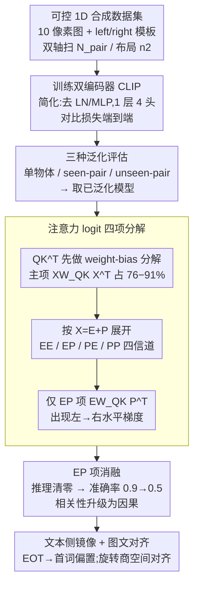

# Left-Right Symmetry Breaking in CLIP-style Vision-Language Models Trained on Synthetic Spatial-Relation Data

**会议**: ICML 2026  
**arXiv**: [2601.12809](https://arxiv.org/abs/2601.12809)  
**代码**: 无（基于 OpenAI CLIP 与 Sea-Snell/grokking 公开代码修改）  
**领域**: 多模态VLM  
**关键词**: CLIP, 空间推理, 机制可解释性, 注意力分解, 位置嵌入

## 一句话总结
作者用一个 1D 合成 image-text 测试床端到端训练 CLIP-style Transformer，发现这类模型能学到"左/右"关系并泛化到未见物体对，机制是**位置嵌入与 token 嵌入的交叉项 $EW_{QK}P^T$ 在 vision encoder 注意力 logit 中诱导出一条水平梯度**，打破左右对称；消融该项后左右判别准确率掉到随机水平。

## 研究背景与动机

**领域现状**：CLIP-style VLM 在零样本检索、分类上很强，但在关系理解（"谁在谁的左边"）、空间推理、组合泛化上反复被打脸。ARO、CLEVR、Winoground、NLVR2 等 benchmark 一致表明大型 VLM 经常退化为 "bag-of-words"——能识别有什么，不知道怎么排布。

**现有痛点**：评测类工作很多，但**机制性解释稀缺**——没人说清楚 VLM 究竟是用哪条路径来感知"左 vs 右"的，也没人靠消融某个具体组件把这种能力直接打掉来证明因果。最近有人指出视觉 token 在 LLM 里压制位置信息（Qi 2025），有人把空间失败归因于训练数据（Chen 2024），但缺统一图景。

**核心矛盾**：CLIP 训练目标本身不显式要求模型把"在 X 左边"和"在 X 右边"区分开，contrastive loss 完全可以在不利用组合结构的情况下被满足；那为什么有些模型能学到、有些不能？区别在架构哪一环？

**本文目标**：在一个完全可控的 minimal 设置里回答：(a) CLIP-style Transformer 能否学到忠实的相对空间关系编码？(b) 由什么机制实现？(c) 哪些训练因素是关键？

**切入角度**：跟随 mechanistic interpretability 的传统（Elhage 2021/2022, Olsson 2022, Okawa 2023），用极简 toy task + 小模型反向工程注意力电路。具体做法是把图像降到 1D 共 10 个像素，物体占 1 像素，文本只用 "X is on the left of Y" 这类模板，配上 1-layer / 4-head Transformer。

**核心 idea**：先证明这种最简版本能复现"标签多样性驱动泛化"现象，再对注意力 logit 做 token-position 嵌入四项分解，找出唯一打破左右对称的那一项，并通过消融实验把它确认为必要条件。

## 方法详解

整套方法不是新模型，而是"**可控合成数据集 + 简化 Transformer + 注意力分解 + 消融**"四件套：合成数据让我们能精确控制每个变量；简化 Transformer（去 LayerNorm/MLP、1 层、4 头，Elhage 2021 风格）让分析可解；逐项分解让我们看到具体哪一项导致左右不对称；消融让我们把相关性升级为因果。

### 整体框架
（1）合成 1D 图像-文本数据：图像是长度 $D^{\rm image}=10$ 的 1D 序列，背景为 0、物体编号 $\geq 1$，单物体或双物体；caption 模板"[label] is on the left/right of [label]"。训练时只用 $N_{\rm pair}=15$ 个标签的所有有序对（其余 $N_{\rm val}=5$ 留作未见对），位置随机采样。
（2）双编码器 CLIP：vision encoder 用双向自注意力，text encoder 用因果掩码，二者共享 $d_{\rm model}=128$、$d_{\rm head}=32$，CLS / EOT 取最终表征，余弦相似度 + 标准 CLIP 对比损失。
（3）评估三种泛化：single-object positional / seen-pair configuration / unseen-pair generalization。
（4）取已泛化的 1-层 4-头模型做**注意力分解**：把 pre-softmax logit $QK^T$ 先做 weight-bias 分解，再把主项 $XW_{QK}X^T$ 按 $X=E+P$ 展开为 4 项，逐项可视化并消融。

### 关键设计

**1. 可控 1D 合成数据集 + 标签/布局双轴扫描：把"什么驱动空间泛化"变成可干涉变量**

机制研究的前提是手里同时有"会泛化"和"不会泛化"两类模型，才能对照看哪一项注意力分解有差异——而真实图文数据混杂太多变量做不到这一点。本文把图像降到 1D 10-pixel，单 token 一物体，让"左/右"成为唯一的空间自由度，CLIP 训练流程其余部分照旧不动。训练时分别扫两条轴：标签多样性 $N_{\rm pair}\in\{5,...,15\}$ 和布局多样性 $n_2$（每对物体的位置组合数），并用三个 disjoint 验证集分别测三种泛化（单物体位置 / seen-pair 新布局 / unseen-pair）。

关键观察是：增大 $N_{\rm pair}$ 能显著抬高全部三种泛化准确率，增大 $n_2$ 几乎没用——**驱动泛化的是标签多样性而非布局多样性**。这与 Uselis 2025"数据多样性驱动组合泛化"吻合，但本文进一步指出关系任务的"多样性"必须沿 label 轴扫、沿 position 轴扫不够。1D 设计还有个工程红利：vision encoder 只剩 10 个 key 位置，后续四项 logit 分解的热图能直接被人眼读懂。

**2. 简化 Transformer + 注意力 logit 的四项分解：定位"左/右"信号从哪条信道流出**

要看清是哪个组件编码左右，就得把 attention logit 拆成可解释的几块。作者沿用 Elhage 2021 把 LayerNorm 与 MLP 砍掉，只留 1 个 block、4 头，再把 query/key 写成 $Q=XW_Q^T+B_Q^T$、$K=XW_K^T+B_K^T$，于是 $QK^T=XW_{QK}X^T+XW_Q^TB_K+B_Q^TW_KX^T+B_Q^TB_K$（$W_{QK}=W_Q^TW_K$）。Softmax 对按行的常数偏移不敏感，所以只有列方向变化的 $XW_{QK}X^T$ 和 $B_Q^TW_KX^T$ 真正影响 CLS 行的注意力分布，前者占 logit 标准差的 76%–91%。

把 $X=E+P$（token 嵌入 + 位置嵌入）代入主项再展开，就得到四条信道：$XW_{QK}X^T = \underbrace{EW_{QK}E^T}_{\rm EE} + \underbrace{EW_{QK}P^T}_{\rm EP} + \underbrace{PW_{QK}E^T}_{\rm PE} + \underbrace{PW_{QK}P^T}_{\rm PP}$，对应"内容-内容 / 内容-位置 / 位置-内容 / 位置-位置"。可视化发现**只有 EP 项 $EW_{QK}P^T$ 在 CLS 行上出现一条明显的左→右单调梯度**，给右侧物体加 logit 偏置；EE 项是 label-specific（看物体身份），PP 项几何对称基本不破缺左右，PE 项贡献很小。更关键的是在不泛化的模型里 EP 项的水平梯度**完全缺失**（App. G）——这构成机制性的"信号 vs 噪声"对照。分解还天然兼容多头：每头有独立 $W_{QK}$，可逐头比 $\Delta_{\rm label}$ 与 $\Delta_{\rm p.e.}$ 判断它是 relational 头还是 label-specific 头。

**3. EP 项消融：把相关性升级为因果**

光看到"EP 项有梯度"只是相关性证据。作者在推理阶段对全部 4 个头同时把 pre-softmax logit 里的 EP 项强行置 0（用已训好的 baseline 权重、不重新训练），再算 unseen-pair 准确率；同时消融 PP / PE / BP（$B_Q^TW_KP^T$）作为 negative control。结果干净利落：**EP 消融让准确率从 ≈0.9 掉到 ≈0.5（随机）**，而 PP/PE 消融几乎不动。App. H 进一步显示被消融的模型仍能识别"图里有 X 和 Y"（label-set 识别仍高），只是判不出谁左谁右——"识别"与"空间编码"两种能力被精确解耦。作者还消融了 value 通道里的位置依赖项 $PW_V^T$（VP 项），发现叠加消融 VP 也会拉到 0.5，说明注意力与 value 协同放大了泛化。这种"无此项则无能力"的硬消融，正是机制可解释性反复强调的 ablation-as-causation。

**4. 文本侧与图文对齐：语言侧也有对称的左右破缺**

vision 侧的故事在文本侧有个镜像。text encoder 的因果掩码本身就把序列顺序写进了表征——4 头里至少 1 头把 EOT→word 注意力强偏向句中首个被提及的实体，独立于 label，构成与 vision 侧对称的"语言侧左右破缺"。另一个副发现是：图像/文本同 label 的 token 嵌入在原空间里余弦相似度并不高，但只要在 1-15 号标签上拟合一个旋转矩阵，就能在 16-20 号未见标签上把两侧嵌入对齐——这暗示 CLIP 的图文对齐其实活在一个旋转商空间里，cosine 相似度看到的几何远比真实结构贫瘠。

## 实验关键数据

### 三种泛化随标签多样性的提升（左:右文本表征模式）

| $N_{\rm pair}$（训练标签数） | Single-object positional | Seen-pair configuration | Unseen-pair |
|----------------------------|--------------------------|-------------------------|-------------|
| 5（少） | 中等 | 中等 | 接近随机 |
| 15（多） | 高 | 高 | 高（接近全对） |
| 布局多样性 $n_2$ 单独变化 | 几乎无影响 | 几乎无影响 | 几乎无影响 |

（数值按论文 Fig. 3 趋势归纳，固定 $N_{\rm tot}=20$, $N_{\rm val}=5$；说明"label 多样性"是泛化主驱动而非"layout 多样性"。）

### 注意力 logit 分解项消融对 unseen-pair 准确率的影响（左侧 caption 设置）

| 消融条件（推理时清零，4 头同时） | Unseen-pair 准确率 | 解释 |
|-----------------------------------|---------------------|------|
| Baseline（无消融） | ≈0.9 | 完整模型可泛化 |
| 消融 EP 项 $EW_{QK}P^T$ | ≈0.5 | **掉到随机**，丧失左右判别 |
| 消融 PE 项 $PW_{QK}E^T$ | 接近 baseline | 该项不承担左右编码 |
| 消融 PP 项 $PW_{QK}P^T$ | 接近 baseline | 同上 |
| 消融 BP 项 $B_Q^TW_KP^T$ | 中等下降 | 偏置-位置耦合也带少量信号 |
| 同时消融 EP + 值通道 VP 项 $PW_V^T$ | ≈0.5（且 label-set 识别也受影响） | 注意力与 value 协同放大泛化 |

（数值按论文 Fig. 5(e) 与 App. I 趋势归纳。）

### 关键发现
- **标签多样性 >> 布局多样性**：把训练集里参与 pair 构造的标签数从 5 增到 15，全部三种泛化都从中等抬到接近满分；把每对的位置组合数 $n_2$ 增大几乎不动指标。这与"关系靠 label-conditional position encoding 涌现"的机制假说吻合。
- **EP 项是 unseen-pair 泛化的必要条件**：消融它把准确率从 ≈0.9 拉到 ≈0.5（随机），同时 label-set 识别仍保留——说明左右判别能力被精确切除而内容识别不受影响。
- 在不泛化模型里 EP 项的水平梯度完全消失（App. G）——同一架构、不同训练规模，泛化能力的有无与该项梯度的有无一一对应。
- 把 caption 模板从"只 left"扩展为"left + right"时，1 层 text encoder 容量不够，加到 2 层后能恢复泛化；vision 侧的 EP 机制不变。这说明左右破缺的负担在两侧不对称：vision 侧只需 1 层即可，text 侧需要更深的结构来同时编码两种等价表达。
- 同样的机制在 2D 设置（$4\times 4$ 图 16 token）和 3 物体设置上都复现，并在 autoregressive VLM（App. O）里观察到相似注意力梯度，提示该机制具备跨模态范式的潜力。

## 亮点与洞察
- **把"CLIP 学到左右"这件含糊的能力问题，转化为"哪一项 attention logit 在驱动它"的可消融假设**——这是 mechanistic interpretability 套路在 VLM 上的一次干净示范，论证链从"现象→分解→相关→消融→因果"五步齐全。
- **EP 项作为机制单元**：内容-位置交叉项不仅是数学拆分，还是真实承载关系信号的电路；这意味着位置嵌入并非可有可无的语法骨架，而是模型组合泛化的载体。把 RoPE 也纳入分析（App. J）说明该机制对现代 LLM/VLM 主流位置编码也成立。
- **标签多样性 vs 布局多样性的不对称**：这是个对 CLIP 数据策划有直接指导的发现——想训出"会理解关系"的模型，应该把数据预算花在覆盖更多 label 组合而不是更多位置变化上。这反过来也解释了为什么 web 规模图文对训练出的 VLM 在空间关系上反而吃力——web caption 的 label 覆盖看似多，但"实体对"的覆盖率仍稀疏。
- **图文对齐活在旋转商空间**这一副发现（拟合 rotation 后对齐才显现）暗示 CLIP 输出空间的几何远比 cosine 相似度可见的要丰富，对后续 probing 设计有启发。

## 局限与展望
- 实验是 1D / 2D toy + 极小 Transformer（1-2 层、$d_{\rm model}=128$），到大规模 web-scale CLIP 是否完全成立未直接验证；作者也明确这是 first-order mechanistic understanding，需要逐步纳入非线性组件、深层网络与真实图像。
- 只覆盖左/右关系，对"在前/后""里/外/重叠"等更复杂空间关系未做分解；不同关系的机制载体可能不同。
- text encoder 的 left+right 双 caption 设置下加深 2 层后才能泛化，但 2 层 Transformer 的 attention 分解不够干净，所以作者只解读了 vision 侧；text 侧机制留作 open。
- 简化模型去掉 LayerNorm/MLP 是为了分析可解，但 App. R 也承认非线性组件会修改该机制，完整刻画需要 LayerNorm 的近似分解工具。
- 该机制是"必要"但未证明"充分"——可能还有别的注意力路径协助；联合多头交互（App. P）尚未完全展开。

## 相关工作与启发
- **vs Yuksekgonul 2023 (ARO bag-of-words)**：他们经验性指出 CLIP 在关系任务上像 bag-of-words 退化；本文给出"为什么在某些条件下不退化"的机制——只要 label 多样性足够，EP 项会自发学出水平梯度。这把 ARO 的"失败原因"与"成功条件"在同一个分析框架里串起来。
- **vs Qi 2025 (Beyond Semantics)**：他们指出视觉 token 在 LLM 里抑制位置信息；本文展示在 CLIP 编码器内部、位置信息恰恰是关系泛化的关键。两条结论在不同接口层互补——位置信号在 vision encoder 里被学出来，但下游 LLM 又可能压制它。
- **vs Uselis 2025（数据多样性 → 组合泛化）**：他们关注属性式组合（颜色 × 形状）的可加因子化，本文关注关系式组合（左/右），机制不同——本文需要位置依赖的注意力，而非可加因子分解。这是"属性 vs 关系"两类组合任务机制可能本质不同的实证证据。
- **vs Elhage 2021/2022, Olsson 2022 (mechanistic circuits in LM)**：本文是 mechanistic interpretability 思路向多模态对比学习的扩展，方法学传承（简化模型 + logit 分解 + ablation）一脉相承。
- **启发**：要在大模型上同款分析"左右关系电路"，可以先在 ViT-CLIP/SigLIP 的 attention 上做相同的 EE/EP/PE/PP 分解，看哪几层、哪几头承担类似 EP 项的水平梯度；这是一个非常具体的可执行 follow-up。

## 评分
- 新颖性: ⭐⭐⭐⭐ toy task 不新，但"用 toy 找到 EP 项是因果路径"是 CLIP 机制可解释性方向的首个具体定位。
- 实验充分度: ⭐⭐⭐⭐ 三种泛化 + 4 头分解 + 多项消融 + 2D / 3物体 / autoregressive 复现，证据链非常齐全；缺真实大规模 VLM 验证。
- 写作质量: ⭐⭐⭐⭐ 概念干净，公式与图配合好，但部分关键证据（如准确率具体数字）藏在附录。
- 价值: ⭐⭐⭐⭐ 给"CLIP 怎么学空间关系"这个被大量 benchmark 反复评测但少有解释的问题给出第一性的机制答案，对 VLM 训练数据策划和位置编码设计有直接指导。

<!-- RELATED:START -->

## 相关论文

- [\[ACL 2025\] SpaRE: Enhancing Spatial Reasoning in Vision-Language Models with Synthetic Data](../../ACL2025/multimodal_vlm/spare_enhancing_spatial_reasoning_in_vision-language_models_with_synthetic_data.md)
- [\[ICCV 2025\] CLIPSym: Delving into Symmetry Detection with CLIP](../../ICCV2025/multimodal_vlm/clipsym_delving_into_symmetry_detection_with_clip.md)
- [\[ICML 2026\] 3ViewSense: Spatial and Mental Perspective Reasoning from Orthographic Views in Vision-Language Models](3viewsense_spatial_and_mental_perspective_reasoning_from_orthographic_views_in_v.md)
- [\[ICML 2026\] Active Exploring like a Pigeon: Reinforcing Spatial Reasoning via Agentic Vision-Language Models](active_exploring_like_a_pigeon_reinforcing_spatial_reasoning_via_agentic_vision-.md)
- [\[ICLR 2026\] Breaking the Limits of Open-Weight CLIP: An Optimization Framework for Self-supervised Fine-tuning of CLIP](../../ICLR2026/multimodal_vlm/breaking_the_limits_of_open-weight_clip_an_optimization_framework_for_self-super.md)

<!-- RELATED:END -->
