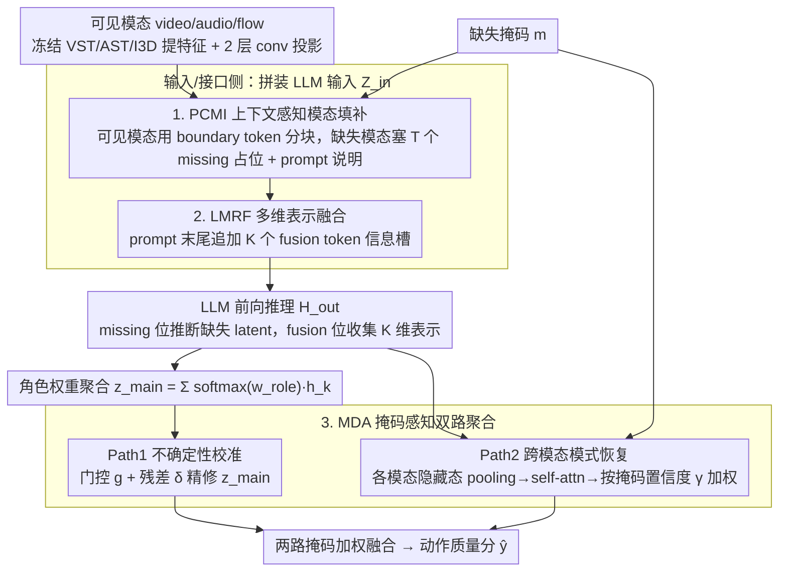

# LIMSSR: LLM-Driven Sequence-to-Score Reasoning under Training-Time Incomplete Multimodal Observations

**会议**: ICML 2026 Spotlight  
**arXiv**: [2605.00434](https://arxiv.org/abs/2605.00434)  
**代码**: https://github.com/XuHuangbiao/LIMSSR  
**领域**: 多模态 VLM / 不完整多模态学习 / 动作质量评估  
**关键词**: Incomplete Multimodal Learning、LLM Reasoning、Action Quality Assessment、Mask-Aware Fusion、Token-level Regularization

## 一句话总结
作者把"训练阶段就缺模态"的多模态动作质量评估重新建模成"基于 LLM 的条件序列到分数推理"问题，用 prompt + 特殊 token 让 LLM 在没有完整数据监督的情况下补全缺失语义，再配合掩码感知的双路融合抑制幻觉，在三个 AQA 数据集上全面超越依赖完整训练数据的 SOTA。

## 研究背景与动机

**领域现状**：现实场景里多模态数据常常缺模态——传感器故障、隐私脱敏、采集成本都会让 video/audio/flow 等数据残缺。学术界研究的 Incomplete Multimodal Learning（IML）主要分两条线：(a) reconstruction-based（ActionMAE、IMDer、GAIN、DMVG）直接重建缺失模态特征；(b) distillation/prior-based（CorrKD、MoMKE、MCMoE）用完整模态作为教师做蒸馏或先验。

**现有痛点**：这两类方法都隐含一个"上帝视角"假设——训练时必须有完整模态作为重建目标或蒸馏教师。但真实数据采集就缺，比如某些受试者从未录过音频。一旦训练数据本身就缺，重建无 GT、蒸馏无教师，整个 IML 框架就坍塌。

**核心矛盾**：当训练阶段就缺模态时，缺失的语义如何"凭空"想象出来？传统重建-蒸馏路线需要"完整-不完整"配对，但配对本身不存在；而单纯填零会让模型把"缺失"当噪声学，导致主任务掉点；需要一种不依赖配对监督就能"推断"缺失语义的机制。

**本文目标**：(i) 形式化"训练时不完整观测"这个更现实的设定；(ii) 提出一个不依赖完整训练数据就能推断缺失语义的框架；(iii) 在长视频 Action Quality Assessment（AQA）这个高度依赖多模态的任务上验证。

**切入角度**：作者注意到 LLM 不仅是序列模型，还自带海量世界知识和推理能力——给定可观测模态 + 缺失结构的描述，LLM 应该能像"完形填空"一样推出缺失部分的语义表示，而无需 pixel-level 重建。

**核心 idea**：把不完整多模态学习重新表述为"条件序列推理"——用 prompt 描述任务和缺失状态，用 missing token 占位、fusion token 收集，让 LLM 在不可见缺失模态的条件下推断 latent semantic，再用 mask-aware gating 校准推理的不确定性。

## 方法详解

### 整体框架
对样本 $(\mathbf{X} \odot \boldsymbol{m}, \boldsymbol{m}, y)$（$\boldsymbol{m}\in\{0,1\}^M$ 是缺失掩码），LIMSSR 走三步：(1) Context Construction $\Phi_{in}$ 把指令 prompt、可见模态特征 $\tilde{\mathbf{X}}^m$、missing token 占位序列、fusion token 拼成统一 embedding $\mathbf{Z}_{in}$；(2) LLM 推理 $\mathbf{H}_{out} = \mathrm{LLM}(\mathbf{Z}_{in})$ 同时完成缺失语义推断和多模态融合；(3) Mask-Aware Dual-Path Aggregation $\Psi_{agg}$ 把高层语义路径和底层跨模态路径用掩码加权融合，输出动作质量分 $\hat{y}$。模态侧用冻结的 VST/AST/I3D 提 video/audio/flow 特征，经 2 层 conv 投影到 LLM 输入空间。下面三个贡献模块（PCMI、LMRF、MDA）分别落在输入侧、接口侧、输出侧，恰好对应下文三个关键设计。

### 关键设计

**1. Prompt 引导的上下文感知模态填补（PCMI）：把缺失模态从"零向量"升格为"待推断的潜变量"**

传统零填充会让缺失信号在 attention 里被当噪声埋没，模型越学越偏；MissRAG/TAMML 之类用 RAG 或文本桥接，又得额外维护检索库或预训练对齐。PCMI 的做法是把缺失结构直接写进序列：每个模态 $m$ 都用一对边界 token `<m_start>, <m_end>` 包起来，可见模态里面塞真实特征 $\tilde{\mathbf{X}}^m$，缺失模态里面塞 $T$ 个重复的可学习 `<missing_m>` 占位嵌入；再配一段 prompt 把可见/缺失状态讲明白——"Given the available {avail} features... The {miss} modality is missing. Based on the available modalities, please infer and reconstruct the useful latent representations for the missing {miss} modalities at the designated positions"。LLM 前向后，从这些 missing 位置抽隐藏态 $\mathbf{H}_{miss}^m = \mathrm{LLM}(\mathbf{Z}_{in})|_{\text{positions of }\mathbf{E}_{miss}^m}$ 就是推断出来的缺失表示。这样设计的妙处在于，"猜下一个 token"和"推断 missing latent"在数学形式上本就是同一件事，LLM 的 next-token 机制天然适配，无需 pixel 级重建、也无需配对监督。

**2. LLM 驱动的多维表示融合（LMRF）：用专门的 token 槽收集跨模态信息，而不是粗暴 pooling**

直接对 LLM 长序列输出做 mean-pooling，会把它的生成结构压塌、丢掉维度信息。LMRF 借鉴 BERT 的 `[CLS]` 思路但推广到多维：在 prompt 末尾追加 $K$ 个特殊 token `<emb_dim_1>, ..., <emb_dim_K>` 当"信息槽"，并显式指示 LLM "integrate and enhance all multimodal features for action quality assessment. Output the fused multi-dimensional feature representations at the designated feature dimension positions"。最后一层在这些位置的输出 $\mathbf{H}_{fusion} = \{\boldsymbol{h}_1, \dots, \boldsymbol{h}_K\}$ 被视为分别承载不同评价维度（如难度、执行、艺术性），再用可学习角色权重聚合成主向量 $\boldsymbol{z}_{main} = \sum_k \mathrm{Softmax}(\boldsymbol{w}_{role})_k \cdot \boldsymbol{h}_k$。比起 pooling 更结构化，比起隐式 attention head 又更贴近人类对"评价维度"的解释。

**3. 掩码感知双路聚合（MDA）：让模型自己掂量"现在到底信不信我推出来的东西"**

只靠 LLM 推理，在严重缺失时会幻觉；只靠统计聚合，又缺高层语义。MDA 同时跑两条路再按缺失掩码混合。Path 1（不确定性校准推理）在主向量上算门控 $\boldsymbol{g} = \sigma(\mathrm{MLP}_{gate}([\boldsymbol{z}_{main}, \boldsymbol{m}]))$ 和残差 $\boldsymbol{\delta} = \mathrm{MLP}_{res}([\boldsymbol{z}_{main}, \boldsymbol{m}])$，得到精修表示 $\tilde{\boldsymbol{z}}_{main} = \boldsymbol{z}_{main} + \boldsymbol{g}\odot \boldsymbol{\delta}$；Path 2（跨模态模式恢复）把各模态位置的 LLM 隐藏态 temporal pooling 成 $\boldsymbol{h}_v, \boldsymbol{h}_a, \boldsymbol{h}_f$，stack 后做 self-attention 得 $\mathbf{Z}_{attn}$，再按可用性加权 $\alpha_{m_j} = \boldsymbol{m}_j \cdot 1 + (1-\boldsymbol{m}_j)\cdot \gamma_{m_j}$（$\gamma_m = \sigma(\lambda_m)$ 是模态级可学习置信度），汇成 $\boldsymbol{z}_{aux} = \sum_m \alpha_m (\boldsymbol{z}_{attn}^m \odot \mathcal{G}(\mathbf{H}_{stack})^m)$。举个具体的：当只剩视频、音频和光流都缺时，掩码会把缺失模态那两路的权重压到学习出来的低置信度 $\gamma$ 上，强迫输出更多依赖可见的视频路径，而不是放任 LLM 在没信息时硬编。两路融合给出最终动作质量分。

### 一个完整示例：只有视频、推断缺失的音频与光流

以一段花样滑冰视频、音频和光流都缺为例走一遍：①PCMI 把视频特征塞进 `<v_start>...<v_end>`，音频/光流位置各放 $T$ 个 `<missing>` 占位，并在 prompt 里写明"音频、光流缺失，请据可见视频推断它们的潜在表示"；②LLM 前向，一边在 missing 位置生成缺失模态的 latent，一边在末尾 $K=3$ 个 `<emb_dim>` 槽里写出"难度/执行/艺术性"三维融合表示；③MDA 的 Path 2 发现两路模态掩码为 0、对应置信度 $\gamma$ 很低，于是把它们的贡献压低，主要信任视频路径，Path 1 再用门控做一次不确定性校准；④两路加权得到最终分数。整条链没有用到任何完整训练样本，缺失语义全靠 LLM 的世界知识"脑补"。

### 损失函数 / 训练策略
除了主任务回归 loss，作者引入：(1) Consistency Learning 约束两路输出一致，逼推理路径与统计路径相互校验；(2) Token-Level Metric Regularization 让不同 fusion token 学习不同特征维度（避免 collapse），具体是用 token 之间的相似度矩阵 + 正则项最大化非对角元素的距离；(3) LLM 主干部分可选 LoRA 微调，避免全量训练。

## 实验关键数据

### 主实验（FS1000，7-class，Spearman ↑ / MSE ↓，T-Miss 表示训练时也缺模态）

| 方法 | T-Miss | {v,f} | {v,a} | {v} | {a} | Average | {v,f,a} |
|------|--------|-------|-------|------|------|---------|---------|
| ActionMAE | ✗ | 0.775/24.66 | 0.766/64.13 | 0.761/50.64 | 0.458/41.66 | 0.651/38.18 | 0.809/17.96 |
| GCNet | ✗ | 0.730/25.56 | 0.740/23.86 | 0.696/26.67 | 0.442/39.40 | 0.610/28.62 | 0.764/21.82 |
| MoMKE | ✗ | 0.798/18.86 | 0.805/23.88 | 0.785/37.96 | 0.499/27.53 | 0.668/26.08 | 0.819/16.85 |
| MCMoE | ✗ | 0.845/12.66 | 0.882/11.85 | 0.845/13.64 | 0.615/16.72 | 0.782/15.37 | 0.881/11.53 |
| **LIMSSR** | **✓** | **0.854/12.51** | **0.891/10.54** | **0.853/12.50** | **0.687/15.51** | **0.789/14.08** | **0.891/10.44** |

| Δ vs SOTA | {v,f} | {v,a} | {v} | {a} | Average | {v,f,a} |
|-----------|-------|-------|------|------|---------|---------|
| ΔSpearman | ↑1.1% | ↑1.0% | ↑0.9% | ↑11.7% | ↑0.9% | ↑1.1% |
| ΔMSE | ↓1.2% | ↓11.1% | ↓8.4% | ↓7.2% | ↓8.4% | ↓9.5% |

注意：LIMSSR 是表里唯一在 T-Miss ✓ 下训练的模型，却在几乎所有缺失组合上都超过了所有 T-Miss ✗（即拿到完整训练数据）的方法。这是这篇论文最有力的"质性差异"证据。

### 消融实验

| 配置 | Average Spearman | 说明 |
|------|------------------|------|
| Full LIMSSR | 0.789 | 完整框架 |
| w/o PCMI（直接零填充缺失模态）| 显著下降 | 缺失语义无法被 LLM 推断 |
| w/o LMRF（用 mean pooling 代替 fusion token）| 下降 | 多维度信息坍缩 |
| w/o MDA Path 1（只走 cross-modal aggregation）| 下降 | 缺高层语义校准 |
| w/o MDA Path 2（只走 LLM 推理）| 下降 | 严重缺失下幻觉 |
| w/o Consistency Loss | 下降 | 两路缺乏相互校验 |
| w/o Token-Level Regularization | 下降 | fusion token 出现冗余 |

### 关键发现
- **训练时缺模态反而能赢过训练时不缺的对手**：这是论文最反直觉的结果——只有音频的极端缺失情况下，LIMSSR Spearman 比 SOTA 高 11.7%、MSE 低 7.2%，说明 LLM 的世界知识在补全缺失语义上确实有"质性"优势。
- **Path 1 + Path 2 互补**：单独任何一路都掉点；MDA 的掩码自适应融合是抗幻觉的关键。
- **Fusion token 数 $K$ 的甜点**：$K=3$ 最匹配 AQA 的"难度/执行/艺术性"三维结构，再多就开始过拟合。
- **音频模态最难补**：所有方法在 {a}-only 设置下都最差，因为音频对动作质量本身相关性最低，但 LIMSSR 仍然远超基线，说明 LLM 推断能力在低信息模态上的相对增益最大。

## 亮点与洞察
- **任务重构是最大贡献**：把 IML 从"重建/蒸馏"重构为"条件序列推理"，等于把一个监督受限问题变成了一个 LLM 擅长的 next-token 问题；这种把领域任务"reformulate as LM task"的思路可以迁移到很多 multimodal 残缺场景。
- **特殊 token 设计很优雅**：missing token 占位 + boundary token 分块 + fusion token 收尾，把 LLM 当成一个可编程的"语义计算器"，无需修改 LLM 架构就能完成定制功能。
- **掩码感知的双路自适应**：把"我对自己有多自信"也编码进网络，配合可学习的模态级置信度 $\gamma_m$，体现了对推理不确定性的工程化处理。
- **训练时缺数据反胜训练时完整数据**：这一发现给 IML 社区一个全新视角——LLM 的先验本身可能比 paired data 还宝贵，未来或许该重新审视"我们是不是被 paired data 的范式绑架了"。

## 局限与展望
- 主要在 AQA 任务上验证，迁移到情感识别、医学诊断等其他 IML 场景的有效性需要更多实验。
- LLM 推理引入显著计算成本，对实时性要求高的应用（如直播评分）可能不实用。
- 缺少对 LLM scale（7B/13B/70B）的系统性实验；只有 LLM 的世界知识与任务相关时才能发挥作用，对低资源语言或冷门动作类型未必有效。
- "幻觉"的定义和测量没有量化指标，只是用 MDA 间接缓解。
- 没有给出在文本-视觉-音频之外更多模态（如生理信号、深度图）上的扩展实验。

## 相关工作与启发
- **vs ActionMAE / IMDer / DMVG（reconstruction）**：这些方法依赖完整训练对，本文打破了这一约束。
- **vs MoMKE / MCMoE / CorrKD（distillation/prior）**：它们仍需要完整模态作为教师，LIMSSR 用 LLM 先验取而代之，本质上是"用通用世界知识替代领域内 paired supervision"。
- **vs MissRAG / TAMML（基于 LLM 的 IML）**：MissRAG 需要预先构建模态原型池，TAMML 把所有模态文本化损失精细信息；LIMSSR 直接让 LLM 在原 embedding 空间推理，更通用且无外部依赖。
- **vs Hedgehog / LoLCATs（LLM 端解决其他任务）**：思路上一致——挖掘 LLM 的非语言能力来解决领域问题；但 LIMSSR 关注的是"缺信息推断"而非"长序列建模"。

## 评分
- 新颖性: ⭐⭐⭐⭐⭐ 提出"训练时不完整观测"新设定，并用 LLM 序列推理重塑 IML 范式，问题和方法都很新。
- 实验充分度: ⭐⭐⭐⭐ 三个公开 AQA benchmark + 多种缺失组合 + 与 10+ 基线对比；但只在 AQA 上验证，跨任务推广性证据不足。
- 写作质量: ⭐⭐⭐⭐ 故事讲得清楚，图 1 三种范式对比一目了然；公式较多但都有具体语义。
- 价值: ⭐⭐⭐⭐ 给 IML 社区一个新范式，也给 LLM-as-tool 应用一个有说服力的非语言案例。

<!-- RELATED:START -->

## 相关论文

- [\[ICLR 2026\] Reasoning-Driven Multimodal LLM for Domain Generalization](../../ICLR2026/multimodal_vlm/reasoning-driven_multimodal_llm_for_domain_generalization.md)
- [\[ACL 2026\] STELLA: A Multimodal LLM for Protein Functional Annotation via Unified Sequence-Structure Encoding](../../ACL2026/multimodal_vlm/stella_a_multimodal_llm_for_protein_functional_annotation_via_unified_sequence-s.md)
- [\[CVPR 2026\] Breaking Multimodal LLM Safety via Video-Driven Prompting](../../CVPR2026/multimodal_vlm/breaking_multimodal_llm_safety_via_video-driven_prompting.md)
- [\[CVPR 2026\] MODIX: Training-Free Multimodal Information-Driven Positional Index Scaling for VLMs](../../CVPR2026/multimodal_vlm/modix_positional_index_scaling.md)
- [\[ACL 2026\] TableVista: Benchmarking Multimodal Table Reasoning under Visual and Structural Complexity](../../ACL2026/multimodal_vlm/tablevista_benchmarking_multimodal_table_reasoning_under_visual_and_structural_c.md)

<!-- RELATED:END -->
