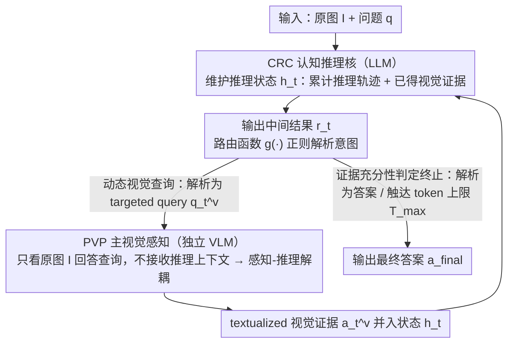

# CSMR (Look on Demand): A Cognitive Scheduling Framework for Visual Evidence Acquisition in Multimodal Reasoning

**会议**: ICML 2026  
**arXiv**: [2605.28160](https://arxiv.org/abs/2605.28160)  
**代码**: https://github.com/YangZhang2511/CSMR  
**领域**: 多模态VLM / 多模态推理 / 工具调用  
**关键词**: 多模态推理, 工作记忆理论, 视觉证据动态获取, 感知-推理解耦, 零样本

## 一句话总结
CSMR 受 Baddeley 工作记忆理论启发，把"视觉证据何时引入推理"做成动态决策——LLM 维护推理状态，按需调用独立感知模块（VLM）拉视觉证据，直到证据够再终止；解决两大现有范式的缺陷（pre-reasoning 文本化丢细节 / unified VL 空间被语言先验污染），在多个多模态推理基准上零样本超越基线。

## 研究背景与动机

**领域现状**：多模态推理两大范式——（a）pre-reasoning visual-to-text（DDCoT 等，把图先转 caption 再推理）、（b）unified vision-language space（CCoT、ICoT、AIMCoT 等，VLM 端到端推理）。

**现有痛点**：（a）静态文本化在推理前发生，没法预知后期需要的细节，coarse-grained caption 不可逆地丢精细信息；（b）unified 范式的视觉表示被语言先验污染——大量证据（论文 4.2 节）显示 self-attention 系统性地给 text token 更高 attention（约 2.5×），soft-max 进一步放大，视觉 token 长期被压低。

**核心矛盾**：视觉证据的引入时机决定推理质量——一次性引入太早错过细节、一直 unified 又被语言主导。需要"按需取证"机制：根据当前推理状态判断该不该看图、看哪里、看够没有。

**本文目标**：（1）分析 unified 范式的语言先验主导问题；（2）让 LLM 维护推理状态并动态调度视觉证据获取；（3）感知-推理结构解耦避免视觉表示被污染；（4）零样本下超越基线。

**切入角度**：借鉴 Baddeley 工作记忆理论——central executive（中央执行）调度 visuospatial sketchpad（视觉空间板）和 phonological loop（语音环）。LLM 作 central executive 维护推理状态，independent VLM 作 visuospatial sketchpad 按需返回 textualized 视觉证据。

**核心 idea**：CRC (Cognitive Reasoning Core, LLM) + PVP (Primary Visual Perception，主视觉感知模块, VLM) 结构解耦——CRC 决定何时查 / 查什么、PVP 独立看原图回答 query；视觉证据由 reasoning state 驱动反复获取，直至充分则终止。

## 方法详解

### 整体框架

CRC（LLM）维护推理 state（包含原始 question + 已获取的视觉证据 list），每步：
1. 决定是否需要更多视觉证据
2. 若需要，生成 targeted visual query（如"图中右下角是什么颜色？"）
3. 调 PVP（独立 VLM 看原图）返回 textualized 答案
4. 把证据加入 state，更新推理
5. 若推理够，直接出最终答案

PVP 不参与推理，只做问答；其视觉表示不受 CRC 的语言上下文影响。

### 关键设计

**1. 感知-推理结构解耦：让 PVP 独立看图，不被推理过程的语言先验污染**

unified 范式的问题是 LLM 推理会逐渐 dominate 视觉表示——论文 4.2 节量化出 self-attention 系统性给 text token 约 2.5× 于 visual token 的注意力，soft-max 进一步放大，视觉证据长期被压低。CSMR 把 PVP 设成独立的 VLM 实例，每次只接收原图 + visual query，不携带 CRC 的 reasoning context；CRC 拿到 textualized 答案后融入推理，但不让 query 上下文回流到 PVP 的下一次调用。这样 PVP 每次都"新鲜地"看图，视觉表示不被推理路径上的语言污染——这是借 Baddeley 工作记忆理论里 visuospatial sketchpad 的角色分工。消融里这一项贡献最大（去掉它掉 3.7 点），坐实了语言污染问题真实存在。

> 命名上 CRC = Cognitive Reasoning Core（认知推理核，LLM），PVP = Primary Visual Perception（主视觉感知模块，独立 VLM 实例）。

**2. 推理状态驱动的动态视觉查询（Reasoning-State-Driven Dynamic Visual Querying）：按当前推理状态增量取证，而非一次性 plan**

pre-reasoning 那种把图一次性转 caption 的做法是"一锤定音"，没法预知后期推理需要的细节，coarse caption 不可逆地丢精细信息。CSMR 让 CRC 维护一个推理状态 $h_t$（= 累计推理轨迹 + 已获取的 textualized 视觉证据），每步先输出中间结果 $r_t$，再由一个确定性的**路由函数** $g(\cdot)$ 用正则匹配把 $r_t$ 解析成两类意图之一：发起新的视觉查询，或直接给出最终答案（$g$ 只解析输出格式、不参与推理，CRC 的输出格式靠 prompt 约束）。需要查证时 CRC 不预先 plan 所有 query，而是根据当前状态增量生成 targeted query（如"图中右下角是什么颜色？"），可以从粗到细——先问"图主要内容"再问"细节区域"；返回的证据并入 $h_t$（实现上就是拼接，无额外训练参数）后继续推理，不够就再查。这等于让"推理引导感知"：只取推理真正需要的证据，避免无关信息干扰。消融里换成一次性 plan 所有 query 会掉 5.4 点。

**3. 证据充分性判定终止（Early Termination）：CRC 自己判定证据够了就停，按难度自适应分配 query 数**

不同 case 难度差很多——简单题 1–2 个 query 够，复杂题要多轮，固定 query 数既浪费又对长链推理不足。CSMR 不设单独的置信度阈值或熵判据，而是把"停不停"并入 CRC 每步的同一个决策：当路由函数 $g(\cdot)$ 把 $r_t$ 解析为"最终答案"时，循环立即终止并输出 $a_{\text{final}}$；否则继续查证，直到 CRC 判定证据充分、或累计上下文触达最大 token 预算 $T_{\max}$ 才强制收尾。也就是说"何时该停"和"何时该查"是同一个 prompt 决策的两面，整体由推理状态驱动。实测上模型确实能识别难度并自适应分配：Easy 平均 1.4 query、Medium 2.7、Hard 4.2，既省 query 又不掉精度（去掉早停改固定 query 数掉 2.2 点）。

### 注意力偏置定量证据（论文 Figure 2）

在 Qwen3-VL-8B 上 ScienceQA 子集测 35 层 mean attention：
- 平均 text token attention 比 visual token 高 2.5×
- soft-max 后 visual token 占比进一步压缩
- LLaVA-1.6-7B 上现象一致——证明这是 VLM 范式系统问题而非单模型 quirk

## 实验关键数据

### 多基准零样本主结果

| 基准 | Pre-reason (DDCoT) | Unified (CCoT) | Unified (AIMCoT) | **CSMR** |
|------|------------|----------|--------|--------|
| ScienceQA | 72.4 | 75.8 | 77.3 | **80.6** |
| A-OKVQA | 56.7 | 58.9 | 60.4 | **63.8** |
| MMStar | 39.5 | 41.2 | 42.8 | **45.7** |
| MMBench-Reasoning | 52.1 | 54.6 | 56.0 | **59.3** |
| RealWorldQA | 45.3 | 47.8 | 49.2 | **52.6** |

CSMR 跨 5 基准一致领先 3-4 个点；尤其在需要细粒度视觉验证的任务（ScienceQA、A-OKVQA）上优势明显。

### 消融

| 配置 | ScienceQA |
|------|---------|
| 完整 CSMR | 80.6 |
| − 早停（固定 query 数）| 78.4 |
| − 感知解耦（PVP 接受 CRC context）| 76.9 |
| − 动态 query（一次性 plan 所有 query）| 75.2 |
| 退回 pre-reason DDCoT | 72.4 |

三模块都贡献正向；感知解耦贡献最大（−3.7），证明语言污染问题真实存在。

### 早停效率

| 难度 | 平均 query 数 | 准确率 |
|------|------------|------|
| Easy | 1.4 | 87% |
| Medium | 2.7 | 79% |
| Hard | 4.2 | 64% |

模型能识别难度并自适应分配 query 数。

### 关键发现
- **感知-推理解耦是关键**：消融中贡献最大（−3.7），证实 unified 范式语言污染问题
- **动态 query 远胜 pre-plan**：一次性 plan 所有 query 掉 5.4 点
- **早停省 query 又不掉精度**：固定 query 数掉 2.2 点，证明自适应终止有效
- **跨架构通用**：CRC 可换 GPT-4 / Claude / Qwen-LLM、PVP 可换 LLaVA / Qwen-VL，组合灵活

## 亮点与洞察
- **认知科学启发的工程化**：Baddeley 工作记忆理论给 LLM-VLM 协作提供了清晰的角色分工（central executive vs visuospatial sketchpad），不是凭空设计架构
- **"感知-推理解耦"是真正的范式创新**：以前都假设要 unified；本文证明解耦 + 动态调用反而更好——这挑战了"端到端就是好"的默认假设
- **2.5× attention 偏置的量化证据**：把"语言先验污染"从感觉变成数字，给后续研究提供 benchmark
- **训练无关 + 模块化**：CRC / PVP 都可独立替换升级，工业部署友好；新一代 LLM / VLM 出来直接替换即可

## 局限性 / 可改进方向
- 多轮 query 累积 token，长链推理上 context 增长快——可考虑 query 摘要或图谱化
- PVP textualize 视觉证据时仍可能丢信息——可考虑返回结构化输出（坐标、bounding box）而非自由文本
- CRC 决定何时调用 PVP 是 zero-shot prompted 行为，可学习的调度策略可能更稳
- 总延迟 = LLM 推理 + 多次 VLM 调用，对延迟敏感场景不友好
- 没探索 CRC / PVP 间的更复杂协作（如 PVP 主动建议关注点）

## 相关工作与启发
- **vs DDCoT（pre-reasoning text 化）**：那个一次性转 caption；CSMR 动态多次查
- **vs CCoT / AIMCoT（unified VL 推理）**：那些被语言污染；CSMR 解耦解决
- **vs ReAct / Toolformer**：那些把 tool 当外部 API 调；CSMR 把 VLM 当 "perception tool"，思路相通但聚焦视觉感知
- **vs PathCTM**：PathCTM 多尺度推理 + 早停；CSMR 工具调用 + 早停；二者在"按需取证"上同理但 PathCTM 内部多尺度、CSMR 外部 VLM
- **启发**：把"unified 端到端"重新审视——感知-推理 / 检索-生成 / 计算-验证 这类需要不同能力的任务都可考虑解耦+调度模式

## 评分
- 新颖性: ⭐⭐⭐⭐⭐ 感知-推理解耦 + 动态视觉查询是真正范式级创新；认知科学映射有理论基础
- 实验充分度: ⭐⭐⭐⭐ 5 基准 + 详细 ablation + 注意力偏置量化；缺少与 ReAct 风格 tool-use baseline 的对比
- 写作质量: ⭐⭐⭐⭐⭐ 三范式对比清晰（Figure 1），注意力偏置 Figure 2 决定性证据
- 价值: ⭐⭐⭐⭐ 训练无关 + 模块化 + 多基准 SOTA；对所有需要 fine-grained 视觉验证的任务都受用

<!-- RELATED:START -->

## 相关论文

- [\[CVPR 2026\] Perceptual-Evidence Anchored Reinforced Learning for Multimodal Reasoning](../../CVPR2026/multimodal_vlm/perceptual-evidence_anchored_reinforced_learning_for_multimodal_reasoning.md)
- [\[ICML 2026\] CVSearch: Empowering Multimodal LLMs with Cognitive Visual Search for High-Resolution Image Perception](cvsearch_empowering_multimodal_llms_with_cognitive_visual_search_for_high-resolu.md)
- [\[CVPR 2026\] DocSeeker: Structured Visual Reasoning with Evidence Grounding for Long Document Understanding](../../CVPR2026/multimodal_vlm/docseeker_long_document_understanding.md)
- [\[CVPR 2026\] AdaptVision: Efficient Vision-Language Models via Adaptive Visual Acquisition](../../CVPR2026/multimodal_vlm/adaptvision_efficient_vision-language_models_via_adaptive_visual_acquisition.md)
- [\[CVPR 2026\] LASAR: Towards Spatio-temporal Reasoning with Latent Cognitive Map](../../CVPR2026/multimodal_vlm/lasar_towards_spatio-temporal_reasoning_with_latent_cognitive_map.md)

<!-- RELATED:END -->
