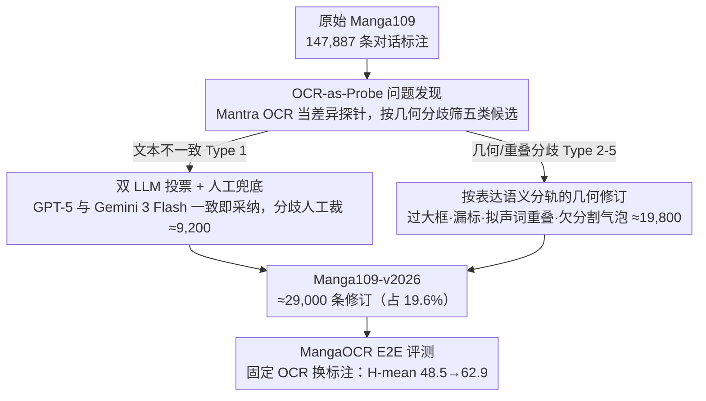

# Manga109-v2026: Revisiting Manga109 Annotations for Modern Manga Understanding

**会议**: ICML 2026  
**arXiv**: [2605.21182](https://arxiv.org/abs/2605.21182)  
**代码**: 无（项目页：https://manga109.github.io/manga109-project-website/en/ ）  
**领域**: 多模态VLM  
**关键词**: 漫画理解, OCR评测, 数据集修订, 拟声词, 语音气泡分割

## 一句话总结
作者重审 Manga109 这一漫画 AI 研究的基础数据集，识别出五类对话文本标注问题，结合商用 OCR + GPT-5/Gemini 3 Flash 双 LLM 投票 + 人工校验，修订约 29,000 条标注（占全部 147,887 条文本标注的 19.6%）发布 Manga109-v2026，使端到端 OCR 评测 H-mean 从 48.5 提升到 62.9（+14.4 pp）。

## 研究背景与动机

**领域现状**：日漫是一种独特的多模态媒介，融合视觉叙事、风格化排版、语音气泡与拟声词。Manga109（Matsui 2017；Aizawa 2020）是漫画 OCR、翻译、转录、多模态理解、漫画专用大模型等任务的基础数据集，几乎所有 manga-AI 系统都在其上训练或评测。

**现有痛点**：Manga109 的对话文本标注是十几年前按当时 OCR 设定做的，与现代多模态系统出现明显错配——抄写错误、过大的 bounding box（一个框框住多段文字或非文字像素）、漏标的短表情符（"！"、"…"）、对话文本与拟声词标注重叠、把多个相连气泡当成单个文本区域等问题，会在评测时把 OCR 系统的"正确检测"判为错误，也会让训练信号混入不准确的转录。

**核心矛盾**：漫画的表达性结构（拟声词、气泡布局、风格化字体）和现代检测器的行为之间存在表征粒度的根本错配——旧标注按"整段对话一个框"组织，而现代 OCR 倾向把每个气泡当独立实例输出；旧标注又把拟声词混进对话框，破坏了翻译时本应保留的拟声修辞。

**本文目标**：在不改变 Manga109 总体框架的前提下，系统化识别并修订对话标注层的五类问题，并实证修订对 OCR 评测可靠性的影响。

**切入角度**：作者不把任何单一 OCR 当成 ground truth，而是把商用 Mantra OCR 输出作为"差异探针"——只要 OCR 输出和旧标注分歧，就送进人工/LLM 审核流。这把"全量重审"问题转化为"按分歧采样审核"，极大压缩人工开销，又能聚焦真正影响现代系统的位置。

**核心 idea**：用现代 AI（商用 OCR + 双 LLM 投票）做大规模"问题候选发现"，再由人类做"最终裁决"，把人机协同迭代用于文化数据资产的代际维护。

## 方法详解

整篇工作不是新建模型，而是一套**问题发现 → 类型化 → 修订 → 评测验证**的人机协同流程。可以理解为一个针对漫画对话标注的"代码 review 流水线"：OCR 充当 linter，LLM 充当 reviewer 1 与 reviewer 2，人类作为 maintainer。

### 整体框架
输入是原始 Manga109 的全部 147,887 条对话文本标注。流程分四步：
（1）拉取商用 Mantra OCR 对全部漫画页的检测/识别输出；
（2）把 OCR 输出与原标注做空间与文本对齐，自动筛出五类分歧候选；
（3）按类型分别走不同的修订子流程（LLM 投票 / 区域细分 / 人工补标 / 重叠剔除 / 气泡再分割）；
（4）用 MangaOCR 协议在新老两套标注上跑相同 OCR 输出，比较 E2E precision/recall/H-mean。最终落地为 Manga109-v2026，覆盖 ≈29,000 条修订，约占全部标注的 19.6%。

### 关键设计

**1. OCR-as-Probe 的问题发现策略：用现代 OCR 当差异探针，自动定位最该修的标注**

全量人工审 14.8 万条标注根本不现实，作者的巧思是把一个商用 Mantra OCR 当"差异探针"而非 ground truth：OCR 与旧标注一致的部分基本可信、直接放过，只有分歧的部分才进入人工/LLM 复核队列。分歧还按几何关系细分成不同候选——bbox 完全错位对应 Type 1 转写错，单 bbox 包多个 OCR 框对应 Type 2 过大框或 Type 5 欠分割气泡，OCR 出文字而旧标注无对应 Type 3 漏标，bbox 与拟声词框空间重叠对应 Type 4。这一步把"覆盖全部标注的全人工 audit"压缩成"只 audit 真正与现代系统分歧的子集"，是整套工作能在合理人力下完成的关键；同时把 OCR 排除出 GT 角色，也避免了"用 OCR 评测 OCR"的循环偏置。

**2. 双 LLM 投票 + 人工兜底的转写修订（Type 1，≈9,200 条）：AI 高吞吐定共识、人工高精度裁分歧**

Type 1 要决定的是"保留原标注还是采纳 OCR 输出"。作者把两个候选同时喂给 GPT-5 和 Gemini 3 Flash 让它们独立选择：两模型一致时直接采纳（共 15,359 例，其中 7,156 例判 OCR 更佳→修订、8,203 例判原标注更佳→保留），只有分歧的 2,051 例才由作者人工裁定。这意味着自动决策率高达 $15359/17410 \approx 88.2\%$，人工只需处理 11.8%。用双模型而非单模型是有讲究的——单模型可能系统性偏向某一来源（比如偏爱自己生成的 OCR-like 文本），两个不同厂商的前沿 LLM 一致能大幅压掉这种系统偏置，而高分歧样本逐案送人审又保住了质量上限。这种"AI 高吞吐 + 人工高精度"的分工就是整条流水线的吞吐核心。

**3. 按表达语义分轨的几何修订（Type 2/3/4/5，≈19,800 条）：不同语义的问题各走各的子流程**

剩下四类几何问题的修订目标本质不同，硬塞进一个统一规则会互相打架。Type 2 过大框（≈50）检测与其他文本区域重叠的 bbox、人工切成对应每段文字的小框；Type 3 漏标（≈800）对 OCR 有输出而原标注无的位置补 bbox 与转写，重点找回"！""…"这类对叙事节奏重要但视觉上很小的短表情符；Type 4 文本-拟声词重叠（≈4,300）保留 2022 年加入的拟声词标注、从对话框里裁掉重叠区域，让拟声词不被翻译系统当成普通对白；Type 5 欠分割气泡（≈14,900，量最大）把一个旧 bbox 覆盖多个气泡的情况切分成每气泡一框。这三组修的东西不是一回事——Type 2/3 修标注一致性，Type 4 修表达兼容性（让翻译系统区别对待拟声词），Type 5 修评测协议兼容性（让现代 OCR 把每个气泡当独立检测、不被冤判）。它们甚至会直接冲突：Type 4 要求拟声词独立、Type 5 要求拆分气泡，若用一个 IoU 阈值统一处理就会互相干扰，所以必须分轨，让每类问题用对应的几何信号触发、独立验证。

### 验证策略
不引入新模型，而是把同一份商用 OCR 输出同时拿去对照原 Manga109 与 Manga109-v2026，按 MangaOCR（Baek 2026）的 E2E 评测协议算 precision/recall/H-mean。这种"固定 OCR、变标注"的对照设计直接量化了"标注质量本身对 OCR 评测的影响"，不受 OCR 选型影响。

## 实验关键数据

### 标注修订规模

| 类型 | 名称 | 修订数 |
|------|------|--------|
| Type 1 | 转写错误 (Transcription Errors) | ≈9,200 |
| Type 2 | 过大 Bounding Box | ≈50 |
| Type 3 | 漏标文本 (Missing Text) | ≈800 |
| Type 4 | 对话-拟声词重叠 | ≈4,300 |
| Type 5 | 欠分割语音气泡 | ≈14,900 |
| 合计 | — | ≈29,000（占 147,887 的 19.6%） |

### OCR 评测结果（同一 OCR 输出，换标注做评测）

| 标注版本 | Precision | Recall | H-mean |
|----------|-----------|--------|--------|
| 原始 Manga109 | 46.5 | 50.6 | 48.5 |
| Manga109-v2026 | 63.4 | 62.4 | **62.9** |
| 提升 | +16.9 | +11.8 | **+14.4 pp** |

### 关键发现
- 标注修订带来的 H-mean +14.4 pp 提升不是 OCR 能力提升，而是评测协议本身与现代 OCR 行为对齐的结果——说明此前社区对漫画 OCR 系统的能力评估很可能被系统性低估。
- Type 5（欠分割气泡）以 ≈14,900 条占修订总量的过半，提示"旧标注按整段对白聚合"是与现代 OCR 最严重的表征错配。
- Type 1 双 LLM 投票一致率约 88.2%（15359/17410），其中 53.4% 判原标注正确、46.6% 判 OCR 正确——双方质量旗鼓相当，但分歧多在风格化字符与小尺寸文本上，必须人工裁定。

## 亮点与洞察
- **"修数据集"也是一篇 ICML 论文**：在 LLM/VLM 时代，benchmark 标注层的代际维护本身具有方法论价值——同一份数据按"是否对齐现代系统行为"重新组织，可以让评测结果发生量级变化。这对所有十年以上的视觉/语言数据集都是提醒。
- **OCR-as-Probe + 双 LLM 投票 + 人工兜底**这一三层流水线把"全量人审"成本降到 11.8%，是个可迁移到其他遗留数据集（旧版 VQA、旧版 RefCOCO、旧版 grounding 数据集）的工程范式。
- **表达性结构（拟声词、气泡布局）和评测协议的兼容性**被显式当成一类标注问题来修，这种"标注语义随下游任务进化"的视角，比 schema-fixed 的传统数据集发布范式更可持续。
- 双 LLM 一致率 88.2% 这一数字本身也是个有意思的副产品：把不同厂商的前沿 LLM 用作弱标注 ensembler，配合人工兜底分歧样本，是个值得在更多标注任务里复用的模式。

## 局限与展望
- 商用 Mantra OCR 闭源，论文未披露架构细节，可复现的"问题候选生成器"对社区不可得；社区想沿用这套流程需要自行替换为开源 OCR，发现集可能差异较大。
- 没有对 Type 2-5 几何修订做规则化的可重复脚本，主要靠四位作者人工执行，复现需要相当人力；论文也未给出 inter-annotator agreement 等质量度量。
- 只修了"对话文本"层，panel/character 这些更高层标注未触及；但漫画专用 VLM 评测（如 MangaUB、MangaVQA）很依赖角色框与 panel 边界。
- "提升 +14.4 pp"是用同一 OCR 在新老标注上对照得到的，并不等价于真实 OCR 能力提升；若有第三方 OCR 一起对比，能更好分离"评测协议改善"与"OCR 适配新标注"的贡献。

## 相关工作与启发
- **vs MangaOCR (Baek 2026)**：MangaOCR 修了识别模型，本文修了评测基准；二者互为支撑——本文实验直接采用 MangaOCR 的 E2E 评测协议，量化"基准侧"贡献。
- **vs COO (Baek 2022)**：COO 第一次为 Manga109 引入拟声词标注，本文进一步处理了"拟声词标注"与"对话标注"在空间上的冲突，是 COO 工作在标注完整性维度上的延续。
- **vs 段-语 (Manga Whisperer / Magi 系列, Sachdeva & Zisserman 2024)**：他们做转录生成模型，依赖 Manga109 训练或评测；标注质量上限直接决定他们模型评测的天花板，本文是"喂给上游"的贡献。
- **启发**：把"OCR 输出当差异探针 + LLM 投票当 reviewer"的模式扩展到其他遗留视觉数据集（如十年以上的 detection/grounding 基准）是个明确可做的工程化方向；尤其在多模态大模型当道时，"基准标注是否还能区分模型差异"本身是值得每隔几年系统重审一次的研究问题。

## 评分
- 新颖性: ⭐⭐⭐ 没有新模型，但"AI-assisted 标注代际维护"作为方法论被严肃执行；价值大于技术新颖度。
- 实验充分度: ⭐⭐⭐ 单一 OCR 单一基准的对照实验足以说明问题，但缺第三方 OCR 验证与 inter-annotator agreement。
- 写作质量: ⭐⭐⭐⭐ 五类问题分类清晰，每类附图示和数量统计，主张克制不夸大。
- 价值: ⭐⭐⭐⭐⭐ Manga109 是漫画 AI 的事实基准，新版本会被广泛采用，等同于对整条漫画 AI 工具链的可靠性升级。

<!-- RELATED:START -->

## 相关论文

- [\[CVPR 2026\] Revisiting Model Stitching in the Foundation Model Era](../../CVPR2026/multimodal_vlm/revisiting_model_stitching_in_the_foundation_model.md)
- [\[ACL 2026\] Reducing Peak Memory Usage for Modern Multimodal Large Language Model Pipelines](../../ACL2026/multimodal_vlm/reducing_peak_memory_usage_for_modern_multimodal_large_language_model_pipelines.md)
- [\[AAAI 2026\] Towards Human-AI Accessibility Mapping in India: VLM-Guided Annotations and POI-Centric Analysis in Chandigarh](../../AAAI2026/multimodal_vlm/towards_human-ai_accessibility_mapping_in_india_vlm-guided_annotations_and_poi-c.md)
- [\[AAAI 2026\] Revisiting the Data Sampling in Multimodal Post-training from a Difficulty-Distinguish View](../../AAAI2026/multimodal_vlm/revisiting_the_data_sampling_in_multimodal_post-training_from_a_difficulty-disti.md)
- [\[CVPR 2026\] Revisiting Visual Corruptions in LVLMs: A Shape-Texture Perspective on Model Failures](../../CVPR2026/multimodal_vlm/revisiting_visual_corruptions_in_lvlms_a_shape-texture_perspective_on_model_fail.md)

<!-- RELATED:END -->
