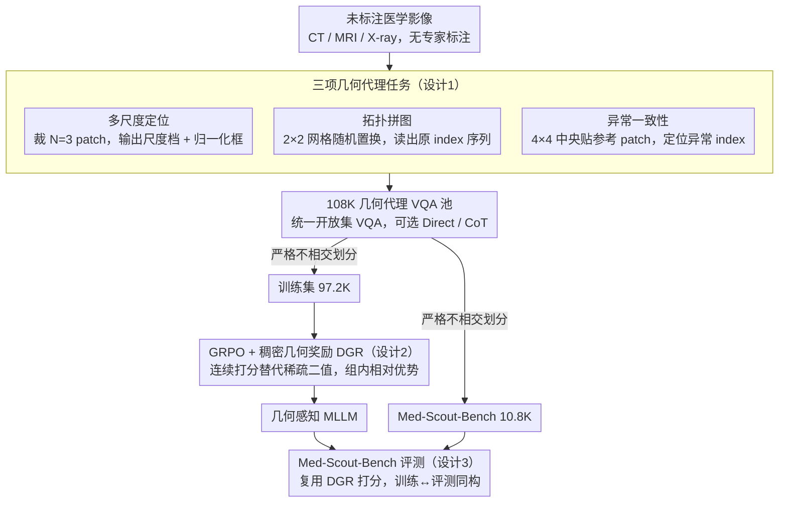

# Med-Scout: Curing MLLMs' Geometric Blindness in Medical Perception via Geometry-Aware RL Post-Training

**会议**: ICML 2026  
**arXiv**: [2601.23220](https://arxiv.org/abs/2601.23220)  
**代码**: https://github.com/HKUSTGZ-ML4Health-Lab/Med-Scout  
**领域**: 医学图像  
**关键词**: 医学 MLLM, GRPO, 几何感知, 代理任务, 稠密奖励

## 一句话总结
Med-Scout 把"医学 MLLM 在病灶定位时不遵守图像几何约束"这一系统性缺陷定义为"几何盲"，用三个不需要专家标注的几何代理任务（多尺度定位 / 拓扑拼图 / 异常一致性）配合稠密几何奖励（DGR）在 GRPO 下做后训练，并发布 Med-Scout-Bench 用于量化几何盲，在四个 backbone、八个医学基准上一致提升，开源模型甚至反超 GPT-5 / Gemini-3-Flash。

## 研究背景与动机
**领域现状**：以 LLaVA-Med、HuatuoGPT-Vision、MedGemma、Lingshu 为代表的医学 MLLM 在术语生成与症状描述上已经接近临床语言风格，主流后训练范式仍是 SFT 或加上简单奖励的 RL，目标是"语义对齐"——让生成报告在词面上贴合标签。

**现有痛点**：作者在 Qwen3-VL-8B-Instruct 与 Lingshu-7B 上做了三组 pilot 实验，发现现有医学 MLLM 存在系统性几何盲：(1) 同一病灶在局部 crop 能识别但放回全局视野后 20%+ 失败（尺度盲）；(2) 整张图片旋转 180° 后 80% 模型不会更新"上/下"等空间描述（拓扑盲）；(3) 用 cut-paste 在图像中央贴入异常区域，90%+ 模型完全察觉不到，照样输出标准报告（异常盲）。CoT prompting 几乎不能缓解，证明这是感知层缺陷而非提示工程问题。

**核心矛盾**：临床 AI 对"几何忠实性"的要求与"语义流畅性"目标之间存在结构错位——MLE 类似然最大化没有任何机制惩罚"位置错、尺度错、漏看异常"，模型只要把术语说对就拿满分。而通用域的视觉拼图/grounding 代理（Jigsaw-R1、ViCrit、Euclid、GeoPQA）又不针对医学的解剖结构、模态特异性与细粒度异常。

**本文目标**：(1) 构造能在无专家标注的医学图像上自动产生可验证监督信号的几何代理任务；(2) 给 RL 一个不会因为稀疏二值奖励而坍塌的稠密信号；(3) 把"几何盲"这一缺陷做成可量化、可重复评测的基准。

**切入角度**：医学影像本身已经包含可验证的几何事实——同一张图的不同 crop 必然 IoU 一致、2×2 网格的拼图有唯一正确序列、cut-paste 入侵点位置完全已知。这些几何约束相对"语义正确性"具有完全的客观可验证性，天然适合 GRPO 这类基于组内相对比较的 RL。

**核心 idea**：把"教 MLLM 看医学图像"重新表述为"教 MLLM 在不依赖标注的前提下自我验证图像几何约束"，用三类代理任务 + 稠密几何奖励在 GRPO 下做后训练，把几何感知能力先打底，再让它泛化到下游医学 VQA 与报告生成。

## 方法详解

### 整体框架
Med-Scout 是一个数据中心化的 RL 后训练框架。给定一张未标注医学影像 $I\in\mathbb{R}^{H\times W}$，先把它转成三类几何代理 VQA：尺度任务 $\mathcal{T}_{\text{scale}}$、拓扑任务 $\mathcal{T}_{\text{topo}}$、异常任务 $\mathcal{T}_{\text{anom}}$，统一为开放集 VQA 形式。这套自动构造管线一共产出 108K 样本，按模态严格平衡后切成两块互不相交的子集：97.2K 作训练集、10.8K 作 Med-Scout-Bench。训练时在训练集上用 GRPO（KL 系数 $\beta=0.04$、组大小 $G=8$、cosine + warmup、AdamW、lr $1\times 10^{-6}$、共 7,200 步），每个样本的总奖励是 $\mathcal{R}=\mathcal{R}_{\text{acc}}+\mathcal{R}_{\text{fmt}}+\mathbb{I}_{\text{CoT}}\cdot\mathcal{R}_{\text{reason}}$，其中 $\mathcal{R}_{\text{acc}}$ 是按任务类型设计的稠密几何奖励（DGR）。评测则在 Med-Scout-Bench 上直接复用 DGR 打分，让训练目标与评测指标同构。整体不需要任何专家标注，所有监督信号都从图像本身的几何事实派生。

### 关键设计

**1. 三项几何代理任务：把抽象的"几何感知"拆成三类在医学图上可自动构造、答案唯一可验证的 VQA**

pilot 实验暴露的几何盲不是单一概念，而是尺度盲、拓扑盲、异常盲三种，所以代理任务也对应分成三类。**Hierarchical Scale Localization** 模拟临床"放大镜"流程，从原图同时裁 $N=3$ 个 patch，分属 Level-1（占图 20% 面积）与 Level-2（6.25%）两档，中心坐标限制在归一化 $[0.2,0.8]$ 避开背景噪声，模型要对每个 patch 输出尺度档与归一化框 $b=(x_1,y_1,x_2,y_2)$，对应"局部 vs 全局一致性"。**Topological Jigsaw Reconstruction** 把图切成 $2\times 2$ 网格并随机置换 $\sigma$，要求模型按左→右、上→下读出原始 index 序列，强迫做横纵双向空间推理，对应"解剖位置不变性"。**Anomaly Consistency Detection** 在 $4\times 4$ 网格的中央把一块替换为参考 patch（CT/MRI 取相邻 slice、X-ray 取 BiomedCLIP 检索的 top-1 相似图），模型需输出异常 patch 的 grid index，对应"像素级结构一致性"。三项都统一成开放集 VQA、可选 Direct 或 CoT 模式。这种"问题导向地分解几何"让每类奖励都对准一个具体临床能力，避免 Jigsaw-R1 之类通用任务"拼图做对了却学不到医学要点"。

**2. 稠密几何奖励（DGR）整合到 GRPO：用连续打分替代稀疏二值，让组内 RL 总有信息可用**

GRPO 在组内做相对优势估计，如果用稀疏 0/1 奖励，难题组里"全错"或简单题组里"全对"的概率很高，advantage 直接退化为 0、梯度无信息。DGR 把"差一点"的样本按几何偏差程度拉开档次：尺度任务奖励拆成值估计 $\mathcal{R}_{\text{val}}=\frac{1}{N}\sum_{i=1}^{N}\mathbb{I}(\hat y_i=y_i^*)$ 与框 IoU $\mathcal{R}_{\text{box}}=\frac{1}{N}\sum_{i=1}^N\text{IoU}(\hat b_i,b_i^*)$；拓扑任务用 element-wise 对齐 $\mathcal{R}_{\text{topo}}=\frac{1}{N}\sum_{i=1}^N\mathbb{I}(\hat s_i=s_i^*)$，序列没全对也按"对几个 patch"给分；异常任务把 flatten index 还原成坐标 $(u,v)=(\lfloor k/4\rfloor,k\bmod 4)$，奖励为

$$\mathcal{R}_{\text{anom}}=\exp\!\Big(-\sqrt{(\hat u-u^*)^2+(\hat v-v^*)^2}/\tau\Big),$$

距离越近奖励越高；再加 item 级格式奖励 $\mathcal{R}_{\text{fmt}}=\frac{0.5}{N}\sum_{i=1}^N\mathbb{I}(\hat a_i\in\Phi_{\text{regex}})$，CoT 模式额外加结构奖励 $\mathcal{R}_{\text{reason}}=0.5$（输出符合 `<think>...<answer>...` 模板），完美 CoT 总分上限 $\mathcal{R}=2.0$。把 IoU、欧氏距离、element-wise 命中这些天然几何度量直接当奖励，既保证组内排序总有信息、训练稳定快收敛，又比额外训一个 reward model 更可靠、没有 reward hacking 风险。

**3. Med-Scout-Bench：把"几何盲"从定性描述变成可重复打分的医学基准**

以前的医学 MLLM 评测要么用 VQA-RAD 这类语义题（定位不到几何错误），要么用分割/检测（根本不在 MLLM 接口下），几何能力的评测一直缺位。Med-Scout-Bench 在 VQA 接口下保留几何评分：合成 108,000 条 VQA 初始池（CT/MRI 用 TotalSegmentor 保证全身解剖覆盖、X-ray 用 MIMIC-CXR），按模态严格平衡抽 10,800 条（10%）作基准、剩余 97,200 条作训练集且两者严格不相交；评测统一为开放集、不给选项，用 LLM-as-a-Judge（Gemini-3-Flash）评语义正确性以规避字符串硬匹配的脆弱。最关键的是打分直接复用 4.2 节定义的 DGR、与训练奖励同构，让"训练目标"和"评测指标"严格对齐；而且实验证明 bench 分数与 PMC-VQA / OmniMedVQA / MedXpertQA 等下游任务强正相关，说明它能当"广义医学感知力"的可靠代理。

### 损失函数 / 训练策略
GRPO 优化：组大小 $G=8$、KL 系数 $\beta=0.04$、global batch 192、cosine LR 衰减、warmup 0.01、AdamW、peak lr $1\times 10^{-6}$；在 6×NVIDIA RTX PRO 6000 上跑 7,200 步。共四个 backbone：通用 Qwen3-VL-4B/8B-Instruct、医学专科 Lingshu-7B 与 HuatuoGPT-Vision-7B。

## 实验关键数据

### 主实验
| Backbone | Med-Scout-Bench Avg | Rad-VQA | VQA-RAD | SLAKE | MIMIC-CXR CIDEr | 含义 |
|---|---|---|---|---|---|---|
| Qwen3-VL-8B-Instruct | 39.7 → **83.6** (+43.9) | 41.6 → 45.3 | 63.2 → 65.8 | 69.6 → 72.0 | 64.8 → 68.1 | 通用 backbone 反超 GPT-5/Gemini-3-Flash |
| Lingshu-7B | 31.9 → **71.9** (+40.0) | 61.2 → 64.0 | 68.9 → 71.0 | 82.8 → 83.0 | 104.9 → 105.2 | 已 SOTA 仍能继续涨 |
| HuatuoGPT-Vision-7B | — | 48.8 → 52.1 | 67.0 → 70.1 | 67.8 → 71.0 | 75.6 → 79.0 | PMC-VQA 涨 2.9 |
| Qwen3-VL-4B-Instruct | — | 41.5 → 45.7 | 59.9 → 62.9 | 73.4 → 75.6 | 60.9 → 65.2 | 小模型涨幅最显著 |

对照专有模型上限：GPT-5 Rad-VQA 59.1 / VQA-RAD 66.4，Gemini-3-Flash 60.7 / 70.2。开源 Lingshu-7B+Med-Scout 在 VQA-RAD 取得 71.0，超过 Gemini-3-Flash。

### 消融实验（与现有视觉代理任务对比，禁用 DGR、统一使用稀疏奖励）
| 方法 | Med | Geo | Rad-VQA Avg | Gen. Avg | 含义 |
|---|---|---|---|---|---|
| Qwen3-VL-4B baseline | - | - | 58.3 | 38.4 | 起点 |
| + Jigsaw-R1 | ✗ | ✓ | 57.6 (−0.7) | 38.3 (−0.1) | 通用拼图反掉点 |
| + ViCrit | ✗ | ✗ | 57.7 (−0.6) | 38.4 (=0.0) | 通用 grounding 无收益 |
| + **Med-Scout (sparse)** | ✓ | ✓ | **60.8 (+2.5)** | **40.2 (+1.8)** | 即使关掉 DGR 仍稳定提升 |
| Qwen3-VL-8B + Med-Scout (sparse) | ✓ | ✓ | 60.4 (+2.3) | 40.5 (+1.4) | 8B 同样规律 |

### 关键发现
- Bench 提升幅度高达 +40 个百分点以上，说明现有医学 MLLM 的几何感知缺口被严重低估；同时 Bench 分与外部六个基准的平均准确率呈强正相关，验证几何感知是广义医学感知的底层能力。
- 通用域 backbone（Qwen3-VL-4B/8B）的提升幅度系统性大于医学专科模型，说明强视觉语言基座更能吸收几何监督信号；这与 SFT 时代"专科模型一定更强"的经验形成对照。
- Direct Mode 与 Reasoning Mode 性能接近（图 4），作者推测部分原因是结构奖励 $\mathcal{R}_{\text{reason}}$ 只约束了 `<think>...<answer>...` 模板而未约束推理逻辑本身，说明 CoT 监督的精细化仍有空间。
- 数据缩放：从 20%→100% 训练数据，Bench 分单调上升且未见饱和，说明几何代理任务的监督信号还有进一步开发空间。

## 亮点与洞察
- "把几何盲分解成尺度盲/拓扑盲/异常盲"并各配一个代理任务，对应关系清晰直观；这种"先做诊断性 pilot 实验找具体盲点，再针对性设计代理任务"的方法论可迁移到任何 perception-critical 的多模态任务（如自动驾驶感知、工业质检）。
- DGR 的核心洞察是"组内 RL 需要奖励方差"，把传统的 IoU、欧氏距离、element-wise 命中率直接当连续奖励，避开训 reward model 的麻烦也避免 reward hacking；这套"几何度量当奖励"的范式可直接复用于其他空间敏感的视觉任务。
- 利用 BiomedCLIP 做 X-ray 的 cut-paste 参考检索，使得"异常 patch"具有放射学上合理的纹理与对比度，避免简单噪声块带来的捷径学习——一个小工程细节但显著影响代理任务的有效性。

## 局限与展望
- 三项代理任务都聚焦"几何"，对模态相关的物理量（如 CT 的 HU 值校正、MRI 的多序列对照）没有建模；几何只是医学影像约束的一个维度，未来需要补"物理一致性""时间序列一致性"等维度。
- Med-Scout-Bench 用 LLM-as-a-Judge（Gemini-3-Flash）做语义裁判，存在评判者偏差风险；尤其作者训练时也用 Gemini-3-Flash 做评测裁判，可能引入潜在的循环偏置。
- Reasoning Mode 几乎不带来增益但训练成本显著更高，说明"CoT 模板奖励 + RL"在医学几何任务上的设计需要重新思考——奖励对推理过程本身没有约束，CoT 退化为输出 padding。
- 评测在专有 backbone（GPT-5/Gemini-3-Flash）上无法应用 Med-Scout（无权重访问），所以"开源反超专有"严格来说只在 Med-Scout-Bench 上成立，在通用医学 VQA 上专有模型仍小幅领先（如 SLAKE）。

## 相关工作与启发
- **vs Jigsaw-R1 / Visual Jigsaw**：相同点都把网格重排当代理任务，差别在 Jigsaw-R1 只针对通用域空间推理且只用 $2\times 2$ 拼图，Med-Scout 把它与多尺度定位、异常检测组合起来，专门匹配医学影像的解剖结构与细粒度异常需求。
- **vs ViCrit**：ViCrit 用可执行程序做 verification，但脱离医学语境；Med-Scout 的 IoU / element-wise 命中 / 欧氏距离都是医学影像里天然存在的客观度量，无需外部程序。
- **vs Euclid / GeoPQA / GeoGPT4V**：这些工作给通用域 MLLM 注入几何先验（点、线、角度），Med-Scout 把"几何"扩展到尺度、拓扑、异常三个临床相关维度，更贴合医学场景。
- **vs LLaVA-Med / HuatuoGPT-Vision / MedGemma / Lingshu**：这些医学 MLLM 走 SFT/语义对齐路线，Med-Scout 是后训练框架，可叠加在它们之上进一步提升，实验已证明四个不同 backbone 都吃到收益。

## 评分
- 新颖性: ⭐⭐⭐⭐ "几何盲"问题命名清晰、三项代理任务设计合理；不过 GRPO + 代理任务的整体范式在通用域已有 Jigsaw-R1/ViCrit 等先驱，本文创新点更多在"医学化与稠密化"。
- 实验充分度: ⭐⭐⭐⭐⭐ 四 backbone × 八基准 + 数据缩放 + 直接/CoT 对照 + 与三个通用代理任务对比 + 与四个专有/开源模型对比，覆盖面非常全。
- 写作质量: ⭐⭐⭐⭐⭐ Pilot 实验把动机讲得极有说服力，方法部分公式与算法描述都很清晰，附录给了代理任务样例和评测细节。
- 价值: ⭐⭐⭐⭐⭐ 同时贡献了方法、基准、四个对齐模型权重；Med-Scout-Bench 有望成为衡量医学 MLLM 几何感知能力的事实标准。

<!-- RELATED:START -->

## 相关论文

- [\[ICML 2026\] From Seeing to Thinking: Decoupling Perception and Reasoning Improves Post-Training of Vision-Language Models](from_seeing_to_thinking_decoupling_perception_and_reasoning_improves_post-traini.md)
- [\[CVPR 2026\] Why Does RL Generalize Better Than SFT? A Data-Centric Perspective on VLM Post-Training](../../CVPR2026/multimodal_vlm/why_does_rl_generalize_better_than_sft_a_data-centric_perspective_on_vlm_post-tr.md)
- [\[ICML 2026\] FreeRet: MLLMs as Training-Free Retrievers](freeret_mllms_as_training-free_retrievers.md)
- [\[AAAI 2026\] Revisiting the Data Sampling in Multimodal Post-training from a Difficulty-Distinguish View](../../AAAI2026/multimodal_vlm/revisiting_the_data_sampling_in_multimodal_post-training_from_a_difficulty-disti.md)
- [\[NeurIPS 2025\] Enhancing Outcome Reward-Based RL Training of MLLMs with Self-Consistency Sampling](../../NeurIPS2025/multimodal_vlm/enhancing_the_outcome_reward-based_rl_training_of_mllms_with_self-consistency_sa.md)

<!-- RELATED:END -->
