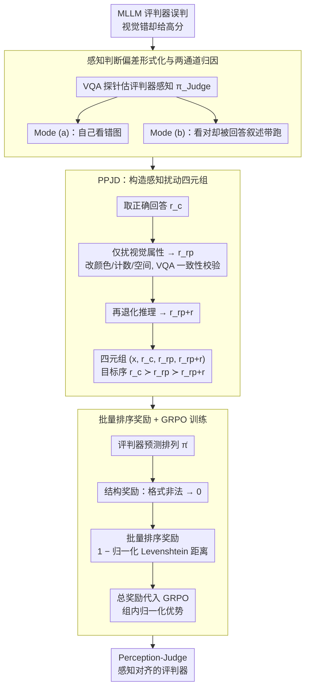

# Mitigating Perceptual Judgment Bias in Multimodal LLM-as-a-Judge via Perceptual Perturbation and Reward Modeling

**会议**: ICML 2026  
**arXiv**: [2606.02578](https://arxiv.org/abs/2606.02578)  
**代码**: https://perception-judge.github.io/ (项目页)  
**领域**: 多模态VLM  
**关键词**: MLLM 评判, 感知判断偏差, 视觉扰动, GRPO, 批量排序奖励

## 一句话总结
本文揭示并形式化 MLLM-as-a-Judge 的"感知判断偏差"——评判模型在视觉证据与文本叙述冲突时倾向于奖励语言上更流畅的回答，并通过构造感知扰动数据集 PPJD 与基于 GRPO 的批量排序奖励训练，仅用 3k 样本就让 7B 评判器在多模态评测一致性、单分预测、批量排序三类协议上同时大幅超越同尺寸基线。

## 研究背景与动机
**领域现状**：随着多模态大模型（MLLM）在视觉问答、图文生成等任务上的扩散，用"MLLM-as-a-Judge"自动评测候选回答已经成为替代人工评分的主流范式。代表性工作包括 MLLM-as-a-Judge 基准、LLaVA-Critic、Flex-Judge 等，主要走"监督微调 + 偏好对"路线，给定 $(x_i, r_k)$ 后输出标量分、pair 偏好或 ranking 序列。

**现有痛点**：作者发现这些 MLLM 评判器普遍存在一种系统性失败——当一个回答在文本上自圆其说但其视觉描述与图像不符时，评判器照样会给它高分。比如图像里是红色车，回答说"图中蓝色车体现了科技感"，评判器仍可能因为推理流畅而打高分。这并不是个别 corner case：在 MLLM-as-a-Judge benchmark 上，Qwen2.5-VL-7B 的总体错误率达到 30.5%，Flex-Judge-VL-7B 也有 23.5%。

**核心矛盾**：作者把失败拆成两条独立通道——Mode (a) *insufficient perceptual capability*：评判器自己就看错了图（其 VQA 探针也答错）；Mode (b) *response-anchored judgment reasoning*：评判器单独问图能答对，但放进评判流程时又被回答里描述的"视觉事实"带跑了。表 1 显示 Mode (b) 与 Mode (a) 数量级相当甚至更大，意味着即便给评判器装更强的视觉编码器也只能解决一半问题；本质矛盾是**感知通道与评判通道在评判时被解耦**了。

**本文目标**：（1）形式化定义"感知判断偏差"并提供可量化的诊断方法；（2）构造能把感知错误与推理错误显式解耦的训练数据；（3）设计训练目标，强迫评判器把感知验证作为高奖励的前置条件，而不是依赖文本流畅度。

**切入角度**：既然普通 (chosen, rejected) 偏好对里感知和推理错误混在一起，那就**人工合成只在视觉属性上扰动而保留推理流畅性的反事实回答**，作为评判器训练时的"陷阱"。同时把原本的 pairwise 偏好升级为四元组上的全序排序，使监督信号从局部胜负变为全局一致排列。

**核心 idea**：从正确回答出发，造出"仅扰动感知 $r_{r_p}$"和"感知+推理双扰动 $r_{r_{p+r}}$"的反事实回答，构成四元组 $(x_i, r_c, r_{r_p}, r_{r_{p+r}})$；在 GRPO 框架下用基于 Levenshtein 距离的批量排序奖励，让评判器学到严格的 $r_c \succ r_{r_p} \succ r_{r_{p+r}}$ 顺序。

## 方法详解

### 整体框架
方法分三步走：（1）形式化 Perceptual Judgment Bias 并用 VQA 探针把失败归因到 Mode (a)/(b)；（2）构造 *Perceptually Perturbed Judgment Dataset (PPJD)*——基于 MMPR-v1.2 抽取 3k 高质量样本，对每个 chosen 回答生成感知扰动版与感知+推理双扰动版；（3）用 GRPO 训练，奖励为格式校验 × 批量排序得分。最终模型记作 Perception-Judge-Flex / Perception-Judge-Qwen3，分别基于 Flex-Judge-VL-7B 和 Qwen3-VL-4B-Thinking。

### 关键设计

**1. 感知判断偏差的形式化与两通道归因：把"评判器为什么不准"拆成可测的二维**

如果只看总错误率，研究者会一股脑归咎于"视觉编码器不够强"，从而错过更深的失配。本文先把问题量化：设 $\pi^\star(v_i)$ 是人工标注的视觉事实、$\pi_\text{Judge}(v_i)$ 是评判器自己对图像的感知、$\pi_r(v_i)$ 是回答里描述的视觉内容、$s_{(x_i,r)}$ 是评判分。当一个视觉错误回答 $r_r$ 没被相对正确的 $r_c$ 惩罚（即 $s_{(x_i,r_r)} \ge s_{(x_i,r_c)}$）就记为一次感知判断错误。再用直接 VQA 准确性当 $\pi_\text{Judge}$ 的代理，按"评判器自己看对了没"把错误劈成两条通道：Mode (a) 是 $\pi_\text{Judge}(v_i) \ne \pi^\star(v_i)$——评判器自己就看错了图；Mode (b) 是 $\pi_\text{Judge}(v_i) = \pi^\star(v_i)$——单独问它能答对，但放进评判流程就被回答里描述的"视觉事实"带跑。表 1 显示 Mode (b) 与 Mode (a) 数量级相当甚至更大，这直接决定了后续训练必须显式监督"感知-评判耦合"，而不只是堆视觉能力。

**2. PPJD：造一个"推理流畅但视觉错"的陷阱回答，把感知失败从推理失败里剥出来**

通用偏好集里 chosen 和 rejected 几乎总是同时感知差加推理差，模型只要学会"推理差就低分"就能拿满奖励，根本不必动用视觉信号。PPJD 专门破这个捷径：从 MMPR-v1.2 的偏好对里取 $r_c$ 作为视觉与逻辑均正确的参照，再对它施加仅感知扰动——精准改写对象颜色、计数、空间关系等视觉属性，但保持句法流畅和推理链不变，得到 $r_{r_p}$，并用 VQA 一致性校验丢掉扰动失败的样本；之后额外退化推理质量得到双扰动版 $r_{r_{p+r}}$。每条样本最终是四元组 $(x_i, r_c, r_{r_p}, r_{r_{p+r}})$，目标偏好序为 $r_c \succ r_{r_p} \succ r_{r_{p+r}}$。这套构造之所以可行，是因为先验工作显示 MLLM 在"被指挥制造细粒度感知错误"上比"检测"更可控。关键在于 $r_{r_p}$——一个推理依然漂亮但视觉错的回答被显式标成低分，正好对 Mode (b) 形成反向直接监督。

**3. 批量排序奖励 + GRPO：把全序约束变成可验证的连续奖励**

pairwise reward 只给"谁赢谁输"的局部信号，模型可能两两都对但全局不自洽。本文把监督升级成四元组上的全序排序，奖励拆两部分：结构奖励 $\mathcal{R}_\text{Format}(o_i) \in \{0,1\}$ 校验输出是否遵循 `<think>...</think><answer>...</answer>` 格式与合法值域，不合法直接总奖励为 0；批量排序奖励用归一化 Levenshtein 距离衡量预测排列与目标排列的差距 $\mathcal{R}_\text{Batch}(o_i) = 1 - d_\text{Lev}(\hat{\bm{\pi}}_i, \bm{\pi}_i^\star)/\|\bm{\pi}_i^\star\|$，取离散值 $\{1, 2/3, 1/3, 0\}$。总奖励 $\mathcal{R}(o_i) = \mathcal{R}_\text{Format}(o_i) \times \mathcal{R}_\text{Batch}(o_i)$ 代入 GRPO 目标

$$\mathcal{J}_\text{GRPO}(\theta) = \mathbb{E}\big[\tfrac{1}{n}\sum_i \min(r_i\hat{\mathcal{A}}_i, \text{clip}(r_i, 1-\epsilon, 1+\epsilon)\hat{\mathcal{A}}_i) - \beta\, \mathbb{D}_\text{KL}(\pi_\theta\|\pi_\text{ref})\big]$$

其中 $\hat{\mathcal{A}}_i = (R(o_i) - \mu(\mathcal{R})) / \sigma(\mathcal{R})$ 是组内归一化优势。用 Levenshtein 归一化的全序奖励能强制 transitive consistency、又不需要显式打分标注；结构奖励再把"语义评测"转成"可验证 RL"，非法格式直接 0 分，正好吃到 GRPO 不需要 value network、对稀疏奖励稳定的好处。

### 损失函数 / 训练策略
基础模型：Flex-Judge-VL-7B 与 Qwen3-VL-4B-Thinking。训练框架：verl。数据：从 MMPR-v1.2 抽 3k 样本经 PPJD 流程生成四元组，严格剔除与评测基准重叠样本。GRPO 超参 $\epsilon$、$\beta$、组大小等遵从 verl 默认，配合上面的 $\mathcal{R}(o_i)$ 优化。

## 实验关键数据

### 主实验（MLLM-as-a-Judge benchmark，14 个 vision-language 任务平均）

| 模型 | 尺寸 | Score (↑) | Pair w. Tie (↑) | Pair w.o. Tie (↑) | Batch (↓) |
|------|------|-----------|-----------------|--------------------|-----------|
| GPT-4o | – | 0.439 | 0.538 | 0.736 | 0.361 |
| Gemini-1.0-Pro-Vision | – | 0.304 | 0.509 | 0.615 | 0.432 |
| LLaVA-Critic | 7B | 0.314 | 0.556 | 0.689 | – |
| Qwen2.5-VL-Instruct | 7B | 0.165 | 0.423 | 0.425 | 0.585 |
| Flex-Judge-VL | 7B | 0.404 | 0.514 | 0.623 | 0.517 |
| Qwen3-VL-Thinking | 4B | 0.419 | 0.543 | 0.663 | 0.498 |
| **Perception-Judge-Flex (本文)** | 7B | **0.466** | 0.520 | 0.645 | 0.505 |
| **Perception-Judge-Qwen3 (本文)** | 4B | **0.457** | **0.554** | **0.691** | **0.444** |

要点：相对 Qwen3-VL-Thinking-4B，本文在 batch 评估提升 11%、score 评估提升 12%；在单分模式接近 GPT-4o 水平；在 batch 评估超越多数专有模型，证明全局一致排序信号能力突出。Perception-Judge-Flex-7B 在感知判断偏差诊断（表 1）中将总错误率从 23.5% 降到 14.3%（Mode (a) 9.4→6.7、Mode (b) 14.1→7.6），两条通道同时被显著削减。

### 消融实验（同样 10k 训练样本，Flex-Judge-VL-7B）

| 数据集 | 奖励类型 | Score (↑) | Pair w. Tie (↑) | Pair w.o. Tie (↑) | Batch (↓) |
|--------|---------|-----------|-----------------|--------------------|-----------|
| – (base) | – | 0.404 | 0.514 | 0.623 | 0.517 |
| MMPR-v1.2 | Pairwise | 0.454 | 0.515 | 0.641 | 0.515 |
| PPJD | Pairwise | 0.458 | 0.518 | 0.644 | 0.513 |
| PPJD | **Batch** | **0.476** | **0.518** | **0.648** | **0.500** |

### 关键发现
- *数据更重要*：在同样 pairwise 奖励下，把 MMPR-v1.2 换成 PPJD 即四项指标均涨，说明显式分离感知扰动的数据本身就在缓解 perceptual bias，不依赖奖励形式。
- *批量奖励比 pairwise 更强*：仅靠全序排序奖励、不喂任何标量分或 pairwise 标签，单分预测反而最好——证明全局排序约束足够诱导出局部偏好与良好校准的分数。
- *数据效率*：仅用 3k PPJD 样本就达到甚至超越使用 113k LLaVA-Critic 语料的 7B 评判器在多数协议上，凸显感知扰动数据的"信息密度"。
- *双通道偏差同时下降*：Mode (b) 错误率几乎减半（14.1%→7.6%），说明即便不显著提升评判器的视觉感知能力，强制感知-评判耦合也能带来巨大收益，呼应"感知-评判解耦才是首要问题"的论断。

## 亮点与洞察
- 将"评判器为什么不准"从一个工程问题升级为可形式化、可解耦、可证伪的科学问题——Mode (a)/(b) 二分法本身就值得被沿用到未来一切 MLLM-as-a-Judge 工作里。
- "造一个推理流畅但视觉错"的反事实回答 ($r_{r_p}$) 是核心创意：它把评判训练中"语言流畅 vs 视觉准确"的隐性 trade-off 显式化，让模型必须基于视觉证据才能赢得奖励。
- 用全序排序的 Levenshtein 奖励 + GRPO 的组合，把可验证 RL 从数学/代码推理领域成功迁移到"视觉评测"这一主观性任务上，是把可验证奖励范式扩展到 perception-heavy 任务的好例子。
- 数据效率（3k vs 113k）+ 不依赖标量分监督的设计，对资源受限场景极有吸引力——可直接套用在医疗、自动驾驶等需要自定义评判器的领域。

## 局限与展望
- PPJD 的感知扰动由生成模型生成，扰动类型局限于属性/计数/空间关系等可控维度，对复杂场景里的细粒度感知错误（如医学影像里的病灶位置）覆盖度未知。
- 批量奖励基于固定四元组（实际三元组排序），扩展到更大组（如 $K\ge 5$）时 Levenshtein 距离的离散等级会变粗糙，需重新设计权重。
- 评判器自身的感知能力仍由底座模型决定，本方法本质上让评判器"更愿意用感知"，但若底座视觉编码器太弱（极度 Mode (a)），改进空间有限——可考虑同时训练一个轻量视觉验证模块。
- 评测局限在 MLLM-as-a-Judge benchmark，对开放式生成评测（如长视频描述质量）的泛化尚需验证。

## 相关工作与启发
- **vs LLaVA-Critic (Xiong et al., 2025)**: LLaVA-Critic 走大数据 SFT 路线（113k 偏好对），pairwise 指标更高但需要数十倍数据；本文证明 3k 反事实 + 排序 RL 可在多数协议上反超，是一条数据 vs 监督形式的鲜明对比。
- **vs Flex-Judge / Prometheus-VL**: 同属可学习评判器，但都没显式处理 perceptual bias；本文的 Mode (a)/(b) 解构可被反向用来诊断它们的失败模式。
- **vs JudgeLRM / 可验证 RL 评判**: 同样把 RL 引入评判训练，但主要在文本任务上验证；本文把可验证奖励从"文本对错"扩展到"视觉-文本一致性"，并用 Levenshtein 距离把排序问题离散化为可验证信号。
- **启发**：（1）任何 MLLM-as-a-Judge 工作都应该报告 Mode (a)/(b) 分解，否则总错误率会掩盖根因；（2）"反事实数据 + 排序 RL"组合可直接迁移到 reward model、preference modeling 等更广任务；（3）感知扰动可推广到时序（视频、对话）场景，用来训练更鲁棒的多轮评判器。

## 评分
- 新颖性: ⭐⭐⭐⭐ 形式化 perceptual judgment bias、PPJD 四元组、批量排序 GRPO 三件套都属首创组合
- 实验充分度: ⭐⭐⭐⭐ 14 任务主表 + bias 分解 + 数据/奖励消融 + 数据效率对比均给齐
- 写作质量: ⭐⭐⭐⭐ 公式定义清晰、动机—诊断—方法—验证链条干净
- 价值: ⭐⭐⭐⭐⭐ 对所有训练 MLLM 评判器的团队都是直接可用的数据+训练协议，且与 RL 主流框架兼容

<!-- RELATED:START -->

## 相关论文

- [\[ICML 2026\] The Perceptual Bandwidth Bottleneck in Vision-Language Models: Active Visual Reasoning via Sequential Experimental Design](the_perceptual_bandwidth_bottleneck_in_vision-language_models_active_visual_reas.md)
- [\[ACL 2026\] MathFlow: Enhancing the Perceptual Flow of MLLMs for Visual Mathematical Problems](../../ACL2026/multimodal_vlm/mathflow_enhancing_the_perceptual_flow_of_mllms_for_visual_mathematical_problems.md)
- [\[ICML 2026\] Beyond VLM-Based Rewards: Diffusion-Native Latent Reward Modeling](beyond_vlm-based_rewards_diffusion-native_latent_reward_modeling.md)
- [\[AAAI 2026\] SAGE: Spuriousness-Aware Guided Prompt Exploration for Mitigating Multimodal Bias](../../AAAI2026/multimodal_vlm/sage_spuriousness-aware_guided_prompt_exploration_for_mitigating_multimodal_bias.md)
- [\[ICLR 2026\] Let's Think in Two Steps: Mitigating Agreement Bias in MLLMs with Self-Grounded Verification](../../ICLR2026/multimodal_vlm/lets_think_in_two_steps_mitigating_agreement_bias_in_mllms_with_self-grounded_ve.md)

<!-- RELATED:END -->
