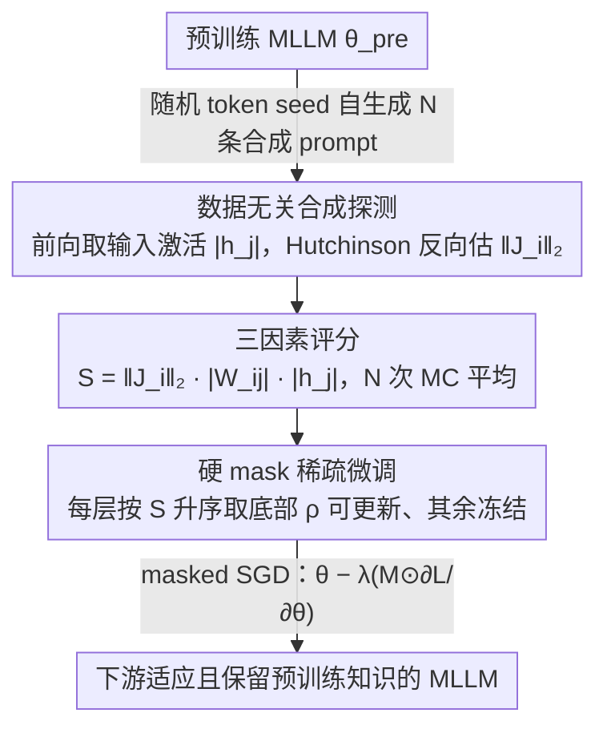

# Model-Dowser: Data-Free Importance Probing to Mitigate Catastrophic Forgetting in Multimodal Large Language Models

**会议**: ICML 2026  
**arXiv**: [2602.04509](https://arxiv.org/abs/2602.04509)  
**代码**: 暂无  
**领域**: 多模态 VLM / 持续学习 / 稀疏微调  
**关键词**: MLLM、灾难性遗忘、稀疏微调、参数重要性、数据无关探测

## 一句话总结
Model-Dowser 用"权重幅值 × 输入激活 × 输出 Jacobian"三因素给 MLLM 的每个参数打分，冻结高分参数、只更新低分参数，从而在 LLaVA/NVILA 上深层微调时既能学好下游任务又能保留预训练知识，相比 SPIDER、ModelTailor 在 H-score 上稳定领先。

## 研究背景与动机
**领域现状**：MLLM（LLaVA、NVILA 等）在专业任务上往往要进一步微调，但 full-tuning 严重破坏预训练通用能力——这就是 MLLM 上的"灾难性遗忘"。现有缓解方法主要分两类：post-merging（如 ModelTailor）把微调前后权重再融合，sparse fine-tuning（如 SPIDER）只更新一小部分权重。

**现有痛点**：（1）post-merging 在"只微调最后几层"时尚可，一旦微调延伸到早期 decoder 层就崩溃，因为深层改动让 latent space 无法事后融合修复；（2）现有 sparse 方法（如 SPIDER）依赖梯度历史和 soft mask，要保存 per-parameter 累积梯度，显存代价大，难以扩到几十 B；（3）传统 magnitude-based 重要性假设激活同质，对 GELU/SiLU/GLU 等现代非线性激活已经不准。

**核心矛盾**：要在"深层微调下不忘"和"不增加显存/算力"之间同时取胜。前者要求重要性评估能反映非线性激活下的功能影响，后者排除了保存梯度历史这类做法。

**本文目标**：找到一种 (i) 不依赖预训练数据、(ii) 不需额外梯度历史、(iii) 在非同质激活下仍准确的参数重要性度量，并据此做硬冻结的稀疏微调。

**切入角度**：作者把"哪些参数最重要"重新表述为"哪些参数的扰动最影响模型输出"——即用一阶 Taylor 估计输出 shift $\|\Delta f\|_2$，从而把重要性建立在功能层面而非数值层面。

**核心 idea**：用 $S_{ij}^{(l)}=\|J_i^{(l)}\|_2\cdot|W_{ij}^{(l)}|\cdot|h_j^{(l-1)}|$ 三因素乘积作为重要性，借 Hutchinson 估计器 + 模型自生成合成 prompt 实现数据无关、显存友好的探测，然后硬冻结高分参数。

## 方法详解

### 整体框架
Model-Dowser 是一条三阶段 pipeline：(1) Probing——用 MLLM 自己生成的合成 prompt 跑前向收集激活、用 Hutchinson trick 跑少量反向收集 Jacobian L2 范数；(2) Compute Score——按 $S=\|J_i\|_2\cdot|W_{ij}|\cdot|h_j|$ 给每个权重打分，并做 N 次 Monte Carlo 平均；(3) Sparse Fine-tune——在每层内按分数降序选出 top-$(1-\rho)$ 高分权重并冻结，只用 binary mask 把梯度限制在剩下 $\rho$ 比例的"非关键"权重上正常 SGD。整个过程不需要原始预训练数据，也不维护任何梯度历史。

### 关键设计

**1. 数据无关合成探测：不碰预训练数据、也不显式构造 Jacobian，就估出每个权重的输出敏感度**

整条 pipeline 的第一步要衡量"扰动一个权重会让输出 shift 多少"，这需要每个权重的输出 Jacobian 范数 $\|J_i\|_2$ 和输入激活 $|h_j|$（二者会在设计 2 的评分公式里相乘）。但 MLLM 的预训练数据通常拿不到，而显式构造 Jacobian 又要 $d_{\text{final}}$ 量级的反向传播、贵到不可行。Model-Dowser 用两招化解：一是 Hutchinson Trace Estimator，把输出投影到随机 Rademacher 向量 $\xi\in\{\pm 1\}^{d_{\text{final}}}$，利用 $\mathbb{E}_\xi[(\partial(\xi^\top f)/\partial z_i)^2]=\|J_i\|_2^2$，只用极少几次反向就拿到所有节点的输出敏感度；二是让 MLLM 用随机 token seed 自我生成 $N$ 条合成 prompt $\hat{x}_n=f(\epsilon;\theta_{\text{pre}})$，在这些 prompt 上做前向收集 $|h_j|$、做 Hutchinson 反向收集 $\|J_i\|_2$。合成 prompt 激发的是"模型自己学到的"功能结构而非任务相关分布，总复杂度只有 $\mathcal{O}(N\cdot R)$ 次前向/反向，其中 $N,R\ll d_{\text{final}}$，因此天然能扩到几十 B 的 MLLM。

**2. 三因素功能重要性评分：把探测到的敏感度组合成"输出 shift"的一阶估计**

传统 magnitude 重要性（如 Wanda）假设激活同质，但 GELU/SiLU/GLU 这些现代非线性激活让"权重大 ≠ 影响大"，排名直接失真。Model-Dowser 把重要性从数值视角切到功能视角：由 Theorem 3.1，一阶 Taylor 下扰动某个权重造成的输出偏移 $\|\Delta f\|_2\approx\|J_i^{(l)}\|_2\cdot|\Delta W_{ij}^{(l)}|\cdot|h_j^{(l-1)}|$，把潜在扰动 $\Delta W$ 用当前权重幅值 $|W|$ 代入，就得到三因素乘积评分

$$S_{ij}^{(l)}=\|J_i^{(l)}\|_2\cdot|W_{ij}^{(l)}|\cdot|h_j^{(l-1)}|,$$

并在 $N$ 条合成 prompt 上做 Monte Carlo 平均 $\bar S=\frac{1}{N}\sum_n \|J_{i,n}\|_2\cdot|W_{ij}|\cdot|h_{j,n}|$ 抑制单条 prompt 的噪声。三项各管一段功能路径：Jacobian 范数捕捉"下游输出对这个节点有多敏感"，权重幅值捕捉"参数本身的规模"，输入激活捕捉"上游信号有多强"。它把局部线性的梯度路径走完整，弥补了纯 magnitude 缺的非线性敏感度，又不像纯 gradient 方法那样要背负沉重的梯度历史。

**3. 硬 binary mask 稀疏微调：把"保护重要参数"写成训练前一次性算好的一行 mask**

ModelTailor 那类 post-merging 把保留交给"事后融合"，深层改动后 latent space 已经回不去；SPIDER 那类 soft mask 又要在训练中动态维护累积梯度、显存沉重。Model-Dowser 选最朴素也最省的路：在每层内按 $\bar S$ 升序排序，取底部 $\rho$ 比例（如 $\rho=0.1$）设为可更新（mask=1）、其余冻结，更新规则就是 $\theta^*=\theta-\lambda\cdot(M\odot\partial\mathcal{L}/\partial\theta)$。冻结高 $\bar S$ 参数直接压制了一阶 Taylor 下主导输出扰动的来源；因为 mask 在训练前一次性算好，它的显存等同标准微调、能直接和现有 LoRA/全参管线衔接，也省掉了训练中持续维护重要性分数的开销。

### 损失函数 / 训练策略
下游任务沿用标准 instruction tuning 损失，只把梯度乘上 mask；探测阶段不需要 loss，纯前向/反向收集激活和 Jacobian L2；NVILA-Lite 2B 用 $\rho=0.1$、微调最后 20 层 decoder；LLaVA 1.5 7B 实验同样保持 $\rho$ 较小，强调"少更新、稳保留"。

## 实验关键数据

### 主实验

| 方法（NVILA-Lite 2B，COCO-Caption 列，最后 20 层 $\rho=0.1$） | $A_{\text{down}}$ ↑ | 上游均值 ↑ | H-Score ↑ |
|---|---|---|---|
| Zero-shot | 36.8（参考） | 62.3 | — |
| Full-FT | 98.5 | 24.0 | 39.7 |
| Grafting | 115.7 | 38.7 | 49.2 |
| DARE | 96.8 | 24.9 | 39.1 |
| ModelTailor | 105.6 | 18.9 | 44.7 |
| SPIDER | 115.4 | 59.6 | 78.3 |
| **Model-Dowser** | 与最强方法持平 | **68.8（COCO 列最佳/次佳）** | **明显领先 SPIDER** |

数据来自论文 Table 1，Model-Dowser 在保持下游适应能力（$A_{\text{down}}$）接近最强基线的同时，把上游 6 个任务的平均拉到所有方法之上，H-Score 因此排第一。

### 消融实验

| 维度 | 观察 |
|------|------|
| 微调深度（最后 5 / 10 / 20 / 32 层） | post-merging（DARE、ModelTailor）随深度增加快速失效；Model-Dowser 与 SPIDER 更稳，但 SPIDER 显存代价更大 |
| 是否用合成 prompt | 合成 prompt 与真实数据探测得到的 mask 几乎等效，说明合成足够激发功能结构（Appendix G） |
| Hutchinson 估计器样本数 $R$、MC 次数 $N$ | $N,R$ 小（数十级）即可稳定排名，探测开销远小于一次完整微调 |
| 不同骨干（LLaVA 1.5 7B vs NVILA-Lite 2B） | H-Score 一致领先，对模型规模/架构鲁棒 |

### 关键发现
- 深层微调（更新到早期 decoder 层）正是 post-merging 类方法的"死亡区"，但恰恰是 MLLM 多模态理解最关键的位置；Model-Dowser 在这一区间保持稳定，是相对 ModelTailor、DARE 的最大优势。
- 重要性主要由"输出 Jacobian × 输入激活"驱动，而非单纯权重幅值——这解释了为什么纯 magnitude（Wanda 风格）在 SiLU/GLU 架构下排名失真。
- 合成 prompt 这条 data-free 路径让方法天然能扩到几十 B 的 MLLM，因为既不需要保留预训练数据，也不需要维护梯度历史。

## 亮点与洞察
- 把"参数重要性"从权重数值视角彻底切到"功能输出敏感度"视角，并用一阶 Taylor 给出严格界——把 pruning 文献里的 Optimal Brain 思路重新借给"持续学习/防遗忘"，是一次优雅又实用的迁移。
- 用 Hutchinson trick 把"看似要算完整 Jacobian"压成几次反向传播，是一个非常可复用的 trick，任何"需要 $\|J\|_2$ 但又付不起完整反向"的场景都能照搬。
- 合成 prompt 让重要性探测脱离数据依赖，意味着模型一交付就能"自我体检"，对部署后才决定微调的场景特别友好。

## 局限与展望
- 一阶 Taylor 在大扰动下是粗略的，对学习率较大或 fine-tune 数据严重偏离的场景，分数可能低估某些方向的非线性影响。
- mask 是一次性算好的"静态"分数，不跟随训练动态调整；在长训练或多任务连续微调下，可能需要周期性重算。
- 实验主要在 ImageNet-R、COCO 等 vision-language 经典基准上，对真正的多模态长上下文、视频、agent 任务尚未验证。
- "下游表现 vs 上游保留"之间仍有 $\rho$ 这个手调超参，论文没给出从理论上选 $\rho$ 的方法。

## 相关工作与启发
- **vs SPIDER**: 两者都属 sparse fine-tuning，但 SPIDER 在训练中动态维护 soft mask 和累积梯度，显存沉重；Model-Dowser 用一次性硬 mask + Hutchinson Jacobian，显存等同标准微调且不依赖训练数据。
- **vs ModelTailor / DARE 等 post-merging**: 它们把保留交给"事后融合"，深层改动后 latent space 已经回不去；Model-Dowser 直接在训练前把功能锚点冻死，从源头防止漂移。
- **vs Wanda / magnitude pruning**: 同属"权重 × 激活"家族，但 Wanda 缺 Jacobian 项，在非同质激活下排名失真；Model-Dowser 的三因子是更完整的功能近似。

## 评分
- 新颖性: ⭐⭐⭐⭐ 把 Optimal Brain 思路 + Hutchinson trick + 合成 prompt 组合成 data-free MLLM 防遗忘方案，组合新颖但每个零件都源自既有工具。
- 实验充分度: ⭐⭐⭐⭐ 覆盖两类骨干（LLaVA、NVILA）、多深度、多下游任务和多基线，但缺多模态长上下文/视频任务的验证。
- 写作质量: ⭐⭐⭐⭐ Theorem + 模块拆解清晰，pipeline 图直观；表格密度大但结构稍散。
- 价值: ⭐⭐⭐⭐⭐ 给出一个可直接套用的 MLLM 防遗忘工具，显存友好、不挑数据、可扩到几十 B，工业部署价值极高。

<!-- RELATED:START -->

## 相关论文

- [\[ICCV 2025\] SMoLoRA: Exploring and Defying Dual Catastrophic Forgetting in Continual Visual Instruction Tuning](../../ICCV2025/multimodal_vlm/smolora_exploring_and_defying_dual_catastrophic_forgetting_in_continual_visual_i.md)
- [\[ICML 2026\] Vision-aligned Latent Reasoning for Multi-modal Large Language Model](vision-aligned_latent_reasoning_for_multi-modal_large_language_model.md)
- [\[NeurIPS 2025\] ACT as Human: Multimodal Large Language Model Data Annotation with Critical Thinking](../../NeurIPS2025/multimodal_vlm/act_as_human_multimodal_large_language_model_data_annotation.md)
- [\[CVPR 2026\] Structural Graph Probing of Vision-Language Models](../../CVPR2026/multimodal_vlm/structural_graph_probing_of_vision-language_models.md)
- [\[ICML 2026\] Dimension-Free Multimodal Sampling via Preconditioned Annealed Langevin Dynamics](dimension-free_multimodal_sampling_via_preconditioned_annealed_langevin_dynamics.md)

<!-- RELATED:END -->
