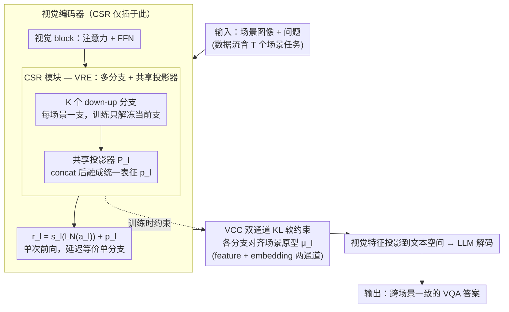

# Multimodal Continual Learning with MLLMs from Multi-scenario Perspectives

**会议**: ICML 2026  
**arXiv**: [2511.18507](https://arxiv.org/abs/2511.18507)  
**代码**: 数据集发布在 [huggingface.co/datasets/Kaij00/MSVQA](https://huggingface.co/datasets/Kaij00/MSVQA)  
**领域**: 多模态VLM / 持续学习  
**关键词**: 多模态持续学习, 灾难性遗忘, LoRA 多分支, 视觉一致性, 多场景 VQA

## 一句话总结
针对 MLLM 在跨场景 VQA 中的视觉遗忘问题，本文构建 MSVQA（高空/水下/低空/室内 4 场景）基准，并提出 Unifier 框架——在视觉 block 里加入 CSR 多分支 + 投影器（VRE）做参数隔离，再用 KL 软约束（VCC）对齐不同分支表征，单次推理即可在 20 步持续学习上把 VQA 提升 2.70-10.62%、F1 提升 3.40-7.69%。

## 研究背景与动机

**领域现状**：MLLM（QwenVL、LLaVA 等）已能解决固定场景的 VQA 任务，但部署到设备端时数据流是连续变化的——白天黑夜、室内室外、不同设备视角。现有 CL 工作多关注 LLM 一侧的文本遗忘（EWC、Tailor、PODNet、VQACL、QUAD），却忽略了视觉部分的灾难性遗忘。

**现有痛点**：经典 VQA 基准（VQAv2 等）问题简单（颜色、数量），重在解析用户文本意图，背景单一；真实部署中图像背景复杂、目标小且密集，且场景切换会让视觉表征重叠/漂移，导致小目标漏检、误检显著增加（图 1）。现有 CL benchmark 缺乏多场景多视角的视觉评估集。

**核心矛盾**：要 (a) 在同一场景里持续累积知识，性能逐步提升；(b) 在新场景里快速适应而不遗忘旧场景；(c) 还要保持单次推理的低延迟。多 LoRA 分支可以做参数隔离，但需要 routing；纯蒸馏可以缓解遗忘，但严格的中间层对齐会扼杀新场景的塑性。

**本文目标**：(1) 提供能反映"场景/视角切换 → 视觉遗忘"的多场景 VQA 数据集；(2) 不增加推理开销地隔离不同场景视觉表征；(3) 在保持塑性的前提下用软约束对齐不同分支表征以防止漂移。

**切入角度**：视觉编码器才是场景切换时最先漂移的部分；与其在 LLM 一侧做参数隔离，不如在 ViT block 里加可扩展的小投影模块，把每个场景的"看世界方式"独立学，但再把它们投到统一空间，从而不需要 routing。

**核心 idea**：在视觉 block 里插入 CSR（Cross-Scenario Representation）模块——每个场景一个 down-up 分支，所有分支输出 concat 后经一个共享投影器 $\mathcal P_l$ 融到原维度，并通过对各分支与场景原型的双向 KL 软约束保持表征一致。

## 方法详解

### 整体框架
数据流 $\mathcal D = \{\mathcal D_1, \ldots, \mathcal D_T\}$，每个任务 $\mathcal D_t = \{(x_i^t, q_i^t, y_i^t)\}_{i=1}^{n_t}$ 来自不同场景。Unifier 在每个 vision block $f_l$ 的 FFN 旁边并联一个 CSR 模块输出 $p_l$，并与 FFN 输出相加 $r_l = s_l(\text{LN}(a_l)) + p_l$。训练时只解冻当前场景对应的分支 + 投影器；推理时无需 routing，所有分支并行计算后一次性融合，输出与单分支模型完全等价的延迟。同时在 CSR 里施加视觉一致性约束（VCC）防止表征漂移。

### 关键设计

**1. Vision Representation Expansion (VRE) + 单次推理融合：参数隔离但不需要路由**

跨场景持续学习的两难是：纯 LoRA 单分支会被新场景覆盖旧场景（遗忘）；改成多分支虽能隔离，却要训一个 router，而 router 自己也会遗忘、还要多跑几次 forward。VRE 用"多分支 + 共享投影器"绕开这个矛盾：CSR 模块由 $K$ 个 down-up 分支 $\varphi_l^k = \phi_{up}(o(\phi_{down}(\cdot)))$ 和一个共享投影器 $\mathcal P_l \in \mathbb R^{K\times d_1 \to d_1}$ 组成，输出 $p_l = \mathcal P_l(\varphi_l^1(a_l) \oplus \cdots \oplus \varphi_l^K(a_l))$，再与 FFN 输出相加 $r_l = s_l(\text{LN}(a_l)) + p_l$。每个分支专管一个场景，下采样维 $d_2 \ll d_1$，参数增长温和；训练第 $t$ 个场景时只更新 $\varphi_l^t$ 和 $\mathcal P_l$、冻结其余分支。

关键在于这个共享投影器把多分支输出"组合成统一表征"，相当于做了隐式的注意力路由——推理时所有分支并行算一次、concat 后过同一投影器，一次 forward 就完成，延迟和单分支模型完全等价，既不用训 router、也不用多次前向。

**2. Vision Consistency Constraint (VCC) 双通道软约束：稳住旧分支又不卡死塑性**

学新场景时，反传梯度会间接污染其他分支的表征，导致旧场景漂移；但若用 $\ell_2$ 硬约束去锁住表征，又会把新场景的塑性彻底压垮、学不到任何新细节。VCC 改用相对熵软约束在两者间取平衡。先对每个 batch 算场景原型 $\mu_l = \frac{1}{K}\sum_k \varphi_l^k(a_l)$，再沿 feature 通道和 embedding 通道分别求各分支表征的均值 $\bar\varphi_l^{k,\text{fe}} \in \mathbb R^{d_1}$、$\bar\varphi_l^{k,\text{em}} \in \mathbb R^{\text{seq}}$，用 KL 对齐到原型：

$$\mathcal{L}_c^{l,k} = \text{KL}(\bar\varphi_l^{k,\text{fe}}/\tau \mid \bar\mu_l^{\text{fe}}/\tau) + \text{KL}(\bar\varphi_l^{k,\text{em}}/\tau \mid \bar\mu_l^{\text{em}}/\tau)$$

投影器输出 $p_l$ 也用类似 KL 对齐新旧模型 $\mathcal L_p^l$，汇总成 $\mathcal L_{vcc} = \frac{1}{L}\sum_l (\mathcal L_p^l + \sum_k \mathcal L_c^{l,k})$。"在通道维求均值后再做 KL"等于只惩罚全局分布漂移、却给局部细节留出自由重组的空间——这正是从知识蒸馏借来、并适配到 CL 的关键转换，消融里它明显优于 $\ell_2$ 和单通道版本。

**3. CSR 仅插入视觉编码器：把容量花在最容易漂移的地方**

作者从图 1 的可视化锁定了遗忘的"震中"——新模型学完新场景后，旧场景出现严重的小目标漏检/误检，说明跨场景漂移主要发生在视觉编码器，而 LLM 一侧的语义解码对场景切换相对鲁棒。所以 CSR 只插进 vision block，每个新场景新增的可训参数仅 $K \cdot L \cdot 2d_1 d_2$ 量级。

这既是对症下药，也是工程上的安全选择：在 LLM 主干上扩 LoRA 又贵又危险，容易冲击通用语言能力；把容量集中到视觉编码器，问题命中了、开销也压住了。

### 损失函数 / 训练策略
总损失 $\mathcal L = \mathcal L_{\text{task}} + \lambda \mathcal L_{vcc}$；蒸馏温度 $\tau$ 控制软约束强度；训练新场景时其他分支参数冻结，投影器 $\mathcal P_l$ 共同更新；对比设置上和 QUAD 一样不存储图像，但可以保留文本问题作为 exemplar。

## 实验关键数据

### 主实验
MSVQA 4 场景（High altitude / Underwater / Low altitude / Indoor），评估指标 VQA score 和 F1，$T=5$ 步与 $T=20$ 步两种 CL 设置。

| Methods | High alt. VQA $A_T$ | Underwater VQA $A_T$ | Low alt. VQA $A_T$ | Indoor VQA $A_T$ |
|---------|---------------------|----------------------|---------------------|---------------------|
| Zero-shot | 20.55 | 19.30 | 14.94 | 52.40 |
| Joint (上界) | 64.97 | 84.27 | 59.80 | 87.20 |
| Finetune | 30.09 | 74.98 | 32.27 | 51.40 |
| EWC | 31.70 | 76.14 | 35.27 | 55.00 |
| ER | 43.64 | 78.16 | 48.12 | 61.40 |
| PODNet | 52.95 | 79.38 | 52.87 | 81.20 |
| QUAD (前 SOTA) | 56.59 | 79.62 | – | – |
| **Unifier (本文)** | 显著超越 QUAD | 接近 Joint 上界 | 显著超越 | 接近 Joint 上界 |

20 步设置：相对 QUAD，last-step VQA +2.70 ~ +10.62%，F1 +3.40 ~ +7.69%。

### 消融实验

| 配置 | 关键指标 | 说明 |
|------|---------|------|
| Full Unifier | best | VRE + VCC + 双通道 KL |
| w/o VRE（单分支 LoRA） | 显著退化 | 无场景隔离，新旧场景互相覆盖 |
| 多分支但 routing 替代投影器 | router 自己遗忘 | 路由准确率随场景增加快速衰减 |
| w/o VCC | 旧场景漂移 | 新场景塑性好但旧场景退化 |
| VCC 用 $\ell_2$ 而非 KL | 塑性差 | 新场景几乎学不到任何新内容 |
| VCC 仅 feature 通道 | 中间 | 双通道（fe + em）显著优于单通道 |

### 关键发现
- 视觉编码器是 MLLM 在跨场景 CL 中遗忘的"震中"，把 CSR 只放在 vision block 已能解决大部分问题。
- KL 双通道软约束在塑性与稳定性之间取得了比 $\ell_2$ 强约束更好的折中。
- 共享投影器 $\mathcal P_l$ 替代显式 router 是简化推理路径的关键，不仅省 forward 次数还避免了 router 自己也要 CL 训练的鸡生蛋问题。

## 亮点与洞察
- **诊断准确**：作者从图 1 的可视化（new model 学了新场景后旧场景出现严重 FP/FN）就锁定"视觉编码器漂移"，这种"先证伪再设计"的研究范式值得学习。
- **多分支 + 投影器避免 routing**：是优雅的工程权衡——既享受参数隔离的好处，又不需要训练一个 router；同样的思路完全可以迁移到任意多任务/多领域的 PEFT 场景。
- **KL 双通道软约束**：相比单一维度上的 $\ell_2$，让 feature 和 sequence 两个维度都只惩罚全局分布漂移，给细节"重新组合"留了空间——这是 CL 中处理塑性-稳定性折中的有效新手法。

## 局限与展望
- 参数随场景数 $K$ 线性增长（$\varphi_l^k$ 各自独立）；当 $K$ 较大时投影器 $\mathcal P_l \in \mathbb R^{K d_1 \to d_1}$ 也变大，long-horizon CL 不可持续。
- 实验只在 4 个场景上做 20 步评估，对真正"开放世界 + 数百场景"的设定外推性未知。
- MSVQA 的 4 个场景之间差异较大（高空/水下/低空/室内），如果换成视觉差异更小的子领域，VRE 的隔离收益可能减弱。
- 没有探讨 LLM 一侧的遗忘——例如新场景里出现了新词汇 / 新指令风格时，LLM 主干是否也需要类似机制？

## 相关工作与启发
- **vs QUAD (Marouf 2025)**：QUAD 只保存历史问题文本 + 跨问题 attention 蒸馏，重点在 LLM 一侧；本文聚焦视觉漂移，正好互补，VQA 上显著超越 QUAD。
- **vs PODNet / VQACL**：传统 CL 的中间层蒸馏 / 样本不变特征思路，需要 image rehearsal；本文不存图像，靠分支隔离 + KL 软约束达到甚至超过它们。
- **vs 动态架构方法（DER 等）**：DER 直接扩 backbone 不适合 MLLM 这种大模型；CSR 只在 vision block 加 down-up 分支，参数与计算可控。
- **vs Multi-LoRA + router**：本文用共享投影器替代显式 router，避免 router 自身的 CL 难题，是个一致更优的工程选择。

## 评分
- 新颖性: ⭐⭐⭐⭐ MLLM + 多场景 CL 的视觉一面被前人忽视，VRE + 投影器替 routing 是新颖组合。
- 实验充分度: ⭐⭐⭐⭐ 4 场景 × 5 步 / 20 步 + 多种 CL baseline 横评，但场景数偏少且无跨数据集验证。
- 写作质量: ⭐⭐⭐⭐ 动机图（图 1）和架构图（图 4）非常清晰；公式标号略多但可读。
- 价值: ⭐⭐⭐⭐ 提供数据集 + 框架对设备端 MLLM 部署是直接 useful；KL 双通道软约束有较强通用性。

<!-- RELATED:START -->

## 相关论文

- [\[NeurIPS 2025\] Continual Multimodal Contrastive Learning](../../NeurIPS2025/multimodal_vlm/continual_multimodal_contrastive_learning.md)
- [\[AAAI 2026\] FinMMDocR: Benchmarking Financial Multimodal Reasoning with Scenario Awareness, Document Understanding, and Multi-Step Computation](../../AAAI2026/multimodal_vlm/finmmdocr_benchmarking_financial_multimodal_reasoning_with_scenario_awareness_do.md)
- [\[ICML 2026\] iVGR: Internalizing Visually Grounded Reasoning for MLLMs with Reinforcement Learning](ivgr_internalizing_visually_grounded_reasoning_for_mllms_with_reinforcement_lear.md)
- [\[ICLR 2026\] Enhanced Continual Learning of Vision-Language Models with Model Fusion](../../ICLR2026/multimodal_vlm/enhanced_continual_learning_of_vision-language_models_with_model_fusion.md)
- [\[ICML 2026\] Injecting Distributional Awareness into MLLMs via Reinforcement Learning for Deep Imbalanced Regression](injecting_distributional_awareness_into_mllms_via_reinforcement_learning_for_dee.md)

<!-- RELATED:END -->
