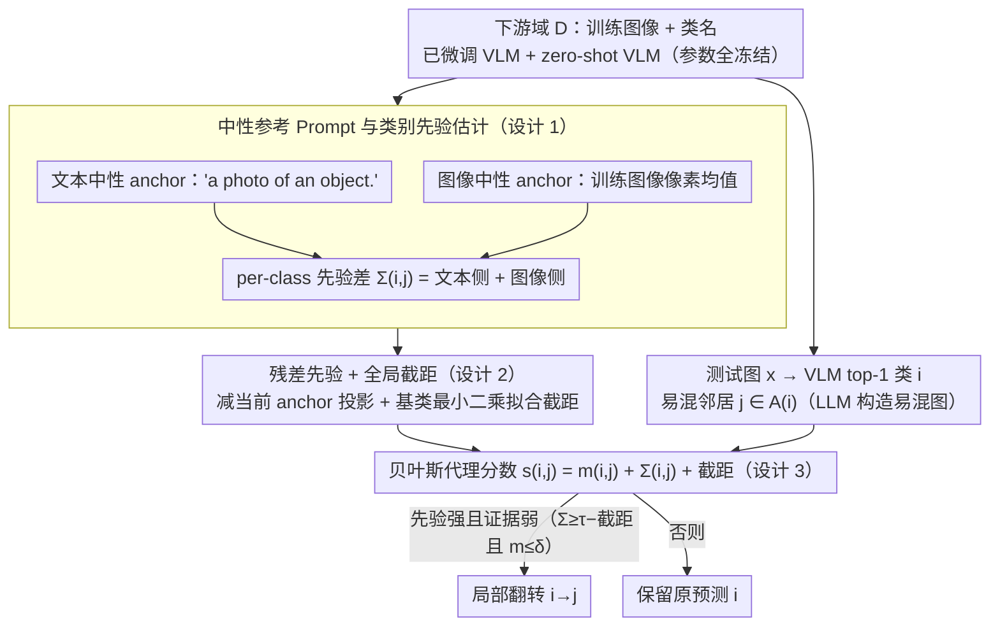

# Neutral-Reference Prompting for Vision-Language Models

**会议**: ICML 2026  
**arXiv**: [2605.15615](https://arxiv.org/abs/2605.15615)  
**代码**: https://github.com/Sheldon04/NeRP (有)  
**领域**: 多模态VLM / Prompt Tuning / 高效迁移  
**关键词**: Base-Novel权衡, 非对称混淆, 中性参考Prompt, 贝叶斯先验, 即插即用纠偏

## 一句话总结
本文将 VLM 高效迁移中的 Base-New Trade-off (BNT) 重新归因为"预训练带来的非对称类别偏好在未见类上未被消除"，提出 NeRP：用一个语义中性的文本 prompt 和"训练图均值"作为参考输入，在已训练好的 VLM 上零参数估计每个类别的先验偏移，再用贝叶斯风格的代理分数在易混淆类对之间做局部翻转，从而在不动模型参数的前提下提升未见类精度并保住基类精度。

## 研究背景与动机

**领域现状**：CLIP 时代的 VLM 高效迁移（CoOp、CoCoOp、MaPLe、PromptSRC、TCP、MMA 等）几乎清一色靠"在 base 类上学一组 prompt / adapter"做下游适配。基类精度上去了，但 novel（zero-shot 未见）类精度往往掉，构成 Base-New Trade-off。

**现有痛点**：主流解释把 BNT 归因为"在 base 类上过拟合"，因此各种方法都在"防过拟合"——加正则、约束 prompt 漂移、引入外部知识、共享表征。但作者指出这只是一半故事：novel 类精度差还有一个独立、更隐蔽的来源——**非对称混淆**。具体表现是 A 类的样本被系统性误判成 B，但 B 几乎不会被误判成 A，与"两类对称地难分"的常规混淆完全不同。

**核心矛盾**：非对称混淆来自预训练数据的不平衡，在图像端和文本端都形成了对某些类的偏好。微调时 base 类上的 cross-entropy 能压住这种偏好（因为有真实标签可以校正决策面），但 novel 类的预测完全依赖 zero-shot 几何，预训练偏好在 novel 上原封不动地留了下来。

**本文目标**：(1) 验证这种非对称混淆确实存在并区别于过拟合；(2) 在不修改模型参数、不重新训练的前提下，找出每个 novel 类的偏移方向并校正它；(3) 同时避免误伤本来预测正确的样本。

**切入角度**：作者反问——"如果丢一张语义完全为空的图像进 VLM，它会选哪个类？"——答案揭示了类别上的隐含偏好。把这种"无意义输入对应的类得分"作为先验，就能量出每对类之间的偏移强度与方向。

**核心 idea**：构造"中性参考 prompt"（class-agnostic 的文本如 "a photo of an object." 与训练图像像素均值作为图像端中性输入），将其在 VLM 上得到的 per-class 得分作为类别先验；用贝叶斯风格的 $\text{posterior}=\text{evidence}+\text{prior}$ 形式做事后纠偏，并仅在"先验强但证据弱"的样本上触发局部翻转，避免破坏正确预测。

## 方法详解

### 整体框架
NeRP 是一个即插即用的事后纠偏模块，不修改任何 VLM 参数。Pipeline：(1) 给定下游域 $D$，构造文本中性 anchor $u_{\mathrm{txt}}^0(D)=\text{norm}(g_{\mathrm{txt}}^0(\tau(D)))$ 与图像中性 anchor $u_{\mathrm{img}}(D)=f_{\mathrm{img}}(\bar{x}^D)$（$\bar{x}^D$ 是训练图像的像素均值经预处理）；(2) 与（微调后的）类原型 $t(c)$ 或 zero-shot 原型 $t^0(c)$ 计算 per-class 先验 logit $\pi_{\mathrm{txt}}(c;D)$、$\pi_{\mathrm{img}}(c;D)$，并构造类对先验差 $\Sigma_{i,j}(D)$（语义多样数据集上换成残差版 $\tilde{\Sigma}$ 并在基类对上拟合全局截距 $\hat{\beta}$）；(3) 离线用 LLM 为每个类查询若干"最易混淆"的候选类，构造对称的易混邻居图 $\mathcal{A}(i)$；(4) 对测试图 $x$ 与 top-1 类 $i$，在邻居 $j\in\mathcal{A}(i)$ 上算贝叶斯代理分数 $s_{ij}(x)=m_{ij}(x)+\Sigma_{i,j}(D)+\hat{\beta}(D)$；(5) 若先验强（$\Sigma_{i,j}\ge\tau-\hat{\beta}$）且证据弱（$m_{ij}(x)\le\delta$），则把 $i$ 翻成 $j$；否则保留原预测。

### 关键设计

**1. 中性参考 Prompt 与类别先验估计：从"语义为空的输入"里测出 VLM 的隐含类别偏好**

NeRP 的出发点是一个反问：丢一张语义完全为空的图进 VLM，它会偏向哪个类？这个偏向就是预训练留下的类别先验。文本侧用 class-agnostic 提示 $\tau(D)$（如 "a photo of an object."）过 zero-shot 编码器得中性向量 $u_{\mathrm{txt}}^0(D)$，与每类（微调后）原型 $t(c)$ 内积得 $\pi_{\mathrm{txt}}(c;D)=\langle t(c),u_{\mathrm{txt}}^0(D)\rangle$；图像侧用训练集像素均值 $\bar{x}^D$ 过图像编码器得 $u_{\mathrm{img}}(D)$，与 zero-shot 类原型内积得 $\pi_{\mathrm{img}}(c;D)$。两者形成的类对差 $\Delta\pi_{\mathrm{txt}}(i,j)$、$\Delta\pi_{\mathrm{img}}(i,j)$ 相当于两把测量同一条预训练 inter-class 方向 $\Delta_{ij}^0=t^0(i)-t^0(j)$ 的标尺。

这套估计能成立，靠的是一个低秩形变观察：作者把微调写成 $g=g^0+Ub$，证明微调主要重塑由 base 原型张成的低维子空间 $S$，而 novel 类之间的 zero-shot 几何基本不动（Assumption 3.1+3.2），所以 novel 类对上 $t(i)-t(j)\approx \Delta_{ij}^0$，先验差 $\Delta\pi$ 与期望 logits 差 $\mu_{ij}(D)$ 同号（Prop. 3.5）。而 base 类对的方向 $\Delta_{ij}^0$ 落在 $S$ 内、anchor 在 $S$ 上能量很小，先验天然变小（Lemma 3.4），所以纠偏几乎不碰已训好的 base 决策——这正是 NeRP"保 base、涨 novel"的根。

**2. 残差先验 + 全局截距：应对语义高度多样的数据集**

在 ImageNet 这种类间语义差异极大的数据上，原始先验跨类对方差太大，因为不同 anchor 在每类上有一个共同的、与类无关的偏置。本文把先验残差化：文本残差先验 $\tilde{\pi}_{\mathrm{txt}}(c;D)=\langle t(c),u_{\mathrm{txt}}^0(D)\rangle-\langle t(c),u_{\mathrm{txt}}(D)\rangle$（微调后中性 anchor 减 zero-shot 中性 anchor，剩下的是 anchor 的位移），图像侧同理。类对残差 $\Delta\tilde{\pi}\approx\langle\Delta_{ij}^0,u_{\mathrm{txt}}^0-u_{\mathrm{txt}}\rangle$ 直接度量"预训练 inter-class 方向"在 anchor 位移上的投影，把两个 anchor 的共同部分消掉、只留与类相关的分量，方差就显著缩小。再在 base 对上以最小二乘 $\hat{\beta}(D)=\arg\min_\beta\sum_{\mathcal{B}\times\mathcal{B}}(\hat{\mu}_{ij}-\Sigma_{i,j}-\beta)^2$ 拟合一个全局截距吸收公共漂移，实际使用时合并进阈值 $\tau$。残差化既保住了 Prop. 3.5 的同号性，常数项也通常更紧。

**3. 贝叶斯风格代理分数 + 局部翻转门控：只在"先验强、证据弱"处翻转**

把先验融进决策最危险的是误伤本来正确的强证据样本，所以 NeRP 只在先验主导的区域才动手。对样本 $x$、top-1 类 $i$ 与易混邻居 $j\in\mathcal{A}(i)$，定义代理分数 $s_{ij}(x)\approx m_{ij}(x)+\Sigma_{i,j}(D)+\hat{\beta}(D)$，其中 $m_{ij}(x)=\ell_i(x)-\ell_j(x)$ 是观测 logits 差（L2 归一化下可解释为 vMF 似然比的对数近似），整体等价于 log-posterior odds。翻转只在"先验主导区域" $\mathcal{R}_{i\to j}=\{\Sigma_{i,j}(D)\ge\tau-\hat{\beta}(D)\wedge m_{ij}(x)\le\delta\}$ 内触发——先验够强（gate $\tau$）但样本证据够弱（gate $\delta$）才命中。比较范围还被锁在易混邻居图 $\mathcal{A}(i)$ 内：该图是离线用一个本地部署的大模型（Qwen2.5-72B-Instruct）逐类查询"最容易与本类混淆的若干候选类"、再汇总成的对称无向图，于是翻转只发生在语义近、真易混的类对上，进一步压低误翻概率。

两个门控不是拍脑袋来的：Corollary 3.6 给出 sample-level 同号一致性的高概率界 $\Pr[\text{sign mismatch}]\le \sigma_m^2/(|\mu|-\gamma)^2$，只有当 $|\mu|$ 远大于噪声 $\sigma_m$ 时才该信先验；门控 $(\tau,\delta)$ 正是把这条理论保证落地成两个阈值。

### 损失函数 / 训练策略
NeRP **完全无训练**：所有量都用现成的预训练 + 微调后的 VLM 在域 $D$ 上一次性算好（包括类原型、中性 anchor、$\hat{\beta}(D)$、邻居图）。推理时多两次 anchor 编码、若干次内积与 top-1 邻居枚举，开销可忽略。

## 实验关键数据

### 主实验
在 11 个标准 base-to-novel 下游数据集（ImageNet、Caltech101、OxfordPets、StanfordCars、Flowers、Food101、Aircraft、SUN397、DTD、EuroSAT、UCF101）上，将 NeRP 与 5 个主流 baseline（CoOp、CoCoOp、MaPLe、PromptSRC、其他）配合使用，报告 Base/Novel/HM（调和平均）平均值。

| 方法 | Average Base | Average Novel | Average HM | 备注 |
|------|--------------|---------------|------------|------|
| CoOp (IJCV 22) | 82.69 | 63.22 | 71.66 | 单 prompt baseline |
| MaPLe (CVPR 23) | 82.28 | 75.14 | 78.55 | 多模态深度 prompt |
| MaPLe + NeRP（节选趋势） | 持平 | 明显↑ | ↑ | base 不掉、novel 涨 |

完整论文中 NeRP 与每个 baseline 叠加后，几乎所有数据集上 Novel 都涨，HM 也涨，而 Base 基本持平（Lemma 3.4 的理论保证：base 类上先验差被压制，因此触发翻转的概率极低）。

### 消融与门控分析
| 配置 | 行为 | 结论 |
|------|------|------|
| 仅 $\pi_{\mathrm{txt}}$ | 文本侧先验单独使用 | 已有显著 novel 增益 |
| 仅 $\pi_{\mathrm{img}}$ | 图像侧先验单独使用 | 与 $\pi_{\mathrm{txt}}$ 互补 |
| $\pi_{\mathrm{txt}}+\pi_{\mathrm{img}}$（默认 $\Sigma$） | 两侧合用 | 优于任一单侧 |
| 残差版 $\tilde{\Sigma}$ | 减去当前 anchor 投影 | 在 ImageNet 等语义多样数据集上更稳 |
| 去掉证据 gate $\delta$ | 仅看先验就翻 | base 类被误伤、HM 反而下降 |
| 去掉邻居图 $\mathcal{A}(i)$ | 全 $C-1$ 个类候选翻 | 翻错率上升 |

### 关键发现
- **非对称混淆是 BNT 的一个独立成因**：t-SNE 与 per-class mean logits 方差图（论文 Fig.3）显示 novel 类的非对称偏移与 base 类的过拟合是两条独立的退化路径，过拟合正则方法（如 PromptSRC）解决不了前者。
- **图像端的"训练均值图"作为中性 anchor 出乎意料地有效**：它保留了域风格但抹掉了语义，正好把"VLM 在该域上的图像端偏好"暴露出来，与文本侧先验互为正交补充。
- **门控阈值 $(\tau,\delta)$ 对 base 几乎无害**：Lemma 3.4 说 base 类上先验差天生小，所以默认阈值下 base 上很少触发翻转——这正是 NeRP 能"保 base 涨 novel"的根本原因。

## 亮点与洞察
- **把 BNT 重新归因**：从"过拟合"叙事跳到"预训练非对称偏好+novel 上没机会校正"，并给出可测量、可校正的具体量，研究品味很高。
- **"中性输入"做先验探针的设计可迁移**：任何 vision-language 检索/分类系统都可以套——文本侧拿一个 class-agnostic 模板、图像侧拿训练集均值/纯噪声/灰图，立刻得到一组类别先验，零成本上线。
- **理论与工程相互支撑**：低秩形变模型 + base 子空间 + vMF log-likelihood ratio 串成完整链条，门控阈值不是拍脑袋的，而是 Corollary 3.6 高概率界的工程化产物。

## 局限与展望
- 主要在 base-to-novel split 上验证，对真实开放词表/长尾设置（如几千个 novel 类）下邻居图构造与阈值选择的可扩展性需进一步验证。
- 中性 anchor 的构造对域分布敏感：训练图均值在风格高度一致的数据集（EuroSAT、DTD）上信号强，但在风格高度异质的数据集上可能稀释偏好信号；可考虑域聚类后多 anchor。
- 阈值 $(\tau,\delta)$ 与邻居图 $\mathcal{A}(i)$ 仍需在 val 上选，理想化的"零参数"略打折扣；可探索自适应阈值。
- 当前只用余弦+vMF 近似，对 logit 校准（temperature scaling）后或非 CLIP 风格 VLM（如 BLIP、Flamingo）适配性需评估。

## 相关工作与启发
- **vs CoOp / CoCoOp / MaPLe / PromptSRC / TCP / MMA**：这些工作都通过"训练阶段的 prompt/adapter 设计"对抗过拟合，NeRP 完全正交——推理阶段做事后纠偏，因此可以叠加在任何一个上面用。
- **vs ProGrad / DPC（梯度方向/解耦双 prompt）**：同样关心"别把 zero-shot 知识冲掉"，但 ProGrad/DPC 是训练侧的方向控制，NeRP 是推理侧的方向探测+纠偏。
- **vs CLIP 偏见研究（So-B-IT、M4、CounterAnimal、Ghate et al.）**：这条线主要 audit 与 debias 训练数据/表征，NeRP 把这些"已知存在的偏见"转化为可用先验，反过来当作纠偏工具，是从"诊断"到"利用"的转换。

## 评分
- 新颖性: ⭐⭐⭐⭐⭐ 非对称混淆 + 中性 anchor 探针 + 贝叶斯门控的组合在 BNT 文献里独此一家。
- 实验充分度: ⭐⭐⭐⭐ 11 数据集 × 5 baseline 横扫，但主要在 base-to-novel split，跨域评估略简。
- 写作质量: ⭐⭐⭐⭐ 理论部分（Assumptions 3.1-3.2 → Lemma 3.3-3.4 → Prop. 3.5 → Cor. 3.6）链条清晰，工程门控与理论对应明确。
- 价值: ⭐⭐⭐⭐⭐ 训练零参数、推理低开销、与任何 prompt tuning 方法兼容，工业部署价值很高。

<!-- RELATED:START -->

## 相关论文

- [\[ECCV 2024\] Attention Prompting on Image for Large Vision-Language Models](../../ECCV2024/multimodal_vlm/attention_prompting_on_image_for_large_visionlanguage_models.md)
- [\[AAAI 2026\] VP-Bench: A Comprehensive Benchmark for Visual Prompting in Multimodal Large Language Models](../../AAAI2026/multimodal_vlm/vp-bench_a_comprehensive_benchmark_for_visual_prompting_in_m.md)
- [\[ICML 2026\] Vision Language Models 无法推理物理变换](vision_language_models_cannot_reason_about_physical_transformation.md)
- [\[AAAI 2026\] Graph-of-Mark: Promote Spatial Reasoning in Multimodal Language Models with Graph-Based Visual Prompting](../../AAAI2026/multimodal_vlm/graph-of-mark_promote_spatial_reasoning_in_multimodal_langua.md)
- [\[ICML 2026\] Large Vision-Language Models Get Lost in Attention](large_vision-language_models_get_lost_in_attention.md)

<!-- RELATED:END -->
