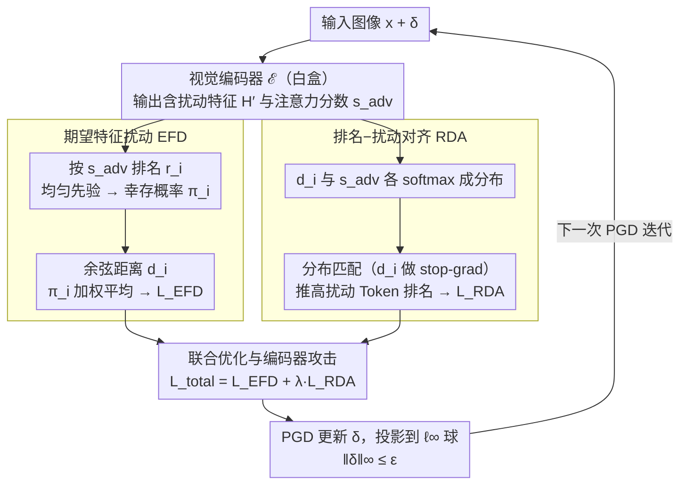

# On the Adversarial Robustness of Large Vision-Language Models under Visual Token Compression

**会议**: ICML 2026  
**arXiv**: [2601.21531](https://arxiv.org/abs/2601.21531)  
**代码**: https://github.com/XinweiZhang1998/CAGE (有)  
**领域**: 多模态VLM / AI安全 / 对抗鲁棒性  
**关键词**: 视觉Token压缩, 对抗攻击, 鲁棒性评估, LVLM, 编码器攻击

## 一句话总结
本文首次系统研究了带视觉Token压缩的大视觉语言模型(LVLM)的对抗鲁棒性，指出现有编码器攻击存在"优化-推理空间不匹配"问题，并提出 CAGE 攻击通过期望特征扰动 (EFD) 与排名-扰动对齐 (RDA) 两个目标，在未知压缩机制与未知Token预算下显著降低被压缩 LVLM 的鲁棒精度。

## 研究背景与动机

**领域现状**：LLaVA-NeXT、InternVL 这类主流 LVLM 每张图都要走数百到上千个视觉 Token，部署成本非常高。为此 VisionZip、VisPruner、DivPrune、FlowCut、PruMerge 等"插即用"的视觉Token压缩方法成为部署标配——它们先用注意力分数挑选 Top-K 个信息量大的 Token，再可选地把次要 Token 合并进来，把视觉序列长度从 $N=576$ 砍到 $K\ll N$，在几乎不掉点的前提下大幅提速。

**现有痛点**：这类压缩 LVLM 越来越多地落地在自动驾驶、机器人等安全敏感场景，但学界几乎没有评估过"压缩后"的对抗鲁棒性。现有评估基本沿用编码器攻击（如 VEAttack），在完整的 $N$ 个 Token 表征空间里优化扰动，再拿这个扰动去打压缩后的模型——评估结果可能严重失真。

**核心矛盾**：扰动是在"全 Token 表征"上优化的，但推理只走"压缩后表征"，存在两条具体的失效路径：(i) **预算稀释**：相当一部分优化信号被分配给了那些会被裁掉、根本不参与推理的 Token；(ii) **依赖断裂**：压缩裁掉了上下文/背景 Token，破坏了攻击在全局优化时所依赖的跨 Token 交互。两者合起来导致鲁棒精度被显著高估。

**本文目标**：(1) 把"压缩 LVLM 的鲁棒性"作为独立问题立起来；(2) 设计一个在部署预算 $K_{\text{model}}$ 与具体压缩机制 $\mathcal{C}$ 都未知的灰盒条件下，仍能与压缩瓶颈对齐的攻击。

**切入角度**：作者观察到两个互补现象：① 把 Token 按注意力排序后，扰动后特征的 cosine 偏移随 $K$ 增大单调下降——说明扰动天然集中在高重要性 Token 上，而这些恰好是会"幸存"的；② 在 $K_{\text{attack}}=K_{\text{model}}$ 时攻击最强（如 16-Token 部署下，全 Token 攻击的鲁棒精度 49.7%，对齐到 16 后降到 44.4%）。

**核心 idea**：不要把扰动均摊到所有 Token，而是用一个概率化框架，将扰动能量集中在那些"在多种可能预算下都会幸存"的 Token 上，同时主动把这些 Token 的注意力得分推高，确保它们真的被选中。

## 方法详解

### 整体框架
CAGE 维持编码器攻击的灰盒前提（白盒访问视觉编码器 $\mathcal{E}$，黑盒访问压缩模块 $\mathcal{C}$ 与 LLM $\mathcal{F}$，且 $K_{\text{model}}$ 未知）。整条优化流水线一次 PGD 迭代如下：(1) 输入图像 $\mathbf{x}+\boldsymbol{\delta}$ 过编码器得到含扰动特征 $\mathbf{H}'$ 与含扰动注意力分数 $s_i^{\mathrm{adv}}$；(2) 根据 $s_i^{\mathrm{adv}}$ 排出 $r_i$ 并按一个先验分布 $P(K_{\text{model}})$ 计算每个 Token 的幸存概率 $\pi_i$；(3) 用 $\pi_i$ 加权 cosine 距离 $d_i$ 得到 EFD 损失；(4) 把 $d_i$ 和 $s_i^{\mathrm{adv}}$ 分别 softmax 成分布，最大化对齐项 RDA；(5) 联合反传更新 $\boldsymbol{\delta}$，并投影到 $\ell_\infty$ 球面 $\|\boldsymbol{\delta}\|_\infty\le \epsilon$。攻击目标始终是编码器，不依赖文本 prompt，也不假设知道 $K_{\text{model}}$ 或 $\mathcal{C}$。

### 关键设计

**1. 期望特征扰动 EFD：把扰动能量集中到"多种预算下都会幸存"的 Token 上**

预算稀释和依赖断裂的根子，是攻击者不知道部署到底保留哪些 Token。EFD 的应对是把部署预算 $K_{\text{model}}$ 当成未知离散随机变量，先验设为 $K_{\text{model}}\sim\mathcal{U}[K_{\min},K_{\max}]$，于是 Token $i$ 的幸存概率写成 $\pi_i=P(K_{\text{model}}>r_i)$——它是一条随排名衰减的软掩码，高排名 Token 几乎必然为 1、中段渐降、低排名趋 0。再用余弦距离 $d_i=1-\mathcal{S}(\mathbf{z}_i^{\mathrm{adv}},\mathbf{z}_i^{\mathrm{cln}})$ 度量每个 Token 被扰动的强度，损失取幸存概率加权的平均扰动 $\mathcal{L}_{\text{EFD}}=\sum_i \pi_i d_i / \sum_i \pi_i$。为什么不直接用注意力分数 $s_i$ 加权？因为 softmax 太尖，会把梯度过度集中到极少数 Top Token，中段 Token 几乎拿不到信号；但中段 Token 在中等或未知预算下其实有非平凡概率被选中，所以换成跨预算积分出来的 $\pi_i$，才是真正"与压缩瓶颈对齐"的权重。

**2. 排名-扰动对齐 RDA：把被埋掉的那条梯度通路显式补回来**

光集中扰动还不够——扰动重的 Token 如果排名不够高，照样会被裁掉、根本进不了 LLM 输入。理论上对 $\mathcal{L}_{\text{EFD}}$ 求梯度能分解成两项：$\sum_i \pi_i \nabla d_i$ 是"在已选 Token 上继续加扰动"，$\sum_i d_i \nabla \pi_i$ 是"把高扰动 Token 推上排名"。但第二项因为 Top-K 选择是分段常数函数，梯度稀疏、还在切换点处病态，几乎传不出有效信号。RDA 用一个可微的分布匹配把这条通路补回来：把 $d_i$ 和对抗注意力分 $s_i^{\mathrm{adv}}$ 各自 softmax 成分布 $p_i^{(d)}$、$p_i^{(s)}$，最大化 $\mathcal{L}_{\text{RDA}}=\sum_i p_i^{(d)} \log p_i^{(s)}$，让"被选中的分布"去拟合"扰动的分布"；优化时对 $p^{(d)}$ 做 stop-gradient，避免两边同时漂移退化。这样高扰动 Token 就被主动推到注意力前列，真正经过压缩瓶颈影响 LLM。

**3. 联合优化与编码器攻击形式：打 Top-K 选择这个统一接口**

两个目标在 PGD 框架下合成总损失 $\mathcal{L}_{\text{total}}=\mathcal{L}_{\text{EFD}}+\lambda\cdot\mathcal{L}_{\text{RDA}}$，受 $\|\boldsymbol{\delta}\|_\infty\le\epsilon$ 约束——形象地说，EFD 在"幸存集"内部造伤害（payload），RDA 负责把高扰动 Token 送进幸存集（delivery），二者一个管"选了之后被扰动多少"、一个管"选谁"。攻击之所以能和具体压缩机制解耦，是因为所有主流压缩方法的第一步几乎都是 Top-K 选择——无论是纯选择型（DivPrune、Alvar）还是选完再合并（VisionZip、PruMerge），打这一步就是个统一接口，天然覆盖差异化的下游合并逻辑。整个攻击仍是编码器攻击，不需要文本 prompt、也不假设知道 $K_{\text{model}}$ 或压缩模块 $\mathcal{C}$。

### 损失函数 / 训练策略
攻击仍是编码器攻击（不需文本、不需 LLM 前传），用 PGD 迭代 + $\ell_\infty$ 投影；幸存概率 $\pi_i$ 在每步用当前的对抗注意力分数重新计算；$p^{(d)}$ 做 stop-gradient；$\lambda$ 与 $\epsilon$ 是主要超参。先验分布选均匀分布 $[K_{\min},K_{\max}]$，这样不需要事先猜真实部署预算就能覆盖一片合理区间。

## 实验关键数据

### 主实验
评估在 LLaVA 上对 5 种代表性压缩方法（VisionZip / VisPruner / DivPrune / FlowCut / PruMerge）× 3 个数据集（GQA / TextVQA / VQA-v2）做攻击。下表给出 $K_{\text{model}}=192$ 下的平均鲁棒精度对比（数值越低攻击越强）。

| 数据集 | Clean | Robust (Base 基线攻击) | Robust (CAGE) | 鲁棒精度下降 |
|--------|-------|------------------------|----------------|--------------|
| GQA | 56.1 | 40.8 | 36.2 | ↓11.3% |
| TextVQA | 56.7 | 33.5 | 23.4 | ↓30.1% |
| VQA-v2 | 73.4 | 55.4 | 47.2 | ↓14.8% |
| 上界 (576 Tokens, 无压缩) | 60.3 / 57.5 / 74.5 | 42.3 / 34.7 / 55.8 | 39.4 / 26.5 / 49.4 | ↓6.9 / 23.6 / 11.4% |

可以看到：(1) CAGE 在所有压缩方法上一致地把鲁棒精度压得比基线更低，尤其在 TextVQA 上幅度最大（一项 OCR-VQA 任务，依赖精细视觉证据，对 Token 丢失更敏感）；(2) 即便在无压缩的"上界"设置下，CAGE 也优于基线，说明 EFD/RDA 提供的"扰动集中 + 注意力推高"机制本身就是个更强的编码器攻击。

### 消融与动机分析
| 配置 | 在 $K_{\text{model}}=16$ 下的鲁棒精度 (%, ↓) | 结论 |
|------|-----------------------------------------------|------|
| $K_{\text{attack}}=576$（全 Token，VEAttack 默认） | 49.7 | 优化-推理空间不匹配，明显偏弱 |
| $K_{\text{attack}}=192$ | 45.3 | 缩小到接近部署预算时增强 |
| $K_{\text{attack}}=64$ | 44.7 | 进一步对齐 |
| $K_{\text{attack}}=16$（与部署精确对齐） | 44.4 | 最强，但需知道真实 $K_{\text{model}}$ |
| CAGE (EFD only) | 介于上两行之间 | 仅集中扰动还不够 |
| CAGE (EFD + RDA, 完整) | 在多预算上同时优于上述固定 $K_{\text{attack}}$ | 跨预算更鲁棒 |

### 关键发现
- **压缩本身会"保留"被严重扰动的 Token**：注意力排序下 cosine 偏移随 $K$ 单调递减，说明扰动天然集中在 Top Token 上，而压缩恰恰留下这些 Token，因此压缩并不"自动免疫"对抗扰动——反而把最脏的证据保留下来。
- **预算对齐效应**：固定攻击预算下，攻击最强的位置基本对齐部署预算 $K_{\text{model}}$；这解释了为什么传统全 Token 攻击会高估鲁棒性。
- **防御初探**：作者尝试了若干潜在防御策略，结果显示有一定缓解但远不足以堵住漏洞，呼吁面向压缩的安全评估与防御。

## 亮点与洞察
- **首次把"压缩"摆到 LVLM 安全评估的正中央**：把一个工程加速技巧重新定性为安全攻击面，方法干净——一个先验、一条 KL 风味的对齐项即可，迁移代价低。
- **概率化处理未知预算**：用均匀先验把 $K_{\text{model}}$ 期望积分掉，避免攻击者必须先猜部署配置，这对真实灰盒环境非常实用，思路可迁移到任何"推理路径不可见但有 Top-K 选择"的场景（如 MoE 路由攻击、稀疏注意力攻击）。
- **梯度分析直接驱动 RDA**：从 $\nabla_x \mathcal{L}_{\text{EFD}}$ 的两项分解里识别出"分布提升项"由于离散 Top-K 而失效，再用可微 KL 把它补回来——这种"先把隐式梯度算出来再显式化"的方法论可以套用到很多带 Top-K 的模块上。

## 局限与展望
- 仅评估 LLaVA + 5 种插即用压缩，未覆盖训练阶段就引入压缩（如训练时 Token Merging）、跨模态压缩或多图 agent 设置；后者恰恰是动机里强调的部署场景。
- 攻击仍是编码器攻击，未与端到端 LLM 反传攻击对比强度上限，且对文本 prompt-agnostic 反过来也意味着无法利用任务相关线索做更精细的攻击。
- 防御部分较薄，应深入研究"压缩感知"防御，例如随机化 $K$、重排注意力、压缩-鲁棒训练等。
- 先验设为均匀分布是工程简化，若真实部署预算偏向某端，EFD 权重可能不最优；可考虑用攻击成功反馈在线调整先验。

## 相关工作与启发
- **vs VEAttack (Mei et al., 2026)**：VEAttack 在全 Token 表征上最大化 cosine 偏移，本文指出这在压缩 LVLM 上系统性低估攻击强度；CAGE 通过 $\pi_i$ 加权与 RDA 对齐显著加强。
- **vs Cui et al., 2024 / Wang et al., 2024c 等编码器攻击**：同样使用编码器灰盒前提，但本文显式建模了"推理时的压缩瓶颈"，把瓶颈结构纳入优化目标。
- **vs VisionZip / VisPruner / DivPrune / FlowCut / PruMerge 等压缩方法**：这些方法都是为加速设计的"性能-效率"工作，本文把它们当作攻击对象，揭示了"压缩越激进，鲁棒性评估失真越严重"，提示未来压缩论文必须自带 compression-aware 鲁棒性评估。

## 评分
- 新颖性: ⭐⭐⭐⭐⭐ 第一篇系统揭示"Token压缩 vs 鲁棒性评估"失配的工作，问题定义独立。
- 实验充分度: ⭐⭐⭐⭐ 覆盖 5 种压缩 × 3 个 VQA 数据集 × 多预算，主结论稳定；但仅一个 LVLM 主干。
- 写作质量: ⭐⭐⭐⭐ 动机两条 insight + 梯度分析推导 RDA，叙事清晰；图 1/2 信息密度很高。
- 价值: ⭐⭐⭐⭐⭐ 直接给出"压缩 LVLM 部署必须重新做安全评估"的明确结论，对工业部署影响大。

<!-- RELATED:START -->

## 相关论文

- [\[ICML 2026\] Certified Robustness under Heterogeneous Perturbations via Hybrid Randomized Smoothing](certified_robustness_under_heterogeneous_perturbations_via_hybrid_randomized_smo.md)
- [\[CVPR 2026\] AGFT: Alignment-Guided Fine-Tuning for Zero-Shot Adversarial Robustness of Vision-Language Models](../../CVPR2026/multimodal_vlm/agft_alignment-guided_fine-tuning_for_zero-shot_adversarial_robustness_of_vision.md)
- [\[ICLR 2026\] PPE: Positional Preservation Embedding for Token Compression in Multimodal Large Language Models](../../ICLR2026/multimodal_vlm/ppe_positional_preservation_embedding_for_token_compression_in_multimodal_large_.md)
- [\[AAAI 2026\] Rethinking Visual Token Reduction in LVLMs under Cross-Modal Misalignment](../../AAAI2026/multimodal_vlm/rethinking_visual_token_reduction_in_lvlms_under_cross-modal_misalignment.md)
- [\[ICCV 2025\] Dynamic-VLM: Simple Dynamic Visual Token Compression for VideoLLM](../../ICCV2025/multimodal_vlm/dynamic-vlm_simple_dynamic_visual_token_compression_for_videollm.md)

<!-- RELATED:END -->
