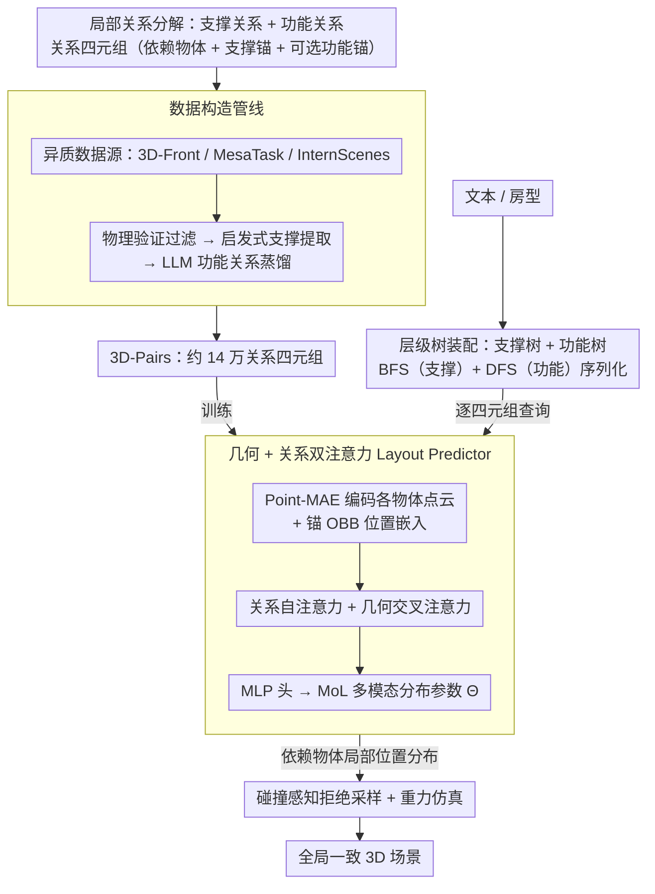

# Pair2Scene: Learning Local Object Relations for Procedural Scene Generation

**会议**: ICML 2026  
**arXiv**: [2604.11808](https://arxiv.org/abs/2604.11808)  
**代码**: 无（仅 Project Page）  
**领域**: 3D 场景生成 / 程序化生成  
**关键词**: 3D 场景生成, 局部物体关系, 支撑关系, 功能关系, MoL 分布, 拒绝采样  

## 一句话总结
Pair2Scene 把 3D 室内场景生成从「直接拟合全局联合分布」改成「学习一对一的局部物体关系（支撑 + 功能）然后按场景层级树递归装配」，配合点云几何编码、Mixture-of-Logistics 概率头和碰撞感知拒绝采样，在仅用 3D-Front 数据训练时即可生成对象数从约 4 跃升到约 14 的复杂场景，FID 和用户研究均优于 ATISS、DiffuScene、LayoutVLM 等基线。

## 研究背景与动机

**领域现状**：高保真 3D 室内场景生成主要分两条线——(i) **学习派**（ATISS、DiffuScene、LayoutVLM、FactoredScenes）端到端在单一数据集上拟合场景的联合分布；(ii) **LLM/VLM 派**（GALA3D、I-Design、HoloDeck、HSM）用语言模型的常识知识做整体布局推理。

**现有痛点**：学习派受训练集容量上限严重限制——3D-Front 平均每场景仅 4.07 个家具，模型学到的分布永远到不了「真实公寓里几十件物品」的密度；当对象数上升时，建模物体两两间的全局依赖随 $O(N^2)$ 复杂度激增，根本无法学好。LLM/VLM 派语义丰富但空间推理能力差，常常出现穿模、悬浮等物理不可行布局。

**核心矛盾**：「全局联合分布」假设每个物体的位置都依赖全场景的其它所有物体；但作者观察到**真实物体的摆放几乎只受邻近少数支撑/功能伙伴影响**，全局依赖大部分是冗余的。强行学全局相当于在数据稀缺的情况下还要拟合一个超高维流形，必然欠拟合。

**本文目标**：(a) 用一个**局部关系**视角重构问题，使「关系样本数」可以从多个数据集累加，不再受单场景容量限制；(b) 在物理上保证支撑关系的稳定性、在语义上保证功能关系的合理性；(c) 让生成的复杂度可超出训练分布。

**切入角度**：把场景分解成关系四元组 $\mathcal{T}_i = \langle\mathcal{O}_{dep,i}, \mathcal{O}_{sup,i}, \{\mathcal{O}_{fnc,i}\}_{opt}\rangle$（依赖物体 + 必选支撑锚 + 可选功能锚），学习「给定锚的几何与位置，依赖物体的位置分布」这个条件密度，然后用层级树 + 拒绝采样把局部规则装配成全局场景。

**核心 idea**：用「局部关系学习 + 程序化层级装配」替代全局联合分布建模。

## 方法详解

### 整体框架
Pair2Scene 由三大模块协同工作：(1) **数据构造管线**——从 3D-Front、MesaTask、InternScenes 等异质数据源里通过物理模拟 + 几何启发式 + LLM 蒸馏，提取约 140k 个关系四元组，构成 3D-Pairs 数据集；(2) **Pair2Scene 模型**——以 Point-MAE 编码各物体点云的几何特征 $z^{geo}$，以 MLP 编码锚物体 OBB $B$ 的空间嵌入 $e^{bbox}$，用级联 Transformer 块（关系 self-attention + 几何 cross-attention）融合，最后用 MLP 输出 Mixture-of-Logistics 分布参数 $\Theta$ 为依赖物体的 12 维 OBB 给出多模态条件密度 $P(B_{dep}\mid\Theta)$；(3) **程序化装配**——根据文本或房型自动构造支撑树 $\mathbb{T}_s$ + 功能树 $\mathbb{T}_f$，按 BFS(支撑) + DFS(功能) 混合遍历得到关系序列，每一步从模型分布采样位置，碰撞则拒绝重采样，最后用小幅重力仿真贴合。

### 关键设计

**1. 支撑/功能两类关系 + Mixture-of-Logistics 多模态分布**

场景生成的核心被本文形式化为一个条件密度：给定锚物体的信息，预测依赖物体的 OBB。这里有个细节必须照顾——"椅子可以放桌子四面"这种自然多解，单峰回归根本表达不了。所以模型把关系先分成两类（支撑关系 $R_s$ 由重力主导，比如桌上的电脑；功能关系 $R_f$ 由语义近邻主导，比如键盘配鼠标），再对依赖物体的 12 维 OBB（中心 + 尺寸 + 6D 旋转）预测 $K$ 个 Logistic 分量的混合 $P(B_{dep}\mid\Theta) = \sum_{k=1}^K \pi_k\prod_{d=1}^{12} L(B_{dep,d}\mid\mu_{k,d}, s_{k,d})$。训练用 NLL 加熵正则 $\mathcal{L}_{total} = \mathcal{L}_{nll} + \lambda\mathcal{L}_{ent}$，其中 $\mathcal{L}_{ent} = \sum_k \hat\pi_k\log\hat\pi_k$ 鼓励混合系数熵高、防止坍缩到单峰。选 MoL 而非高斯混合，是因为 Logistic 的 CDF 有闭式、采样高效，且在 PixelCNN++ 等工作里早证明能很好刻画多模态结构化分布；把支撑和功能显式拆开，则贴合人对家具排布"先稳住再讲功能"的直觉。

**2. 数据构造管线：把异质场景数据炼成 3D-Pairs 关系样本**

局部关系学习要成立，前提是能从现成数据里把"一对一关系"干净地抽出来——可原始场景数据噪声大、根本没有现成的关系标注。所以作者设计了一条三阶段数据构造管线，把 3D-Front（大件家具）、MesaTask（桌面）、InternScenes 的 Real-to-Sim 子集（开放场景）这三类异质数据统一炼成关系四元组。第一阶段**物理验证过滤**：对每个场景跑刚体仿真、加重力并解初始碰撞，凡是仿真中明显位移的物体判为不稳定直接丢掉，保证留下的布局物理上站得住。第二阶段**启发式支撑提取**：用几何规则判定支撑关系 $R_s$——下方物体的 OBB 是否为上方提供稳定底面、或在水平方向包住上方，垂直贴近度与水平包含度都过阈值才算一对；并刻意排除"只有地板做锚"的样本，以免被 InternScenes 噪声化的尺度污染、同时保住 3D-Front 大件家具的分布。第三阶段 **LLM 功能蒸馏**：对共享同一支撑面的物体，用 LLM 判定功能关系 $R_f$ 并给出邻近系数 $k$，再把锚物体的 OBB 按 $k$ 膨胀、只有当依赖物体质心落在膨胀体积内才收录——LLM 出语义、几何做校验，避免 LLM 凭空臆造。三阶段下来得到约 14 万个关系四元组的 3D-Pairs。这一步是"局部关系样本可跨数据集累加"这一卖点真正落地的地方：关系是局部的、跨数据集通用的，于是三个原本无法端到端联合训练的异质数据集，在"关系四元组"这个统一接口下被拼到一起，直接绕开了单数据集容量的天花板。

**3. 几何 + 关系双注意力 Layout Predictor**

仅靠语义类别判断支撑面是会翻车的——很多桌子顶面不平、椅子背面带曲面，光知道"这是桌子"没用。所以模型要同时感知物体真实几何和关系拓扑。每个角色 $m\in\{dep, sup, fnc\}$ 用一个 learnable query token $x_m$ 表示，锚物体的位置嵌入 $e_m^{bbox} = \mathrm{MLP}_{pos}(B_m)$ 只加到 self-attention 的 key/value。Relational Self-Attention 写成 $X = \mathrm{SelfAttn}(X, X+E^{bbox}, X+E^{bbox})$，让 dep token 能 attend 到 sup/fnc 的空间存在感；Geometry-Aware Cross-Attention 写成 $x_m = \mathrm{CrossAttn}(x_m, z_m^{geo}, z_m^{geo})$，每个角色 token 只跟自己的 Point-MAE 点云特征交互，避免几何信息串台；最后 $x_{dep}$ 过 MLP 头吐出分布参数 $\Theta$。这里有个结构性巧思——锚 token 加位置嵌入而 dep token 不加，因为 dep 的位置正是要预测的目标，加了就会泄漏 ground-truth。

**4. 层级树装配 + 拒绝采样：把局部规则升级成全局一致场景**

学的是局部条件密度，怎么保证拼出来的全局场景无碰撞、物理合理？答案是程序化装配。场景被表示成一棵支撑树 $\mathbb{T}_s$（根是地板），每个非叶节点上再挂一棵功能树 $\mathbb{T}_f$（共享支撑面的物体间的语义依赖）。生成时按 BFS 走 $\mathbb{T}_s$ 保证支撑面先放、再对每个节点 DFS 走 $\mathbb{T}_f$，得到关系序列 $\mathcal{S} = \{\mathcal{T}_1, \ldots, \mathcal{T}_N\}$。每一步从局部分布 $p_{\text{local}}(x)$ 采样候选位置，把可行集 $\mathcal{F}$ 定义为"不与已放置物体或边界碰撞"，于是全局分布就是 $p_{\text{global}}(x) = p_{\text{local}}(x)/Z$（$x\in\mathcal{F}$，否则为 0），用拒绝采样近似，采样成功后再做一次短重力仿真贴合。拒绝采样让局部条件密度自然升级为带全局碰撞约束的分布，不必重训；BFS+DFS 的遍历顺序强制了因果序——任何 dep 被预测时它的锚都已经存在，避开了鸡生蛋问题。树本身支持两种构造：统计合成（按频率/共现概率程序展开）和 LLM 引导（用 LLM 把文本描述转成层级树）。LLM 只负责造树结构这个它擅长的活、不直接预测坐标这个它的弱项，几何模型与 LLM 的能力分工得很干净。

### 损失函数 / 训练策略
训练目标 $\mathcal{L}_{total} = \mathcal{L}_{nll} + \lambda\mathcal{L}_{ent}$，NLL 拟合 MoL 分布，熵正则防 mode collapse；Point-MAE 在论文聚合的 3D 资产库上预训练后作为几何编码器；训练数据为上面（关键设计 2）构造的 3D-Pairs，共约 14 万关系四元组。

## 实验关键数据

### 主实验
两种评估设置：(A) **3D-Front only**——只用 3D-Front 训练，对比 ATISS / DiffuScene / LayoutVLM / FactoredScenes；(B) **multi-source**——用全部 3D-Pairs 训练，与程序化 / LLM-based 系统对比（Holodeck、Infinigen-Indoors、LayoutVLM、FactoredScenes）。

| 方法（3D-Front only）| FID ↓ | KID×1e-3 ↓ | 平均对象数 |
|---|---|---|---|
| ATISS | 71.24 | 42.18 | 7.65 |
| DiffuScene | 67.45 | 31.72 | 6.75 |
| LayoutVLM | 120.87 | 138.54 | -- |
| FactoredScenes | 104.12 | 129.45 | 8.53 |
| **Ours-Fit** | **65.92** | **22.14** | 6.98 |
| **Ours-Beyond** | 75.88 | 69.05 | **14.15** |

22 人用户研究在 3D-Front 设置上 Ours-Beyond 拿到 SA 5.23 / PP 5.00 / SC 5.23 / MQ 5.12 / CFS 4.46，几乎全部居首；在 multi-source 设置上 Ours 得 SA 4.55 / PP 4.32 / SC 4.73，CFS 4.20 远超第二名 LayoutVLM 的 1.72。

### 消融实验

| 变体 | FID ↓ | KID×1e-3 ↓ | 说明 |
|---|---|---|---|
| w/o relation（不显式分支撑/功能） | 92.34 | 82.74 | 关系分解必要 |
| w/o pretrain（Point-MAE 不预训练） | 81.14 | 73.91 | 几何先验关键 |
| 完整模型 Ours-Fit | 65.92 | 22.14 | 全套设计 |

### 关键发现
- Ours-Fit 的 KID 仅 22.14、远超第二名 DiffuScene 的 31.72，说明在数据集分布内已经超越所有 baseline；而 Ours-Beyond 把对象数从 6.98 推到 14.15，证明能跳出训练分布的密度上限。
- 用户研究中 LayoutVLM 在 Scene Complexity 上得分较高但 Physical Plausibility 极差（2.14），印证 LLM/VLM 派「丰富但乱」的痛点；Pair2Scene 在 SC 和 PP 上都拿高分，是结构性优势。
- 关系分解（w/o relation 消融）影响最大，意味着「支撑/功能」是这套方法的核心 inductive bias，不只是工程包装。

## 亮点与洞察
- 「全局联合分布是冗余的，物体放置主要受局部依赖」这一观察直接挑战了过去几年场景生成的主流建模假设，并用实验证明可以转成更可扩展的局部学习。
- 三种数据源（curated 家具、桌面、real-to-sim 开放场景）异质性极强，作者用「关系四元组」做统一接口，相当于设计了一个跨数据集的可扩展协议，对场景数据集生态有方法论意义。
- LLM 用于「生成层级树」而非「直接生成坐标」的分工，是 LLM-as-controller、几何模型-as-executor 这种新范式的优雅样例。

## 局限与展望
- 关系四元组限定为「单 sup + 单 opt fnc」，对于真正复杂的多方依赖（如三角桌椅几何约束）表达力受限。
- 拒绝采样在高密度场景下效率会下降，且没考虑全局美学（对称性、风格统一），未来可与全局 prior 结合。
- 树构造的 statistical synthesis 仍依赖数据集统计，能否生成数据集中从未见过的房型（如圆形书房）尚不清楚；LLM-guided 则受 LLM 常识盲区影响。
- 论文未公布代码，复现门槛偏高。

## 相关工作与启发
- **vs ATISS / DiffuScene**：它们把场景当 sequence 用 Transformer/Diffusion 拟合全局分布，受限于数据集规模；Pair2Scene 局部学习 + 程序装配，能跨数据集累加样本。
- **vs HoloDeck / GALA3D / HSM**：LLM/VLM 派靠常识做整体布局，缺空间精度；Pair2Scene 让 LLM 只造层级、几何模型做精确布局，物理可行性大幅提升。
- **vs Infinigen-Indoors**：纯程序化生成依赖人工规则；Pair2Scene 把规则学习化，规则数量和多样性可随数据增长。

## 评分
- 新颖性: ⭐⭐⭐⭐⭐ 「拒绝全局分布」的视角转变 + 关系四元组协议都有原创价值
- 实验充分度: ⭐⭐⭐⭐ 双 setting + 22 人用户研究 + 关键消融齐备
- 写作质量: ⭐⭐⭐⭐ 数学定义清晰、pipeline 图直观，叙事逻辑顺畅
- 价值: ⭐⭐⭐⭐⭐ 同时解决数据稀缺 + 全局复杂度爆炸两个核心痛点，对 3D 场景生成下游应用意义大

<!-- RELATED:START -->

## 相关论文

- [\[CVPR 2025\] Global-Local Tree Search in VLMs for 3D Indoor Scene Generation](../../CVPR2025/multimodal_vlm/global-local_tree_search_in_vlms_for_3d_indoor_scene_generation.md)
- [\[ICML 2026\] R$^3$L: Reasoning 3D Layouts from Relative Spatial Relations](r3l_reasoning_3d_layouts_from_relative_spatial_relations.md)
- [\[CVPR 2026\] Can We Build Scene Graphs, Not Classify Them? FlowSG: Progressive Image-Conditioned Scene Graph Generation with Flow Matching](../../CVPR2026/multimodal_vlm/can_we_build_scene_graphs_not_classify_them_flowsg_progressive_image-conditioned.md)
- [\[CVPR 2026\] HOG-Layout: Hierarchical 3D Scene Generation, Optimization and Editing via Vision-Language Models](../../CVPR2026/multimodal_vlm/hog_layout_hierarchical_3d_scene_generation_optimization_and_editing.md)
- [\[ICML 2026\] WeatherSyn: An Instruction Tuning MLLM For Weather Forecasting Report Generation](weathersyn_an_instruction_tuning_mllm_for_weather_forecasting_report_generation.md)

<!-- RELATED:END -->
